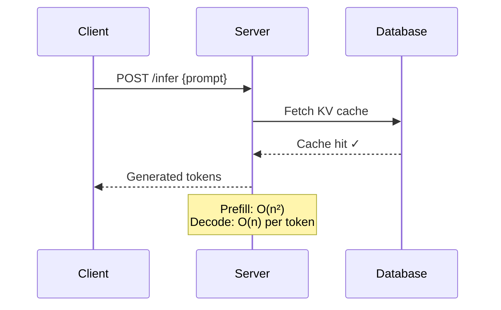

# fix-mermaid

Audit and rewrite mermaid diagrams in a blog post to be beautiful, readable, and theme-consistent.

## Usage
`/fix-mermaid <file-path>`

Example: `/fix-mermaid src/data/blog/mlops/vllm-trilogy-of-modern-llm-scaling.md`

---

## What this skill does

1. **Read** the specified markdown file
2. **Find** all ` ```mermaid ``` ` blocks
3. **Audit** each diagram for:
   - Nodes with labels that are too long (> 35 chars per line) — causes clipping
   - Missing `\n` line breaks in multi-word node labels
   - Missing `style` declarations for key/entry nodes
   - Subgraphs without descriptive titles
   - Diagrams with > 20 nodes (split or simplify)
   - Syntax errors (unclosed quotes, missing arrows)
4. **Rewrite** problematic diagrams following the rules below
5. **Add** italicized captions after each diagram if missing

---

## Mermaid Quality Rules

### Node Labels
- Max 35 chars per line. Use `\n` for breaks: `A["Multi-Head Attention\n(Q, K, V projections)"]`
- Always quote labels with special chars, parentheses, or line breaks
- Use `<small>` HTML sparingly for dimension annotations inside nodes

### Graph Direction
- `graph TD` (top-down): default for sequential pipelines, training loops
- `graph LR` (left-right): preferred for data flow, encoder→decoder
- `graph TB` same as TD — pick one and be consistent per article

### Node Shapes
- `[text]` — rectangle (default, process step)  
- `(text)` — rounded (data/state)
- `{text}` — diamond (decision)
- `[(text)]` — cylinder (database/storage)
- `((text))` — circle (start/end)
- `[/text/]` — parallelogram (I/O)

### Subgraphs
```
subgraph Title["🔷 Human-Readable Title"]
  ...
end
```
- Always add emoji for quick visual scanning
- Keep subgraph title ≤ 30 chars
- Use `direction LR` inside subgraph if it needs its own layout

### Styles
Apply to at least: entry nodes, exit nodes, and critical decision points.
```
style NodeId fill:#10b981,color:#fff,stroke:#059669,stroke-width:2px
```

Use these accent colors that match the site themes:
- Green (light theme accent): `#10b981` / `#059669`
- Amber (dark theme accent): `#f59e0b` / `#d97706`
- Purple (cyber accent): `#a855f7` / `#9333ea`
- Neutral bg: use `#f3f4f6` for light, don't hardcode dark bg

For multi-node color coding, use `classDef`:
```
classDef primary fill:#10b981,color:#fff,stroke:#059669
classDef secondary fill:#f3f4f6,color:#1a1a1a,stroke:#d1d5db
class NodeA,NodeB primary
class NodeC secondary
```

### Sequence Diagrams

- Use `participant X as Label` for short IDs with readable labels
- Use `->>` for sync calls, `-->>` for responses, `-)` for async
- Add `Note over` for important annotations

### Common Mistakes to Fix
| Bad | Good |
|-----|------|
| `A[This is a very long label that will definitely overflow]` | `A["This is a long\nlabel split here"]` |
| Missing diagram caption | `*Figure 2: Transformer block with AdaLN conditioning.*` |
| `graph TD` with > 15 nodes | Split into 2 focused diagrams |
| All nodes same color | Style entry/exit/decision nodes distinctly |
| `subgraph X` with no title | `subgraph X["📊 Descriptive Title"]` |

---

## Output

Rewrite the mermaid blocks in-place and report:
- How many diagrams were found
- What was changed in each
- Any diagrams that are already well-formed (no change needed)
