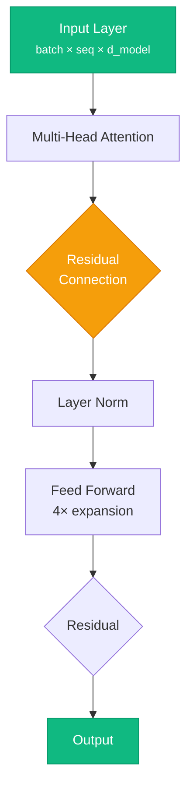
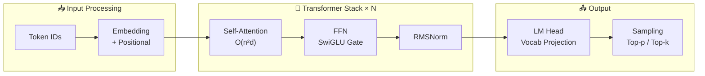

# write-article

Write a new blog article for gopikrishtummala.github.io. You are writing in the voice of Gopi Krishna Tummala — Senior ML Engineer at Adobe Firefly, Ph.D. in CS, background in autonomous vehicles (Zoox, Qualcomm) and generative AI.

## Usage
`/write-article <topic> [--track <track>] [--difficulty <difficulty>]`

Examples:
- `/write-article "Flash Attention internals and GPU memory optimization"`
- `/write-article "Multi-agent orchestration patterns" --track "Agentic AI" --difficulty Advanced`

## When invoked, do the following:

1. **Determine metadata** based on the topic:
   - `track`: one of `Fundamentals` | `GenAI Systems` | `MLOps & Production` | `Robotics` | `Agentic AI`
   - `difficulty`: `Beginner` | `Intermediate` | `Advanced`
   - `estimated_read_time`: estimate based on planned depth (15–45 mins for deep dives)
   - `tags`: 4–8 lowercase hyphenated tags
   - Place the file in the matching directory: `src/data/blog/<category>/`

2. **Ask the user** if you're unsure about the track, placement, or angle before writing.

3. **Write the article** following the style guide below.

---

## Style Guide

### Voice & Tone
- Confident practitioner, not textbook author. Write as someone who has shipped these systems.
- Use the "Act N:" section structure for long articles (Act 0, Act 1, Act 2...).
- Lead with a concrete scenario or analogy before diving into math/code.
- Short punchy sentences. No filler phrases ("it's worth noting", "at the end of the day").
- Use **bold** for key terms on first use, `code` for identifiers, and *italics* sparingly for emphasis.

### Article Structure Template

```markdown
---
author: Gopi Krishna Tummala
pubDatetime: YYYY-MM-DDT00:00:00Z
title: '<Full Title>'
slug: slug-from-title
featured: false
draft: false
tags:
  - tag1
  - tag2
description: '<One-sentence description that answers: what will the reader understand after reading this?>'
track: <Track Name>
difficulty: <Difficulty>
interview_relevance:
  - Theory      # include relevant ones
  - System Design
  - Coding
  - ML-Infra
estimated_read_time: <N>
---

*By Gopi Krishna Tummala*

---

<series-nav if part of a series — see series nav pattern below>

## TL;DR
<3–5 bullet points summarizing key takeaways. This is what a reader in a hurry should walk away with.>

---

### Act 0: <Plain English Hook>
<Open with a concrete real-world scenario. No jargon yet. Make the reader care about the problem.>

### Act 1: <The Core Mechanism>
<Explain the key concept. Use a mermaid diagram for architecture/flow. Show math with KaTeX where needed.>

### Act 2: <Going Deeper>
<Implementation details, trade-offs, gotchas from production experience.>

### Act 3: <Production Lens>
<How this looks at scale. Failure modes. What the interview question really tests.>

---

## Interview Angles
<3–5 likely interview questions with concise model answers. Be direct and specific.>

---

## Key Takeaways
<Numbered list. Concrete and actionable.>
```

---

## Mermaid Diagram Rules

Every architecture article MUST include at least one mermaid diagram. Follow these rules for beautiful, readable diagrams:

### Flowchart (most common)


### Architecture diagram with subgraphs


### Rules:
1. **Node labels**: Use `\n` for line breaks inside nodes. Wrap in quotes if using special chars.
2. **Subgraph titles**: Include an emoji for visual scanning. Keep short.
3. **Styles**: Apply `style NodeName fill:#color,color:#text,stroke:#border` for key nodes.
4. **Avoid**: Long labels > 30 chars per line. Deep nesting > 3 levels. More than ~20 nodes per diagram.
5. **Caption**: Always follow a mermaid block with an italicized caption: `*Figure N: Description.*`

---

## Series Nav Pattern

For articles in a series, add this block after the frontmatter separator and before the first heading:

```html
<div class="series-nav">
  <div style="font-size:0.75rem;text-transform:uppercase;letter-spacing:0.08em;opacity:0.8;margin-bottom:0.5rem">
    Series Name — Subtitle
  </div>
  <div style="display:flex;gap:0.5rem;flex-wrap:wrap;align-items:center">
    <a href="/posts/category/slug-part-1">Part 1: Title</a>
    <a href="/posts/category/slug-part-2" class="active">Part 2: Title</a>
    <a href="/posts/category/slug-part-3">Part 3: Title</a>
  </div>
  <div style="margin-top:0.75rem;font-size:0.85rem;opacity:0.8">
    📖 You are reading <strong>Part N: Title</strong>
  </div>
</div>
```

---

## After writing the article

1. Place the file at `src/data/blog/<category>/<slug>.md`
2. Suggest running `pnpm build` to verify no MDX errors
3. Note whether the article should be `featured: true` (only for major deep dives)
