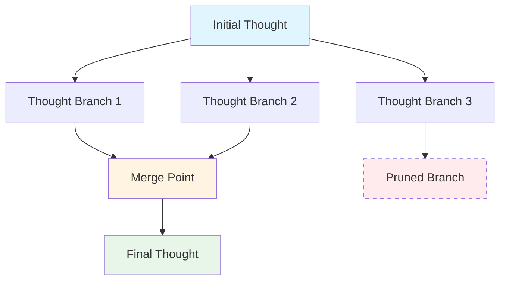
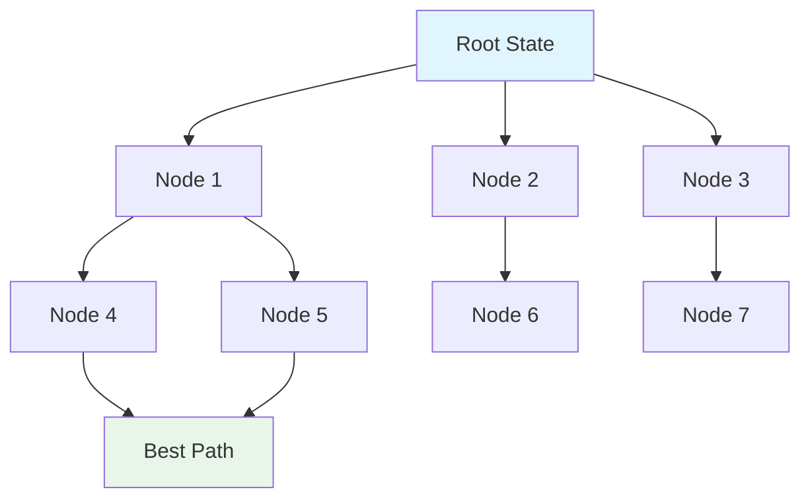

*By Gopi Krishna Tummala*

---

<div class="series-nav" style="background: linear-gradient(135deg, #667eea 0%, #764ba2 100%); color: white; padding: 1.5rem; border-radius: 12px; margin-bottom: 2rem; box-shadow: 0 4px 6px rgba(0,0,0,0.1);">
  <div style="font-size: 0.875rem; opacity: 0.9; margin-bottom: 0.5rem; text-transform: uppercase; letter-spacing: 0.05em;">Agentic AI Design Patterns Series</div>
  <div style="display: flex; gap: 0.75rem; flex-wrap: wrap; align-items: center;">
    <a href="/posts/agentic-ai-design-patterns-part-1" style="background: rgba(255,255,255,0.25); padding: 0.5rem 1rem; border-radius: 6px; text-decoration: none; color: white; font-weight: 600; border: 2px solid rgba(255,255,255,0.5);">Part 1: Foundations</a>
    <a href="/posts/agentic-ai-design-patterns-part-2" style="background: rgba(255,255,255,0.1); padding: 0.5rem 1rem; border-radius: 6px; text-decoration: none; color: white; opacity: 0.9;">Part 2: Production</a>
    <a href="/posts/agentic-ai-design-patterns-part-3" style="background: rgba(255,255,255,0.1); padding: 0.5rem 1rem; border-radius: 6px; text-decoration: none; color: white; opacity: 0.9;">Part 3: Specialized</a>
    <a href="/posts/agentic-ai-design-patterns-part-4" style="background: rgba(255,255,255,0.1); padding: 0.5rem 1rem; border-radius: 6px; text-decoration: none; color: white; opacity: 0.9;">Part 4: Failure Modes</a>
    <a href="/posts/agentic-ai-design-patterns-part-5" style="background: rgba(255,255,255,0.1); padding: 0.5rem 1rem; border-radius: 6px; text-decoration: none; color: white; opacity: 0.9;">Part 5: Production Guide</a>
  </div>
  <div style="margin-top: 0.75rem; font-size: 0.875rem; opacity: 0.8;">📖 You are reading <strong>Part 1: Foundations</strong> — Core patterns every agent needs</div>
</div>

# 🤖 The Cognitive Nexus: Agentic AI as the Engine of Complex Systems

## Introduction: From Generative Models to Autonomous Systems

The field of Artificial Intelligence is evolving from **Generative AI**—models designed to produce single, static outputs (text, images, code)—to **Agentic AI**—autonomous systems capable of **multi-step planning, iterative execution, and self-evaluation** in dynamic environments. This transition repositions the Large Language Model (LLM) from a passive content creator to an active, goal-directed **Cognitive Engine**.

The core of Agentic AI is the **Perceive → Plan → Act → Reflect** (or PRAR) loop. This self-governing workflow, inspired by established AI paradigms, allows agents to:

1. **Decompose Complex Goals:** Break a high-level user objective (e.g., "Implement a feature that improves database performance") into a logical sequence of actionable sub-tasks.

2. **Utilize Specialized Tools:** Dynamically select and orchestrate external functions, APIs, simulators, or databases to extend the agent's capabilities beyond its training data, a process known as **Tool Use** or **Tool Calling** (Yao et al., 2024; Schick et al., 2024).

3. **Self-Correction and Learning:** Employ **Reflection** mechanisms (Shinn et al., 2023) to critique intermediate results, identify errors (such as failed API calls or invalid output formats), and iteratively refine the strategy until the goal is achieved. This capacity for autonomous debugging is central to reliability.

This approach transforms the LLM into a sequential decision-maker that reasons about the environment and selects actions to achieve a long-term goal (Wang et al., 2023).

### **The Mathematical Foundation (Action Selection Policy)**

Formally, an agentic system's behavior is governed by a policy $\pi$:

$$
\pi(a_t | o_{\le t}, g, M)
$$

Where:

* $o_{\le t}$ = all observations (percepts, tool results) up to time $t$
* $g$ = the goal (high-level objective)
* $M$ = memory (episodic, semantic, and working context)
* $a_t$ = the action selected at time $t$ (e.g., thought, tool call, code execution)

This contrasts with a traditional LLM's static role as a next-token predictor.

---

## Core Agentic Design Patterns

Agentic AI systems rely on structured reasoning patterns to ensure reliability and minimize hallucination. The most fundamental pattern is the **ReAct (Reason and Act) loop** (Yao et al., 2023):

| Step | Pattern | Description | Function |
|:---|:---|:---|:---|
| 1. | **Thought/Reasoning** | The LLM analyzes the current observation, determines the next logical step, and decides if a tool is necessary. | Inference, Planning |
| 2. | **Action** | The agent executes the determined step, typically by calling a specialized function or API. | Execution, Tool Use |
| 3. | **Observation** | The agent receives the output or result from the action (e.g., the result of a code run or an API call). | Perception, Feedback |
| 4. | **Reflection** | An optional, but critical, meta-reasoning step where the agent critiques the Observation, identifies failures, and updates its internal plan for the next cycle. | Self-Correction, Debugging |

By enforcing this structured, verifiable cycle, agents inherently reduce hallucination because every major internal decision must be followed by an external, factual check (Observation).

---

## The Multiverse of Agency: Domain-Specific Applications

The agentic framework is powerful because it applies across various fields requiring multi-stage complexity and verifiable results.

### 🎮 Gaming and Creative Content

**Emergent Worlds and Dynamic NPCs:** Agent-based Non-Player Characters (NPCs) maintain long-term episodic memory and dynamic goals, allowing them to engage in social planning and create emergent, non-scripted narratives (Ramaseri-Chandra, 2023).

**Multi-Step Asset Editing:** In design pipelines (film, animation), agents coordinate complex, multi-modal edits. An agent can call a sequence of specialized tools (vision models, 3D renderers, color graders) and use reflection to ensure visual fidelity and style consistency across large sets of assets. Recent research demonstrates this through multi-agent frameworks like UniVA (Wu et al., 2025) for video creation, RefineEdit-Agent (Sun et al., 2025) for iterative image editing, and FilmAgent (Wang et al., 2025) for end-to-end film production.

### 🔬 Scientific Discovery and Engineering

**Compound Search and Materials Discovery:** The agent acts as an autonomous chemist. It performs literature review (via Retrieval-Augmented Generation/RAG), formulates a hypothesis for a new material or drug candidate, designs the optimal multi-step synthesis procedure, and can even interface with robotic labs to execute the experiment—closing the loop from theoretical planning to physical action.

**Electronic Design Automation (EDA):** Agents optimize electronic circuits or physical layouts based on high-level constraints (power, area). They use EDA simulation tools as their "tools," running iterative simulations and refining the design using Reinforcement Learning signals derived from the simulation outputs.

### 📐 Product Development and Code Generation

**Code Generation and Debugging Teams:** Multi-agent systems (e.g., Planner Agent, Coder Agent, Reviewer Agent) collaborate. The Reviewer Agent runs unit tests and static analysis. If tests fail, it provides the full traceback and error log as an "Observation," forcing the Coder Agent to self-debug and iterate without human intervention.

**Design Refinement and Optimization:** An agent can take a user-designed 3D model, run it through a structural simulator to check for stress points, and automatically suggest or implement design modifications to improve strength or reduce material usage, effectively performing autonomous engineering optimization.

---

---

## Series Outline: A Comprehensive Guide to Agentic AI Design Patterns

This series provides a systematic exploration of the architectural patterns that enable autonomous, reliable agentic systems. The content is organized into five parts:

### **Part 1: Foundations** (Current)
Covers the fundamental patterns that form the backbone of every agentic system:
- **ReAct Loop** — The basic reason-act-observe cycle
- **Plan-Execute-Reflect (PER)** — Hierarchical task decomposition
- **Tool Use & Tool Learning** — Dynamic tool selection and orchestration
- **Self-Consistency Sampling** — Ensemble reasoning for reliability
- **Graph-of-Thoughts (GoT)** — Non-linear reasoning structures
- **Search-Augmented Agents** — MCTS and systematic exploration

### **Part 2: Production Patterns**
Focuses on patterns essential for real-world deployment:
- **Memory Management** — Episodic, semantic, and working memory systems
- **Memory Compression** — Active memory rewriting and relevance filtering
- **Supervisor/Orchestrator** — The #1 production pattern for cost efficiency
- **Parallel Tool Execution** — Fan-out patterns for latency reduction
- **Hidden Reasoning** — Test-time compute scaling (o1-style)

### **Part 3: Specialized Patterns**
Advanced patterns for domain-specific applications:
- **Embodied Agent Loops** — Vision-language-action integration
- **3D Grounded Agents** — Scene graph reasoning for robotics
- **Imagination Loops** — World model simulation and planning
- **Multi-Agent Societies** — Specialized agent teams and protocols
- **Compensatory Reflexes** — Error recovery and automatic correction
- **Introspective Agents** — Self-debugging and constraint verification

### **Part 4: Failure Modes & Safety**
Engineering reality: how agents fail and how to prevent it:
- **Common Failure Modes** — Tool overuse, contextual amnesia, goal drift
- **Verifiable Agent Pipelines** — Safety-aware planning and uncertainty quantification
- **Failure Taxonomy** — Systematic classification of agent failures
- **Mitigation Strategies** — Production-ready safeguards

### **Part 5: Production Guide**
The 2025 practitioner's handbook:
- **2025 Trends** — SLMs, cost-aware agents, observability, distillation
- **Cost Cheat Sheet** — Real-world cost and reliability numbers
- **Case Study** — Complete agent workflow for a research task
- **Production Checklist** — What actually ships in 2025
- **State of the Field** — Where research is converging

---

## The Simplest Possible Picture

At its core, every agentic system implements a simple loop:

**Think → Act → Observe → Repeat**

This is the **ReAct** (Reason + Act) pattern—the "hello world" of agentic AI. While deceptively simple, getting this loop right is where 90% of the magic happens.

**In one sentence:** Agentic AI = LLM + memory + reasoning + tool use + feedback loops.

The patterns we explore in this series are all variations and enhancements of this fundamental loop, designed to handle the complexity, reliability, and cost requirements of production systems.

---

# **Core Agentic AI Design Patterns (2024-2025)**

---

## **Pattern #1 — The ReAct Loop (Reason + Act + Observe)**

This is the "hello world" design of LLM agents. It's the key-finding loop, but for everything.

### **The Loop:**

$$
\text{Thought}_t \rightarrow \text{Action}_t \rightarrow \text{Observation}_{t+1}
$$

Translation: Think → Do → See what happened → Think again.

### **ReAct Loop Flow:**


### **Example:**

Here's what it looks like inside the machine:

```
Thought: User wants cheapest flight to Austin.

Thought: I need prices, so I should search.

Action: call the flight-search tool with "Austin"

Observation: here are 50 flights, cheapest is Delta $187

Thought: That seems good, but let me double-check Southwest…

Action: call tool again with Southwest filter

Observation: actually $174!

Thought: Cool, that's the winner.

Final Answer: Book the Southwest flight for $174.
```

It's just the key-finding loop, but with airplane tickets instead of keys.

**Strengths:** You can see exactly what it's thinking (transparency). You can stop it if it goes wrong (controllability).

**Weakness:** Sometimes it talks too much and overthinks simple things. Like a teenager narrating every thought out loud.

### **Implementation:**

Modern frameworks implement ReAct with a simple interface:

```python
from langchain.agents import AgentExecutor, create_react_agent
from langchain_openai import ChatOpenAI

# Initialize the agent with tools
llm = ChatOpenAI(model="gpt-4")
tools = [search_tool, calculator_tool, code_executor]

# Create ReAct agent
agent = create_react_agent(llm, tools)
agent_executor = AgentExecutor(agent=agent, max_iterations=10)

# Run the agent
result = agent_executor.invoke({
    "input": "Book me the cheapest flight to Austin"
})
```

The agent automatically alternates between reasoning (generating thoughts) and acting (calling tools) until it reaches a final answer or hits the iteration limit.

### **Citation:**

*Yao et al. (2023). "ReAct: Synergizing Reasoning and Acting in Language Models." [arXiv:2210.03629](https://arxiv.org/abs/2210.03629)*

---

## **Pattern #2 — Plan-Execute-Reflect (PER)**

Sometimes the omelette is more complicated: you want a three-course dinner for six people.

You don't want one frantic parrot running around the kitchen. You want:

- One calm **chef** who writes the full menu and timeline on a whiteboard (the Planner)

- Several **cooks** who actually chop onions and stir sauce (Executors)

- One annoying **food critic** who tastes everything and yells "THIS SOUP HAS NO SOUL!" (Reflector)

Only when the critic finally says "Okay, I guess this is edible" do you serve the guests.

This is the second big pattern: **Plan → Execute → Reflect**, repeated until the critic shuts up.

It sounds overkill, but it stops the agent from serving raw chicken because it got excited and skipped steps.

### **How It Works:**

Formally:

$$
\pi_{plan}, \pi_{exec}, \pi_{reflect}
$$

### **Plan-Execute-Reflect Flow:**


### **Implementation:**

LangGraph's StateGraph provides a clean abstraction for PER:

```python
from langgraph.graph import StateGraph, END
from typing import TypedDict

class AgentState(TypedDict):
    goal: str
    plan: list[str]
    results: dict
    reflection: str

def planner(state: AgentState) -> AgentState:
    """Break goal into sub-tasks"""
    plan = llm.invoke(f"Create a plan for: {state['goal']}")
    return {"plan": parse_plan(plan)}

def executor(state: AgentState) -> AgentState:
    """Execute each task in the plan"""
    results = {}
    for task in state['plan']:
        results[task] = execute_task(task)
    return {"results": results}

def reflector(state: AgentState) -> AgentState:
    """Critique results against original goal"""
    reflection = llm.invoke(
        f"Goal: {state['goal']}\n"
        f"Results: {state['results']}\n"
        "Does this satisfy the goal? What's missing?"
    )
    return {"reflection": reflection}

# Build the graph
workflow = StateGraph(AgentState)
workflow.add_node("planner", planner)
workflow.add_node("executor", executor)
workflow.add_node("reflector", reflector)
workflow.set_entry_point("planner")
workflow.add_edge("planner", "executor")
workflow.add_edge("executor", "reflector")
workflow.add_conditional_edges("reflector", 
    lambda x: "executor" if needs_rework(x) else END)
```

Modern frameworks like **OpenAI's Swarm**, LangGraph, and Instructor patterns use this.

### **Citation:**

*Shinn et al. (2023). "Reflexion: Language Agents with Verbal Reinforcement Learning." [arXiv:2303.11366](https://arxiv.org/abs/2303.11366)*

---

## **Pattern #3 — Tools Are Just Extra Hands**

Imagine you're a carpenter with no arms. Someone glues a hammer, a saw, and a drill to long sticks and says "Here, use these."

At first you wave the sticks around like a drunk octopus. After a while you learn exactly when to pick the hammer-stick versus the saw-stick.

That's what "tool use" is for an AI. The tools are:

- Google search
- a calculator
- your email inbox
- a code-running sandbox
- the mouse and keyboard of your computer

The agent doesn't have them built in — they're just extra hands it can grab when needed.

The clever part: modern agents don't wait for you to say "use the calculator." They decide themselves, the same way you don't ask permission to pick up a hammer when you see a nail.

**In math-speak:**

$$
\arg\max_{a_t \in \{tools\}} \text{usefulness}(a_t | context)
$$

Translation: "Which tool is most useful right now?" The agent picks the best one automatically.

### Tools include:

* Web search

* Code execution

* Databases

* Embeddings

* Email/calendar

* Vision models

* Simulators

### **Implementation:**

Using Pydantic/Instructor pattern ensures type-safe tool calls:

```python
from pydantic import BaseModel
from instructor import patch

class SearchTool(BaseModel):
    """Search the web for information"""
    query: str
    max_results: int = 5

class CalculatorTool(BaseModel):
    """Evaluate a mathematical expression"""
    expression: str

# Patch the LLM to use structured outputs
client = patch(ChatOpenAI())
tools = [SearchTool, CalculatorTool]

# The LLM automatically chooses and calls tools
response = client.chat.completions.create(
    model="gpt-4",
    response_format=SearchTool,  # Enforces schema
    messages=[{"role": "user", "content": "Find recent papers on agentic AI"}]
)

# Type-safe tool call
search_result = response.parsed  # Automatically a SearchTool instance
```

This is crucial for enterprise AI.

### **Citation:**

*Schick et al. (2023). "Toolformer: Language Models Can Teach Themselves to Use Tools." [arXiv:2302.04761](https://arxiv.org/abs/2302.04761)*

---

## **Tool Router Pattern (Simpler Alternative to RL-Based Tool Use)**

**Note:** Full PPO training on tool policies is rarely used in production (2025). Instead, most teams use a simple **Tool Router**—a lightweight classifier that decides which tool/specialist to call.

### **Why Tool Router Instead of RL:**

* **Simplicity:** Easy to implement and debug
* **Fast:** No training required, works immediately
* **Production-Ready:** Used in 90%+ of deployments
* **Effective:** 85-90% accuracy for tool selection

### **Implementation:**

```python
from sklearn.ensemble import RandomForestClassifier
import numpy as np

class ToolRouter:
    """Lightweight classifier for tool selection"""
    def __init__(self):
        self.classifier = RandomForestClassifier(n_estimators=100)
        self.tool_features = {}  # Pre-computed tool embeddings
    
    def route(self, query: str, available_tools: list) -> str:
        """Route query to best tool"""
        # Extract features from query
        features = self.extract_features(query)
        
        # Predict best tool
        tool_scores = {}
        for tool in available_tools:
            score = self.classifier.predict_proba([features])[0]
            tool_scores[tool] = score
        
        return max(tool_scores, key=tool_scores.get)
    
    def extract_features(self, query: str) -> np.array:
        """Extract features for routing"""
        # Simple keyword-based features (can use embeddings)
        features = [
            "search" in query.lower(),
            "calculate" in query.lower(),
            "code" in query.lower(),
            "database" in query.lower(),
            len(query),
            query.count("?"),
        ]
        return np.array(features)
```

**For production:** Use this simple router instead of full RL training. It's faster, cheaper, and easier to maintain.

---

## **Pattern #4 — Self-Consistency Sampling**

You know how when you're not sure about something, you ask multiple people and go with what most of them say? That's this pattern.

Instead of picking a single chain of thought, agents generate many and vote.

$$
y = \text{mode} \left(\{ \pi_\theta(x)^{(i)} \}_{i=1..k} \right)
$$

Translation: "Ask 10 experts instead of 1, then pick the most common answer."

### **Why This Works:**

### **Implementation:**

This is an efficient form of Monte Carlo Tree Search (MCTS) applied to the thought space:

```python
def self_consistency_sampling(prompt: str, n_samples: int = 10):
    """Generate multiple reasoning paths and vote"""
    samples = []
    
    for _ in range(n_samples):
        # Generate a chain of thought
        response = llm.generate(
            prompt,
            temperature=0.7,  # Higher temp = more diversity
            max_tokens=500
        )
        samples.append(extract_answer(response))
    
    # Return the most common answer
    from collections import Counter
    return Counter(samples).most_common(1)[0][0]

# Example: Math problem
question = "Solve: 2x + 5 = 15"
answer = self_consistency_sampling(question, n_samples=10)
# If 8/10 samples say x=5, that's the answer
```

Used in:

* Math reasoning

* Code generation

* Planning

* Safety filtering

### **Citation:**

*Wang et al. (2022). "Self-Consistency Improves Chain of Thought Reasoning in Language Models." [arXiv:2203.11171](https://arxiv.org/abs/2203.11171)*

---

## **Pattern #5 — Graph-of-Thoughts (GoT)**

You know how when you're brainstorming, you don't think in a straight line? You have one idea, it branches into three, two of those merge back together, you cross out the bad one, and keep going.

That's Graph-of-Thoughts. Instead of linear reasoning (A → B → C), thoughts form a **graph**:

* **Parallel branches** — explore multiple ideas at once
* **Merging** — combine good ideas from different paths
* **Pruning** — cut off dead ends
* **Revising** — go back and fix earlier thoughts

### **The Analogy:**

Brainstorming on a whiteboard with arrows and clusters. Like a mind map, but the AI actually uses it to solve problems.

### **Graph-of-Thoughts Structure:**



### **Implementation:**

GoT allows parallel exploration and merging of reasoning paths:

```python
from typing import List, Set

class ThoughtNode:
    def __init__(self, content: str, score: float):
        self.content = content
        self.score = score
        self.children: List[ThoughtNode] = []
        self.parents: List[ThoughtNode] = []

def graph_of_thoughts(initial_prompt: str, max_depth: int = 3):
    """Build a graph of reasoning paths"""
    root = ThoughtNode(initial_prompt, 0.0)
    frontier = [root]
    
    for depth in range(max_depth):
        # Expand all nodes in parallel
        new_nodes = []
        for node in frontier:
            # Generate multiple child thoughts
            children = generate_thoughts(node.content, n=3)
            for child_content, score in children:
                child = ThoughtNode(child_content, score)
                child.parents.append(node)
                node.children.append(child)
                new_nodes.append(child)
        
        # Merge similar thoughts
        merged = merge_similar_thoughts(new_nodes)
        # Prune low-scoring branches
        frontier = [n for n in merged if n.score > threshold]
    
    # Extract best path
    return extract_best_path(root)
```

Modern agent frameworks now implement explicit DAG-based reasoning.

### **Citation:**

*Besta et al. (2023). "Graph of Thoughts: Solving Elaborate Problems with Large Language Models." [arXiv:2308.09687](https://arxiv.org/abs/2308.09687)*

---

## **Pattern #12 — Search-Augmented Agents (When Thoughts Become a Tree)**

Instead of single ReAct trajectories or self-consistency voting, modern agents use **systematic search** over the space of possible reasoning paths.

### **Analogy:**

Like a chess engine exploring possible moves, but for reasoning and planning.

### **MCTS Search Tree:**



### **Formal Structure:**

Each search node represents:

$$
\text{node} = (s, a, r, s', \text{thought})
$$

Where:
* $s$ = current state
* $a$ = proposed action
* $r$ = predicted reward
* $s'$ = predicted next state
* $\text{thought}$ = LLM-generated reasoning

### **Implementation:**

LLM-MCTS (Monte-Carlo Tree Search with LLM guidance):

```python
from collections import defaultdict
import numpy as np

class SearchNode:
    def __init__(self, state, thought, action=None):
        self.state = state
        self.thought = thought
        self.action = action
        self.visits = 0
        self.value = 0.0
        self.children = []
        self.parent = None

def llm_mcts(root_state, goal, max_iterations=100):
    """Monte-Carlo Tree Search guided by LLM"""
    root = SearchNode(root_state, llm.generate_thought(root_state, goal))
    
    for _ in range(max_iterations):
        # Selection: traverse to leaf
        node = root
        while node.children:
            node = select_best_child(node)  # UCB1 or similar
        
        # Expansion: LLM proposes actions
        if not is_terminal(node.state):
            actions = llm.propose_actions(node.state, goal)
            for action in actions:
                next_state = world_model.predict(node.state, action)
                child = SearchNode(next_state, 
                    llm.generate_thought(next_state, goal), action)
                child.parent = node
                node.children.append(child)
        
        # Simulation: roll out to terminal
        value = simulate_rollout(node, goal)
        
        # Backpropagation: update values
        backpropagate(node, value)
    
    # Return best action
    return max(root.children, key=lambda n: n.value / n.visits).action

def world_model_predict(state, action):
    """Learned or LLM-based world model"""
    # Can be a neural network, physics simulator, or LLM
    return model.predict(state, action)

def simulate_rollout(node, goal, max_depth=10):
    """Roll out trajectory and evaluate"""
    current = node
    for depth in range(max_depth):
        if is_terminal(current.state):
            return evaluate(current.state, goal)
        action = llm.sample_action(current.state, goal)
        current = world_model_predict(current.state, action)
    return evaluate(current.state, goal)
```

### **Key Advantages:**

* **Systematic exploration** vs. single-shot reasoning
* **World model integration** for accurate predictions
* **Optimal path selection** via search
* **Handles long-horizon planning** better than ReAct alone

### **Used In:**

* Robotics (manipulation, navigation)
* Theorem proving
* Autonomous coding (multi-file refactoring)
* Web navigation (complex multi-step tasks)
* Game playing (Chess, Go, strategy games)

### **Citation:**

*Recent work combining LLMs with MCTS and learned world models (2024-2025)*

---

## **References**

**Shinn, K., et al. (2023).** Reflexion: An Autonomous Agent with Dynamic Memory and Self-Evaluation.  
[arXiv:2303.11366](https://arxiv.org/abs/2303.11366)

**Wang, G., et al. (2023).** Plan-and-Solve: Towards a Decision-Oriented Approach to LLM-Based Task Execution.  
[arXiv:2305.10174](https://arxiv.org/abs/2305.10174)

**Yao, S., et al. (2023).** ReAct: Synergizing Reasoning and Acting in Language Models.  
[arXiv:2210.03629](https://arxiv.org/abs/2210.03629)

**Yao, S., et al. (2024).** Tool Use: Large Language Models as Agents That Use External Tools.  
[arXiv:2402.13962](https://arxiv.org/abs/2402.13962)

**Ramaseri-Chandra, A. N. (2023).** Generative AI-based Non-person Character (NPC) For Navigating Virtual Worlds.  
*Cyber Awareness and Research Symposium 2023, University of North Dakota.*  
[ResearchGate](https://www.researchgate.net/publication/376030547_Generative_AI-based_Non-person_Character_NPC_For_Navigating_Generative_AI-based_Non-person_Character_NPC_For_Navigating_Virtual_Worlds_Virtual_Worlds)

**Wu, Z., et al. (2025).** UniVA: Universal Video Agent towards Open-Source Next-Generation Video Generalist.  
*Introduces a "Plan-and-Act" dual-agent architecture for automated and self-reflective video creation.*  
[ResearchGate](https://www.researchgate.net/publication/397521474_UniVA_Universal_Video_Agent_towards_Open-Source_Next-Generation_Video_Generalist)

**Sun, S., et al. (2025).** An LLM-LVLM Driven Agent for Iterative and Fine-Grained Image Editing.  
*LLM-LVLM driven agent for iterative and fine-grained image editing with planning and execution.*  
[arXiv:2508.17435](https://arxiv.org/html/2508.17435v1)

**Wang, J., et al. (2025).** FilmAgent: A Multi-Agent Framework for End-to-End Film Production.  
*Multi-agent framework designed for end-to-end film production, from script to final output.*  
[arXiv](https://arxiv.org/html/2501.12909v1)

**Additional References on Multi-Agent Systems and Reflection:**

- **Anim-Director:** A Large Multimodal Model Powered Agent for Controllable Animation Video Generation.  
  [ResearchGate](https://www.researchgate.net/publication/386398237_Anim-Director_A_Large_Multimodal_Model_Powered_Agent_for_Controllable_Animation_Video_Generation)

- **Reflection in AI Agents:** Research on feedback loops, memory systems, and explicit self-critique in agent systems.  
  See: [Akira AI Blog](https://www.akira.ai/blog/reflection-agent-prompting), [DeepLearning.AI](https://www.deeplearning.ai/the-batch/agentic-design-patterns-part-2-reflection/)

- **Commercial Tools:** Adobe Creative Cloud (Sensei), RunwayML, Descript, Unreal Engine 5.4 (Modular Control Rig) demonstrate AI-driven automation in professional creative pipelines.

---

<div class="series-nav" style="background: linear-gradient(135deg, #667eea 0%, #764ba2 100%); color: white; padding: 1.5rem; border-radius: 12px; margin-top: 3rem; box-shadow: 0 4px 6px rgba(0,0,0,0.1);">
  <div style="font-size: 0.875rem; opacity: 0.9; margin-bottom: 0.5rem; text-transform: uppercase; letter-spacing: 0.05em;">Continue Reading</div>
  <div style="display: flex; gap: 0.75rem; flex-wrap: wrap; align-items: center;">
    <a href="/posts/agentic-ai-design-patterns-part-2" style="background: rgba(255,255,255,0.25); padding: 0.75rem 1.5rem; border-radius: 6px; text-decoration: none; color: white; font-weight: 600; border: 2px solid rgba(255,255,255,0.5);">→ Next: Part 2: Production Patterns</a>
  </div>
  <div style="margin-top: 0.75rem; font-size: 0.875rem; opacity: 0.8;">Learn about memory management, supervisor patterns, parallel execution, and hidden reasoning</div>
</div>

