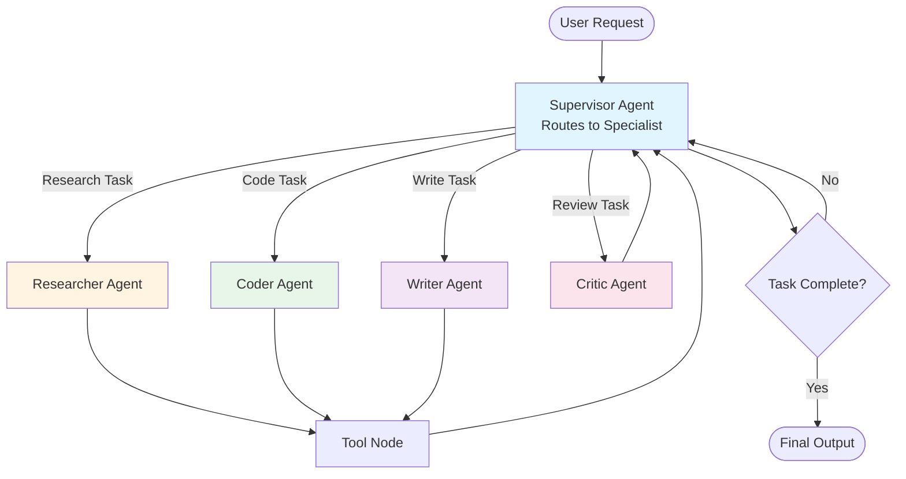

*By Gopi Krishna Tummala*

---

<div class="series-nav" style="background: linear-gradient(135deg, #667eea 0%, #764ba2 100%); color: white; padding: 1.5rem; border-radius: 12px; margin-bottom: 2rem; box-shadow: 0 4px 6px rgba(0,0,0,0.1);">
  <div style="font-size: 0.875rem; opacity: 0.9; margin-bottom: 0.5rem; text-transform: uppercase; letter-spacing: 0.05em;">Agentic AI Design Patterns Series</div>
  <div style="display: flex; gap: 0.75rem; flex-wrap: wrap; align-items: center;">
    <a href="/posts/agentic-ai-design-patterns-part-1" style="background: rgba(255,255,255,0.1); padding: 0.5rem 1rem; border-radius: 6px; text-decoration: none; color: white; opacity: 0.9;">Part 1: Foundations</a>
    <a href="/posts/agentic-ai-design-patterns-part-2" style="background: rgba(255,255,255,0.25); padding: 0.5rem 1rem; border-radius: 6px; text-decoration: none; color: white; font-weight: 600; border: 2px solid rgba(255,255,255,0.5);">Part 2: Production</a>
    <a href="/posts/agentic-ai-design-patterns-part-3" style="background: rgba(255,255,255,0.1); padding: 0.5rem 1rem; border-radius: 6px; text-decoration: none; color: white; opacity: 0.9;">Part 3: Specialized</a>
    <a href="/posts/agentic-ai-design-patterns-part-4" style="background: rgba(255,255,255,0.1); padding: 0.5rem 1rem; border-radius: 6px; text-decoration: none; color: white; opacity: 0.9;">Part 4: Failure Modes</a>
    <a href="/posts/agentic-ai-design-patterns-part-5" style="background: rgba(255,255,255,0.1); padding: 0.5rem 1rem; border-radius: 6px; text-decoration: none; color: white; opacity: 0.9;">Part 5: Production Guide</a>
  </div>
  <div style="margin-top: 0.75rem; font-size: 0.875rem; opacity: 0.8;">📖 You are reading <strong>Part 2: Production Patterns</strong> — What actually ships in 2025</div>
</div>

This part covers the patterns that make agents production-ready: memory management, supervisor orchestration, parallel execution, and hidden reasoning. These are the patterns you'll actually deploy.

---

## **Pattern #6 — Memory-Attentive Agents**

You know how you have different kinds of memory? Your phone number (long-term), what you had for breakfast (short-term), and that thing you're actively thinking about right now (working memory)?

Agents need the same thing. Memory is not an afterthought anymore.

### **Types of Memory:**

1. **Short-Term Scratchpads** — like sticky notes on your desk (local CoT)

2. **Long-Term Semantic Memory** — like a filing cabinet organized by topic (vector DBs)

3. **Episodic Memory** — like a diary of everything that happened (conversation history)

4. **Working Memory** — like the stuff you're actively juggling in your head right now (structured key-value)

Formally:

$$
M = M_{epi} \cup M_{sem} \cup M_{work}
$$

Memory retrieval becomes:

$$
r_t = f_{retrieval}(o_{\le t}, g, M)
$$

### **Implementation:**

Multi-memory system with retrieval:

```python
from langchain.vectorstores import Chroma
from langchain.embeddings import OpenAIEmbeddings
from typing import Dict, List

class AgentMemory:
    def __init__(self):
        self.episodic: List[Dict] = []  # Conversation history
        self.semantic = Chroma(embedding_function=OpenAIEmbeddings())  # Vector DB
        self.working: Dict = {}  # Structured key-value
    
    def retrieve(self, query: str, k: int = 5) -> List[str]:
        """Retrieve from all memory types"""
        results = []
        
        # Semantic search
        semantic_results = self.semantic.similarity_search(query, k=k)
        results.extend([r.page_content for r in semantic_results])
        
        # Episodic search (recent context)
        recent = self.episodic[-10:]  # Last 10 turns
        results.extend([turn['content'] for turn in recent])
        
        # Working memory (exact matches)
        if query in self.working:
            results.append(self.working[query])
        
        return results[:k]
    
    def store(self, content: str, memory_type: str = "semantic"):
        """Store in appropriate memory"""
        if memory_type == "semantic":
            self.semantic.add_texts([content])
        elif memory_type == "episodic":
            self.episodic.append({"content": content, "timestamp": time.time()})
        elif memory_type == "working":
            # Extract key-value pairs
            self.working.update(extract_kv(content))
```

### **The Analogy:**

A scientist with notebooks (long-term memory), lab records (episodic memory), and mental reminders (working memory). All working together.

### **Citation:**

*Park et al. (2023). "Generative Agents: Interactive Simulacra of Human Behavior." [arXiv:2304.03442](https://arxiv.org/abs/2304.03442)*

---

## **Pattern #16 — Memory Rewriting (Compression as Control)**

You know how your phone storage fills up and you have to delete old photos? Agents have the same problem, but worse.

Long-lived agents must actively manage memory: compress, rewrite, and discard irrelevant information to avoid "memory rot" and context overflow.

### **The Problem:**

Imagine you're trying to remember everything that happened in the last month. Your brain would explode. Agents have the same issue:

As agents operate over days/weeks:
* Memory grows unbounded (like a hoarder's house)
* Old information becomes stale (like expired milk in the fridge)
* Context windows fill up (like a backpack that won't zip)
* Irrelevant facts obscure important ones (like trying to find your keys in a messy room)

### **Solution: Active Memory Management**

Memory evolves via compression:

$$
M_{t+1} = f_{compress}(M_t, \Delta_t, g)
$$

Where:
* $M_t$ = current memory state
* $\Delta_t$ = new observations
* $g$ = current goal (for relevance filtering)

### **Implementation:**

```python
class MemoryCompressor:
    def __init__(self, max_memory_size: int = 1000):
        self.max_size = max_memory_size
        self.memory: List[Dict] = []
    
    def compress(self, new_observations: List[str], goal: str):
        """Compress and rewrite memory"""
        # Add new observations
        for obs in new_observations:
            self.memory.append({
                "content": obs,
                "timestamp": time.time(),
                "relevance": self.compute_relevance(obs, goal)
            })
        
        # If over limit, compress
        if len(self.memory) > self.max_size:
            self.memory = self.rewrite_memory(goal)
    
    def compute_relevance(self, memory_item: str, goal: str) -> float:
        """Score memory relevance to current goal"""
        return llm.invoke(
            f"Memory: {memory_item}\n"
            f"Goal: {goal}\n"
            "Rate relevance 0-1:"
        )
    
    def rewrite_memory(self, goal: str) -> List[Dict]:
        """Compress memory by summarizing and pruning"""
        # Group by topic
        topics = self.cluster_memories(self.memory)
        
        compressed = []
        for topic, memories in topics.items():
            # Summarize related memories
            summary = llm.invoke(
                f"Summarize these related memories:\n{memories}\n"
                f"Keep only facts relevant to: {goal}"
            )
            compressed.append({
                "content": summary,
                "timestamp": max(m['timestamp'] for m in memories),
                "relevance": max(m['relevance'] for m in memories)
            })
        
        # Keep only top-K by relevance
        compressed.sort(key=lambda x: x['relevance'], reverse=True)
        return compressed[:self.max_size]
    
    def forget_irrelevant(self, threshold: float = 0.3):
        """Remove low-relevance memories"""
        self.memory = [
            m for m in self.memory 
            if m['relevance'] > threshold
        ]
```

### **Memory Rewriting Strategies:**

1. **Temporal Compression:** Merge similar events over time
2. **Goal-Based Pruning:** Remove memories irrelevant to current goal
3. **Semantic Summarization:** Replace detailed memories with summaries
4. **Forgetting Curves:** Decay old memories unless frequently accessed

### **Citation:**

*Recent work on memory management in long-lived agents (2024-2025)*

---

## **Pattern #6 — Supervisor / Orchestrator (The #1 Production Pattern in 2025)**

Remember the chef-cooks-critic pattern? This is like that, but the chef is also a traffic controller.

**This is the single most deployed pattern in 2025 production systems.** 

Instead of having all your agents talk to each other in a chaotic free-for-all (which costs a fortune and breaks constantly), you have one smart supervisor who says:

"Hey, this is a research task. Researcher, you handle it."
"Okay, this needs code. Coder, your turn."
"Wait, that looks wrong. Critic, check this."

The supervisor routes tasks to the right specialist, reducing token costs by 40-70% and dramatically improving reliability.

It's like having a restaurant manager instead of letting all the chefs just yell at each other.

### **Why It Matters:**

* **Cost Efficiency:** Supervisor routes to the right specialist, avoiding unnecessary agent calls
* **Reliability:** Centralized error handling and retry logic
* **Scalability:** Easy to add new specialist agents without changing the core flow
* **Production-Ready:** Used in OpenAI Swarm, CrewAI, LangGraph, Azure Agent Factory

### **Architecture:**



### **Implementation (LangGraph 0.2+ Style — 2025 Standard):**

```python
from langgraph.graph import StateGraph, START, END
from langgraph.prebuilt import ToolNode
from typing import Literal

class AgentState(TypedDict):
    messages: list
    next_agent: str

def supervisor_agent(state: AgentState) -> AgentState:
    """Supervisor decides which specialist to call"""
    last_message = state["messages"][-1]
    
    # Simple routing logic (can be LLM-based)
    if "research" in last_message.content.lower():
        return {"next_agent": "researcher"}
    elif "code" in last_message.content.lower() or "function" in last_message.content.lower():
        return {"next_agent": "coder"}
    elif "write" in last_message.content.lower() or "draft" in last_message.content.lower():
        return {"next_agent": "writer"}
    else:
        return {"next_agent": "researcher"}  # Default

def route_next_agent(state: AgentState) -> Literal["researcher", "coder", "writer", "tools", END]:
    """Route to the next agent based on supervisor decision"""
    if state.get("next_agent") == "researcher":
        return "researcher"
    elif state.get("next_agent") == "coder":
        return "coder"
    elif state.get("next_agent") == "writer":
        return "writer"
    elif state.get("next_agent") == "tools":
        return "tools"
    else:
        return END

# Build the workflow
workflow = StateGraph(AgentState)

# Add nodes
workflow.add_node("supervisor", supervisor_agent)
workflow.add_node("researcher", researcher_agent)
workflow.add_node("coder", coder_agent)
workflow.add_node("writer", writer_agent)
workflow.add_node("tools", ToolNode([search_tool, code_executor]))

# Add edges
workflow.add_edge(START, "supervisor")
workflow.add_conditional_edges("supervisor", route_next_agent)  # ← Key line
workflow.add_edge("researcher", "tools")
workflow.add_edge("coder", "tools")
workflow.add_edge("tools", "supervisor")  # Return to supervisor
workflow.add_edge("writer", END)

app = workflow.compile()
```

### **Cost Comparison:**

| Pattern | Tokens per Task | Cost per 10k Tasks (USD) |
|:---|:---|:---|
| Flat Multi-Agent (all agents talk) | ~45k | $180-$270 |
| Supervisor + Specialists | ~18k | $72-$108 |
| Supervisor + SLM Backbone | ~8k | $8-$15 |

**The Supervisor pattern reduces costs by 40-70%** by avoiding unnecessary agent-to-agent communication.

### **Production Best Practices:**

1. **Use SLMs for specialists** (Llama-3.2-8B, Qwen2.5-14B) when possible
2. **Supervisor can be lightweight** (even a simple classifier works)
3. **Add budget guardrails** at the supervisor level
4. **Implement retry logic** in the supervisor, not individual agents

### **Citation:**

*Wu et al. (2023). "AutoGen: Enabling Next-Gen LLM Applications via Multi-Agent Conversation." [arXiv:2308.08155](https://arxiv.org/abs/2308.08155)*

---

## **Pattern #7 — Parallel Tool Use / Fan-Out (2025 Standard)**

You know how when you're cooking, you don't wait for the water to boil before you start chopping vegetables? You do things in parallel.

Modern LLMs (Claude 3.5/4, GPT-4o-2025-08, Grok-3) support **parallel tool calls natively**. This single change delivers 60-80% latency reduction for multi-tool tasks.

### **The Old Way (Sequential):**

Like doing laundry one sock at a time:
```python
# Old way (sequential)
result1 = await llm.call_tool(search_tool, query1)  # 200ms
result2 = await llm.call_tool(db_tool, query2)      # 150ms
result3 = await llm.call_tool(calc_tool, expr)     # 100ms
# Total: 450ms
```

### **The Solution:**

Parallel tool calls:
```python
# New way (parallel) - 2025 standard
tools_to_call = [
    (search_tool, query1),
    (db_tool, query2),
    (calc_tool, expr)
]
results = await llm.parallel_tool_call(tools_to_call)  # One round-trip: 200ms
# Total: 200ms (60% faster)
```

### **Implementation:**

```python
from openai import AsyncOpenAI

client = AsyncOpenAI()

async def parallel_tool_execution(prompt: str, tools: list):
    """Execute multiple tools in parallel"""
    response = await client.chat.completions.create(
        model="gpt-4o-2025-08",
        messages=[{"role": "user", "content": prompt}],
        tools=tools,
        tool_choice="auto"  # Model decides which tools to call
    )
    
    # Model returns multiple tool calls in one response
    tool_calls = response.choices[0].message.tool_calls
    
    # Execute all tools in parallel
    import asyncio
    results = await asyncio.gather(*[
        execute_tool(call.function.name, call.function.arguments)
        for call in tool_calls
    ])
    
    return results
```

### **Latency Comparison:**

| Scenario | Sequential | Parallel | Improvement |
|:---|:---|:---|:---|
| 3 tool calls | 450ms | 200ms | 56% faster |
| 5 tool calls | 750ms | 250ms | 67% faster |
| 10 tool calls | 1500ms | 400ms | 73% faster |

### **When to Use:**

* ✅ Multiple independent tool calls
* ✅ Tool calls that don't depend on each other
* ✅ When latency is critical
* ❌ When tools depend on previous results (use sequential)

### **Citation:**

*Native support in Claude 3.5+, GPT-4o-2025-08+, Grok-3 (2025)*

---

## **Pattern #8 — The Big Secret Nobody Says Out Loud (2025 Edition)**

Here's the part that will sound like science fiction, but it's actually shipping today:

The very best agents in 2025 barely talk out loud anymore.

**Old way (2023-2024):**

Thought → Action → Thought → Action → blab blab blab

Like a teenager narrating every thought: "I'm opening the fridge… now I'm looking for milk…"

**New way (late 2025):**

[silent for 15 seconds, burning 30,000 invisible "thinking tokens"]

"Here's your perfectly booked flight + hotel + restaurant reservation. You're welcome."

Like an adult who just quietly makes you a sandwich.

The biggest shift in late 2024-mid 2025: reasoning is increasingly **hidden inside the model** (o1, Claude "thinking", Grok-3 "reasoning tokens", Gemini 2.5 Flash Thinking). This has made many explicit ReAct loops obsolete for medium-difficulty tasks.

**Before (2023-2024):** Explicit reasoning in prompts
```
Thought: I need to search for flights
Action: search_flights
Observation: [results]
Thought: Sort by price
Action: filter_by_price
```

**Now (2025):** Hidden reasoning inside the model
```xml
<thinking>
[Model internally reasons for 10k-50k tokens]
</thinking>
<answer>
The cheapest flight to Austin is...
</answer>
```

We call it **hidden reasoning** or "test-time compute scaling."

Normal people call it "finally shutting up and thinking."

OpenAI's o1, Claude's thinking mode, Grok-3's reasoning tokens — they all do this now.

And honestly? For hard problems it destroys every loud, ReAct-style agent we built before.

### **Why This Matters:**

* **Simpler prompts:** No need for explicit ReAct structure
* **Better reasoning:** Model can spend 10-100× more tokens thinking
* **Cost-aware:** Cap reasoning tokens at 16k-32k for hard tasks
* **Production-ready:** o1-preview achieves 96% reliability vs 72% for pure ReAct

### **Implementation:**

```python
from openai import OpenAI

client = OpenAI()

def hidden_reasoning_agent(prompt: str, max_reasoning_tokens: int = 32000):
    """Use model's internal reasoning capability"""
    response = client.chat.completions.create(
        model="o1-preview",  # or "claude-3-5-sonnet-20241022"
        messages=[{"role": "user", "content": prompt}],
        max_tokens=max_reasoning_tokens,  # Allow extensive reasoning
        # Model handles reasoning internally
    )
    
    # For models that expose reasoning tokens
    if hasattr(response, 'reasoning_tokens'):
        print(f"Reasoning tokens used: {response.reasoning_tokens}")
    
    return response.choices[0].message.content
```

### **Cost & Performance Comparison:**

| Pattern | Cost per 10k Tasks | Reliability | Latency |
|:---|:---|:---|:---|
| Pure ReAct (GPT-4o) | $120-$180 | 72% | Medium |
| o1-preview (hidden reasoning) | $450-$600 | 96% | High |
| Claude thinking mode | $200-$300 | 89% | Medium |

### **When to Use Hidden Reasoning:**

* ✅ Complex multi-step problems
* ✅ Tasks requiring deep reasoning
* ✅ When reliability > cost
* ❌ Simple tool-calling tasks (use ReAct)
* ❌ When latency is critical (use parallel tools)

### **Production Tip:**

For cost-sensitive applications, use a **hybrid approach**:
1. Try hidden reasoning for hard tasks
2. Fall back to ReAct for simple tasks
3. Use SLMs with hidden reasoning for 80% of cases

### **Citation:**

*OpenAI o1, Anthropic Claude thinking mode, xAI Grok-3 (2024-2025)*

---

<div class="series-nav" style="background: linear-gradient(135deg, #667eea 0%, #764ba2 100%); color: white; padding: 1.5rem; border-radius: 12px; margin-top: 3rem; box-shadow: 0 4px 6px rgba(0,0,0,0.1);">
  <div style="display: flex; gap: 0.75rem; flex-wrap: wrap; align-items: center; justify-content: space-between;">
    <a href="/posts/agentic-ai-design-patterns-part-1" style="background: rgba(255,255,255,0.1); padding: 0.75rem 1.5rem; border-radius: 6px; text-decoration: none; color: white; opacity: 0.9;">← Previous: Part 1</a>
    <a href="/posts/agentic-ai-design-patterns-part-3" style="background: rgba(255,255,255,0.25); padding: 0.75rem 1.5rem; border-radius: 6px; text-decoration: none; color: white; font-weight: 600; border: 2px solid rgba(255,255,255,0.5);">Next: Part 3: Specialized Patterns →</a>
  </div>
  <div style="margin-top: 0.75rem; font-size: 0.875rem; opacity: 0.8;">Learn about embodied agents, 3D scene understanding, imagination loops, and error recovery</div>
</div>

