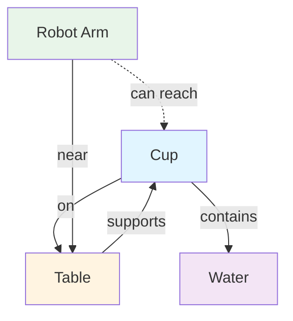
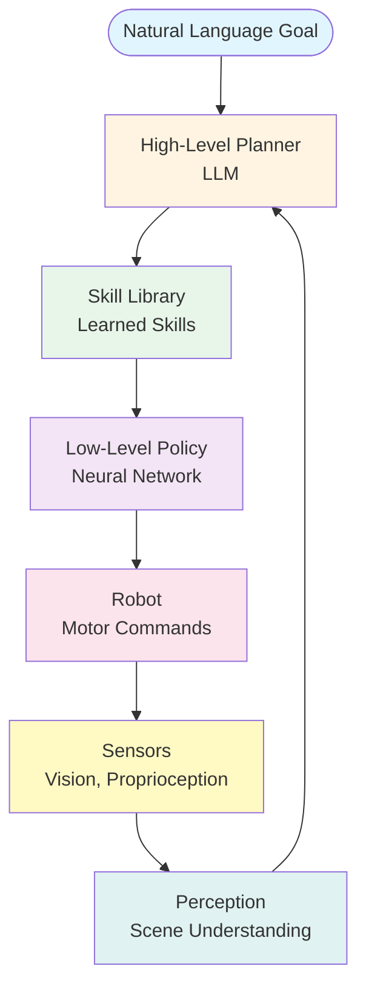
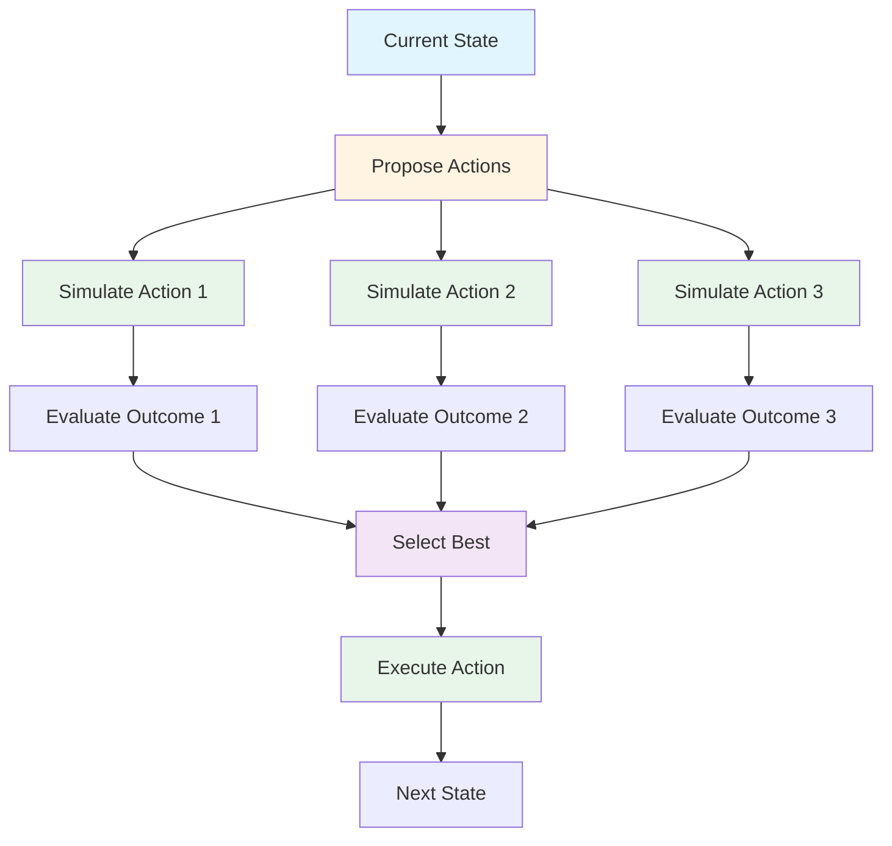

*By Gopi Krishna Tummala*

---

<div class="series-nav" style="background: linear-gradient(135deg, #667eea 0%, #764ba2 100%); color: white; padding: 1.5rem; border-radius: 12px; margin-bottom: 2rem; box-shadow: 0 4px 6px rgba(0,0,0,0.1);">
  <div style="font-size: 0.875rem; opacity: 0.9; margin-bottom: 0.5rem; text-transform: uppercase; letter-spacing: 0.05em;">Agentic AI Design Patterns Series</div>
  <div style="display: flex; gap: 0.75rem; flex-wrap: wrap; align-items: center;">
    <a href="/posts/agentic-ai-design-patterns-part-1" style="background: rgba(255,255,255,0.1); padding: 0.5rem 1rem; border-radius: 6px; text-decoration: none; color: white; opacity: 0.9;">Part 1: Foundations</a>
    <a href="/posts/agentic-ai-design-patterns-part-2" style="background: rgba(255,255,255,0.1); padding: 0.5rem 1rem; border-radius: 6px; text-decoration: none; color: white; opacity: 0.9;">Part 2: Production</a>
    <a href="/posts/agentic-ai-design-patterns-part-3" style="background: rgba(255,255,255,0.25); padding: 0.5rem 1rem; border-radius: 6px; text-decoration: none; color: white; font-weight: 600; border: 2px solid rgba(255,255,255,0.5);">Part 3: Specialized</a>
    <a href="/posts/agentic-ai-design-patterns-part-4" style="background: rgba(255,255,255,0.1); padding: 0.5rem 1rem; border-radius: 6px; text-decoration: none; color: white; opacity: 0.9;">Part 4: Failure Modes</a>
    <a href="/posts/agentic-ai-design-patterns-part-5" style="background: rgba(255,255,255,0.1); padding: 0.5rem 1rem; border-radius: 6px; text-decoration: none; color: white; opacity: 0.9;">Part 5: Production Guide</a>
  </div>
  <div style="margin-top: 0.75rem; font-size: 0.875rem; opacity: 0.8;">📖 You are reading <strong>Part 3: Specialized Patterns</strong> — Advanced patterns for domain-specific applications</div>
</div>

This part covers specialized patterns for advanced applications: embodied agents that interact with the physical world, 3D scene understanding for robotics, imagination loops for safe planning, multi-agent societies, and error recovery mechanisms.

---

<div id="article-toc" class="article-toc">
  <div class="toc-header">
    <h3>Table of Contents</h3>
    <button id="toc-toggle" class="toc-toggle" aria-label="Toggle table of contents"><span>▼</span></button>
  </div>
  <div class="toc-search-wrapper">
    <input type="text" id="toc-search" class="toc-search" placeholder="Search sections..." autocomplete="off">
  </div>
  <nav class="toc-nav" id="toc-nav">
    <ul>
      <li><a href="#pattern-12-environment">Pattern #12: Environment Loop</a></li>
      <li><a href="#pattern-13-embodied">Pattern #13: Embodied Agent Loops</a></li>
      <li><a href="#pattern-14-3d">Pattern #14: 3D Grounded Agents</a></li>
      <li><a href="#pattern-15-imagination">Pattern #15: Imagination Loop</a></li>
      <li><a href="#pattern-16-multi-agent">Pattern #16: Multi-Agent Societies</a></li>
      <li><a href="#pattern-17-reflexes">Pattern #17: Compensatory Reflexes</a></li>
      <li><a href="#pattern-18-introspective">Pattern #18: Introspective Agents</a></li>
    </ul>
  </nav>
</div>

---

<a id="pattern-12-environment"></a>
## **Pattern #12 — Environment Loop (Agents That Touch the Real World)**

Agents interact with:

* browsers
* OS
* file system
* cloud
* emails
* Slack
* simulators

Using a **step function**:

$$
(o_{t+1}, s_{t+1}) = env(s_t, a_t)
$$

This is classic reinforcement learning but driven by LLM policies.

### Example:

* Autonomous coding agents
* Browsing agents
* Automated analysts
* DevOps agents

### **Citation:**

*Zhou et al. (2023). "WebArena: A Realistic Web Environment for Building Autonomous Agents." [arXiv:2307.13854](https://arxiv.org/abs/2307.13854)*

---

<a id="pattern-14-3d"></a>
## **Pattern #14 — 3D Grounded Agents (Scene Graph → Plan → Act)**

Modern agents operating in physical 3D spaces build **scene graphs** to reason about spatial relationships, affordances, and constraints.

### **The 3D Challenge:**

Unlike 2D web interfaces, 3D environments require:
* **Spatial reasoning** (reachability, visibility, occlusion)
* **Object affordances** (what actions are possible)
* **Scene understanding** (relationships between objects)
* **Long-horizon manipulation** (multi-step physical tasks)

### **Scene Graph Representation:**

Agents construct a graph:

$$
G = (V, E)
$$

Where:
* $V$ = nodes (objects, locations, agents)
* $E$ = edges (spatial relationships: *on*, *near*, *inside*, *occludes*)

### **3D Scene Graph Example:**



### **Implementation:**

```python
from dataclasses import dataclass
from typing import List, Dict

@dataclass
class SceneObject:
    id: str
    type: str  # "cup", "table", "robot_arm"
    position: tuple[float, float, float]
    affordances: List[str]  # ["graspable", "movable"]

@dataclass
class SpatialRelation:
    subject: str
    relation: str  # "on", "near", "inside", "occludes"
    object: str
    confidence: float

class SceneGraph:
    def __init__(self):
        self.objects: Dict[str, SceneObject] = {}
        self.relations: List[SpatialRelation] = []
    
    def build_from_observation(self, observation: Dict):
        """Construct scene graph from 3D observation"""
        # Extract objects (from vision model or 3D detector)
        objects = self.detect_objects(observation)
        
        # Extract spatial relations
        relations = self.detect_relations(objects)
        
        self.objects = {obj.id: obj for obj in objects}
        self.relations = relations
    
    def plan_action(self, goal: str) -> List[str]:
        """Plan actions using scene graph constraints"""
        # Check reachability
        reachable = self.check_reachability()
        
        # Check affordances
        valid_actions = self.filter_by_affordances(goal)
        
        # Generate plan with spatial constraints
        plan = llm.invoke(
            f"Goal: {goal}\n"
            f"Scene Graph: {self.to_text()}\n"
            f"Reachable objects: {reachable}\n"
            f"Valid actions: {valid_actions}\n"
            "Generate a step-by-step plan:"
        )
        return parse_plan(plan)
    
    def check_reachability(self) -> List[str]:
        """Check which objects are reachable by agent"""
        reachable = []
        agent_pos = self.objects["robot_arm"].position
        
        for obj_id, obj in self.objects.items():
            distance = euclidean_distance(agent_pos, obj.position)
            if distance < REACH_THRESHOLD:
                reachable.append(obj_id)
        
        return reachable
    
    def filter_by_affordances(self, goal: str) -> List[str]:
        """Filter actions based on object affordances"""
        required_affordance = extract_affordance(goal)  # e.g., "graspable"
        
        valid_objects = [
            obj_id for obj_id, obj in self.objects.items()
            if required_affordance in obj.affordances
        ]
        
        return valid_objects
    
    def to_text(self) -> str:
        """Convert graph to text for LLM prompt"""
        obj_desc = [f"{o.type} at {o.position}" for o in self.objects.values()]
        rel_desc = [f"{r.subject} is {r.relation} {r.object}" for r in self.relations]
        return f"Objects: {'; '.join(obj_desc)}. Relations: {'; '.join(rel_desc)}."

# Example: The LLM receives the text description and plans:
# "Objects: cup at (0.5, 0.1, 0.9); table at (0, 0, 0). Relations: cup is on table."
# Goal: "Pick up the cup."
# Plan: "1. Move arm to (0.5, 0.1, 0.9). 2. Grasp cup. 3. Lift."
```

### **3D Planning with Constraints:**

Agents reason about:
* **Reachability:** Can the robot arm reach object X?
* **Visibility:** Is object Y occluded by object Z?
* **Affordances:** Can object W be grasped/moved?
* **Collisions:** Will action A cause a collision?

### **Applications:**

* **Home robotics** (cleaning, organizing, cooking)
* **Factory automation** (assembly, quality control)
* **Autonomous vehicles** (navigation, manipulation)
* **VR/AR agents** (interactive virtual environments)

### **Citation:**

Recent CVPR conferences (2024 and 2025) featured significant work on 3D scene understanding and grounded agents, with a strong focus on leveraging large language models (LLMs) and foundation models to enhance spatial reasoning and enable physical interaction.

**Key Research Areas:**

* **Zero-shot 3D Visual Grounding:** SeeGround (CVPR 2025) presents a zero-shot 3D visual grounding framework that dynamically selects viewpoints for query-relevant image rendering and integrates 2D images with 3D spatial descriptions to boost object localization performance significantly. [Li et al., CVPR 2025](https://openaccess.thecvf.com/content/CVPR2025/html/Li_SeeGround_See_and_Ground_for_Zero-Shot_Open-Vocabulary_3D_Visual_Grounding_CVPR_2025_paper.html)

* **Functionality and Affordance Understanding:** Fun3DU (CVPR 2025) is a training-free method that uses an LLM for Chain-of-Thought reasoning to parse task descriptions and segment functional objects in 3D scenes by leveraging pre-trained VLMs. SceneFun3D (CVPR 2024) introduced a dataset and model for fine-grained functionality and affordance understanding in 3D scenes. [Corsetti et al., CVPR 2025](https://openaccess.thecvf.com/content/CVPR2025/papers/Corsetti_Functionality_Understanding_and_Segmentation_in_3D_Scenes_CVPR_2025_paper.pdf)

* **Large-Scale Datasets and Benchmarks:** 3D-GRAND (CVPR 2025) is a pioneering million-scale dataset containing household scenes with densely grounded scene-language instructions, specifically designed to enhance grounding capabilities in 3D-LLMs and reduce hallucinations. The ScanNet++ benchmark offers high-fidelity data and challenges for novel view synthesis and 3D semantic understanding. [Yang et al., CVPR 2025](https://openaccess.thecvf.com/content/CVPR2025/html/Yang_3D-GRAND_A_Million-Scale_Dataset_for_3D-LLMs_with_Better_Grounding_and_CVPR_2025_paper.html)

* **Embodied Agents and Spatial Reasoning:** Video-3D LLM (CVPR 2025) presents a position-aware model that treats 3D scenes as dynamic videos, achieving state-of-the-art results on several benchmarks by more accurately aligning video representations with real-world spatial contexts. SnapMem (CVPR 2025) proposed a snapshot-based 3D scene memory for embodied agents to support lifelong learning and active exploration in dynamic environments. [Zheng et al., CVPR 2025](https://openaccess.thecvf.com/content/CVPR2025/html/Zheng_Video-3D_LLM_Learning_Position-Aware_Video_Representation_for_3D_Scene_Understanding_CVPR_2025_paper.html)

**Workshops:** CVPR 2025 workshops included "3D Scene Understanding," "Open-World 3D Scene Understanding with Foundation Models," "Embodied AI," and "3D-LLM/VLA: Bridging Language, Vision and Action in 3D Environments." [3D-LLM/VLA Workshop](https://3d-llm-vla.github.io/)

---

<a id="pattern-13-embodied"></a>
## **Pattern #13 — Embodied Agent Loops (LLMs + Perception + Control)**

Remember the parrot that grew arms? This is that, but for robots.

Modern embodied agents operate via **closed-loop control** in physical environments, combining high-level natural language planning with low-level motor control.

### **The Embodied Challenge:**

Unlike digital agents (which live in computers), embodied agents live in the real world. They have to:

* **Perceive** the world through vision/sensors (like eyes and touch)
* **Ground** language to physical actions (understand "pick up the cup" means moving a robot arm)
* **Control** motors, grippers, joints (actually move things)
* **Compose skills** to achieve long-horizon goals (pick up cup → pour water → hand it to you)

It's like teaching a robot to make coffee. The high-level plan ("make coffee") gets broken down into low-level commands ("move arm 5cm left, close gripper, lift 10cm").

### **Formal Structure:**

$$
(o_{t+1}, s_{t+1}) = f_{\text{dynamics}}(s_t, a_t)
$$

Where:
* $s_t$ = physical state (joint angles, positions, velocities)
* $a_t$ = motor commands (torques, velocities)
* $o_{t+1}$ = sensor observations (RGB, depth, proprioception)
* $f_{\text{dynamics}}$ = physics simulator or real-world dynamics

### **Embodied Agent Architecture:**



### **Implementation:**

```python
class EmbodiedAgent:
    def __init__(self):
        self.llm_planner = ChatOpenAI(model="gpt-4")
        self.vision_model = load_vision_model()  # e.g., OpenVLA
        self.skill_library = SkillLibrary()
        self.low_level_policy = LowLevelPolicy()
    
    def step(self, observation, goal: str):
        """Execute one step in the environment"""
        # 1. Perceive
        scene_description = self.vision_model.describe(observation)
        
        # 2. Plan (high-level)
        plan = self.llm_planner.invoke(
            f"Goal: {goal}\n"
            f"Current scene: {scene_description}\n"
            "What skill should I execute next?"
        )
        skill_name = extract_skill(plan)
        
        # 3. Execute skill (low-level)
        skill = self.skill_library.get_skill(skill_name)
        motor_commands = self.low_level_policy.execute(
            skill, observation
        )
        
        # 4. Act
        next_obs, reward, done = self.env.step(motor_commands)
        
        return next_obs, reward, done
    
    def compose_skills(self, goal: str) -> List[str]:
        """Chain atomic skills for long-horizon tasks"""
        # LLM breaks goal into skill sequence
        plan = self.llm_planner.invoke(
            f"Goal: {goal}\n"
            f"Available skills: {self.skill_library.list_skills()}\n"
            "Generate a sequence of skills:"
        )
        return parse_skill_sequence(plan)

class SkillLibrary:
    """Library of learned manipulation skills"""
    def __init__(self):
        self.skills = {
            "grasp": self.load_skill("grasp.pkl"),
            "place": self.load_skill("place.pkl"),
            "push": self.load_skill("push.pkl"),
            "pour": self.load_skill("pour.pkl"),
        }
    
    def get_skill(self, name: str):
        """Retrieve a learned skill policy"""
        return self.skills[name]
```

### **Key Components:**

1. **Vision-Language Models:** Ground natural language to visual observations
2. **Skill Learning:** Learn atomic actions from demonstrations (imitation learning)
3. **Skill Composition:** Chain skills for complex tasks
4. **Low-Level Control:** Convert high-level plans to motor commands

### **Applications:**

* **Home robotics** (cleaning, cooking, organizing)
* **Factory automation** (assembly, quality control)
* **Healthcare** (assistive robots)
* **Simulated environments** (training in simulation, deploying in reality)

### **Citation:**

Recent work in CVPR/ICRA/CoRL 2024-2025 on embodied AI and vision-language-action (VLA) models focuses on improving reasoning, planning, and real-world generalization. Key advancements include incorporating explicit reasoning like "visual chain-of-thought" for complex tasks, developing more efficient models, and leveraging large foundation models to better bridge the gap between language instructions and low-level control.

**Key Themes and Advancements:**

* **Enhanced Reasoning and Planning:** Researchers are moving beyond simple input-output mappings to give VLA models more robust reasoning capabilities for complex manipulation tasks. The "visual chain-of-thought" (CoT-VLA) approach predicts future image frames as visual goals before generating a short action sequence to achieve them, significantly improving performance in real-world tasks. VLAs are being used for high-level task decomposition, breaking down complex, long-horizon instructions into a sequence of subtasks. [Zhao et al., CVPR 2025](https://openaccess.thecvf.com/content/CVPR2025/html/Zhao_CoT-VLA_Visual_Chain-of-Thought_Reasoning_for_Vision-Language-Action_Models_CVPR_2025_paper.html)

* **Leveraging Foundation Models:** There's a strong trend of integrating Large Language Models (LLMs) and multimodal foundation models into embodied agents to support abilities like goal interpretation and action sequencing. One research direction explores a joint architecture of LLMs and "world models" to bridge the gap between specialized AI agents and general physical intelligence. [arXiv:2509.20021](https://arxiv.org/html/2509.20021v1)

* **Generalization and Efficiency:** Efforts are being made to improve the generalization of VLAs across different tasks and environments. New methods are being developed to make VLA models more efficient, such as using experience-based retrieval for rapid action generation in repetitive scenarios. [arXiv:2510.17111](https://arxiv.org/html/2510.17111v1)

* **Comprehensive Surveys:** Detailed surveys capture the rapidly evolving field, providing taxonomies of VLA models and their development trajectories, covering model structures, training datasets, pre-training methods, and evaluation benchmarks. [arXiv:2405.14093](https://arxiv.org/html/2405.14093v4)

**Relevant Workshops:** CVPR 2025 featured prominent workshops including "Embodied AI Workshop," "3D-LLM/VLA Workshop," and "Foundation Models Meet Embodied Agents," exploring advances in embodied AI and its integration with multimodal foundation models. [Embodied AI Workshop](https://embodied-ai.org/) | [3D-LLM/VLA Workshop](https://3d-llm-vla.github.io/)

---

<a id="pattern-15-imagination"></a>
## **Pattern #15 — Imagination Loop (Predict → Simulate → Select)**

This is the ultimate self-correction mechanism: **the ability to mentally rehearse a future before living it.**

### **The Analogy:**

Before a surgeon makes an incision, they don't just guess. They study the medical model, visualize the outcome, and mentally rehearse the steps. Agents do this by incorporating a **World Model**—often a generative AI (like a Video-LLM or 3D Diffusion model).

### **The Loop:**

1. **LLM Proposes Action ($a_t$):** "I think I should open the door."

2. **World Model Simulates Outcome ($o_{t+1}, s_{t+1}$):** The model generates a short video or 3D simulation of the agent opening the door and seeing a monster.

3. **Agent Selects/Revises Trajectory ($\tau^*$):** "Wait, that resulted in a negative outcome (monster). I will revise the action to 'Check keyhole with camera.'"

### **Formal Structure:**

The agent selects an action based on the predicted future return $R$ over a trajectory $\tau$:

$$
\tau^* = \arg\max_{\tau} R(\tau)
$$

Where $R(\tau)$ is calculated by rolling out the trajectory using the internal world model.

### **Why it Matters:**

This dramatically improves safety and planning quality in high-risk, real-world environments like robotics or autonomous driving, moving decision-making from *reactive* to *proactive*.

### **Imagination Loop Flow:**



### **Implementation:**

```python
class ImaginationAgent:
    def __init__(self):
        self.llm = ChatOpenAI()
        self.world_model = WorldModel()  # Video/3D diffusion model
        self.value_estimator = ValueNetwork()
    
    def imagine_and_select(self, state, goal: str):
        """Imagine futures and select best action"""
        # 1. LLM proposes candidate actions
        candidates = self.llm.invoke(
            f"State: {state}\n"
            f"Goal: {goal}\n"
            "Propose 5 possible next actions:"
        )
        actions = parse_actions(candidates)
        
        # 2. Simulate outcomes for each
        trajectories = []
        for action in actions:
            # World model predicts future
            future_states = self.world_model.rollout(state, action, horizon=10)
            
            # Estimate value
            value = self.value_estimator(future_states[-1], goal)
            
            trajectories.append({
                "action": action,
                "future": future_states,
                "value": value
            })
        
        # 3. Select best trajectory
        best = max(trajectories, key=lambda t: t["value"])
        
        return best["action"]
    
    def world_model_rollout(self, state, action, horizon: int):
        """Simulate future states"""
        states = [state]
        for _ in range(horizon):
            # Predict next state using world model
            next_state = self.world_model.predict(states[-1], action)
            states.append(next_state)
        return states

class WorldModel:
    """Learned or LLM-based world model"""
    def __init__(self):
        self.model = load_pretrained_world_model()
    
    def predict(self, state, action):
        """Predict next state given current state and action"""
        # Encode state (image, 3D scene, etc.)
        state_encoding = self.encode_state(state)
        
        # Encode action
        action_encoding = self.encode_action(action)
        
        # Predict next state
        next_state_encoding = self.model(state_encoding, action_encoding)
        
        # Decode to observation space
        return self.decode_state(next_state_encoding)
    
    def rollout(self, initial_state, action_sequence, horizon: int):
        """Roll out a sequence of actions"""
        states = [initial_state]
        for action in action_sequence[:horizon]:
            next_state = self.predict(states[-1], action)
            states.append(next_state)
        return states
```

### **World Model Types:**

1. **Video Prediction Models:** Predict future frames
2. **3D Diffusion Models:** Generate 3D scene futures
3. **Physics Simulators:** Accurate physics-based prediction
4. **Learned Dynamics:** Neural networks trained on experience

### **Benefits:**

* **Error Prevention:** Catch bad actions before execution
* **Better Planning:** Evaluate multiple futures
* **Sample Efficiency:** Learn from imagined experiences
* **Robustness:** Handle unseen scenarios via simulation

### **Citation:**

*Recent NeurIPS/ICLR 2024-2025 work on world models and imagination in agents*

---

<a id="pattern-16-multi-agent"></a>
## **Pattern #16 — Multi-Agent Societies (Specialists + Protocols)**

You wouldn't ask a single person to run a startup. You need a CEO, a coder, a marketer, and an accountant. Agentic AI is moving to the same model: **societies of specialized LLMs**.

### **The Analogy:**

A modern microservices architecture, but instead of software components, the services are specialized LLMs. Slack is their bloodstream.

### **Common Specializations:**

| Role | Responsibility |
| :--- | :--- |
| **Orchestrator** | Assigns tasks, manages flow (the CEO) |
| **Researcher** | Calls search tools, synthesizes data |
| **Coder** | Writes, executes, and debugs code |
| **Verifier/Critic** | Checks facts, flags errors, performs self-evaluation |
| **Planner** | Generates high-level task sequences |

### **Communication Protocol:**

$$
m_{i \rightarrow j} = \pi_i(o, g)
$$

Where $\pi_i$ is the policy of agent $i$ that generates a structured message $m$ intended for agent $j$ based on their shared observation $o$ and the global goal $g$.

### **Implementation:**

Frameworks like AutoGen and CrewAI implement this by defining specific *roles* and *termination criteria*.

```python
from autogen import UserProxyAgent, AssistantAgent, GroupChat, GroupChatManager

# 1. Define Agents (Roles)
researcher = AssistantAgent(
    name="Researcher",
    system_message="Synthesizes web search results."
)

coder = AssistantAgent(
    name="Coder",
    system_message="Writes and executes Python code in a sandbox."
)

user_proxy = UserProxyAgent(name="Client", human_input_mode="NEVER")

# 2. Define the Protocol (GroupChat)
groupchat = GroupChat(
    agents=[user_proxy, researcher, coder],
    messages=[],
    max_round=12,
    speaker_selection_method="auto"  # LLM decides who talks next
)

manager = GroupChatManager(groupchat=groupchat)

# 3. Execute the Multi-Agent Mission
user_proxy.initiate_chat(
    manager,
    message="Find the latest stock price for NVDA and calculate its P/E ratio."
)

# The manager orchestrates Researcher (to get price) and Coder (to calculate P/E).
```

Modern examples:

* **AutoGen**
* **OpenAI Swarm**
* **CrewAI**
* **LangGraph agent clusters**

### **Citation:**

*Wu et al. (2023). "AutoGen: Enabling Next-Gen LLM Applications via Multi-Agent Conversation." [arXiv:2308.08155](https://arxiv.org/abs/2308.08155)*

---

<a id="pattern-17-reflexes"></a>
## **Pattern #17 — Compensatory Reflexes (Error Recovery)**

When the agent touches the hot stove (an API call fails, a runtime error occurs, a key file is missing), it needs an instant, pre-programmed response.

### **The Reflex:**

$$
a_{t+1} = \pi_{\text{reflex}}(o_t, \text{error})
$$

The reflex policy $\pi_{\text{reflex}}$ overrides the main reasoning loop temporarily.

### **Example Errors and Reflexes:**

| Error Encountered | Reflex Action ($\pi_{\text{reflex}}$) |
| :--- | :--- |
| `API_ERROR: Rate Limit Exceeded` | Wait 5 seconds, try again with exponential backoff. |
| `FileNotFoundError: data.csv` | Re-plan: **Search** the file system for `*.csv`. |
| `JSONDecodeError` (Hallucinated output) | Re-prompt the LLM with the failed JSON, asking it to **fix the formatting**. |
| `Code execution: Syntax Error` | Pass the code and the full traceback to a **Reflector/Coder agent** for debugging. |

This dramatically improves reliability from the $\sim 50\%$ success rate of brittle scripts to the $\sim 95\%$ required for enterprise use.

### **Implementation:**

Error handling with automatic retry and correction:

```python
def execute_with_reflex(action: str, max_retries: int = 3):
    """Execute action with automatic error recovery"""
    for attempt in range(max_retries):
        try:
            result = execute_action(action)
            return result
        except ToolError as e:
            if attempt < max_retries - 1:
                # Reflex: ask LLM to fix the error
                corrected_action = llm.invoke(
                    f"Action failed: {action}\n"
                    f"Error: {e}\n"
                    "Generate a corrected action:"
                )
                action = parse_action(corrected_action)
            else:
                raise
        except ValidationError as e:
            # Pydantic validation failed - fix schema
            fixed_schema = llm.invoke(
                f"Fix this tool call to match the schema:\n{action}\n"
                f"Schema error: {e}"
            )
            action = fixed_schema
```

### **Analogy:**

Touch a hot stove → pull hand instantly.

This dramatically improves reliability.

### **Citation:**

*Madaan et al. (2023). "Self-Refine: Iterative Refinement with Self-Feedback." [arXiv:2303.17651](https://arxiv.org/abs/2303.17651)*

---

<a id="pattern-18-introspective"></a>
## **Pattern #18 — Introspective Agents (Self-Debugging AI)**

Agents must be their own critics, checking their output against constraints *before* delivery. This is the **unit test for thoughts**.

### **Self-Evaluation Loop:**

$$
\text{score} = \pi_{\text{eval}}(\text{output}, \text{constraints})
$$

If $\text{score} < \text{threshold}$, the agent is sent back to the **ReAct** loop with the failure message as the new observation.

### **Example:**

1. **Thought:** "I will use this two-year-old API documentation."

2. **Action:** $\text{call\_api}$

3. **Observation:** $\text{API\_ERROR}$

4. **Self-Evaluation:** $\pi_{\text{eval}}$ checks the output against the constraint: *Was an error received? Yes.* $\text{score} = 0.2$.

5. **New Thought:** "The API call failed. I will **search** for current documentation."

This is the refinement that turns a brittle planner into a resilient problem-solver.

### **Implementation:**

Self-evaluation with automatic correction:

```python
def introspective_agent(prompt: str, constraints: List[str]):
    """Agent that evaluates and corrects its own output"""
    max_iterations = 5
    
    for iteration in range(max_iterations):
        # Generate output
        output = llm.generate(prompt)
        
        # Self-evaluate
        evaluation = llm.invoke(
            f"Output: {output}\n"
            f"Constraints: {constraints}\n"
            "Rate this output 0-10 and explain why:"
        )
        score = extract_score(evaluation)
        
        if score >= 8.0:
            return output
        
        # Self-correct
        prompt = llm.invoke(
            f"Original prompt: {prompt}\n"
            f"Previous output: {output}\n"
            f"Evaluation: {evaluation}\n"
            "Generate an improved version:"
        )
    
    return output  # Return best attempt
```

### Example:

Chain-of-Thought → Self-Check → Correction.

This resembles **unit tests for thoughts**.

### **Citation:**

*Shinn et al. (2023). "Reflexion: Language Agents with Verbal Reinforcement Learning." [arXiv:2303.11366](https://arxiv.org/abs/2303.11366)*

---

<div class="series-nav" style="background: linear-gradient(135deg, #667eea 0%, #764ba2 100%); color: white; padding: 1.5rem; border-radius: 12px; margin-top: 3rem; box-shadow: 0 4px 6px rgba(0,0,0,0.1);">
  <div style="display: flex; gap: 0.75rem; flex-wrap: wrap; align-items: center; justify-content: space-between;">
    <a href="/posts/agentic-ai-design-patterns-part-2" style="background: rgba(255,255,255,0.1); padding: 0.75rem 1.5rem; border-radius: 6px; text-decoration: none; color: white; opacity: 0.9;">← Previous: Part 2</a>
    <a href="/posts/agentic-ai-design-patterns-part-4" style="background: rgba(255,255,255,0.25); padding: 0.75rem 1.5rem; border-radius: 6px; text-decoration: none; color: white; font-weight: 600; border: 2px solid rgba(255,255,255,0.5);">Next: Part 4: Failure Modes & Safety →</a>
  </div>
  <div style="margin-top: 0.75rem; font-size: 0.875rem; opacity: 0.8;">Learn about common failure modes, safety mechanisms, and how to build reliable production systems</div>
</div>

