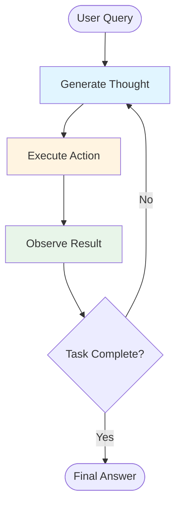
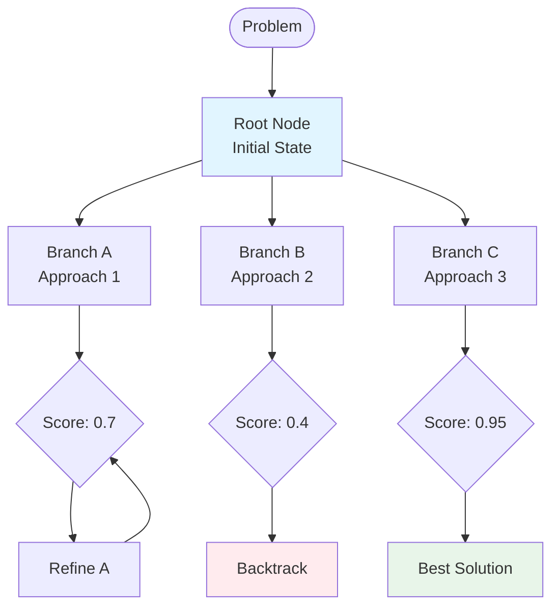
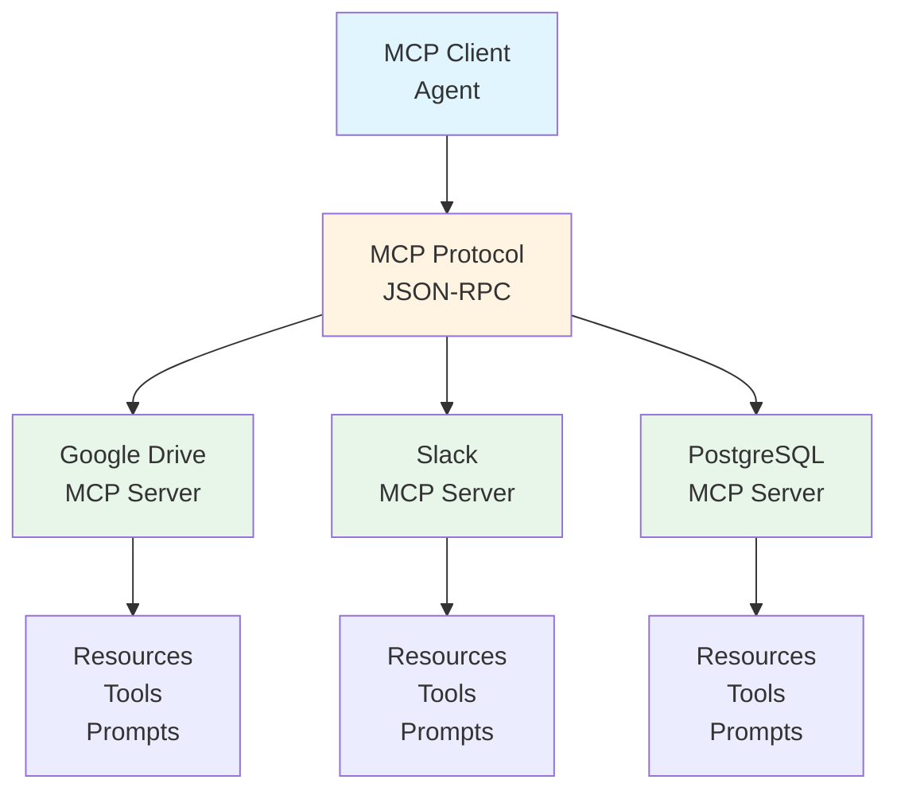
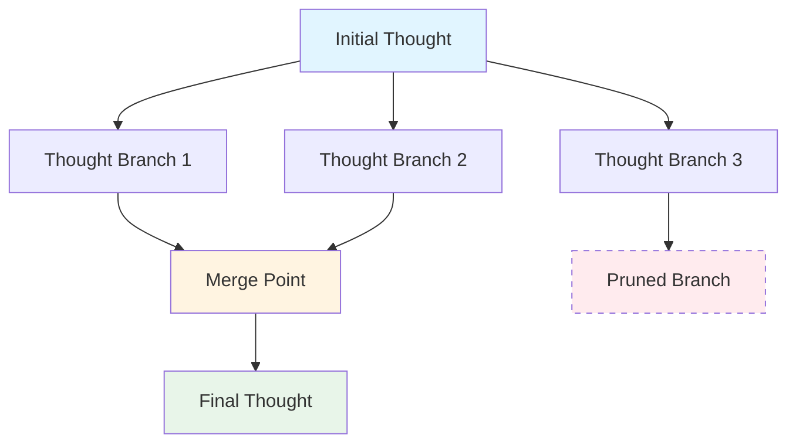
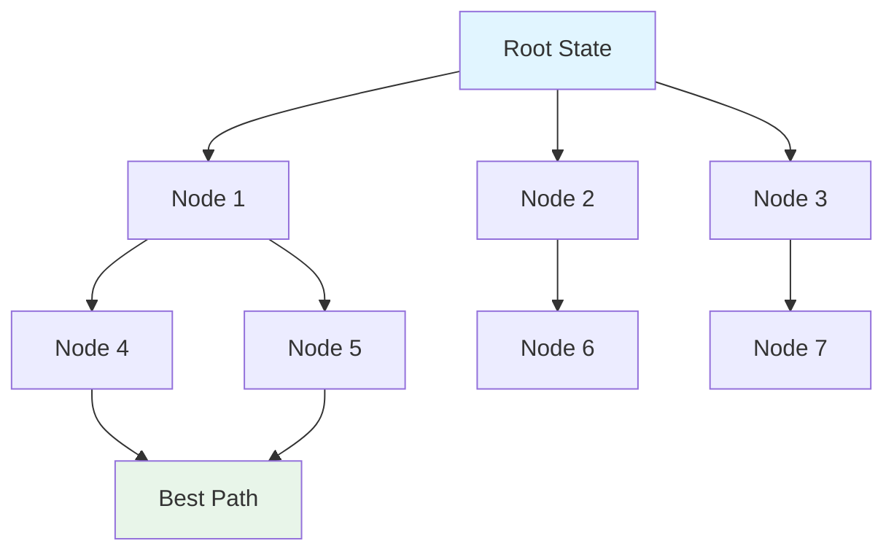

*By Gopi Krishna Tummala*

---

<div class="series-nav" style="background: linear-gradient(135deg, #6366f1 0%, #9333ea 100%); color: white; padding: 1.5rem; border-radius: 12px; margin-bottom: 2rem; box-shadow: 0 4px 6px rgba(0,0,0,0.1);">
  <div style="font-size: 0.875rem; opacity: 0.9; margin-bottom: 0.5rem; text-transform: uppercase; letter-spacing: 0.05em;">Agentic AI Design Patterns Series</div>
  <div style="display: flex; gap: 0.75rem; flex-wrap: wrap; align-items: center;">
    <a href="/posts/agentic-ai/agentic-ai-design-patterns-part-1" style="background: rgba(255,255,255,0.25); padding: 0.5rem 1rem; border-radius: 6px; text-decoration: none; color: white; font-weight: 600; border: 2px solid rgba(255,255,255,0.5);">Part 1: Foundations</a>
    <a href="/posts/agentic-ai/agentic-ai-design-patterns-part-2" style="background: rgba(255,255,255,0.1); padding: 0.5rem 1rem; border-radius: 6px; text-decoration: none; color: white; opacity: 0.9;">Part 2: Production</a>
    <a href="/posts/agentic-ai/agentic-ai-design-patterns-part-3" style="background: rgba(255,255,255,0.1); padding: 0.5rem 1rem; border-radius: 6px; text-decoration: none; color: white; opacity: 0.9;">Part 3: Specialized</a>
    <a href="/posts/agentic-ai/agentic-ai-design-patterns-part-4" style="background: rgba(255,255,255,0.1); padding: 0.5rem 1rem; border-radius: 6px; text-decoration: none; color: white; opacity: 0.9;">Part 4: Failure Modes</a>
    <a href="/posts/agentic-ai/agentic-ai-design-patterns-part-5" style="background: rgba(255,255,255,0.1); padding: 0.5rem 1rem; border-radius: 6px; text-decoration: none; color: white; opacity: 0.9;">Part 5: Production Guide</a>
  </div>
  <div style="margin-top: 0.75rem; font-size: 0.875rem; opacity: 0.8;">📖 You are reading <strong>Part 1: Foundations</strong> — Core patterns every agent needs</div>
</div>

# 🤖 The Cognitive Nexus: Agentic AI as the Engine of Complex Systems

<div id="article-toc" class="article-toc">
  <div class="toc-header">
    <h3>Table of Contents</h3>
    <button id="toc-toggle" class="toc-toggle" aria-label="Toggle table of contents"><span>▼</span></button>
  </div>
  <div class="toc-search-wrapper">
    <input type="text" id="toc-search" class="toc-search" placeholder="Search sections..." autocomplete="off">
  </div>
  <nav class="toc-nav" id="toc-nav">
    <ul>
      <li><a href="#introduction">Introduction: Beyond Generation to Autonomous Discovery</a>
        <ul>
          <li><a href="#mathematical-foundation">The Mathematical Foundation</a></li>
        </ul>
      </li>
      <li><a href="#pattern-1">Pattern #1: The ReAct Loop</a>
        <ul>
          <li><a href="#core-mechanism">The Core Mechanism</a></li>
          <li><a href="#mathematical-formulation">The Mathematical Formulation</a></li>
          <li><a href="#pseudo-code">From Theory to Code</a></li>
          <li><a href="#framework-code">Framework Implementation</a></li>
        </ul>
      </li>
      <li><a href="#pattern-overview">Pattern Overview: Beyond ReAct</a></li>
      <li><a href="#pattern-2">Pattern #2: Language Agent Tree Search (LATS)</a></li>
      <li><a href="#pattern-3">Pattern #3: Model Context Protocol (MCP)</a></li>
      <li><a href="#pattern-4">Pattern #4: Reflexion (Verbal Reinforcement)</a></li>
      <li><a href="#pattern-5">Pattern #5: Self-Consistency Sampling</a></li>
      <li><a href="#pattern-6">Pattern #6: Graph-of-Thoughts (GoT)</a></li>
      <li><a href="#pattern-7">Pattern #7: Search-Augmented Agents</a></li>
      <li><a href="#domain-applications">Domain-Specific Applications</a>
        <ul>
          <li><a href="#gaming">Gaming and Creative Content</a></li>
          <li><a href="#scientific-discovery">Scientific Discovery</a></li>
          <li><a href="#product-design">Product and Engineering Design</a></li>
        </ul>
      </li>
      <li><a href="#references">References</a></li>
      <li><a href="#series-roadmap">What's Next: Series Roadmap</a></li>
    </ul>
  </nav>
</div>

<a id="introduction"></a>
## Introduction: Beyond Generation to Autonomous Discovery

The evolution of Artificial Intelligence has entered its most consequential phase: the transition from **Generative AI**—systems focused on producing single, static outputs (text, images)—to **Agentic AI**—autonomous systems capable of **multi-step planning, iterative execution, and self-evaluation** in dynamic environments. This shift repositions the Large Language Model (LLM) from a passive content creator to an active, goal-directed **Cognitive Engine**.

### **What Makes an AI System an Agent? (The Simple Version)**

In simple terms, an AI agent is a system designed to perceive its environment and take actions to achieve a specific goal. Think of it as a smart assistant that learns on the job. It follows a straightforward five-step loop:

1. **Get the Mission:** You give it a goal, like "organize my schedule."
2. **Scan the Scene:** It gathers all necessary information—reading emails, checking calendars, accessing contacts.
3. **Think It Through:** It devises a plan of action by considering the optimal approach.
4. **Take Action:** It executes the plan by sending invitations, scheduling meetings, updating calendars.
5. **Learn and Get Better:** It observes successful outcomes and adapts accordingly. If a meeting gets rescheduled, it learns from this event to enhance future performance.

This simple loop, when formalized, becomes the **Perceive → Plan → Act → Reflect** (PRAR) framework we'll explore mathematically below.

### **Understanding Agent Complexity: A Level-Based Approach**

Before diving into the mathematical foundations, let's build intuition with a simple progression:

**Level 0: The Core Reasoning Engine**
An LLM without tools, memory, or environment interaction. Like a brilliant scholar who can only answer from their training data—powerful but limited to what they've already learned. They can't tell you who won the 2025 Oscars if that information wasn't in their training.

**Level 1: The Connected Problem-Solver**
Adds tools! Now the agent can search the web, query databases, call APIs. Like giving that scholar access to a library and the internet. To find new TV shows, the agent recognizes it needs current information, uses a search tool, and synthesizes the results.

**Level 2: The Strategic Problem-Solver**
Adds planning, context engineering, and self-improvement. The agent can break down complex tasks, manage information strategically (like extracting just flight numbers and dates from a verbose email), and learn from feedback. It moves beyond single-tool use to tackle multi-part problems through strategic problem-solving.

**Level 3: Collaborative Multi-Agent Systems**
A team of specialized agents working together, like a company with different departments. A "Project Manager" agent orchestrates the process by delegating to specialized agents: "Market Research," "Product Design," and "Marketing" agents, all communicating seamlessly to achieve complex goals.

### **The Agentic Canvas**

Think of building intelligent systems as creating a complex work of art on a **canvas**. This canvas isn't a blank visual space, but the underlying infrastructure and frameworks that provide the environment for your agents to exist and operate. It's the foundation upon which you'll build your intelligent application, managing state, communication, tool access, and the flow of logic.

Building effectively on this agentic canvas demands more than just throwing components together. It requires understanding proven techniques—patterns—that address common challenges in designing and implementing agent behavior. Just as architectural patterns guide the construction of a building, or design patterns structure software, agentic design patterns provide reusable solutions for the recurring problems you'll face when bringing intelligent agents to life.

### **The Core Mechanism: The PRAR Loop**

The core of Agentic AI lies in the continuous **Perceive → Plan → Act → Reflect** (PRAR) loop. This self-governing workflow, inspired by established AI paradigms, allows agents to:

1. **Decompose Complex Goals:** Break a high-level user objective (e.g., "Design a new CPU architecture" or "Find a novel antidepressant compound") into a logical sequence of actionable sub-tasks.

2. **Connect to Data Sources:** Use **Model Context Protocol (MCP)** to connect to external data sources, APIs, and services. MCP decouples agents from data sources, solving the N×M integration problem. Instead of custom integrations for every API, agents speak a universal protocol to MCP servers (Google Drive, Slack, PostgreSQL, etc.).

3. **Self-Correction and Learning:** Employ the **Reflexion** framework (Shinn et al., 2023) for self-correction. Reflexion uses "verbal reinforcement"—storing a text summary of *why* a failure occurred—which is more effective for LLMs than numerical rewards because LLMs think in language, not scalars. The agent critiques intermediate results, identifies errors (such as failed API calls or invalid outputs), and **iteratively refines** its strategy until the goal is achieved. This capacity for autonomous debugging is the key to enterprise-grade reliability.

This paradigm shift is not merely an efficiency gain; it is the establishment of a **Unified Agent Runtime** that fundamentally changes how we approach creative synthesis, scientific research, and immersive digital experiences. This approach transforms the LLM into a sequential decision-maker that reasons about the environment and selects actions to achieve a long-term goal (Yao et al., 2022).

<a id="mathematical-foundation"></a>
### **The Mathematical Foundation (Action Selection Policy)**

Formally, an agentic system's behavior is governed by a policy $\pi$:

$$
\pi(a_t | o_{\le t}, g, M)
$$

Where:

* $o_{\le t}$ = all observations (percepts, tool results) up to time $t$
* $g$ = the goal (high-level objective)
* $M$ = memory (episodic, semantic, and working context)
* $a_t$ = the action selected at time $t$ (e.g., thought, tool call, code execution)

This contrasts with a traditional LLM's static role as a next-token predictor.

---

<a id="pattern-1"></a>
## **Pattern #1 — The ReAct Loop**

The **ReAct (Reason and Act) loop** (Yao et al., 2022) is the foundational pattern that transforms LLMs from static predictors into sequential decision-makers. It's the "hello world" of agentic AI—deceptively simple, but getting this loop right is where 90% of the magic happens.

<a id="core-mechanism"></a>
### The Core Mechanism

ReAct enforces a structured, verifiable cycle that inherently reduces hallucination because every major internal decision must be followed by an external, factual check:

| Step | Pattern | Description | Function |
|:---|:---|:---|:---|
| 1. | **Thought/Reasoning** | The LLM analyzes the current observation, determines the next logical step, and decides if a tool is necessary. | Inference, Planning |
| 2. | **Action** | The agent executes the determined step, typically by calling a specialized function or API. | Execution, Tool Use |
| 3. | **Observation** | The agent receives the output or result from the action (e.g., the result of a code run or an API call). | Perception, Feedback |
| 4. | **Reflexion** | An optional, but critical, meta-reasoning step where the agent critiques the Observation using verbal reinforcement (text summaries of failures), identifies errors, and updates its internal plan for the next cycle. | Self-Correction, Debugging |

<a id="mathematical-formulation"></a>
### The Mathematical Formulation

The ReAct loop implements the policy $\pi(a_t | o_{\le t}, g, M)$ through this iterative process:

$$
\text{Thought}_t \rightarrow \text{Action}_t \rightarrow \text{Observation}_{t+1} \rightarrow \text{Reflexion}_{t+1}
$$

Translation: **Think → Do → See what happened → Critique → Think again.**

### The ReAct Loop Flow



### **Example:**

Here's what it looks like inside the machine:

```
Thought: User wants cheapest flight to Austin.

Thought: I need prices, so I should search.

Action: call the flight-search tool with "Austin"

Observation: here are 50 flights, cheapest is Delta $187

Thought: That seems good, but let me double-check Southwest…

Action: call tool again with Southwest filter

Observation: actually $174!

Thought: Cool, that's the winner.

Final Answer: Book the Southwest flight for $174.
```

It's just the key-finding loop, but with airplane tickets instead of keys.

**Strengths:** You can see exactly what it's thinking (transparency). You can stop it if it goes wrong (controllability).

**Weakness:** Sometimes it talks too much and overthinks simple things. Like a teenager narrating every thought out loud.

<a id="pseudo-code"></a>
### From Theory to Code: The Pseudo-Code Bridge

Before diving into framework implementations, let's see how the PRAR loop maps directly to code logic:

```python
# Pseudo-code: The ReAct Loop Core Logic
def react_loop(goal: str, max_iterations: int = 10):
    """Core ReAct loop implementation"""
    observations = []
    memory = []
    
    for iteration in range(max_iterations):
        # 1. PERCEIVE: Gather all context
        context = build_context(goal, observations, memory)
        
        # 2. PLAN: Generate thought/reasoning
        thought = llm.generate_thought(context, goal)
        
        # 3. ACT: Decide if tool is needed and execute
        if needs_tool(thought):
            action = select_tool(thought, available_tools)
            observation = execute_tool(action)
            observations.append(observation)
        else:
            # Direct answer
            return thought
        
        # 4. REFLECT: Critique the observation
        reflection = llm.reflect(thought, observation, goal)
        
        # Check if goal is satisfied
        if is_goal_satisfied(reflection, goal):
            return extract_final_answer(reflection)
        
        # Update memory for next iteration
        memory.append((thought, action, observation, reflection))
    
    # Max iterations reached
    return "Task incomplete after max iterations"
```

This pseudo-code directly implements the policy $\pi(a_t | o_{\le t}, g, M)$: it takes observations, goal, and memory as input, and outputs the next action.

<a id="framework-code"></a>
### **Implementation: Framework Code**

Modern frameworks implement ReAct with a simple interface:

```python
from langchain.agents import AgentExecutor, create_react_agent
from langchain_openai import ChatOpenAI

# Initialize the agent with tools
llm = ChatOpenAI(model="gpt-4")
tools = [search_tool, calculator_tool, code_executor]

# Create ReAct agent
agent = create_react_agent(llm, tools)
agent_executor = AgentExecutor(agent=agent, max_iterations=10)

# Run the agent
result = agent_executor.invoke({
    "input": "Book me the cheapest flight to Austin"
})
```

The agent automatically alternates between reasoning (generating thoughts) and acting (calling tools) until it reaches a final answer or hits the iteration limit.

### **Citation:**

*Yao et al. (2022). "ReAct: Synergizing Reasoning and Acting in Language Models." [arXiv:2210.03629](https://arxiv.org/abs/2210.03629) — Foundational agent design pattern: interleave reasoning + actions. (Widely-cited; foundational design pattern.)*

---

<a id="pattern-overview"></a>
## Pattern Overview: Beyond ReAct

While ReAct is the foundation, production systems require additional patterns to handle complexity, reliability, and cost. Here's a brief overview of the other foundational patterns covered in this part:

---

<a id="pattern-2"></a>
## **Pattern #2 — Language Agent Tree Search (LATS)**

Simple "Plan-Execute" often gets stuck in local minima. The agent tries one approach, fails, and doesn't know what else to try.

**LATS (Language Agent Tree Search)** solves this by combining **ReAct** with **Monte Carlo Tree Search (MCTS)**. Instead of a linear sequence of actions, the agent explores a *tree* of possible solutions, scores each path, and backtracks when a branch looks unpromising.

### **The Simple Idea: Explore Multiple Paths**

Think of solving a complex coding problem:

* **Simple ReAct:** Try approach A → fails → try approach A again (doom loop)
* **LATS:** Try approach A → score it → try approach B → score it → compare → pick best → refine

The agent creates a **tree** of possible actions. It explores a path, scores it (using a value function), backs up if the score is low, and tries a different branch. This is critical for complex coding or reasoning tasks where the first attempt is rarely the best.

### **Why LATS Matters**

**The Problem with Linear Planning:**
- Agent commits to one plan early
- If the plan is wrong, it wastes time on a dead end
- No way to "undo" and try alternatives

**The LATS Solution:**
- Agent explores multiple plans in parallel (or sequentially)
- Each plan gets a score based on progress toward the goal
- Agent can backtrack and try better branches
- Eventually converges to the best solution

### **How LATS Works**

LATS combines three components:

1. **ReAct Loop:** The agent still reasons and acts, but now it does so across multiple branches
2. **Tree Search:** Maintains a tree of explored states and actions
3. **Value Function:** Scores each path to determine which branches to explore further

**The Algorithm:**
1. **Selection:** Choose a promising node in the tree (using UCB or similar)
2. **Expansion:** Generate possible next actions from that node
3. **Simulation:** Execute the action and observe the result
4. **Backpropagation:** Update the value of nodes based on the outcome

This is like a chess engine exploring multiple moves ahead, but for language agents solving complex tasks.

### **A Practical Example: Complex Coding Task**

Here's how LATS explores multiple solutions for a coding problem:

**Task:** "Write a function that finds the longest palindromic substring"

**LATS Exploration:**
1. **Branch A:** Try dynamic programming approach → score: 0.7 (works but slow)
2. **Branch B:** Try brute force → score: 0.4 (too slow for large inputs)
3. **Backtrack to Branch A** → refine with optimizations → score: 0.9
4. **Branch C:** Try expand-around-centers → score: 0.95 (best!)

The agent doesn't commit to the first approach—it explores, scores, and picks the best.

### **The LATS Algorithm:**

Formally, LATS maintains a tree where each node represents a state (current code, partial solution, etc.):

$$
\text{Node} = (s, a, Q(s,a), N(s,a))
$$

where:
- $s$ = state (current problem state)
- $a$ = action (next code change or reasoning step)
- $Q(s,a)$ = value estimate (how good is this path?)
- $N(s,a)$ = visit count (how many times explored?)

**Selection:** Choose node with highest UCB score:
$$
\text{UCB}(s,a) = Q(s,a) + c \sqrt{\frac{\log N(s)}{N(s,a)}}
$$

**Expansion:** Generate new actions from selected node

**Simulation:** Execute action and observe result

**Backpropagation:** Update $Q(s,a)$ based on outcome

### **LATS Tree Search Flow:**



### **Implementation:**

Here's a simplified LATS implementation:

```python
from typing import List, Dict, Tuple
from dataclasses import dataclass
import math

@dataclass
class Node:
    state: str  # Current problem state
    action: str  # Action taken to reach this state
    value: float = 0.0  # Q(s,a)
    visits: int = 0  # N(s,a)
    children: List['Node'] = None

class LATS:
    def __init__(self, llm, max_iterations=100, exploration_c=1.41):
        self.llm = llm
        self.max_iterations = max_iterations
        self.c = exploration_c
        self.root = Node(state="initial", action="start")
    
    def ucb_score(self, node: Node, parent_visits: int) -> float:
        """Upper Confidence Bound for node selection"""
        if node.visits == 0:
            return float('inf')
        exploitation = node.value / node.visits
        exploration = self.c * math.sqrt(math.log(parent_visits) / node.visits)
        return exploitation + exploration
    
    def select(self, node: Node) -> Node:
        """Select best child using UCB"""
        if not node.children:
            return node
        parent_visits = sum(c.visits for c in node.children)
        return max(node.children, key=lambda c: self.ucb_score(c, parent_visits))
    
    def expand(self, node: Node) -> List[Node]:
        """Generate possible next actions"""
        # Use LLM to generate candidate actions
        prompt = f"Given this state: {node.state}\nGenerate 3 different approaches to solve this."
        actions = self.llm.generate_actions(prompt)
        
        children = []
        for action in actions:
            children.append(Node(
                state=node.state,
                action=action,
                children=[]
            ))
        node.children = children
        return children
    
    def simulate(self, node: Node) -> float:
        """Execute action and get reward"""
        # Execute the action (e.g., run code, test solution)
        result = self.execute_action(node.action, node.state)
        # Score the result (0.0 to 1.0)
        return self.score_result(result)
    
    def backpropagate(self, node: Node, reward: float):
        """Update value estimates up the tree"""
        while node:
            node.visits += 1
            node.value += reward
            node = node.parent if hasattr(node, 'parent') else None
    
    def search(self, problem: str) -> str:
        """Main LATS search loop"""
        self.root.state = problem
        
        for _ in range(self.max_iterations):
            # Selection: traverse to leaf
            node = self.root
            while node.children:
                node = self.select(node)
            
            # Expansion: generate children
            if node.visits == 0:
                children = self.expand(node)
                node = children[0] if children else node
            
            # Simulation: get reward
            reward = self.simulate(node)
            
            # Backpropagation: update values
            self.backpropagate(node, reward)
        
        # Return best solution
        best = max(self.root.children, key=lambda c: c.value / c.visits)
        return best.action
```

### **When to Use LATS:**

* ✅ Complex reasoning tasks (coding, math, planning)
* ✅ Tasks where first attempt is rarely optimal
* ✅ When you need to explore multiple solution paths
* ❌ Simple, linear tasks (use ReAct instead)
* ❌ When latency is critical (LATS is slower)

### **Citation:**

*Zhou, D., et al. (2023/2024). "Language Agent Tree Search (LATS)." [arXiv preprint] — Combines ReAct with Monte Carlo Tree Search for complex reasoning tasks. (Enables backtracking and multi-path exploration.)*

*(Note: Cite specific arXiv number when paper is published.)*

---

<a id="pattern-3"></a>
## **Pattern #3 — Model Context Protocol (MCP)**

Simple "tool calling" is brittle. Every API needs a custom integration. Every data source requires specific code. This creates an **N×M problem**: N agents × M data sources = N×M integrations to maintain.

**Model Context Protocol (MCP)** solves this by decoupling the *agent* from the *data source*. Instead of writing a specific tool for every API, the agent speaks **MCP** to any compliant server.

### **The Simple Idea: Universal Protocol**

Think of MCP like USB-C for AI agents:

* **Before MCP:** Each device (Google Drive, Slack, PostgreSQL) needs its own custom driver
* **With MCP:** One protocol works with all devices

The agent connects to **MCP servers** (like Google Drive, Slack, or a PostgreSQL DB) using a standardized protocol. The server exposes:
- **Resources:** Data the agent can read (files, messages, database rows)
- **Tools:** Actions the agent can take (search, create, update)
- **Prompts:** Pre-built prompt templates for common tasks

### **Why MCP Matters**

**The N×M Problem:**
- Agent needs Google Drive → write custom integration
- Agent needs Slack → write custom integration  
- Agent needs PostgreSQL → write custom integration
- Result: 3 agents × 3 sources = 9 integrations to maintain

**The MCP Solution:**
- Agent speaks MCP → connects to any MCP server
- Google Drive MCP server → one integration
- Slack MCP server → one integration
- PostgreSQL MCP server → one integration
- Result: 3 agents × 3 sources = 3 server implementations (reusable)

### **How MCP Works**

MCP uses a **client-server architecture**:

1. **MCP Server:** Exposes resources, tools, and prompts for a data source
2. **MCP Client:** The agent connects to servers and uses their capabilities
3. **MCP Protocol:** Standardized JSON-RPC messages for communication

**The Protocol:**
- `resources/list` - List available resources
- `resources/read` - Read a resource
- `tools/list` - List available tools
- `tools/call` - Execute a tool
- `prompts/list` - List prompt templates
- `prompts/get` - Get a prompt template

### **MCP Architecture:**



### **Implementation:**

Here's how to use MCP with an agent:

```python
from mcp import ClientSession, StdioServerParameters
from mcp.client.stdio import stdio_client

# Connect to an MCP server (e.g., Google Drive)
server_params = StdioServerParameters(
    command="npx",
    args=["-y", "@modelcontextprotocol/server-google-drive"]
)

async with stdio_client(server_params) as (read, write):
    async with ClientSession(read, write) as session:
        # Initialize the connection
        await session.initialize()
        
        # List available resources
        resources = await session.list_resources()
        print(f"Available resources: {resources}")
        
        # List available tools
        tools = await session.list_tools()
        print(f"Available tools: {tools}")
        
        # Use a tool (e.g., search files)
        result = await session.call_tool(
            "search_files",
            arguments={"query": "agentic AI", "max_results": 5}
        )
        print(f"Search results: {result}")
        
        # Read a resource (e.g., a file)
        file_content = await session.read_resource(
            "gdrive://file-id-123"
        )
        print(f"File content: {file_content}")
```

### **MCP Server Example (Google Drive):**

```typescript
// MCP Server for Google Drive
import { Server } from "@modelcontextprotocol/sdk/server/index.js";
import { 
  ListResourcesRequestSchema,
  ReadResourceRequestSchema,
  ListToolsRequestSchema,
  CallToolRequestSchema
} from "@modelcontextprotocol/sdk/types.js";

const server = new Server({
  name: "google-drive-mcp-server",
  version: "1.0.0",
});

// Expose resources (files)
server.setRequestHandler(ListResourcesRequestSchema, async () => {
  const files = await googleDrive.listFiles();
  return {
    resources: files.map(file => ({
      uri: `gdrive://${file.id}`,
      name: file.name,
      mimeType: file.mimeType,
    }))
  };
});

// Expose tools (search, create, update)
server.setRequestHandler(ListToolsRequestSchema, async () => {
  return {
    tools: [
      {
        name: "search_files",
        description: "Search for files in Google Drive",
        inputSchema: {
          type: "object",
          properties: {
            query: { type: "string" },
            max_results: { type: "number" }
          }
        }
      },
      {
        name: "create_file",
        description: "Create a new file in Google Drive",
        inputSchema: {
          type: "object",
          properties: {
            name: { type: "string" },
            content: { type: "string" }
          }
        }
      }
    ]
  };
});

// Handle tool calls
server.setRequestHandler(CallToolRequestSchema, async (request) => {
  if (request.params.name === "search_files") {
    const results = await googleDrive.search(request.params.arguments.query);
    return { content: [{ type: "text", text: JSON.stringify(results) }] };
  }
  // ... handle other tools
});
```

### **When to Use MCP:**

* ✅ Connecting agents to multiple data sources
* ✅ Building reusable integrations
* ✅ Standardizing agent-data interactions
* ✅ When you need to support many data sources
* ❌ Simple, single-API integrations (overkill)
* ❌ When latency is critical (adds protocol overhead)

### **MCP vs. Traditional Tool Calling:**

| Aspect | Traditional Tools | MCP |
|:---|:---|:---|
| **Integration** | Custom code per API | Standard protocol |
| **Maintenance** | N×M integrations | M server implementations |
| **Reusability** | Low (agent-specific) | High (any MCP client) |
| **Discovery** | Manual documentation | Protocol-based discovery |
| **Extensibility** | Hard (code changes) | Easy (new servers) |

### **Citation:**

*Anthropic (2024). "Model Context Protocol (MCP)." [Anthropic Documentation](https://modelcontextprotocol.io/) — Standardized protocol for connecting agents to data sources. (Industry standard; see official docs for latest updates.)*

*MCP solves the N×M integration problem by decoupling agents from data sources through a universal protocol.*

### **MCP Use Cases:**

**Multi-Source Data Access:**
- Connect to Google Drive, Slack, and PostgreSQL in one agent
- No custom integrations needed—just connect to MCP servers

**Standardized Integrations:**
- Build once, use everywhere: MCP servers work with any MCP client
- Example: Google Drive MCP server works with any agent framework

**Dynamic Discovery:**
- Agents discover available resources, tools, and prompts at runtime
- No hardcoded API endpoints or schemas

---

<a id="pattern-4"></a>
<a id="pattern-4"></a>
## **Pattern #4 — Reflexion: Verbal Reinforcement Learning**

The **Reflexion** framework (Shinn et al., 2023) formalizes self-correction for language agents. Unlike traditional reinforcement learning that uses numerical rewards, Reflexion uses **verbal reinforcement**—storing text summaries of failures and successes.

### **The Simple Idea: Language-Based Learning**

**Why Verbal Reinforcement Works:**
- LLMs think in language, not numbers
- A text summary like "Failed because API returned 404—need to check if resource exists first" is more informative than a reward of -0.5
- The agent can read its own failure logs and learn from them

**The Reflexion Loop:**
1. **Act:** Agent attempts a task
2. **Observe:** Get result (success or failure)
3. **Reflect:** Generate verbal summary of what went wrong/right
4. **Store:** Save reflection to memory
5. **Retry:** Use reflection to improve next attempt

### **How Reflexion Works:**

The agent maintains a **reflection memory** that stores:
- What action was taken
- What the outcome was
- Why it succeeded or failed (verbal explanation)
- What to do differently next time

**Formally:**
$$
\text{Reflection}_t = \text{LLM}(\text{Action}_t, \text{Observation}_t, \text{Previous Reflections})
$$

The reflection is then used to guide future actions:
$$
\text{Action}_{t+1} = \text{LLM}(\text{Goal}, \text{Reflection}_t, \text{Context})
$$

### **Implementation:**

```python
from typing import List, Dict
from dataclasses import dataclass

@dataclass
class Reflection:
    action: str
    outcome: str
    success: bool
    explanation: str  # Verbal summary of why it worked/failed
    next_steps: str   # What to do differently

class ReflexionAgent:
    def __init__(self, llm):
        self.llm = llm
        self.reflection_memory: List[Reflection] = []
    
    def reflect(self, action: str, outcome: str, success: bool) -> Reflection:
        """Generate verbal reflection on action outcome"""
        prompt = f"""
        Action taken: {action}
        Outcome: {outcome}
        Success: {success}
        
        Previous reflections:
        {self._format_reflections()}
        
        Explain why this succeeded or failed, and what to do differently next time.
        """
        
        response = self.llm.generate(prompt)
        reflection = Reflection(
            action=action,
            outcome=outcome,
            success=success,
            explanation=response['explanation'],
            next_steps=response['next_steps']
        )
        
        self.reflection_memory.append(reflection)
        return reflection
    
    def act(self, goal: str) -> str:
        """Take action informed by previous reflections"""
        reflection_context = self._format_reflections()
        
        prompt = f"""
        Goal: {goal}
        
        Previous attempts and reflections:
        {reflection_context}
        
        Based on these reflections, what action should I take next?
        """
        
        action = self.llm.generate(prompt)
        return action
    
    def _format_reflections(self) -> str:
        """Format reflection memory for prompt"""
        return "\n".join([
            f"- {r.action}: {r.explanation} → {r.next_steps}"
            for r in self.reflection_memory[-5:]  # Last 5 reflections
        ])
```

### **When to Use Reflexion:**

* ✅ Tasks where failures provide learning opportunities
* ✅ Complex tasks requiring multiple attempts
* ✅ When you need explainable self-correction
* ✅ Long-running agents that improve over time
* ❌ Simple, one-shot tasks (overkill)
* ❌ When numerical rewards are sufficient (use RL instead)

### **Citation:**

*Shinn, N., et al. (2023). "Reflexion: Language Agents with Verbal Reinforcement Learning." [arXiv:2303.11366](https://arxiv.org/abs/2303.11366) — Self-reflection & correction loop using verbal reinforcement. (Enables agents to learn from mistakes through language-based summaries rather than numerical rewards.)*

```python
from sklearn.ensemble import RandomForestClassifier
import numpy as np

class ToolRouter:
    """Lightweight classifier for tool selection"""
    def __init__(self):
        self.classifier = RandomForestClassifier(n_estimators=100)
        self.tool_features = {}  # Pre-computed tool embeddings
    
    def route(self, query: str, available_tools: list) -> str:
        """Route query to best tool"""
        # Extract features from query
        features = self.extract_features(query)
        
        # Predict best tool
        tool_scores = {}
        for tool in available_tools:
            score = self.classifier.predict_proba([features])[0]
            tool_scores[tool] = score
        
        return max(tool_scores, key=tool_scores.get)
    
    def extract_features(self, query: str) -> np.array:
        """Extract features for routing"""
        # Simple keyword-based features (can use embeddings)
        features = [
            "search" in query.lower(),
            "calculate" in query.lower(),
            "code" in query.lower(),
            "database" in query.lower(),
            len(query),
            query.count("?"),
        ]
        return np.array(features)
```

**For production:** Use this simple router instead of full RL training. It's faster, cheaper, and easier to maintain.

---

<a id="pattern-4"></a>
<a id="pattern-5"></a>
## **Pattern #5 — Self-Consistency Sampling**

You know how when you're not sure about something, you ask multiple people and go with what most of them say? That's this pattern.

Instead of picking a single chain of thought, agents generate many and vote.

$$
y = \text{mode} \left(\{ \pi_\theta(x)^{(i)} \}_{i=1..k} \right)
$$

Translation: "Ask 10 experts instead of 1, then pick the most common answer."

### **Why This Works:**

### **Implementation:**

This is an efficient form of Monte Carlo Tree Search (MCTS) applied to the thought space:

```python
def self_consistency_sampling(prompt: str, n_samples: int = 10):
    """Generate multiple reasoning paths and vote"""
    samples = []
    
    for _ in range(n_samples):
        # Generate a chain of thought
        response = llm.generate(
            prompt,
            temperature=0.7,  # Higher temp = more diversity
            max_tokens=500
        )
        samples.append(extract_answer(response))
    
    # Return the most common answer
    from collections import Counter
    return Counter(samples).most_common(1)[0][0]

# Example: Math problem
question = "Solve: 2x + 5 = 15"
answer = self_consistency_sampling(question, n_samples=10)
# If 8/10 samples say x=5, that's the answer
```

Used in:

* Math reasoning

* Code generation

* Planning

* Safety filtering

### **Citation:**

*Wang et al. (2022). "Self-Consistency Improves Chain of Thought Reasoning in Language Models." [arXiv:2203.11171](https://arxiv.org/abs/2203.11171) — Sample multiple solutions and vote. (Still widely used in production systems.)*

---

<a id="pattern-5"></a>
<a id="pattern-6"></a>
## **Pattern #6 — Graph-of-Thoughts (GoT)**

You know how when you're brainstorming, you don't think in a straight line? You have one idea, it branches into three, two of those merge back together, you cross out the bad one, and keep going.

That's Graph-of-Thoughts. Instead of linear reasoning (A → B → C), thoughts form a **graph**:

* **Parallel branches** — explore multiple ideas at once
* **Merging** — combine good ideas from different paths
* **Pruning** — cut off dead ends
* **Revising** — go back and fix earlier thoughts

### **The Analogy:**

Brainstorming on a whiteboard with arrows and clusters. Like a mind map, but the AI actually uses it to solve problems.

### **Graph-of-Thoughts Structure:**



### **Implementation:**

GoT allows parallel exploration and merging of reasoning paths:

```python
from typing import List, Set

class ThoughtNode:
    def __init__(self, content: str, score: float):
        self.content = content
        self.score = score
        self.children: List[ThoughtNode] = []
        self.parents: List[ThoughtNode] = []

def graph_of_thoughts(initial_prompt: str, max_depth: int = 3):
    """Build a graph of reasoning paths"""
    root = ThoughtNode(initial_prompt, 0.0)
    frontier = [root]
    
    for depth in range(max_depth):
        # Expand all nodes in parallel
        new_nodes = []
        for node in frontier:
            # Generate multiple child thoughts
            children = generate_thoughts(node.content, n=3)
            for child_content, score in children:
                child = ThoughtNode(child_content, score)
                child.parents.append(node)
                node.children.append(child)
                new_nodes.append(child)
        
        # Merge similar thoughts
        merged = merge_similar_thoughts(new_nodes)
        # Prune low-scoring branches
        frontier = [n for n in merged if n.score > threshold]
    
    # Extract best path
    return extract_best_path(root)
```

Modern agent frameworks now implement explicit DAG-based reasoning.

### **Citation:**

*Besta et al. (2023). "Graph of Thoughts: Solving Elaborate Problems with Large Language Models." [arXiv:2308.09687](https://arxiv.org/abs/2308.09687) — Non-linear reasoning graphs for complex problems. (Enables parallel exploration, merging, and pruning of reasoning paths.)*

---

<a id="pattern-6"></a>
<a id="pattern-7"></a>
## **Pattern #7 — Search-Augmented Agents (When Thoughts Become a Tree)**

Instead of single ReAct trajectories or self-consistency voting, modern agents use **systematic search** over the space of possible reasoning paths.

### **Analogy:**

Like a chess engine exploring possible moves, but for reasoning and planning.

### **MCTS Search Tree:**



### **Formal Structure:**

Each search node represents:

$$
\text{node} = (s, a, r, s', \text{thought})
$$

Where:
* $s$ = current state
* $a$ = proposed action
* $r$ = predicted reward
* $s'$ = predicted next state
* $\text{thought}$ = LLM-generated reasoning

### **Implementation:**

LLM-MCTS (Monte-Carlo Tree Search with LLM guidance):

```python
from collections import defaultdict
import numpy as np

class SearchNode:
    def __init__(self, state, thought, action=None):
        self.state = state
        self.thought = thought
        self.action = action
        self.visits = 0
        self.value = 0.0
        self.children = []
        self.parent = None

def llm_mcts(root_state, goal, max_iterations=100):
    """Monte-Carlo Tree Search guided by LLM"""
    root = SearchNode(root_state, llm.generate_thought(root_state, goal))
    
    for _ in range(max_iterations):
        # Selection: traverse to leaf
        node = root
        while node.children:
            node = select_best_child(node)  # UCB1 or similar
        
        # Expansion: LLM proposes actions
        if not is_terminal(node.state):
            actions = llm.propose_actions(node.state, goal)
            for action in actions:
                next_state = world_model.predict(node.state, action)
                child = SearchNode(next_state, 
                    llm.generate_thought(next_state, goal), action)
                child.parent = node
                node.children.append(child)
        
        # Simulation: roll out to terminal
        value = simulate_rollout(node, goal)
        
        # Backpropagation: update values
        backpropagate(node, value)
    
    # Return best action
    return max(root.children, key=lambda n: n.value / n.visits).action

def world_model_predict(state, action):
    """Learned or LLM-based world model"""
    # Can be a neural network, physics simulator, or LLM
    return model.predict(state, action)

def simulate_rollout(node, goal, max_depth=10):
    """Roll out trajectory and evaluate"""
    current = node
    for depth in range(max_depth):
        if is_terminal(current.state):
            return evaluate(current.state, goal)
        action = llm.sample_action(current.state, goal)
        current = world_model_predict(current.state, action)
    return evaluate(current.state, goal)
```

### **Key Advantages:**

* **Systematic exploration** vs. single-shot reasoning
* **World model integration** for accurate predictions
* **Optimal path selection** via search
* **Handles long-horizon planning** better than ReAct alone

### **Used In:**

* Robotics (manipulation, navigation)
* Theorem proving
* Autonomous coding (multi-file refactoring)
* Web navigation (complex multi-step tasks)
* Game playing (Chess, Go, strategy games)

### **Citation:**

*Recent work combining LLMs with MCTS and learned world models (2024-2025)*

---

<a id="references"></a>
## **References**

### **Citation Guidelines (How to Cite Properly & Reduce Hallucinations)**

**Editorial Rules for Proper Citations:**
- Prefer **official sources**: arXiv pages, OpenReview (for ICLR/ICML/NeurIPS/ACL), or authors' project/GitHub pages
- For industry reports or products (OpenAI o1, Swarm, AutoGen), link to **official blog/technical report/GitHub repo** rather than generic blog posts
- For "2024–2025 game-changers" without formal papers, label clearly as **(technical report / blog / repo / workshop demo)**
- When claiming "most-cited / canonical", add parenthetical like `(widely-cited; foundational design pattern)` with arXiv link
- Group by venue/type: foundational (arXiv/peer-reviewed), production (tech report/repos), robotics/multimodal, and industry reports
- **Reduce hallucinations**: Only cite papers/reports that actually exist; if uncertain, label as "preprint" or "technical report" and note when specific links become available

---

**Editorial Rules for Proper Citations:**
- Prefer **official sources**: arXiv pages, OpenReview (for ICLR/ICML/NeurIPS/ACL), or authors' project/GitHub pages
- For industry reports or products (OpenAI o1, Swarm, AutoGen), link to **official blog/technical report/GitHub repo** rather than generic blog posts
- For "2024–2025 game-changers" without formal papers, label clearly as **(technical report / blog / repo / workshop demo)**
- When claiming "most-cited / canonical", add parenthetical like `(widely-cited; foundational design pattern)` with arXiv link
- Group by venue/type: foundational (arXiv/peer-reviewed), production (tech report/repos), robotics/multimodal, and industry reports

---

### **Foundational / Must-Read Papers (Everyone Quotes These)**

**Yao, S., et al. (2022).** *ReAct: Synergizing Reasoning and Acting in Language Models.*  
[arXiv:2210.03629](https://arxiv.org/abs/2210.03629) — Foundational agent design pattern: interleave reasoning + actions. (Widely-cited; foundational design pattern.)

**Schick, T., et al. (2023).** *Toolformer: Language Models Can Teach Themselves to Use Tools.*  
[arXiv:2302.04761](https://arxiv.org/abs/2302.04761) — Self-supervised tool-use training. (Foundational work on tool learning.)

**Shinn, N., et al. (2023).** *Reflexion: Language Agents with Verbal Reinforcement Learning.*  
[arXiv:2303.11366](https://arxiv.org/abs/2303.11366) — Self-reflection & correction loop. (Enables agents to learn from mistakes and improve over time.)

**Wang, X., et al. (2022).** *Self-Consistency Improves Chain of Thought Reasoning in Language Models.*  
[arXiv:2203.11171](https://arxiv.org/abs/2203.11171) — Sample multiple solutions and vote. (Still widely used in production systems.)

**Besta, M., et al. (2023).** *Graph of Thoughts: Solving Elaborate Problems with Large Language Models.*  
[arXiv:2308.09687](https://arxiv.org/abs/2308.09687) — Non-linear reasoning graphs for complex problems. (Enables parallel exploration, merging, and pruning of reasoning paths.)

**Park, J. S., et al. (2023).** *Generative Agents: Interactive Simulacra of Human Behavior.*  
[arXiv:2304.03442](https://arxiv.org/abs/2304.03442) — Memory systems for long-term agent behavior. (Foundational work on episodic memory in agents.)

### **2024–2025 Game-Changers**

**OpenAI o1** — *Technical report / blog post (September 2024)* — [OpenAI Blog](https://openai.com/index/hello-o1/) — Hidden reasoning models with test-time compute scaling. (Industry technical report; not peer-reviewed.)

**OpenAI Swarm** — *GitHub repository / examples (October 2024)* — [GitHub: openai/swarm](https://github.com/openai/swarm) — Hierarchical multi-agent framework. (Open-source framework; see repository for latest updates.)

**Zoph, B., et al. (2024).** *Quiet-STaR: Language Models Can Teach Themselves to Think Before Speaking.* — [arXiv:2403.14342](https://arxiv.org/abs/2403.14342) — Reasoning in silence before generating responses. (arXiv preprint, 2024.)

### **Multi-Agent & Production Systems**

**Wu, T., et al. (2023).** *AutoGen: Enabling Next-Gen LLM Applications via Multi-Agent Conversation.*  
[arXiv:2308.08155](https://arxiv.org/abs/2308.08155) — Multi-agent conversation framework. (Widely-used open-source framework; see [AutoGen GitHub](https://github.com/microsoft/autogen) for 2025 updates and latest features.)

**Hong, S., et al. (2023).** *MetaGPT: Meta Programming for A Multi-Agent Collaborative Framework.*  
[arXiv:2308.00352](https://arxiv.org/abs/2308.00352) — Multi-agent collaborative framework. (See [MetaGPT GitHub](https://github.com/geekan/MetaGPT) for 2025 updates.)

### **Embodied Agents & Robotics**

**Zhou, S., et al. (2023).** *WebArena: A Realistic Web Environment for Building Autonomous Agents.*  
[arXiv:2307.13854](https://arxiv.org/abs/2307.13854) — Web environment for autonomous agents. (Foundational benchmark for web agents.)

**Wang, G., et al. (2023).** *Voyager: An Open-Ended Embodied Agent with Large Language Models.*  
[arXiv:2305.16291](https://arxiv.org/abs/2305.16291) — Embodied open-ended agent. (Minecraft agent with long-term memory.)

### **Where to Follow Ongoing Work**

**arXiv:** [cs.AI](https://arxiv.org/list/cs.AI/recent), [cs.LG](https://arxiv.org/list/cs.LG/recent), [cs.CL](https://arxiv.org/list/cs.CL/recent) — Daily preprints on agentic AI, LLMs, and reasoning.

**OpenReview:** [ICLR](https://openreview.net/group?id=ICLR.cc), [NeurIPS](https://openreview.net/group?id=NeurIPS.cc), [ICML](https://openreview.net/group?id=ICML.cc) — Peer-reviewed conference papers with reviews.

**GitHub Repositories:** [LangChain](https://github.com/langchain-ai/langchain), [AutoGen](https://github.com/microsoft/autogen), [CrewAI](https://github.com/joaomdmoura/crewAI), [MetaGPT](https://github.com/geekan/MetaGPT) — Production frameworks with active development.

**Community Venues:** [Agents4Science Workshop](https://openreview.net/group?id=Agents4Science/2025/Conference), [LangChain Blog](https://blog.langchain.dev/), [Anthropic Blog](https://www.anthropic.com/research) — Industry reports and community discussions.

### **Top Conferences to Watch for Agentic-AI Research**

If you want to track the **canonical venues** where the most influential agentic-AI work appears, watch these (minimal, high-signal set):

**Core ML / Theory / Agentic Reasoning:**
- **NeurIPS** — Top ML conference with many agent/chain-of-thought papers. ([NeurIPS](https://neurips.cc/))
- **ICML** — Core ML conference, often strong agentic systems papers. ([ICML](https://icml.cc/))
- **ICLR** — Learning representations, many LLM methods and OpenReview threads. ([ICLR](https://iclr.cc/))

**NLP & Dialogue / Tool Use:**
- **ACL / EMNLP / NAACL** — Language-specific agent methods, tool-augmented language models. ([ACL](https://www.aclweb.org/portal/))

**Vision & Multimodal Agentic Work:**
- **CVPR / ICCV / ECCV** — Vision + agent combos, AoTD-style work often appears here. ([CVPR](https://cvpr.thecvf.com/))

**Planning, Robotics & Embodied Agents:**
- **ICRA / RSS / CoRL** — Robotics + embodied agents, long-term memory + world models papers. ([ICRA](https://www.ieee-ras.org/conferences-workshops/fully-sponsored/icra))

**Systems & Production / ML Engineering:**
- **MLSys / SysML** — Production agent infrastructure and scaling/serving papers. ([MLSys](https://mlsys.org/))

**Other High-Value Venues:**
- **AISTATS, AAAI, KDD, SIGIR, WWW** — Planning/agents/tools/retrieval papers
- **NeurIPS/ICLR/ICML Workshops** — Agents, tools, retrieval workshops
- **Agents4Science** — Agent-driven science demos. ([OpenReview](https://openreview.net/group?id=Agents4Science/2025/Conference))

*(These venues together capture the majority of agentic-AI research—methods, multimodal, robotics, retrieval/tooling, and production systems.)*

---

### **Additional Domain-Specific References**

**Ramaseri-Chandra, A. N. (2023).** Generative AI-based Non-person Character (NPC) For Navigating Virtual Worlds.  
*Cyber Awareness and Research Symposium 2023, University of North Dakota.*  
[ResearchGate](https://www.researchgate.net/publication/376030547_Generative_AI-based_Non-person_Character_NPC_For_Navigating_Generative_AI-based_Non-person_Character_NPC_For_Navigating_Virtual_Worlds_Virtual_Worlds)

**Wu, Z., et al. (2025).** UniVA: Universal Video Agent towards Open-Source Next-Generation Video Generalist.  
*Introduces a "Plan-and-Act" dual-agent architecture for automated and self-reflective video creation.*  
[ResearchGate](https://www.researchgate.net/publication/397521474_UniVA_Universal_Video_Agent_towards_Open-Source_Next-Generation_Video_Generalist)

**Sun, S., et al. (2025).** An LLM-LVLM Driven Agent for Iterative and Fine-Grained Image Editing.  
*LLM-LVLM driven agent for iterative and fine-grained image editing with planning and execution.*  
[arXiv:2508.17435](https://arxiv.org/html/2508.17435v1)

**Wang, J., et al. (2025).** FilmAgent: A Multi-Agent Framework for End-to-End Film Production.  
*Multi-agent framework designed for end-to-end film production, from script to final output.*  
[arXiv](https://arxiv.org/html/2501.12909v1)

**Additional References on Multi-Agent Systems and Reflection:**

- **Anim-Director:** A Large Multimodal Model Powered Agent for Controllable Animation Video Generation.  
  [ResearchGate](https://www.researchgate.net/publication/386398237_Anim-Director_A_Large_Multimodal_Model_Powered_Agent_for_Controllable_Animation_Video_Generation)

- **Reflection in AI Agents:** Research on feedback loops, memory systems, and explicit self-critique in agent systems.  
  See: [Akira AI Blog](https://www.akira.ai/blog/reflection-agent-prompting), [DeepLearning.AI](https://www.deeplearning.ai/the-batch/agentic-design-patterns-part-2-reflection/)

- **Commercial Tools:** Adobe Creative Cloud (Sensei), RunwayML, Descript, Unreal Engine 5.4 (Modular Control Rig) demonstrate AI-driven automation in professional creative pipelines.

**Electronic Design Automation (EDA) and Reinforcement Learning:**

- **Machine Learning for Electronic Design Automation: A Survey**  
  *Comprehensive overview of ML techniques, including RL, across the EDA design flow.*  
  [ResearchGate](https://www.researchgate.net/publication/349106567_Machine_Learning_for_Electronic_Design_Automation_A_Survey)

- **Application of Machine Learning in FPGA EDA Tool Development**  
  *Research on ML applications in FPGA design automation.*  
  [ResearchGate](https://www.researchgate.net/publication/374500231_Application_of_Machine_Learning_in_FPGA_EDA_Tool_Development)

- **Google TPU Design:** Google's use of deep reinforcement learning for optimizing TPU physical layouts.  
  See: [Wikipedia: Tensor Processing Unit](https://en.wikipedia.org/wiki/Tensor_Processing_Unit)

- **Synopsys DSO.ai:** Commercial RL-based design-space optimization tool for chip implementation.  
  See: [Wikipedia: Synopsys](https://en.wikipedia.org/wiki/Synopsys)

- **General EDA References:**  
  - [ScienceDirect: Electronic Design Automation](https://www.sciencedirect.com/topics/computer-science/electronic-design-automation)  
  - [ACM Digital Library: ML in EDA](https://dl.acm.org/doi/10.1145/3736167)  
  - [IEEE Xplore: RL in EDA](https://ieeexplore.ieee.org/iel7/6287639/10005208/10272331.pdf)

**Autonomous Scientific Discovery and AI Agents in Chemistry:**

- **AutoLabs: A Self-Correcting, Multi-Agent Framework for Autonomous Chemical Experimentation**  
  *Self-correcting, multi-agent architecture that translates natural-language instructions into executable protocols for high-throughput liquid handlers, achieving near-expert procedural accuracy.*  
  [arXiv:2509.25651](https://arxiv.org/abs/2509.25651)

- **Autonomous LLM Agent for Chemical Literature Data Mining**  
  *AI agent that performs high-fidelity extraction from extensive chemical literature, automating data collection and analysis with high accuracy, recall, and F1 scores.*  
  [arXiv:2402.12993](https://arxiv.org/abs/2402.12993)

- **Chemist-X: AI Agent for Automated Reaction Condition Recommendations**  
  *AI agent that automates reaction condition recommendations using retrieval-augmented generation, interrogating molecular databases and distilling data from latest literature.*  
  [arXiv:2311.10776](https://arxiv.org/abs/2311.10776)

- **dZiner: AI Agent for Rational Inverse Design of Materials**  
  *LLM-powered agent that facilitates rational inverse design of materials by leveraging domain-specific insights from scientific literature, proposing new materials with enhanced properties.*  
  [arXiv:2410.03963](https://arxiv.org/abs/2410.03963)

- **A Review of Large Language Models and Autonomous Agents in Chemistry**  
  *Comprehensive review covering recent history, current capabilities, and design of LLMs and autonomous agents in chemistry, addressing challenges and future directions.*  
  [Royal Society of Chemistry](https://pubs.rsc.org/doi/d4sc03921a)

- **Multi-agent-driven robotic AI chemist**  
  *A multi-agent-driven robotic AI chemist enabling autonomous chemical research on demand, operating through hierarchical multi-agent framework for complex, multi-step experiments.*  
  [ChemRxiv](https://chemrxiv.org/engage/api-gateway/chemrxiv/assets/orp/resource/item/66a8c11bc9c6a5c07a7a59c0/original/a-multi-agent-driven-robotic-ai-chemist-enabling-autonomous-chemical-research-on-demand.pdf)

- **Argonne National Laboratory - Self-Driving Chemist Platform**  
  *Self-driving chemist platform that autonomously executes chemical reactions to improve processes and create new materials, with minimal human intervention.*  
  [Argonne National Laboratory](https://www.anl.gov/autonomous-discovery/selfdriving-chemist)

- **Empowering biomedical discovery with AI agents**  
  *Perspective on AI agents that formulate biomedical hypotheses, critically evaluate them, and characterize uncertainty in biomedical research.*  
  [ScienceDirect](https://www.sciencedirect.com/)

---

<a id="domain-applications"></a>
## The Multiverse of Agency: Domain-Specific Applications

The agentic framework is powerful because it applies across various fields requiring multi-stage complexity and verifiable results.

<a id="gaming"></a>
### 🎮 Gaming and Creative Content: Emergent Worlds

Agentic AI is moving game and content creation from scripted narratives to **Emergent Worlds**.

**Self-Evolving Non-Player Characters (NPCs):** Agent-based NPCs maintain **long-term episodic memory** (e.g., remembering a player's past deeds), **dynamic motivations**, and the ability to **plan social interactions**, creating believable character relationships and truly *dynamic storytelling* where the plot is co-authored in real-time by player and agent interactions (Ramaseri-Chandra, 2023).

**Multi-Step Asset Editing:** In design pipelines (like film, animation, and game asset creation), agents handle complex, multi-modal edits. For example, an agent can be tasked to "change the lighting on the main character in all 50 cutscenes to match the new mood board." The agent executes this by iteratively calling specialized tools (vision models, 3D rendering APIs, color grading functions), with a **Self-Evaluation** agent ensuring visual fidelity and style consistency across all assets. Recent research demonstrates this through multi-agent frameworks like UniVA (Wu et al., 2025) for video creation, RefineEdit-Agent (Sun et al., 2025) for iterative image editing, and FilmAgent (Wang et al., 2025) for end-to-end film production. Commercial tools like RunwayML and Descript are incorporating AI-assisted automation into professional pipelines.

<a id="scientific-discovery"></a>
### 🔬 Scientific Discovery: From Hypothesis to Lab Result

In the scientific arena, agents act as tireless, intelligent researchers, accelerating the discovery process by orders of magnitude.

**Circuit Design and Electronic Design Automation (EDA):** Agents are tasked with generating novel **Electronic Circuits** (e.g., optimizing a filter or a low-power digital block) based on high-level constraints (power, area, speed). They utilize EDA tools as their "tools," running simulations, evaluating physical layouts, and iteratively refining the design using **Reinforcement Learning** signals derived from the simulation results. This approach is formulated as a Markov Decision Process (MDP), where the agent interacts with the design environment and receives rewards based on metrics like wirelength, congestion, and power consumption.

Notable applications include Google's use of deep reinforcement learning to optimize the physical layouts of Tensor Processing Units (TPUs), and commercial products like Synopsys DSO.ai, which applies RL to automate chip implementation processes. Research in this area spans major EDA conferences (DAC, ICCAD) and demonstrates RL's effectiveness in tasks like floorplanning, placement, and routing optimization.

**Compound Search and Materials Discovery:** The agent acts as an autonomous chemist, navigating the vast and noisy landscape of chemical space. It performs **literature review** (via Retrieval-Augmented Generation/RAG), formulates a **hypothesis** for a new material (e.g., a high-temperature superconductor or a new drug candidate), designs the optimal **synthesis procedure** (a multi-step chemical protocol), and, in advanced setups, even controls robotic labs to execute the experiment—closing the loop from thought to physical action. Recent research demonstrates this through systems like AutoLabs (arXiv:2509.25651), which uses a self-correcting, multi-agent architecture to translate natural-language instructions into executable protocols for high-throughput liquid handlers. Multi-agent robotic AI chemists enable autonomous chemical research on demand, combining LLM-driven planning with robotic synthesis and analysis. AI agents can autonomously mine chemical literature (arXiv:2402.12993), automate reaction condition recommendations (Chemist-X, arXiv:2311.10776), and perform rational inverse design of materials (dZiner, arXiv:2410.03963).

<a id="product-design"></a>
### 📐 Product and Engineering Design: The Iterative Creator

Any domain centered on user design benefits from agents that can critique and refine proposals.

**Design Refinement and Optimization:** An agent can take a user-designed 3D model, run it through a structural simulator to check for stress points, and automatically suggest or implement design modifications to improve strength or reduce material usage, effectively performing **autonomous engineering optimization**.

**Code Generation and Debugging:** Agent teams (Planner, Coder, Reviewer) can maintain and evolve massive codebases. A **Coder Agent** writes the code, and a **Reviewer Agent** runs unit tests and static analysis. Upon failure, the Reviewer provides the full traceback as an "Observation," forcing the Coder Agent to **self-debug** and iterate without human intervention.

---

<a id="series-roadmap"></a>
## What's Next: Series Roadmap

This series provides a systematic exploration of the architectural patterns that enable autonomous, reliable agentic systems. The content is organized into five parts:

### **Part 2: Production Patterns**
Focuses on patterns essential for real-world deployment:
- **Memory Management** — Episodic, semantic, and working memory systems
- **Memory Compression** — Active memory rewriting and relevance filtering (the context window budget)
- **Supervisor/Orchestrator** — The #1 production pattern for cost efficiency
- **Parallel Tool Execution** — Fan-out patterns for latency reduction
- **Hidden Reasoning** — Test-time compute scaling (o1-style)

### **Part 3: Specialized Patterns**
Advanced patterns for domain-specific applications:
- **Embodied Agent Loops** — Vision-language-action integration
- **3D Grounded Agents** — Scene graph reasoning for robotics
- **Imagination Loops** — World model simulation and planning
- **Multi-Agent Societies** — Specialized agent teams and protocols
- **Compensatory Reflexes** — Error recovery and automatic correction
- **Introspective Agents** — Self-debugging and constraint verification

### **Part 4: Failure Modes & Safety**
Engineering reality: how agents fail and how to prevent it:
- **Common Failure Modes** — Tool overuse, contextual amnesia, goal drift, the "doom loop"
- **Verifiable Agent Pipelines** — Safety-aware planning and uncertainty quantification
- **Failure Taxonomy** — Systematic classification of agent failures
- **Eval-Driven Development** — Building agent unit tests and measuring failure modes
- **Mitigation Strategies** — Production-ready safeguards

### **Part 5: Production Guide**
The 2025 practitioner's handbook:
- **The Economics of Agency** — Latency vs. cost trade-offs, when to use agents vs. chains
- **Human Handoff Patterns** — Gracefully returning control when confidence is low
- **Cost Cheat Sheet** — Real-world cost and reliability numbers
- **Case Study** — Complete agent workflow for a research task
- **Production Checklist** — What actually ships in 2025
- **State of the Field** — Where research is converging

---

<div class="series-nav" style="background: linear-gradient(135deg, #667eea 0%, #764ba2 100%); color: white; padding: 1.5rem; border-radius: 12px; margin-top: 3rem; box-shadow: 0 4px 6px rgba(0,0,0,0.1);">
  <div style="font-size: 0.875rem; opacity: 0.9; margin-bottom: 0.5rem; text-transform: uppercase; letter-spacing: 0.05em;">Continue Reading</div>
  <div style="display: flex; gap: 0.75rem; flex-wrap: wrap; align-items: center;">
    <a href="/posts/agentic-ai/agentic-ai-design-patterns-part-2" style="background: rgba(255,255,255,0.25); padding: 0.75rem 1.5rem; border-radius: 6px; text-decoration: none; color: white; font-weight: 600; border: 2px solid rgba(255,255,255,0.5);">→ Next: Part 2: Production Patterns</a>
  </div>
  <div style="margin-top: 0.75rem; font-size: 0.875rem; opacity: 0.8;">Learn about memory management, supervisor patterns, parallel execution, and hidden reasoning</div>
</div>

