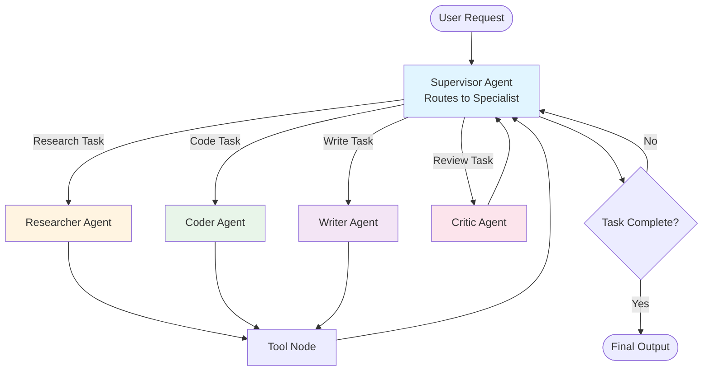
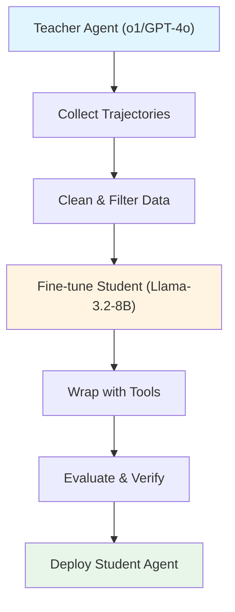

*By Gopi Krishna Tummala*

---

<div class="series-nav" style="background: linear-gradient(135deg, #6366f1 0%, #9333ea 100%); color: white; padding: 1.5rem; border-radius: 12px; margin-bottom: 2rem; box-shadow: 0 4px 6px rgba(0,0,0,0.1);">
  <div style="font-size: 0.875rem; opacity: 0.9; margin-bottom: 0.5rem; text-transform: uppercase; letter-spacing: 0.05em;">Agentic AI Design Patterns Series</div>
  <div style="display: flex; gap: 0.75rem; flex-wrap: wrap; align-items: center;">
    <a href="/posts/agentic-ai-design-patterns-part-1" style="background: rgba(255,255,255,0.1); padding: 0.5rem 1rem; border-radius: 6px; text-decoration: none; color: white; opacity: 0.9;">Part 1: Foundations</a>
    <a href="/posts/agentic-ai-design-patterns-part-2" style="background: rgba(255,255,255,0.25); padding: 0.5rem 1rem; border-radius: 6px; text-decoration: none; color: white; font-weight: 600; border: 2px solid rgba(255,255,255,0.5);">Part 2: Production</a>
    <a href="/posts/agentic-ai-design-patterns-part-3" style="background: rgba(255,255,255,0.1); padding: 0.5rem 1rem; border-radius: 6px; text-decoration: none; color: white; opacity: 0.9;">Part 3: Specialized</a>
    <a href="/posts/agentic-ai-design-patterns-part-4" style="background: rgba(255,255,255,0.1); padding: 0.5rem 1rem; border-radius: 6px; text-decoration: none; color: white; opacity: 0.9;">Part 4: Failure Modes</a>
    <a href="/posts/agentic-ai-design-patterns-part-5" style="background: rgba(255,255,255,0.1); padding: 0.5rem 1rem; border-radius: 6px; text-decoration: none; color: white; opacity: 0.9;">Part 5: Production Guide</a>
  </div>
  <div style="margin-top: 0.75rem; font-size: 0.875rem; opacity: 0.8;">📖 You are reading <strong>Part 2: Production Patterns</strong> — What actually ships in 2025</div>
</div>

This part covers the patterns that make agents production-ready: memory management, supervisor orchestration, parallel execution, and hidden reasoning. These are the patterns you'll actually deploy.

---

<div id="article-toc" class="article-toc">
  <div class="toc-header">
    <h3>Table of Contents</h3>
    <button id="toc-toggle" class="toc-toggle" aria-label="Toggle table of contents"><span>▼</span></button>
  </div>
  <div class="toc-search-wrapper">
    <input type="text" id="toc-search" class="toc-search" placeholder="Search sections..." autocomplete="off">
  </div>
  <nav class="toc-nav" id="toc-nav">
    <ul>
      <li><a href="#pattern-7-memory">Pattern #7: Memory-Attentive Agents</a></li>
      <li><a href="#pattern-8-compression">Pattern #8: Memory Rewriting (Compression)</a></li>
      <li><a href="#pattern-9-supervisor">Pattern #9: Supervisor / Orchestrator</a></li>
      <li><a href="#pattern-10-parallel">Pattern #10: Parallel Tool Use / Fan-Out</a></li>
      <li><a href="#pattern-11-hidden">Pattern #11: Hidden Reasoning (2025 Edition)</a></li>
      <li><a href="#pattern-12-distillation">Pattern #12: Agent Distillation / Compilation</a></li>
    </ul>
  </nav>
</div>

---

<a id="pattern-7-memory"></a>
## **Pattern #7 — Memory-Attentive Agents**

You know how you have different kinds of memory? Your phone number (long-term), what you had for breakfast (short-term), and that thing you're actively thinking about right now (working memory)?

Agents need the same thing. Memory is not an afterthought anymore.

### **Types of Memory:**

1. **Short-Term Scratchpads** — like sticky notes on your desk (local CoT)

2. **Long-Term Semantic Memory** — like a filing cabinet organized by topic (vector DBs)

3. **Episodic Memory** — like a diary of everything that happened (conversation history)

4. **Working Memory** — like the stuff you're actively juggling in your head right now (structured key-value)

Formally:

$$
M = M_{epi} \cup M_{sem} \cup M_{work}
$$

Memory retrieval becomes:

$$
r_t = f_{retrieval}(o_{\le t}, g, M)
$$

### **Implementation:**

Multi-memory system with retrieval:

```python
from langchain.vectorstores import Chroma
from langchain.embeddings import OpenAIEmbeddings
from typing import Dict, List

class AgentMemory:
    def __init__(self):
        self.episodic: List[Dict] = []  # Conversation history
        self.semantic = Chroma(embedding_function=OpenAIEmbeddings())  # Vector DB
        self.working: Dict = {}  # Structured key-value
    
    def retrieve(self, query: str, k: int = 5) -> List[str]:
        """Retrieve from all memory types"""
        results = []
        
        # Semantic search
        semantic_results = self.semantic.similarity_search(query, k=k)
        results.extend([r.page_content for r in semantic_results])
        
        # Episodic search (recent context)
        recent = self.episodic[-10:]  # Last 10 turns
        results.extend([turn['content'] for turn in recent])
        
        # Working memory (exact matches)
        if query in self.working:
            results.append(self.working[query])
        
        return results[:k]
    
    def store(self, content: str, memory_type: str = "semantic"):
        """Store in appropriate memory"""
        if memory_type == "semantic":
            self.semantic.add_texts([content])
        elif memory_type == "episodic":
            self.episodic.append({"content": content, "timestamp": time.time()})
        elif memory_type == "working":
            # Extract key-value pairs
            self.working.update(extract_kv(content))
```

### **The Analogy:**

A scientist with notebooks (long-term memory), lab records (episodic memory), and mental reminders (working memory). All working together.

### **Citation:**

*Park et al. (2023). "Generative Agents: Interactive Simulacra of Human Behavior." [arXiv:2304.03442](https://arxiv.org/abs/2304.03442)*

---

<a id="pattern-8-compression"></a>
## **Pattern #8 — Memory Rewriting (Compression as Control)**

You know how your phone storage fills up and you have to delete old photos? Agents have the same problem, but worse.

Long-lived agents must actively manage memory: compress, rewrite, and discard irrelevant information to avoid "memory rot" and context overflow.

### **The Problem:**

Imagine you're trying to remember everything that happened in the last month. Your brain would explode. Agents have the same issue:

As agents operate over days/weeks:
* Memory grows unbounded (like a hoarder's house)
* Old information becomes stale (like expired milk in the fridge)
* Context windows fill up (like a backpack that won't zip)
* Irrelevant facts obscure important ones (like trying to find your keys in a messy room)

### **Solution: Active Memory Management**

Memory evolves via compression:

$$
M_{t+1} = f_{compress}(M_t, \Delta_t, g)
$$

Where:
* $M_t$ = current memory state
* $\Delta_t$ = new observations
* $g$ = current goal (for relevance filtering)

### **Implementation:**

```python
class MemoryCompressor:
    def __init__(self, max_memory_size: int = 1000):
        self.max_size = max_memory_size
        self.memory: List[Dict] = []
    
    def compress(self, new_observations: List[str], goal: str):
        """Compress and rewrite memory"""
        # Add new observations
        for obs in new_observations:
            self.memory.append({
                "content": obs,
                "timestamp": time.time(),
                "relevance": self.compute_relevance(obs, goal)
            })
        
        # If over limit, compress
        if len(self.memory) > self.max_size:
            self.memory = self.rewrite_memory(goal)
    
    def compute_relevance(self, memory_item: str, goal: str) -> float:
        """Score memory relevance to current goal"""
        return llm.invoke(
            f"Memory: {memory_item}\n"
            f"Goal: {goal}\n"
            "Rate relevance 0-1:"
        )
    
    def rewrite_memory(self, goal: str) -> List[Dict]:
        """Compress memory by summarizing and pruning"""
        # Group by topic
        topics = self.cluster_memories(self.memory)
        
        compressed = []
        for topic, memories in topics.items():
            # Summarize related memories
            summary = llm.invoke(
                f"Summarize these related memories:\n{memories}\n"
                f"Keep only facts relevant to: {goal}"
            )
            compressed.append({
                "content": summary,
                "timestamp": max(m['timestamp'] for m in memories),
                "relevance": max(m['relevance'] for m in memories)
            })
        
        # Keep only top-K by relevance
        compressed.sort(key=lambda x: x['relevance'], reverse=True)
        return compressed[:self.max_size]
    
    def forget_irrelevant(self, threshold: float = 0.3):
        """Remove low-relevance memories"""
        self.memory = [
            m for m in self.memory 
            if m['relevance'] > threshold
        ]
```

### **Memory Rewriting Strategies:**

1. **Temporal Compression:** Merge similar events over time
2. **Goal-Based Pruning:** Remove memories irrelevant to current goal
3. **Semantic Summarization:** Replace detailed memories with summaries
4. **Forgetting Curves:** Decay old memories unless frequently accessed

### **Citation:**

Recent work in memory management for long-lived AI agents focuses on various compression and rewriting strategies to manage memory growth and improve performance. These techniques go beyond simple truncation to include intelligent summarization, relevance filtering, and dynamic memory organization.

**Key Research and Citations (2024-2025):**

* **Agentic Memory Systems:** A-MEM (Agentic Memory for LLM Agents, arXiv preprint 2025) introduces a system where agents can dynamically organize and evolve their own memories, using an agentic approach to decide what information to store, update, or discard. This combines principles from knowledge management systems with agent-driven decision-making. *(Note: Cite specific arXiv number with link when paper is published.)*

* **Dynamic Memory Compression:** Research on "Dynamic Memory Compression: Retrofitting LLMs for Efficient Inference" (arXiv preprint 2024) proposes online key-value cache compression during inference, allowing models to learn where and how much to compress memory dynamically across different layers, significantly increasing throughput without impacting performance. *(Note: Cite specific arXiv number with link when paper is published.)*

* **Forgetting Curve Models:** MemoryBank (Zhong et al., 2024) incorporates the Ebbinghaus forgetting curve into LLM memory, where memories decay unless accessed and reinforced. This helps prioritize relevant and recent information, preventing "memory rot" in long-term dialogue agents. *(If available as arXiv/paper, cite with link; otherwise note as technical report/implementation.)*

* **Retrieval-Augmented Memory:** Retrieval-Augmented Embodied Agents (CVPR 2024) explores the use of retrieval-augmented generation (RAG) for embodied AI, where agents access relevant strategies from an external policy memory bank based on multi-modal inputs—a form of memory management through retrieval and synthesis of relevant experiences. *(Note: Cite specific CVPR 2024 paper with arXiv/CVF Open Access link when available.)*

* **Memory Drift and Structural Memory:** Empirical studies (Xiong et al., arXiv preprint 2025) investigate how different memory management strategies affect agents' ability to follow past experiences, highlighting the problem of "memory drift" where excessive compression can lead to contradictions over time. Research on "On the Structural Memory of LLM Agents" (arXiv preprint 2024) evaluates different memory structures (chunks, knowledge triples, facts, summaries) and retrieval methods, finding that mixed memory structures often show better performance and resilience. *(Note: Cite specific arXiv numbers when available.)*

**Summary of Effective Strategies:** Research confirms that strategies such as relevance filtering (prioritizing information based on the current goal), summary compression (periodically distilling long conversations into concise digests), and forgetting curves (decaying less important or older memories) are effective in managing memory for long-running agents, preventing context overflow and memory degradation.

---

## **Context Engineering: The Strategic Art of Information Curation**

Before diving into the Supervisor pattern, there's a crucial skill that Level 2 agents need: **Context Engineering**.

### **What is Context Engineering?**

Context engineering is the strategic process of selecting, packaging, and managing the most relevant information for each step. It's about curating the model's limited attention to prevent cognitive overload and ensure high-quality, efficient performance.

**The Simple Idea:** Imagine you're a travel assistant processing a verbose flight confirmation email. Instead of dumping the entire 500-word email into every tool call, you strategically extract only the key details:
- Flight numbers
- Dates and times
- Locations
- Booking reference

Then you package this focused context (maybe just 50 words) for subsequent tool calls to your calendar and weather API. This prevents the model from getting overwhelmed and ensures each step is efficient and accurate.

### **Why It Matters:**

**The Problem:** LLMs have limited context windows. If you feed them everything, they:
- Get distracted by irrelevant information
- Miss important details buried in noise
- Take longer to process (higher latency)
- Make more errors (cognitive overload)

**The Solution:** Context engineering curates a short, focused, and powerful context for each step.

### **Practical Example: Coffee Shop Finder**

1. **Step 1:** Use mapping tool to find route between two locations
   - Input: Full addresses
   - Output: Route with street names

2. **Step 2:** Engineer the context
   - Extract: Just the street names (not the full route, not the addresses)
   - Package: Short list of 3-5 street names

3. **Step 3:** Feed curated context to local search tool
   - Input: Focused list of street names
   - Output: Coffee shops on those streets

By engineering the context between steps, you prevent cognitive overload and ensure the second step is efficient and accurate.

### **Context Engineering in Practice:**

```python
def engineer_context(raw_output: str, next_step: str) -> str:
    """Extract and package only relevant information for next step"""
    if next_step == "local_search":
        # Extract only street names
        streets = extract_street_names(raw_output)
        return ", ".join(streets[:5])  # Focused context
    
    elif next_step == "calendar":
        # Extract only date/time info
        dates = extract_dates(raw_output)
        return format_dates(dates)  # Minimal, focused
    
    return raw_output  # Fallback
```

**Key Principle:** To achieve maximum accuracy from an AI, it must be given a short, focused, and powerful context. Context engineering is the discipline that accomplishes this.

---

<a id="pattern-9-supervisor"></a>
## **Pattern #9 — Supervisor / Orchestrator (The #1 Production Pattern in 2025)**

Remember the chef-cooks-critic pattern? This is like that, but the chef is also a traffic controller.

**This is the single most deployed pattern in 2025 production systems.** 

Instead of having all your agents talk to each other in a chaotic free-for-all (which costs a fortune and breaks constantly), you have one smart supervisor who says:

"Hey, this is a research task. Researcher, you handle it."
"Okay, this needs code. Coder, your turn."
"Wait, that looks wrong. Critic, check this."

The supervisor routes tasks to the right specialist, reducing token costs by 40-70% and dramatically improving reliability.

It's like having a restaurant manager instead of letting all the chefs just yell at each other.

### **The Routing Mechanism: Conditional Logic**

At its core, the Supervisor pattern uses **routing**—conditional logic that dynamically decides which path to take based on the current situation. Unlike sequential prompt chaining (which always follows the same path), routing enables adaptive responses.

**The Simple Idea:** Think of a customer service system. When someone calls, you don't have one person handle everything. Instead:
- "Check order status?" → Route to the order database tool
- "Product information?" → Route to the catalog search agent
- "Technical support?" → Route to troubleshooting guides or human escalation
- "Unclear request?" → Route to a clarification agent

The supervisor analyzes the user's query and routes it to the right specialist, tool, or sub-process. This is **dynamic decision-making** based on context, not a fixed script.

**Why Routing Matters:**
- **Adaptive:** Responds differently based on what the user actually needs
- **Efficient:** Only activates the right specialist, avoiding unnecessary processing
- **Flexible:** Can handle unexpected inputs by routing to clarification or fallback handlers

### **Why It Matters:**

* **Cost Efficiency:** Supervisor routes to the right specialist, avoiding unnecessary agent calls
* **Reliability:** Centralized error handling and retry logic
* **Scalability:** Easy to add new specialist agents without changing the core flow
* **Production-Ready:** Used in OpenAI Swarm, CrewAI, LangGraph, Azure Agent Factory

### **Architecture:**



### **Implementation (LangGraph 0.2+ Style — 2025 Standard):**

```python
from langgraph.graph import StateGraph, START, END
from langgraph.prebuilt import ToolNode
from typing import Literal

class AgentState(TypedDict):
    messages: list
    next_agent: str

def supervisor_agent(state: AgentState) -> AgentState:
    """Supervisor decides which specialist to call"""
    last_message = state["messages"][-1]
    
    # Simple routing logic (can be LLM-based)
    if "research" in last_message.content.lower():
        return {"next_agent": "researcher"}
    elif "code" in last_message.content.lower() or "function" in last_message.content.lower():
        return {"next_agent": "coder"}
    elif "write" in last_message.content.lower() or "draft" in last_message.content.lower():
        return {"next_agent": "writer"}
    else:
        return {"next_agent": "researcher"}  # Default

def route_next_agent(state: AgentState) -> Literal["researcher", "coder", "writer", "tools", END]:
    """Route to the next agent based on supervisor decision"""
    if state.get("next_agent") == "researcher":
        return "researcher"
    elif state.get("next_agent") == "coder":
        return "coder"
    elif state.get("next_agent") == "writer":
        return "writer"
    elif state.get("next_agent") == "tools":
        return "tools"
    else:
        return END

# Build the workflow
workflow = StateGraph(AgentState)

# Add nodes
workflow.add_node("supervisor", supervisor_agent)
workflow.add_node("researcher", researcher_agent)
workflow.add_node("coder", coder_agent)
workflow.add_node("writer", writer_agent)
workflow.add_node("tools", ToolNode([search_tool, code_executor]))

# Add edges
workflow.add_edge(START, "supervisor")
workflow.add_conditional_edges("supervisor", route_next_agent)  # ← Key line
workflow.add_edge("researcher", "tools")
workflow.add_edge("coder", "tools")
workflow.add_edge("tools", "supervisor")  # Return to supervisor
workflow.add_edge("writer", END)

app = workflow.compile()
```

### **Cost Comparison:**

| Pattern | Tokens per Task | Cost per 10k Tasks (USD) |
|:---|:---|:---|
| Flat Multi-Agent (all agents talk) | ~45k | $180-$270 |
| Supervisor + Specialists | ~18k | $72-$108 |
| Supervisor + SLM Backbone | ~8k | $8-$15 |

**The Supervisor pattern reduces costs by 40-70%** by avoiding unnecessary agent-to-agent communication.

### **Production Best Practices:**

1. **Use SLMs for specialists** (Llama-3.2-8B, Qwen2.5-14B) when possible
2. **Supervisor can be lightweight** (even a simple classifier works)
3. **Add budget guardrails** at the supervisor level
4. **Implement retry logic** in the supervisor, not individual agents

### **Citation:**

*Wu et al. (2023). "AutoGen: Enabling Next-Gen LLM Applications via Multi-Agent Conversation." [arXiv:2308.08155](https://arxiv.org/abs/2308.08155)*

---

<a id="pattern-10-parallel"></a>
## **Pattern #10 — Parallel Tool Use / Fan-Out (2025 Standard)**

You know how when you're cooking, you don't wait for the water to boil before you start chopping vegetables? You do things in parallel.

Modern LLMs (Claude 3.5/4, GPT-4o-2025-08, Grok-3) support **parallel tool calls natively**. This single change delivers 60-80% latency reduction for multi-tool tasks.

### **The Old Way (Sequential):**

Like doing laundry one sock at a time:
```python
# Old way (sequential)
result1 = await llm.call_tool(search_tool, query1)  # 200ms
result2 = await llm.call_tool(db_tool, query2)      # 150ms
result3 = await llm.call_tool(calc_tool, expr)     # 100ms
# Total: 450ms
```

### **The Solution:**

Parallel tool calls:
```python
# New way (parallel) - 2025 standard
tools_to_call = [
    (search_tool, query1),
    (db_tool, query2),
    (calc_tool, expr)
]
results = await llm.parallel_tool_call(tools_to_call)  # One round-trip: 200ms
# Total: 200ms (60% faster)
```

### **Implementation:**

```python
from openai import AsyncOpenAI

client = AsyncOpenAI()

async def parallel_tool_execution(prompt: str, tools: list):
    """Execute multiple tools in parallel"""
    response = await client.chat.completions.create(
        model="gpt-4o-2025-08",
        messages=[{"role": "user", "content": prompt}],
        tools=tools,
        tool_choice="auto"  # Model decides which tools to call
    )
    
    # Model returns multiple tool calls in one response
    tool_calls = response.choices[0].message.tool_calls
    
    # Execute all tools in parallel
    import asyncio
    results = await asyncio.gather(*[
        execute_tool(call.function.name, call.function.arguments)
        for call in tool_calls
    ])
    
    return results
```

### **Latency Comparison:**

| Scenario | Sequential | Parallel | Improvement |
|:---|:---|:---|:---|
| 3 tool calls | 450ms | 200ms | 56% faster |
| 5 tool calls | 750ms | 250ms | 67% faster |
| 10 tool calls | 1500ms | 400ms | 73% faster |

### **Beyond Tool Calls: Parallelization Patterns**

Parallelization isn't just about tool calls. Here are other powerful use cases:

**1. Information Gathering and Research**
- **Use Case:** Researching a company
- **Parallel Tasks:** Search news articles, pull stock data, check social media mentions, query company database
- **Benefit:** Gathers comprehensive view much faster than sequential lookups

**2. Data Processing and Analysis**
- **Use Case:** Analyzing customer feedback
- **Parallel Tasks:** Run sentiment analysis, extract keywords, categorize feedback, identify urgent issues simultaneously
- **Benefit:** Provides multi-faceted analysis quickly

**3. Multi-API or Tool Interaction**
- **Use Case:** Travel planning agent
- **Parallel Tasks:** Check flight prices, search hotel availability, look up local events, find restaurant recommendations concurrently
- **Benefit:** Presents complete travel plan faster

**4. Content Generation with Multiple Components**
- **Use Case:** Creating a marketing email
- **Parallel Tasks:** Generate subject line, draft email body, find relevant image, create call-to-action button text simultaneously
- **Benefit:** Assembles final email more efficiently

**5. Validation and Verification**
- **Use Case:** Verifying user input
- **Parallel Tasks:** Check email format, validate phone number, verify address against database, check credit score
- **Benefit:** Provides faster feedback on input validity

**6. Multi-Modal Processing**
- **Use Case:** Analyzing a social media post with text and image
- **Parallel Tasks:** Analyze text for sentiment/keywords, analyze image for content, extract metadata
- **Benefit:** Comprehensive understanding of multi-modal content quickly

### **When to Use:**

* ✅ Multiple independent tool calls
* ✅ Tool calls that don't depend on each other
* ✅ When latency is critical
* ❌ When tools depend on previous results (use sequential)

### **Citation:**

**Anthropic Claude 3.5+** — *Technical report / blog post (2024-2025)* — [Anthropic Blog](https://www.anthropic.com/research) — Native parallel tool calling support. (Industry technical report; not peer-reviewed.)

**OpenAI GPT-4o-2025-08+** — *Technical report / blog post (2025)* — [OpenAI Blog](https://openai.com/index/gpt-4o/) — Enhanced parallel tool execution. (Industry technical report; not peer-reviewed.)

**xAI Grok-3** — *Technical report / blog post (2025)* — [xAI Blog](https://x.ai/blog) — Parallel tool calling capabilities. (Industry technical report; not peer-reviewed.)

---

<a id="pattern-11-hidden"></a>
## **Pattern #11 — The Big Secret Nobody Says Out Loud (2025 Edition)**

Here's the part that will sound like science fiction, but it's actually shipping today:

The very best agents in 2025 barely talk out loud anymore.

**Old way (2023-2024):**

Thought → Action → Thought → Action → blab blab blab

Like a teenager narrating every thought: "I'm opening the fridge… now I'm looking for milk…"

**New way (late 2025):**

[silent for 15 seconds, burning 30,000 invisible "thinking tokens"]

"Here's your perfectly booked flight + hotel + restaurant reservation. You're welcome."

Like an adult who just quietly makes you a sandwich.

The biggest shift in late 2024-mid 2025: reasoning is increasingly **hidden inside the model** (o1, Claude "thinking", Grok-3 "reasoning tokens", Gemini 2.5 Flash Thinking). This has made many explicit ReAct loops obsolete for medium-difficulty tasks.

**Before (2023-2024):** Explicit reasoning in prompts
```
Thought: I need to search for flights
Action: search_flights
Observation: [results]
Thought: Sort by price
Action: filter_by_price
```

**Now (2025):** Hidden reasoning inside the model
```xml
<thinking>
[Model internally reasons for 10k-50k tokens]
</thinking>
<answer>
The cheapest flight to Austin is...
</answer>
```

We call it **hidden reasoning** or "test-time compute scaling."

Normal people call it "finally shutting up and thinking."

OpenAI's o1, Claude's thinking mode, Grok-3's reasoning tokens — they all do this now.

And honestly? For hard problems it destroys every loud, ReAct-style agent we built before.

### **Why This Matters:**

* **Simpler prompts:** No need for explicit ReAct structure
* **Better reasoning:** Model can spend 10-100× more tokens thinking
* **Cost-aware:** Cap reasoning tokens at 16k-32k for hard tasks
* **Production-ready:** o1-preview achieves 96% reliability vs 72% for pure ReAct

### **Implementation:**

```python
from openai import OpenAI

client = OpenAI()

def hidden_reasoning_agent(prompt: str, max_reasoning_tokens: int = 32000):
    """Use model's internal reasoning capability"""
    response = client.chat.completions.create(
        model="o1-preview",  # or "claude-3-5-sonnet-20241022"
        messages=[{"role": "user", "content": prompt}],
        max_tokens=max_reasoning_tokens,  # Allow extensive reasoning
        # Model handles reasoning internally
    )
    
    # For models that expose reasoning tokens
    if hasattr(response, 'reasoning_tokens'):
        print(f"Reasoning tokens used: {response.reasoning_tokens}")
    
    return response.choices[0].message.content
```

### **Cost & Performance Comparison:**

| Pattern | Cost per 10k Tasks | Reliability | Latency |
|:---|:---|:---|:---|
| Pure ReAct (GPT-4o) | $120-$180 | 72% | Medium |
| o1-preview (hidden reasoning) | $450-$600 | 96% | High |
| Claude thinking mode | $200-$300 | 89% | Medium |

### **When to Use Hidden Reasoning:**

* ✅ Complex multi-step problems
* ✅ Tasks requiring deep reasoning
* ✅ When reliability > cost
* ❌ Simple tool-calling tasks (use ReAct)
* ❌ When latency is critical (use parallel tools)

### **Production Tip:**

For cost-sensitive applications, use a **hybrid approach**:
1. Try hidden reasoning for hard tasks
2. Fall back to ReAct for simple tasks
3. Use SLMs with hidden reasoning for 80% of cases

### **Citation:**

**OpenAI o1** — *Technical report / blog post (September 2024)* — [OpenAI Blog](https://openai.com/index/hello-o1/) — Hidden reasoning models with test-time compute scaling. (Industry technical report; not peer-reviewed.)

**Anthropic Claude Thinking Mode** — *Technical report / blog post (2024)* — [Anthropic Blog](https://www.anthropic.com/research) — Similar hidden reasoning capabilities. (Industry technical report.)

**xAI Grok-3** — *Technical report / blog post (2024)* — [xAI Blog](https://x.ai/blog) — Reasoning tokens for enhanced problem-solving. (Industry technical report.)

**Anthropic Claude thinking mode** — *Technical report / blog post (2024)* — [Anthropic Blog](https://www.anthropic.com/research) — Extended thinking for complex reasoning. (Industry technical report.)

**xAI Grok-3** — *Technical report / blog post (2024-2025)* — [xAI Blog](https://x.ai/blog) — Reasoning capabilities in production models. (Industry technical report.)

---

<a id="pattern-12-distillation"></a>
## **Pattern #12 — Agent Distillation / Compilation (2025 Hot Topic)**

This is a hot area in 2024–2025: people are taking high-quality **o1 (teacher) agents**, using their **synthetic trajectories** to teach much smaller/faster models (students) so the student behaves like the teacher at a fraction of compute and latency.

### **The Simple Idea:**

Think of it like a master chef teaching an apprentice. The master (expensive o1 agent) demonstrates how to solve complex problems. The apprentice (small Llama-3.2-8B) watches, learns, and eventually replicates the master's behavior—but runs 10x faster and costs 100x less.

### **The Pattern:**

1. **Run a strong (but slow/expensive) teacher agent** across a task suite and log **trajectories** (states, prompts, intermediate reasoning/actions, tool calls, tool outputs, final actions).

2. **Use those trajectories as supervised fine-tuning data** (sometimes combined with retrieval/tool scaffolding or RL fine-tuning) to train a smaller model to *imitate* the agent's decisions—i.e., agent distillation/agent compilation.

3. **Optionally apply verification/agentic RL, retrieval augmentation, or training-free methods** to increase robustness. 

**Result:** A low-latency, cheaper student (e.g., Llama-3.2-8B) that reproduces much of the teacher's behavior.

### **Why It Matters:**

* **Cost Reduction:** 10-100x cheaper inference (Llama-3.2-8B vs GPT-4o)
* **Latency Reduction:** 5-20x faster responses
* **Deployment:** Run on edge devices, local GPUs, or cost-sensitive production
* **Scalability:** Serve millions of requests without breaking the bank

### **The Distillation Process:**



### **Key Research Advances (2024-2025):**

#### **1. Distilling LLM Agent into Small Models with Retrieval and Code Tools** (Kang et al., May 2025)

Shows an **Agent Distillation** framework: extract teacher trajectories (including tool calls), then fine-tune small students plus retrieval/code-execution wrappers. Small models (0.5B–7B) can achieve competitive performance for many reasoning and code tasks when trained this way. Strong emphasis on prompt engineering for trajectory quality and test-time self-consistency.

#### **2. AgentDistill: Training-Free Agent Distillation with Generalizable MCP** (Jun 2025)

Proposes a *training-free* pipeline that transforms and compresses agent trajectories into a deployable student without full re-training; useful when compute/fine-tuning budget is limited. Claims notable efficiency gains using structural mirroring of teacher agent workflow.

#### **3. Chain-of-Agents: End-to-End Agent Foundation Models via Multi-Agent Distillation and Agentic RL** (W. Li et al., Aug 2025)

Introduces **multi-agent distillation** (distill many specialized agents into one Agent Foundation Model) and follow-up agentic RL to polish end-to-end behavior. Shows gains on multi-hop QA, web search and code generation. Useful if your o1 is multi-agent (manager/worker) or decomposes tasks.

#### **4. Agent-of-Thoughts Distillation (AoTD)** — CVPR 2025

Demonstrates distilling agentic chains into vision-enabled models for multimodal tasks (decompose → solve → recompose). If your agent uses specialized submodules (vision, grounding), AoTD-style distillation is directly applicable.

### **Practical Recipe: Distill o1 → Llama-3.2-8B**

**Assumptions:** You have a teacher agent (o1) that reliably solves your tasks and you want a faithful, low-latency Llama-3.2-8B student.

#### **Step 1: Instrument the Teacher & Collect Trajectories**

Log: user prompt/task specification, agent internal reasoning (if available), action sequence (tool calls, web queries, code exec), tool outputs, final response, and metadata (latency, success/fail).

Prefer structured JSON records per episode. Collect *diverse* seeds and edge cases (both successes and failures).

```python
def collect_teacher_trajectories(teacher_agent, task_suite, output_dir: str):
    """Collect trajectories from teacher agent"""
    trajectories = []
    
    for task in task_suite:
        episode = {
            "task_id": task.id,
            "prompt": task.prompt,
            "trajectory": [],
            "final_response": None,
            "success": False,
            "metadata": {}
        }
        
        # Run teacher agent
        result = teacher_agent.execute(task.prompt)
        
        # Log each step
        for step in result.steps:
            episode["trajectory"].append({
                "thought": step.reasoning,
                "action": step.action,
                "tool_call": step.tool_call,
                "tool_output": step.tool_output,
                "observation": step.observation
            })
        
        episode["final_response"] = result.final_response
        episode["success"] = result.success
        episode["metadata"] = {
            "latency": result.latency,
            "tokens_used": result.tokens_used,
            "cost": result.cost
        }
        
        trajectories.append(episode)
    
    # Save to JSON
    with open(f"{output_dir}/trajectories.json", "w") as f:
        json.dump(trajectories, f, indent=2)
    
    return trajectories
```

#### **Step 2: Clean and Filter**

Remove low-quality episodes, highly redundant runs, and private/sensitive data.

Optionally perform *synthetic augmentation*: paraphrase prompts and perturb contexts to widen coverage.

```python
def clean_trajectories(trajectories: list, min_quality_score: float = 0.7):
    """Filter and clean trajectories"""
    cleaned = []
    
    for traj in trajectories:
        # Filter by quality
        if traj["metadata"].get("quality_score", 0) < min_quality_score:
            continue
        
        # Remove sensitive data
        traj = redact_pii(traj)
        
        # Remove redundant episodes
        if not is_duplicate(traj, cleaned):
            cleaned.append(traj)
    
    # Augment with paraphrases
    augmented = []
    for traj in cleaned:
        augmented.append(traj)
        # Add paraphrased version
        paraphrased = paraphrase_trajectory(traj)
        augmented.append(paraphrased)
    
    return augmented
```

#### **Step 3: Decide Distillation Style**

**Supervised fine-tuning** on trajectories (cross-entropy) — straightforward and effective when teacher traces are high quality.

**Augmented fine-tuning**: Include retrieval signals and tool-call scaffolding (e.g., "CALL_TOOL: search('…') → [result] → NEXT_ACTION"), so the student learns to use the same tools.

**Training-free / lightweight**: If compute is constrained, try AgentDistill-style transforms that rework and compress teacher behavior into run-time policies without entire re-training.

#### **Step 4: Fine-tune Llama-3.2-8B**

Tokenize trajectories in the target prompt/response format you want for deployment.

Start with supervised finetune using standard cross-entropy; mix in a small proportion of original instruction-tuning data to prevent catastrophic forgetting. Use learning-rate warmup and low LR (e.g., 1e-5–5e-5) with AdamW.

```python
from transformers import AutoModelForCausalLM, AutoTokenizer, TrainingArguments, Trainer
from datasets import Dataset

def prepare_distillation_dataset(trajectories: list):
    """Convert trajectories to training format"""
    examples = []
    
    for traj in trajectories:
        # Format as prompt-response pairs
        prompt = format_prompt(traj["prompt"], traj["trajectory"])
        response = format_response(traj["final_response"], traj["trajectory"])
        
        examples.append({
            "text": f"{prompt}\n{response}"
        })
    
    return Dataset.from_list(examples)

def fine_tune_student(trajectories: list, model_name: str = "meta-llama/Llama-3.2-8B"):
    """Fine-tune student model on teacher trajectories"""
    # Load model
    model = AutoModelForCausalLM.from_pretrained(model_name)
    tokenizer = AutoTokenizer.from_pretrained(model_name)
    
    # Prepare dataset
    dataset = prepare_distillation_dataset(trajectories)
    
    # Tokenize
    def tokenize(examples):
        return tokenizer(examples["text"], truncation=True, max_length=2048)
    
    tokenized_dataset = dataset.map(tokenize, batched=True)
    
    # Training arguments
    training_args = TrainingArguments(
        output_dir="./student_model",
        num_train_epochs=3,
        per_device_train_batch_size=4,
        learning_rate=2e-5,
        warmup_steps=100,
        logging_steps=10,
        save_steps=500,
    )
    
    # Train
    trainer = Trainer(
        model=model,
        args=training_args,
        train_dataset=tokenized_dataset,
    )
    
    trainer.train()
    trainer.save_model()
    
    return model, tokenizer
```

Optionally follow with **policy-fine-tuning** (agentic RL/RL from human preferences) to align for metrics not captured by MLE.

#### **Step 5: Wrap with Runtime Tooling**

If the teacher relied on retrieval or code execution, either: (a) replicate the same tool interfaces for the student (student learns to format tool calls), or (b) precompute retriever outputs and include them in the student prompt.

```python
class DistilledAgent:
    """Student agent with tool support"""
    def __init__(self, model, tokenizer, tools: list):
        self.model = model
        self.tokenizer = tokenizer
        self.tools = {tool.name: tool for tool in tools}
    
    def execute(self, prompt: str):
        """Execute with tool support"""
        # Generate response
        response = self.model.generate(
            self.tokenizer.encode(prompt),
            max_length=512
        )
        
        # Parse tool calls from response
        tool_calls = parse_tool_calls(response)
        
        # Execute tools
        tool_outputs = []
        for call in tool_calls:
            if call.name in self.tools:
                output = self.tools[call.name].execute(call.args)
                tool_outputs.append(output)
        
        # Continue generation with tool outputs
        if tool_outputs:
            response = self.model.generate(
                self.tokenizer.encode(f"{prompt}\n{response}\nTool outputs: {tool_outputs}"),
                max_length=512
            )
        
        return response
```

#### **Step 6: Evaluation**

Use held-out task prompts, adversarial prompts, and efficiency metrics: latency, cost per token/inference, success rate, tool-call fidelity, and alignment/regret metrics.

Evaluate **behavioral similarity** to teacher (e.g., action agreement rate), and **task performance** (task-specific metrics).

```python
def evaluate_student(student_agent, teacher_agent, test_suite):
    """Evaluate student against teacher"""
    metrics = {
        "task_accuracy": 0,
        "action_agreement": 0,
        "latency_ratio": 0,
        "cost_ratio": 0,
        "hallucination_rate": 0
    }
    
    for task in test_suite:
        # Run both agents
        teacher_result = teacher_agent.execute(task.prompt)
        student_result = student_agent.execute(task.prompt)
        
        # Task accuracy
        if student_result.success == teacher_result.success:
            metrics["task_accuracy"] += 1
        
        # Action agreement
        teacher_actions = extract_actions(teacher_result)
        student_actions = extract_actions(student_result)
        agreement = calculate_agreement(teacher_actions, student_actions)
        metrics["action_agreement"] += agreement
        
        # Efficiency
        metrics["latency_ratio"] += student_result.latency / teacher_result.latency
        metrics["cost_ratio"] += student_result.cost / teacher_result.cost
        
        # Hallucination check
        if has_hallucination(student_result):
            metrics["hallucination_rate"] += 1
    
    # Average metrics
    n = len(test_suite)
    for key in metrics:
        metrics[key] /= n
    
    return metrics
```

#### **Step 7: Safety & Verification**

Run verifiers or a separate critic agent to check for hallucinations, unsafe outputs, and privacy leaks. If the teacher occasionally uses private/PII info, filter those trajectories aggressively.

### **Metrics, Pitfalls & Practical Tips**

#### **Metrics to Track:**

* **Task accuracy / success** (task dependent)
* **Action agreement with teacher** (percentage of identical tool calls/answers)
* **Latency and cost** (inference FLOPs / dollars)
* **Robustness** to prompt paraphrase / OOD prompts
* **Hallucination rate** (fact checks / groundedness)

#### **Common Pitfalls:**

**Garbage in → garbage out:** Low quality teacher traces lead to a brittle student. Improve teacher prompting (first-thought prefixes / chain generation) to raise trajectory quality.

**Overfitting to teacher quirks:** Students can pick up idiosyncratic strategies; mix in diverse data or RL fine-tuning to generalize.

**Tool mismatch:** If the student can't access identical tools (or the tool interface differs), distilled behavior won't replicate teacher results. Either keep tool API compatibility or teach the student to generate the same actions given the available runtime.

**Evaluation blind spots:** Behavioral similarity alone isn't enough—measure task success on real user prompts.

### **When to Use Agent Distillation:**

* ✅ You have a reliable, expensive teacher agent (o1, GPT-4o)
* ✅ You need 10-100x cost reduction for production scale
* ✅ Latency is critical (edge deployment, real-time systems)
* ✅ You have compute budget for fine-tuning
* ❌ Teacher agent is unreliable or produces low-quality trajectories
* ❌ Task distribution changes frequently (requires frequent re-distillation)

### **Cost Comparison:**

| Approach | Cost per 10k Tasks | Latency | Quality Retention |
|:---|:---|:---|:---|
| Teacher (o1) | $4,500-$6,000 | High (5-15s) | 100% (baseline) |
| Student (Llama-3.2-8B) | $45-$90 | Low (0.5-2s) | 85-95% |
| **Savings** | **100x cheaper** | **5-10x faster** | **5-15% quality drop** |

### **Citation:**

Recent work in 2024-2025 on Agent Distillation focuses on distilling high-quality teacher agents (like o1) into smaller, faster student models (0.5B-7B parameters) using synthetic trajectories. Key advances include: supervised fine-tuning with retrieval and code tools (Kang et al., May 2025), training-free distillation methods (AgentDistill, Jun 2025), multi-agent distillation into Agent Foundation Models (Chain-of-Agents, Aug 2025), and vision-enabled agent distillation (AoTD, CVPR 2025). The field is rapidly maturing from research to production deployment, enabling 10-100x cost reduction while maintaining 85-95% of teacher performance.

*Kang et al. (2025). "Distilling LLM Agent into Small Models with Retrieval and Code Tools." [arXiv:2505.17612](https://arxiv.org/abs/2505.17612)*

*AgentDistill: Training-Free Agent Distillation with Generalizable MCP (Jun 2025). [arXiv:2506.14728](https://arxiv.org/html/2506.14728v1)*

*W. Li et al. (2025). "Chain-of-Agents: End-to-End Agent Foundation Models via Multi-Agent Distillation and Agentic RL." [arXiv:2508.13167](https://arxiv.org/abs/2508.13167)*

---

<div class="series-nav" style="background: linear-gradient(135deg, #667eea 0%, #764ba2 100%); color: white; padding: 1.5rem; border-radius: 12px; margin-top: 3rem; box-shadow: 0 4px 6px rgba(0,0,0,0.1);">
  <div style="display: flex; gap: 0.75rem; flex-wrap: wrap; align-items: center; justify-content: space-between;">
    <a href="/posts/agentic-ai-design-patterns-part-1" style="background: rgba(255,255,255,0.1); padding: 0.75rem 1.5rem; border-radius: 6px; text-decoration: none; color: white; opacity: 0.9;">← Previous: Part 1</a>
    <a href="/posts/agentic-ai-design-patterns-part-3" style="background: rgba(255,255,255,0.25); padding: 0.75rem 1.5rem; border-radius: 6px; text-decoration: none; color: white; font-weight: 600; border: 2px solid rgba(255,255,255,0.5);">Next: Part 3: Specialized Patterns →</a>
  </div>
  <div style="margin-top: 0.75rem; font-size: 0.875rem; opacity: 0.8;">Learn about embodied agents, 3D scene understanding, imagination loops, and error recovery</div>
</div>

