*By Gopi Krishna Tummala*

---

<div class="series-nav" style="background: linear-gradient(135deg, #6366f1 0%, #9333ea 100%); color: white; padding: 1.5rem; border-radius: 12px; margin-bottom: 2rem; box-shadow: 0 4px 6px rgba(0,0,0,0.1);">
  <div style="font-size: 0.875rem; opacity: 0.9; margin-bottom: 0.5rem; text-transform: uppercase; letter-spacing: 0.05em;">Agentic AI Design Patterns Series</div>
  <div style="display: flex; gap: 0.75rem; flex-wrap: wrap; align-items: center;">
    <a href="/posts/agentic-ai-design-patterns-part-1" style="background: rgba(255,255,255,0.1); padding: 0.5rem 1rem; border-radius: 6px; text-decoration: none; color: white; opacity: 0.9;">Part 1: Foundations</a>
    <a href="/posts/agentic-ai-design-patterns-part-2" style="background: rgba(255,255,255,0.1); padding: 0.5rem 1rem; border-radius: 6px; text-decoration: none; color: white; opacity: 0.9;">Part 2: Production</a>
    <a href="/posts/agentic-ai-design-patterns-part-3" style="background: rgba(255,255,255,0.25); padding: 0.5rem 1rem; border-radius: 6px; text-decoration: none; color: white; font-weight: 600; border: 2px solid rgba(255,255,255,0.5);">Part 3: Specialized</a>
    <a href="/posts/agentic-ai-design-patterns-part-4" style="background: rgba(255,255,255,0.1); padding: 0.5rem 1rem; border-radius: 6px; text-decoration: none; color: white; opacity: 0.9;">Part 4: Failure Modes</a>
    <a href="/posts/agentic-ai-design-patterns-part-5" style="background: rgba(255,255,255,0.1); padding: 0.5rem 1rem; border-radius: 6px; text-decoration: none; color: white; opacity: 0.9;">Part 5: Production Guide</a>
  </div>
  <div style="margin-top: 0.75rem; font-size: 0.875rem; opacity: 0.8;">📖 You are reading <strong>Part 3: Specialized Patterns</strong> — Advanced patterns for domain-specific applications</div>
</div>

This part covers specialized patterns for advanced applications: embodied agents that interact with the physical world, 3D scene understanding for robotics, imagination loops for safe planning, multi-agent societies, and error recovery mechanisms.

---

<div id="article-toc" class="article-toc">
  <div class="toc-header">
    <h3>Table of Contents</h3>
    <button id="toc-toggle" class="toc-toggle" aria-label="Toggle table of contents"><span>▼</span></button>
  </div>
  <div class="toc-search-wrapper">
    <input type="text" id="toc-search" class="toc-search" placeholder="Search sections..." autocomplete="off">
  </div>
  <nav class="toc-nav" id="toc-nav">
    <ul>
      <li><a href="#pattern-12-environment">Pattern #12: Environment Loop</a></li>
      <li><a href="#pattern-13-embodied">Pattern #13: Embodied Agent Loops</a></li>
      <li><a href="#pattern-14-3d">Pattern #14: 3D Grounded Agents</a></li>
      <li><a href="#pattern-15-imagination">Pattern #15: Imagination Loop</a></li>
      <li><a href="#pattern-16-multi-agent">Pattern #16: Multi-Agent Societies</a></li>
      <li><a href="#pattern-17-reflexes">Pattern #17: Compensatory Reflexes</a></li>
      <li><a href="#pattern-18-introspective">Pattern #18: Introspective Agents</a></li>
    </ul>
  </nav>
</div>

---

<a id="pattern-12-environment"></a>
## **Pattern #12 — The Environment Loop (Computer Use & OSWorld)**

**"The Agent that leaves the Chatbox."**

While standard agents call API tools, **Environment Loop** agents inhabit a persistent digital world. They don't just get an answer; they change the state of the machine. They operate browsers, control cursors, navigate file systems, and deploy cloud infrastructure.

The fundamental shift in 2025 is from **DOM-parsing** (reading HTML code) to **Vision-Based Interaction** (looking at the screen like a human).

### **The Mechanism**

The loop is formally defined as a **Partially Observable Markov Decision Process (POMDP)** where the "Environment" is a Docker container, a browser instance, or a remote desktop.

$$
(o_{t+1}, s_{t+1}) = \text{Env}(s_t, a_t)
$$

* **$s_t$ (State):** The current state of the computer (running processes, open tabs, file system).
* **$o_t$ (Observation):** What the agent sees (a screenshot, a terminal log, or Accessibility Tree).
* **$a_t$ (Action):** The keyboard press, mouse click $(x, y)$, or CLI command.

### 🔍 **Key Trends (2024-2025)**

#### **1. The Rise of "Computer Use" (Vision-over-DOM)**

Early web agents (like AutoGPT) tried to parse raw HTML code to find buttons. This broke easily when websites changed.

**The New Standard:** Agents now use **Vision-Language Models (VLMs)** to take screenshots of the desktop. They identify UI elements visually (e.g., "the blue 'Sign Up' button") and output coordinate-based actions (`click(coords=(512, 200))`). This makes them software-agnostic—they can use Photoshop, Excel, or Spotify just like a human does.

#### **2. Sandboxed Runtimes (The Safety Layer)**

You cannot let an autonomous agent run `sudo rm -rf /` on your production server.

**The Solution:** The industry has moved to **Ephemeral Sandboxes** (e.g., E2B, Daytona). Every time an Environment Loop starts, it spins up a disposable micro-VM. The agent destroys the environment as it works. If it deletes the file system, it only destroys the sandbox, not the company laptop.

#### **3. From "Web" to "OS"**

Research has moved beyond just the browser (WebArena) to the entire Operating System. Agents now handle cross-application workflows (e.g., "Download the CSV from Chrome, open it in Excel, analyze it, and Slack the results").

### **Implementation:**

```python
def environment_loop(objective):
    """Modern 'Computer Use' loop with vision-based interaction"""
    # 1. Spin up a secure sandbox (e.g., Docker/E2B)
    env = Sandbox.create("ubuntu-desktop")
    
    while not env.is_done():
        # OBSERVE: Take a screenshot of the virtual desktop
        screenshot = env.take_screenshot()
        
        # THINK: Send visual data to VLM (e.g., Claude 3.5 / GPT-4o)
        action = llm.predict(
            image=screenshot, 
            system_prompt="You are controlling a computer. Output mouse/keyboard coordinates."
        )
        
        # ACT: Execute the click/type command
        if action.type == "click":
            env.mouse.click(x=action.x, y=action.y)
        elif action.type == "type":
            env.keyboard.type(action.text)
            
        # REFLECT: Did the screen change as expected?
        time.sleep(1.0)
```

### **Applications:**

* **Autonomous coding agents** (SWE-agent, Cursor, GitHub Copilot Workspace)
* **Web automation** (browsing, form filling, data extraction)
* **OS-level automation** (file management, app control, cross-application workflows)
* **DevOps agents** (infrastructure deployment, monitoring, debugging)
* **Desktop assistants** (multi-app task automation)

### **Citation:**

#### **1. The Benchmark: OSWorld (2024)**

* **Paper:** *OSWorld: Benchmarking Multimodal Agents for Open-Ended Tasks in Real Computer Environments* (Xie et al., arXiv:2404.07972).

* **The Breakthrough:** This is the first comprehensive benchmark for multimodal agents on Linux, Windows, and macOS. It evaluates agents not just on answering questions, but on completing real workflows across multiple apps (GIMP, Thunderbird, LibreOffice).

* **Key Finding:** While humans score ~72% on these tasks, state-of-the-art VLM agents (as of mid-2024) scored ~12%, highlighting the massive room for improvement in reliable GUI navigation.

#### **2. The Coder: SWE-agent (2024)**

* **Paper:** *SWE-agent: Agent-Computer Interfaces Enable Automated Software Engineering* (Yang et al., arXiv:2405.15793).

* **The Breakthrough:** Instead of just dumping code into a file, SWE-agent interacts with a specialized "Agent-Computer Interface" (ACI). It behaves like a developer: opening files, running linters, executing tests, reading the error logs, and patching the code.

* **Impact:** It solved 12.29% of real-world GitHub issues on the SWE-bench Verified dataset (a massive leap from 0% in vanilla GPT-4).

#### **3. The Navigator: WebVoyager (2024)**

* **Paper:** *WebVoyager: Building an End-to-End Web Agent with Large Multimodal Models* (He et al., arXiv:2401.13919).

* **The Breakthrough:** Demonstrated that **Visual** agents (looking at screenshots) significantly outperform text-only agents on web tasks. It introduced a scraping-free architecture that is robust to modern, dynamic React/JS websites.

#### **4. The Foundation: WebArena (2023)**

* **Paper:** *WebArena: A Realistic Web Environment for Building Autonomous Agents* (Zhou et al., arXiv:2307.13854).

* **The Foundation:** Established the benchmark for web-based agent evaluation, providing a realistic environment for testing autonomous web agents.

---

<a id="pattern-14-3d"></a>
## **Pattern #14 — 3D Grounded Agents (Scene Graph → Plan → Act)**

Modern agents operating in physical 3D spaces build **scene graphs** to reason about spatial relationships, affordances, and constraints.

### **The 3D Challenge:**

Unlike 2D web interfaces, 3D environments require:
* **Spatial reasoning** (reachability, visibility, occlusion)
* **Object affordances** (what actions are possible)
* **Scene understanding** (relationships between objects)
* **Long-horizon manipulation** (multi-step physical tasks)

### **Scene Graph Representation:**

Agents construct a graph:

$$
G = (V, E)
$$

Where:
* $V$ = nodes (objects, locations, agents)
* $E$ = edges (spatial relationships: *on*, *near*, *inside*, *occludes*)

### **3D Scene Graph Example:**


### **Implementation:**

```python
from dataclasses import dataclass
from typing import List, Dict

@dataclass
class SceneObject:
    id: str
    type: str  # "cup", "table", "robot_arm"
    position: tuple[float, float, float]
    affordances: List[str]  # ["graspable", "movable"]

@dataclass
class SpatialRelation:
    subject: str
    relation: str  # "on", "near", "inside", "occludes"
    object: str
    confidence: float

class SceneGraph:
    def __init__(self):
        self.objects: Dict[str, SceneObject] = {}
        self.relations: List[SpatialRelation] = []
    
    def build_from_observation(self, observation: Dict):
        """Construct scene graph from 3D observation"""
        # Extract objects (from vision model or 3D detector)
        objects = self.detect_objects(observation)
        
        # Extract spatial relations
        relations = self.detect_relations(objects)
        
        self.objects = {obj.id: obj for obj in objects}
        self.relations = relations
    
    def plan_action(self, goal: str) -> List[str]:
        """Plan actions using scene graph constraints"""
        # Check reachability
        reachable = self.check_reachability()
        
        # Check affordances
        valid_actions = self.filter_by_affordances(goal)
        
        # Generate plan with spatial constraints
        plan = llm.invoke(
            f"Goal: {goal}\n"
            f"Scene Graph: {self.to_text()}\n"
            f"Reachable objects: {reachable}\n"
            f"Valid actions: {valid_actions}\n"
            "Generate a step-by-step plan:"
        )
        return parse_plan(plan)
    
    def check_reachability(self) -> List[str]:
        """Check which objects are reachable by agent"""
        reachable = []
        agent_pos = self.objects["robot_arm"].position
        
        for obj_id, obj in self.objects.items():
            distance = euclidean_distance(agent_pos, obj.position)
            if distance < REACH_THRESHOLD:
                reachable.append(obj_id)
        
        return reachable
    
    def filter_by_affordances(self, goal: str) -> List[str]:
        """Filter actions based on object affordances"""
        required_affordance = extract_affordance(goal)  # e.g., "graspable"
        
        valid_objects = [
            obj_id for obj_id, obj in self.objects.items()
            if required_affordance in obj.affordances
        ]
        
        return valid_objects
    
    def to_text(self) -> str:
        """Convert graph to text for LLM prompt"""
        obj_desc = [f"{o.type} at {o.position}" for o in self.objects.values()]
        rel_desc = [f"{r.subject} is {r.relation} {r.object}" for r in self.relations]
        return f"Objects: {'; '.join(obj_desc)}. Relations: {'; '.join(rel_desc)}."

# Example: The LLM receives the text description and plans:
# "Objects: cup at (0.5, 0.1, 0.9); table at (0, 0, 0). Relations: cup is on table."
# Goal: "Pick up the cup."
# Plan: "1. Move arm to (0.5, 0.1, 0.9). 2. Grasp cup. 3. Lift."
```

### **3D Planning with Constraints:**

Agents reason about:
* **Reachability:** Can the robot arm reach object X?
* **Visibility:** Is object Y occluded by object Z?
* **Affordances:** Can object W be grasped/moved?
* **Collisions:** Will action A cause a collision?

### **Applications:**

* **Home robotics** (cleaning, organizing, cooking)
* **Factory automation** (assembly, quality control)
* **Autonomous vehicles** (navigation, manipulation)
* **VR/AR agents** (interactive virtual environments)

### **Citation:**

Recent CVPR conferences (2024 and 2025) featured significant work on 3D scene understanding and grounded agents, with a strong focus on leveraging large language models (LLMs) and foundation models to enhance spatial reasoning and enable physical interaction.

**Key Research Areas:**

* **Zero-shot 3D Visual Grounding:** SeeGround (CVPR 2025) presents a zero-shot 3D visual grounding framework that dynamically selects viewpoints for query-relevant image rendering and integrates 2D images with 3D spatial descriptions to boost object localization performance significantly. [Li et al., CVPR 2025](https://openaccess.thecvf.com/content/CVPR2025/html/Li_SeeGround_See_and_Ground_for_Zero-Shot_Open-Vocabulary_3D_Visual_Grounding_CVPR_2025_paper.html)

* **Functionality and Affordance Understanding:** Fun3DU (CVPR 2025) is a training-free method that uses an LLM for Chain-of-Thought reasoning to parse task descriptions and segment functional objects in 3D scenes by leveraging pre-trained VLMs. SceneFun3D (CVPR 2024) introduced a dataset and model for fine-grained functionality and affordance understanding in 3D scenes. [Corsetti et al., CVPR 2025](https://openaccess.thecvf.com/content/CVPR2025/papers/Corsetti_Functionality_Understanding_and_Segmentation_in_3D_Scenes_CVPR_2025_paper.pdf)

* **Large-Scale Datasets and Benchmarks:** 3D-GRAND (CVPR 2025) is a pioneering million-scale dataset containing household scenes with densely grounded scene-language instructions, specifically designed to enhance grounding capabilities in 3D-LLMs and reduce hallucinations. The ScanNet++ benchmark offers high-fidelity data and challenges for novel view synthesis and 3D semantic understanding. [Yang et al., CVPR 2025](https://openaccess.thecvf.com/content/CVPR2025/html/Yang_3D-GRAND_A_Million-Scale_Dataset_for_3D-LLMs_with_Better_Grounding_and_CVPR_2025_paper.html)

* **Embodied Agents and Spatial Reasoning:** Video-3D LLM (CVPR 2025) presents a position-aware model that treats 3D scenes as dynamic videos, achieving state-of-the-art results on several benchmarks by more accurately aligning video representations with real-world spatial contexts. SnapMem (CVPR 2025) proposed a snapshot-based 3D scene memory for embodied agents to support lifelong learning and active exploration in dynamic environments. [Zheng et al., CVPR 2025](https://openaccess.thecvf.com/content/CVPR2025/html/Zheng_Video-3D_LLM_Learning_Position-Aware_Video_Representation_for_3D_Scene_Understanding_CVPR_2025_paper.html)

**Workshops:** CVPR 2025 workshops included "3D Scene Understanding," "Open-World 3D Scene Understanding with Foundation Models," "Embodied AI," and "3D-LLM/VLA: Bridging Language, Vision and Action in 3D Environments." [3D-LLM/VLA Workshop](https://3d-llm-vla.github.io/)

---

<a id="pattern-13-embodied"></a>
## **Pattern #13 — Embodied Agent Loops (LLMs + Perception + Control)**

Remember the parrot that grew arms? This is that, but for robots.

Modern embodied agents operate via **closed-loop control** in physical environments, combining high-level natural language planning with low-level motor control.

### **The Embodied Challenge:**

Unlike digital agents (which live in computers), embodied agents live in the real world. They have to:

* **Perceive** the world through vision/sensors (like eyes and touch)
* **Ground** language to physical actions (understand "pick up the cup" means moving a robot arm)
* **Control** motors, grippers, joints (actually move things)
* **Compose skills** to achieve long-horizon goals (pick up cup → pour water → hand it to you)

It's like teaching a robot to make coffee. The high-level plan ("make coffee") gets broken down into low-level commands ("move arm 5cm left, close gripper, lift 10cm").

### **Formal Structure:**

$$
(o_{t+1}, s_{t+1}) = f_{\text{dynamics}}(s_t, a_t)
$$

Where:
* $s_t$ = physical state (joint angles, positions, velocities)
* $a_t$ = motor commands (torques, velocities)
* $o_{t+1}$ = sensor observations (RGB, depth, proprioception)
* $f_{\text{dynamics}}$ = physics simulator or real-world dynamics

### **Embodied Agent Architecture:**


### **Implementation:**

```python
class EmbodiedAgent:
    def __init__(self):
        self.llm_planner = ChatOpenAI(model="gpt-4")
        self.vision_model = load_vision_model()  # e.g., OpenVLA
        self.skill_library = SkillLibrary()
        self.low_level_policy = LowLevelPolicy()
    
    def step(self, observation, goal: str):
        """Execute one step in the environment"""
        # 1. Perceive
        scene_description = self.vision_model.describe(observation)
        
        # 2. Plan (high-level)
        plan = self.llm_planner.invoke(
            f"Goal: {goal}\n"
            f"Current scene: {scene_description}\n"
            "What skill should I execute next?"
        )
        skill_name = extract_skill(plan)
        
        # 3. Execute skill (low-level)
        skill = self.skill_library.get_skill(skill_name)
        motor_commands = self.low_level_policy.execute(
            skill, observation
        )
        
        # 4. Act
        next_obs, reward, done = self.env.step(motor_commands)
        
        return next_obs, reward, done
    
    def compose_skills(self, goal: str) -> List[str]:
        """Chain atomic skills for long-horizon tasks"""
        # LLM breaks goal into skill sequence
        plan = self.llm_planner.invoke(
            f"Goal: {goal}\n"
            f"Available skills: {self.skill_library.list_skills()}\n"
            "Generate a sequence of skills:"
        )
        return parse_skill_sequence(plan)

class SkillLibrary:
    """Library of learned manipulation skills"""
    def __init__(self):
        self.skills = {
            "grasp": self.load_skill("grasp.pkl"),
            "place": self.load_skill("place.pkl"),
            "push": self.load_skill("push.pkl"),
            "pour": self.load_skill("pour.pkl"),
        }
    
    def get_skill(self, name: str):
        """Retrieve a learned skill policy"""
        return self.skills[name]
```

### **Key Components:**

1. **Vision-Language Models:** Ground natural language to visual observations
2. **Skill Learning:** Learn atomic actions from demonstrations (imitation learning)
3. **Skill Composition:** Chain skills for complex tasks
4. **Low-Level Control:** Convert high-level plans to motor commands

### **Applications:**

* **Home robotics** (cleaning, cooking, organizing)
* **Factory automation** (assembly, quality control)
* **Healthcare** (assistive robots)
* **Simulated environments** (training in simulation, deploying in reality)

### **Citation:**

Recent work in CVPR/ICRA/CoRL 2024-2025 on embodied AI and vision-language-action (VLA) models focuses on improving reasoning, planning, and real-world generalization. Key advancements include incorporating explicit reasoning like "visual chain-of-thought" for complex tasks, developing more efficient models, and leveraging large foundation models to better bridge the gap between language instructions and low-level control.

**Key Themes and Advancements:**

* **Enhanced Reasoning and Planning:** Researchers are moving beyond simple input-output mappings to give VLA models more robust reasoning capabilities for complex manipulation tasks. The "visual chain-of-thought" (CoT-VLA) approach predicts future image frames as visual goals before generating a short action sequence to achieve them, significantly improving performance in real-world tasks. VLAs are being used for high-level task decomposition, breaking down complex, long-horizon instructions into a sequence of subtasks. [Zhao et al., CVPR 2025](https://openaccess.thecvf.com/content/CVPR2025/html/Zhao_CoT-VLA_Visual_Chain-of-Thought_Reasoning_for_Vision-Language-Action_Models_CVPR_2025_paper.html)

* **Leveraging Foundation Models:** There's a strong trend of integrating Large Language Models (LLMs) and multimodal foundation models into embodied agents to support abilities like goal interpretation and action sequencing. One research direction explores a joint architecture of LLMs and "world models" to bridge the gap between specialized AI agents and general physical intelligence. *(Cite specific paper: [arXiv:2509.20021](https://arxiv.org/html/2509.20021v1) - add author names and title when available.)*

* **Generalization and Efficiency:** Efforts are being made to improve the generalization of VLAs across different tasks and environments. New methods are being developed to make VLA models more efficient, such as using experience-based retrieval for rapid action generation in repetitive scenarios. *(Cite specific paper: [arXiv:2510.17111](https://arxiv.org/html/2510.17111v1) - add author names and title when available.)*

* **Comprehensive Surveys:** Detailed surveys capture the rapidly evolving field, providing taxonomies of VLA models and their development trajectories, covering model structures, training datasets, pre-training methods, and evaluation benchmarks. [arXiv:2405.14093](https://arxiv.org/html/2405.14093v4)

**Relevant Workshops:** CVPR 2025 featured prominent workshops including "Embodied AI Workshop," "3D-LLM/VLA Workshop," and "Foundation Models Meet Embodied Agents," exploring advances in embodied AI and its integration with multimodal foundation models. [Embodied AI Workshop](https://embodied-ai.org/) | [3D-LLM/VLA Workshop](https://3d-llm-vla.github.io/)

---

<a id="pattern-15-imagination"></a>
## **Pattern #15 — Imagination Loop (Predict → Simulate → Select)**

This is the ultimate self-correction mechanism: **the ability to mentally rehearse a future before living it.**

### **The Analogy:**

Before a surgeon makes an incision, they don't just guess. They study the medical model, visualize the outcome, and mentally rehearse the steps. Agents do this by incorporating a **World Model**—often a generative AI (like a Video-LLM or 3D Diffusion model).

### **The Core Trend: LLM as Commonsense World Model and Policy Heuristic**

The most significant recent trend (2024-2025) is the **integration of LLMs into classic search algorithms** like Monte Carlo Tree Search (MCTS) to facilitate scalable, informed planning. The LLM provides two crucial elements:

1. **Commonsense World Model:** The LLM's vast knowledge base acts as a **prior belief** system to predict the next state $s'$ given the current state $s$ and action $a$. This drastically reduces the need for large training datasets to learn environment dynamics from scratch.

2. **Policy Heuristic:** The LLM acts as an initial, powerful policy $\pi(a|s)$ to guide the MCTS to the most promising branches of the search tree, dramatically improving **search efficiency** compared to blind search.

### **The Loop:**

1. **LLM Proposes Action ($a_t$):** "I think I should open the door."

2. **World Model Simulates Outcome ($o_{t+1}, s_{t+1}$):** The model generates a short video or 3D simulation of the agent opening the door and seeing a monster.

3. **Agent Selects/Revises Trajectory ($\tau^*$):** "Wait, that resulted in a negative outcome (monster). I will revise the action to 'Check keyhole with camera.'"

### **Formal Structure:**

The agent selects an action based on the predicted future return $R$ over a trajectory $\tau$, now refined with cost awareness:

$$
\tau^* = \arg\max_{\tau} \left[ R(\tau) - \text{Cost}(\tau) \right]
$$

Where $R(\tau)$ is calculated by rolling out the trajectory using the internal world model, and $\text{Cost}(\tau)$ represents the computational, financial, or risk cost of the trajectory.

### **Why it Matters:**

This dramatically improves safety and planning quality in high-risk, real-world environments like robotics or autonomous driving, moving decision-making from *reactive* to *proactive*. Recent research shows it enables **error prevention** (catching bad actions before execution) and provides **audit-ready explainability** for enterprise applications.

### **Modern Imagination Loop Flow (2025):**

The basic **Predict → Simulate → Select** is now refined into a systematic search:

```mermaid
flowchart TD
    A["Current State: s"] --> B{"LLM Proposal: Candidate Actions a1..an"}
    B --> C1["Simulation: World Model Rollout on a1"]
    B --> C2["Simulation: World Model Rollout on an"]
    C1 --> D1["Predicted Future Trajectory τ1"]
    C2 --> D2["Predicted Future Trajectory τn"]
    D1 --> E1["Value Network: Reward - Cost for τ1"]
    D2 --> E2["Value Network: Reward - Cost for τn"]
    E1 & E2 --> F{"Max Value Trajectory"}
    F --> G["Select Best Action a*"]
    G --> H["Execute Action"]
    
    style A fill:#e1f5ff
    style B fill:#fff4e1
    style E1 fill:#e8f5e9
    style E2 fill:#e8f5e9
    style G fill:#f3e5f5
```



### **Key Research Advances (2024-2025):**

#### **1. LLM-MCTS Integration**

Recent papers have formalized using LLMs within Monte Carlo Tree Search:

- **Commonsense World Model:** LLM's knowledge acts as prior belief to predict $s' = f(s, a)$
- **Policy Heuristic:** LLM guides MCTS to promising branches, improving search efficiency
- **Result:** Dramatically reduces need for large training datasets while maintaining planning quality

#### **2. Cost-Augmented MCTS (CATS)**

Addresses a major failure mode: **budget and cost awareness**. By integrating explicit cost models into the MCTS value function, agents optimize for **minimal cost** while achieving goals—critical for enterprise and robotics applications.

$$
V(\tau) = R(\tau) - \lambda \cdot \text{Cost}(\tau)
$$

Where $\lambda$ balances reward and cost.

#### **3. Geometric Grounding (LGMCTS)**

For embodied tasks like object rearrangement, LLM-guided MCTS is enhanced with **geometric priors**. This ensures imagined trajectories are:
- **Semantically correct:** "Put the mug right of the bowl"
- **Physically executable:** Avoiding collisions, ensuring reachability

This bridges the gap between LLM reasoning and real-world physics.

### **Maturing World Model Architectures:**

#### **Taxonomy Shift:**

Recent surveys formalize World Models using a new taxonomy:

- **Decision-Coupled vs. General-Purpose:** Models designed specifically to support decision-making (predicting features relevant to reward) rather than just pixel prediction
- **Modality Richness:** WMs now incorporate **Language** (goal conditioning), **Proprioception** (robot joint angles), and **Depth** (3D sensing) alongside RGB and action data

#### **Generative World Models:**

Modern implementations rely on generative architectures:

- **Video Diffusion Models:** Generate future frames/trajectories (e.g., Pandora using Video Diffusion) for visual rehearsal
- **3D Gaussian Splatting (ManiGaussian):** Predict how entire 3D scenes change after actions, vital for precise robot manipulation
- **Discrete Codebook World Models:** Using discrete codebooks to represent world states, making models more stable and efficient for continuous control

### **Safety, Robustness, and Evaluation:**

#### **Embodied Agent Interface (EAI) Challenge (NeurIPS 2025):**

Major competition featuring a prize category for **"Best Transition Modeling Logic"** (the world model), emphasizing evaluation of action sequencing and goal decomposition in complex virtual environments. This signifies the research community's acknowledgment of the World Model as a core, measurable skill.

#### **Error Prevention and Auditing:**

By simulating trajectories, agents catch bad actions before execution. This capability ties directly into enterprise requirements for:
- **Audit-ready explainability**
- **Safety controls against Runaway Autonomy**

### **Implementation:**

```python
class LLMGuidedImaginationAgent:
    """Modern Imagination Loop with LLM-MCTS integration"""
    def __init__(self):
        self.llm = ChatOpenAI()  # Commonsense world model + policy heuristic
        self.world_model = WorldModel()  # Video/3D diffusion model
        self.value_estimator = ValueNetwork()
        self.cost_estimator = CostModel()  # Cost-aware planning
    
    def imagine_and_select(self, state, goal: str, budget: float = None):
        """LLM-guided MCTS for action selection"""
        # 1. LLM proposes candidate actions (policy heuristic)
        candidates = self.llm.invoke(
            f"State: {state}\n"
            f"Goal: {goal}\n"
            "Propose 5 most promising next actions:"
        )
        actions = parse_actions(candidates)
        
        # 2. Simulate outcomes for each (world model rollout)
        trajectories = []
        for action in actions:
            # World model predicts future (commonsense prior)
            future_states = self.world_model.rollout(state, action, horizon=10)
            
            # Estimate value and cost
            reward = self.value_estimator(future_states[-1], goal)
            cost = self.cost_estimator(action, future_states) if budget else 0
            
            # Cost-augmented value
            value = reward - (0.1 * cost)  # λ = 0.1
            
            trajectories.append({
                "action": action,
                "future": future_states,
                "value": value,
                "reward": reward,
                "cost": cost
            })
        
        # 3. Select best trajectory (maximize R(τ) - Cost(τ))
        best = max(trajectories, key=lambda t: t["value"])
        
        # 4. Check if within budget
        if budget and best["cost"] > budget:
            # Try alternative with lower cost
            best = min([t for t in trajectories if t["cost"] <= budget], 
                      key=lambda t: -t["value"], default=best)
        
        return best["action"]
    
    def geometric_grounding(self, action: str, scene_graph: dict) -> bool:
        """Check if action is physically executable"""
        # Verify geometric constraints (collision, reachability)
        if "grasp" in action.lower():
            obj_pos = scene_graph.get_object_position(action.target)
            robot_reach = self.robot.get_reach_range()
            return is_reachable(obj_pos, robot_reach) and not has_collision(obj_pos)
        return True

class WorldModel:
    """Modern generative world model"""
    def __init__(self, model_type: str = "video_diffusion"):
        if model_type == "video_diffusion":
            self.model = load_video_diffusion_model()  # Pandora-style
        elif model_type == "3d_gaussian":
            self.model = load_manigaussian_model()  # 3D scene prediction
        elif model_type == "discrete_codebook":
            self.model = load_codebook_model()  # Discrete state representation
    
    def predict(self, state, action):
        """Predict next state given current state and action"""
        # Encode state (image, 3D scene, language goal, etc.)
        state_encoding = self.encode_multimodal_state(state)
        
        # Encode action
        action_encoding = self.encode_action(action)
        
        # Predict next state using generative model
        next_state_encoding = self.model(state_encoding, action_encoding)
        
        # Decode to observation space
        return self.decode_state(next_state_encoding)
    
    def rollout(self, initial_state, action_sequence, horizon: int):
        """Roll out a sequence of actions"""
        states = [initial_state]
        for action in action_sequence[:horizon]:
            next_state = self.predict(states[-1], action)
            states.append(next_state)
        return states
```

### **World Model Types:**

1. **Video Diffusion Models:** Predict future frames (Pandora, WorldDreamer)
2. **3D Gaussian Splatting:** Generate 3D scene futures (ManiGaussian)
3. **Discrete Codebook Models:** Stable representation for continuous control
4. **Physics Simulators:** Accurate physics-based prediction
5. **Learned Dynamics:** Neural networks trained on experience

### **Benefits:**

* **Error Prevention:** Catch bad actions before execution
* **Better Planning:** Evaluate multiple futures with cost awareness
* **Sample Efficiency:** Learn from imagined experiences
* **Robustness:** Handle unseen scenarios via simulation
* **Enterprise-Ready:** Audit trails and explainable decisions
* **Cost-Optimized:** Balance reward and resource consumption

### **Citation:**

Recent work in ICLR/NeurIPS 2025 and arXiv 2024-2025 on the Imagination Loop and World Models in Agentic AI focuses on integrating LLMs into classic search algorithms like MCTS, developing cost-aware planning (CATS), geometric grounding for embodied tasks (LGMCTS), and maturing world model architectures with generative models (Video Diffusion, 3D Gaussian Splatting). The Embodied Agent Interface (EAI) Challenge at NeurIPS 2025 explicitly highlights the importance of transition modeling logic, signifying World Models as a core, measurable skill in agentic systems.

---

<a id="pattern-16-multi-agent"></a>
## **Pattern #16 — Multi-Agent Societies (Specialists + Protocols)**

You wouldn't ask a single person to run a startup. You need a CEO, a coder, a marketer, and an accountant. Agentic AI is moving to the same model: **societies of specialized LLMs**.

### **The Analogy:**

A modern microservices architecture, but instead of software components, the services are specialized LLMs. Slack is their bloodstream.

### **The Maturation: From Experimentation to Production (2024-2025)**

The field is rapidly maturing from single-agent experimentation to the development of robust, production-ready Multi-Agent Systems (MAS). The trends focus on solving the systemic challenges of coordination, communication, and heterogeneity.

---

## **1. Architectural Maturation: Formalizing the Structure**

The initial, flat "group chat" model is being superseded by highly structured architectures designed for specific quality attributes (e.g., reliability, scalability).

| Architecture Pattern | Description | Primary Goal & Use Case | Trend Insight |
| :--- | :--- | :--- | :--- |
| **Supervisor (Centralized)** | A single, specialized Orchestrator agent (the CEO) manages task decomposition, assignment, and final output assembly. Workers communicate only with the supervisor. | **Control & Reliability.** Ideal for structured enterprise workflows (HR, supply chain) where monitoring and auditability are critical. | **CrewAI** is the prime example, prioritizing predictability and reproducibility for business process automation. |
| **Hierarchical** | A tree-like structure where supervisors manage teams of sub-supervisors, delegating tasks down the chain. | **Scalability & Complexity.** Handles large-scale software development, complex research projects, or multi-department business processes. | Enables the system to scale effort proportional to query complexity, preventing "over-investment" in simple tasks. |
| **Network (Decentralized)** | Every agent can communicate with every other agent. | **Flexibility & Emergence.** Best for creative collaboration, brainstorming, and open-ended research where emergent solutions are desired. | **AutoGen** (Microsoft Research) is a leading framework for this, favoring adaptive problem-solving and dynamic agent conversation. |
| **Hybrid** | Combines LLM reasoning with traditional AI/ML paradigms (e.g., RL, Graph Policies). | **Robustness & Efficiency.** Used in real-time, dynamic environments like autonomous vehicles where LLM planning must integrate with fast, structured decision-making. | This is the direction for safety-critical, low-latency applications. |

---

## **2. The Communication Crisis: The Push for Standardization**

The biggest systemic challenge identified in 2024–2025 is the fragmentation of communication protocols. Since agents have non-deterministic outputs and dynamic memory, reliable interaction requires more than simple JSON serialization.

### **The Telecom Analogy (LACP/ACP):**

Major research calls (e.g., NeurIPS community) are pushing for a unified, layered agent communication protocol—analogous to the OSI model in telecommunications. This proposed protocol (like **LACP: LLM Agent Communication Protocol** or **ACP**) aims to ensure:

**Transactional Integrity:** Messages are secure and reliably delivered, crucial for safety-critical applications.

**Interoperability:** Agents from different vendors (GPT, Claude, Llama) can seamlessly collaborate without custom adapters.

**Agent Card/Schema:** Agents publish a machine-readable "digital resume" defining their skills, I/O formats, and communication rules, enabling dynamic discovery and negotiation.

**Protocol Negotiation:** Advanced systems (e.g., Agora) are using the LLM's language skills to negotiate the protocol itself at runtime. If a complex task arises, the agents agree on a structured communication format (a "protocol document") before starting the work, balancing versatility and efficiency.

### **Communication Protocol (Formal):**

$$
m_{i \rightarrow j} = \pi_i(o, g)
$$

Where $\pi_i$ is the policy of agent $i$ that generates a structured message $m$ intended for agent $j$ based on their shared observation $o$ and the global goal $g$.

---

## **3. Specialization and Heterogeneity (LLM-MAS)**

The concept of the "specialist" is expanding to include more than just role definition; it now includes the underlying model itself.

### **Model Heterogeneity:**

The trend is to create heterogeneous agent systems where different models are chosen based on the task:

- **GPT-4/Gemini:** Used for high-level planning, reasoning, and orchestrating decisions
- **Claude:** Used for tasks prioritizing safety, alignment, or complex summarization
- **LLaMA/Mistral:** Used for specialized, cost-sensitive sub-tasks like simple coding or data extraction

### **The Safeguard Agent (Critical New Specialization):**

A critical new specialization is the **Safeguard Agent** or **Critic Agent**. This agent is specifically responsible for:

- **Monitoring all communication** for policy violations and harmful content
- **Ensuring compliance** (e.g., redacting sensitive data)
- **Flagging actions for human review**, acting as the system's ethical and compliance officer

### **Common Specializations:**

| Role | Responsibility |
| :--- | :--- |
| **Orchestrator** | Assigns tasks, manages flow (the CEO) |
| **Researcher** | Calls search tools, synthesizes data |
| **Coder** | Writes, executes, and debugs code |
| **Verifier/Critic** | Checks facts, flags errors, performs self-evaluation |
| **Safeguard Agent** | Monitors compliance, flags policy violations, ensures ethical alignment |
| **Planner** | Generates high-level task sequences |

---

## **4. Framework Comparison: AutoGen vs. CrewAI**

The two leading open-source frameworks embody the core architectural trade-off:

| Framework | Core Design Philosophy | Best For | Trend Positioning |
| :--- | :--- | :--- | :--- |
| **AutoGen** | Conversational/Dynamic (Decentralized/Network) | Open-ended research, dynamic problem-solving, code execution, adaptive workflows | Developer-centric and research-focused, emphasizing flexibility and complex, emergent interactions |
| **CrewAI** | Role-Oriented/Structured (Supervisor/Centralized) | Structured business processes, reliable automation, clear role-based task delegation, production-ready pipelines | Enterprise-centric, prioritizing stability, lower latency, and ease of use for business users |

**The trend shows that while AutoGen drives innovation in what agents can do, CrewAI drives adoption in how businesses implement them.**

---

## **5. Implementation Examples:**

### **AutoGen (Network/Decentralized):**

```python
from autogen import UserProxyAgent, AssistantAgent, GroupChat, GroupChatManager

# 1. Define Agents (Roles)
researcher = AssistantAgent(
    name="Researcher",
    system_message="Synthesizes web search results.",
    model="gpt-4"  # High-level reasoning
)

coder = AssistantAgent(
    name="Coder",
    system_message="Writes and executes Python code in a sandbox.",
    model="llama-3.2-8b"  # Cost-effective for coding
)

safeguard = AssistantAgent(
    name="Safeguard",
    system_message="Monitors all communication for compliance and safety.",
    model="claude-3.5"  # Safety-focused
)

user_proxy = UserProxyAgent(name="Client", human_input_mode="NEVER")

# 2. Define the Protocol (GroupChat - Network Architecture)
groupchat = GroupChat(
    agents=[user_proxy, researcher, coder, safeguard],
    messages=[],
    max_round=12,
    speaker_selection_method="auto"  # LLM decides who talks next
)

manager = GroupChatManager(groupchat=groupchat)

# 3. Execute the Multi-Agent Mission
user_proxy.initiate_chat(
    manager,
    message="Find the latest stock price for NVDA and calculate its P/E ratio."
)

# Agents communicate dynamically, with Safeguard monitoring all interactions
```

### **CrewAI (Supervisor/Centralized):**

```python
from crewai import Agent, Task, Crew

# 1. Define Specialized Agents
researcher = Agent(
    role="Researcher",
    goal="Gather accurate information",
    backstory="Expert at finding and synthesizing data",
    verbose=True
)

coder = Agent(
    role="Coder",
    goal="Write and execute code",
    backstory="Python expert with attention to detail",
    verbose=True
)

# 2. Define Tasks (Supervisor assigns these)
research_task = Task(
    description="Find NVDA stock price",
    agent=researcher
)

coding_task = Task(
    description="Calculate P/E ratio",
    agent=coder
)

# 3. Create Crew (Supervisor orchestrates)
crew = Crew(
    agents=[researcher, coder],
    tasks=[research_task, coding_task],
    verbose=True
)

# 4. Execute (Supervisor manages flow)
result = crew.kickoff()
# Supervisor ensures tasks complete in order, monitors progress
```

### **Modern Examples:**

* **AutoGen** (Microsoft Research) - Network architecture
* **CrewAI** - Supervisor architecture
* **OpenAI Swarm** - Hierarchical architecture
* **LangGraph agent clusters** - Hybrid architectures

---

## **6. Key Challenges and Solutions:**

### **Shared Memory Management:**
- **Problem:** Agents need access to shared context without overwhelming each other
- **Solution:** Centralized memory store with relevance filtering (Pattern #7, #8)

### **Ethical Alignment:**
- **Problem:** Ensuring all agents adhere to safety and compliance policies
- **Solution:** Dedicated Safeguard Agent that monitors all communication

### **Cost Optimization:**
- **Problem:** Using expensive models (GPT-4) for simple tasks
- **Solution:** Model heterogeneity - use SLMs for routine tasks, LLMs for complex reasoning

### **Coordination Overhead:**
- **Problem:** Too much communication slows down the system
- **Solution:** Supervisor pattern reduces agent-to-agent communication by 40-70%

---

### **Citation:**

Recent work in 2024-2025 on Multi-Agent Societies focuses on architectural maturation (Supervisor, Hierarchical, Network, Hybrid patterns), solving the communication crisis through standardization (LACP/ACP protocols), and enabling model heterogeneity where different LLMs are chosen based on task requirements. The emergence of Safeguard Agents for compliance monitoring and the clear framework trade-offs between AutoGen (flexibility) and CrewAI (reliability) represent the field's evolution from experimentation to production-ready systems.

**Key Citations:**

*Wu, T., et al. (2023). "AutoGen: Enabling Next-Gen LLM Applications via Multi-Agent Conversation." [arXiv:2308.08155](https://arxiv.org/abs/2308.08155) — Multi-agent conversation framework. (Widely-used open-source framework; see [AutoGen GitHub](https://github.com/microsoft/autogen) for 2025 updates.)*

*(Note: For LACP/ACP protocols and Safeguard Agents, cite specific papers/reports when published. For CrewAI, cite official documentation/GitHub repository.)*

---

<a id="pattern-17-reflexes"></a>
## **Pattern #17 — Compensatory Reflexes (Error Recovery)**

When the agent touches the hot stove (an API call fails, a runtime error occurs, a key file is missing), it needs an instant, pre-programmed response.

### **The Reflex:**

$$
a_{t+1} = \pi_{\text{reflex}}(o_t, \text{error})
$$

The reflex policy $\pi_{\text{reflex}}$ overrides the main reasoning loop temporarily.

### **Example Errors and Reflexes:**

| Error Encountered | Reflex Action ($\pi_{\text{reflex}}$) |
| :--- | :--- |
| `API_ERROR: Rate Limit Exceeded` | Wait 5 seconds, try again with exponential backoff. |
| `FileNotFoundError: data.csv` | Re-plan: **Search** the file system for `*.csv`. |
| `JSONDecodeError` (Hallucinated output) | Re-prompt the LLM with the failed JSON, asking it to **fix the formatting**. |
| `Code execution: Syntax Error` | Pass the code and the full traceback to a **Reflector/Coder agent** for debugging. |

This dramatically improves reliability from the $\sim 50\%$ success rate of brittle scripts to the $\sim 95\%$ required for enterprise use.

### **Implementation:**

Error handling with automatic retry and correction:

```python
def execute_with_reflex(action: str, max_retries: int = 3):
    """Execute action with automatic error recovery"""
    for attempt in range(max_retries):
        try:
            result = execute_action(action)
            return result
        except ToolError as e:
            if attempt < max_retries - 1:
                # Reflex: ask LLM to fix the error
                corrected_action = llm.invoke(
                    f"Action failed: {action}\n"
                    f"Error: {e}\n"
                    "Generate a corrected action:"
                )
                action = parse_action(corrected_action)
            else:
                raise
        except ValidationError as e:
            # Pydantic validation failed - fix schema
            fixed_schema = llm.invoke(
                f"Fix this tool call to match the schema:\n{action}\n"
                f"Schema error: {e}"
            )
            action = fixed_schema
```

### **Analogy:**

Touch a hot stove → pull hand instantly.

This dramatically improves reliability.

### **Citation:**

*Madaan et al. (2023). "Self-Refine: Iterative Refinement with Self-Feedback." [arXiv:2303.17651](https://arxiv.org/abs/2303.17651)*

---

<a id="pattern-18-introspective"></a>
## **Pattern #18 — Introspective Agents (Self-Debugging AI)**

Agents must be their own critics, checking their output against constraints *before* delivery. This is the **unit test for thoughts**.

### **Self-Evaluation Loop:**

$$
\text{score} = \pi_{\text{eval}}(\text{output}, \text{constraints})
$$

If $\text{score} < \text{threshold}$, the agent is sent back to the **ReAct** loop with the failure message as the new observation.

### **Example:**

1. **Thought:** "I will use this two-year-old API documentation."

2. **Action:** $\text{call\_api}$

3. **Observation:** $\text{API\_ERROR}$

4. **Self-Evaluation:** $\pi_{\text{eval}}$ checks the output against the constraint: *Was an error received? Yes.* $\text{score} = 0.2$.

5. **New Thought:** "The API call failed. I will **search** for current documentation."

This is the refinement that turns a brittle planner into a resilient problem-solver.

### **Implementation:**

Self-evaluation with automatic correction:

```python
def introspective_agent(prompt: str, constraints: List[str]):
    """Agent that evaluates and corrects its own output"""
    max_iterations = 5
    
    for iteration in range(max_iterations):
        # Generate output
        output = llm.generate(prompt)
        
        # Self-evaluate
        evaluation = llm.invoke(
            f"Output: {output}\n"
            f"Constraints: {constraints}\n"
            "Rate this output 0-10 and explain why:"
        )
        score = extract_score(evaluation)
        
        if score >= 8.0:
            return output
        
        # Self-correct
        prompt = llm.invoke(
            f"Original prompt: {prompt}\n"
            f"Previous output: {output}\n"
            f"Evaluation: {evaluation}\n"
            "Generate an improved version:"
        )
    
    return output  # Return best attempt
```

### Example:

Chain-of-Thought → Self-Check → Correction.

This resembles **unit tests for thoughts**.

### **Citation:**

*Shinn et al. (2023). "Reflexion: Language Agents with Verbal Reinforcement Learning." [arXiv:2303.11366](https://arxiv.org/abs/2303.11366)*

---

<div class="series-nav" style="background: linear-gradient(135deg, #667eea 0%, #764ba2 100%); color: white; padding: 1.5rem; border-radius: 12px; margin-top: 3rem; box-shadow: 0 4px 6px rgba(0,0,0,0.1);">
  <div style="display: flex; gap: 0.75rem; flex-wrap: wrap; align-items: center; justify-content: space-between;">
    <a href="/posts/agentic-ai-design-patterns-part-2" style="background: rgba(255,255,255,0.1); padding: 0.75rem 1.5rem; border-radius: 6px; text-decoration: none; color: white; opacity: 0.9;">← Previous: Part 2</a>
    <a href="/posts/agentic-ai-design-patterns-part-4" style="background: rgba(255,255,255,0.25); padding: 0.75rem 1.5rem; border-radius: 6px; text-decoration: none; color: white; font-weight: 600; border: 2px solid rgba(255,255,255,0.5);">Next: Part 4: Failure Modes & Safety →</a>
  </div>
  <div style="margin-top: 0.75rem; font-size: 0.875rem; opacity: 0.8;">Learn about common failure modes, safety mechanisms, and how to build reliable production systems</div>
</div>

