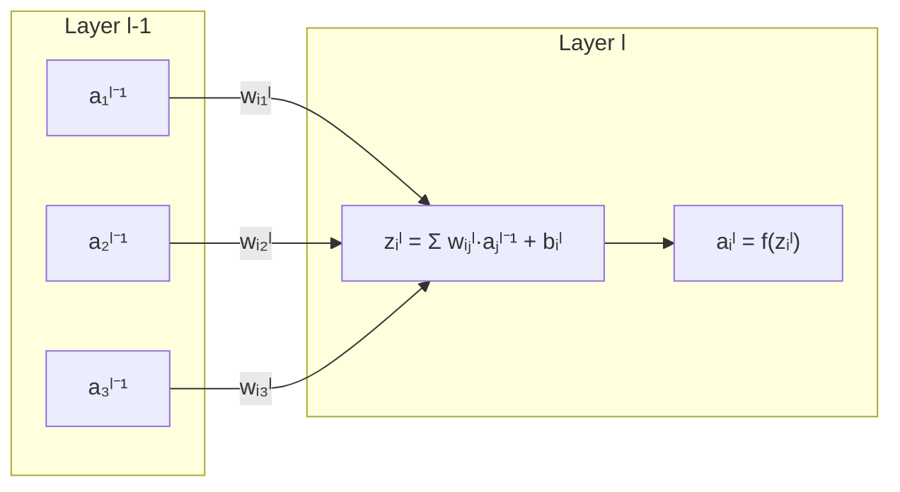
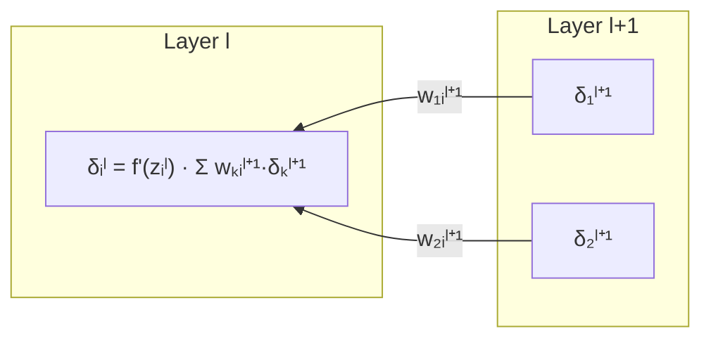
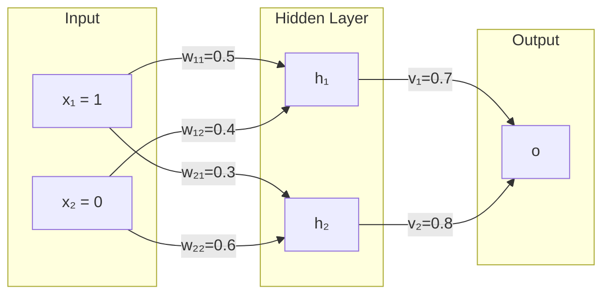
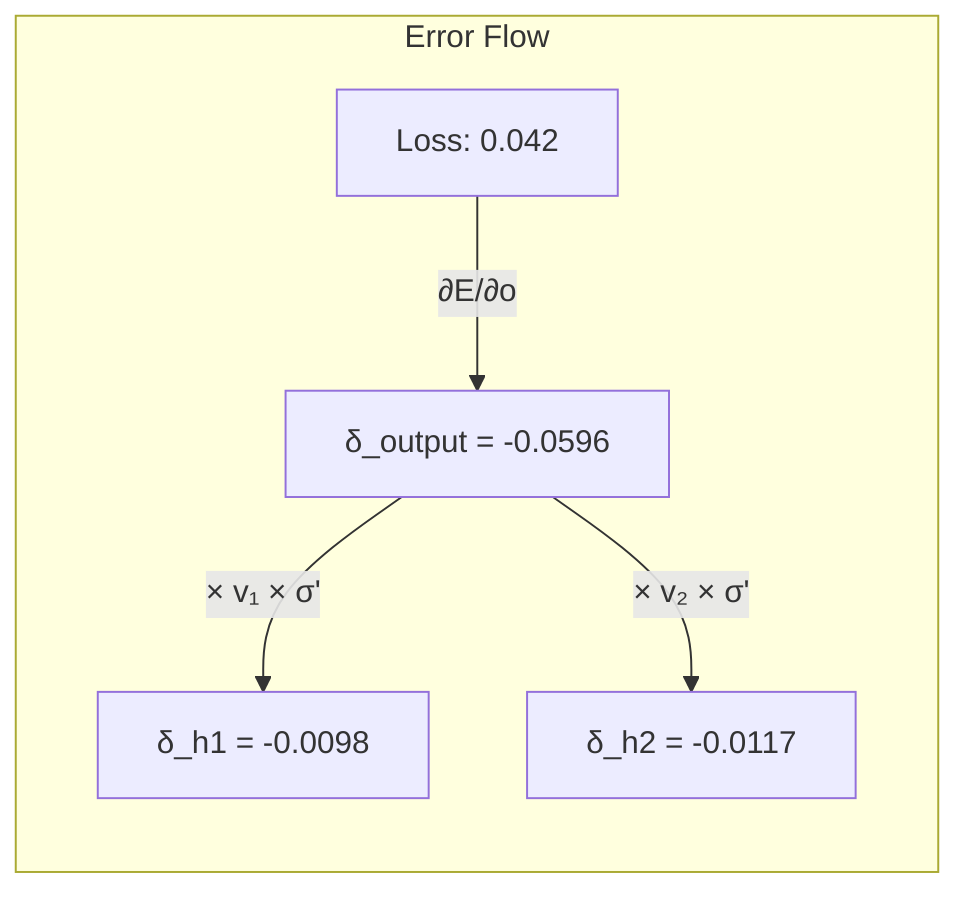

Neural networks learn by adjusting weights to minimize error.  
But how do we know *which* weight to change and by *how much*?  
The answer is **backpropagation** — the chain rule applied recursively through layers.

This post derives backpropagation from scratch, then walks through a concrete example where you can trace every number.

---

## Table of Contents

1. [The Problem: Credit Assignment](#1-the-problem-credit-assignment)
2. [Notation and Setup](#2-notation-and-setup)
3. [Forward Pass](#3-forward-pass)
4. [The Loss Function](#4-the-loss-function)
5. [Backward Pass: The Chain Rule](#5-backward-pass-the-chain-rule)
6. [The Delta Rule](#6-the-delta-rule)
7. [Complete Algorithm](#7-complete-algorithm)
8. [Worked Example: Numbers You Can Trace](#8-worked-example-numbers-you-can-trace)
9. [Why It Works: Intuition](#9-why-it-works-intuition)
10. [Common Pitfalls](#10-common-pitfalls)

---

## 1. The Problem: Credit Assignment

Imagine a factory assembly line with 10 workers. A defective product comes out. Who is responsible?

In a neural network:
- **Workers** = neurons
- **Assembly line** = layers
- **Defective product** = wrong prediction
- **Responsibility** = gradient

The **credit assignment problem**: how much did each weight contribute to the error?

Backpropagation solves this by propagating error signals backward, layer by layer, using the chain rule.

---

## 2. Notation and Setup

Consider a network with $L$ layers. For layer $l$:

| Symbol | Meaning |
|--------|---------|
| $w_{ij}^{l}$ | Weight from neuron $j$ in layer $l-1$ to neuron $i$ in layer $l$ |
| $b_i^{l}$ | Bias of neuron $i$ in layer $l$ |
| $z_i^{l}$ | Pre-activation (weighted sum) of neuron $i$ in layer $l$ |
| $a_i^{l}$ | Activation (output) of neuron $i$ in layer $l$ |
| $f$ | Activation function (e.g., sigmoid, ReLU) |

**Layer structure:**



---

## 3. Forward Pass

The forward pass computes predictions layer by layer.

**Step 1: Weighted Sum (Pre-activation)**

$$z_i^{l} = \sum_{j} w_{ij}^{l} \cdot a_j^{l-1} + b_i^{l}$$

**Step 2: Apply Activation**

$$a_i^{l} = f(z_i^{l})$$

**Common Activation Functions:**

| Function | Formula | Derivative |
|----------|---------|------------|
| Sigmoid | $\sigma(z) = \frac{1}{1 + e^{-z}}$ | $\sigma(z)(1 - \sigma(z))$ |
| Tanh | $\tanh(z) = \frac{e^z - e^{-z}}{e^z + e^{-z}}$ | $1 - \tanh^2(z)$ |
| ReLU | $\max(0, z)$ | $\begin{cases} 1 & z > 0 \\ 0 & z \leq 0 \end{cases}$ |

---

## 4. The Loss Function

The loss measures how wrong the prediction is.

**For regression (MSE):**

$$E = \frac{1}{2}(y - o)^2$$

where $y$ is the target and $o$ is the output.

**For binary classification (Binary Cross-Entropy):**

$$E = -[y \log(o) + (1-y) \log(1-o)]$$

**For multi-class (Cross-Entropy):**

$$E = -\sum_{k} y_k \log(o_k)$$

---

## 5. Backward Pass: The Chain Rule

The key insight: $E$ depends on $w_{ij}^l$ only through $z_i^l$.

By the chain rule:

$$\frac{\partial E}{\partial w_{ij}^{l}} = \frac{\partial E}{\partial z_i^{l}} \cdot \frac{\partial z_i^{l}}{\partial w_{ij}^{l}}$$

The second term is simple:

$$\frac{\partial z_i^{l}}{\partial w_{ij}^{l}} = a_j^{l-1}$$

Define the **delta term**:

$$\boxed{\delta_i^{l} = \frac{\partial E}{\partial z_i^{l}}}$$

Then:

$$\boxed{\frac{\partial E}{\partial w_{ij}^{l}} = \delta_i^{l} \cdot a_j^{l-1}}$$

The gradient is just delta times the incoming activation. Simple!

---

## 6. The Delta Rule

The magic of backpropagation: computing deltas recursively from output to input.

### 6.1 Delta at Output Layer

For the output layer $L$, the delta depends on the loss function and activation.

**Sigmoid activation + MSE loss:**

$$\delta_i^{L} = (o_i - y_i) \cdot \sigma'(z_i^{L}) = (o_i - y_i) \cdot o_i(1 - o_i)$$

**Sigmoid activation + Binary Cross-Entropy:**

$$\delta_i^{L} = o_i - y_i$$

**Softmax + Cross-Entropy:**

$$\delta_i^{L} = o_i - y_i$$

### 6.2 Delta at Hidden Layers

For hidden layer $l$, the delta depends on deltas from layer $l+1$:

$$\boxed{\delta_i^{l} = f'(z_i^{l}) \cdot \sum_{k} w_{ki}^{l+1} \cdot \delta_k^{l+1}}$$

**Interpretation:**
- $\delta_k^{l+1}$: Error signal from neuron $k$ in the next layer
- $w_{ki}^{l+1}$: How much neuron $i$ contributed to neuron $k$
- $f'(z_i^{l})$: How sensitive the activation was to the input
- Sum: Total error attributed to neuron $i$



---

## 7. Complete Algorithm

```
BACKPROPAGATION(network, x, y, α)
────────────────────────────────────────
1. FORWARD PASS
   For l = 1 to L:
       z[l] = W[l] · a[l-1] + b[l]
       a[l] = f(z[l])
   
2. COMPUTE OUTPUT DELTA
   δ[L] = ∂E/∂z[L]  (depends on loss + activation)

3. BACKWARD PASS
   For l = L-1 down to 1:
       δ[l] = f'(z[l]) ⊙ (W[l+1]ᵀ · δ[l+1])
   
4. GRADIENT DESCENT
   For l = 1 to L:
       W[l] ← W[l] - α · δ[l] · a[l-1]ᵀ
       b[l] ← b[l] - α · δ[l]
────────────────────────────────────────
```

---

## 8. Worked Example: Numbers You Can Trace

Let's trace backpropagation through a concrete 2-layer network.

### Network Setup



**Parameters:**
- Input: $x_1 = 1$, $x_2 = 0$
- Hidden weights: $w_{11} = 0.5$, $w_{12} = 0.4$, $w_{21} = 0.3$, $w_{22} = 0.6$
- Output weights: $v_1 = 0.7$, $v_2 = 0.8$
- Biases: all = 0 (for simplicity)
- Activation: Sigmoid $\sigma(z) = \frac{1}{1+e^{-z}}$
- Target: $y = 1$
- Learning rate: $\alpha = 0.5$

### Step 1: Forward Pass

**Hidden layer:**

$$z_1^{(1)} = w_{11} x_1 + w_{12} x_2 = 0.5 \times 1 + 0.4 \times 0 = 0.5$$

$$h_1 = \sigma(0.5) = \frac{1}{1 + e^{-0.5}} = 0.6225$$

$$z_2^{(1)} = w_{21} x_1 + w_{22} x_2 = 0.3 \times 1 + 0.6 \times 0 = 0.3$$

$$h_2 = \sigma(0.3) = \frac{1}{1 + e^{-0.3}} = 0.5744$$

**Output layer:**

$$z^{(2)} = v_1 h_1 + v_2 h_2 = 0.7 \times 0.6225 + 0.8 \times 0.5744 = 0.8953$$

$$o = \sigma(0.8953) = 0.7101$$

**Error:** $E = \frac{1}{2}(y - o)^2 = \frac{1}{2}(1 - 0.7101)^2 = 0.0420$

### Step 2: Output Delta

Using sigmoid + MSE:

$$\delta^{(2)} = (o - y) \cdot o(1 - o) = (0.7101 - 1) \cdot 0.7101 \cdot (1 - 0.7101)$$

$$\delta^{(2)} = -0.2899 \times 0.2058 = -0.0596$$

### Step 3: Hidden Deltas (Backpropagation)

**For $h_1$:**

$$\delta_1^{(1)} = h_1(1 - h_1) \cdot v_1 \cdot \delta^{(2)}$$

$$\delta_1^{(1)} = 0.6225 \times 0.3775 \times 0.7 \times (-0.0596) = -0.0098$$

**For $h_2$:**

$$\delta_2^{(1)} = h_2(1 - h_2) \cdot v_2 \cdot \delta^{(2)}$$

$$\delta_2^{(1)} = 0.5744 \times 0.4256 \times 0.8 \times (-0.0596) = -0.0117$$

### Step 4: Gradient Computation

**Output weights:**

$$\frac{\partial E}{\partial v_1} = \delta^{(2)} \cdot h_1 = -0.0596 \times 0.6225 = -0.0371$$

$$\frac{\partial E}{\partial v_2} = \delta^{(2)} \cdot h_2 = -0.0596 \times 0.5744 = -0.0342$$

**Hidden weights:**

$$\frac{\partial E}{\partial w_{11}} = \delta_1^{(1)} \cdot x_1 = -0.0098 \times 1 = -0.0098$$

$$\frac{\partial E}{\partial w_{12}} = \delta_1^{(1)} \cdot x_2 = -0.0098 \times 0 = 0$$

$$\frac{\partial E}{\partial w_{21}} = \delta_2^{(1)} \cdot x_1 = -0.0117 \times 1 = -0.0117$$

$$\frac{\partial E}{\partial w_{22}} = \delta_2^{(1)} \cdot x_2 = -0.0117 \times 0 = 0$$

### Step 5: Weight Update

Using $w_{\text{new}} = w_{\text{old}} - \alpha \cdot \nabla w$:

$$v_1^{\text{new}} = 0.7 - 0.5 \times (-0.0371) = 0.7186$$

$$v_2^{\text{new}} = 0.8 - 0.5 \times (-0.0342) = 0.8171$$

$$w_{11}^{\text{new}} = 0.5 - 0.5 \times (-0.0098) = 0.5049$$

$$w_{21}^{\text{new}} = 0.3 - 0.5 \times (-0.0117) = 0.3059$$

### Verification: New Forward Pass

With updated weights:

$$h_1^{\text{new}} = \sigma(0.5049 \times 1) = 0.6236$$

$$h_2^{\text{new}} = \sigma(0.3059 \times 1) = 0.5759$$

$$o^{\text{new}} = \sigma(0.7186 \times 0.6236 + 0.8171 \times 0.5759) = \sigma(0.9190) = 0.7148$$

**Output increased:** $0.7101 \rightarrow 0.7148$ (closer to target $y = 1$) ✓

---

## 9. Why It Works: Intuition

### The Chain of Blame

Think of backpropagation as assigning blame:

1. **Output error:** "The prediction was too low by 0.29"
2. **Output weights:** "I contributed $h_1 \times 0.29$ of that error"
3. **Hidden neurons:** "I received blame proportional to my output weight"
4. **Hidden weights:** "I contributed $x_i \times \text{my neuron's blame}$"



### Why Gradients Vanish

Notice: $\delta_1^{(1)} = -0.0098$ but $\delta^{(2)} = -0.0596$.

The hidden delta is **6x smaller** because:
- Sigmoid derivative: max 0.25 at $z=0$
- Each layer multiplies by $\sigma'(z) \leq 0.25$

With 10 layers: $0.25^{10} = 0.00000095$

This is the **vanishing gradient problem** — why ReLU and residual connections matter.

---

## 10. Common Pitfalls

### 10.1 Numerical Instability

**Problem:** Sigmoid saturates for $|z| > 5$, making $\sigma'(z) \approx 0$.

**Solution:** Use ReLU, batch normalization, or careful weight initialization.

### 10.2 Learning Rate

| Too Large | Too Small |
|-----------|-----------|
| Overshoots minimum | Converges slowly |
| Loss oscillates | Gets stuck |
| May diverge | Wastes compute |

**Rule of thumb:** Start with $\alpha = 0.001$, use learning rate schedulers.

### 10.3 Gradient Checking

Always verify your implementation with numerical gradients:

$$\frac{\partial E}{\partial w} \approx \frac{E(w + \epsilon) - E(w - \epsilon)}{2\epsilon}$$

Compare with your analytical gradient. They should match to $\sim 10^{-7}$.

---

## Summary

| Concept | Formula |
|---------|---------|
| Pre-activation | $z_i^l = \sum_j w_{ij}^l a_j^{l-1} + b_i^l$ |
| Activation | $a_i^l = f(z_i^l)$ |
| Delta (output) | $\delta_i^L = \frac{\partial E}{\partial o_i} \cdot f'(z_i^L)$ |
| Delta (hidden) | $\delta_i^l = f'(z_i^l) \sum_k w_{ki}^{l+1} \delta_k^{l+1}$ |
| Weight gradient | $\frac{\partial E}{\partial w_{ij}^l} = \delta_i^l \cdot a_j^{l-1}$ |
| Update rule | $w_{ij}^l \leftarrow w_{ij}^l - \alpha \cdot \delta_i^l \cdot a_j^{l-1}$ |

---

## Further Reading

- [Transformers — How Machines Pay Attention](/posts/fundamentals/transformers-attention-mechanism)
- [Reinforcement Learning — Intuition to Algorithms](/posts/fundamentals/reinforcement-learning-intuition-to-algorithms)
- [XGBoost — Second-Order Gradient Boosting](/posts/fundamentals/xgboost-second-order-gradient-boosting)

**References:**
- Rumelhart, Hinton, Williams. "Learning representations by back-propagating errors." Nature, 1986.
- Goodfellow, Bengio, Courville. "Deep Learning." MIT Press, 2016.
