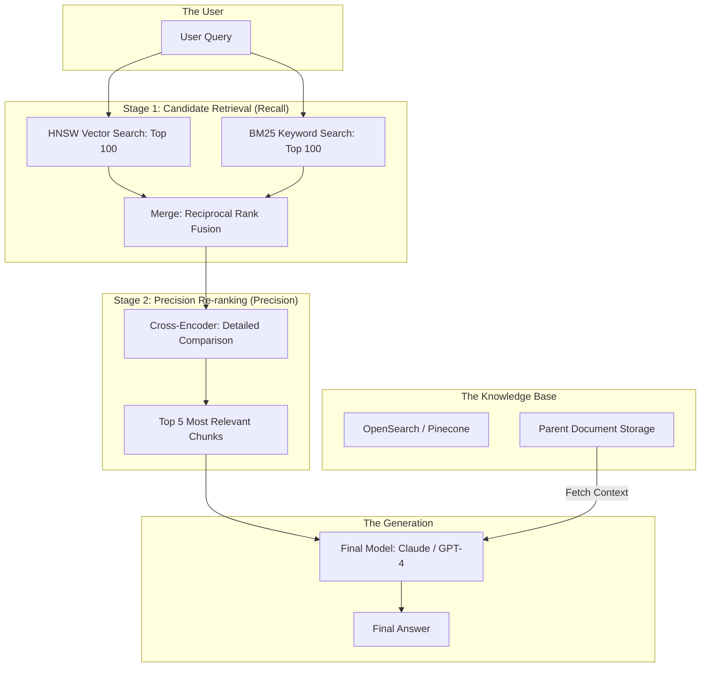

*By Gopi Krishna Tummala*

---

  
Information Retrieval Series — The Search Engine of AI

  

    <a href="/posts/generative-ai/building-production-rag-opensearch" style="background: rgba(255,255,255,0.25); padding: 0.5rem 1rem; border-radius: 6px; text-decoration: none; color: white; font-weight: 600; border: 2px solid rgba(255,255,255,0.5);">Module 1: Multimodal RAG</a>
    Module 2: Advanced Indexing (Coming Soon)
  

  
📖 You are reading <strong>Module 1: Multimodal RAG</strong> — Building Production Systems

---

### Act 0: RAG in Plain English

Imagine you have a super-intelligent intern (The LLM). He has read almost every book in the world, but he doesn't know anything about your company's private files or what happened in the news this morning.

1.  **Naive RAG:** Is like giving the intern a messy pile of 10,000 documents and asking him a question. He tries to quickly scan them, but he often misses the right page or gets confused by similar-looking reports.
2.  **Production RAG:** Is like giving the intern a high-speed, digital **Library Catalog** (The Vector Database). 
    *   **Search:** When you ask a question, the catalog points him to the exact 5 pages he needs.
    *   **Rerank:** He reads those 5 pages carefully to make sure they actually answer the question.
    *   **Generation:** He writes a perfect summary based only on those 5 pages.

**RAG** moves the AI from "Guessing based on memory" to "Researching based on facts."

---

### Act I: Vector Search Fundamentals (HNSW vs. IVF)

In a production system like OpenSearch, the choice of indexing algorithm is a multi-million dollar decision.

#### 1. HNSW (Hierarchical Navigable Small World)
*   **The Idea:** A multi-layered graph. It's like a "Skip List" for 3D space. 
*   **Pros:** Ultra-low latency (<1ms). High recall.
*   **Cons:** **Memory Hog.** The entire graph must live in RAM. If you have 100M vectors, you need 500GB+ of high-speed memory.

#### 2. IVF (Inverted File Index)
*   **The Idea:** Cluster the vectors into "neighborhoods" (Voronoi cells). 
*   **Pros:** Very memory efficient. Can handle billions of vectors on a few machines.
*   **Cons:** Slower. You have to search through multiple clusters to find the best match.

---

### Act II: Moving Beyond Naive Retrieval

Standard RAG (taking the top 5 vector matches) fails in the real world because "Semantic Similarity" is not the same as "Relevance."

#### 1. Hybrid Search (Keyword + Vector)
Vector search is great for "Concept" matching (e.g., "fast cars" $\to$ "Ferraris"). But it's terrible at "Keyword" matching (e.g., "Part #AX-452"). 
*   **The SOTA Fix:** Combine **BM25** (Keywords) and **k-NN** (Vectors) using **Reciprocal Rank Fusion (RRF)**.

#### 2. Query Rewriting
Users are bad at asking questions. We use a small, fast LLM (like GPT-4o-mini) to rewrite the user's messy query into a "Search-Engine Friendly" query before hitting the database.

---

#### Act II.V: Mature Architecture — The 2-Stage Retrieval Pipeline

The industry standard for high-precision RAG is a **Bi-Encoder + Cross-Encoder** architecture.

**The Production RAG Pipeline:**

##### 1. Cross-Encoder: The Truth Layer
In Stage 1 (Bi-Encoder), we compare the query vector to the document vector. This is fast but "shallow." 
In Stage 2 (Cross-Encoder), we feed the **Query AND Document** into the same model at once. This allows the model to see the word-by-word interaction, resulting in 20-30% higher accuracy.

##### 2. Trade-offs & Reasoning
*   **Latency vs. Accuracy:** A Cross-Encoder adds 100ms to the request. *Trade-off:* We only run the Cross-Encoder on the top 50 candidates, never the whole database.
*   **Chunk Size:** Small chunks (200 tokens) are easier to search. Large chunks (1000 tokens) provide better context. *The Mature Fix:* **Parent-Document Retrieval**. Search for children, but send the parent to the LLM.
*   **Citations:** *Lost in the Middle: How Language Models Use Long Contexts (Liu et al. 2023)* and *OpenSearch k-NN Documentation (2024)*.

---

### Act III: The Scorecard — Metrics & Evaluation

#### 1. The Metrics (Retrieval Quality)
*   **Recall@K:** What % of the time is the correct document in the top K results?
*   **MRR (Mean Reciprocal Rank):** Measures how high up the correct answer is in the list.
*   **nDCG (Normalized Discounted Cumulative Gain):** The gold standard. It rewards systems for putting the "Perfect" match at #1 and "Good" matches at #2.

#### 2. The Metrics (Generation Quality)
*   **Faithfulness:** Does the answer contradict the retrieved documents? (Anti-hallucination).
*   **Answer Relevance:** Does the answer actually address the user's question?

#### 3. Loss Functions (For Embedding Models)
*   **Contrastive Loss (InfoNCE):** Used to train CLIP and BERT embeddings. It "pulls" the query and the correct document together in vector space while "pushing" thousands of wrong documents away.

---

### Act IV: System Design & Interview Scenarios

#### Scenario 1: The "Lost in the Middle" Problem
*   **Question:** "Your model has a 128k context window. You retrieve 50 documents and stuff them all in. Why does the model still hallucinate?"
*   **Answer:** Research shows LLMs ignore the middle of long prompts. **The Fix:** Implement **Re-ranking** to put the most important info at the very top and very bottom. Use **Prompt Compression** to remove 50% of the filler words.

#### Scenario 2: Multimodal Challenges
*   **Question:** "You want to build a RAG system for a video library. How do you index 'Moments'?"
*   **Answer:** Discuss **Frame-level Embedding**. Use **CLIP** to embed frames every 1 second. Store them in OpenSearch with a `parent_id` pointing to the video metadata. Use a **Temporal VLM** to generate text captions for each scene to enable keyword search on top of vector search.

#### Scenario 3: Real-Time Data Freshness
*   **Question:** "Your product needs to answer questions about stock prices that change every minute. How does RAG handle this?"
*   **Answer:** You can't re-index every minute. **The Fix:** Use **Dynamic Filtering**. Store the vector but also a "Last Price" metadata field. At query time, perform a vector search but "Filter" by the latest metadata fetched from a fast SQL database (like Redis).

---

### Graduate Assignment: The Retrieval Architect

**Task:**
1.  **HNSW Scaling:** Calculate the RAM required to store 100 million vectors (1536 dimensions, FP32) with an HNSW graph overhead of 20%.
2.  **RRF Derivation:** Explain why $1 / (k + \text{rank})$ is more robust to "outlier" rankings than a simple average of ranks. 
3.  **Cross-Encoder Selection:** Why would you choose a **DistilRoBERTa** reranker over a full **BERT-Large** reranker for a production chat app?

---

**Further Reading:**
*   *BAAI/bge-reranker: The SOTA open-source reranker.*
*   *OpenSearch: Building a vector database at scale.*
*   *LlamaIndex: Orchestration patterns for production RAG.*

---

*This concludes the Information Retrieval series. From pixels to parents, the goal is always the same: Find the needle in the digital haystack.*
