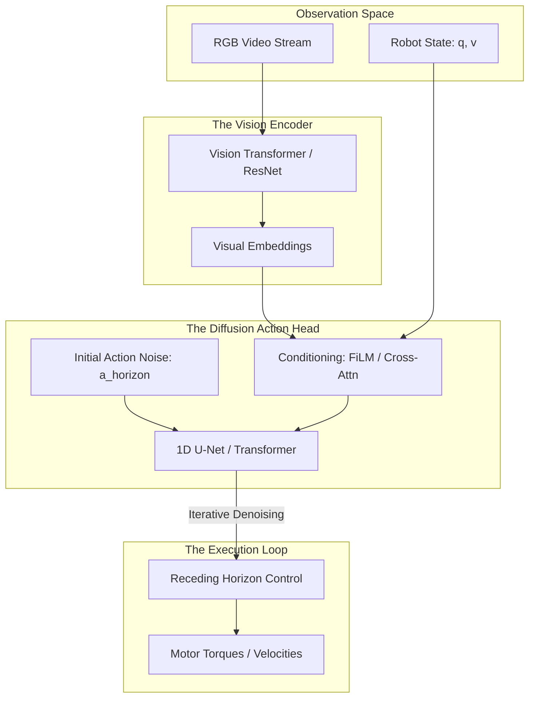

*By Gopi Krishna Tummala*

---

  
Diffusion Models Series — The Generative Engine

  

    <a href="/posts/generative-ai/diffusion-from-molecules-to-machines" style="background: rgba(255,255,255,0.1); padding: 0.5rem 1rem; border-radius: 6px; text-decoration: none; color: white; opacity: 0.9;">Part 1: Foundations</a>
    <a href="/posts/generative-ai/image-diffusion-models-unet-to-dit" style="background: rgba(255,255,255,0.1); padding: 0.5rem 1rem; border-radius: 6px; text-decoration: none; color: white; opacity: 0.9;">Part 2: Architectures</a>
    <a href="/posts/generative-ai/sampling-guidance-diffusion-models" style="background: rgba(255,255,255,0.1); padding: 0.5rem 1rem; border-radius: 6px; text-decoration: none; color: white; opacity: 0.9;">Part 3: Sampling & Guidance</a>
    <a href="/posts/generative-ai/video-diffusion-fundamentals" style="background: rgba(255,255,255,0.1); padding: 0.5rem 1rem; border-radius: 6px; text-decoration: none; color: white; opacity: 0.9;">Part 4: Video Models</a>
    <a href="/posts/generative-ai/pre-training-post-training-video-diffusion" style="background: rgba(255,255,255,0.1); padding: 0.5rem 1rem; border-radius: 6px; text-decoration: none; color: white; opacity: 0.9;">Part 5: Training Lifecycle</a>
    <a href="/posts/generative-ai/diffusion-for-action-trajectories-policy" style="background: rgba(255,255,255,0.25); padding: 0.5rem 1rem; border-radius: 6px; text-decoration: none; color: white; font-weight: 600; border: 2px solid rgba(255,255,255,0.5);">Part 6: Diffusion for Policy</a>
    <a href="/posts/generative-ai/modern-video-models-sora-veo-opensora" style="background: rgba(255,255,255,0.1); padding: 0.5rem 1rem; border-radius: 6px; text-decoration: none; color: white; opacity: 0.9;">Part 7: The Frontier</a>
    <a href="/posts/generative-ai/physics-aware-video-diffusion-models" style="background: rgba(255,255,255,0.1); padding: 0.5rem 1rem; border-radius: 6px; text-decoration: none; color: white; opacity: 0.9;">Part 8: Physics-Aware AI</a>
  

  
📖 You are reading <strong>Part 6: Diffusion for Action</strong> — Trajectories and Policy

---

### Act 0: Diffusion Policy in Plain English

Imagine you are teaching a robot to pour a glass of water.

1.  **Old Way (Deterministic):** You tell the robot exactly where each joint should be at every millisecond. If the glass is 1 inch to the left, the robot pours water on the table. It's too rigid.
2.  **New Way (Diffusion Policy):** You show the robot 100 videos of humans pouring water. The robot learns that "Pouring" is a smooth sequence of actions. It starts with a "Noisy" guess of what the arm should do, and then iteratively refines it until it has a perfect, smooth path to the glass.

**Diffusion Policy** treats a robot's movement like an image. Instead of denoising pixels to see a cat, it denoises **motor commands** to see a successful task.

---

### Act I: From Pixels to Policies

The key insight of **Diffusion Policy** (Chi et al. 2023) is that robot actions are just another form of sequential data.
*   **The Input:** Visual observations (Camera feeds) + Proprioception (Joint angles).
*   **The Output:** A **Horizon** of future actions $\tau = [a_{t+1}, a_{t+2}, \ldots, a_{t+H}]$.

#### Why it works better than MLP:
Standard neural networks output a single average action. If there are two ways to avoid an obstacle (Left or Right), an MLP will average them and drive **straight into the obstacle**. Diffusion preserves the "Multi-modality"—it can generate either a "Left" path or a "Right" path, but never a broken middle one.

---

#### Act I.V: Mature Architecture — The Diffusion Policy Stack

In production robotics, the architecture uses a "Visuomotor" backbone that fuses high-res vision with low-latency control.

**The Action Generation Pipeline:**

##### 1. Receding Horizon Control
The model predicts 16 steps into the future, but the robot only executes the **first 8 steps**. Then it throws the rest away and calculates a new 16-step plan. This "closed-loop" behavior allows the robot to react to a moving glass or a slippery floor in real-time.

##### 2. Trade-offs & Reasoning
*   **1D U-Net vs. Transformer:** 1D U-Nets are faster for short sequences ($H=16$). Transformers are better for long-term reasoning ($H=100$) but have higher latency.
*   **Training Data:** Unlike image models, these require **Demonstrations**. You need a human to "Teleoperate" the robot to provide the ground-truth trajectories.
*   **Citations:** *Diffusion Policy: Visuomotor Policy Learning via Action Diffusion (Chi et al. 2023)* and *Consistency Policy: Made for Real-Time Control (2024)*.

---

### Act II: The Scorecard — Metrics & Training

#### 1. The Metrics (The Robot's KPI)
*   **Success Rate (SR):** The % of trials where the robot completed the task (e.g., "The cup is full").
*   **Multi-modal Coverage:** If there are 3 ways to do a task, does the model find all 3 or just 1? (Measured by **KL Divergence** to the human data).
*   **Smoothness (Jerk):** Higher derivative of acceleration. Lower jerk = more human-like and less wear on the motors.

#### 2. The Loss Function (Trajectory Score Matching)
We minimize the error between the added noise and the predicted noise in the **Action sequence**.
$$ \mathcal{L}_{action} = \mathbb{E}_{\tau, \epsilon, k} [ \| \epsilon - \epsilon_\theta(\tau_k, k, O) \|^2 ] $$
Where $O$ is the visual observation.

---

### Act III: System Design & Interview Scenarios

#### Scenario 1: The "Jittery" Robot
*   **Question:** "Your robot successfully reaches the goal, but its arm is shaking violently. How do you fix it?"
*   **Answer:** Discuss **Action Chunking** and **Temporal Ensembling**. Instead of taking just the first action, average the overlapping predictions from the last 3 time steps. Also, add a **Smoothness Penalty** to the loss function.

#### Scenario 2: Handling Latency
*   **Question:** "Diffusion takes 100ms per inference, but your motor controller needs 500Hz (2ms). What's the bridge?"
*   **Answer:** Use an **Async Architecture**. The "High-Level" Diffusion Policy runs at 10Hz and outputs a 16-step spline. A "Low-Level" PD Controller (running at 500Hz) follows that spline. This decouples the "Thinking" from the "Reflexes."

#### Scenario 3: Generalization to New Environments
*   **Question:** "Your robot was trained in a bright lab but fails in a dark warehouse. What do you do?"
*   **Answer:** Discuss **Visual Foundation Model Distillation**. Replace the vision encoder with a frozen **DINOv2** or **CLIP** model. These models have seen "The Entire Internet" and are much more robust to lighting changes than a model trained only on lab data.

---

### Graduate Assignment: The World Model

**Task:**
1.  **Counterfactual Dreaming:** Explain how a robot can use a **Video Diffusion Model** to "dream" about what will happen if it turns left vs. right before it actually moves.
2.  **Constraint Guidance:** Derive how to add a "Collision Constraint" to the diffusion process using **Log-Barrier Gradients**.
3.  **Cross-Embodiment:** How can data from a **Humanoid robot** be used to improve the policy of a **4-wheeled delivery bot**?

---

**Further Reading:**
*   *Diffusion Policy (Chi et al. 2023)*
*   *UniPi: Universal Visual Affordances (2023)*
*   *Pi0: Generalist Robot Learning (Physical Intelligence 2025)*

---

**Previous:** [Part 5 — Training Lifecycle: Pre-Training & Post-Training](/posts/generative-ai/pre-training-post-training-video-diffusion)

**Next:** [Part 7 — The Frontier: Sora, Veo, and Beyond](/posts/generative-ai/modern-video-models-sora-veo-opensora)
