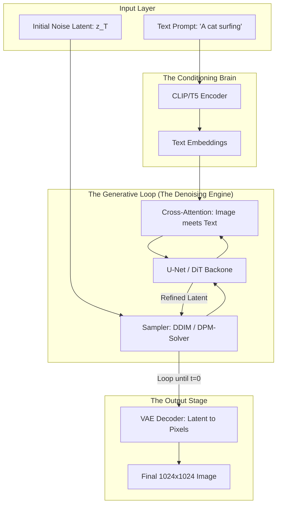

*By Gopi Krishna Tummala*

---

  
Diffusion Models Series — The Generative Engine

  

    <a href="/posts/generative-ai/diffusion-from-molecules-to-machines" style="background: rgba(255,255,255,0.25); padding: 0.5rem 1rem; border-radius: 6px; text-decoration: none; color: white; font-weight: 600; border: 2px solid rgba(255,255,255,0.5);">Part 1: Foundations</a>
    <a href="/posts/generative-ai/image-diffusion-models-unet-to-dit" style="background: rgba(255,255,255,0.1); padding: 0.5rem 1rem; border-radius: 6px; text-decoration: none; color: white; opacity: 0.9;">Part 2: Architectures</a>
    <a href="/posts/generative-ai/sampling-guidance-diffusion-models" style="background: rgba(255,255,255,0.1); padding: 0.5rem 1rem; border-radius: 6px; text-decoration: none; color: white; opacity: 0.9;">Part 3: Sampling & Guidance</a>
    <a href="/posts/generative-ai/video-diffusion-fundamentals" style="background: rgba(255,255,255,0.1); padding: 0.5rem 1rem; border-radius: 6px; text-decoration: none; color: white; opacity: 0.9;">Part 4: Video Models</a>
    <a href="/posts/generative-ai/pre-training-post-training-video-diffusion" style="background: rgba(255,255,255,0.1); padding: 0.5rem 1rem; border-radius: 6px; text-decoration: none; color: white; opacity: 0.9;">Part 5: Training Lifecycle</a>
    <a href="/posts/generative-ai/diffusion-for-action-trajectories-policy" style="background: rgba(255,255,255,0.1); padding: 0.5rem 1rem; border-radius: 6px; text-decoration: none; color: white; opacity: 0.9;">Part 6: Diffusion for Policy</a>
    <a href="/posts/generative-ai/modern-video-models-sora-veo-opensora" style="background: rgba(255,255,255,0.1); padding: 0.5rem 1rem; border-radius: 6px; text-decoration: none; color: white; opacity: 0.9;">Part 7: The Frontier</a>
    <a href="/posts/generative-ai/physics-aware-video-diffusion-models" style="background: rgba(255,255,255,0.1); padding: 0.5rem 1rem; border-radius: 6px; text-decoration: none; color: white; opacity: 0.9;">Part 8: Physics-Aware AI</a>
  

  
📖 You are reading <strong>Part 1: Foundations</strong> — From Molecules to Machines

---

### Act 0: Diffusion in Plain English

Imagine you have a glass of clear water. You drop a single bead of blue ink into it. At first, the bead is distinct. Slowly, it spreads, blurring into a cloud, until eventually, the entire glass is a uniform, pale blue.

This is **Forward Diffusion**. In nature, it's the process of things becoming messy, uniform, and losing their original structure.

Now, imagine if you had a magic wand. You wave it at that pale blue water, and the ink starts to "un-spread." The blurry blue cloud pulls itself back into that tiny, distinct bead of ink. 

**Reverse Diffusion** is that magic wand. In AI, we take a structured piece of data (like an image of a cat), turn it into "TV static" (noise), and then teach a neural network to perfectly reverse that process—pulling a beautiful cat out of random static.

The magic isn't in memorizing the cat; it's in **learning the physics of the ink**.

---

### Act I: The Physics of Information Loss

Diffusion is mathematically described by the **heat equation**:

$$ \frac{\partial u}{\partial t} = D \nabla^2 u $$

This equation tells us how temperature or concentration smooths out over time. In AI, we treat "Information" like heat. When we add noise to an image, we are effectively "heating it up" until it melts into a uniform puddle of randomness.

#### The Problem of Time Reversal
Solving the heat equation *backwards* is a classic "ill-posed" problem. Tiny errors in the puddle explode into massive mistakes in the reconstruction. 

**The AI Breakthrough:** Instead of solving the equation deterministically, we solve it **probabilistically**. We don't try to find the *one* original image; we find the *most likely* next step toward a real image.

---

### Act II: Reversing the Stochastic Process

Diffusion models sitting at the intersection of thermodynamics and probability. They learn the **Score Function** $\nabla_x \log p_t(x)$ — the "Probability Compass."

#### The Forward Process (Noising)
We take an image $x_0$ and add Gaussian noise $\epsilon$ over $T$ steps:
$$ x_t = \sqrt{\alpha_t} x_0 + \sqrt{1-\alpha_t}\, \epsilon, \quad \epsilon \sim \mathcal{N}(0, I) $$

#### The Reverse Process (Denoising)
The neural network acts as a digital restorer. At any noisy step $t$, it looks at the static and guesses: *"Which part of this is noise?"*

---

#### Act II.V: Mature Architecture — The Diffusion Pipeline

In a production environment (Stable Diffusion, Midjourney), the architecture has evolved into a multi-tier pipeline that separates **semantic understanding** from **pixel generation**.

**The Generative Pipeline (Mature Architecture):**

##### 1. The Core Denoising Backbone
*   **U-Net:** Uses skip connections to preserve fine details while understanding global structure.
*   **DiT (Diffusion Transformer):** In 2025, we use Transformers instead of Convolutions to scale to 4K resolutions and long-duration videos.

##### 2. Latent Space: The Efficiency Trick
We don't diffuse pixels directly ($512 \times 512 \times 3$). We use a **VAE (Variational Autoencoder)** to compress the image into a "Latent Space" ($64 \times 64 \times 4$). This reduces compute by 64x while keeping all the important information.

---

### Act III: The Scorecard — Metrics & Losses

#### 1. The Metrics (How we measure creativity)
*   **FID (Fréchet Inception Distance):** The industry standard. It compares the "distribution" of generated images to real ones. Lower is better. A score of **< 10** is considered photorealistic.
*   **CLIP Score:** Measures how well the image matches the prompt. Does the image actually show a "cat surfing"?
*   **IS (Inception Score):** Measures both the "clarity" of objects and the "diversity" of the generated set.

#### 2. The Loss Function (Predicting the Noise)
The model doesn't learn to "draw." It learns to **predict the static**.
$$ \mathcal{L} = \mathbb{E}_{x_0, \epsilon, t} \left[ \| \epsilon - \epsilon_\theta(x_t, t) \|^2 \right] $$
We minimize the squared difference between the **real noise** we added and the **noise predicted** by the model.

---

### Act IV: System Design & Interview Scenarios

#### Scenario 1: The "Grey Bias" (Zero SNR)
*   **Question:** "Your model generates great images but they all look slightly washed out and never truly 'Black'. Why?"
*   **Answer:** This is the **SNR Problem**. Standard noise schedules never reach 100% noise. A tiny ghost of the original image remains. **The Fix:** Implement a **Zero SNR** schedule where the final step is mathematically guaranteed to be pure noise.

#### Scenario 2: Latency vs. Quality
*   **Question:** "Generating an image takes 20 seconds. Your product team needs it in 2 seconds. What do you change?"
*   **Answer:** Discuss **Sampler Swap**. Move from DDPM (1000 steps) to **DPM-Solver** or **Flow Matching** (4-8 steps). Mention that you trade off a tiny bit of diversity for massive speedup.

#### Scenario 3: Memory Bottlenecks
*   **Question:** "You want to run Stable Diffusion on a mobile phone with only 4GB of VRAM. What's the plan?"
*   **Answer:** Discuss **Model Distillation** and **Quantization**. Convert weights from FP32 to **INT8** or **FP8**. Use a "Student" model that learns to do in 1 step what the "Teacher" did in 50.

---

### Graduate Assignment: The Thermodynamics of Generative AI

**Task:**
1.  **Probability Compass:** Explain why the **Score Function** $\nabla_x \log p(x)$ points toward the "Cat" region of the data manifold.
2.  **Information Entropy:** If you add too much noise too fast, why does the model fail to learn? (Look up **Signal-to-Noise Ratio (SNR)** weighting).
3.  **Guidance Control:** Derive how **Classifier-Free Guidance** allows you to "crank up" the prompt influence by subtracting the unconditioned prediction from the conditioned one.

---

**Further Reading:**
*   *DDPM: Denoising Diffusion Probabilistic Models (Ho et al. 2020)*
*   *Improved Denoising Diffusion Probabilistic Models (Nichol & Dhariwal 2021)*
*   *High-Resolution Image Synthesis with Latent Diffusion Models (Rombach et al. 2022)*

---

**Next:** [Part 2 — Image Diffusion: From U-Net to DiT](/posts/generative-ai/image-diffusion-models-unet-to-dit)
