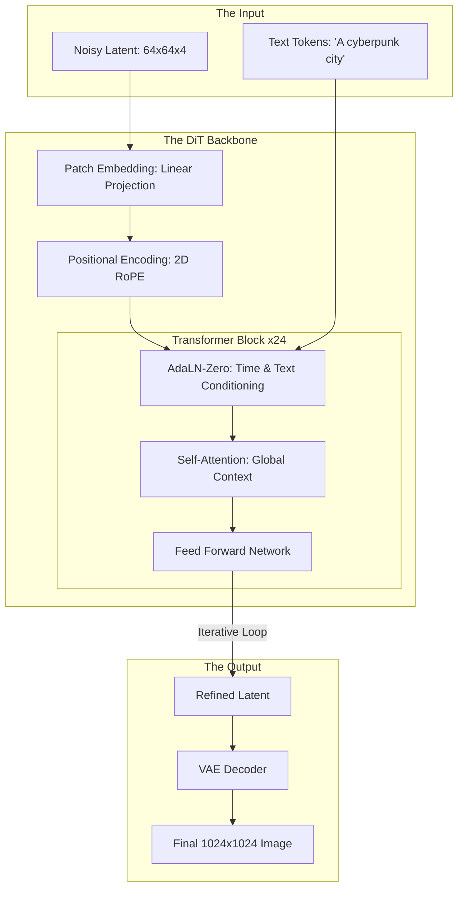

*By Gopi Krishna Tummala*

---

  
Diffusion Models Series — The Generative Engine

  

    <a href="/posts/generative-ai/diffusion-from-molecules-to-machines" style="background: rgba(255,255,255,0.1); padding: 0.5rem 1rem; border-radius: 6px; text-decoration: none; color: white; opacity: 0.9;">Part 1: Foundations</a>
    <a href="/posts/generative-ai/image-diffusion-models-unet-to-dit" style="background: rgba(255,255,255,0.25); padding: 0.5rem 1rem; border-radius: 6px; text-decoration: none; color: white; font-weight: 600; border: 2px solid rgba(255,255,255,0.5);">Part 2: Architectures</a>
    <a href="/posts/generative-ai/sampling-guidance-diffusion-models" style="background: rgba(255,255,255,0.1); padding: 0.5rem 1rem; border-radius: 6px; text-decoration: none; color: white; opacity: 0.9;">Part 3: Sampling & Guidance</a>
    <a href="/posts/generative-ai/video-diffusion-fundamentals" style="background: rgba(255,255,255,0.1); padding: 0.5rem 1rem; border-radius: 6px; text-decoration: none; color: white; opacity: 0.9;">Part 4: Video Models</a>
    <a href="/posts/generative-ai/pre-training-post-training-video-diffusion" style="background: rgba(255,255,255,0.1); padding: 0.5rem 1rem; border-radius: 6px; text-decoration: none; color: white; opacity: 0.9;">Part 5: Training Lifecycle</a>
    <a href="/posts/generative-ai/diffusion-for-action-trajectories-policy" style="background: rgba(255,255,255,0.1); padding: 0.5rem 1rem; border-radius: 6px; text-decoration: none; color: white; opacity: 0.9;">Part 6: Diffusion for Policy</a>
    <a href="/posts/generative-ai/modern-video-models-sora-veo-opensora" style="background: rgba(255,255,255,0.1); padding: 0.5rem 1rem; border-radius: 6px; text-decoration: none; color: white; opacity: 0.9;">Part 7: The Frontier</a>
    <a href="/posts/generative-ai/physics-aware-video-diffusion-models" style="background: rgba(255,255,255,0.1); padding: 0.5rem 1rem; border-radius: 6px; text-decoration: none; color: white; opacity: 0.9;">Part 8: Physics-Aware AI</a>
  

  
📖 You are reading <strong>Part 2: Architectures</strong> — From U-Net to DiT

---

### Act 0: Image Architectures in Plain English

Imagine you are trying to describe a photo of a crowded city street to an artist.

1.  **The U-Net Approach (Convolutional):** You give the artist a magnifying glass. He looks at tiny sections of the photo—a tire, a brick, a shoelace—and tries to piece them together. He's great at textures, but he might accidentally draw a car with five wheels because he forgot what the first wheel looked like by the time he got to the back of the car.
2.  **The DiT Approach (Transformer):** You give the artist the whole photo at once. He chops it into "Puzzle Pieces" (Patches) and lays them all out on a table. He can see how the shoelace on the left relates to the skyscraper on the right instantly. He treats the image like a **sentence**, where every patch is a word.

**U-Nets** were the kings of 2022. **Transformers (DiT)** are the kings of 2025 because they can "see" the big picture much better, which is essential for consistent physics and high resolution.

---

### Act I: The U-Net Era (Convolutional Foundations)

For years, the **U-Net** was the only choice for diffusion. Its hourglass shape is mathematically elegant for denoising:
*   **Encoder:** Zooms out to see the "Big Picture" (Semantic content).
*   **Decoder:** Zooms in to restore the "Fine Details" (Edges, textures).
*   **Skip Connections:** The "Highways" that carry sharp details directly from the beginning to the end, preventing them from being lost in the middle.

#### Why it peaked:
U-Nets are incredibly efficient at small resolutions ($512 \times 512$). But as we moved to $1024 \times 1024$ and beyond, the "magnifying glass" became too heavy. We needed a global perspective.

---

### Act II: The DiT Revolution (Images as Language)

**Diffusion Transformers (DiT)** changed the game by applying the same math that powers ChatGPT to images.

#### The Patchification Trick
Instead of looking at pixels, we chop the image into $16 \times 16$ squares called **Patches**. We treat these patches as **Tokens**. 
*   **The Benefit:** The model uses **Self-Attention** to calculate the relationship between *every* patch and *every other* patch. A shadow in the corner "attends" to the lamp in the center.

---

#### Act II.V: Mature Architecture — The DiT Pipeline

In a modern 2025 stack (Flux, Sora, SD3), we use a unified Transformer backbone that can handle images, videos, and text in the same latent space.

**The DiT Generation Pipeline:**

##### 1. RoPE: Rotational Positional Embeddings
In DiT, the model needs to know *where* each patch is. Modern models use **RoPE**, which allows them to handle any aspect ratio (Landscape, Portrait, Square) without being retrained.

##### 2. AdaLN-Zero: The Conditioning Secret
How do we tell a Transformer what time step $t$ we are at? We use **Adaptive Layer Norm (AdaLN)**. It "shifts" and "scales" the neural signals based on the time and the text prompt, effectively steering the denoising process at every layer.

---

### Act III: The Scorecard — Metrics & Losses

#### 1. The Metrics (The Quality KPI)
*   **HPS (Human Preference Score):** Since FID can be "gamed," we use models trained on human votes to see which image looks "better."
*   **CLIP Directional Similarity:** Measures if the difference between two images matches the difference between two text prompts (e.g., "A cat" $\to$ "A blue cat").
*   **V-Prediction Variance:** Measures how stable the model's predictions are across time steps.

#### 2. The Loss Function (V-Prediction)
Older models predicted "Noise" ($\epsilon$). Modern ones predict the **Velocity** ($v$) of the change.
$$ \mathcal{L}_{v} = \| v_t - \hat{v}_\theta(x_t, t) \|^2 $$
*   **Why?** $v$-prediction is more stable at high noise levels and allows for fewer sampling steps (Flow Matching).

---

### Act IV: System Design & Interview Scenarios

#### Scenario 1: Scaling to 4K
*   **Question:** "You want to generate 4K images. Your VRAM usage is exploding. What's the fix?"
*   **Answer:** Discuss **Tiled VAE Decoding**. The Diffusion model works in latent space (small), but the VAE decoder needs a lot of memory for 4K. **The Fix:** Decode the image in small overlapping tiles and stitch them together. Also, mention **FlashAttention-3** to handle the long token sequences.

#### Scenario 2: Aspect Ratio Bucketing
*   **Question:** "Your model was trained on squares, but it generates 'two-headed' people when asked for a wide landscape. Why?"
*   **Answer:** This is **Convolutional Bias** (if U-Net) or **Positional Bias** (if DiT). **The Fix:** Use **Aspect Ratio Bucketing** during training—group images of similar shapes into the same batch and use **2D RoPE** so the model learns that "coordinates" are relative, not fixed.

#### Scenario 3: CNN vs. Transformer Trade-offs
*   **Question:** "When would you still choose a U-Net over a DiT?"
*   **Answer:** For **Medical Imaging** or **Satellite Data** where local texture and exact pixel alignment are more important than global "creativity." U-Nets have a built-in "inductive bias" for local patterns that Transformers have to learn from scratch.

---

### Graduate Assignment: The Transformer Scaling Law

**Task:**
1.  **Compute Math:** If you double the number of patches (going from $512 \to 1024$ resolution), how does the compute cost of the **Self-Attention** layer change? (Hint: It's $O(N^2)$).
2.  **The Bottleneck:** Explain how **Latent Diffusion** moves this $N^2$ bottleneck from pixel-space to a much smaller latent-space.
3.  **The Solution:** Describe how **Linear Attention** or **FlashAttention** allows us to generate long videos without hitting the memory wall.

---

**Further Reading:**
*   *Scalable Diffusion Models with Transformers (Peebles & Xie 2023)*
*   *Stable Diffusion 3: Scaling Rectified Flow Transformers (Stability AI 2024)*
*   *Flux: The Black Forest Labs Architecture.*

---

**Previous:** [Part 1 — Foundations: From Molecules to Machines](/posts/generative-ai/diffusion-from-molecules-to-machines)

**Next:** [Part 3 — Sampling & Guidance: The Dialects of Noise](/posts/generative-ai/sampling-guidance-diffusion-models)
