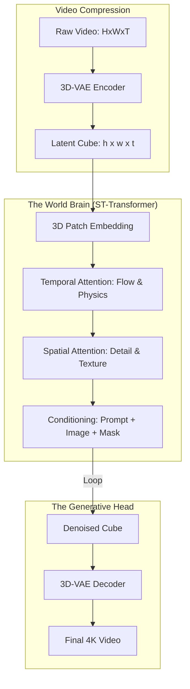

*By Gopi Krishna Tummala*

---

  
Diffusion Models Series — The Generative Engine

  

    <a href="/posts/generative-ai/diffusion-from-molecules-to-machines" style="background: rgba(255,255,255,0.1); padding: 0.5rem 1rem; border-radius: 6px; text-decoration: none; color: white; opacity: 0.9;">Part 1: Foundations</a>
    <a href="/posts/generative-ai/image-diffusion-models-unet-to-dit" style="background: rgba(255,255,255,0.1); padding: 0.5rem 1rem; border-radius: 6px; text-decoration: none; color: white; opacity: 0.9;">Part 2: Architectures</a>
    <a href="/posts/generative-ai/sampling-guidance-diffusion-models" style="background: rgba(255,255,255,0.1); padding: 0.5rem 1rem; border-radius: 6px; text-decoration: none; color: white; opacity: 0.9;">Part 3: Sampling & Guidance</a>
    <a href="/posts/generative-ai/video-diffusion-fundamentals" style="background: rgba(255,255,255,0.1); padding: 0.5rem 1rem; border-radius: 6px; text-decoration: none; color: white; opacity: 0.9;">Part 4: Video Models</a>
    <a href="/posts/generative-ai/pre-training-post-training-video-diffusion" style="background: rgba(255,255,255,0.1); padding: 0.5rem 1rem; border-radius: 6px; text-decoration: none; color: white; opacity: 0.9;">Part 5: Training Lifecycle</a>
    <a href="/posts/generative-ai/diffusion-for-action-trajectories-policy" style="background: rgba(255,255,255,0.1); padding: 0.5rem 1rem; border-radius: 6px; text-decoration: none; color: white; opacity: 0.9;">Part 6: Diffusion for Policy</a>
    <a href="/posts/generative-ai/modern-video-models-sora-veo-opensora" style="background: rgba(255,255,255,0.25); padding: 0.5rem 1rem; border-radius: 6px; text-decoration: none; color: white; font-weight: 600; border: 2px solid rgba(255,255,255,0.5);">Part 7: The Frontier</a>
    <a href="/posts/generative-ai/physics-aware-video-diffusion-models" style="background: rgba(255,255,255,0.1); padding: 0.5rem 1rem; border-radius: 6px; text-decoration: none; color: white; opacity: 0.9;">Part 8: Physics-Aware AI</a>
  

  
📖 You are reading <strong>Part 7: The Frontier</strong> — Sora, Veo, and Beyond

---

### Act 0: Video Foundations in Plain English

Imagine you are trying to flip through a notebook to create a "flipbook" animation of a dancing man.

1.  **Image Diffusion:** Is like drawing one perfect page of the notebook.
2.  **Video Diffusion:** Is like making sure that if the man's arm is up on Page 1, it's only *slightly* moved on Page 2, and not suddenly replaced by a leg.

**Sora** and **Veo** are the ultimate flipbook artists. They don't just draw one page at a time; they treat the whole notebook as a single **3D block of paper**. They look at the height, the width, and the **Time** all at once. This allows them to "understand" that if a man walks behind a tree, he should reappear on the other side, not vanish into thin air.

---

### Act I: Video as Spatiotemporal Patches

The breakthrough of Sora (OpenAI 2024) was treating video like **patches in 3D space**.
*   **Space:** The $X$ and $Y$ of the image.
*   **Time:** The $T$ dimension (the sequence of frames).

#### The Spatiotemporal Latent:
We take a video and compress it using a **3D-VAE**. This turns a $1024 \times 1024 \times 60$ video into a compact "Brick" of latent tokens. Each token represents a small "Cube" of the video (e.g., $16 \times 16$ pixels over 4 frames).

---

#### Act I.V: Mature Architecture — The World Simulator

Modern video models use a **Spatiotemporal Transformer (ST-Transformer)**. It replaces the U-Net completely to handle the massive context of thousands of tokens.

**The Video Generation Pipeline:**

##### 1. Temporal Attention
This is the "Motion Engine." Each patch looks at the patches in the **same location** in previous and future frames. This ensures that a car moving at 60mph has a consistent velocity and doesn't "jitter."

##### 2. Trade-offs & Reasoning
*   **Joint Space-Time vs. Factorized:** Should we do one big attention pass ($O(N^2)$) or one Spatial pass and then one Temporal pass? *Trade-off:* Joint is more physically accurate but requires massive memory. Most open models (Open-Sora) use **Factorized Attention** to fit on consumer GPUs.
*   **Autoregressive vs. Non-Autoregressive:** Non-autoregressive (Sora) generates the whole clip at once. *Trade-off:* It has better global consistency but is limited to short durations (e.g., 60s). Autoregressive models can generate "Infinite" video but slowly drift into "Dream Logic" where the world changes randomly.

---

### Act II: The Scorecard — Metrics & Fidelity

#### 1. The Metrics (The Cinematic KPI)
*   **VBench Score:** A comprehensive suite measuring 16 dimensions like object occupancy, motion smoothness, and aesthetic quality.
*   **FVD (Fréchet Video Distance):** Like FID, but for videos. It checks if the "Motion Distribution" matches real life.
*   **Temporal Consistency:** Measuring the pixel-wise variance of an object's ID across 100 frames.

#### 2. The Loss Function (3D Noise Prediction)
We calculate the error across the entire spatiotemporal cube.
$$ \mathcal{L}_{video} = \sum_{t, x, y} \| \epsilon - \epsilon_\theta(z_{noisy}, \text{prompt}) \|^2 $$

---

### Act III: System Design & Interview Scenarios

#### Scenario 1: The "Morphing" Problem
*   **Question:** "Your model generates a person walking, but their clothes change color every 10 frames. How do you fix this?"
*   **Answer:** This is a **Temporal Context** leak. You need to increase the **Temporal Attention window** or use **Long-Context Transformers** (like Ring Attention). You could also use a "Reference Frame" as a constant condition at every step.

#### Scenario 2: Physical Plausibility
*   **Question:** "In your generated video, a glass falls but instead of breaking, it melts into the table. Why?"
*   **Answer:** The model lacks **Causal Physics**. It has learned visual patterns but not mass/collision rules. **The Fix:** Fine-tune the model on **Synthetic Physics Data** (from engines like Unreal Engine 5) where the "Ground Truth" physics are perfectly labeled.

#### Scenario 3: Inference Cost at Scale
*   **Question:** "Generating 1 minute of video takes 1 hour on an H100. How do you make it 10x faster for a consumer app?"
*   **Answer:** Discuss **Distillation** (Progressive Distillation) and **Parallel Sampling**. Run multiple chunks of the video in parallel on different GPUs and use **Cross-Frame Blending** to stitch the edges smoothly.

---

### Graduate Assignment: The World Simulator

**Task:**
1.  **Object Permanence:** Derive how **Self-Attention** allows a model to "remember" an object even when it is occluded by another object for 20 frames.
2.  **Scale Analysis:** Calculate the VRAM requirement for a **Joint ST-Transformer** vs. a **Factorized Transformer** for a $1024 \times 1024 \times 120$ video.
3.  **Generative Simulation:** Explain how an Autonomous Vehicle company could use Sora to generate "Accident Scenarios" that are too dangerous to film in real life.

---

**Further Reading:**
*   *Sora: Creating Video from Text (OpenAI Technical Report 2024)*
*   *Video Generation Models as World Simulators (2024)*
*   *Open-Sora: Scaling Open-source Video Generation.*

---

**Previous:** [Part 6 — Diffusion for Action: Trajectories and Policy](/posts/generative-ai/diffusion-for-action-trajectories-policy)

**Next:** [Part 8 — Physics-Aware Video Diffusion: From Pixels to Laws](/posts/generative-ai/physics-aware-video-diffusion-models)

