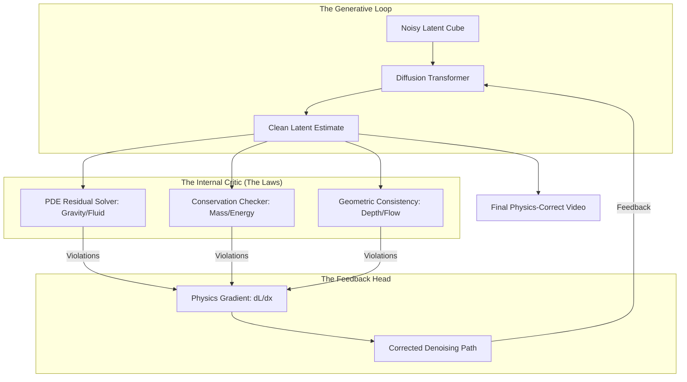

*By Gopi Krishna Tummala*

---

  
Diffusion Models Series — The Generative Engine

  

    <a href="/posts/generative-ai/diffusion-from-molecules-to-machines" style="background: rgba(255,255,255,0.1); padding: 0.5rem 1rem; border-radius: 6px; text-decoration: none; color: white; opacity: 0.9;">Part 1: Foundations</a>
    <a href="/posts/generative-ai/image-diffusion-models-unet-to-dit" style="background: rgba(255,255,255,0.1); padding: 0.5rem 1rem; border-radius: 6px; text-decoration: none; color: white; opacity: 0.9;">Part 2: Architectures</a>
    <a href="/posts/generative-ai/sampling-guidance-diffusion-models" style="background: rgba(255,255,255,0.1); padding: 0.5rem 1rem; border-radius: 6px; text-decoration: none; color: white; opacity: 0.9;">Part 3: Sampling & Guidance</a>
    <a href="/posts/generative-ai/video-diffusion-fundamentals" style="background: rgba(255,255,255,0.1); padding: 0.5rem 1rem; border-radius: 6px; text-decoration: none; color: white; opacity: 0.9;">Part 4: Video Models</a>
    <a href="/posts/generative-ai/pre-training-post-training-video-diffusion" style="background: rgba(255,255,255,0.1); padding: 0.5rem 1rem; border-radius: 6px; text-decoration: none; color: white; opacity: 0.9;">Part 5: Training Lifecycle</a>
    <a href="/posts/generative-ai/diffusion-for-action-trajectories-policy" style="background: rgba(255,255,255,0.1); padding: 0.5rem 1rem; border-radius: 6px; text-decoration: none; color: white; opacity: 0.9;">Part 6: Diffusion for Policy</a>
    <a href="/posts/generative-ai/modern-video-models-sora-veo-opensora" style="background: rgba(255,255,255,0.1); padding: 0.5rem 1rem; border-radius: 6px; text-decoration: none; color: white; opacity: 0.9;">Part 7: The Frontier</a>
    <a href="/posts/generative-ai/physics-aware-video-diffusion-models" style="background: rgba(255,255,255,0.25); padding: 0.5rem 1rem; border-radius: 6px; text-decoration: none; color: white; font-weight: 600; border: 2px solid rgba(255,255,255,0.5);">Part 8: Physics-Aware AI</a>
  

  
📖 You are reading <strong>Part 8: Physics-Aware AI</strong> — From Pixels to Laws

---

### Act 0: Physics-Aware AI in Plain English

Imagine you are watching a video of a glass falling off a table.

1.  **Standard Video AI:** Is like a child who has watched thousands of movies. He draws the glass falling because that's what usually happens in movies. But sometimes, he accidentally draws the glass floating upward or disappearing because he doesn't *really* know why it's falling.
2.  **Physics-Aware AI:** Is like a scientist with a sketchbook. As he draws the glass falling, he is constantly checking his math: "Wait, gravity is $9.8 m/s^2$, so this glass should be moving faster in Frame 5 than in Frame 2." 

If the drawing violates the laws of physics, the scientist erases it and redraws it until the **math and the art match**. This is the key to moving from "Fake Videos" to "World Simulators" that can train robots and autonomous cars.

---

### Act I: The Shift from Imitation to Causal Motion

Standard video models (Pixels) excel at **Imitation**. They roll a rock down a hill by statistical pattern-matching.
**Physics-Aware Models (Dynamics)** excel at **Causality**. They roll the rock by understanding gravity and conservation of energy.

#### Why it matters:
In robotics, if your "imagined" video shows a falling object floating like a balloon, you can't use that video to train a robot's perception. It would learn the wrong physics.

---

### Act II: Three Pillars of Neural Physics

Research has coalesced around three ways to "teach" a model the laws of nature.

#### 1. Explicit Physics (The PDE Loss)
We add a mathematical constraint directly into the training loop.
*   **The Math:** $\mathcal{L}_{total} = \mathcal{L}_{denoise} + \lambda \cdot \| \mathcal{F}(\hat{x}) \|^2$.
*   **How it works:** If $\mathcal{F}$ is the Navier-Stokes equation (fluid dynamics), the model is penalized if the generated fluid "hallucinates" more mass out of nowhere.

#### 2. Implicit Control (Mask Driving)
We don't give the model equations; we give it a "steering wheel."
*   **Innovation:** Using models like **InterDyn**, we provide a sparse trajectory (a line showing where the ball should go). The model fills in the tumbling, friction, and collisions based on its pre-trained visual knowledge.

---

#### Act II.V: Mature Architecture — The Physics-Informed Pipeline

In a 2025 production stack (like **NVIDIA Cosmos**), physics isn't an afterthought—it's an integrated "Internal Critic."

**The Physics-Aware Generation Pipeline:**

##### 1. Differentiable Physics Operators
To train this model, the physics laws themselves must be written in a way the neural network can understand (Differentiable). We use libraries like **NVIDIA Warp** or **JAX** to calculate the "Physics Gradient."

##### 2. Trade-offs & Reasoning
*   **Accuracy vs. Latency:** Calculating PDE residuals for every frame makes generation 5x slower. *Trade-off:* For scientific simulation (weather, aero), we pay the cost. For creative video (Sora), we use the faster **LLM-Guided Guidance** instead.
*   **Pixel vs. Latent Physics:** Enforcing physics in pixel-space is expensive. Modern research (2026) is moving toward **Latent Physics**, where the model learns a "Physics Manifold" in compressed space.
*   **Citations:** *Physics-Informed Diffusion Models (Bastek et al. 2024)* and *PISA: Post-training for Improved Physical Consistency (ICML 2025)*.

---

### Act III: The Scorecard — Metrics & Fidelity

#### 1. The Metrics (The Scientist's KPI)
*   **Energy Variance:** Measuring how much total energy $(1/2 mv^2)$ fluctuates. In a perfect world, it should be constant.
*   **Collision Consistency Score:** Does the object deform exactly where the contact happens?
*   **VideoPhy Benchmark:** A 2025 standard that ranks models based on 10 specific physical tasks (falling, sliding, fluid flow).

#### 2. The Loss Function (ORO: Object Reward Optimization)
We use a reward function based on **Optical Flow** and **Depth** to force the model to learn specific constants (like $g \approx 9.8 m/s^2$).
$$ \mathcal{L}_{ORO} = \| \text{Acceleration}(\hat{x}) - g \|^2 $$

---

### Act IV: System Design & Interview Scenarios

#### Scenario 1: The "Balloon" Rock
*   **Question:** "Your model generates a rock falling, but it falls too slowly, like it's in water. How do you fix the gravity?"
*   **Answer:** This is a **Mass-Prior** failure. **The Fix:** Fine-tune the model on a **Synthetic Dataset** (from Unreal Engine or MuJoCo) where the gravity is accurately simulated. Use **Reward-Weighted Regression** to favor samples that match the correct falling velocity.

#### Scenario 2: Fluid Disappearance
*   **Question:** "Water splashes out of a cup in your video, but the total volume of water seems to decrease. What's the engineering fix?"
*   **Answer:** Implement a **Divergence-Free Constraint** ($\nabla \cdot u = 0$) as a residual loss. This forces the model's velocity field to preserve the volume of the "fluid" tokens in the latent space.

#### Scenario 3: Real-Time Robotics Training
*   **Question:** "Can we use a Video Diffusion model to train a robot to catch a ball?"
*   **Answer:** Yes, this is **Visual Foresight**. The robot generates 100 "Future Dreams" of its own hand moving. It picks the dream where it successfully catches the ball and then executes the first action from that dream. This is **Generative Model Predictive Control (MPC)**.

---

### Graduate Assignment: The Newton Transformer

**Task:**
1.  **Conservation of Momentum:** Derive how to add a "Collision Reward" to a DiT backbone using **Cross-Attention** between two interacting object tokens.
2.  **PDE Integration:** Explain the difference between **Hard Constraints** (clipping the signal) and **Soft Constraints** (adding to the loss function). Which is better for training stability?
3.  **The Sim-to-Real Gap:** How does a model trained on "Perfect" physics in a simulator adapt to the "Messy" physics of wind and friction in the real world?

---

**Further Reading:**
*   *Cosmos: NVIDIA's Open World Model (2026).*
*   *InterDyn: Controllable Interactive Dynamics (CVPR 2025).*
**Previous:** [Part 7 — The Frontier: Sora, Veo, and the Future of Video](/posts/generative-ai/modern-video-models-sora-veo-opensora)

*This concludes the Diffusion Models Series. From pixels to physics, the journey of generative AI is just beginning.*

