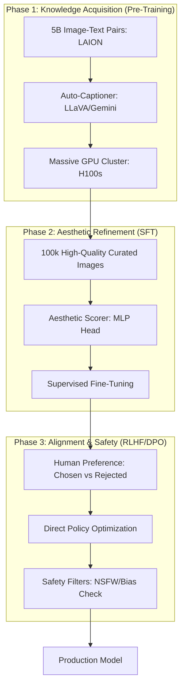

*By Gopi Krishna Tummala*

---

  
Diffusion Models Series — The Generative Engine

  

    <a href="/posts/generative-ai/diffusion-from-molecules-to-machines" style="background: rgba(255,255,255,0.1); padding: 0.5rem 1rem; border-radius: 6px; text-decoration: none; color: white; opacity: 0.9;">Part 1: Foundations</a>
    <a href="/posts/generative-ai/image-diffusion-models-unet-to-dit" style="background: rgba(255,255,255,0.1); padding: 0.5rem 1rem; border-radius: 6px; text-decoration: none; color: white; opacity: 0.9;">Part 2: Architectures</a>
    <a href="/posts/generative-ai/sampling-guidance-diffusion-models" style="background: rgba(255,255,255,0.1); padding: 0.5rem 1rem; border-radius: 6px; text-decoration: none; color: white; opacity: 0.9;">Part 3: Sampling & Guidance</a>
    <a href="/posts/generative-ai/video-diffusion-fundamentals" style="background: rgba(255,255,255,0.1); padding: 0.5rem 1rem; border-radius: 6px; text-decoration: none; color: white; opacity: 0.9;">Part 4: Video Models</a>
    <a href="/posts/generative-ai/pre-training-post-training-video-diffusion" style="background: rgba(255,255,255,0.25); padding: 0.5rem 1rem; border-radius: 6px; text-decoration: none; color: white; font-weight: 600; border: 2px solid rgba(255,255,255,0.5);">Part 5: Training Lifecycle</a>
    <a href="/posts/generative-ai/diffusion-for-action-trajectories-policy" style="background: rgba(255,255,255,0.1); padding: 0.5rem 1rem; border-radius: 6px; text-decoration: none; color: white; opacity: 0.9;">Part 6: Diffusion for Policy</a>
    <a href="/posts/generative-ai/modern-video-models-sora-veo-opensora" style="background: rgba(255,255,255,0.1); padding: 0.5rem 1rem; border-radius: 6px; text-decoration: none; color: white; opacity: 0.9;">Part 7: The Frontier</a>
    <a href="/posts/generative-ai/physics-aware-video-diffusion-models" style="background: rgba(255,255,255,0.1); padding: 0.5rem 1rem; border-radius: 6px; text-decoration: none; color: white; opacity: 0.9;">Part 8: Physics-Aware AI</a>
  

  
📖 You are reading <strong>Part 5: Training Lifecycle</strong> — Pre-Training & Post-Training

---

### Act 0: Training Lifecycle in Plain English

Imagine you are training a world-class painter.

1.  **Phase 1: Pre-Training (The Schooling):** You take the student to every museum in the world. They look at 10 billion images—Renaissance, cartoons, blueprints, and photos. They learn what a "Face" is and how "Light" works. At this stage, they are messy but they understand everything.
2.  **Phase 2: Post-Training (The Specialization):** You sit the student down and say, "Now, forget the ugly blueprints. Focus on making things beautiful and following my specific instructions." You give them 10,000 perfect, high-quality photos with descriptions.
3.  **Phase 3: Alignment (The Polish):** You show the student two of their own paintings and say, "This one is too dark, this one is perfect." They learn your personal taste.

**Pre-training** gives the model "Capabilities." **Post-training** gives it "Utility and Aesthetics."

---

### Act I: Pre-Training at Planet Scale

Diffusion models are data-hungry beasts. To build a model like Stable Diffusion or Sora, you need a **Curriculum Learning** strategy.

#### 1. Stage 1: Low-Res, High Volume
We start by training on $256 \times 256$ images. Why? Because it's 16x faster than $1024 \times 1024$. The model learns the basics of shapes and colors here.
#### 2. Stage 2: Resolution Upscaling
Once the model is stable, we increase the resolution to $512 \times 512$ and finally $1024 \times 1024$. We use **Noise Offset** training to ensure the model doesn't become biased toward a specific brightness level.

---

#### Act I.V: Mature Architecture — The Training Pipeline

In a 2025 production stack, we use a "Data Flywheel" that continuously improves the model based on synthetic and real feedback.

**The Training Lifecycle Pipeline:**

##### 1. Auto-Captioning: The Secret Sauce
Web data often has terrible captions (e.g., "IMG_452.jpg"). Modern models use a **VLM (Vision-Language Model)** to rewrite every caption in the dataset, providing the diffusion model with rich, descriptive text like *"A golden retriever puppy wearing a blue bowtie sitting on a porch."*

##### 2. Trade-offs & Reasoning
*   **Synthetic vs. Real Data:** Training on too much AI-generated data can cause "Model Collapse"—where the AI's mistakes reinforce themselves. *Trade-off:* We use 90% real data for pre-training and 10% high-quality synthetic data for post-training to fix specific flaws (like fingers or text).
*   **Checkpointing Strategy:** Saving a 100GB model takes time. We use **Distributed Checkpointing** to save shards of the model across the cluster, ensuring we don't lose days of work if a node fails.
*   **Citations:** *LAION-5B: An Open Large-scale Dataset for Training Image-to-Text Generative Models (2022)* and *Common Crawl: The foundation of modern pre-training.*

---

### Act II: The Scorecard — Metrics & Training Health

#### 1. The Metrics (The Engineer's KPI)
*   **Loss Curve Smoothing:** We monitor the Exponential Moving Average (EMA) of the loss. If it spikes, the model is "diverging" (exploding).
*   **Gradient Norm:** Measures how much the model's weights change per step. Too high = unstable; too low = not learning.
*   **Validation FID:** Every 5,000 steps, we generate 1,000 images and check their quality against a golden set.

#### 2. The Loss Function (Min-SNR Weighting)
Not all noise levels are equally hard to learn. We use **Min-SNR Weighting** to prioritize the "Middle" noise levels, where the most important structural learning happens.
$$ \mathcal{L}_{weighted} = \min(\text{SNR}(t), 5) \cdot \| \epsilon - \epsilon_\theta \|^2 $$

---

### Act III: System Design & Interview Scenarios

#### Scenario 1: Training Stability
*   **Question:** "Your training loss suddenly goes to NaN (Not a Number) after 100,000 steps. What do you do?"
*   **Answer:** This is a **Gradient Explosion**. **The Fix:** Use **Gradient Clipping** to cap the maximum weight change. Also, check if your **Learning Rate Scheduler** is too aggressive. You may need to "Warm-up" the learning rate more slowly.

#### Scenario 2: Data Quality over Quantity
*   **Question:** "You have 1 billion blurry images and 1 million 4K perfect images. How do you combine them?"
*   **Answer:** Use a **Multi-Stage Curriculum**. Train on the 1 billion blurry images first to learn "Concepts." Then, perform a "Finishing Pass" on the 1 million 4K images to learn "Aesthetics."

#### Scenario 3: Fine-tuning for a Specific Brand
*   **Question:** "A fashion brand wants a model that only generates images in their specific 'Look'. How do you do it cheaply?"
*   **Answer:** Discuss **LoRA (Low-Rank Adaptation)**. Instead of training the whole model, train a tiny "Adapter" (100MB) that sits on top of the base model. It can be trained on 50 images in 30 minutes.

---

### Graduate Assignment: The Training Architect

**Task:**
1.  **Exponential Moving Average (EMA):** Derive why using an **EMA Checkpoint** for inference is better than using the raw weights from the last training step.
2.  **Dataset Balancing:** If you have 90% "Cat" images and 10% "Dog" images, how do you prevent the model from becoming a "Cat-only" generator? (Look up **Class-Balanced Sampling**).
3.  **Cross-GPU Communication:** Explain how **All-Reduce** allows 1,000 GPUs to stay in sync during a single training step.

---

**Further Reading:**
*   *HuggingFace Accelerate: Scaling training to multi-node clusters.*
*   *DDP: Distributed Data Parallel in PyTorch.*
*   *ZeRO: Memory Optimizations for Training Trillion Parameter Models.*

---

**Previous:** [Part 4 — Video Models: Video Diffusion Fundamentals](/posts/generative-ai/video-diffusion-fundamentals)

**Next:** [Part 6 — Diffusion for Action: Trajectories and Policy](/posts/generative-ai/diffusion-for-action-trajectories-policy)
