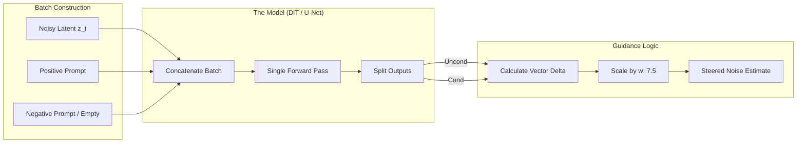

*By Gopi Krishna Tummala*

---

  
Diffusion Models Series — The Generative Engine

  

    <a href="/posts/generative-ai/diffusion-from-molecules-to-machines" style="background: rgba(255,255,255,0.1); padding: 0.5rem 1rem; border-radius: 6px; text-decoration: none; color: white; opacity: 0.9;">Part 1: Foundations</a>
    <a href="/posts/generative-ai/image-diffusion-models-unet-to-dit" style="background: rgba(255,255,255,0.1); padding: 0.5rem 1rem; border-radius: 6px; text-decoration: none; color: white; opacity: 0.9;">Part 2: Architectures</a>
    <a href="/posts/generative-ai/sampling-guidance-diffusion-models" style="background: rgba(255,255,255,0.25); padding: 0.5rem 1rem; border-radius: 6px; text-decoration: none; color: white; font-weight: 600; border: 2px solid rgba(255,255,255,0.5);">Part 3: Sampling & Guidance</a>
    <a href="/posts/generative-ai/video-diffusion-fundamentals" style="background: rgba(255,255,255,0.1); padding: 0.5rem 1rem; border-radius: 6px; text-decoration: none; color: white; opacity: 0.9;">Part 4: Video Models</a>
    <a href="/posts/generative-ai/pre-training-post-training-video-diffusion" style="background: rgba(255,255,255,0.1); padding: 0.5rem 1rem; border-radius: 6px; text-decoration: none; color: white; opacity: 0.9;">Part 5: Training Lifecycle</a>
    <a href="/posts/generative-ai/diffusion-for-action-trajectories-policy" style="background: rgba(255,255,255,0.1); padding: 0.5rem 1rem; border-radius: 6px; text-decoration: none; color: white; opacity: 0.9;">Part 6: Diffusion for Policy</a>
    <a href="/posts/generative-ai/modern-video-models-sora-veo-opensora" style="background: rgba(255,255,255,0.1); padding: 0.5rem 1rem; border-radius: 6px; text-decoration: none; color: white; opacity: 0.9;">Part 7: The Frontier</a>
    <a href="/posts/generative-ai/physics-aware-video-diffusion-models" style="background: rgba(255,255,255,0.1); padding: 0.5rem 1rem; border-radius: 6px; text-decoration: none; color: white; opacity: 0.9;">Part 8: Physics-Aware AI</a>
  

  
📖 You are reading <strong>Part 3: Sampling & Guidance</strong> — The Dialects of Noise

---

### Act 0: Sampling & Guidance in Plain English

Imagine you are in a dark, dense forest (The Noise). You want to get to a specific cabin (The Image).

1.  **DDPM (The Drunken Walk):** You take 1,000 tiny, random steps. You eventually get there, but it's exhausting and slow.
2.  **DDIM (The Shortcut):** You realize the path is actually a straight line. You take 50 giant, deterministic leaps. You get to the cabin 20x faster.
3.  **Flow Matching (The High-Speed Rail):** You draw a perfectly straight line from the forest edge to the cabin door and glide there in 4 steps.

**Guidance** is like having a GPS. 
*   **Without GPS:** You might end up at *any* realistic cabin.
*   **With GPS (CFG):** A voice in your head says, "Make it 10x more likely that the cabin is made of candy." You steer your steps more aggressively toward the prompt.

---

### Act I: The Sampling Bottleneck

Standard diffusion (DDPM) is slow because it is **Markovian**—every step depends on the one before it and adds a fresh dose of randomness. 
*   **The Math:** $ x_{t-1} = f(x_t, \epsilon_\theta) + \sigma_t z $. 
*   **The Problem:** You can't parallelize it. To generate an image, you must run the model 1,000 times in a row.

---

### Act II: Steering the Noise (CFG)

**Classifier-Free Guidance (CFG)** is the secret sauce that makes AI follow prompts like "A cat in a top hat."

#### The Logic:
During each step, the model makes two guesses:
1.  **Conditional Guess:** "What does a cat in a hat look like?"
2.  **Unconditional Guess:** "What does a normal image look like?"

The final direction is the **Unconditional guess** PLUS the **Difference** between the two, multiplied by a **Guidance Scale ($w$)**.
$$ \hat{\epsilon} = \epsilon_{uncond} + w \cdot (\epsilon_{cond} - \epsilon_{uncond}) $$

---

#### Act II.V: Mature Architecture — The Guidance Engine

In production systems, we use a "Parallel Batching" trick to run CFG without doubling the latency.

**The CFG Inference Pipeline:**

##### 1. Negative Prompting
By setting the "Unconditional" part of CFG to a specific concept (e.g., "blurry, distorted"), the subtraction math effectively **pushes the model away** from those features.

##### 2. Trade-offs & Reasoning
*   **Guidance Scale vs. Artifacts:** Higher $w$ (e.g., 15) makes the prompt adherence perfect but causes "oversaturation" and "deep-fried" colors. Most production systems stay between **5.0 and 8.0**.
*   **Sampler Step Trade-off:** Reducing steps from 50 to 20 saves 60% of GPU cost but can introduce "banding" or "noise grain" in flat textures (like skies).
*   **Citations:** *Classifier-Free Diffusion Guidance (Ho & Salimans 2022)* and *DPM-Solver: A Fast ODE Solver for Diffusion Sampling (Lu et al. 2022)*.

---

### Act III: The Scorecard — Metrics & Performance

#### 1. The Metrics (Efficiency KPI)
*   **Latency per Image (sec):** The critical business metric. 
*   **CLIP Score Recall:** How many objects from the prompt actually appeared in the final image?
*   **Sampling Variance:** How much does the image change if we change the sampler but keep the seed?

#### 2. The Loss Function (Flow Matching)
Instead of predicting "static," we predict the **optimal transport path**.
$$ \mathcal{L}_{flow} = \| v_t - (x_1 - x_0) \|^2 $$
This loss ensures that the model learns to move in a **straight line** from noise ($x_0$) to image ($x_1$).

---

### Act IV: System Design & Interview Scenarios

#### Scenario 1: The "Drunken" Sampler
*   **Question:** "Your model generates great images with 1000 steps but becomes blurry/abstract at 20 steps. How do you fix it without more training?"
*   **Answer:** Change the **Scheduler**. Move from Euler (simple) to **DPM-Solver++** (high-order). These schedulers use physics math to "curve" the path, allowing for much larger steps without losing the trail.

#### Scenario 2: Prompt Adherence vs. Diversity
*   **Question:** "Users say the model is too repetitive. Every 'City' image looks exactly the same. What's the plan?"
*   **Answer:** Lower the **CFG Scale ($w$)**. High guidance kills diversity because it forces the model into the tiny "peak" of the probability distribution. Lowering $w$ to 3.0-4.0 allows the model to explore more diverse "plausible" cities.

#### Scenario 3: Real-Time Editing
*   **Question:** "You need to update an image in <500ms based on a user's brushstroke. Standard diffusion is too slow. What's the SOTA?"
*   **Answer:** Discuss **LCM (Latent Consistency Models)** or **SDXL-Turbo**. These use **Adversarial Distillation** to "collapse" the 50 steps into a single 1-step calculation.

---

### Graduate Assignment: The ODE Solver

**Task:**
1.  **Deterministic Mapping:** Explain why **DDIM** allows you to "Invert" an image back to its exact original noise seed (Look up **Diffusion Inversion**).
2.  **Velocity Fields:** If the velocity field $v_\theta$ is non-linear, why does the generation take more steps? 
3.  **Scheduler Analysis:** Compare **Ancestral Sampling** (adds noise back) vs. **Deterministic Sampling**. When would you use one over the other for a "Video" product?

---

**Further Reading:**
*   *Denoising Diffusion Implicit Models (Song et al. 2020)*
*   *DPM-Solver++: Fast ODE Solver (2022)*
*   *Flow Matching for Generative Modeling (Lipman et al. 2023)*

---

**Previous:** [Part 2 — Image Diffusion: From U-Net to DiT](/posts/generative-ai/image-diffusion-models-unet-to-dit)

**Next:** [Part 4 — Video Diffusion: The Fourth Dimension](/posts/generative-ai/video-diffusion-fundamentals)
