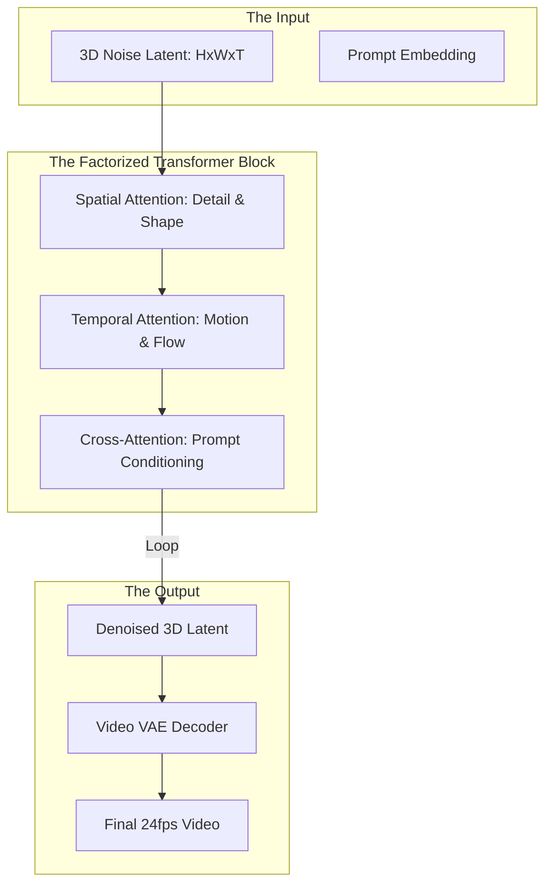

*By Gopi Krishna Tummala*

---

  
Diffusion Models Series — The Generative Engine

  

    <a href="/posts/generative-ai/diffusion-from-molecules-to-machines" style="background: rgba(255,255,255,0.1); padding: 0.5rem 1rem; border-radius: 6px; text-decoration: none; color: white; opacity: 0.9;">Part 1: Foundations</a>
    <a href="/posts/generative-ai/image-diffusion-models-unet-to-dit" style="background: rgba(255,255,255,0.1); padding: 0.5rem 1rem; border-radius: 6px; text-decoration: none; color: white; opacity: 0.9;">Part 2: Architectures</a>
    <a href="/posts/generative-ai/sampling-guidance-diffusion-models" style="background: rgba(255,255,255,0.1); padding: 0.5rem 1rem; border-radius: 6px; text-decoration: none; color: white; opacity: 0.9;">Part 3: Sampling & Guidance</a>
    <a href="/posts/generative-ai/video-diffusion-fundamentals" style="background: rgba(255,255,255,0.25); padding: 0.5rem 1rem; border-radius: 6px; text-decoration: none; color: white; font-weight: 600; border: 2px solid rgba(255,255,255,0.5);">Part 4: Video Models</a>
    <a href="/posts/generative-ai/pre-training-post-training-video-diffusion" style="background: rgba(255,255,255,0.1); padding: 0.5rem 1rem; border-radius: 6px; text-decoration: none; color: white; opacity: 0.9;">Part 5: Training Lifecycle</a>
    <a href="/posts/generative-ai/diffusion-for-action-trajectories-policy" style="background: rgba(255,255,255,0.1); padding: 0.5rem 1rem; border-radius: 6px; text-decoration: none; color: white; opacity: 0.9;">Part 6: Diffusion for Policy</a>
    <a href="/posts/generative-ai/modern-video-models-sora-veo-opensora" style="background: rgba(255,255,255,0.1); padding: 0.5rem 1rem; border-radius: 6px; text-decoration: none; color: white; opacity: 0.9;">Part 7: The Frontier</a>
    <a href="/posts/generative-ai/physics-aware-video-diffusion-models" style="background: rgba(255,255,255,0.1); padding: 0.5rem 1rem; border-radius: 6px; text-decoration: none; color: white; opacity: 0.9;">Part 8: Physics-Aware AI</a>
  

  
📖 You are reading <strong>Part 4: Video Models</strong> — Video Diffusion Fundamentals

---

### Act 0: Video Fundamentals in Plain English

Imagine you are trying to film a movie using only a still camera.

1.  **Frame-by-Frame Approach:** You take 100 perfect photos. But when you play them back, the actor's shirt changes from red to blue, and a tree in the background suddenly turns into a car. This is the **Temporal Consistency** problem.
2.  **Video Diffusion Approach:** Instead of taking 100 photos, you treat the entire 10-second clip as a single **"Block of Reality."** You remove noise from the entire block at once. This ensures that the red shirt *stays* red across all frames because the model can see "forward" and "backward" in time simultaneously.

Video diffusion is just image diffusion with a **Memory**.

---

### Act I: The Spatiotemporal Challenge

To move from 2D (Images) to 3D (Video: Height x Width x Time), we face two massive hurdles:
*   **Motion Fidelity:** Making sure objects move according to the laws of physics (gravity, momentum).
*   **Temporal Consistency:** Making sure the identity of an object doesn't "morph" or flicker between frames.

#### The 3D U-Net
Early video models (Stable Video Diffusion) used **3D Convolutions**. Instead of $3 \times 3$ filters, they used $3 \times 3 \times 3$ filters that scanned across pixels *and* across time. 

---

### Act II: Temporal Attention (The "Glue")

The real magic of video consistency comes from **Temporal Attention**.
*   **Spatial Attention:** "What is the relationship between the dog's nose and its tail in Frame 1?"
*   **Temporal Attention:** "What is the relationship between the dog's nose in Frame 1 and its nose in Frame 2?"

By linking pixels across time, the model learns **Motion Paths**.

---

#### Act II.V: Mature Architecture — The Spatiotemporal Backbone

In modern 2025 systems, we use a **Factorized Attention** architecture to balance quality and GPU memory.

**The Video Diffusion Pipeline:**

##### 1. Space-Time Factorization
A video with 100 frames and $64 \times 64$ latent size has 409,600 tokens. A standard transformer would need $400,000^2$ calculations—impossible! 
*   **The Fix:** We run **Spatial Attention** (pixels within a frame) and then **Temporal Attention** (same pixel across frames) sequentially. This reduces the cost from $N^2$ to $N \log N$.

##### 2. Trade-offs & Reasoning
*   **3D U-Net vs. ST-Transformer:** Convolutions (U-Net) are great for short, "wiggly" motion. Transformers (ST-Transformer) are essential for long-term "Storytelling" where an object disappears and reappears 2 seconds later.
*   **Frame Interleaving:** Training on 24fps video is expensive. Most models train on "Interleaved" frames (e.g., taking every 4th frame) to learn long-term motion without needing 100GB of VRAM.
*   **Citations:** *SVD: Stable Video Diffusion (Stability AI 2023)* and *AnimateDiff: Animate Your Personalized Text-to-Image Diffusion Models (2023)*.

---

### Act III: The Scorecard — Metrics & Fidelity

#### 1. The Metrics (The Motion KPI)
*   **Warping Error:** Measures how much the image "tears" or distorts when objects move.
*   **Flow Consistency Score:** Checks if the motion vectors between frames match the laws of physics.
*   **Temporal FID:** Compares the distribution of *changes* between frames to real video footage.

#### 2. The Loss Function (Temporal Coherence)
We add a specialized **Temporal Loss** term that penalizes large, random changes between adjacent frames.
$$ \mathcal{L}_{total} = \mathcal{L}_{noise} + \lambda \cdot \| \text{Flow}(\hat{x}_t) - \text{Flow}(\hat{x}_{t-1}) \|^2 $$

---

### Act IV: System Design & Interview Scenarios

#### Scenario 1: The "Flicker" Problem
*   **Question:** "Your generated video looks like a series of still images with static-like flickering in the background. Why?"
*   **Answer:** This is a failure of **Temporal Self-Attention**. The frames are not "talking" to each other. **The Fix:** Increase the attention weight of the temporal layers or increase the number of overlapping frames in the training batch.

#### Scenario 2: Object Disappearance
*   **Question:** "A car drives behind a tree and never comes out the other side. How do you fix the physics?"
*   **Answer:** This is an **Attention Horizon** issue. The model's "Memory" is too short. **The Fix:** Use **Long-Context Windowing** or **Sliding Window Attention** so the model can attend to frames up to 5 seconds in the past.

#### Scenario 3: GPU Memory Overflow
*   **Question:** "You can only fit 8 frames of video in your GPU memory, but your model needs to generate 64 frames. What's the engineering workaround?"
*   **Answer:** Discuss **Gradient Checkpointing** and **Context Parallelism**. Also, use **Latent Splicing**: generate the video in 8-frame chunks with a 2-frame overlap, and use the last 2 frames of Chunk A as the "Initial Condition" for Chunk B.

---

### Graduate Assignment: The Motion Engine

**Task:**
1.  **3D-VAE Bottleneck:** Explain why a standard 2D-VAE causes "Seams" in video and why we must use a **Temporal Causal VAE**.
2.  **Kinematic Derivation:** If a car is moving at constant velocity $v$, what should the **Temporal Attention weights** look like for a patch at $(x, y, t)$? 
3.  **ControlNet for Video:** Describe how to adapt **ControlNet** to guide a video model with a **Depth Map stream** to ensure the 3D structure of a room stays fixed while the camera moves.

---

**Further Reading:**
*   *Lumiere: A Space-Time Diffusion Model for Video Generation (Google 2024)*
*   *Stable Video Diffusion (Stability AI Technical Report 2023)*
*   *Make-A-Video: Text-to-Video Generation without Text-Video Data (Meta 2022)*

---

**Previous:** [Part 3 — Sampling & Guidance: The Dialects of Noise](/posts/generative-ai/sampling-guidance-diffusion-models)

**Next:** [Part 5 — Training Lifecycle: Pre-Training & Post-Training](/posts/generative-ai/pre-training-post-training-video-diffusion)
