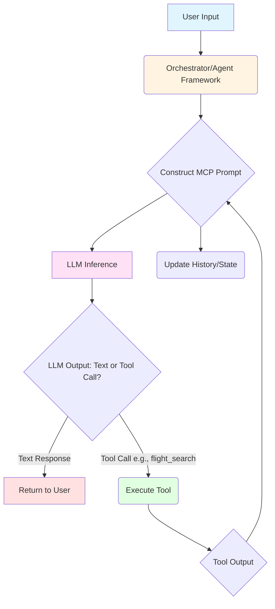
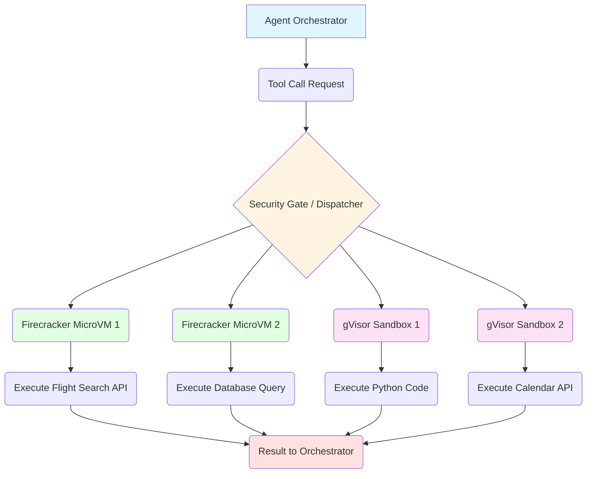
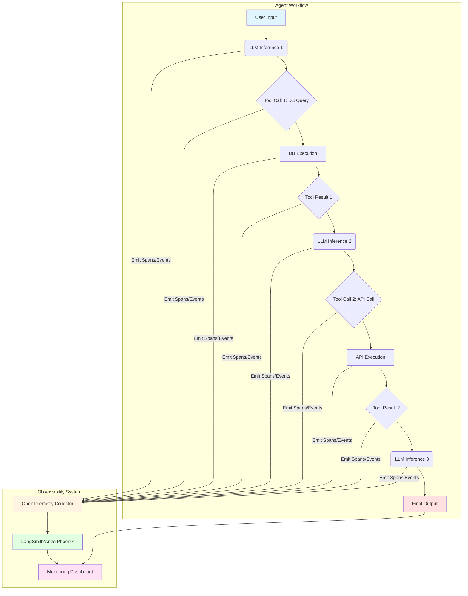
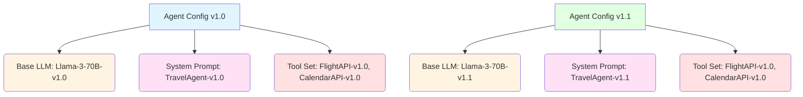

*By Gopi Krishna Tummala*

---

## The Grand Illusion: Why Our AI Models Are Still Just "Smart Calculators"

Imagine a calculator. It's incredibly fast, performs complex operations, and gives you precise answers. Now imagine you want that calculator to *also* browse the internet, look up stock prices, and send you an email if a stock drops. Could it do that? Not by itself. It's a calculator. It does one thing exceptionally well: calculate.

For the longest time, our incredible AI models—from the image generators that paint digital masterpieces to the giant language models (LLMs) that write poetry—have been treated much like that calculator. We give them an input, they crunch some numbers (billions of them!), and they give us an output. This is called **inference**.

This "request-response" paradigm has powered the first wave of modern AI. But here's the secret: *it's an incomplete form of intelligence*—powerful pattern recognition without persistent memory, grounded action, or self-directed control. The model itself is a phenomenal pattern-matcher, predicting the next best word or pixel based on its vast training data. It has no memory of past interactions beyond the current prompt, no ability to use tools outside its neural network, and no real "agency."

This is where the grand challenge begins: How do we evolve our AI from being a brilliant, isolated calculator into a truly *agentic* system—one that can perceive, reason, plan, act, and remember? This isn't just a research problem; it's an **MLOps problem**. It's about building the *infrastructure* that enables this advanced intelligence.

---

## The Paradigm Shift: From Stateless APIs to State-Driven Agents

**Working definition:**
An *agentic system* is an AI system that can **maintain state, plan across multiple steps, invoke tools, observe outcomes, and adapt its behavior over time**—all within a controlled execution loop.

Let's ground this with an example.

### Scenario A: Traditional "Stateless" LLM (Calculator)

* **User:** "Summarize this article for me."
* **You (MLOps):** Route the article text to an LLM API. The LLM processes it and returns a summary. Done. The LLM has no memory of this interaction.

### Scenario B: Agentic LLM (Assistant)

* **User:** "Find me a flight from London to New York next Tuesday, and if it's under $500, book it and add it to my calendar."
* **You (MLOps):** Now, the "model" needs to:
  1. **Understand** the intent (find flight, check price, book, add to calendar).
  2. **Act:** Use a flight search tool.
  3. **Reason:** Check if price condition is met.
  4. **Act:** Use a booking tool.
  5. **Act:** Use a calendar tool.
  6. **Remember:** What flights did it find? What was the price? Was it booked?

This isn't a single inference call; it's a **multi-step, stateful workflow** orchestrated by the AI. This is **Agentic AI**, and managing its lifecycle, security, and performance requires a completely new approach to MLOps. We're moving from managing model endpoints to managing intelligent *processes*.

### The ROI of Agentic MLOps

Why bother with this complexity? Because it's where the real business value lies. Agentic AI can:

* **Automate Complex Workflows:** Turn multi-step human processes into autonomous operations.
* **Personalize at Scale:** Build adaptive assistants that learn user preferences over time.
* **Reduce Development Cost:** Instead of hard-coding every branching `if/else` logic, we describe the desired outcome, and the agent figures out the steps.
* **Unlock New Capabilities:** Imagine AI scientists designing experiments, running simulations, and analyzing results autonomously.

---

## The Rosetta Stone: The Model Context Protocol (MCP)

The biggest hurdle for our "smart calculator" to become an "assistant" is **communication**. How does the AI model *talk* to external tools like databases, APIs, or even other AI models? It needs a standardized language, a sort of Rosetta Stone.

Enter the **Model Context Protocol (MCP)**. This concept, often attributed to pioneering work by Anthropic, is a proposed standard for how AI models (specifically LLMs) can observe their environment, use tools, and maintain a consistent context across multiple interactions.

> **Note on Terminology**
> In this article, "Model Context Protocol (MCP)" refers both to:
> 
> 1. The *general architectural idea* of structured context + tool contracts for agents, and
> 2. The *concrete MCP specification* introduced by Anthropic
> 
> The core ideas apply even outside Anthropic's ecosystem.

### What is MCP? (The Conceptual Level)

Think of MCP as a structured way to give the AI model:

1. **Observation:** Information about the current state of the world (e.g., "The flight search returned these results...").
2. **Tool Use:** A list of available actions it can take, along with their descriptions (e.g., `search_flights(origin, destination, date)`).
3. **State Management:** A way to remember things over long conversations or tasks.

It's essentially a contract between the AI model and its operating environment.

### How Does it Work? (The Technical Layer - Simplified)

At its core, MCP defines a **message protocol across turns**—where prompts, tool schemas, observations, and state updates are exchanged in a structured, machine-readable way. Instead of just raw text, each message becomes a rich data structure that includes:

* **`system_message`**: Overall instructions for the agent (e.g., "You are a helpful travel assistant.").
* **`tools`**: A JSON schema or function definition of available tools. The LLM "reads" these to understand what it *can* do.
  * Example: `{ "name": "flight_search", "description": "Searches for flights...", "parameters": {"origin": ..., "destination": ...} }`
* **`user_message`**: The user's current request.
* **`previous_interactions`**: A history of past tool calls and their results. This is crucial for state.

When the LLM receives this structured prompt, it doesn't just generate text. It might generate a **tool call** in a specific format (e.g., JSON), indicating it wants to use `flight_search` with certain parameters. Our MLOps infrastructure then intercepts this tool call, executes it, and feeds the *result* back to the LLM as a new `observation`.

### The MCP Loop

*Explanation:*

1. **User Input:** The human tells the agent something.
2. **Orchestrator:** Your MLOps layer. It manages the agent's flow.
3. **Construct MCP Prompt:** The orchestrator packages the current user input, the available tools, and the history into a structured prompt for the LLM.
4. **LLM Inference:** The LLM processes this rich prompt.
5. **LLM Output:** The LLM decides: should it generate a direct text response, or does it need to use a tool?
6. **Execute Tool:** If it's a tool call, the orchestrator executes the *actual* tool (e.g., makes an API call to a flight booking service).
7. **Tool Output:** The result of the tool execution.
8. **Update History/State:** The orchestrator adds this tool call and its output to the agent's memory.
9. **Loop:** This new information (the tool's output) is fed back into the prompt for the next LLM inference step, allowing the agent to continue its reasoning.

This feedback loop is the essence of agency. The model isn't just responding; it's *acting* and *perceiving the results of its actions*.

> **Key takeaway:**
> The LLM never executes tools directly—it *requests actions*, and the orchestrator remains in full control. This separation is critical for security and reliability.

---

## The "Sandbox" Infrastructure: Guarding the Gate

This sounds powerful, but also terrifying. If an AI can execute code or make API calls, what stops it from wiping your production database or sending spam emails?

This brings us to a critical **MLOps challenge:** **security and isolation**. We need a "sandbox"—a safe, controlled environment where agents can play without breaking anything important.

### The Security Challenge: Trusting a Non-Human with Keys to the Kingdom

Imagine giving your toddler access to your credit cards and your car keys. That's essentially what "raw" tool use by an LLM could be. The LLM, despite its intelligence, has no inherent understanding of security boundaries or malicious intent. It will try to do what it *thinks* you want, sometimes with disastrous side effects if not constrained.

### The Solution: Ephemeral, Isolated Execution Environments

To solve this, we leverage technologies typically used for cloud functions or highly secure containerization:

#### 1. gVisor (User-space Kernel)

* **High School Analogy:** Imagine you're playing a video game on a console. gVisor is like a special emulator that makes the game (your agent's code) *think* it's running directly on the console's hardware, but in reality, it's running in a completely isolated, virtual environment *within* the console's operating system. If the game crashes, it doesn't crash the console itself.

* **Technical Detail:** gVisor intercepts system calls made by the agent's process (e.g., trying to write to a file, open a network connection) and re-implements them in user space. This creates a secure, isolated sandbox with its own kernel that's separate from the host OS kernel. It's not a full VM, but a very strong process sandbox.

#### 2. Firecracker MicroVMs

* **High School Analogy:** Instead of just an emulator, Firecracker is like giving your agent its *very own tiny, virtual game console*. Each agent gets its own dedicated, minimal operating system. It's super fast to start up and doesn't use many resources, but it's a true, hardware-level isolation.

* **Technical Detail:** Firecracker is a virtual machine monitor (VMM) that creates lightweight, minimal virtual machines (MicroVMs). These MicroVMs are designed for serverless functions and containers, offering strong isolation (like a traditional VM) but with extremely low overhead and fast boot times (hundreds of milliseconds). Each agent or tool execution can get its own dedicated MicroVM.

### When to Use What: gVisor vs Firecracker

| Use Case                 | gVisor | Firecracker |
| ------------------------ | ------ | ----------- |
| Fast startup             | ✅      | ⚠️ (slower) |
| Strongest isolation      | ⚠️     | ✅           |
| High tool-call volume    | ✅      | ⚠️          |
| Untrusted code execution | ⚠️     | ✅           |
| Serverless-style agents  | ⚠️     | ✅           |

**Decision guidance:** Use gVisor for high-throughput scenarios where you need fast spin-up and moderate isolation. Use Firecracker when you need maximum security (e.g., executing completely untrusted code) or true VM-level isolation, and can tolerate slightly slower startup times.

### The Agentic Sandbox Architecture

*Explanation:*

* The **Agent Orchestrator** (our MLOps brain) gets a tool call from the LLM.
* The **Security Gate / Dispatcher** intercepts this. It doesn't just blindly execute.
* It spins up a new, ephemeral, isolated environment (a Firecracker MicroVM or gVisor sandbox).
* The tool execution happens *inside* this sandbox, with strictly defined permissions (e.g., "this sandbox can only call the `flight_search` API and nothing else").
* Once the tool finishes, the sandbox is destroyed, and the result is returned. This ensures that any rogue behavior or error within the tool doesn't affect the main system or other agents.

This setup is non-trivial. It's a significant leap in MLOps complexity, moving from simple API gateways to managing fleets of secure, ephemeral computing environments.

---

## Observability for Agents: Tracing the Agent's Execution Path

In traditional MLOps, we monitor things like:

* **Model Latency:** How long does it take for the model to give a response?
* **Throughput:** How many requests per second can it handle?
* **GPU Utilization:** Are our expensive GPUs busy?

For agentic systems, these metrics are still important, but they tell an incomplete story. An agent's execution process is a **chain of events**: LLM inference → Tool Call → Tool Result → LLM inference → ...

We need to observe this *entire execution path*—tracing every decision and action the agent takes, without exposing internal model reasoning tokens.

### Beyond Latency: The Trace Reliability Metric

* **Problem:** An agent might take 10 seconds to respond, but was it because the LLM was slow, or because a database query took 9 seconds?
* **Solution:** **Distributed Tracing**. We need to trace every step of the agent's journey.
* **Tools:**
  * **LangSmith (by LangChain):** Specifically designed for LLM applications, it visualizes chains, prompts, and tool calls.
  * **Arize AI Phoenix:** Another LLM-focused observability platform offering similar tracing capabilities.
  * **OpenTelemetry:** An open-source standard for collecting traces, metrics, and logs across distributed systems. It's vendor-neutral and highly flexible.

### New Metrics for Agentic Systems:

* **Success Rate per Step:** Did the agent successfully execute each tool call? If not, why did it fail? (e.g., "Flight search API returned 404").
* **Total Task Cost:** Beyond just compute time, we now track API costs (each LLM call costs money), database query costs, and tool usage costs. An agent might be "successful" but incredibly expensive.
* **Context Quality:** Is the agent effectively using the information in its history? Is it hallucinating? Are its tool calls well-formed?
* **P99 Trace Latency:** Not just the P99 of a single LLM call, but the P99 of the *entire end-to-end agentic workflow*.

### Agentic Observability Architecture

*Explanation:*

* Every step in the agent's workflow (LLM calls, tool executions, tool results) emits **spans** or **events**.
* These are collected by an **OpenTelemetry Collector**.
* The collector forwards them to specialized LLM observability platforms like **LangSmith** or **Arize Phoenix**.
* Finally, **Monitoring Dashboards** (like Grafana) visualize these traces, showing the full journey of an agent's decisions and actions, without exposing internal model reasoning tokens, identifying bottlenecks, and tracking new metrics like success rate per step.

This is a shift from basic "health checks" to deep "cognitive diagnostics" for our AI systems.

### Real-World Failure Mode

A production agent suddenly started double-booking flights. Traces revealed the base model update changed how it interpreted "confirm before booking," causing it to retry after a slow API response. The tool wasn't idempotent.

*The fix wasn't model rollback—it was tool semantics.* This case highlights why observability matters: the problem wasn't in the model's reasoning, but in how version mismatches between model behavior and tool expectations created cascading failures.

> **Key takeaway:**
> Without distributed tracing, this failure would have appeared as random double-bookings with no root cause. Tracing revealed the interaction between model interpretation, tool design, and API timing.

---

## Versioning the "Agent": The Triple Threat of Change

In traditional MLOps, versioning usually means tracking model weights (e.g., `model_v1.pth`, `model_v2.pth`). Perhaps also the training data and code.

For agentic systems, the challenge escalates significantly. An "agent" isn't just a model; it's a complex interplay of several components. We now face a **"Multi-Dimensional Versioning Problem"** that encompasses at least three (and often four) interdependent dimensions:

### 1. The Base Model (The Brain)

* **What:** The underlying LLM weights (e.g., `Llama-3-70B-instruct-v1.0`).
* **Why:** Even minor updates to the base model can drastically change an agent's reasoning capabilities, safety alignment, or propensity to hallucinate.

### 2. The System Prompt (The Personality/Instructions)

* **What:** The initial instructions given to the LLM that define its role, constraints, and how it should use tools (e.g., "You are a travel agent, always confirm prices before booking," or "Never respond with profanity.").
* **Why:** This is often the most sensitive part. A single word change in the system prompt can alter the agent's behavior more than a model fine-tune. Versioning these prompts (using tools like prompt registries or simple Git versioning) is crucial.

### 3. The Tools & Environment (The Hands and Eyes)

* **What:** The actual code of the external tools (`flight_search.py`), their API endpoints, the version of the MCP server, and the configuration of the sandbox.
* **Why:** Changes to an API (e.g., a field name changes) or a bug in a tool's code can break an agent entirely. Even a change in the sandbox's security policy could alter behavior.

### 4. Memory Schema (Optional but Critical)

* **What:** How state is stored, summarized, truncated, or retrieved (vector DB config, summarization logic, retrieval parameters).
* **Why:** Memory schema changes can materially change agent behavior—even with identical models, prompts, and tools. A change in how conversation history is summarized might cause an agent to "forget" critical context or include irrelevant details.

### The Interdependency Nightmare

The real challenge is the **interdependency**. You can't just update the model without testing it against the *current* system prompt and *current* tools. A new model might interpret a prompt differently, or it might try to use a tool in a way that the tool's current version doesn't support.

This means versioning needs to be holistic. We need to version the entire **"Agent Configuration"**: a snapshot of the model, prompt, and tool versions that are known to work together for a specific agentic task.

### Agent Configuration Versioning

*Explanation:*

* `Agent Config v1.0` bundles specific versions of the LLM, System Prompt, and Tool Set.
* `Agent Config v1.1` shows an update to the LLM and System Prompt. Critically, the MLOps team must test `Agent Config v1.1` *as a whole* before deploying, ensuring the new LLM and prompt still interact correctly with the existing tools.

This requires robust **CI/CD pipelines** that can trigger comprehensive integration tests whenever *any* component of an agent is updated.

---

## Looking Ahead: The Ethical & Societal Implications

As we empower our AI models with agency, the MLOps community gains a new, profound responsibility:

* **Safety & Alignment:** How do we ensure agents use tools responsibly and align with human values?
* **Explainability:** When an agent takes a complex multi-step action, can we explain *why* it did what it did? This is crucial for debugging and auditing.
* **Human Oversight:** How do we design "human-in-the-loop" mechanisms that allow intervention in critical agentic workflows?

These aren't just technical problems; they are ethical and societal grand challenges that MLOps engineers will be at the forefront of addressing.

---

## Conclusion: The Future is Agentic, and MLOps is its Architect

The journey from a "smart calculator" to an "autonomous agent" is one of the most exciting shifts in AI. It moves us beyond simple inference to complex, stateful, and tool-augmented intelligence.

For MLOps engineers, this isn't just an evolution; it's a revolution. We are no longer just deploying models; we are architecting the secure, observable, and scalable environments where the next generation of AI agents will live, learn, and act.

The Model Context Protocol provides the common language, the sandbox infrastructure provides the safety, and advanced observability provides the visibility into these complex systems. Mastering these concepts isn't just about keeping up; it's about leading the charge into a future where AI truly becomes an active, intelligent partner in solving the world's most challenging problems.

The next generation of breakthroughs won't come from bigger models alone—but from engineers who can design **safe loops, trustworthy tools, and observable intelligence**. That is the new craft of MLOps.

---

*This article is part of the [Infrastructure-First MLOps Roadmap](/posts/mlops/infrastructure-first-mlops-roadmap). For more on building production ML systems, explore the [MLOps & Production](/learn/mlops) track.*

