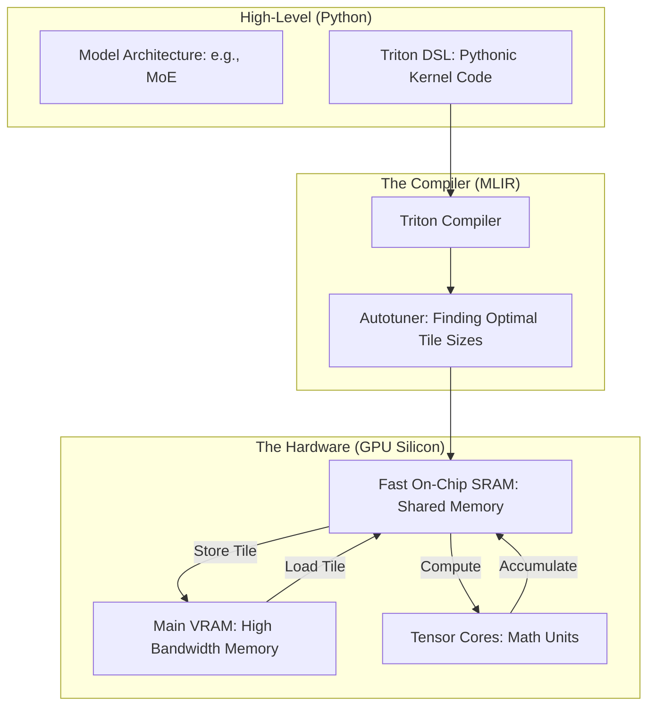

*By Gopi Krishna Tummala*

---

  
Infrastructure-First MLOps — Building the Engine of AI

  

    <a href="/posts/mlops/parquet-arrow-quest-for-analytic-speed" style="background: rgba(255,255,255,0.1); padding: 0.5rem 1rem; border-radius: 6px; text-decoration: none; color: white; opacity: 0.9;">Module 1: Data DNA</a>
    <a href="/posts/mlops/datasets-and-dataloaders" style="background: rgba(255,255,255,0.1); padding: 0.5rem 1rem; border-radius: 6px; text-decoration: none; color: white; opacity: 0.9;">Module 2: Dataloaders</a>
    <a href="/posts/mlops/hidden-engine-of-ai" style="background: rgba(255,255,255,0.1); padding: 0.5rem 1rem; border-radius: 6px; text-decoration: none; color: white; opacity: 0.9;">Module 3: Training</a>
    <a href="/posts/mlops/modern-post-training-peft-2026" style="background: rgba(255,255,255,0.1); padding: 0.5rem 1rem; border-radius: 6px; text-decoration: none; color: white; opacity: 0.9;">Module 4: Post-Training</a>
    <a href="/posts/mlops/vllm-trilogy-of-modern-llm-scaling" style="background: rgba(255,255,255,0.1); padding: 0.5rem 1rem; border-radius: 6px; text-decoration: none; color: white; opacity: 0.9;">Module 5: Serving</a>
    <a href="/posts/mlops/custom-kernel-craze" style="background: rgba(255,255,255,0.25); padding: 0.5rem 1rem; border-radius: 6px; text-decoration: none; color: white; font-weight: 600; border: 2px solid rgba(255,255,255,0.5);">Module 6: Kernels</a>
    <a href="/posts/mlops/beyond-inference-agentic-mlops-mcp" style="background: rgba(255,255,255,0.1); padding: 0.5rem 1rem; border-radius: 6px; text-decoration: none; color: white; opacity: 0.9;">Module 7: Agentic AI</a>
  

  
📖 You are reading <strong>Module 6: Custom Kernels</strong> — Handcrafting GPU Speed

---

### Act 0: Custom Kernels in Plain English

Imagine you are a master carpenter (The GPU). You have a standard toolbox (PyTorch) with a hammer, a saw, and a screwdriver. For 90% of jobs, these tools are perfect.

But one day, you are asked to build a spiral staircase made of solid diamond. Your standard saw breaks. Your hammer is too clumsy. To finish the job, you have to go into your forge and **hand-grind a custom diamond-tipped blade** designed specifically for this one task.

**A GPU Kernel** is a single "math recipe" that runs on the GPU.
**A Custom Kernel** is a hand-written recipe that bypasses the standard tools to do something faster, smarter, or more memory-efficient.

The "Craze" is because modern AI models (like Transformers) are doing math that standard tools weren't built for. **If you want to win the AI race, you have to build your own tools.**

---

### Act I: The Memory Wall (The Silent Killer)

In AI, math is cheap, but **moving data is expensive**.

A modern H100 GPU can do 1,000 trillion math operations per second (FLOPS). But it can only move data from its "Main Memory" (VRAM) to its "Calculation Cores" at a much slower rate.

*   **The Problem:** Most AI models spend 90% of their time just waiting for data to arrive. This is the **Memory Wall**.
*   **The Solution:** **Kernel Fusion.** Instead of reading data, doing Step A, writing it back, then reading it again for Step B... we do Step A and Step B in one single "Kernel." We never let the data leave the fast on-chip memory (SRAM).

---

#### Act I.V: Mature Architecture — The Kernel Fusion Stack

The "Gold Standard" has shifted from writing complex C++ (CUDA) to using **OpenAI Triton**, a Python-based language that compiles to high-performance GPU code.

**The Custom Kernel Pipeline (Mature Architecture):**

##### 1. Tiling: The Key to Speed
We don't process a 10,000 x 10,000 matrix all at once. We break it into "Tiles" (e.g., 128x128). We load one tile into the tiny but lightning-fast **SRAM**, do all the math there, and then write the result back to the slow **HBM**.

##### 2. Trade-offs & Reasoning
*   **CUDA C++ vs. Triton:** Writing CUDA is like writing assembly—you have to manage every thread and synchronization perfectly. *Trade-off:* CUDA is 5% faster but takes 10x longer to write. Triton handles the "plumbing" (thread synchronization) automatically, letting engineers focus on the **Data Flow**.
*   **FlashAttention:** The most famous custom kernel. It "fused" the entire Attention calculation into one pass, reducing memory traffic by 10x.
*   **Citations:** *Triton: An Intermediate Language and Compiler for GPU Computing (MAPL 2019)* and *FlashAttention: Fast and Memory-Efficient Exact Attention with IO-Awareness (NeurIPS 2022)*.

---

### Act II: System Design & Interview Scenarios

#### Scenario 1: Bandwidth vs. Compute Bound
*   **Question:** "Your GPU utilization is 100%, but training is slow. Your Roofline Analysis shows you are 'Bandwidth Bound.' What does that mean?"
*   **Answer:** It means your Tensor Cores are mostly idle because the memory bus can't feed them fast enough. **The Fix:** Implement **Kernel Fusion** (e.g., fusing Activation + LayerNorm) to reduce the number of times you read from and write to VRAM.

#### Scenario 2: The Triton Autotuner
*   **Question:** "You wrote a Triton kernel that is fast on an A100 but slow on an H100. Why?"
*   **Answer:** Hardware has different SRAM sizes and thread counts. The "Tile Size" (e.g., 64x64) that worked on the A100 might be too small for the H100. **The Fix:** Use the **Triton Autotuner** to automatically sweep through 100 different configurations and pick the fastest one for each specific GPU.

#### Scenario 3: Mixture of Experts (MoE) Routing
*   **Question:** "In an MoE model, tokens are scattered to 8 different 'Experts' (GPUs). This 'All-to-All' communication is killing performance. How do you optimize this?"
*   **Answer:** Discuss **Custom Communication Kernels**. Standard libraries like NCCL are generic. A custom MoE kernel can perform "Overlapping"—starting the communication for the next layer while the current layer is still calculating math.

---

### Graduate Assignment: The Roofline Challenge

**Task:**
You are writing a kernel for a simple vector addition: $C = A + B$.
1.  **The Math:** If $A$ and $B$ are $10^9$ elements (FP16, 2 bytes each), how many math operations are performed?
2.  **The Memory:** How many bytes must be moved across the memory bus (Read A, Read B, Write C)?
3.  **The Ratio:** Calculate the **Arithmetic Intensity** (Math / Memory). On an H100 (3TB/s bandwidth), is this kernel bound by math speed or memory speed? 

---

**Further Reading:**
*   *Triton Documentation: Python for GPU programming.*
*   *FlashAttention-3: Re-thinking attention for NVIDIA Hopper GPUs.*
*   *CUDA Mode: The community Discord for kernel hackers.*

---

**Previous:** [Module 5 — LLM Serving (vLLM)](/posts/mlops/vllm-trilogy-of-modern-llm-scaling)

**Next:** [Module 7 — Agentic MLOps: Beyond Inference](/posts/mlops/beyond-inference-agentic-mlops-mcp)
