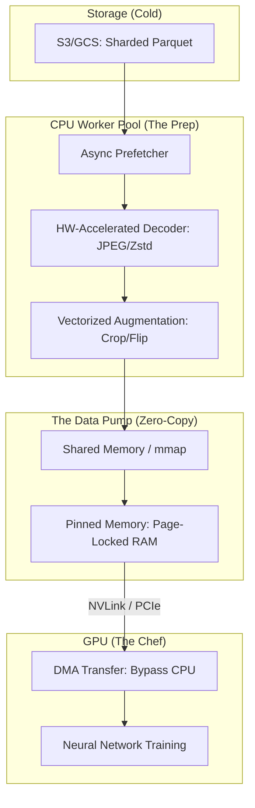

*By Gopi Krishna Tummala*

---

  
Infrastructure-First MLOps — Building the Engine of AI

  

    <a href="/posts/mlops/parquet-arrow-quest-for-analytic-speed" style="background: rgba(255,255,255,0.1); padding: 0.5rem 1rem; border-radius: 6px; text-decoration: none; color: white; opacity: 0.9;">Module 1: Data DNA</a>
    <a href="/posts/mlops/datasets-and-dataloaders" style="background: rgba(255,255,255,0.25); padding: 0.5rem 1rem; border-radius: 6px; text-decoration: none; color: white; font-weight: 600; border: 2px solid rgba(255,255,255,0.5);">Module 2: Dataloaders</a>
    <a href="/posts/mlops/hidden-engine-of-ai" style="background: rgba(255,255,255,0.1); padding: 0.5rem 1rem; border-radius: 6px; text-decoration: none; color: white; opacity: 0.9;">Module 3: Training</a>
    <a href="/posts/mlops/modern-post-training-peft-2026" style="background: rgba(255,255,255,0.1); padding: 0.5rem 1rem; border-radius: 6px; text-decoration: none; color: white; opacity: 0.9;">Module 4: Post-Training</a>
    <a href="/posts/mlops/vllm-trilogy-of-modern-llm-scaling" style="background: rgba(255,255,255,0.1); padding: 0.5rem 1rem; border-radius: 6px; text-decoration: none; color: white; opacity: 0.9;">Module 5: Serving</a>
    <a href="/posts/mlops/custom-kernel-craze" style="background: rgba(255,255,255,0.1); padding: 0.5rem 1rem; border-radius: 6px; text-decoration: none; color: white; opacity: 0.9;">Module 6: Kernels</a>
    <a href="/posts/mlops/beyond-inference-agentic-mlops-mcp" style="background: rgba(255,255,255,0.1); padding: 0.5rem 1rem; border-radius: 6px; text-decoration: none; color: white; opacity: 0.9;">Module 7: Agentic AI</a>
  

  
📖 You are reading <strong>Module 2: Dataloaders</strong> — The Pump of AI

---

### Act 0: Dataloaders in Plain English

Imagine you are a world-class chef (The GPU). You can cook a 5-course meal in 10 seconds. But you have a problem: your assistant (The CPU) is slow. 

If your assistant only brings you one onion at a time, you spend 90% of your day just standing around waiting for onions. This is called a **Data Bottleneck**.

**The Dataloader** is the assembly line that keeps the chef busy:
1.  **Fetching:** Grabbing ingredients from the fridge (S3/Disk).
2.  **Prep:** Chopping, washing, and seasoning (Transformations/Augmentation).
3.  **Plating:** Putting everything into a nice box (Batching).
4.  **Prefetching:** Having the *next* meal ready on the counter before the chef even finishes the first one.

If your GPU utilization is low, your assistant is slow. **MLOps is the art of building a faster assistant.**

---

### Act I: Map-Style vs. Iterable-Style (The "How")

#### 1. Map-Style (`__getitem__`)
Like a book with an index. You can jump to page 452 instantly.
*   **Best for:** Datasets that fit on local disk or have fast random access.
*   **Pros:** Perfect shuffling. You can pick any random sample easily.

#### 2. Iterable-Style (`__iter__`)
Like a conveyor belt or a movie stream. You can only see the next frame.
*   **Best for:** Petabyte-scale data stored in the cloud (S3). You don't want to "download" the whole book; you just want to read the stream.
*   **Pros:** Near-zero startup time. You can start training the second the stream begins.

---

#### Act I.V: Mature Architecture — The Zero-Copy Data Pump

In a 2025 production stack, we move away from Python's `multiprocessing` (which is slow and memory-heavy) toward **C++ / Rust-based Data Loaders** (like NVIDIA DALI or AIStore) that perform "Zero-Copy" transfers.

**The Dataloader Pipeline (Mature Architecture):**

##### 1. Pinned Memory & DMA
Standard RAM can be moved around by the OS (paged). GPUs hate this. We use **Pinned Memory** (Page-Locked) so the GPU can reach into the CPU's RAM and grab data directly via **Direct Memory Access (DMA)** without asking the CPU for permission.

##### 2. Trade-offs & Reasoning
*   **Python Dataloader vs. NVIDIA DALI:** A PyTorch dataloader runs transforms on the CPU. *Trade-off:* If you have complex image resizing, your CPU hits 100% and the GPU starves. DALI moves the resizing **onto the GPU**, using spare CUDA cores to prep the *next* batch while the current one trains.
*   **Shuffling: Global vs. Local:** To save memory at scale, we use **Approximate Shuffling**. We shuffle the order of files (Global), but only shuffle a small buffer of samples inside the worker (Local). *Trade-off:* It's 99% as good as a true shuffle but uses 1000x less RAM.
*   **Citations:** *DALI: A GPU-Accelerated Data Loading Library (NVIDIA 2023)* and *WebDataset: Efficient Streaming of Large Datasets (2022)*.

---

### Act II: System Design & Interview Scenarios

#### Scenario 1: The "Dreaded" Epoch Startup Lag
*   **Question:** "Your training starts, but it takes 15 minutes of 'silence' before the first batch hits the GPU. Why?"
*   **Answer:** This is usually **Format Latency**. Your dataloader is likely scanning 10,000 JSON files to build a list of samples. **The Fix:** Use a **Metadata Index** (like a single Parquet file) that lists every sample's location so the loader can jump straight to the data.

#### Scenario 2: GPU Starvation (Utilization < 20%)
*   **Question:** "You have an H100 GPU, but utilization is at 15%. `nvidia-smi` shows the GPU is idle most of the time. How do you find the bottleneck?"
*   **Answer:** Check the **CPU-Worker Ratio**. Use `num_workers` in PyTorch. If increasing workers doesn't help, the bottleneck is likely **Decompression** or **Transformation**. Discuss moving transforms to the GPU (DALI) or using a faster compression format (LZ4 instead of Gzip).

#### Scenario 3: Shuffling at Petabyte Scale
*   **Question:** "How do you shuffle a dataset that is too large to fit on any one machine?"
*   **Answer:** Discuss **Two-Tier Shuffling**.
    1.  **Shard Shuffle:** Shuffle the order of the 10,000 Parquet files in the cloud.
    2.  **Buffer Shuffle:** Each worker node maintains a 10,000-sample "Shuffle Buffer" in RAM. It picks one sample from the buffer and replaces it with one from the stream.

---

### Graduate Assignment: The Dataloader Stress Test

**Task:**
You are training on 4K high-resolution images.
1.  **The Bottleneck:** If one image is 50MB and your batch size is 32, how much data must you move to the GPU per second if the model takes 200ms per batch?
2.  **The Fix:** If your PCIe bandwidth is 16GB/s, but your CPU can only decode images at 100MB/s, what is your maximum theoretical GPU utilization?
3.  **The Strategy:** Propose a change to the **Storage Format** (e.g., JPEG-Turbo vs. WebP) to resolve this.

---

**Further Reading:**
*   *HuggingFace Datasets: The Arrow-native design.*
*   *NVIDIA DALI Documentation: Exploiting spare GPU cycles.*
*   *WebDataset: Scaling to 100+ nodes without NFS bottlenecks.*

---

**Previous:** [Module 1 — Data DNA](/posts/mlops/parquet-arrow-quest-for-analytic-speed)

**Next:** [Module 3 — Training Frameworks: The Engine](/posts/mlops/hidden-engine-of-ai)
