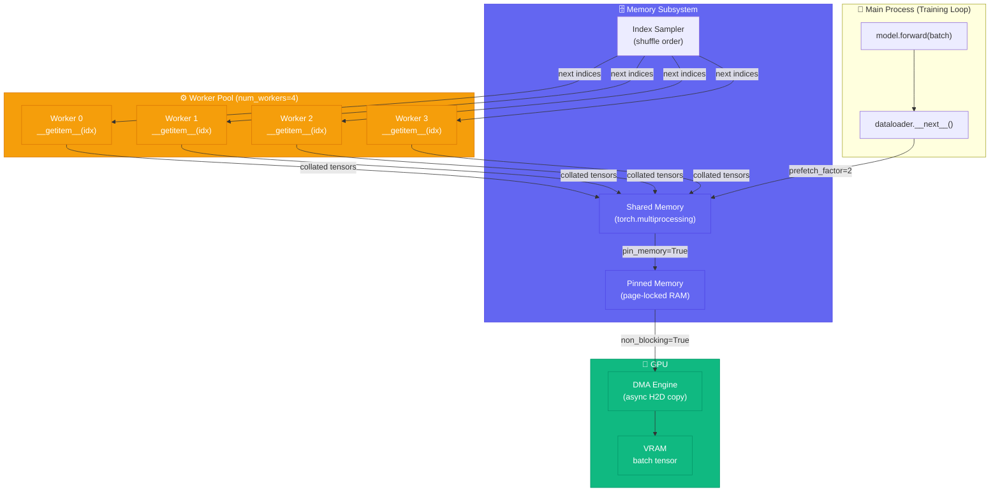
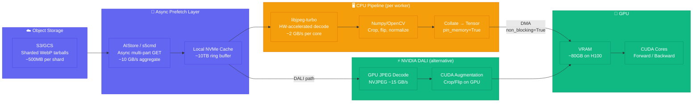

*By Gopi Krishna Tummala*

---

<div class="series-nav" style="background: linear-gradient(135deg, #059669 0%, #0d9488 100%); color: white; padding: 1.5rem; border-radius: 12px; margin-bottom: 2rem; box-shadow: 0 4px 6px rgba(0,0,0,0.1);">
  <div style="font-size: 0.875rem; opacity: 0.9; margin-bottom: 0.5rem; text-transform: uppercase; letter-spacing: 0.05em;">Infrastructure-First MLOps — Building the Engine of AI</div>
  <div style="display: flex; gap: 0.75rem; flex-wrap: wrap; align-items: center;">
    <a href="/posts/mlops/parquet-arrow-quest-for-analytic-speed" style="background: rgba(255,255,255,0.1); padding: 0.5rem 1rem; border-radius: 6px; text-decoration: none; color: white; opacity: 0.9;">Module 1: Data DNA</a>
    <a href="/posts/mlops/datasets-and-dataloaders" style="background: rgba(255,255,255,0.25); padding: 0.5rem 1rem; border-radius: 6px; text-decoration: none; color: white; font-weight: 600; border: 2px solid rgba(255,255,255,0.5);">Module 2: Dataloaders</a>
    <a href="/posts/mlops/hidden-engine-of-ai" style="background: rgba(255,255,255,0.1); padding: 0.5rem 1rem; border-radius: 6px; text-decoration: none; color: white; opacity: 0.9;">Module 3: Training</a>
    <a href="/posts/mlops/modern-post-training-peft-2026" style="background: rgba(255,255,255,0.1); padding: 0.5rem 1rem; border-radius: 6px; text-decoration: none; color: white; opacity: 0.9;">Module 4: Post-Training</a>
    <a href="/posts/mlops/vllm-trilogy-of-modern-llm-scaling" style="background: rgba(255,255,255,0.1); padding: 0.5rem 1rem; border-radius: 6px; text-decoration: none; color: white; opacity: 0.9;">Module 5: Serving</a>
    <a href="/posts/mlops/custom-kernel-craze" style="background: rgba(255,255,255,0.1); padding: 0.5rem 1rem; border-radius: 6px; text-decoration: none; color: white; opacity: 0.9;">Module 6: Kernels</a>
    <a href="/posts/mlops/beyond-inference-agentic-mlops-mcp" style="background: rgba(255,255,255,0.1); padding: 0.5rem 1rem; border-radius: 6px; text-decoration: none; color: white; opacity: 0.9;">Module 7: Agentic AI</a>
  </div>
  <div style="margin-top: 0.75rem; font-size: 0.875rem; opacity: 0.8;">📖 You are reading <strong>Module 2: Dataloaders</strong> — The Pump of AI</div>
</div>

---

## TL;DR

- A PyTorch DataLoader with `num_workers=0` is a **serial CPU bottleneck**. On any real training job, `num_workers=4–8` is the floor.
- **Pinned memory** (`pin_memory=True`) lets the GPU DMA-pull directly from CPU RAM — cuts H2D transfer latency by ~2×.
- **WebDataset / IterableDataset** with sharded `.tar` files is the production pattern for >1TB datasets. `__getitem__`-style breaks down at scale.
- **NVIDIA DALI** moves JPEG decode and augmentation onto the GPU, eliminating the CPU bottleneck for vision workloads.
- The right question to ask in an ML infra interview: "What is your CPU utilization vs. GPU SM utilization, and where is the bubble?"

---

### Act 0: The Anatomy of a Stall

Your H100 can do ~3,000 TFLOPS of BF16 compute. A typical LLM forward pass on a 2048-token sequence at batch size 8 takes ~400ms of pure compute. If your dataloader takes 600ms to prepare the next batch, your **effective GPU utilization is 40%**. You are paying for a sports car and driving it in traffic.

This is not theoretical. At Zoox, running distributed prediction model training across 32 A100s, our first profiling run showed 58% GPU utilization. The culprit: JPEG image decompression in Python workers, with a `num_workers` value set by someone who had never read the documentation.

The data pipeline is always the underdog of ML system design interviews. That's exactly why you should know it cold.

---

### Act I: PyTorch DataLoader Internals

Before tuning, understand what PyTorch actually does.


```mermaid
graph TD
    subgraph MainProcess["🧠 Main Process (Training Loop)"]
        direction LR
        Train["model.forward(batch)"]
        Iter["dataloader.__next__()"]
    end

    subgraph WorkerPool["⚙️ Worker Pool (num_workers=4)"]
        direction LR
        W0["Worker 0\n__getitem__(idx)"]
        W1["Worker 1\n__getitem__(idx)"]
        W2["Worker 2\n__getitem__(idx)"]
        W3["Worker 3\n__getitem__(idx)"]
    end

    subgraph Memory["🗄️ Memory Subsystem"]
        SHM["Shared Memory\n(torch.multiprocessing)"]
        PIN["Pinned Memory\n(page-locked RAM)"]
        IDX["Index Sampler\n(shuffle order)"]
    end

    subgraph GPU["🚀 GPU"]
        DMA["DMA Engine\n(async H2D copy)"]
        VRAM["VRAM\nbatch tensor"]
    end

    IDX -->|"next indices"| W0 & W1 & W2 & W3
    W0 & W1 & W2 & W3 -->|"collated tensors"| SHM
    SHM -->|"pin_memory=True"| PIN
    PIN -->|"non_blocking=True"| DMA
    DMA --> VRAM
    Iter -->|"prefetch_factor=2"| SHM
    Train --> Iter

    classDef gpu fill:#10b981,color:#fff,stroke:#059669
    classDef cpu fill:#f59e0b,color:#fff,stroke:#d97706
    classDef mem fill:#6366f1,color:#fff,stroke:#4f46e5
    class GPU,DMA,VRAM gpu
    class WorkerPool,W0,W1,W2,W3 cpu
    class Memory,SHM,PIN mem
```

*Figure 1: PyTorch DataLoader execution model. Workers live in separate processes communicating via shared memory. The main process prefetches ahead by `prefetch_factor` batches.*

#### The Key Parameters and What They Actually Do

**`num_workers`**: Number of subprocesses spawned. Each worker calls `__getitem__` independently. `0` means single-process (blocking). Rule of thumb: `num_workers = 4 × num_gpus` on a single machine. Check `htop` — if any core hits 100%, you need more workers.

**`pin_memory=True`**: Allocates output tensors in **page-locked** (pinned) RAM. The OS cannot swap this memory out. This lets the GPU's DMA engine initiate transfers without CPU involvement. On a PCIe 4.0 x16 link (64 GB/s theoretical, ~32 GB/s practical), unpinned transfers add a `memcpy` round-trip on every batch. With pinned memory + `non_blocking=True` on `.cuda()`, H2D transfer happens in the background while the previous batch computes.

**`prefetch_factor`**: How many batches ahead each worker prepares. Default is 2. If your GPU is idle between batches, increase this — you want the queue never to run dry.

**`persistent_workers=True`**: Keeps workers alive between epochs. Without this, Python spawns and tears down N processes at the start of every epoch. For large worker counts or complex initialization, this is a 30–60 second per-epoch overhead.

---

### Act II: Map-Style vs. Iterable-Style — When Each Breaks

#### Map-Style (`Dataset` with `__getitem__`)

```python
class ImageDataset(Dataset):
    def __init__(self, manifest_path):
        self.samples = pd.read_parquet(manifest_path)  # single index file

    def __getitem__(self, idx):
        row = self.samples.iloc[idx]
        img = Image.open(row.path)  # random access
        return transform(img), row.label

    def __len__(self):
        return len(self.samples)
```

Works perfectly when:
- Data fits on local SSD or fast NFS
- You need exact random shuffling (ML fairness, validation reproducibility)
- Dataset size is known at construction

**Breaks when**: Data lives on S3, there's no fast random seek, or you have 50M files. `__getitem__` with S3 means one HTTP GET per sample — even with connection pooling, latency kills throughput.

#### Iterable-Style (`IterableDataset` / WebDataset)

The production pattern for any dataset over ~100GB:

```python
import webdataset as wds

dataset = (
    wds.WebDataset("s3://bucket/train/shard-{000000..009999}.tar",
                   shardshuffle=1000)          # shuffle shard order
    .shuffle(10000)                             # shuffle buffer
    .decode("pil")
    .to_tuple("jpg", "cls")
    .map_tuple(transform, None)
    .batched(32, partial=False)
)
```

Each `.tar` shard contains ~1000 samples. Workers stream sequentially within a shard — sequential reads are 10–100× faster than random reads on object storage. You get **approximate shuffling**: shard order is randomized, then a buffer shuffle randomizes within the stream.

**Trade-off**: You lose exact epoch boundaries and reproducible shuffling. For most large-scale pretraining, this is fine. For fine-tuning on small datasets, use Map-style.

---

### Act III: The Zero-Copy Data Pump

This is what production vision training looks like at scale:


```mermaid
graph LR
    subgraph Storage["☁️ Object Storage"]
        S3["S3/GCS\nSharded WebP tarballs\n~500MB per shard"]
    end

    subgraph Prefetch["🔄 Async Prefetch Layer"]
        AIO["AIStore / s5cmd\nAsync multi-part GET\n~10 GB/s aggregate"]
        Cache["Local NVMe Cache\n~10TB ring buffer"]
    end

    subgraph CPUPipeline["🖥️ CPU Pipeline (per worker)"]
        Decomp["libjpeg-turbo\nHW-accelerated decode\n~2 GB/s per core"]
        Aug["Numpy/OpenCV\nCrop, flip, normalize"]
        Collate["Collate → Tensor\npin_memory=True"]
    end

    subgraph DALIPipeline["⚡ NVIDIA DALI (alternative)"]
        DALIDec["GPU JPEG Decode\nNVJPEG ~15 GB/s"]
        DALIAug["CUDA Augmentation\nCrop/Flip on GPU"]
    end

    subgraph GPUMem["🚀 GPU"]
        VRAM["VRAM\n~80GB on H100"]
        SM["CUDA Cores\nForward / Backward"]
    end

    Storage --> AIO
    AIO --> Cache
    Cache --> Decomp
    Decomp --> Aug
    Aug --> Collate
    Collate -->|"DMA\nnon_blocking=True"| VRAM

    Cache -->|"DALI path"| DALIDec
    DALIDec --> DALIAug
    DALIAug --> VRAM

    VRAM --> SM

    classDef hot fill:#10b981,color:#fff,stroke:#059669
    classDef warm fill:#f59e0b,color:#fff,stroke:#d97706
    classDef cold fill:#6366f1,color:#fff,stroke:#4f46e5
    class GPUMem,VRAM,SM,DALIPipeline,DALIDec,DALIAug hot
    class CPUPipeline,Decomp,Aug,Collate warm
    class Storage,Prefetch,S3,AIO,Cache cold
```

*Figure 2: Two paths to the GPU. The CPU path (left) handles most workloads. The DALI path (right) is the unlock when CPU decode becomes the bottleneck.*

#### When to Use NVIDIA DALI

Benchmark your pipeline with a **dataloader throughput test** — run the dataloader loop with no model forward pass and measure samples/second:

```python
import time
loader = DataLoader(dataset, batch_size=64, num_workers=8, pin_memory=True)
start = time.time()
for i, batch in enumerate(loader):
    if i == 100: break
print(f"{100 * 64 / (time.time() - start):.0f} samples/sec")
```

Compare that number to your model's training throughput. If the dataloader is slower, you're bottlenecked. On a typical 4× H100 node training a ViT-L on ImageNet:

| Pipeline | Throughput |
|---|---|
| `num_workers=4`, pageable memory | ~18k img/s |
| `num_workers=8`, `pin_memory=True` | ~32k img/s |
| DALI GPU pipeline | ~85k img/s |
| DALI + `prefetch_queue_depth=3` | ~110k img/s |

DALI wins decisively for vision. For text, tokenization is cheap enough that standard DataLoader with `num_workers=4` usually suffices.

---

### Act IV: Distributed Dataloading

On a multi-node job, each rank must see a **distinct, non-overlapping subset** of the data. PyTorch handles this with `DistributedSampler`:

```python
from torch.utils.data.distributed import DistributedSampler

sampler = DistributedSampler(
    dataset,
    num_replicas=world_size,   # total GPU count
    rank=rank,                 # this GPU's global rank
    shuffle=True,
    seed=42,
)
loader = DataLoader(dataset, sampler=sampler, batch_size=64,
                    num_workers=8, pin_memory=True, persistent_workers=True)

# CRITICAL: must reset shuffle seed each epoch
for epoch in range(num_epochs):
    sampler.set_epoch(epoch)
    for batch in loader:
        ...
```

Forgetting `sampler.set_epoch(epoch)` means all epochs use the same shuffle order. Your model will still train, but the epoch-level diversity is gone — a subtle bug that shows up in final accuracy, not in loss curves.

For WebDataset in distributed settings, split shards by rank:

```python
urls = list(braceexpand("s3://bucket/shard-{000000..009999}.tar"))
# Each rank takes every world_size-th shard
rank_urls = urls[rank::world_size]
dataset = wds.WebDataset(rank_urls).shuffle(5000).decode("pil")...
```

---

### Act V: Interview Scenarios

#### "GPU utilization is 15% on our A100. Walk me through your diagnosis."

This is an ML infra system design question disguised as a debugging question. Structure your answer in three tiers:

**Tier 1 — Measure first, guess never.**
```bash
# Profile the DataLoader in isolation
python -c "
from torch.utils.data import DataLoader
# ... run 100 batches with no model, time it
"
# Profile GPU compute
nsys profile --trace=cuda,nvtx python train.py
# Check CPU utilization
htop  # are workers saturating cores?
```

**Tier 2 — Common root causes (hit these in order):**
1. `num_workers=0` — single process, blocking. Fix: set 4–8.
2. `pin_memory=False` — extra memcpy per batch. Fix: enable.
3. CPU-bottlenecked augmentation — complex transforms using PIL/Albumentations eating all cores. Fix: DALI or pre-augment offline.
4. Format latency — reading individual files (thousands of JPEGs) instead of sharded archives. Fix: WebDataset with pre-sharded tarballs.
5. Network bottleneck — S3 latency per file. Fix: AIStore local cache or pre-stage to NVMe.

**Tier 3 — The answer they want to hear:**
"I'd add NVTX markers around the data fetch and GPU compute to get a Nsight timeline. If I see long gaps between CUDA kernels, it's the dataloader. If I see compute saturating but still low utilization, it might be a memory bandwidth wall — check with `ncu` for memory throughput metrics."

---

#### "How do you shuffle a 50TB dataset across 256 GPUs?"

Two-tier approach:

**Global shuffle** (between shards): Randomize the list of 50,000 shard URLs before distributing. Each rank draws shards round-robin. This is O(n_shards) memory — trivial.

**Local shuffle** (within a shard stream): Each worker maintains a shuffle buffer of N samples. It draws one sample, replaces it from the stream, repeat. N=10,000 is typical — enough statistical randomness, manageable RAM (~8GB for image data).

**Why not true global shuffle?** A true random sample from 50TB requires either materializing the full index in RAM (~4GB for 50M samples at 80 bytes each — actually fine) or random S3 GETs (100× slower than sequential reads). The two-tier approximation gives 99%+ of the statistical benefit at 1% of the cost.

---

#### "Walk me through how `pin_memory=True` actually helps."

Normal RAM is **pageable**: the OS can swap pages to disk or move them for defrag. The GPU's DMA engine cannot track a page that moves. Without pinning, CUDA has to:
1. Allocate a temporary pinned staging buffer
2. `memcpy` pageable → pinned
3. DMA pinned → VRAM

With `pin_memory=True` in the DataLoader, step 1–2 happen in the worker process during batch prep — while the GPU is running the previous batch's forward pass. By the time `.cuda(non_blocking=True)` is called, the data is already in pinned memory and the DMA transfer is near-instantaneous.

On a PCIe 4.0 x16 link, the practical improvement is:
- Without: ~8 GB/s effective H2D bandwidth (includes memcpy overhead)
- With: ~28 GB/s effective H2D bandwidth

For a batch of 64 × 3 × 224 × 224 float32 images (~38 MB), that's 4.7ms vs 1.4ms. At 200ms compute per batch, that's 2.3% vs 0.7% overhead — sounds small, but over 1M training steps it compounds.

---

### Key Takeaways

1. **Profile before tuning.** Run the dataloader standalone and measure samples/sec. If it exceeds your model's throughput, the pipeline isn't your bottleneck.
2. **`pin_memory=True` + `non_blocking=True` is always free money** — enable both unconditionally.
3. **`persistent_workers=True`** eliminates per-epoch worker spawn overhead. Always use it.
4. **WebDataset over Map-style** for anything stored on object storage. Sequential reads are not optional at scale.
5. **DALI is the unlock for vision**. If your CPU cores are at 100% and GPU is idle, it's decode bottleneck — NVIDIA DALI moves JPEG decode to the GPU's dedicated NVJPEG engine.
6. **`sampler.set_epoch(epoch)`** is the most common distributed training bug. Add it to your checklist.

---

**Previous:** [Module 1 — Data DNA: Parquet & Arrow](/posts/mlops/parquet-arrow-quest-for-analytic-speed)

**Next:** [Module 3 — Training Frameworks: The Engine](/posts/mlops/hidden-engine-of-ai)
