When people talk about artificial intelligence, they often focus on the *models*: the towering transformers, the artistic diffusion systems, or the clever language models that seem to think.
But beneath every breakthrough lies a quieter force — the *data pipeline*.

In this post, we'll explore how data moves from storage to the model — and why tools like PyTorch, TensorFlow, NVIDIA DALI, and Hugging Face Datasets are as critical to AI as the models themselves.

---

## 1. The World Before the Model: What Is a Dataset?

A **dataset** is the raw memory of an AI system.
It's a structured (or sometimes chaotic) collection of examples that teach a model what the world looks like.

* For a self-driving car, each data point might be a video clip from cameras and LiDAR sensors.
* For an image generator, it might be a caption–image pair: "a dog wearing sunglasses" and its corresponding picture.
* For a language model, each entry might be a paragraph from a book, a website, or a transcript.

Datasets aren't just piles of data — they carry structure, annotation, and meaning.
They often come in different formats:

* **Images and videos:** JPEG, PNG, MP4
* **Text and captions:** JSON, CSV, TXT
* **Structured features:** Parquet, TFRecord, HDF5

Each format represents a different trade-off between storage efficiency, access speed, and flexibility.
For example, **Parquet** (used by Hugging Face Datasets) stores data in a columnar format — meaning if you only need one column, you can read just that part from disk. This makes loading large datasets much faster and cheaper.

**The Core Thesis:** Modern high-performance dataloaders follow a simple but powerful principle: **Parquet is for storage efficiency, and Arrow is for training speed.** This architectural pattern—storing data in Parquet and converting it to Arrow IPC (Feather format) for in-memory operations—enables systems to handle massive datasets efficiently, from laptops to petabyte-scale clusters.

---

## 2. Two Ways to Access Data: Map-Style vs. Iterable-Style Datasets

When implementing datasets (especially in PyTorch), there are two fundamental design patterns that determine how data is accessed and loaded. Understanding this distinction is crucial for choosing the right approach for your use case.

### Map-Style Dataset (`__getitem__`, `__len__`)

A **Map-Style Dataset** is like a dictionary or a list — you can access any item by its index. It requires two methods:
- `__len__()`: Returns the total number of samples (must be known)
- `__getitem__(idx)`: Returns the sample at index `idx`

This design enables **random access** — you can jump to any sample instantly, perfect for shuffling and random sampling.

```python
class MapStyleDataset:
    def __len__(self):
        return len(self.data)
    
    def __getitem__(self, idx):
        return self.data[idx]  # Direct random access
```

### Iterable-Style Dataset (`__iter__`)

An **Iterable-Style Dataset** is like a stream — you can only access items sequentially, one after another. It implements the iterator protocol:
- `__iter__()`: Returns an iterator that yields samples sequentially

This design is perfect for **streaming data** — datasets that are too large to fit in memory, real-time data streams, or effectively infinite datasets.

```python
class IterableStyleDataset:
    def __iter__(self):
        # Read from a file, database, or API
        for line in open('huge_file.txt'):
            yield process(line)  # Sequential access only
```

### When to Use Which?

| Feature | Map-Style Dataset (`__getitem__`, `__len__`) | Iterable-Style Dataset (`__iter__`) |
|---------|---------------------------------------------|--------------------------------------|
| **Access** | Random Access (dataset[idx]) | Sequential Access (Looping/Iterating) |
| **Dataset Size** | Must be known (`__len__` required) | Can be unknown or effectively infinite |
| **Shuffling** | Exact Shuffling is easily supported | Only Approximate Shuffling is feasible |
| **Memory Use** | Can be high if implemented eagerly | Low (Lazy loading/Streaming) |
| **Best For** | Standard-sized datasets, random sampling, and benchmarks. | Massive datasets, real-time data streams, custom generators. |

**Choose Map-Style** when:
- You need random access for shuffling or sampling
- Your dataset size is known and manageable
- You're working with standard benchmarks or research datasets

**Choose Iterable-Style** when:
- You're streaming data from a file, database, or API
- Your dataset is too large to fit in memory
- You need to process data in real-time (e.g., live sensor feeds)
- Your dataset size is unknown or effectively infinite

Most frameworks (like PyTorch's `DataLoader`) support both patterns, but the choice affects how shuffling, sampling, and parallelization work under the hood.

---

## 3. The Dataset–Model Gap

Imagine a race car (the model) waiting on the track. The dataset is the fuel.
But if you pour gasoline directly onto the engine, it won't run — you need a *fuel line* that feeds it at the right rate, temperature, and pressure.

That's what a **dataloader** does.
It bridges the gap between storage and model computation.

**The Format Foundation:** Modern dataloaders rely on two complementary data formats working together. **Parquet** is like the warehouse—efficiently storing compressed data on disk. **Arrow** is like the prep table—ready for immediate use in memory. The dataloader's job is to move data from the Parquet warehouse to the Arrow prep table, then serve it to the model at the right speed.

A dataloader handles:

* **Reading** files from disk
* **Decoding** them (e.g., converting JPEG bytes into tensors)
* **Transforming** them (e.g., resizing, normalization, augmentation)
* **Batching** examples (grouping multiple samples into one input)
* **Prefetching** (loading the next batch while the current one trains)

Without an efficient dataloader, even the fastest GPU will sit idle, waiting for data.

---

## 4. What Does a Dataloader Actually Do?

At its core, a dataloader is like a production line. Each sample goes through a series of steps before it reaches the model.

1. **Fetch** — read the next file or record.
2. **Decode** — convert raw bytes into usable form (image → tensor, text → token IDs).
3. **Transform** — apply random flips, crops, or brightness changes (for data augmentation).
4. **Batch** — combine several samples into one big tensor for parallel processing.
5. **Prefetch** — get the next batch ready before the current one finishes.

These steps ensure that the GPU (or accelerator) is never waiting on the CPU or disk.

---

## 5. Prefetching, Caching, and Parallelism

**Prefetching** is one of those quietly powerful ideas.
If your model takes 100 milliseconds to process a batch, you can use those 100 ms to *prepare the next batch in the background*.
By the time the model finishes, the next input is ready — no waiting.

Libraries like TensorFlow and PyTorch implement this with background threads or asynchronous queues.

Another trick is **caching** — storing frequently used samples (or intermediate tensors) in faster memory like RAM or GPU VRAM. This helps when you need to repeatedly access the same dataset, like in evaluation or fine-tuning.

Finally, **parallelism** — using multiple CPU workers to load data concurrently — ensures that even massive datasets don't become bottlenecks.

---

## 6. Shuffling, Order, and Determinism

When we train a model, we don't want it to memorize the order of the data — we want it to *learn the patterns inside the data itself*.
That's why dataloaders often include a process called **shuffling**.

### 🌀 Shuffling: The Three Layers

In large-scale distributed training, shuffling happens at **three distinct layers**, each serving a different purpose:

**Layer A — Global Shuffle (Dataset-Level):**
* Happens *before* sharding
* Achieves global sample mixing across the entire dataset
* Usually via `dataset.shuffle(seed)` in HuggingFace Datasets
* **Cheap:** Shuffles index permutations, not data files
* Ensures every rank sees a random mix of samples

**Layer B — Per-Rank Shard Split:**
* Happens via `Dataset.shard(num_shards=world_size, index=rank)`
* Each node/rank gets a **slice** of the (already-shuffled) dataset
* Shard = contiguous slice or modulo slice based on rank
* **No shuffling happens here** — this is pure partitioning

**Layer C — Local Mini-batch Shuffle (DataLoader):**
* Happens *after* sharding, within each rank's shard
* PyTorch DataLoader shuffles *only within the local shard*
* Done by randomizing batch sampling order
* **Not globally consistent:** Only shard-local randomness

**The Critical Ordering:**

```
Global Shuffle → Shard → Local Shuffling
```

**Why this order matters:**
* If you shard **before** global shuffle → each rank sees a non-random chunk (bad)
* If you shuffle **after** local shard → each rank only shuffles its own portion (acceptable but not ideal)
* **Correct approach:** Global shuffle first ensures true randomness, then shard, then local shuffle adds extra randomness within each shard

In PyTorch, you'll see:

```python
DataLoader(dataset, shuffle=True)  # Layer C: Local shuffle
```

In TensorFlow:

```python
dataset.shuffle(buffer_size=10000)  # Layer A or C, depending on context
```

The buffer size controls how much of the data is mixed at once — larger buffers give more randomness but need more memory.

---

### 🧭 Determinism and Reproducibility

Sometimes, we *do* want consistent results — for example, when debugging or comparing experiments.
That's where **determinism** comes in: making sure the same code, on the same data, produces the same outputs every time.

We achieve this by:

* Setting random seeds (`torch.manual_seed(42)` or `tf.random.set_seed(42)`)
* Controlling the number of data loader workers
* Disabling non-deterministic GPU operations (for reproducibility)

A **deterministic pipeline** means your training process is repeatable — crucial in research, production, and safety-critical domains like autonomous driving.

---

### ⚖️ Balancing Randomness and Consistency

Shuffling and determinism often seem like opposites — but great pipelines use both.
They keep training random enough to prevent bias, yet controlled enough to reproduce results when needed.

For instance:

* Training runs might shuffle data to generalize better.
* Evaluation runs keep the same order for fair comparison.

This dance between *randomness* and *repeatability* is part of what makes data pipelines both scientific and artistic.

---

## 7. Tools That Power Modern Data Pipelines

Different AI domains have evolved their own data-handling ecosystems. Here's a quick guide to the major players:

| Tool | Primary Focus | Key Feature |
|------|---------------|-------------|
| **PyTorch DataLoader** | Flexible, Pythonic loading. | Easily combines a custom Dataset with worker parallelism and shuffling. |
| **TensorFlow tf.data** | Graph-based optimization. | Allows chaining operations like `.map()`, `.shuffle()`, and `.prefetch()` for highly optimized pipelines. |
| **NVIDIA DALI** | Maximum Speed (GPU acceleration). | Moves resource-heavy preprocessing steps (decoding, cropping, augmentation) from the CPU to the GPU, drastically increasing throughput. |
| **Hugging Face Datasets** | Community datasets, cloud-scale. | Supports streaming massive datasets from the cloud and uses Apache Parquet format for efficient, memory-mapped access. |

### 🧠 PyTorch `DataLoader`

A flexible iterator that can load data from any custom `Dataset` object. You can define your own `__getitem__` logic, apply transformations, and use `num_workers` for parallelism. It's the go-to choice for most PyTorch practitioners because it's intuitive and works seamlessly with Python's multiprocessing.

### ⚡ TensorFlow `tf.data`

A graph-based pipeline API. You can chain operations like `.map()`, `.shuffle()`, and `.prefetch()` to create highly optimized pipelines that even run on accelerators. The graph optimization means TensorFlow can automatically fuse operations and parallelize them for maximum efficiency.

### 🎮 NVIDIA DALI (Data Loading Library)

Built for speed.
DALI moves preprocessing — like image decoding, cropping, and augmentation — *onto the GPU*, reducing CPU overhead and increasing throughput.
It's widely used in computer vision, self-driving, and large-scale model training where every millisecond counts.

### 🤗 Hugging Face Datasets

A community-driven platform for datasets in machine learning.
It supports *streaming* large datasets from the cloud, *memory mapping*, and the efficient **Apache Parquet** format.
You can load billions of samples without running out of memory — perfect for training language models or working with massive image datasets.

### 🧱 WebDataset, Petastorm, and TFRecord

These libraries handle specialized formats (like sharded tar files or Spark-based data) — crucial for distributed training across many machines. They're the infrastructure layer that makes large-scale training possible.

---

### 📊 Dataloader Tool Matrix: Speed vs. Flexibility

Choosing the right library for your data pipeline is a critical decision that balances flexibility, ease of use, and raw speed. The following matrix compares the four leaders in the deep learning data ecosystem across key dimensions:

#### 1. PyTorch DataLoader (The Flexible Standard)

PyTorch's system uses the **`Dataset`** class (what to load) and the **`DataLoader`** class (how to load it). It is the default choice for most researchers and general-purpose projects.

| Category | Pros (Advantages) | Cons (Disadvantages) |
| :--- | :--- | :--- |
| **Flexibility** | **Highly Customizable:** Easy to implement custom logic in `__getitem__` for complex or unconventional data formats. | **CPU Bottleneck Risk:** Preprocessing (decoding, augmentation) usually runs on the CPU, which can become a bottleneck for fast GPUs. |
| **Parallelism** | Simple **`num_workers`** parameter enables multi-process parallel data loading (using Python's `multiprocessing`). | **Memory Duplication:** Multi-process loading can lead to **memory duplication** as each worker loads its own copy of the dataset metadata or large objects. |
| **Ease of Use** | **Pythonic and Intuitive:** Fits naturally within the Python/PyTorch ecosystem; simple API for batching, shuffling, and prefetching. | **No Native Cloud Support:** Lacks built-in, optimized support for cloud storage (e.g., S3, GCS), often requiring custom code. |
| **Data Types** | Excellent native support for **Map-Style** (random access) and **Iterable-Style** (streaming) datasets. | **GIL Limitation:** Python's Global Interpreter Lock (GIL) can limit true multi-threading speed for CPU-bound tasks (though the `num_workers` process-based approach mostly bypasses this). |

#### 2. TensorFlow `tf.data` (The Optimized Pipeline)

The `tf.data` API is an expressive, chainable, graph-based framework designed for high-performance input pipelines, optimized for the TensorFlow ecosystem.

| Category | Pros (Advantages) | Cons (Disadvantages) |
| :--- | :--- | :--- |
| **Optimization** | **Graph-Based Efficiency:** Automatically optimizes the data pipeline graph (e.g., fusion of operations, smart scheduling) for maximum throughput. | **Less Pythonic:** API is focused on method chaining (`.map()`, `.shuffle()`, `.prefetch()`) which can feel less intuitive than standard Python logic for complex transformations. |
| **Scalability** | Strong support for sharding and distributing data across multiple devices/machines using specialized file formats like **TFRecord**. | **Framework Lock-in:** Primarily designed for and optimized within the TensorFlow ecosystem; integrating with PyTorch is complex or impossible. |
| **Features** | Includes high-level features like native **caching**, **sharding**, and excellent support for large-scale data and distributed training. | **Overwhelming Complexity:** The vast array of options and methods can be overwhelming for beginners. |

#### 3. NVIDIA DALI (The Speed Demon)

DALI (Data Loading Library) is an open-source library that aims to eliminate the CPU bottleneck by moving as many data pre-processing steps as possible to the **GPU**.

**Why GPU Acceleration Matters:** DALI moves operations to the GPU, leveraging specialized hardware and avoiding the costly transfer of raw data from the CPU to the GPU multiple times. Instead of: CPU decode → CPU augment → CPU→GPU transfer, DALI performs: GPU decode → GPU augment → ready for training, eliminating redundant transfers.

| Category | Pros (Advantages) | Cons (Disadvantages) |
| :--- | :--- | :--- |
| **Raw Speed** | **GPU Acceleration:** Moves heavy operations (image decoding, resizing, cropping) to the GPU, significantly reducing CPU overhead and maximizing GPU utilization. | **Limited Customization:** Introducing novel or highly custom augmentations can be **difficult** compared to Python-native frameworks. |
| **Performance** | **Pipeline Effect:** Highly optimized C++ implementation and asynchronous execution provide unmatched performance, especially in computer vision (CV). | **Learning Curve:** Setting up the DALI pipeline involves defining a separate graph structure, which has a steeper learning curve than standard PyTorch/TensorFlow iterators. |
| **Integration** | Seamless integration with both PyTorch and TensorFlow via custom iterators. | **Metadata Handling:** Handling complex metadata alongside the raw data (e.g., JSON files with images) can require non-trivial workarounds. |
| **Domain** | Essential for large-scale, high-resolution CV tasks and distributed training with multiple GPUs. | Primarily focused on image, video, and audio data; less common for pure-text or structured data pipelines. |

#### 4. Hugging Face Datasets (The Community Hub)

The Hugging Face `datasets` library focuses on providing easy access to a vast, standardized catalog of datasets, specializing in NLP but expanding to vision and audio.

| Category | Pros (Advantages) | Cons (Disadvantages) |
| :--- | :--- | :--- |
| **Access & Community** | **Single-Line Loading:** Load thousands of community-uploaded datasets with one command (`load_dataset(...)`). | **Design Consistency:** The overall Hugging Face platform (which includes Datasets) has been criticized for occasional API inconsistency and excessive arguments due to rapid growth. |
| **Memory Efficiency** | Uses **Apache Arrow** and **Parquet** columnar formats, enabling efficient memory-mapping and zero-copy reads, allowing streaming of massive datasets without high RAM usage. | **Over-Standardization:** While great for standard NLP/CV tasks, it can be cumbersome if your data structure deviates significantly from the Hugging Face format. |
| **Preprocessing** | Fast, vectorized, and batch-friendly mapping operations for efficient text tokenization and transformation. | **Focus:** While expanding, its primary strength and optimization are still heavily biased toward **Natural Language Processing (NLP)**. |

---

## 8. Parquet, Arrow & How Modern Dataloaders Actually Work

Most tutorials hand-wave dataloaders as "they read data during training," but reality is more nuanced.

Different loaders have **different philosophies**, file formats, memory layouts, and *very different performance characteristics*.

This section explains what really happens under the hood — especially the role of **Parquet** (storage-time) and **Arrow** (runtime).

### 🔥 Why Parquet Exists and Why Arrow Exists

Modern ML pipelines use *two* complementary data formats:

**Apache Parquet — Storage Format:**

* Columnar, compressed, encoded
* Excellent for long-term storage
* Cheap to scan, filter, and query
* Not designed for random access
* Requires decoding before use

> Think: **warehouse storage — cold, compact, cheap.**

**Apache Arrow — In-Memory Format:**

* Columnar memory layout
* Zero-copy slicing (`arr[100:200]`)
* Memory-mappable
* Perfect for random-access training

> Think: **restaurant prep table — hot, ready-to-serve, fast.**

As defined by the Apache Arrow project, Parquet is a disk-storage format, Arrow is an in-memory format — and they are naturally complementary [[1]](https://arrow.apache.org/faq/). This design separation is fundamental: Parquet optimizes for storage efficiency and compression, while Arrow optimizes for SIMD/columnar in-memory operations [[2]](https://arrow.apache.org/blog/2023/04/11/our-journey-at-f5-with-apache-arrow-part-1/).

**Together:**

```
Parquet = persistent cold data
Arrow   = fast, in-memory training data
```

### ⚙️ Prepare Time vs Load Time

Most people underestimate how expensive *dataset preparation* is, and how cheap *training-time loading* is **if you convert into Arrow once**.

**Prepare Time (One-Time Cost):**

* Parquet → Arrow conversion
* Tokenization (if done offline)
* Sharding
* Metadata creation

⏳ **Expensive.** CPU-heavy. Happens only once.

**Load Time (Per Epoch):**

* Memory-map Arrow shards
* Zero-copy slices
* Convert to numpy / PyTorch tensor

⚡ **Extremely fast.** No decoding.

This distinction explains why **HF Datasets can handle billions of samples** on a laptop while CSV/Parquet-reading loaders cannot.

### 🚀 How Hugging Face Datasets Uses Arrow & Parquet

This part is misunderstood by many ML engineers.

**HF does NOT load Parquet during training.**

It loads **Arrow IPC (Inter-Process Communication) shards** (also known as **Feather format** files) that were created earlier. The conversion happens in two distinct stages:

#### The Two-Stage Process

**Stage 1: Preparation / Reading (Format-Specific)**

When you call `load_dataset(..., data_files="*.parquet")`, the library uses format-specific readers:

* **Parquet** → `ParquetDatasetReader` (in `datasets/io/parquet.py`)
* **CSV** → `CsvDatasetReader`
* **JSON** → `JsonDatasetReader`

All of these readers have one job: **produce one or more clean `pyarrow.Table` objects**. During this stage:
- Files are discovered and metadata is read
- Parquet row groups are scanned
- Features are inferred or validated
- Sharding/splitting logic is applied

**Output:** Raw `pyarrow.Table` objects (still in memory or memory-mapped)

**Stage 2: Arrow Dataset (Format-Agnostic)**

The raw `pyarrow.Table`(s) are wrapped into the official `Dataset` object from `datasets.arrow_dataset`. From this moment on:

* **Everything operates directly on Arrow** — `map`, `filter`, `shuffle`, `select`, `set_format`, etc.
* The original file format (Parquet/CSV/JSON) is **completely irrelevant**
* All operations are implemented in `arrow_dataset.py` on top of Arrow + indices

**Output:** `datasets.Dataset` object whose `.data` and `.cache_files` are pure Apache Arrow tables

**Visual Flow:**

```
your_file.parquet
       ↓
ParquetDatasetReader.read()               ← Stage 1: Preparation (format-specific)
       ↓
pyarrow.Table (in memory or memory-mapped)
       ↓
Dataset(arrow_table=table, info=..., split=...)   ← Stage 2: Arrow Dataset (format-agnostic)
       ↓
You now have a real datasets.Dataset object
```

**Code Evidence:** The library source shows this two-stage process explicitly. `Dataset.from_parquet()` calls `ParquetDatasetReader.read()`, which returns a `pyarrow.Table`, then wraps it in `Dataset(arrow_table=table, ...)` [[6]](https://huggingface.co/docs/datasets/v1.18.2/_modules/datasets/arrow_dataset.html). According to the documentation, PyArrow remains the underlying engine — HF lists Parquet as a primary supported source format and delegates row-group reading to PyArrow [[7]](https://huggingface.co/docs/hub/en/datasets-pyarrow). Further, the maintainers explicitly treat Arrow as the default internal storage format: a feature request to "save in Parquet instead of Arrow" indicates Arrow is the normative cache format [[8]](https://github.com/huggingface/datasets/issues/6903).

**Practical Consequence:**

* As soon as `load_dataset(..., data_files="*.parquet")` returns, the Parquet file is **no longer being read** — everything now lives in Arrow (either in memory or memory-mapped from the cache file `cache-*.arrow`).
* That's why operations are so fast and memory-efficient even on huge Parquet files.
* The cache files you see under `~/.cache/huggingface/datasets/...` are just Arrow IPC (Feather format) files (not Parquet) created during the first load. These files support memory-mapping, enabling efficient random access without loading everything into RAM.

**So:**

| Stage | Format | What Happens |
|-------|--------|--------------|
| Storage | Parquet / JSON / CSV | Original source files |
| Stage 1: Preparation | Format-specific reader → `pyarrow.Table` | Files discovered, metadata read, row groups scanned |
| Stage 2: Arrow Dataset | Arrow IPC (memory-mapped) | All operations (`map`, `filter`, `shuffle`) on Arrow |
| Training time | Arrow memory-mapped | Zero-copy access via `__getitem__` |

This conversion pattern — Parquet → Arrow for compute/ML workflows — is the standard approach used by modern dataloaders [[3]](https://huggingface.co/docs/datasets/main/about_arrow). Hugging Face Datasets uses Arrow for local caching, specifically leveraging memory-mapping, zero-copy reads, and efficient slicing [[3]](https://huggingface.co/docs/datasets/main/about_arrow). This enables handling large datasets with small RAM — a critical feature for training on consumer hardware.

**Behavioral Evidence:** Even when a dataset originally has Parquet files, when loaded via Datasets and then saved (or cached), the library stores it in Arrow format internally — converting Parquet → Arrow [[9]](https://discuss.huggingface.co/t/load-dataset-and-save-as-parquet/94003). This makes the case concrete: Parquet is used for storage/raw data, but Datasets transforms it into Arrow for efficient access.

This is why HF supports:

* **Random index access** — Arrow's zero-copy slicing enables instant random access
* **Column-wise lazy loading** — Only load columns you need
* **Near-zero memory overhead** — Memory-mapping means data stays on disk until accessed
* **Efficient global shuffling** — Shuffle operations permute index arrays, not data files, making shuffling billions of samples extremely cheap

And why HF Datasets is fundamentally different from plain PyTorch dataloaders.

### 🧠 HF Dataset Lifecycle

The following diagram shows the complete two-stage process of how Hugging Face Datasets transforms raw files into a usable dataset:


The following diagrams provide additional detail on specific stages:

**A. Dataset Creation Pipeline (Prepare Time):**


**B. Training-Time Flow (Load Time):**


**C. Multi-Node Sharding: Parquet → Arrow → Sharded Arrow → Dataloader**

A critical insight for distributed training: **HuggingFace never shards Parquet at training time.** Sharding happens **after data is already converted into Arrow**, using Arrow's zero-copy slicing capabilities.

```mermaid
graph TD
    A["Parquet Files"] --> B["HF _prepare:<br/>parquet.read_table()"]
    B --> C["Arrow Table"]
    C --> D["ArrowWriter → .arrow disk files"]
    
    D --> E["Dataset = In-memory<br/>Mapped Arrow"]
    E --> F{Multi-node training?}
    
    F -->|Yes| G["Dataset.shard(num_nodes, rank)"]
    F -->|No| H["Full Dataset"]
    
    G --> I["PyTorch Dataloader"]
    H --> I["PyTorch Dataloader"]
```



**The Sharding Process:**

1. **Prepare Time:** Parquet files are read and converted to Arrow tables, which are then written to disk as `.arrow` files (one file per shard). This happens in `datasets/arrow_writer.py` [[14]](https://github.com/huggingface/datasets/blob/main/datasets/arrow_writer.py).

2. **Sharding Time:** When `Dataset.shard(num_shards, index)` is called (typically during distributed training setup), the sharding logic in `datasets/arrow_dataset.py` performs **index-based slicing on Arrow** [[15]](https://github.com/huggingface/datasets/blob/main/src/datasets/arrow_dataset.py):
   ```python
   def shard(self, num_shards, index):
       indices = np.arange(len(self))[index::num_shards]
       return self.select(indices)
   ```
   This uses Arrow's zero-copy `take`/slicing operations — **no Parquet interaction occurs at this stage**.

3. **Training Time:** Each process (rank) receives its sharded Arrow dataset, which is memory-mapped and accessed via zero-copy operations.

**Why This Matters:**

* **Arrow → fast slicing, zero-copy, memory-mapping → extremely cheap sharding**
* **Parquet → optimized for storage, not random access → not used during sharding**

**Streaming Mode Exception:** In streaming mode, data is read directly from Parquet chunks on S3/GCS, but even then, each Parquet chunk is converted to an Arrow batch before sharding. The sharding logic in `datasets/iterable_dataset.py` still operates on Arrow batches [[16]](https://github.com/huggingface/datasets/blob/main/src/datasets/iterable_dataset.py).

**Correct Mental Model:**

```
During "prepare": read Parquet → convert to Arrow → write Arrow files
During "train": load Arrow → index, shuffle, shard, batch (all on Arrow)
```

#### 🔄 Arrow Shard Distribution Across Nodes: A Critical Detail

A common misconception in distributed training is that different nodes should download different Arrow shard files. **This is not how HuggingFace Datasets works.** In almost all real HF training setups, **every node downloads all Arrow shards** because HF uses **index-based sharding**, not **file-based sharding**.

**Why All Nodes Need All Shards:**

After a global shuffle, any row can be in any shard. For example:

```
Row 0 → Shard 12
Row 1 → Shard 4
Row 2 → Shard 12
Row 3 → Shard 1
Row 4 → Shard 99
```

When `Dataset.shard(num_shards=world_size, index=rank)` is called, it performs **index-based slicing** on the globally shuffled dataset. Rank 0 might need rows from shards 12, 4, 1, and 99 — **a node cannot know in advance which shard it will need**. This makes per-node shard splitting impossible without rewriting HF internals.

**The Four Cases:**

| Mode | Do all nodes download all shards? | Why? |
|------|-----------------------------------|------|
| `load_from_disk()` (shared NFS/EFS/Lustre) | ❌ No | All nodes see the same Arrow shards on shared storage. Each node memory-maps the shards — no downloading needed. |
| `load_dataset(..., streaming=True)` | ❌ No (lazy) | Nodes download shards lazily, only when rows from that shard are touched. Cache works per node. **Note:** Streaming mode doesn't support shuffle (shuffle requires index access). |
| `load_dataset(..., streaming=False)` | ✅ Yes | Global random access requires all shards. Each worker/rank must be able to access any row → so it needs all shards. |
| Distributed training (DDP, FSDP, ZeRO) | ✅ Yes | Index-based sharding, not shard-based. All nodes need access to all Arrow shards because each node can be assigned rows from any shard after global shuffle. |

**Visual Flow:**



```mermaid
flowchart TD
    subgraph Prepare["Prepare Time"]
        A["Parquet Files"] --> B["Convert to Arrow Tables"]
        B --> C["Write Arrow IPC Shards<br/>00000.arrow, 00001.arrow, ..."]
    end
    
    subgraph Download["Download Phase"]
        C --> D1["Node 1: Downloads ALL shards"]
        C --> D2["Node 2: Downloads ALL shards"]
        C --> D3["Node 3: Downloads ALL shards"]
        C --> D4["Node N: Downloads ALL shards"]
    end
    
    subgraph Shuffle["Global Shuffle"]
        D1 --> E["Global Index Permutation<br/>Row 0→Shard12, Row 1→Shard4, ..."]
        D2 --> E
        D3 --> E
        D4 --> E
    end
    
    subgraph Shard["Index-Based Sharding"]
        E --> F1["Rank 0: Rows 0, 4, 8, ...<br/>(from any shard)"]
        E --> F2["Rank 1: Rows 1, 5, 9, ...<br/>(from any shard)"]
        E --> F3["Rank 2: Rows 2, 6, 10, ...<br/>(from any shard)"]
        E --> F4["Rank 3: Rows 3, 7, 11, ...<br/>(from any shard)"]
    end
    
    F1 --> G1["Node 1 Memory-Maps<br/>All Shards"]
    F2 --> G2["Node 2 Memory-Maps<br/>All Shards"]
    F3 --> G3["Node 3 Memory-Maps<br/>All Shards"]
    F4 --> G4["Node N Memory-Maps<br/>All Shards"]
```

**Key Insight:**

HF is **index-based distributed**, not **file-based distributed**. This means:

> **All nodes need access to all Arrow shards** because each node can be assigned rows from any shard after global shuffle.

**Within a Node (Multi-Worker):**

When using `num_workers > 1` within a single node:

```python
# All workers share the same memory-mapped Arrow files
dataloader = DataLoader(dataset, num_workers=8)
```

Workers use **shared memory-mapped Arrow files** — no duplication within a node. This is efficient because memory-mapping allows multiple processes to share the same physical memory pages.

**Across Nodes (Distributed Training):**

Each node has its own copy of the Arrow shards (either downloaded or on shared storage). **No NCCL communication is used for data access** — only gradients are synchronized. This design choice ensures:

* **No network bottleneck** for data loading
* **Independent data access** per node
* **Consistent behavior** whether using shared storage or local copies

**Storage Optimization:**

For large-scale training, consider:

* **Shared filesystem** (NFS, EFS, Lustre): All nodes access the same Arrow shards — no duplication, maximum efficiency
* **Local storage with caching**: Each node downloads once, caches locally — good for cloud training where network is fast
* **Streaming mode**: Lazy shard loading — but **cannot use shuffle**, limiting its applicability

### 🏎 How Different Dataloaders Compare (Deep but Digestible)

Understanding how different dataloaders handle data internally reveals why some are faster than others:

**1. PyTorch Native DataLoader:**

* You implement `__getitem__()`
* Reads JSON/CSV/Parquet manually
* Usually loads entire row in Python
* Slow for large datasets

**2. WebDataset:**

* Tar-based sample streaming
* Ideal for multi-GPU cluster training
* No random access
* Great for LAION-style image-text corpora

**3. TFRecord + tf.data:**

* Sequential, streaming-oriented
* High throughput on TPU
* Good for fixed-schema vision datasets

**4. Petastorm:**

* Reads Parquet directly
* Heavy Spark/HDFS background
* Great in distributed ETL pipelines
* Not ideal for small-user workloads

**5. Ray Dataset:**

* Parquet → Arrow → distributed compute
* Amazing for scaling preprocessing
* Not optimized for per-sample PyTorch training

**6. Hugging Face Datasets (Arrow-native):**

✔ Fastest random access  
✔ Memory-mapped shards  
✔ Zero-copy slicing  
✔ Portable (S3/local/hub)  
✔ Works with large multilingual/corpus-scale text

This is the modern "sweet spot" for NLP/LLM/vision-text multimodal training sets.

### 🔍 Clarifying Misconceptions (Important!)

**❌ "Hugging Face reads Parquet at runtime."**

No. Only at prepare time.

**❌ "Arrow files are fully loaded into RAM."**

No. They are *memory-mapped*: OS loads only the pages accessed.

**❌ "Arrow is slower to store than Parquet."**

True — but you store only once.

**✔ "Arrow is faster to read repeatedly during training."**

Exactly why HF uses it.

### ✔ Mini Case Study: How a Large HF Dataset Behaves

**Example: The Stack (BigCode)**

* Source: millions of GitHub repos → processed into Parquet
* HF transforms → Arrow shards
* Arrow shards → memory-mapped at training
* Per-sample latency: microseconds
* Supports random sampling across 350B tokens
* Parquet used only as the *cold archival layer*

Arrow becomes the *runtime layer*.

### 📦 Summary Table — When Each Format Is Used

| Task | Parquet | Arrow |
|------|---------|-------|
| Long-term storage | ✔ | Sometimes (cached) |
| Cloud-friendly compression | ✔ | OK but not optimal |
| Prepare-time processing | Read Parquet → Arrow | ✔ |
| ETL / preprocessing | ✔ | ✔ |
| Training-time random access | ❌ | ✔✔✔ |
| Memory-mapping | ❌ | ✔ |
| Zero-copy slicing | ❌ | ✔✔ |
| Sharding (DDP/multi-node) | ❌ | ✔✔✔ (index-based slicing) |
| Streaming mode | ✔ (input chunks) | ✔ (output batches) |

**The Key Insight:** Parquet is for storage efficiency, Arrow IPC (Feather format) is for training speed. Modern dataloaders like HF Datasets use both — Parquet for the initial storage, Arrow IPC for the runtime access.

**Research Context:** Recent empirical evaluations of columnar storage formats have shown that while Parquet remains space-efficient for storage, its performance for ML-type workloads can be suboptimal compared to in-memory formats [[14]](https://arxiv.org/abs/2304.05028). While Parquet is generally not designed for random access, new research shows that with specific structural encodings and modern NVMe storage, its random-access latency is improving significantly, indicating an active evolution in storage formats [[17]](https://arxiv.org/abs/2504.15247). However, for training workloads requiring frequent random access, Arrow IPC remains the optimal choice.

---

## 9. Why Data Loading Matters More Than You Think

In many large-scale systems, 60–80% of training time is not spent training — it's spent *waiting for data*.
Optimizing dataloaders can yield bigger performance gains than switching to a more powerful GPU.

For example:

* In autonomous driving pipelines, each batch may involve 10–20 camera streams synchronized with LiDAR and vehicle data.
* In generative AI training, the pipeline might need to decompress high-resolution videos, captions, and embeddings — all at once.

That's why engineers obsess over latency, throughput, and memory access patterns.
A great dataloader is invisible — it quietly keeps the model fed at full speed.

---

## 10. Scaling the Data Pipeline: From Single GPU to Multi-Node

So far, we've focused on single-machine, single-GPU scenarios. But modern AI training often requires **distributed training** across multiple GPUs and even multiple machines (nodes). Scaling data pipelines introduces new challenges and requires specialized techniques.

### 9.1 Data Sharding, Rank, and Distributed Parallelism

When training on multiple GPUs or nodes, you can't just duplicate the entire dataset on each device — that would waste storage and network bandwidth. Instead, you need **data sharding**.

**Sharding** is the practice of partitioning a dataset into smaller, non-overlapping chunks (shards). In a multi-GPU or multi-node setup, each independent process (identified by its **rank**) is assigned a unique shard to ensure it only processes its share of the data. This minimizes network overhead and prevents duplicate work.

**Important: Format Matters for Sharding**

Different dataloaders handle sharding at different stages:

* **HuggingFace Datasets:** Sharding happens **on Arrow**, not Parquet. After Parquet files are converted to Arrow during prepare time, the `Dataset.shard()` method performs index-based slicing on Arrow tables using zero-copy operations. This is why HF sharding is extremely fast and memory-efficient.

* **PyTorch DistributedSampler:** Works with any dataset format, but requires the dataset to support `__len__()` and `__getitem__()`. The sharding is done at the index level, so the underlying format (Parquet, Arrow, or raw files) doesn't matter as long as random access is supported.

* **Streaming Datasets:** In streaming mode (e.g., HF Datasets with `streaming=True`), sharding happens on Arrow batches after each Parquet chunk is converted, not on the Parquet files themselves.

#### Understanding Rank and World Size

In **Distributed Data Parallel (DDP)** training:

* **World Size** is the total number of processes/GPUs participating in training.
* **Rank** is the unique ID of the current process (e.g., Rank 0 is often the main process that handles logging and coordination).

The DataLoader must use the `rank` and `world_size` to determine which subset of data to read. In essence:
- `shard_id = rank`
- `num_shards = world_size`

Each process only loads and processes its assigned shard, ensuring no data is duplicated across processes.

In PyTorch, this is handled by the [`DistributedSampler`](https://pytorch.org/docs/stable/data.html#torch.utils.data.DistributedSampler), which automatically partitions the dataset based on rank and world size:

```python
from torch.utils.data.distributed import DistributedSampler

sampler = DistributedSampler(
    dataset,
    num_replicas=world_size,  # Total number of processes
    rank=rank                  # Current process ID
)
dataloader = DataLoader(dataset, sampler=sampler)
```

#### Data Parallel (DP) vs. Distributed Data Parallel (DDP)

There are two main approaches to multi-GPU training:

* **Data Parallel (DP)**: Copies the model to each GPU and gathers gradients on the main GPU (often Rank 0), creating a bottleneck. This is slower and less efficient.

* **Distributed Data Parallel (DDP)**: Runs an independent process on each GPU and uses an all-reduce operation for efficient, decentralized gradient synchronization. This is the preferred method for modern distributed training.

DDP is faster because it eliminates the single-GPU bottleneck and allows true parallel processing. For more details, see [PyTorch's DDP tutorial](https://pytorch.org/tutorials/intermediate/ddp_tutorial.html) and [NVIDIA's deep dive on DDP performance](https://developer.nvidia.com/blog/deep-learning-performance-with-pytorch-ddp/).

---

### 9.2 The Critical Interaction: Shuffling + Sharding in Multi-Node Training

One of the most misunderstood areas in large-scale training is how **shuffling and sharding interact** across multiple nodes, GPUs, and workers. Getting this wrong leads to duplicate samples, missing data, or poor randomness — all of which degrade model performance.

#### ✅ The Correct Order: Global Shuffle → Shard → Local Shuffle

**HuggingFace Datasets' recommended pattern:**

```python
dataset = dataset.shuffle(seed=42)              # Layer A: Global shuffle
dataset = dataset.shard(num_shards=world_size, index=rank)  # Layer B: Rank sharding
dataloader = DataLoader(dataset, shuffle=True)    # Layer C: Local batch shuffle
```

This ensures:
* **No duplicated samples** across ranks
* **No missing rows** — every sample is assigned to exactly one rank
* **Uniform mixing** — each rank sees a random subset of the full dataset
* **Deterministic reproducibility** — same seed produces same global order

**Why This Order Works:**

1. **Global shuffle first** creates a random permutation of all samples across the entire dataset
2. **Sharding second** carves out non-overlapping slices from this shuffled sequence
3. **Local shuffle third** adds extra randomness within each rank's slice

Since HuggingFace Datasets uses Arrow tables with memory-mapping, the global shuffle is implemented as a **deterministic index permutation** stored in Arrow metadata — it doesn't move data, only permutes indices. This makes shuffling billions of samples extremely cheap (no I/O, no rewriting Arrow files).

#### ⚠️ Failure Modes: What Goes Wrong When Order Is Wrong

**❌ Failure 1: Shard Before Shuffle**

```python
# WRONG ORDER
dataset = dataset.shard(num_shards=world_size, index=rank)  # Shard first
dataset = dataset.shuffle(seed=42)                          # Shuffle second
```

**What happens:**
* Rank 0 gets the first N samples (original order), then shuffles them locally
* Rank 1 gets the next N samples (original order), then shuffles them locally
* Rank 2 gets the third N samples...

**Result:** This is **NOT a global shuffle**. Each rank only sees a contiguous chunk of the original dataset, just shuffled within that chunk. The model will learn patterns that depend on which rank processed which data segment.

**❌ Failure 2: IterableDataset with Worker Sharding**

This is a notorious pain point in distributed training. When using `IterableDataset` (streaming mode) with multiple DataLoader workers:

```python
# Problematic setup
dataset = load_dataset("huge_dataset", streaming=True)
dataset = dataset.shard(num_shards=world_size, index=rank)  # Node-level shard
dataloader = DataLoader(dataset, num_workers=4)              # Worker-level split
```

**What happens:**
* IterableDataset uses **file-level shard assignment**
* Inside each shard, if `num_workers > 1`, HF splits the shard → worker (chunk-based)
* The order becomes: `Node-level split → Worker-level split → Iterable reader`

**Result:**
* Under-shuffling (workers see sequential chunks)
* Inconsistent order across workers
* Sometimes duplicate samples (when workers overlap)
* Sometimes dropped samples (when workers don't cover full shard)

This is a known issue in the HuggingFace Datasets library (GitHub issue #6594). The recommended workaround is to use Map-Style datasets for distributed training when possible, or carefully control worker assignment in Iterable mode.

#### 🧠 How HuggingFace Implements Efficient Global Shuffle

HuggingFace Datasets' shuffle does **NOT move data**. It only permutes an **index array** on top of Arrow buffers:

```python
# Pseudocode of HF shuffle implementation
indices = np.arange(len(dataset))
np.random.RandomState(seed).shuffle(indices)  # Permute indices only
dataset = dataset.select(indices)             # Create view with permuted indices
```

This means:
* **Shuffling a billion samples is cheap** — just permuting an array of integers
* **No I/O** — data stays in Arrow files, only metadata changes
* **No rewriting Arrow** — creates a lightweight view
* **Completely deterministic** — same seed = same permutation

Perfect for distributed training where you need reproducibility and performance.

#### 📊 Visualizing Multi-Node Shuffling and Sharding

The following diagram shows how global shuffle, rank sharding, and worker-level processing interact in a large-scale setup:


**What this diagram communicates:**
* A **global shuffle** is applied once before any slicing (Layer A)
* Rank-based **shards** are carved out of the shuffled sequence (Layer B)
* Each worker reads a **disjoint block** of its rank's slice
* Final **batch-level shuffle** occurs inside DataLoader (Layer C)

#### 🚀 Best Practice Summary

In a large-scale multi-node environment, HuggingFace Datasets performs:

1. **Global shuffling** at the dataset level before sharding
2. **Rank-level slicing** using Arrow's zero-copy view operations
3. **Local DataLoader shuffling** within each rank's shard

Arrow tables are memory-mapped and immutable, so sharding happens as lightweight view-slicing, not per-node file rewriting. This ensures:
* **Full global randomness** without duplicates or imbalance
* **Deterministic reproducibility** via seed-controlled permutations
* **Minimal overhead** — no data movement, only index manipulation

This architecture is what enables training on petabyte-scale datasets with billions of samples while maintaining both performance and correctness.

---

### 9.3 Advanced Iterable-Style Dataset Use Cases

The distinction between Map-Style and Iterable-Style datasets becomes even more critical at scale. When working with massive datasets (petabytes of data), Iterable-Style datasets are often the only practical choice.

#### When to Pick Iterable-Style for Scale

**Iterable-Style** is the best choice for datasets that are **too large to be indexed**. When working with massive-scale data, knowing `__len__` or performing an exact shuffle is impossible or inefficient.

In a distributed setting, an **Iterable Dataset** is often used with a custom generator that automatically handles sharding based on the process's rank, effectively **streaming** different, non-overlapping data to each node.

For example, [Hugging Face Datasets supports streaming](https://huggingface.co/docs/datasets/stream) for massive datasets that can't fit in memory:

```python
from datasets import load_dataset

# Stream a massive dataset without loading it all into memory
dataset = load_dataset("c4", "en", streaming=True)
```

Each process can stream its own shard, making it possible to train on datasets that are orders of magnitude larger than available RAM.

#### The Index File and Lazy Data Download

A core pattern for scaling is the **Index File Pattern** (or Sharded Indexing):

1. The **Dataset object** itself only loads a small **index file** (a list of file paths/IDs/metadata) into memory.
2. When `__getitem__` (in Map-style) or `__iter__` (in Iterable-style) is called, the system uses the index to find the location and only then initiates the download/read of the actual raw data (image, audio, or video file) from remote storage (e.g., S3, GCS).

This is the key to minimizing memory usage and enabling true lazy loading. The index file might be a few megabytes, while the actual data could be terabytes.

Libraries like [WebDataset](https://github.com/webdataset/webdataset) are built specifically for this sharded tar file/index pattern, making it easy to work with massive datasets stored in cloud storage.

---

### 10.3 Data Loader Bottlenecks at Scale

As you scale up, new bottlenecks emerge that don't appear in single-GPU training. Understanding and addressing these is crucial for efficient distributed training.

#### The Dataloader Bottleneck

Issues arise when CPU workers are slower than the GPU. This is often due to:

* **Slow disk I/O**: Reading from network storage (S3, GCS) or slow local disks
* **Heavy data decoding**: Decompressing high-resolution images or videos
* **Complex data augmentation**: CPU-intensive transformations that block the pipeline

When the GPU finishes processing a batch but the next batch isn't ready, the GPU sits idle — wasting expensive compute resources.

The solution is to move heavy operations off the CPU and onto the GPU. [NVIDIA DALI](https://docs.nvidia.com/deeplearning/dali/user-guide/docs/introduction.html) is the standard solution for this, moving decode and augmentation operations to the GPU, dramatically reducing CPU overhead.

#### Prefetching with Data Download

Revisiting **Prefetching** (from Section 5), the goal is to maximize overlap: while the GPU is processing **Batch N**, the CPU workers must be busy identifying (via the index) and concurrently downloading/decoding **Batch N+1** from remote storage.

This requires:

* **Asynchronous I/O**: Using async operations or multi-process workers to hide network latency
* **Memory pinning**: Using `pin_memory=True` in PyTorch's DataLoader to speed up CPU-to-GPU transfers
* **Adequate buffering**: Having enough workers and prefetch buffers to keep the pipeline full

The [`pin_memory=True`](https://pytorch.org/docs/stable/data.html#data-loading-order-and-pinning) parameter in PyTorch is a small but critical optimization that enables faster data transfer from CPU to GPU by using pinned (page-locked) memory.

#### Putting It All Together

A well-designed distributed data pipeline:

1. **Shards data** across processes using rank and world_size
2. **Streams data** using Iterable-Style datasets for massive datasets
3. **Uses index files** to enable lazy loading from cloud storage
4. **Prefetches aggressively** to hide I/O latency
5. **Offloads heavy operations** to GPU when possible (using DALI)
6. **Pins memory** for faster CPU-to-GPU transfers

When all these pieces work together, you can train on datasets that are orders of magnitude larger than your available RAM, across hundreds of GPUs, with minimal idle time.

---

## 11. From Curiosity to Creation

If you're a student curious to experiment, start small:

1. Build a PyTorch dataloader that loads images from a folder.
2. Try adding transformations like rotation or random crops.
3. Use `.prefetch()` and see how your GPU utilization improves.
4. Explore open datasets on [Hugging Face Datasets](https://huggingface.co/datasets) or [Kaggle](https://www.kaggle.com/datasets).
5. Read about NVIDIA DALI's design — how it overlaps GPU and CPU work.

Each of these steps reveals another layer of how AI systems really work under the hood.

---

## 12. Closing Thoughts

When we talk about AI progress, we often celebrate the models — GPTs, diffusion systems, and vision transformers.
But the **unsung hero** is the data pipeline — the steady stream of bits that keeps the model learning.

Learning to design efficient data pipelines is like learning how to build highways for intelligence.
It's not just an engineering challenge — it's a way to understand how intelligence flows from data to decisions.

---

Next time you train a model, take a moment to appreciate the dataloader — the quiet engine that makes it all possible.

---

## 13. Case Study: FineWeb Streaming and the Architecture of Hugging Face Datasets

When training scales to 10+ TB of text, the bottleneck isn’t the GPU—it’s the *data path*. Hugging Face’s `datasets` library has become the de-facto standard for solving this: it treats data as a **streaming, shardable, checkpointable source** that can scale from a laptop to a 1,000-GPU cluster.

Let’s unpack how this works in practice, using the **45 TB FineWeb dataset** as our running example.

---

### 13.1 From Files to Streams

Traditional dataloaders read local files. At 45 TB, that's not possible—so 🤗 Datasets introduces **streaming mode**, where only lightweight metadata (Parquet indices) are downloaded.

```python
from datasets import load_dataset

dataset = load_dataset("HuggingFaceFW/fineweb", split="train", streaming=True)
for sample in dataset.take(3):
    print(sample)
```

Under the hood:

- Only column schemas and shard manifests are fetched first.
- Records are streamed lazily from cloud storage (S3/GCS).
- Transformations (`.map`, `.filter`, `.batch`) are composed as *generators*, not full materializations.

**Streaming vs. Non-Streaming Shard Access:**

* **Streaming mode (`streaming=True`)**: Shards are downloaded lazily, only when rows from that shard are touched. Cache works per node. **Limitation:** Streaming mode doesn't support global shuffle (shuffle requires index access).

* **Non-streaming mode (`streaming=False`)**: All nodes download all Arrow shards upfront. This enables global shuffle and index-based sharding, which is why it's the preferred mode for distributed training with proper randomization (see Section 8 for details on shard distribution).

This makes it possible to train directly on petabyte-scale corpora, one record at a time. However, for proper global shuffling in distributed training, non-streaming mode is typically required.

---

### 13.2 Shuffle Mechanics — True vs. Approximate Randomness

The challenge with streaming is **randomization without full memory**. 🤗 Datasets supports two distinct shuffle modes, corresponding to the **three-layer shuffling architecture** discussed in Section 6:

#### Map-Style Datasets (Arrow Tables) — Layer A: Global Shuffle

- Stored locally with full random access.
- `dataset.shuffle(seed=42)` builds a *permutation index* `[0 … N-1]` and remaps all reads.
- This implements **Layer A (Global Shuffle)** — shuffles the entire dataset before sharding.
- Ensures **perfect random order** every epoch, at the cost of index indirection.
- **Efficient:** Only permutes index arrays, not data files (see Section 9.2 for details).
- Use `.flatten_indices()` to rebuild contiguous storage for speed after shuffling.

```python
my_dataset = my_dataset.shuffle(seed=42)
my_dataset = my_dataset.flatten_indices()
```

#### Iterable (Streaming) Datasets — Layer C: Approximate Shuffle

- No random access—you can't jump to arbitrary indices.
- Uses **buffered approximate shuffling** (Layer C — local shuffle):
  - Maintain a buffer of `buffer_size` samples.
  - Uniformly sample one from the buffer to yield next.
  - Refill with the next item from the stream.
- Produces *good stochasticity* while keeping memory footprint small.
- **Note:** In streaming mode, true global shuffle (Layer A) is not possible since the full dataset isn't in memory. The buffered shuffle provides local randomness within each shard.

```python
stream = dataset.shuffle(seed=42, buffer_size=10_000)
for epoch in range(n_epochs):
    stream.set_epoch(epoch)  # reseeds = seed + epoch
```

Internally, shard order is randomized first (coarse-grain mixing across files) and the buffer randomizes within each shard (fine-grain stochasticity). Seeds are deterministically derived as `seed + epoch`, giving fresh randomness without losing reproducibility.

---

### 13.3 Shards, Workers, and Epoch Control

Large datasets are physically stored as thousands of Parquet shards (or Arrow shards after conversion). When training across many GPUs or nodes, the **correct ordering** (as detailed in Section 9.2) is critical:

1. **Global shuffle first** (Layer A): For Map-Style datasets, `dataset.shuffle(seed=42)` creates a global permutation.
2. **Shard second** (Layer B): Each process (rank) reads a **unique subset of rows** using `.shard(num_shards=world_size, index=rank)`. **Important:** This is index-based sharding, not file-based — each node needs access to all Arrow shards (see Section 8 for details).
3. **Local shuffle third** (Layer C): Each worker then applies its own buffered shuffle (for Iterable) or DataLoader shuffle (for Map-Style).
4. **Epoch control**: `set_epoch(epoch)` updates all buffer seeds consistently across workers, ensuring fresh randomness each epoch while maintaining reproducibility.

**Arrow Shard Distribution in Practice:**

For the 45 TB FineWeb dataset using Map-Style (non-streaming) mode with global shuffle:

* **Each node downloads all Arrow shards** — because after global shuffle, any rank might need rows from any shard
* **Within a node**, multiple workers share the same memory-mapped Arrow files (no duplication)
* **Across nodes**, each node has its own copy of shards (either downloaded or on shared storage like NFS/EFS)

This combination ensures both *stochastic diversity* and *deterministic reproducibility*—crucial when resuming or checkpointing multi-host jobs. The key insight is that sharding happens **after** global shuffle, not before, ensuring each rank sees a random subset of the full dataset. Because HF uses index-based sharding (not file-based), all nodes must have access to all shards.

---

### 13.4 Asynchronous Prefetch Pipelines

Once sharded and shuffled, data must flow fast enough to saturate GPUs. 🤗 Datasets integrates seamlessly with `torch.utils.data.DataLoader`, where threads prefetch and decode in parallel:

```
Cloud → Fetch Queue → Decode Queue → Prefetch Queue → GPU
```

```python
from torch.utils.data import DataLoader

streaming_ds = dataset.with_format("torch")
loader = DataLoader(streaming_ds, num_workers=4, pin_memory=True)
```

While the GPU processes one batch, CPU threads asynchronously fetch and decode the next—hiding latency and keeping utilization high.

---

### 13.5 Checkpointing and Stream State

Training runs for weeks; hardware fails. Hugging Face’s `IterableDataset` supports **state checkpointing**, so you can resume mid-stream without duplication or loss.

```python
state = streaming_ds.state_dict()
# save alongside model checkpoint
streaming_ds.load_state_dict(state)
```

The checkpoint tracks the current shard index, byte/record offset, shuffle buffer contents (partially), and random seeds (`seed + epoch`). On restore, the loader continues exactly where it left off—deterministic up to in-flight buffer items.

---

### 13.6 Scaling Out to Multi-GPU Training

Putting this together in a realistic training loop:

```python
from torch.utils.data import DataLoader
from transformers import DataCollatorForLanguageModeling

dataset = load_dataset("HuggingFaceFW/fineweb", split="train", streaming=True)
dataset = dataset.shuffle(buffer_size=10_000).with_format("torch")

dataloader = DataLoader(dataset, collate_fn=DataCollatorForLanguageModeling(tokenizer))

for epoch in range(3):
    dataset.set_epoch(epoch)
    for batch in dataloader:
        # forward / backward / optimizer step
        pass
```

- Each GPU rank uses its own `.shard()` view.
- `set_epoch(epoch)` ensures a new shuffle order each pass.
- Checkpointing preserves data state across restarts.

The same code runs unchanged from single-GPU laptops to distributed TPU pods—because the library abstracts away the filesystem and shard logistics.

---

### 13.7 Why This Matters

🤗 Datasets makes large-scale training *feel simple*, but under the hood, it embodies nearly every principle of high-throughput data systems:

| Concept | Implementation in 🤗 Datasets |
|---------|--------------------------------|
| Streaming | `load_dataset(..., streaming=True)` — lazy pull from cloud |
| Approximate shuffle | Buffer-based stochastic sampling |
| Sharding | `.to_iterable_dataset(num_shards=N)` and `.shard()` |
| Epoch reseeding | `set_epoch(epoch)` = `seed + epoch` |
| Asynchronous prefetch | Multithreaded prefetch queues |
| Checkpointing | `state_dict()` / `load_state_dict()` |
| Reproducibility | Seed-driven, deterministic order |
| Data locality | Transparent Arrow columnar reads |

In essence, Hugging Face’s design collapses years of distributed systems engineering into a few declarative Python calls.

---

### 13.8 Closing Reflection

At human scale, you “load and shuffle.” At model scale, you **orchestrate distributed streams**—balancing bandwidth, randomness, and reproducibility.

The Hugging Face `datasets` library demonstrates how to bridge those worlds:

- local semantics with global scalability,
- randomness with determinism,
- streaming simplicity with fault-tolerant robustness.

FineWeb isn't just 45 TB of text; it's a window into how **modern AI infrastructure treats data as a living system**—streamed, shuffled, and synchronized across the planet.

---

## References & Further Reading

### Official Documentation & Blog Posts

1. **Apache Arrow FAQ** — "What about Arrow vs Parquet?" Explains that Parquet is a storage format and Arrow is an in-memory format, and how they are complementary.  
   [https://arrow.apache.org/faq/](https://arrow.apache.org/faq/)

2. **Apache Arrow Blog** — "Our journey at F5 with Apache Arrow (part 1)" — Outlines how Arrow is optimized for in-memory processing, and Parquet remains the disk-based storage format. This blog explicitly states that many systems store data in Parquet and process/transport in Arrow.  
   [https://arrow.apache.org/blog/2023/04/11/our-journey-at-f5-with-apache-arrow-part-1/](https://arrow.apache.org/blog/2023/04/11/our-journey-at-f5-with-apache-arrow-part-1/)

3. **Apache Arrow Blog** — "Arrow and Parquet Part 1: Primitive Types and Nullability" — Explains internals: how Parquet encodes data for storage efficiency, how Arrow uses a columnar memory layout for fast analytics, and how converting from Parquet to Arrow is common for analytic workloads.  
   [https://arrow.apache.org/blog/2022/10/05/arrow-parquet-encoding-part-1/](https://arrow.apache.org/blog/2022/10/05/arrow-parquet-encoding-part-1/)

4. **Hugging Face Datasets Documentation** — "Datasets ↔ Arrow" — Describes how Datasets uses Arrow for local caching, specifically mentioning memory-mapping, zero-copy reads, and efficient slicing, which enables handling large datasets with small RAM.  
   [https://huggingface.co/docs/datasets/main/about_arrow](https://huggingface.co/docs/datasets/main/about_arrow)

5. **Hugging Face + PyArrow Documentation** — Shows how PyArrow reads Parquet into Arrow Tables, enabling the "load Parquet → convert to Arrow" workflow that most dataloaders (including HF) implicitly follow.  
   [https://huggingface.co/docs/hub/en/datasets-pyarrow](https://huggingface.co/docs/hub/en/datasets-pyarrow)

6. **Hugging Face Datasets Source Code** — `arrow_dataset.py` — Shows that when you call `load_dataset(..., data_files=*.parquet)`, the library uses a `ParquetDatasetReader` to read Parquet and produce an Arrow table/dataset internally. This is concrete evidence from source code that Parquet input goes into Arrow representation.  
   [https://huggingface.co/docs/datasets/v1.18.2/_modules/datasets/arrow_dataset.html](https://huggingface.co/docs/datasets/v1.18.2/_modules/datasets/arrow_dataset.html)

7. **Hugging Face Hub Documentation — PyArrow Integration** — Explicitly states that Parquet is the most common format on the hub, and that PyArrow supports reading Parquet files. The docs explain that Datasets integrates with PyArrow for storage and in-memory representation under the hood (i.e., transfer from persistent Parquet to Arrow when loading).  
   [https://huggingface.co/docs/hub/en/datasets-pyarrow](https://huggingface.co/docs/hub/en/datasets-pyarrow)

8. **GitHub Issue: "Add the option of saving in parquet instead of arrow"** — This open issue indicates that by default Datasets uses Arrow as the internal storage/cache format when building/caching a dataset. The issue's existence (and discussion) shows that Datasets authors treat Arrow as the default "on-disk/cache/runtime" format rather than Parquet for typical use.  
   [https://github.com/huggingface/datasets/issues/6903](https://github.com/huggingface/datasets/issues/6903)

9. **Hugging Face Forums Discussion** — Notes that even if the dataset originally has Parquet files, when loaded via Datasets and then saved (or cached), the library stores it in Arrow format internally — converting Parquet → Arrow. This makes the case concrete: Parquet is used for storage/raw data, but Datasets transforms it into Arrow for efficient access.  
   [https://discuss.huggingface.co/t/load-dataset-and-save-as-parquet/94003](https://discuss.huggingface.co/t/load-dataset-and-save-as-parquet/94003)

10. **Hugging Face Datasets Source Code — Parquet Module** — `packaged_modules/parquet/parquet.py` — Shows how Parquet files are read and converted to Arrow tables during the prepare stage. Each Parquet file is fully read into an Arrow Table using `pa.parquet.read_table()`, demonstrating the Parquet → Arrow conversion that happens before any dataset operations.  
   [https://github.com/huggingface/datasets/blob/main/datasets/packaged_modules/parquet/parquet.py](https://github.com/huggingface/datasets/blob/main/datasets/packaged_modules/parquet/parquet.py)

11. **Hugging Face Datasets Source Code — Arrow Writer** — `arrow_writer.py` — Implements the `ArrowWriter` class that writes Arrow tables to disk as `.arrow` files (one file per shard). This is the mechanism by which Parquet data is converted to Arrow and persisted for fast access during training.  
   [https://github.com/huggingface/datasets/blob/main/datasets/arrow_writer.py](https://github.com/huggingface/datasets/blob/main/datasets/arrow_writer.py)

12. **Hugging Face Datasets Source Code — Dataset Sharding** — `arrow_dataset.py` → `Dataset.shard()` — The core sharding implementation that performs index-based slicing on Arrow tables using zero-copy operations. This code demonstrates that sharding happens on Arrow, not Parquet, using `np.arange(len(self))[index::num_shards]` and Arrow's `select()` method.  
   [https://github.com/huggingface/datasets/blob/main/src/datasets/arrow_dataset.py](https://github.com/huggingface/datasets/blob/main/src/datasets/arrow_dataset.py)

13. **Hugging Face Datasets Source Code — Iterable Dataset Sharding** — `iterable_dataset.py` — Implements sharding for streaming datasets, where even in streaming mode (reading directly from Parquet chunks), sharding happens on Arrow batches after conversion. Uses `islice(iterator, local_rank, None, num_shards)` to partition Arrow batches across processes.  
   [https://github.com/huggingface/datasets/blob/main/src/datasets/iterable_dataset.py](https://github.com/huggingface/datasets/blob/main/src/datasets/iterable_dataset.py)

### Academic Papers & Research

14. **An Empirical Evaluation of Columnar Storage Formats (2023)** — Benchmarks open-source columnar storage formats (like Parquet, ORC) under modern workloads. Shows where Parquet and similar formats work well and where they fall short, especially for ML-like workloads.  
    [https://arxiv.org/abs/2304.05028](https://arxiv.org/abs/2304.05028)

15. **Data Formats in Analytical DBMSs: Performance Trade-offs and Future Directions (2024)** — Evaluates different formats (in-memory and on-disk) including Arrow/Parquet/ORC in DBMS-style workloads. Explores trade-offs such as random access latency, memory usage, and decoding overheads — precisely the trade-offs relevant to dataloader design.  
    [https://arxiv.org/abs/2411.14331](https://arxiv.org/abs/2411.14331)

16. **Skyhook: Towards an Arrow-Native Storage System (2022)** — Describes a storage system built around Arrow + object storage/distributed storage, showing how Arrow + Parquet (or object store) can be integrated for scalable data access, not just in-memory analytics.  
    [https://arxiv.org/abs/2204.06074](https://arxiv.org/abs/2204.06074)

17. **Lance: Efficient Random Access in Columnar Storage through Adaptive Structural Encodings (2025)** — Recent paper that revisits random-access performance in columnar storage formats (including Parquet and Arrow) on modern NVMe storage. Shows that with correct encoding/configurations, Parquet can achieve good random-access performance, nuancing the typical "Parquet = slow random access" assumption.  
    [https://arxiv.org/abs/2504.15247](https://arxiv.org/abs/2504.15247)

### What These References Support

| Concept in Article | Supporting References |
|-------------------|----------------------|
| Parquet = storage, Arrow = in-memory, complementary formats | [1], [2] |
| Conversion pattern: Parquet → Arrow for compute/ML workflows | [3], [4], [6], [7], [8], [9], [10] |
| Memory-mapping + zero-copy access allows big datasets on small RAM | [3] |
| Parquet optimized for storage & compression, Arrow for SIMD/columnar ops | [2], [3] |
| HF Datasets uses ParquetDatasetReader → Arrow internally | [6], [10] |
| Arrow is default internal/cache format in HF Datasets | [8], [11] |
| Sharding happens on Arrow, not Parquet (multi-node training) | [12], [13] |
| Arrow files written to disk during prepare time | [11] |
| Tradeoffs of different formats & inefficiencies for some ML workloads | [14], [15] |
| Emerging improvements in columnar storage random access | [17] |
| Real-world systems attempting Arrow-native storage & compute pipelines | [16] |

These references provide both foundational context (official docs) and empirical evidence (research papers) for understanding how Parquet and Arrow work together in modern ML data pipelines. The recent papers (2024-2025) highlight that this is an active research area, with many systems continuing to evolve.

