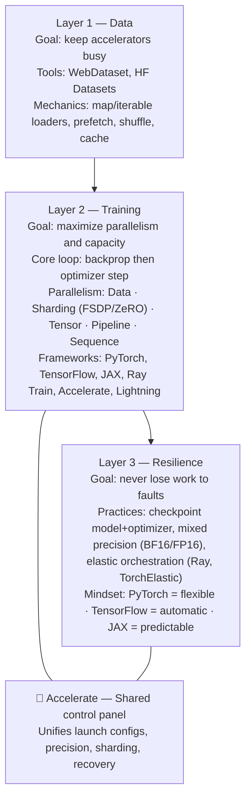

*We explore Part I in depth in [Datasets & Dataloaders — The Hidden Engine of AI, Part I](/blog/datasets-and-dataloaders/). The quick recap below sets the stage before we dive into training systems and resilience. Tools like **Hugging Face Accelerate** quietly connect these layers—offering a simple interface that turns local PyTorch code into scalable, fault-tolerant training across GPUs, TPUs, or cloud clusters.

---

## Part I (Quick Recap) — Feeding Intelligence

A well-built data pipeline:

- Chooses between map-style and iterable access patterns.
- Prefetches, shuffles, and augments to prevent GPU starvation.
- Streams web-scale corpora with tools like Hugging Face Datasets and WebDataset.
- Leans on tools like [`DataLoader`](https://pytorch.org/docs/stable/data.html) and [`tf.data`](https://www.tensorflow.org/guide/data) to keep accelerators busy.

> **Read the full walkthrough:** [Datasets & Dataloaders — The Hidden Engine of AI, Part I](/blog/datasets-and-dataloaders/)

If you haven’t yet, read Part I to see how the data stack keeps models fed; the rest of this post assumes that pipeline is humming.

## Part II — Training Frameworks: How Models Actually Learn

### 🔭 Visual Summary — The Hidden Engine at a Glance



So you’ve got clean data streaming in — now what?
The next job is to **teach** the model using those examples. This occurs within a *training loop*.

---

### 🌀 1. The Heart of Training: `model.train()`

At its core, the training loop follows a five-step process:

```python
for batch in dataloader:
    optimizer.zero_grad()          # 1️⃣ clear old updates
    outputs = model(batch)         # 2️⃣ make predictions
    loss = loss_fn(outputs, batch.labels)  # 3️⃣ measure how wrong
    loss.backward()                # 4️⃣ calculate which weights caused errors
    optimizer.step()               # 5️⃣ nudge them in the right direction
```

This repeats thousands of times until the model’s guesses improve.
The “backward” step uses **automatic differentiation**—a bit of calculus that calculates how each weight affects the error.

---

### ⚙️ 2. The Frameworks That Run the Show

#### 🧠 **PyTorch — Flexible and Friendly**

* Runs code line-by-line (called *eager execution*).
* Easy to debug and experiment with.
* Add-ons like **Hugging Face Accelerate** and **PyTorch Lightning** bridge research flexibility with production efficiency. Accelerate, in particular, lets you scale existing PyTorch code across GPUs or nodes without rewriting your training loop.

Best for researchers and anyone who wants to *tinker*.

#### 🔬 **TensorFlow: Built for Production**

* Turns code into **graphs** that can run fast on GPUs and TPUs.
* The `tf.data` system streams data efficiently.
* Works great for big, long-running jobs.

Many industry systems (like Google’s) rely on it.

#### ⚡ **JAX — The New Wave of Performance and Simplicity**

* Feels like **NumPy**, but compiles to blazingly fast accelerator code via `jit`.
* Built-in primitives like `vmap`, `pmap`, and `pjit` make vectorization and multi-device scaling almost effortless.
* The ecosystem—**Flax**, **Haiku**, **Optax**, **Orbax**—bridges the gap between rapid experimentation and production discipline.

Think of JAX as “NumPy that learned to use GPUs and TPUs, then grew up into a full ML research stack.”

While TensorFlow integrates scaling natively and JAX provides functional primitives (`pmap`, `pjit`), Accelerate fills a unique niche for PyTorch users who want that same seamless scaling experience—especially when paired with DeepSpeed or FSDP.

#### 🌎 **Ray Train — Scaling Made Simple**

Sometimes you want to use *many* GPUs or even *many* computers.
**Ray Train** helps coordinate them:

```python
from ray import train

def train_fn():
    model = Net()
    for epoch in range(5):
        train_one_epoch(model)

trainer = train.torch.Trainer(train_fn, scaling_config={"num_workers": 8})
trainer.fit()
```

It takes care of connecting machines, restarting failed workers, and sharing data — so you can focus on your model, not the cluster.

---

### 🧩 3. Splitting the Work — Parallel Training

#### **Data Parallelism**

Each GPU receives a different mini-batch of data. They then perform the following steps:

1. **Run** forward/backward passes
2. **Share** (average) their gradients
3. **Update** their own model copy

It’s like multiple students studying different pages of a textbook, then comparing notes.

---

#### **Distributed Data Parallel (DDP)**

This is PyTorch’s built-in version of teamwork:

```python
from torch.nn.parallel import DistributedDataParallel as DDP
model = DDP(model)
```

Each GPU talks to the others using a fast communication library (NCCL).
It’s efficient and reliable — the workhorse of today’s training clusters.

#### 🚀 Accelerate Shortcut for DDP and Beyond

Instead of manually configuring `torch.distributed` or environment variables, **Accelerate** wraps DDP, FSDP, and even DeepSpeed in a single launch command:

```bash
accelerate launch --multi_gpu train.py
```

Behind the scenes it wires up NCCL, gradient synchronization, logging hooks, and mixed precision flags. It’s the fast path from single-GPU scripts to multi-node runs—no boilerplate required.

---

### 💡 4. When Models Don’t Fit — Sharding the Model (FSDP & ZeRO)

Imagine trying to train a model so huge it can’t fit on a single GPU — like trying to pour an ocean into a bucket. Instead of one big bucket, we spread the water across many smaller ones.

#### 🧩 FSDP and ZeRO — “Sharing the Weight”

When models swell, most memory is consumed by the **weights** (what the model knows), the **gradients** (what it’s learning right now), and the **optimizer states** (how it plans to adjust). Fully Sharded Data Parallel (FSDP) slices all three across GPUs so no device carries the full backpack. DeepSpeed ZeRO pushes the same idea further, removing duplication in stages so each GPU stores only what it must—usually by plugging directly into the PyTorch ecosystem (often via Accelerate or Lightning) as an advanced scaling library.

Think of FSDP and ZeRO as friends carrying pieces of a piano instead of one person lifting the whole thing. Together they make mammoth models feasible even on commodity clusters or preemptible cloud instances.

**First-principles view of ZeRO**

- **Stage 1 – Optimizer shards:** Each GPU keeps only its fraction of the optimizer state (the “memory book” of momentum, variance, etc.), instead of full copies.
- **Stage 2 – Gradient shards:** Gradients are partitioned too, so GPUs exchange only the pieces they own when it’s time to apply updates.
- **Stage 3 – Parameter shards:** Model weights themselves are scattered across devices; DeepSpeed briefly gathers the necessary slices, performs the forward/backward math, and returns them to their owners.
- **Offload & Infinity:** If GPU memory is still tight, ZeRO can spill shards to CPU RAM or even NVMe, treating those as slow-but-available overflow storage.

The practical effect: you can stretch the memory footprint of one GPU across many devices, or even onto disk, without rewriting your entire training loop. Libraries such as **Hugging Face Accelerate** expose these ZeRO stages through simple config switches (e.g., `distributed_type: deepspeed` with `zero_stage: 3`), so you can adopt DeepSpeed’s sharding tricks with minimal code changes.

---

### 🏗️ 5. Splitting Inside the Model

- **Tensor Parallelism:** each GPU works on a slice of the same matrix multiplication—like four people tackling different rows of one problem.
- **Pipeline Parallelism:** GPUs form an assembly line; one handles the early layers, another finishes the later ones.
- **Sequence / Expert Parallelism:** tokens or mixture-of-experts branches are routed to whichever GPU specializes in them.

Together these tricks let hundreds or thousands of GPUs reason together—almost like a hive mind.

#### ⚙️ The Big Players and Their Tricks

| Player | Framework / System | What It Really Does |
| :--- | :--- | :--- |
| 🧬 **Meta (PyTorch team)** | **FSDP** | Splits big models so each GPU holds just a piece—used in LLaMA and many open models. |
| 🏗️ **Microsoft** | **DeepSpeed (ZeRO, 3D parallelism)** | Removes memory duplication and blends tensor + pipeline + data parallelism. Commonly layered on PyTorch via tools like Accelerate or Lightning; powered BLOOM (176B). |
| ⚡ **NVIDIA** | **Megatron-LM / NeMo** | Supplies ultra-fast fused kernels plus tensor/pipeline parallelism; muscle behind many GPT-style models. |
| 🔭 **Google** | **JAX + XLA + Pathways** | Compiles training into blueprints that run across TPUs/GPUs via `pjit`/`pmap`; Pathways orchestrates the fleet. |
| 🧠 **OpenAI** | **Megatron-DeepSpeed hybrid** | Mixes NVIDIA tensor parallelism with DeepSpeed ZeRO to push GPT-3/4-scale models. |
| 🌐 **Others (Anthropic, MosaicML, etc.)** | **Ray Train, Alpa, Composer** | Open, composable systems that let smaller teams run large-scale experiments. |

> If you remember one thing: **Meta** (with FSDP) and **Microsoft** (with DeepSpeed) made huge training feasible inside the PyTorch ecosystem, **NVIDIA** makes it fast, **Google** makes it elegant, and **OpenAI** pushes it to the edge of compute.

Frameworks like Megatron-LM and DeepSpeed combine these approaches to train trillion-parameter models.

---

### ⚡ 6. Bridging the Gap — Accelerate & Lightning Fabric

Between raw PyTorch and heavy orchestration tools sit friendly helpers:

#### 🚀 **Hugging Face Accelerate**

Simplifies multi-GPU and mixed-precision training:

```python
from accelerate import Accelerator

accelerator = Accelerator(mixed_precision="bf16")
model, optimizer, dataloader = accelerator.prepare(model, optimizer, dataloader)

for batch in dataloader:
    optimizer.zero_grad()
    outputs = model(batch)
    loss = loss_fn(outputs, batch.labels)
    accelerator.backward(loss)
    optimizer.step()
```

It handles device setup, distributed launch, and gradient scaling — so your code looks almost like single-GPU PyTorch.

Accelerate can also load DeepSpeed, FSDP, or TPU strategies by toggling a YAML entry. Specify `distributed_type: deepspeed` or `distributed_type: fsdp`, set mixed precision (e.g., `mixed_precision: bf16`), and the launcher wires everything together automatically.

#### 🔧 **Lightning Fabric**

Used under the hood by **PyTorch Lightning**, it gives structure to training without hiding control.
Think of it as: *“do-it-yourself Lightning.”*

Together, these tools help you go from a laptop script → to a research cluster → to a cloud deployment, smoothly.

---

### 🧩 7. Training Resilience — When Things Break (and They Will)

Scaling introduces failure. Power blips, flaky networks, or a preempted cloud instance can ruin a week-long run. Frameworks respond differently:

- **PyTorch** keeps recovery *flexible*. You can `torch.save` model and optimizer state, then relaunch with helpers like **DeepSpeed**, **FSDP**, or torchrun to roll back only a few steps.
- **TensorFlow** aims for *automatic* restarts. `tf.train.Checkpoint` and `tf.distribute.Strategy` can resume jobs mid-epoch with minimal fuss—part of why it remains popular for production pipelines.
- **JAX** strives for *predictable* checkpoints. Functional training loops paired with **Orbax** or Flax’s `train_state` make recovering TPU/GPU pods deterministic, even across replica meshes powered by `pjit` or `pmap`.

> PyTorch makes recovery easy, TensorFlow makes it automatic, and JAX makes it predictable.

This mindset sets the stage for Part III, where we focus on the orchestration layers that keep long-running training jobs alive.

---

## Part III — Surviving the Chaos: Making Training Resilient

When you run training on **hundreds of GPUs**, not everything goes smoothly:

* Machines crash.
* Network connections drop.
* Spot instances disappear.
* A power blip can halt a week of progress.

Resilience systems exist so you **don’t lose work** when that happens.

---

### 💾 1. Checkpointing — The Save Game Button

Just like saving progress in a video game, a *checkpoint* stores:

* Model weights
* Optimizer state
* Learning-rate schedule

If a node crashes, you reload the latest checkpoint and keep going.
Frameworks like **PyTorch Lightning**, **DeepSpeed**, and **Ray Train** automate this.

**Accelerate** integrates seamlessly with these checkpoints too. When a job restarts, it reloads model weights, optimizer state, and dataloader progress from the same folder—no custom recovery scripts needed.

---

### 🧮 2. Mixed Precision — Faster, Smaller, Smarter

Instead of using full 32-bit numbers everywhere, we can use 16-bit or even 8-bit precision for some calculations.
That means:

* Less memory
* Faster training
* Almost the same accuracy

Libraries like **NVIDIA AMP** or **Accelerate’s mixed precision** handle the safe casting automatically.

With Accelerate, switching precision is as easy as setting `Accelerator(mixed_precision="bf16")`, which wraps the proper autocast and grad-scaler logic for you.

---

### 🕸️ 3. Network-Aware Training

On large clusters, communication becomes the bottleneck.
Resilient systems:

* Compress gradients before sending.
* Schedule transfers so GPUs never idle.
* Detect and recover from slow or missing workers.

This keeps training stable even when the network isn’t perfect.

---

### 🔁 4. Elastic and Fault-Tolerant Training

Some orchestration layers (like **Ray**, **TorchElastic**, and **Kubernetes Jobs**) can **add or remove workers on the fly**.
If a GPU drops out, others continue; when a new one joins, it syncs up automatically.

It’s like a relay race where teammates can swap mid-run without dropping the baton.

---

### 🌤️ 5. Why It All Matters

Training at scale is as much about **engineering** as it is about **algorithms**.
Without robust systems:

* Data bottlenecks starve GPUs.
* Faults waste compute.
* Models never finish training.

When these layers—data, training, and resilience—work together, they form the **hidden engine of AI**: a pipeline that feeds, scales, and survives. Frameworks like **Accelerate** act as the control panel for that engine—letting developers flip between single-device prototypes and distributed-scale experiments with almost no code changes.

---

Would you like me to make a short **diagram** (in Markdown or SVG) that visually shows the three layers — *Data → Training → Resilience* — like a flow of energy through the AI system?
