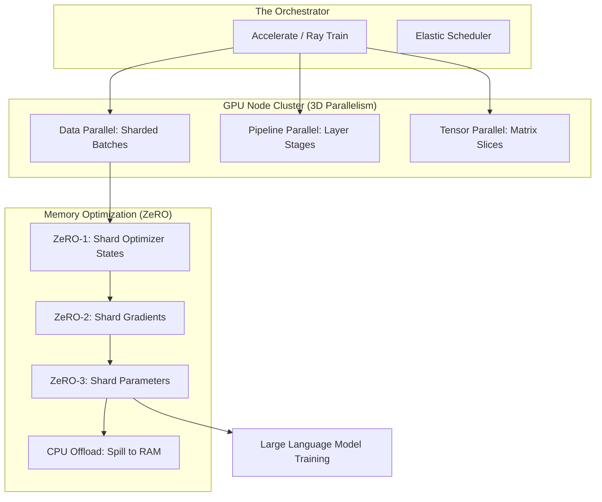

*By Gopi Krishna Tummala*

---

  
Infrastructure-First MLOps — Building the Engine of AI

  

    <a href="/posts/mlops/parquet-arrow-quest-for-analytic-speed" style="background: rgba(255,255,255,0.1); padding: 0.5rem 1rem; border-radius: 6px; text-decoration: none; color: white; opacity: 0.9;">Module 1: Data DNA</a>
    <a href="/posts/mlops/datasets-and-dataloaders" style="background: rgba(255,255,255,0.1); padding: 0.5rem 1rem; border-radius: 6px; text-decoration: none; color: white; opacity: 0.9;">Module 2: Dataloaders</a>
    <a href="/posts/mlops/hidden-engine-of-ai" style="background: rgba(255,255,255,0.25); padding: 0.5rem 1rem; border-radius: 6px; text-decoration: none; color: white; font-weight: 600; border: 2px solid rgba(255,255,255,0.5);">Module 3: Training</a>
    <a href="/posts/mlops/modern-post-training-peft-2026" style="background: rgba(255,255,255,0.1); padding: 0.5rem 1rem; border-radius: 6px; text-decoration: none; color: white; opacity: 0.9;">Module 4: Post-Training</a>
    <a href="/posts/mlops/vllm-trilogy-of-modern-llm-scaling" style="background: rgba(255,255,255,0.1); padding: 0.5rem 1rem; border-radius: 6px; text-decoration: none; color: white; opacity: 0.9;">Module 5: Serving</a>
    <a href="/posts/mlops/custom-kernel-craze" style="background: rgba(255,255,255,0.1); padding: 0.5rem 1rem; border-radius: 6px; text-decoration: none; color: white; opacity: 0.9;">Module 6: Kernels</a>
    <a href="/posts/mlops/beyond-inference-agentic-mlops-mcp" style="background: rgba(255,255,255,0.1); padding: 0.5rem 1rem; border-radius: 6px; text-decoration: none; color: white; opacity: 0.9;">Module 7: Agentic AI</a>
  

  
📖 You are reading <strong>Module 3: Training Frameworks</strong> — The Engine of AI

---

### Act 0: Training Frameworks in Plain English

Imagine you are trying to paint a mural that is 100 feet tall. A single artist (One GPU) is too small and too slow. You need a team of 100 artists.

**The Training Framework** is the manager who coordinates the team:
1.  **Data Parallelism:** Every artist paints a different section of the mural. At the end of the hour, they yell out what colors they used so everyone stays in sync.
2.  **Model Parallelism:** The mural is so complex that one person can't even hold the brush. One artist paints the outlines, another fills in the base colors, and a third does the fine details (The Assembly Line).
3.  **Resilience:** If one artist falls off their ladder, the manager has a backup artist ready to step in with a "Snapshot" (Checkpoint) of exactly where the previous artist left off.

If your manager is bad, the artists spend all day talking and no time painting. **MLOps is the art of minimizing "Talk Time" and maximizing "Paint Time."**

---

### Act I: The 3 Pillars of Parallelism

When a model (like Llama-3 405B) is too big for one GPU, we use **3D Parallelism**.

#### 1. Data Parallelism (The Crowd)
The same model is copied onto 1,000 GPUs. Each GPU gets 1/1000th of the data. 
*   **The Sync:** After each step, GPUs use **All-Reduce** to average their learning (Gradients).

#### 2. Pipeline Parallelism (The Line)
The model is split into "Stages" (Layers 1-10 on GPU 1, Layers 11-20 on GPU 2).
*   **The Problem:** GPU 2 has to wait for GPU 1 to finish. This is "Bubble Time."

#### 3. Tensor Parallelism (The Slice)
A single giant matrix multiplication is split *across* GPUs.
*   **The Hardware:** Requires extremely fast connections like **NVLink**, because the GPUs must talk thousands of times per second.

---

#### Act I.V: Mature Architecture — The DeepSpeed ZeRO Stack

The "Gold Standard" for modern LLM training is **ZeRO (Zero Redundancy Optimizer)**. It removes the memory waste of redundant model copies.

**The Training Pipeline (Mature Architecture):**

##### 1. ZeRO-3: The Memory Saver
Traditionally, every GPU in a Data Parallel group stores a full copy of the model weights. For a 175B model, that's 350GB per GPU! 
*   **ZeRO-3 Way:** It shards the *parameters* themselves. A GPU only loads the weights for the *specific layer* it is currently calculating, then throws them away to make room for the next one.

##### 2. Trade-offs & Reasoning
*   **PyTorch DDP vs. FSDP:** DDP is simple but keeps a full model copy. FSDP (Fully Sharded Data Parallel) is the open-source answer to ZeRO-3. *Trade-off:* FSDP allows training 10x larger models but increases network traffic by 50% because weights are constantly being moved.
*   **Mixed Precision (BF16):** We use **Brain Floating Point (BF16)** instead of FP32. *Trade-off:* It uses half the memory and is 2-3x faster on H100s, with almost zero loss in accuracy.
*   **Citations:** *ZeRO: Memory Optimizations toward Training Trillion Parameter Models (Microsoft 2020)* and *PyTorch FSDP: Experiences on Scaling Fully Sharded Data Parallel (Meta 2023)*.

---

### Act II: System Design & Interview Scenarios

#### Scenario 1: The "Straggler" Node
*   **Question:** "You have 128 GPUs training a model. One GPU is 10% slower than the others. How does this affect your total training time?"
*   **Answer:** In synchronous training (DDP), the entire cluster waits for the slowest GPU at every step. Total time is determined by the **slowest node**. This is the "Straggler Problem." **The Fix:** Use **Elastic Training** (TorchElastic) to drop the slow node or use **Asynchronous Gradients**.

#### Scenario 2: Network Bottlenecks (NCCL)
*   **Question:** "Your GPU utilization is 90% when training on 1 machine, but drops to 40% when you use 8 machines. Why?"
*   **Answer:** This is a **Communication Bottleneck**. The time spent sharing gradients over the network (All-Reduce) is longer than the time spent calculating them. **The Fix:** Upgrade to **InfiniBand** or use **Gradient Accumulation** (calculate 8 steps before sharing once).

#### Scenario 3: Checkpoint Bloat
*   **Question:** "Saving a checkpoint for your 175B model takes 20 minutes, during which the GPUs sit idle. How do you fix this?"
*   **Answer:** Discuss **Async Checkpointing** or **Distributed Checkpointing**. Instead of sending everything to a single disk, each GPU writes its own shard to local NVMe storage or S3 in parallel while the training continues in the background.

---

### Graduate Assignment: The Arithmetic of Training

**Task:**
You are training a 7B parameter model using the Adam optimizer.
1.  **Memory Math:** Each parameter is 2 bytes (BF16). The Adam optimizer stores 2 states (Momentum and Variance) at 4 bytes each. The Gradients are 2 bytes. Calculate the **Total VRAM** needed per GPU for a single copy of the model.
2.  **The Sharding:** If you have 8 GPUs and use **ZeRO-2** (Sharding Optimizer + Gradients), how much VRAM is saved per GPU?
3.  **The Throughput:** If your network is 100Gbps and your model copy is 14GB, how many milliseconds does one "All-Reduce" sync take?

---

**Further Reading:**
*   *HuggingFace Accelerate: The easy button for sharding.*
*   *DeepSpeed Documentation: Understanding ZeRO stages.*
*   *Megatron-LM: Scaling to trillions of parameters.*

---

**Previous:** [Module 2 — Dataloaders](/posts/mlops/datasets-and-dataloaders)

**Next:** [Module 4 — Post-Training (PEFT & Alignment)](/posts/mlops/modern-post-training-peft-2026)
