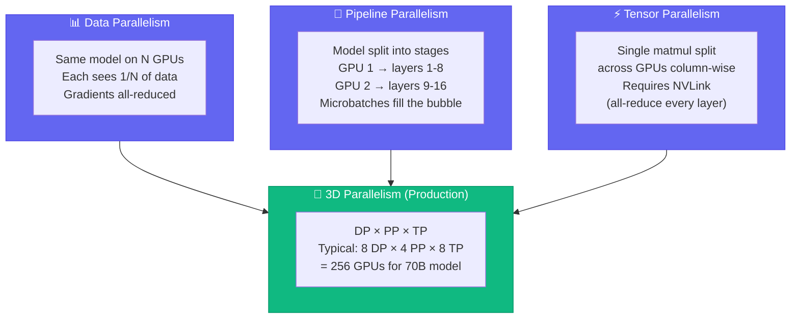
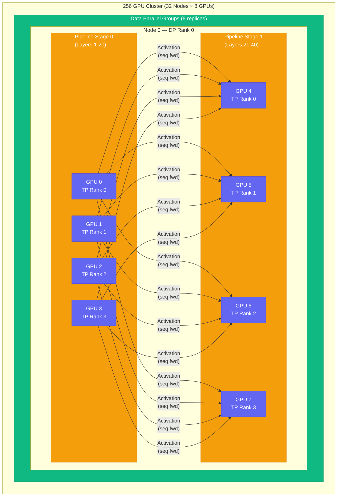
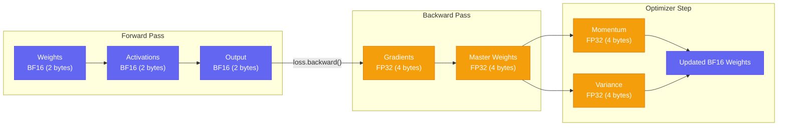
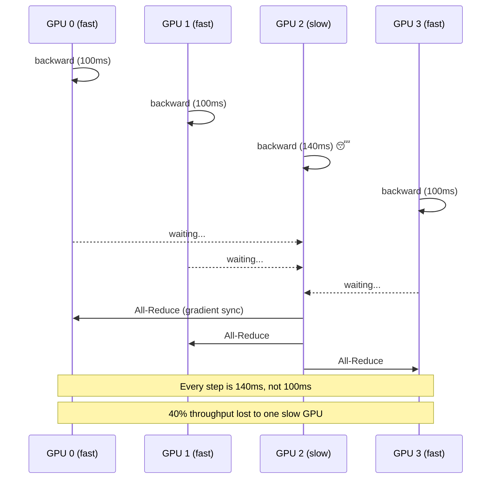

*By Gopi Krishna Tummala*

---

<div class="series-nav" style="background: linear-gradient(135deg, #059669 0%, #0d9488 100%); color: white; padding: 1.5rem; border-radius: 12px; margin-bottom: 2rem; box-shadow: 0 4px 6px rgba(0,0,0,0.1);">
  <div style="font-size: 0.875rem; opacity: 0.9; margin-bottom: 0.5rem; text-transform: uppercase; letter-spacing: 0.05em;">Infrastructure-First MLOps — Building the Engine of AI</div>
  <div style="display: flex; gap: 0.75rem; flex-wrap: wrap; align-items: center;">
    <a href="/posts/mlops/parquet-arrow-quest-for-analytic-speed" style="background: rgba(255,255,255,0.1); padding: 0.5rem 1rem; border-radius: 6px; text-decoration: none; color: white; opacity: 0.9;">Module 1: Data DNA</a>
    <a href="/posts/mlops/datasets-and-dataloaders" style="background: rgba(255,255,255,0.1); padding: 0.5rem 1rem; border-radius: 6px; text-decoration: none; color: white; opacity: 0.9;">Module 2: Dataloaders</a>
    <a href="/posts/mlops/hidden-engine-of-ai" style="background: rgba(255,255,255,0.25); padding: 0.5rem 1rem; border-radius: 6px; text-decoration: none; color: white; font-weight: 600; border: 2px solid rgba(255,255,255,0.5);">Module 3: Training</a>
    <a href="/posts/mlops/modern-post-training-peft-2026" style="background: rgba(255,255,255,0.1); padding: 0.5rem 1rem; border-radius: 6px; text-decoration: none; color: white; opacity: 0.9;">Module 4: Post-Training</a>
    <a href="/posts/mlops/vllm-trilogy-of-modern-llm-scaling" style="background: rgba(255,255,255,0.1); padding: 0.5rem 1rem; border-radius: 6px; text-decoration: none; color: white; opacity: 0.9;">Module 5: Serving</a>
    <a href="/posts/mlops/custom-kernel-craze" style="background: rgba(255,255,255,0.1); padding: 0.5rem 1rem; border-radius: 6px; text-decoration: none; color: white; opacity: 0.9;">Module 6: Kernels</a>
    <a href="/posts/mlops/beyond-inference-agentic-mlops-mcp" style="background: rgba(255,255,255,0.1); padding: 0.5rem 1rem; border-radius: 6px; text-decoration: none; color: white; opacity: 0.9;">Module 7: Agentic AI</a>
  </div>
  <div style="margin-top: 0.75rem; font-size: 0.875rem; opacity: 0.8;">📖 You are reading <strong>Module 3: Training Frameworks</strong> — The Engine of AI</div>
</div>

---

## TL;DR

- **The memory formula**: Total VRAM = params × 2 (BF16) + params × 12 (Adam states + gradients in FP32) = **16 bytes/param**. A 7B model needs ~112 GB before activations.
- **DDP** replicates the full model on every GPU — works until the model doesn't fit on one GPU.
- **FSDP / ZeRO-3** shards parameters, gradients, and optimizer states across GPUs — lets you train models 8–16× larger than a single GPU can hold.
- **3D parallelism** (DP + PP + TP) is the only way to train 70B+ models at production throughput on real hardware.
- **Gradient checkpointing** trades 33% compute for ~8× activation memory reduction — almost always worth it.
- The straggler problem: in synchronous training, your cluster is as fast as its slowest GPU. Know how to detect and mitigate it.

---

### Act 0: The Memory Problem

Here is the problem stated plainly. You want to train Llama-3 70B. A single H100 has 80GB of VRAM. The model alone, in BF16, is 140GB. You cannot fit it. Not even close.

Even for a "small" 7B model, the math is brutal:

| Component | Bytes per Param | 7B Model Total |
|---|---|---|
| Parameters (BF16) | 2 | 14 GB |
| Gradients (FP32) | 4 | 28 GB |
| Adam m (momentum, FP32) | 4 | 28 GB |
| Adam v (variance, FP32) | 4 | 28 GB |
| **Total (mixed precision)** | **14** | **~98 GB** |

Plus activations. A batch of 4 sequences of 2048 tokens through a 7B transformer adds another ~20–40 GB depending on whether you checkpoint activations.

A single H100 has 80GB. You need at least 2 to train a 7B model naively. This is why distributed training exists.

---

### Act I: The Parallelism Ladder

There are three orthogonal axes along which you can distribute training. You compose them based on your hardware topology.


```mermaid
graph TB
    subgraph DP["📊 Data Parallelism"]
        direction LR
        DP_desc["Same model on N GPUs\nEach sees 1/N of data\nGradients all-reduced"]
    end

    subgraph PP["🔗 Pipeline Parallelism"]
        direction LR
        PP_desc["Model split into stages\nGPU 1 → layers 1-8\nGPU 2 → layers 9-16\nMicrobatches fill the bubble"]
    end

    subgraph TP["⚡ Tensor Parallelism"]
        direction LR
        TP_desc["Single matmul split\nacross GPUs column-wise\nRequires NVLink\n(all-reduce every layer)"]
    end

    subgraph Combo["🎯 3D Parallelism (Production)"]
        direction LR
        Combo_desc["DP × PP × TP\nTypical: 8 DP × 4 PP × 8 TP\n= 256 GPUs for 70B model"]
    end

    DP --> Combo
    PP --> Combo
    TP --> Combo

    classDef axis fill:#6366f1,color:#fff,stroke:#4f46e5
    classDef combo fill:#10b981,color:#fff,stroke:#059669
    class DP,PP,TP axis
    class Combo combo
```

*Figure 1: The three parallelism axes and how they compose. Each axis solves a different bottleneck.*

#### Data Parallelism (DDP)

Every GPU holds a full model copy. Each GPU processes a different mini-batch. After the backward pass, all GPUs participate in an **All-Reduce** to average their gradients.

```
All-Reduce cost ≈ 2 × (N-1)/N × model_size_bytes / bandwidth
```

For a 7B model (14GB BF16) across 8 GPUs on 200 Gbps InfiniBand:
```
≈ 2 × 7/8 × 14GB / (25 GB/s) ≈ 9.8 seconds per step
```

That's unacceptably slow. In practice, DDP uses **ring All-Reduce** which overlaps gradient communication with the backward pass (gradient bucketing). PyTorch's DDP does this automatically.

**When DDP breaks**: model > GPU VRAM. That's when you need ZeRO/FSDP.

#### Pipeline Parallelism

Split the model's layers across GPUs. GPU 0 runs layers 1–8, GPU 1 runs layers 9–16, etc. Data flows sequentially through stages.

The **pipeline bubble** is the fundamental inefficiency: GPU 0 is idle while GPUs 1–3 are computing the forward pass. The bubble ratio = `(num_stages - 1) / num_microbatches`. With 4 stages and 8 microbatches, bubble = 3/8 = 37.5% wasted compute.

**GPipe** (Google) and **PipeDream** (Microsoft) reduce the bubble via microbatch scheduling. Megatron-LM uses interleaved scheduling that halves the bubble at the cost of 2× more all-reduce operations.

#### Tensor Parallelism

Split individual matrix multiplications across GPUs. For a weight matrix $W \in \mathbb{R}^{d \times 4d}$ (FFN layer), column-parallel splits it column-wise across $N$ GPUs. Each GPU computes $XW_i$ where $W_i$ is its column shard.

This requires an **All-Reduce after every layer** — which means you need NVLink-speed interconnect (600 GB/s bidirectional on H100 NVLink 4.0) for this to not dominate compute time. Tensor parallelism over InfiniBand is usually not worth it.

---

### Act II: ZeRO and FSDP — The Memory Shavers

ZeRO (Zero Redundancy Optimizer) is the key insight: **DDP stores 4 redundant copies of optimizer state**. With N GPUs, every GPU stores the same momentum/variance tensors. That's N-1 copies wasted.


```mermaid
graph LR
    subgraph Base["DDP (Baseline)\n16 bytes/param per GPU"]
        B_P["Params\n2 bytes"]
        B_G["Gradients\n4 bytes"]
        B_M["Adam m\n4 bytes"]
        B_V["Adam v\n4 bytes"]
        B_A["Activations\n~2 bytes"]
    end

    subgraph Z1["ZeRO-1\nOptimizer Sharded"]
        Z1_P["Params\n2 bytes"]
        Z1_G["Gradients\n4 bytes"]
        Z1_M["Adam m/v\n8/N bytes"]
    end

    subgraph Z2["ZeRO-2\nOptimizer + Grad Sharded"]
        Z2_P["Params\n2 bytes"]
        Z2_G["Gradients\n4/N bytes"]
        Z2_M["Adam m/v\n8/N bytes"]
    end

    subgraph Z3["ZeRO-3 / FSDP\nFully Sharded"]
        Z3_P["Params\n2/N bytes"]
        Z3_G["Grads\n4/N bytes"]
        Z3_M["Adam m/v\n8/N bytes"]
    end

    Base -->|"shard opt states"| Z1
    Z1 -->|"shard gradients"| Z2
    Z2 -->|"shard parameters"| Z3

    classDef heavy fill:#ef4444,color:#fff,stroke:#dc2626
    classDef medium fill:#f59e0b,color:#fff,stroke:#d97706
    classDef light fill:#10b981,color:#fff,stroke:#059669
    class Base heavy
    class Z1,Z2 medium
    class Z3 light
```

*Figure 2: ZeRO stages reduce memory per GPU linearly with GPU count. ZeRO-3 / FSDP achieve close to `total_memory / N` per GPU.*

#### Concrete Memory Math for ZeRO-3 on 7B, 8 GPUs

Without sharding (DDP): **~112 GB per GPU** → doesn't fit on H100.

With ZeRO-3 (8 GPUs):
- Parameters: 14GB / 8 = **1.75 GB per GPU**
- Gradients: 28GB / 8 = **3.5 GB per GPU**
- Adam states: 56GB / 8 = **7 GB per GPU**
- Activations (batch 4, seq 2048): **~4 GB per GPU**
- **Total: ~16.25 GB per GPU** — fits comfortably on 40GB A100

The cost: ZeRO-3 does 3 all-gathers and 1 reduce-scatter per layer during forward, and the same during backward. Communication volume is ~1.5× DDP. On NVLink, this is hidden by overlap; on InfiniBand at scale, it matters.

#### PyTorch FSDP vs. DeepSpeed ZeRO

Both implement ZeRO-3. Choose based on your stack:

| | PyTorch FSDP | DeepSpeed ZeRO-3 |
|---|---|---|
| Integration | Native PyTorch | Separate library |
| Config | Python API | JSON config |
| CPU offload | Limited | Excellent |
| Overlap comm | Yes (v2 API) | Yes |
| Activation checkpointing | Via `use_orig_params` | Via `activation_checkpointing` |
| Best for | Standard PyTorch training | Max memory savings (CPU offload) |

FSDP is the right default in 2025 unless you need CPU offload for extreme memory savings (e.g., fine-tuning a 70B model on 8 × 40GB A100s).

---

### Act III: 3D Parallelism in Practice

For 70B+ models, you compose all three parallelism axes. Here's what a 70B training run at Adobe-scale looks like:


```mermaid
graph TD
    subgraph Cluster["256 GPU Cluster (32 Nodes × 8 GPUs)"]
        direction TB

        subgraph DPGroup["Data Parallel Groups (8 replicas)"]
            direction LR
            subgraph Node0["Node 0 — DP Rank 0"]
                subgraph PP0["Pipeline Stage 0\n(Layers 1-20)"]
                    TP0A["GPU 0\nTP Rank 0"]
                    TP0B["GPU 1\nTP Rank 1"]
                    TP0C["GPU 2\nTP Rank 2"]
                    TP0D["GPU 3\nTP Rank 3"]
                end
                subgraph PP1["Pipeline Stage 1\n(Layers 21-40)"]
                    TP1A["GPU 4\nTP Rank 0"]
                    TP1B["GPU 5\nTP Rank 1"]
                    TP1C["GPU 6\nTP Rank 2"]
                    TP1D["GPU 7\nTP Rank 3"]
                end
            end
        end
    end

    TP0A & TP0B & TP0C & TP0D -->|"Activation\n(seq fwd)"| TP1A & TP1B & TP1C & TP1D

    classDef tp fill:#6366f1,color:#fff,stroke:#4f46e5
    classDef pp fill:#f59e0b,color:#fff,stroke:#d97706
    classDef dp fill:#10b981,color:#fff,stroke:#059669
    class TP0A,TP0B,TP0C,TP0D,TP1A,TP1B,TP1C,TP1D tp
    class PP0,PP1 pp
    class DPGroup dp
```

*Figure 3: A single data-parallel replica of a 70B model using 32 GPUs with 4-way pipeline parallelism and 8-way tensor parallelism. 8 such replicas = 256 GPUs total.*

**The communication hierarchy:**
- TP (within a node): NVLink, ~600 GB/s, every layer boundary
- PP (within a DP group): InfiniBand, ~200 GB/s, every microbatch
- DP (across replicas): InfiniBand, ~200 GB/s, every step

---

### Act IV: Gradient Checkpointing and Mixed Precision

These are not optional on large models. They're load-bearing.

#### Gradient Checkpointing (Activation Recomputation)

During the forward pass, PyTorch stores all intermediate activations to compute gradients in the backward pass. For a 70B model at batch size 4, sequence length 2048, this is **~30–50 GB of activations** — often more than the model weights themselves.

Gradient checkpointing discards activations during the forward pass and recomputes them during the backward pass when needed. The cost: one extra forward pass per checkpoint segment (≈33% compute overhead). The benefit: ~8× reduction in activation memory.

```python
from torch.utils.checkpoint import checkpoint_sequential

# Wrap model layers to enable checkpointing
output = checkpoint_sequential(model.layers, segments=8, input=x)
```

In Hugging Face Transformers:
```python
model.gradient_checkpointing_enable()
```

This is almost always the right call for models >7B. The 33% compute cost is worth the memory savings that allow larger batch sizes.

#### Mixed Precision Training (BF16)


```mermaid
graph LR
    subgraph Forward["Forward Pass"]
        FP16_W["Weights\nBF16 (2 bytes)"]
        FP16_A["Activations\nBF16 (2 bytes)"]
        FP16_Out["Output\nBF16 (2 bytes)"]
    end

    subgraph Backward["Backward Pass"]
        FP32_G["Gradients\nFP32 (4 bytes)"]
        FP32_M["Master Weights\nFP32 (4 bytes)"]
    end

    subgraph Update["Optimizer Step"]
        FP32_Mom["Momentum\nFP32 (4 bytes)"]
        FP32_Var["Variance\nFP32 (4 bytes)"]
        UpdateW["Updated BF16 Weights"]
    end

    FP16_W --> FP16_A --> FP16_Out
    FP16_Out -->|"loss.backward()"| FP32_G
    FP32_G --> FP32_M
    FP32_M --> FP32_Mom & FP32_Var
    FP32_Mom & FP32_Var --> UpdateW

    classDef bf16 fill:#6366f1,color:#fff,stroke:#4f46e5
    classDef fp32 fill:#f59e0b,color:#fff,stroke:#d97706
    class FP16_W,FP16_A,FP16_Out,UpdateW bf16
    class FP32_G,FP32_M,FP32_Mom,FP32_Var fp32
```

*Figure 4: Mixed precision training. The forward pass is in BF16 for speed; optimizer state is kept in FP32 for numerical stability. This is why Adam optimizer states cost 12 bytes/param, not 4.*

**BF16 vs FP16**: BF16 has the same exponent range as FP32 (8 bits), so it never overflows on typical LLM training without loss scaling. FP16 (5-bit exponent) frequently overflows and requires a dynamic loss scaler (`torch.cuda.amp.GradScaler`). On H100s, use BF16 unconditionally.

---

### Act V: Fault Tolerance and Checkpointing

At scale, hardware failures are not exceptions — they're the steady state. A 1,000-GPU run with 0.01% daily failure rate per GPU means you expect a failure every 10 hours.

#### Synchronous Checkpointing (Naive)

```python
if step % 1000 == 0:
    torch.save(model.state_dict(), f"checkpoint_{step}.pt")
```

Problem: Saving a 70B model (140GB BF16) to a single file takes 10–20 minutes. The cluster idles. Over a 2-week run with checkpointing every hour, this wastes **~5 GPU-hours per GPU** in idle time.

#### Async Distributed Checkpointing

The modern approach: each rank saves its own shard in parallel, without blocking training.

```python
from torch.distributed.checkpoint import save, FileSystemWriter

# All ranks write their shard simultaneously
save(
    {"model": model, "optimizer": optimizer},
    storage_writer=FileSystemWriter("/checkpoint/step_{step}"),
)
```

Each GPU writes ~`total_size / world_size` of data in parallel. A 140GB checkpoint across 64 GPUs becomes 64 concurrent 2.2GB writes. On NVMe-backed shared storage, that's ~5 seconds instead of 20 minutes.

#### Straggler Detection

In synchronous All-Reduce, one slow GPU stalls the whole cluster:


```mermaid
sequenceDiagram
    participant G0 as GPU 0 (fast)
    participant G1 as GPU 1 (fast)
    participant G2 as GPU 2 (slow)
    participant G3 as GPU 3 (fast)

    G0->>G0: backward (100ms)
    G1->>G1: backward (100ms)
    G2->>G2: backward (140ms) 😴
    G3->>G3: backward (100ms)

    G0-->>G2: waiting...
    G1-->>G2: waiting...
    G3-->>G2: waiting...

    G2->>G0: All-Reduce (gradient sync)
    G2->>G1: All-Reduce
    G2->>G3: All-Reduce

    Note over G0,G3: Every step is 140ms, not 100ms
    Note over G0,G3: 40% throughput lost to one slow GPU
```

*Figure 5: The straggler problem. In synchronous training, 1 slow GPU penalizes the entire cluster every step.*

**Detection**: Log per-rank step times. A straggler shows consistent 20%+ higher times. Check:
- `nvidia-smi` for thermal throttling (GPU hits 83°C → slows to protect itself)
- PCIe bandwidth degradation (flaky cable)
- Uneven data shard sizes (some ranks process longer sequences)

**Mitigation options**:
1. **TorchElastic**: Elastic training that can remove a failed rank and rebalance shards
2. **Gradient accumulation**: Decouple All-Reduce from every step — sync every K steps
3. **Asynchronous SGD**: Let fast GPUs run ahead, accept stale gradients (Hogwild-style). Used at Google scale but rarely in LLM training due to convergence sensitivity.

---

### Act VI: Interview Scenarios

#### "Design the training infrastructure for a 70B model on 256 H100s."

**Parallelism strategy**:
- Each H100 has 80GB VRAM
- 70B model ≈ 140GB BF16 parameters
- With ZeRO-3 across 256 GPUs: 140GB / 256 ≈ 0.55 GB parameters per GPU (trivial)
- In practice: use 4-way TP (within a node, uses NVLink) × 8-way PP (across nodes) × 8-way DP = 256 GPUs
- TP=4 keeps all-reduces on NVLink. PP=8 keeps pipeline bubble low with 16 microbatches (bubble = 7/16 = 44%, acceptable). DP=8 gives 8 independent data streams.

**Communication schedule**:
- TP all-reduce: every transformer layer (~200 ns on NVLink vs 100 ms of compute — effectively free)
- PP activations: every microbatch boundary, ~20 MB per layer activation — overlapped with compute
- DP gradient sync: every step, ~140GB/8 (ZeRO-3) = 17.5GB per replica — 700ms on 200 Gbps IB, overlapped with optimizer step

**Checkpointing**: async distributed checkpoint every 1000 steps, each rank writes to S3 in parallel. Keep 3 checkpoints. Total overhead: ~30 seconds every ~4 hours of training.

---

#### "Your 128-GPU job shows 85% MFU at 16 GPUs but 40% MFU at 128. What's wrong?"

MFU = Model FLOP Utilization = actual throughput / theoretical peak FLOP throughput.

A drop from 85% → 40% when scaling from 16 → 128 GPUs is a **communication bottleneck** problem, not a compute problem.

Diagnose:
1. Is the bubble ratio increasing? If you're adding pipeline stages (PP) as you scale, the bubble term `(stages-1)/microbatches` grows. Fix: increase microbatch count.
2. Is DP All-Reduce dominating? Time the gradient sync separately. If it's more than 15% of step time, you need better interconnect or gradient compression.
3. Are you adding cross-node TP? TP across nodes over InfiniBand is slow. Keep TP within a node (NVLink).
4. Load imbalance? With variable-length sequences (LLM pretraining), some microbatches are much longer. Use sequence bucketing or padding to equalize compute per microbatch.

---

#### "Explain gradient accumulation and when to use it."

Gradient accumulation runs K mini-batches through the model, summing (not averaging) gradients, before doing one optimizer step and one All-Reduce. Effective batch size = `per_gpu_batch × K × world_size`.

```python
optimizer.zero_grad()
for i, (x, y) in enumerate(loader):
    loss = model(x, y) / accumulation_steps   # scale loss
    loss.backward()                           # accumulates .grad
    if (i + 1) % accumulation_steps == 0:
        optimizer.step()
        optimizer.zero_grad()
```

**Use cases**:
1. **Memory**: can't fit large batch in VRAM → accumulate smaller batches
2. **Communication**: reduces All-Reduce frequency by K× — critical when network is the bottleneck
3. **Training stability**: LLM pretraining often benefits from large effective batch sizes (1M+ tokens)

**Gotcha**: Gradient accumulation interacts with BatchNorm (running stats update every micro-batch) and dropout (different masks per micro-batch). For LLM training, these rarely matter, but be aware.

---

### Key Takeaways

1. **Memorize the memory formula**: 16 bytes/param for BF16 + Adam mixed precision. A 7B model needs ~112GB across all states — always more than one GPU.
2. **DDP for fits-on-one-GPU; FSDP/ZeRO-3 for anything larger.** FSDP is the native PyTorch path; DeepSpeed ZeRO-3 is better if you need aggressive CPU offload.
3. **3D parallelism = TP within node (NVLink) + PP across nodes + DP across replicas.** TP over InfiniBand is usually a mistake.
4. **Gradient checkpointing is almost always worth 33% compute for 8× activation memory savings.** Enable it by default on any model >7B.
5. **BF16 > FP16** on modern hardware. BF16 never overflows, no loss scaler needed.
6. **Async distributed checkpointing** is the production pattern. Synchronous saves kill throughput.
7. **Stragglers dominate in synchronous training.** Monitor per-rank step times; detect thermal throttling and PCIe issues early.

---

**Previous:** [Module 2 — Dataloaders](/posts/mlops/datasets-and-dataloaders)

**Next:** [Module 4 — Post-Training (PEFT & Alignment)](/posts/mlops/modern-post-training-peft-2026)
