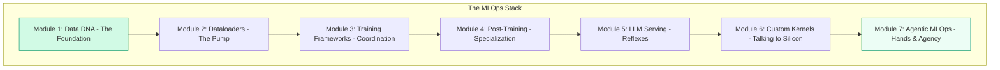

*By Gopi Krishna Tummala*

---

  
Infrastructure-First MLOps — Building the Engine of AI

  

    <a href="/posts/mlops/parquet-arrow-quest-for-analytic-speed" style="background: rgba(255,255,255,0.1); padding: 0.5rem 1rem; border-radius: 6px; text-decoration: none; color: white; opacity: 0.9;">Module 1: Data DNA</a>
    <a href="/posts/mlops/datasets-and-dataloaders" style="background: rgba(255,255,255,0.1); padding: 0.5rem 1rem; border-radius: 6px; text-decoration: none; color: white; opacity: 0.9;">Module 2: Dataloaders</a>
    <a href="/posts/mlops/hidden-engine-of-ai" style="background: rgba(255,255,255,0.1); padding: 0.5rem 1rem; border-radius: 6px; text-decoration: none; color: white; opacity: 0.9;">Module 3: Training</a>
    <a href="/posts/mlops/modern-post-training-peft-2026" style="background: rgba(255,255,255,0.1); padding: 0.5rem 1rem; border-radius: 6px; text-decoration: none; color: white; opacity: 0.9;">Module 4: Post-Training</a>
    <a href="/posts/mlops/vllm-trilogy-of-modern-llm-scaling" style="background: rgba(255,255,255,0.1); padding: 0.5rem 1rem; border-radius: 6px; text-decoration: none; color: white; opacity: 0.9;">Module 5: Serving</a>
    <a href="/posts/mlops/custom-kernel-craze" style="background: rgba(255,255,255,0.1); padding: 0.5rem 1rem; border-radius: 6px; text-decoration: none; color: white; opacity: 0.9;">Module 6: Kernels</a>
    <a href="/posts/mlops/beyond-inference-agentic-mlops-mcp" style="background: rgba(255,255,255,0.1); padding: 0.5rem 1rem; border-radius: 6px; text-decoration: none; color: white; opacity: 0.9;">Module 7: Agentic AI</a>
  

  
📖 You are reading <strong>The Roadmap</strong> — A Blueprint for AI Infrastructure

---

### Act 0: MLOps in Plain English

Most people think building an AI company is about having the smartest "Brain" (The Model). But if you have a genius brain inside a body that can't move, has no blood flow, and can't eat, that genius is useless.

**MLOps Infrastructure** is the body. 
*   **Data DNA:** The food and how it's digested.
*   **Dataloaders:** The veins and arteries moving nutrients to the muscles.
*   **Training Frameworks:** The nervous system coordinating thousands of muscles (GPUs) at once.
*   **Post-Training:** Sculpting the raw brain into a specialized professional.
*   **Serving:** The reflexes and speech that allow the brain to interact with the world.
*   **Kernels:** Hand-grinding custom tools for impossible tasks.
*   **Agentic AI:** Giving the body hands and autonomy to act in the world.

If your infrastructure is weak, you spend $40,000 on a GPU just to watch it sit idle. **This roadmap is how you build a body strong enough to support a super-intelligence.**

---

## The Infrastructure-First Philosophy

Every production AI system is built on seven layers. This roadmap starts at the foundation and builds upward. Why? Because **data format choices made in Module 1 determine whether your Module 5 serving system can scale**.

---

## The 7-Module Learning Path

### 📦 Module 1: The DNA of Data (Storage & Pipelines)
**The Core Idea:** Store in Parquet, Compute in Arrow.
Learn how modern systems like HuggingFace Datasets handle petabytes of data by understanding the fundamental trade-off between storage efficiency (Parquet) and compute speed (Arrow).

📖 **[Deep Dive: Parquet, Arrow, and Speed](/posts/mlops/parquet-arrow-quest-for-analytic-speed)**

---

### 🔄 Module 2: Datasets & Dataloaders (The Intake Valve)
**The Core Idea:** The GPU should never wait for the CPU.
Understand the "Zero-Copy" pipeline that moves data from S3 to GPU registers. Master prefetching, pinned memory, and hardware-accelerated decoding.

📖 **[Deep Dive: The Pump of AI](/posts/mlops/datasets-and-dataloaders)**

---

### ⚡ Module 3: Training Frameworks & Resilience (The Scale-Out)
**The Core Idea:** 3D Parallelism (Data, Pipeline, Tensor).
Learn how to train models that don't fit on a single GPU. Master **ZeRO (Zero Redundancy Optimizer)** and build clusters that survive node failures without losing progress.

📖 **[Deep Dive: The Engine of AI](/posts/mlops/hidden-engine-of-ai)**

---

### 🎨 Module 4: Post-Training (PEFT & Alignment)
**The Core Idea:** Sculpting Intelligence.
Pre-training is just the start. Learn how to use **LoRA, DoRA, and DPO** to turn a raw model into a specialized, safe, and controllable assistant without spending millions on compute.

📖 **[Deep Dive: Sculpting Intelligence](/posts/mlops/modern-post-training-peft-2026)**

---

### 🚀 Module 5: The Serving Infrastructure (vLLM & Inference)
**The Core Idea:** Memory is the bottleneck, not compute.
Deep dive into **PagedAttention** and **Continuous Batching**. Learn how to fit 10x more users on the same GPU by managing the KV cache like an Operating System.

📖 **[Deep Dive: vLLM and the Trilogy of Speed](/posts/mlops/vllm-trilogy-of-modern-llm-scaling)**

---

### ⚙️ Module 6: Custom Kernels & GPU Optimization (The Deep Tech)
**The Core Idea:** Hand-grinding your own tools.
When standard libraries fail, we write **Triton** or **CUDA**. Learn why **FlashAttention** was a breakthrough in I/O management and how to bypass the "Memory Wall."

📖 **[Deep Dive: Handcrafting GPU Speed](/posts/mlops/custom-kernel-craze)**

---

### 🤖 Module 7: Agentic MLOps (Beyond Inference)
**The Core Idea:** Giving the AI Hands.
The shift from stateless request-response to stateful, autonomous agents. Master the **Model Context Protocol (MCP)** and secure execution sandboxes (Firecracker/gVisor).

📖 **[Deep Dive: Beyond Stateless Inference](/posts/mlops/beyond-inference-agentic-mlops-mcp)**

---

## The Interview Philosophy: "Why" Over "What"

Senior ML infrastructure interviews don't test whether you know what PagedAttention is. They test whether you understand *why* it was necessary.

Throughout this roadmap, focus on the **Trade-offs**:
1. **Data:** Why Parquet? → Trade CPU cycles for Disk I/O.
2. **Training:** Why FSDP? → Trade Network Bandwidth for VRAM capacity.
3. **Serving:** Why Quantization? → Trade Accuracy for Throughput.
4. **Kernels:** Why Fusion? → Trade logic complexity for Memory Bandwidth.

---

## Ready to Start?

Begin with **[Module 1: The DNA of Data](/posts/mlops/parquet-arrow-quest-for-analytic-speed)**. Master the foundation, and the rest of the stack becomes intuitive.

**The journey from \"I can train a model\" to \"I can build the infrastructure that powers AI at scale\" starts here.**

---

*Have questions? Reach out on [Twitter/X](https://twitter.com/gopikrishnat) or [LinkedIn](https://linkedin.com/in/gopikrishnat).*
