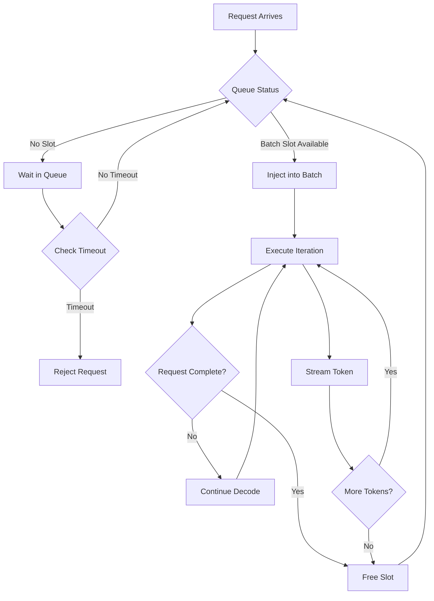
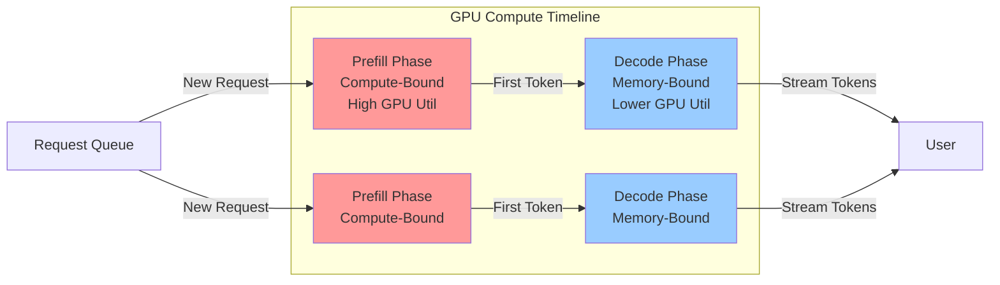
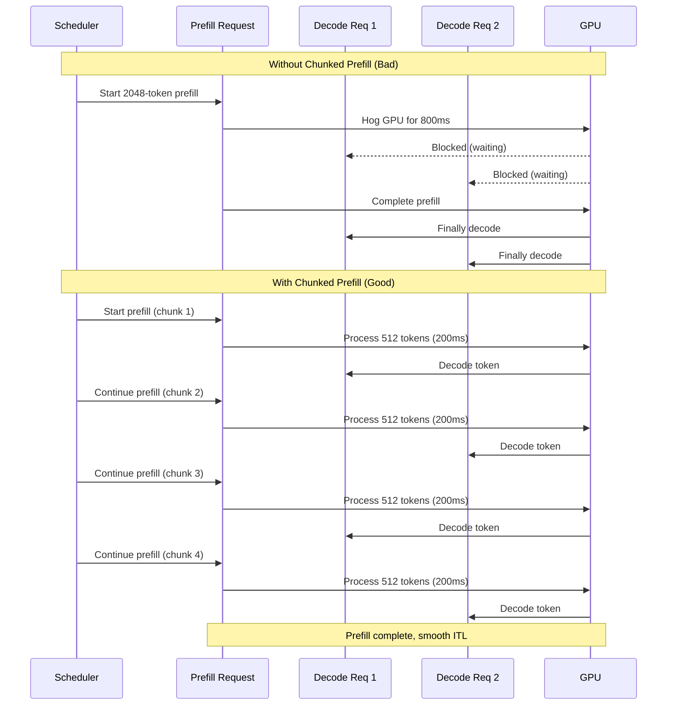
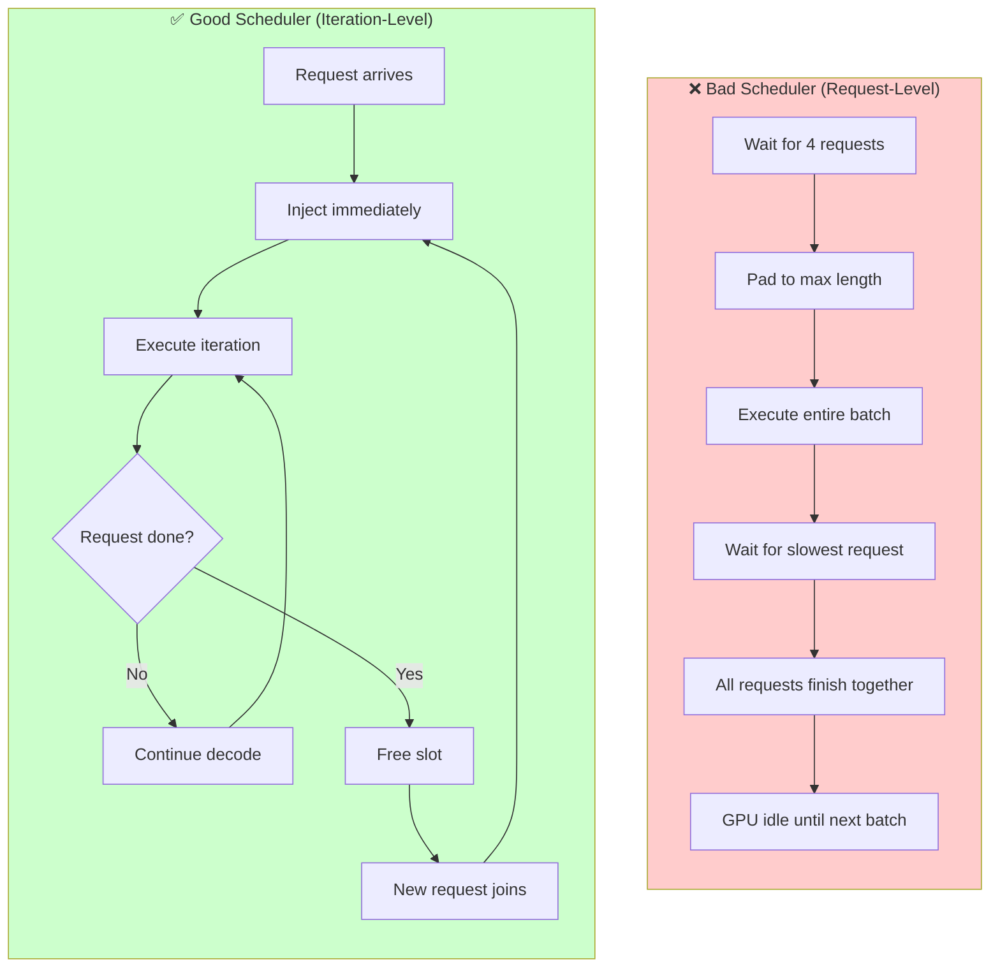
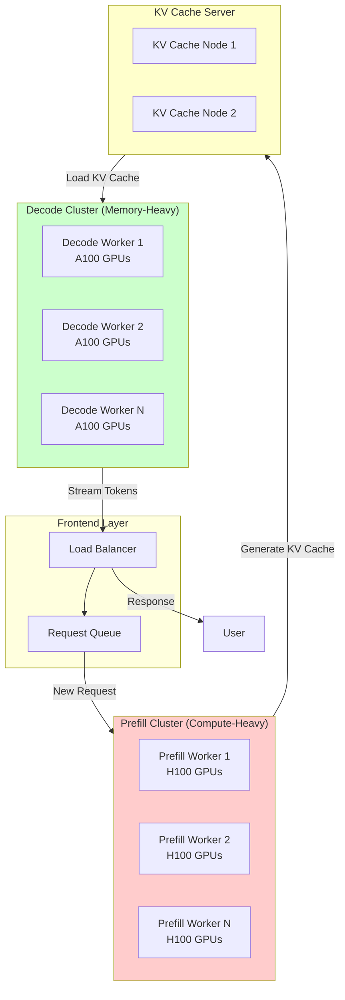

*By Gopi Krishna Tummala*

---

## What "Inference" Really Means at Scale

Serving large language models (LLMs) and diffusion models in production is *not* just about loading weights and calling `model.forward()`. Inference becomes a distributed systems problem that blends GPU architecture, memory management, batching theory, latency SLOs, and cost engineering.

At toy scale:

```
input → model → output
```

At production scale:

```
request → queue → tokenize → batch → schedule → execute → stream → post‑process → bill → log → retry
```

Inference is the *runtime execution* of a trained model, while **model serving** is the system that:

* Accepts requests
* Schedules compute
* Enforces latency/cost constraints
* Streams partial outputs
* Scales elastically
* Survives failures

This article walks through the **full lifecycle of inference and serving**—from a single GPU prototype to planet‑scale production—covering both **LLMs** and **diffusion models**.

---

## Key Differences: LLMs vs Diffusion Models

| Aspect           | LLMs                            | Diffusion Models            |
| ---------------- | ------------------------------- | --------------------------- |
| Compute pattern  | Autoregressive (token-by-token) | Iterative denoising (steps) |
| Latency shape    | Long tail, streaming friendly   | Fixed but heavy per request |
| Memory pressure  | KV cache dominates              | Activations dominate        |
| Batching         | Continuous / dynamic            | Static / step-aligned       |
| User expectation | Real-time text                  | Seconds-level image/video   |

Understanding these differences is critical—**the serving stack diverges quickly**.

---

When we talk about "inference optimization," we're usually balancing three competing metrics: **Time to First Token (TTFT)**, **Inter-Token Latency (ITL)** (for LLMs), and **Total Throughput**. 

Most blog posts will tell you "use vLLM" or "quantize your weights" and call it a day. But if you're building production systems that serve millions of requests, you need to understand *where* the bottlenecks actually live, not just what tools to throw at them.

To understand this, we have to trace the path of a request through the system. And here's the thing: **Large Language Models (LLMs)** and **Diffusion Models** have drastically different serving realities. Treating them the same way is like using a race car engine in a cargo ship—technically both use combustion, but the constraints couldn't be more different.

## Phase 1: The Gateway and The Queue

**The Bottleneck:** Scheduling & Serialization

The journey begins at the model serving endpoint (e.g., vLLM, TGI, TRT-LLM). But before we even get to the model, there are three bottlenecks that will kill your latency if you ignore them.

### 1. Request: The Gateway

**"The cost of entry."**

Every inference journey begins at the network edge. Whether via gRPC or HTTP, the request payload defines the initial constraints. For LLMs, this is lightweight text JSON; for Diffusion models, it's often heavy Base64-encoded images. This phase isn't just about receiving data—it's about serialization overhead, protocol decoding, and unmarshalling payloads without blocking the event loop. If your ingress is slow, your GPU sits idle.

#### Protocol Overhead

The request arrives via gRPC or HTTP. While the payload for an LLM is small (text), diffusion requests often carry base64 images or masks. I've seen teams spend weeks optimizing CUDA kernels only to realize they're spending 200ms just deserializing JSON image payloads.

```
Request Flow:
┌─────────┐     HTTP/gRPC      ┌──────────────┐     Binary/Protobuf    ┌──────────┐
│ Client  │ ──────────────────> │ Load Balancer│ ─────────────────────> │  Model   │
│         │   (JSON/Base64)     │              │   (Optimized Format)   │  Server  │
└─────────┘                      └──────────────┘                        └──────────┘
```

**The Fix:** For diffusion, avoid JSON/HTTP for image payloads. Use binary formats (Protobuf/FlatBuffers) or pre-signed S3 URLs to keep the control plane light. I've seen teams achieve a 3x reduction in request deserialization time by moving from base64 JSON to Arrow IPC for image payloads.

### 2. Queue: The Waiting Room

**"Managing the flood."**

When the system is under load, we can't shove every request into the GPU immediately. The queue acts as the pressure valve. This is where we make critical decisions about priority, backpressure, and timeouts. Do we use a simple FIFO queue, or a priority queue that favors VIP users? A poorly managed queue leads to increased latency for everyone, while a smart queue protects the system from collapse during traffic spikes.

### 3. Tokenize: The CPU Bottleneck

**"Turning text into math."**

Before a model can understand "Hello," it must become `[15496]`. This step seems trivial but is a frequent silent killer in Python-based stacks. Because tokenization is CPU-bound, the Python Global Interpreter Lock (GIL) can strangle throughput, starving the GPU even if it has capacity. Efficient systems often offload this to Rust-based services or separate processes to ensure the GPU never waits on the CPU.

This is CPU-bound, and here's where Python's Global Interpreter Lock (GIL) becomes your enemy. If your tokenizer runs in Python while your model runs in C++/Rust, the GIL can strangle high-concurrency throughput. I've profiled systems where tokenization was the bottleneck at 80% CPU utilization, even though the GPU was sitting at 30%.

**The Fix:** Use Rust-based tokenizers (e.g., Hugging Face `tokenizers`) released from the GIL, or offload tokenization to a separate microservice layer to decouple CPU load from the GPU hosts. The microservice approach also gives you better horizontal scaling when you're serving multiple model variants.

### 4. Batch: The "Ragged Tensor" Problem

**"Tetris with data."**

In training, we love uniform rectangles of data. In inference, real-world user prompts are chaotic: one user asks a 5-token question, another pastes a 4,000-token document.

* **The Problem:** Naive "Static Batching" forces us to pad the short 5-token request with 3,995 "empty" tokens just to match the long one, wasting massive amounts of compute and VRAM on nothing.
* **The Goal:** We need to construct batches that minimize padding waste, grouping requests dynamically to maximize the useful work done per clock cycle.

**Static Batching (Old School):** Wait for N requests to arrive, pad them to the longest sequence, and send them to the GPU. This wastes huge amounts of VRAM and compute on padding tokens. I've seen teams padding 512-token sequences to 2048 just to batch them together—that's 75% wasted compute.

```
Static Batching (Inefficient):
Request 1: [tok1, tok2, tok3, ..., tok512, <PAD>, <PAD>, ..., <PAD>]  ← 1536 wasted tokens
Request 2: [tok1, tok2, ..., tok1024, <PAD>, <PAD>, ..., <PAD>]      ← 1024 wasted tokens
Request 3: [tok1, tok2, ..., tok2048]                                 ← reference length
```

### 5. Schedule: The Orchestrator

**"The heartbeat of the system."**

Batching groups the data; scheduling decides *when* it runs. Modern LLM serving moves beyond request-level scheduling to **Iteration-Level Scheduling** (Continuous Batching). Instead of waiting for a whole batch to finish, the scheduler injects new requests into the batch the moment a previous request finishes a token generation. It manages the "Prefill" (processing the prompt) vs. "Decode" (generating tokens) trade-off to ensure Time-to-First-Token (TTFT) remains low without destroying overall throughput.

**Continuous Batching (State of the Art):** We schedule at the *iteration* level, not the request level. New requests are injected into the batch immediately as soon as a slot frees up. This is what vLLM and TGI do, and it's the difference between 2x and 10x throughput.

```
Continuous Batching (Efficient):
Iteration 1: [Req1: tok1-512, Req2: tok1-1024, Req3: tok1-2048]
Iteration 2: [Req1: tok513, Req2: tok1025, Req3: tok2049, Req4: tok1-256]  ← Req4 joins!
Iteration 3: [Req2: tok1026, Req3: tok2050, Req4: tok257-512, Req5: tok1-128]  ← Req5 joins!
```

#### Iteration-Level Scheduler Flow



#### Continuous Batching: Dynamic Request Flow

```mermaid
flowchart TB
    subgraph Iter1["Iteration 1: Batch Size = 3"]
        R1A[Req1: Prefill<br/>512 tokens]
        R2A[Req2: Prefill<br/>1024 tokens]
        R3A[Req3: Prefill<br/>2048 tokens]
    end
    
    subgraph Iter2["Iteration 2: Batch Size = 4"]
        R1B[Req1: Decode<br/>tok 513]
        R2B[Req2: Decode<br/>tok 1025]
        R3B[Req3: Decode<br/>tok 2049]
        R4A[Req4: Prefill<br/>256 tokens<br/>JOINS!]
    end
    
    subgraph Iter3["Iteration 3: Batch Size = 5"]
        R2C[Req2: Decode<br/>tok 1026]
        R3C[Req3: Decode<br/>tok 2050]
        R4B[Req4: Decode<br/>tok 257]
        R5A[Req5: Prefill<br/>128 tokens<br/>JOINS!]
        R1C[Req1: Decode<br/>tok 514]
    end
    
    subgraph Iter4["Iteration 4: Batch Size = 3"]
        R3D[Req3: Decode<br/>tok 2051]
        R4C[Req4: Decode<br/>tok 258]
        R5B[Req5: Decode<br/>tok 129]
    end
    
    Iter1 -->|Requests progress| Iter2
    Iter2 -->|New request joins| Iter3
    Iter3 -->|More requests join| Iter4
    
    style R4A fill:#90EE90
    style R5A fill:#90EE90
    style R1A fill:#FFB6C1
    style R2A fill:#FFB6C1
    style R3A fill:#FFB6C1
    style R1B fill:#87CEEB
    style R2B fill:#87CEEB
    style R3B fill:#87CEEB
    style R4B fill:#87CEEB
    style R5B fill:#87CEEB
```



#### Prefill vs Decode Trade-off



#### Chunked Prefill: Before vs After



#### Bad Scheduler vs Good Scheduler



> **Advanced Technique: Chunked Prefill**
> 
> Even with continuous batching, a massive "prefill" (processing a long prompt) can hog the GPU, causing a stutter for all other requests waiting for a decode step. **Chunked Prefill** breaks the prompt processing into smaller pieces, interleaving them with decode steps. This sacrifices a tiny bit of TTFT for significantly smoother ITL (Inter-Token Latency).
> 
> In production, I've seen chunked prefill reduce P99 latency spikes from 2.5s to 400ms when handling mixed workloads with both short and long prompts.

---

## Phase 2: The LLM Workload (Memory Bandwidth Bound)

**The Bottleneck:** Loading weights and KV Cache management.

### 6. Execute: The Main Event

**"Where memory meets compute."**

This is where the tensor actually lives on the GPU. Execution isn't just matrix multiplication; it's a war against memory bandwidth.

* **Model Prep:** Before execution, the GPU must have the model weights loaded and, crucially for LLMs, the **KV Cache** allocated. We use techniques like **PagedAttention** to allocate memory in non-contiguous blocks (like OS virtual memory) so we don't run out of VRAM due to fragmentation.
* **Maintenance:** We must maintain strict latency budgets. The execution engine effectively "swaps" the massive model weights through the compute units for every single token generated. If we are memory-bound (LLMs), we focus on bandwidth; if compute-bound (Diffusion), we focus on maximizing FLOPS.

LLM inference is autoregressive. You generate token t₁, append it to the input, generate t₂, and so on. This creates two distinct phases with different hardware profiles, and understanding this split is critical for optimization.

### 1. Prefill Phase (Compute Bound)

The model processes the entire input prompt in parallel to generate the initial KV (Key-Value) states and the first token. This is where you're doing traditional matrix multiplication (GEMM), and you're saturating the Tensor Cores.

```
Prefill Architecture:
┌─────────────────────────────────────────────────────────┐
│  Input Prompt: [tok₁, tok₂, ..., tokₙ]                  │
│                    ↓                                     │
│  Parallel Processing (All tokens at once)               │
│                    ↓                                     │
│  Generate KV Cache + First Output Token                 │
└─────────────────────────────────────────────────────────┘
```

**Hardware Reality:** This looks like a traditional matrix multiplication (GEMM). You are saturating the Tensor Cores. Your GPU utilization will show 95%+, and you're actually compute-bound here.

**Metric Impact:** This phase determines your TTFT. For a 2048-token prompt on a 70B model, prefill might take 200-400ms depending on your hardware.

### 2. Decode Phase (Memory Bandwidth Bound)

Now the fun begins. You're generating one token at a time. For every single token generated, you must load the *entire* model weights from HBM (High Bandwidth Memory) into the compute units.

**The Math:** If you have a 70B parameter model (approx 140GB in FP16), and you generate 1 token, you must move 140GB of data across the memory bus. If your A100 has 2TB/s bandwidth, your theoretical max speed is:

```
Throughput = Memory Bandwidth / Model Size
           = 2 TB/s / 140 GB
           = 14.3 tokens/sec (single stream)
```

That's *terrible*. But here's the thing: **this is why we batch**. If we load the weights once, but apply them to 64 requests simultaneously, we amortize that memory movement cost. Now you're getting:

```
Throughput = 14.3 tokens/sec × 64 requests = ~915 tokens/sec
```

This is the fundamental trade-off in LLM serving: batch size vs. latency. More batching = higher throughput but higher latency per request.

### The Elephant in the Room: KV Cache

To avoid re-computing the attention for all previous tokens at every step, we cache the Key and Value matrices. This is brilliant for compute efficiency, but it creates a memory nightmare.

**The Problem:** This cache grows linearly with sequence length. For a 70B model with 128k context:

```
KV Cache Size = 2 (K + V) × num_layers × hidden_size × seq_len × num_heads × 2 bytes
              ≈ 2 × 80 × 8192 × 128,000 × 8 × 2
              ≈ 335 GB (just for KV cache!)
```

A long context (128k tokens) can easily consume more VRAM than the model weights themselves. I've seen teams hit OOM errors not because of model size, but because they allocated KV cache naively and hit fragmentation.

**The Solution (PagedAttention):** Inspired by OS virtual memory paging. We allocate memory for the KV cache in non-contiguous blocks. This eliminates fragmentation and allows us to squeeze more requests into the same GPU memory, directly increasing max batch size and throughput.

```
Naive KV Cache Allocation:
┌─────────────────────────────────────────┐
│ [Req1: 128k] [Req2: 64k] [Req3: 32k]  │  ← Fragmented, can't fit Req4
└─────────────────────────────────────────┘

PagedAttention Allocation:
┌─────────────────────────────────────────┐
│ [Page1] [Page2] [Page3] [Page4] [Page5]│  ← Non-contiguous, flexible
│  Req1 uses Pages 1,2,3                  │
│  Req2 uses Pages 4,5                    │
│  Req3 can use freed pages from Req1    │
└─────────────────────────────────────────┘
```

vLLM's PagedAttention implementation can fit 2-3x more concurrent requests than naive allocation. This is the difference between serving 8 vs. 24 requests on the same GPU.

#### GPU Memory Timeline: KV Cache Growth vs Eviction

```mermaid
gantt
    title GPU Memory: KV Cache Allocation Over Time
    dateFormat X
    axisFormat %s
    
    section Request 1 (128k context)
    Allocate KV Cache (128k)    :0, 100
    Generate Tokens             :100, 500
    Request Complete            :500, 500
    Evict KV Cache              :500, 550
    
    section Request 2 (64k context)
    Allocate KV Cache (64k)     :200, 250
    Generate Tokens             :250, 600
    Request Complete            :600, 600
    Evict KV Cache              :600, 650
    
    section Request 3 (32k context)
    Allocate KV Cache (32k)     :300, 320
    Generate Tokens             :320, 700
    Request Complete            :700, 700
    Evict KV Cache              :700, 750
    
    section Request 4 (256k context)
    Allocate KV Cache (256k)    :550, 600
    Generate Tokens             :600, 1000
    Request Complete            :1000, 1000
    Evict KV Cache              :1000, 1050
```



#### Disaggregated Prefill/Decode Architecture



### Beyond Standard Decoding: Breaking the Memory Bandwidth Wall

To break the memory bandwidth wall, we try to generate multiple tokens per model-load. This is where things get interesting.

**Speculative Decoding:** A small "draft" model (e.g., 1B parameters) guesses the next 5 tokens cheaply. The big model verifies them in parallel. If the draft is good, you get 5 tokens for the cost of 1 memory load. The catch? If the draft is wrong, you've wasted compute. In practice, speculative decoding gives 2-3x speedup for "easy" text (code, structured output) but barely helps for creative writing.

**Medusa Heads:** Instead of a separate draft model, we add extra heads to the main model to predict multiple tokens simultaneously. It's simpler to deploy than speculative decoding (no separate model to manage), but requires retraining or fine-tuning. I've seen teams get 1.5-2x speedup with Medusa on code generation tasks.

Both techniques are production-ready today, but they add complexity. Start with continuous batching and PagedAttention. Only add speculative decoding/Medusa if you've maxed out your batch size and still need more throughput.

---

## Phase 3: The Diffusion Workload (Compute Bound)

**The Bottleneck:** Massive arithmetic operations and VRAM capacity.

Diffusion models (like Stable Diffusion or FLUX) function completely differently from LLMs. They are not autoregressive in the same way. They use a **Denoising Scheduler** over a fixed number of steps (e.g., 20-50 steps), and each step is a full forward pass through the model.

### Architecture Differences

1. **No KV Cache:** We don't need to store history. The state is contained entirely in the noisy latent representation being refined. This is both a blessing (no memory fragmentation from KV cache) and a curse (each step is expensive).

2. **UNet / DiT Intensity:** Each "step" involves running the full UNet or Transformer backbone. This is a massive compute load compared to a single LLM token decode. For Stable Diffusion XL, a single denoising step might take 200-400ms on an A100, compared to 20-30ms for a single LLM token.

```
Diffusion Inference Flow:
┌─────────────────────────────────────────────────────────┐
│  Step 1: [Noisy Latent] → UNet → [Less Noisy Latent]  │  ← Full forward pass
│  Step 2: [Less Noisy] → UNet → [Even Less Noisy]       │  ← Full forward pass
│  ...                                                    │
│  Step 50: [Nearly Clean] → UNet → [Final Image]        │  ← Full forward pass
└─────────────────────────────────────────────────────────┘
```

The key insight: **You can't batch across steps** (each request is at a different step), but you *can* batch across requests at the same step. This is why diffusion serving is often step-based batching rather than continuous batching.

### The LoRA Serving Challenge

While we save on KV cache, production image generation relies heavily on adapters (LoRAs) or ControlNets to style images. This is where things get messy.

**The Problem:** If Request A needs "AnimeStyle" LoRA and Request B needs "PhotoReal" LoRA, swapping these adapters in and out of GPU memory kills latency. Traditional serving would either:
- Load one LoRA, serve all requests for that style, then swap (terrible for mixed workloads)
- Keep all LoRAs in memory (impossible—you'd need 100GB+ just for LoRAs)

**The Solution (S-LoRA / Punica):**

**Punica** uses a specific CUDA kernel (Segmented Gather Matrix-Vector multiplication) that allows a single batch to contain requests using *different* LoRA adapters simultaneously. It's brilliant—you load all active LoRAs into memory once, then use gather operations to apply the right LoRA to each request in the batch.

**S-LoRA** introduces "Unified Paging" for LoRA weights, storing them in a non-contiguous memory pool similar to PagedAttention. This lets you keep hundreds of LoRAs "warm" in memory without fragmentation.

I've seen S-LoRA increase throughput by 4-5x for mixed LoRA workloads compared to naive swapping. The trade-off is increased memory usage, but for production systems serving multiple styles, it's worth it.

---

## Phase 4: Inside the GPU (Kernel Execution)

Once the data is on the device, the execution engine (like CUDA graphs) takes over. This is where the rubber meets the road, and where most teams stop optimizing. Don't.

### FlashAttention-3 (Hopper Specific)

Standard attention is O(n²) in memory complexity. FlashAttention (v2) used tiling to keep attention calculations inside the GPU's fast SRAM, reducing memory traffic by 5-10x.

**FlashAttention-3** is designed specifically for Hopper (H100) GPUs. It exploits asynchronous direct memory access (TMA) and low-precision Tensor Core instructions (WGMMA) to overlap memory movement with computation. The result? 2-3x speedup for long-context LLMs (32k+ tokens) compared to FlashAttention-2.

If you're serving long-context models (128k+) and you have H100s, FlashAttention-3 is non-negotiable. I've seen it push GPU utilization from 60% to 85% on long-context workloads.

### Quantization (The Cost Cutter)

**Weight Quantization (AWQ/GPTQ):** Storing weights in INT4 or INT8. Reduces VRAM usage, allowing larger batch sizes. The quality loss is usually <1% for INT4 on most tasks. For production, I recommend AWQ over GPTQ—it's faster to quantize and often gives better quality.

**FP8 Activations (H100s):** The H100 "Transformer Engine" natively supports FP8. This effectively doubles the compute throughput and halves the memory traffic for activation tensors compared to FP16/BF16 on A100s. If you're buying new hardware and serving large models, H100s with FP8 are a no-brainer.

**My Take:** Don't quantize unless you have to. Start with FP16/BF16, optimize your batching and KV cache management, and only quantize if you're still hitting memory limits. Quantization adds complexity (different kernels, calibration, quality monitoring) that you might not need.

---

## Phase 5: Post-Execution Pipeline

### 7. Stream: The Real-Time Feedback

**"Delivering the illusion of speed."**

For users, speed isn't just total time—it's **Time to First Token (TTFT)** and **Inter-Token Latency (ITL)**. Streaming allows us to send partial results back to the user immediately. This unblocks the client UI and makes the system "feel" faster, even if the total generation time is unchanged. It requires keeping a persistent, open connection (Server-Sent Events or gRPC streams) that pushes data as it exits the GPU.

### 8. Post-Process: The Cleanup

**"Safety and formatting."**

The model outputs raw token IDs and probabilities. Post-processing converts these back into human-readable text (detokenization). But it's also the safety layer: running "stop sequence" checks to prevent the model from rambling, applying regex filters, or checking for toxic content. This step must be blazing fast to avoid adding latency to the final token delivery.

### 9. Bill: Counting the Cost

**"The business logic."**

Inference is expensive. We don't bill by the second; we bill by the token. Accurate accounting requires tracking input tokens (prompt) and output tokens (completion) separately, as they often have different costs. This system needs to be asynchronous—you don't want to hold up the user's response while you write to a database or check a credit balance.

### 10. Log: The Black Box Recorder

**"Observability is survival."**

When a request fails or a user complains about a hallucination, logs are your only source of truth. We capture inputs, outputs, latency metrics (P95, P99), and GPU utilization. However, logging high-volume text/image data can be expensive and a privacy risk, so this block often involves sampling or redaction strategies before data hits persistent storage.

### 11. Retry: Handling the Chaos

**"Resilience at scale."**

GPUs crash. Networks timeout. Preemptible instances get killed. A robust inference system doesn't just fail; it recovers. The Retry block handles transient failures (like a temporary network blip) transparently. It implements exponential backoff to avoid hammering a struggling server, ensuring that a single dropped packet doesn't result in a failed user experience.

---

## Summary: The Optimization Matrix

| Feature | LLM Serving | Diffusion Serving |
| --- | --- | --- |
| **Primary Bottleneck** | Memory Bandwidth (Decode phase) | Compute / Arithmetic Intensity |
| **Batching Strategy** | Continuous / Chunked Prefill | Static or Dynamic (Step-based) |
| **State Management** | KV Cache (PagedAttention is critical) | Latents (No KV cache needed) |
| **Scaling Metric** | Tokens per second | Images per second |
| **VRAM Killer** | Context Length (KV Cache) | Resolution & Model Weights + LoRAs |
| **Adv. Optimization** | Speculative Decoding / Medusa | S-LoRA / Punica Kernels |

## Final Thoughts for Systems Engineers

If you're building an inference platform today, your focus should be on **VRAM efficiency**. Not model accuracy, not fancy architectures—memory efficiency. That's what determines your cost per request.

For **LLMs**, the game is "how many concurrent requests can I fit into memory before I get an OOM?" because that determines your batch size, which determines your throughput. I've seen teams spend months optimizing CUDA kernels only to realize they could get 2x throughput just by switching from naive KV cache allocation to PagedAttention.

For **Diffusion**, the game is efficient scheduling of LoRA loading and optimizing the U-Net/Transformer CUDA kernels to keep the massive compute units fed. But don't optimize kernels until you've fixed your batching strategy. Step-based batching with S-LoRA will give you more bang for your buck than hand-tuned CUDA kernels.

### Profiling: The Truth Serum

Don't just look at "GPU Utilization" percentages. An LLM waiting on memory bandwidth might show 100% utilization while the compute cores are actually idle, starving for data. Here's what I actually profile in production:

1. **Memory Bandwidth Utilization:** Use `nvidia-smi dmon` or `nsys` to see if you're memory-bound or compute-bound. If memory bandwidth is >80% and compute is <50%, you're memory-bound (common for LLM decode).

2. **KV Cache Fragmentation:** In vLLM, check the `block_table` metrics. High fragmentation means you're wasting VRAM.

3. **Batch Size Distribution:** Log your actual batch sizes over time. If you're frequently batching 1-2 requests, you're leaving throughput on the table.

4. **Prefill vs. Decode Time:** Separate these in your metrics. A slow prefill kills TTFT, but slow decode kills throughput.

### H100 vs A100: The Real Decision

**A100:** Still the workhorse. Great for models <30B or lower traffic. If you're serving Llama 2 13B or smaller, A100s are fine. The 2TB/s bandwidth is enough for reasonable batch sizes.

**H100:** Essential if you need **FP8** (which A100 lacks) or if you're serving massive models (70B+ / 405B) where the 3.35 TB/s bandwidth allows for acceptable single-user latency. The math is simple: if your model is >50B and you care about latency, you need H100s.

**My Hot Take:** Most teams don't need H100s. They need better batching and KV cache management. I've seen teams get 3x throughput improvement just by fixing their scheduler, without touching hardware.

### The Optimization Hierarchy

If you're optimizing inference, do it in this order:

1. **Fix your batching** (continuous batching > static batching)
2. **Fix your KV cache** (PagedAttention > naive allocation)
3. **Fix your scheduler** (chunked prefill for mixed workloads)
4. **Then** optimize kernels (FlashAttention, quantization)
5. **Finally** consider hardware (H100s, specialized accelerators)

Most teams do this backwards. Don't be most teams.

---

### What's Next?

This post covered the full stack from request to GPU cycles. If you want to go deeper:

* **Part 2: KV Cache Deep Dive** — PagedAttention internals, fragmentation strategies, and multi-GPU KV cache sharding
* **Profiling Production Inference** — Python snippets for profiling vLLM, TGI, and custom serving stacks
* **Cost Analysis: H100 vs. A100** — Real numbers for Llama 3 70B serving at scale

Let me know what you want to see next, or reach out if you're building production inference systems and want to compare notes.

---

## References & Further Reading

### 1. Request & Queue (The Gateway)

* **Hugging Face Text Generation Inference (TGI) Architecture** — The TGI architecture docs explain the "Router" pattern perfectly—how a Rust-based web server handles the queue and distributes requests to Python/C++ model shards. [TGI Architecture Documentation](https://huggingface.co/docs/text-generation-inference/architecture)

* **Ray Serve Architecture** (Anyscale) — Explains how to handle "Head Nodes" and "Worker Nodes" for scaling inference requests across a cluster. [Ray Serve Architecture Guide](https://docs.ray.io/en/latest/serve/architecture.html)

### 2. Tokenize (The CPU Bottleneck)

* **Stanford CS324: Tokenization** — A solid academic intro to BPE (Byte Pair Encoding) and why tokenization is non-trivial. [Stanford CS324 - Tokenization](https://stanford-cs324.github.io/winter2022/lectures/data-capabilities/)

* **Hugging Face Tokenizers (Rust vs. Python)** — Highlights the performance difference of releasing the Python GIL by using Rust. [Hugging Face Tokenizers Library](https://github.com/huggingface/tokenizers)

### 3. Batch & Schedule (The "Ragged Tensor" Problem)

* **The Orca Paper (OSDI '22)** — This is the foundational paper for **Iteration-Level Scheduling**. It explains why request-level batching is bad and how "cellular batching" works. *"Orca: A Distributed Serving System for Transformer-Based Generative Models"* [USENIX OSDI '22 Presentation](https://www.usenix.org/conference/osdi22/presentation/yu)

* **vLLM Blog: Continuous Batching** — The most readable explanation of how continuous batching fills "bubbles" in GPU compute. [vLLM: Easy, Fast, and Cheap LLM Serving](https://vllm.ai/)

### 4. Execute (Model Prep & Maintenance)

* **PagedAttention (SOSP '23)** — The definitive paper on managing KV Cache memory like OS virtual memory (non-contiguous blocks). *"Efficient Memory Management for Large Language Model Serving with PagedAttention"* [PagedAttention Paper](https://arxiv.org/abs/2309.06180)

* **FlashAttention (NeurIPS '22)** — Explains the IO-aware exact attention algorithm that makes execution fast enough to be usable. [FlashAttention: Fast and Memory-Efficient Exact Attention](https://arxiv.org/abs/2205.14135)

### 5. Stream (Real-Time Feedback)

* **Server-Sent Events (SSE) for LLMs** — Most people use SSE for streaming tokens. Reference the MDN docs or a guide on how OpenAI implements their streaming protocol. [MDN Web Docs: Server-sent events](https://developer.mozilla.org/en-US/docs/Web/API/Server-sent_events)

### 6. Post-Process (Safety & Cleanup)

* **Guardrails AI** — Excellent documentation on "RAIL" specs and how to validate/correct LLM output structure (JSON, PII removal) before sending it to the user. [Guardrails AI Documentation](https://www.guardrailsai.com/docs)

* **Lilian Weng's Blog: LLM Powered Autonomous Agents** — Contains a great section on safety, steering, and "post-generation" checks. [Lil'Log - LLM Agents](https://lilianweng.github.io/posts/2023-06-23-agent/)

### 7. Bill & Log (Observability)

* **Databricks: LLM Inference Performance Engineering** — Breaks down the metrics you need to log: Time to First Token (TTFT), Inter-Token Latency (ITL), and throughput. [Databricks Engineering Blog](https://www.databricks.com/blog/llm-inference-performance-engineering-best-practices)

* **LangSmith / Arize Phoenix** — Reference modern observability stacks that trace the full lifecycle of a request.

### 8. Retry (Resilience)

* **Google SRE Book: Handling Overload** — The "Bible" for retry logic. Specifically, look at the chapters on **Exponential Backoff** and **Jitter** to avoid thundering herd problems when your inference server hiccups. [Google SRE Book - Chapter 22](https://sre.google/sre-book/addressing-cascading-failures/)
