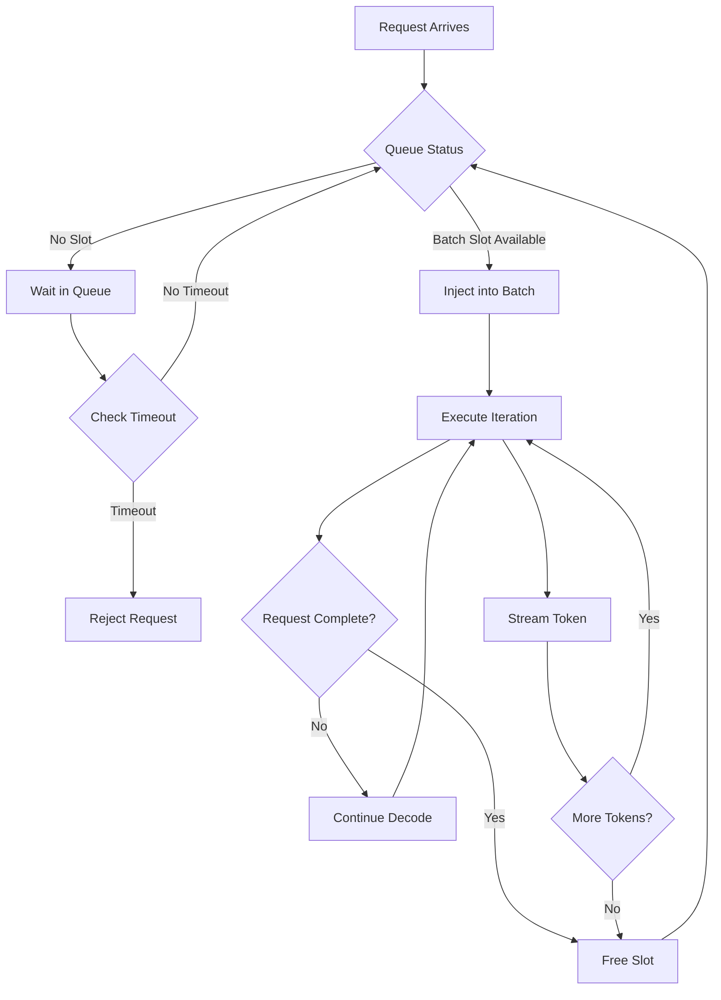
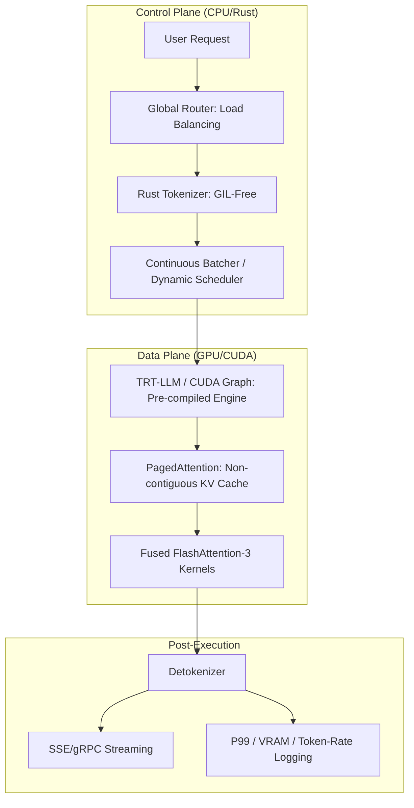

*By Gopi Krishna Tummala*

---

<div class="series-nav" style="background: linear-gradient(135deg, #059669 0%, #0d9488 100%); color: white; padding: 1.5rem; border-radius: 12px; margin-bottom: 2rem; box-shadow: 0 4px 6px rgba(0,0,0,0.1);">
  <div style="font-size: 0.875rem; opacity: 0.9; margin-bottom: 0.5rem; text-transform: uppercase; letter-spacing: 0.05em;">Infrastructure-First MLOps — Building the Engine of AI</div>
  <div style="display: flex; gap: 0.75rem; flex-wrap: wrap; align-items: center;">
    <a href="/posts/mlops/parquet-arrow-quest-for-analytic-speed" style="background: rgba(255,255,255,0.1); padding: 0.5rem 1rem; border-radius: 6px; text-decoration: none; color: white; opacity: 0.9;">Module 1: Data DNA</a>
    <a href="/posts/mlops/datasets-and-dataloaders" style="background: rgba(255,255,255,0.1); padding: 0.5rem 1rem; border-radius: 6px; text-decoration: none; color: white; opacity: 0.9;">Module 2: Dataloaders</a>
    <a href="/posts/mlops/hidden-engine-of-ai" style="background: rgba(255,255,255,0.1); padding: 0.5rem 1rem; border-radius: 6px; text-decoration: none; color: white; opacity: 0.9;">Module 3: Training</a>
    <a href="/posts/mlops/modern-post-training-peft-2026" style="background: rgba(255,255,255,0.1); padding: 0.5rem 1rem; border-radius: 6px; text-decoration: none; color: white; opacity: 0.9;">Module 4: Post-Training</a>
    <a href="/posts/mlops/vllm-trilogy-of-modern-llm-scaling" style="background: rgba(255,255,255,0.1); padding: 0.5rem 1rem; border-radius: 6px; text-decoration: none; color: white; opacity: 0.9;">Module 5: Serving</a>
    <a href="/posts/mlops/custom-kernel-craze" style="background: rgba(255,255,255,0.1); padding: 0.5rem 1rem; border-radius: 6px; text-decoration: none; color: white; opacity: 0.9;">Module 6: Kernels</a>
    <a href="/posts/mlops/beyond-inference-agentic-mlops-mcp" style="background: rgba(255,255,255,0.1); padding: 0.5rem 1rem; border-radius: 6px; text-decoration: none; color: white; opacity: 0.9;">Module 7: Agentic AI</a>
  </div>
  <div style="margin-top: 0.75rem; font-size: 0.875rem; opacity: 0.8;">📖 You are reading a <strong>Deep Dive</strong> — Lifecycle of an Inference Request</div>
</div>

---

### Act 0: Tensor Life in Plain English

Imagine you are running a high-end sushi restaurant (The Inference System). 

1.  **Request (Order):** A customer orders a "Dragon Roll."
2.  **Tokenization (Prep):** The waiter translates the order into a code for the chef (e.g., `Order #15`).
3.  **Batching (Assembly Line):** The chef waits for 3 people to order the same roll so he can cut all the cucumbers at once.
4.  **Execution (Cooking):** The chef actually puts the rice and fish together. This is the **GPU Kernel** doing math.
5.  **Post-Processing (Plating):** The waiter adds ginger and wasabi to make it look nice.
6.  **Streaming (Serving):** Instead of waiting for the whole meal, the waiter brings out the miso soup first so the customer doesn't get hungry.

If the kitchen is slow, the waiter (API) is bored. If the kitchen (GPU) is idle, the waiter is slow. **Inference Optimization** is the art of making the kitchen and the waiter move in perfect harmony.

---

## Phase 1: The Gateway and The Queue

**The Bottleneck:** Scheduling & Serialization

The journey begins at the model serving endpoint (e.g., vLLM, TGI, TRT-LLM). But before we even get to the model, there are three bottlenecks that will kill your latency if you ignore them.

### 1. Request: The Gateway

**"The cost of entry."**

Every inference journey begins at the network edge. Whether via gRPC or HTTP, the request payload defines the initial constraints. For LLMs, this is lightweight text JSON; for Diffusion models, it's often heavy Base64-encoded images. This phase isn't just about receiving data—it's about serialization overhead, protocol decoding, and unmarshalling payloads without blocking the event loop. If your ingress is slow, your GPU sits idle.

#### Protocol Overhead

The request arrives via gRPC or HTTP. While the payload for an LLM is small (text), diffusion requests often carry base64 images or masks. I've seen teams spend weeks optimizing CUDA kernels only to realize they're spending 200ms just deserializing JSON image payloads.

```
Request Flow:
┌─────────┐     HTTP/gRPC      ┌──────────────┐     Binary/Protobuf    ┌──────────┐
│ Client  │ ──────────────────> │ Load Balancer│ ─────────────────────> │  Model   │
│         │   (JSON/Base64)     │              │   (Optimized Format)   │  Server  │
└─────────┘                      └──────────────┘                        └──────────┘
```

**The Fix:** For diffusion, avoid JSON/HTTP for image payloads. Use binary formats (Protobuf/FlatBuffers) or pre-signed S3 URLs to keep the control plane light. I've seen teams achieve a 3x reduction in request deserialization time by moving from base64 JSON to Arrow IPC for image payloads.

### 2. Queue: The Waiting Room

**"Managing the flood."**

When the system is under load, we can't shove every request into the GPU immediately. The queue acts as the pressure valve. This is where we make critical decisions about priority, backpressure, and timeouts. Do we use a simple FIFO queue, or a priority queue that favors VIP users? A poorly managed queue leads to increased latency for everyone, while a smart queue protects the system from collapse during traffic spikes.

### 3. Tokenize: The CPU Bottleneck

**"Turning text into math."**

Before a model can understand "Hello," it must become `[15496]`. This step seems trivial but is a frequent silent killer in Python-based stacks. Because tokenization is CPU-bound, the Python Global Interpreter Lock (GIL) can strangle throughput, starving the GPU even if it has capacity. Efficient systems often offload this to Rust-based services or separate processes to ensure the GPU never waits on the CPU.

This is CPU-bound, and here's where Python's Global Interpreter Lock (GIL) becomes your enemy. If your tokenizer runs in Python while your model runs in C++/Rust, the GIL can strangle high-concurrency throughput. I've profiled systems where tokenization was the bottleneck at 80% CPU utilization, even though the GPU was sitting at 30%.

**The Fix:** Use Rust-based tokenizers (e.g., Hugging Face `tokenizers`) released from the GIL, or offload tokenization to a separate microservice layer to decouple CPU load from the GPU hosts. The microservice approach also gives you better horizontal scaling when you're serving multiple model variants.

### 4. Batch: The "Ragged Tensor" Problem

**"Tetris with data."**

In training, we love uniform rectangles of data. In inference, real-world user prompts are chaotic: one user asks a 5-token question, another pastes a 4,000-token document.

* **The Problem:** Naive "Static Batching" forces us to pad the short 5-token request with 3,995 "empty" tokens just to match the long one, wasting massive amounts of compute and VRAM on nothing.
* **The Goal:** We need to construct batches that minimize padding waste, grouping requests dynamically to maximize the useful work done per clock cycle.

**Static Batching (Old School):** Wait for N requests to arrive, pad them to the longest sequence, and send them to the GPU. This wastes huge amounts of VRAM and compute on padding tokens. I've seen teams padding 512-token sequences to 2048 just to batch them together—that's 75% wasted compute.

```
Static Batching (Inefficient):
Request 1: [tok1, tok2, tok3, ..., tok512, <PAD>, <PAD>, ..., <PAD>]  ← 1536 wasted tokens
Request 2: [tok1, tok2, ..., tok1024, <PAD>, <PAD>, ..., <PAD>]      ← 1024 wasted tokens
Request 3: [tok1, tok2, ..., tok2048]                                 ← reference length
```

### 5. Schedule: The Orchestrator

**"The heartbeat of the system."**

Batching groups the data; scheduling decides *when* it runs. Modern LLM serving moves beyond request-level scheduling to **Iteration-Level Scheduling** (Continuous Batching). Instead of waiting for a whole batch to finish, the scheduler injects new requests into the batch the moment a previous request finishes a token generation. It manages the "Prefill" (processing the prompt) vs. "Decode" (generating tokens) trade-off to ensure Time-to-First-Token (TTFT) remains low without destroying overall throughput.

**Continuous Batching (State of the Art):** We schedule at the *iteration* level, not the request level. New requests are injected into the batch immediately as soon as a slot frees up. This is what vLLM and TGI do, and it's the difference between 2x and 10x throughput.

```
Continuous Batching (Efficient):
Iteration 1: [Req1: tok1-512, Req2: tok1-1024, Req3: tok1-2048]
Iteration 2: [Req1: tok513, Req2: tok1025, Req3: tok2049, Req4: tok1-256]  ← Req4 joins!
Iteration 3: [Req2: tok1026, Req3: tok2050, Req4: tok257-512, Req5: tok1-128]  ← Req5 joins!
```

#### Iteration-Level Scheduler Flow



---

#### Act V.V: Mature Architecture — The Global Inference Pipeline

In a 2025 production stack, inference is a multi-tier orchestration. We use **NVIDIA TensorRT** or **ONNX Runtime** to compile the model into a hardware-specific executable, bypassing Python entirely.

**The Production Inference Pipeline (Mature Architecture):**



##### 1. CUDA Graphs: Bypassing the Kernel Launch Overhead
For small models or low batch sizes, the time it takes the CPU to tell the GPU "do math" can be longer than the math itself. 
*   **The SOTA Fix:** **CUDA Graphs**. We record the entire assembly line of math operations once. During inference, the CPU sends a *single* command to execute the whole graph, reducing CPU-GPU synchronization overhead by 90%.

##### 2. Trade-offs & Reasoning
*   **Dynamic vs. Static Shapes:** Pre-compiling a model (TensorRT) requires knowing the input size. *Trade-off:* Static shapes are 20% faster but force padding waste. Modern stacks use **Dynamic Shapes** with optimized padding-aware kernels to get the best of both worlds.
*   **Quantization-Aware Training (QAT) vs. PTQ:** Post-Training Quantization (PTQ) is fast but hurts accuracy. *Trade-off:* QAT integrates quantization into the training loop, yielding near-lossless INT8/FP8 performance at the cost of longer training times.
*   **Citations:** *TensorRT LLM Architecture (NVIDIA 2024)* and *FlashAttention-3: Fast and Accurate Attention with Asynchrony (Hopper Specific, 2024)*.

---

### Act VI: System Design & Interview Scenarios

#### Scenario 1: The "Long-Tail" Latency
*   **Question:** "Your average response time is 2 seconds, but 1% of users are seeing 30-second delays. How do you find the leak?"
*   **Answer:** This is a **P99 Latency** problem. Check for **KV Cache Eviction** (too many concurrent long-context users) or **Batch Stalling** (one massive 4k token prefill blocking 100 small decode steps). The fix is **Chunked Prefill**.

#### Scenario 2: GPU Under-utilization
*   **Question:** "Your NVIDIA-SMI shows 90% Volatile GPU-Util, but your token throughput is only 10% of theoretical max. Why?"
*   **Answer:** You are **Memory Bandwidth Bound**. The GPU cores are waiting for the model weights to load from HBM (High Bandwidth Memory). You need to **increase batch size** or use **Quantization** to reduce the weight-loading overhead.

---

### Graduate Assignment: The Bottleneck Hunt

**Task:**
You are serving a Stable Diffusion XL model.
1.  **The Math:** If a single denoising step takes 100ms and you run 50 steps, what is your base latency?
2.  **The Scale:** If you implement **Static Batching** with size 8, and the GPU memory transfer for the weights takes 200ms, calculate the throughput (Images/sec).
3.  **The SOTA:** Why would using **S-LoRA** (Unified Paging for LoRAs) be better than simple weight-swapping if you serve 100 different artistic styles?

---

**Further Reading (State-of-the-Art):**
*   *Orca: A Distributed Serving System for Transformer-Based Generative Models (OSDI 2022)* - The foundation of continuous batching.
*   *FlashAttention-3 (arXiv 2024)* - Specifically for NVIDIA Hopper architectures.
*   *DeepSpeed-Inference: High-Performance Serving for LLMs*.

---

**Previous:** [Module 5 — LLM Serving (vLLM)](/posts/mlops/vllm-trilogy-of-modern-llm-scaling)

**Next:** [Module 6 — Custom Kernels](/posts/mlops/custom-kernel-craze)
