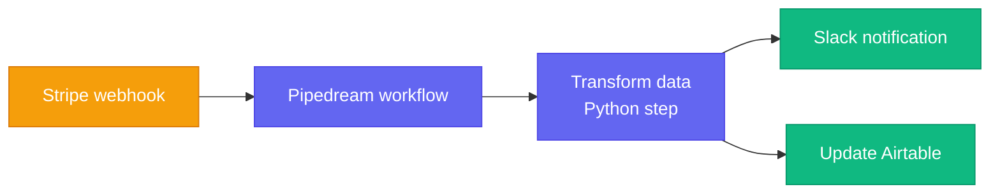
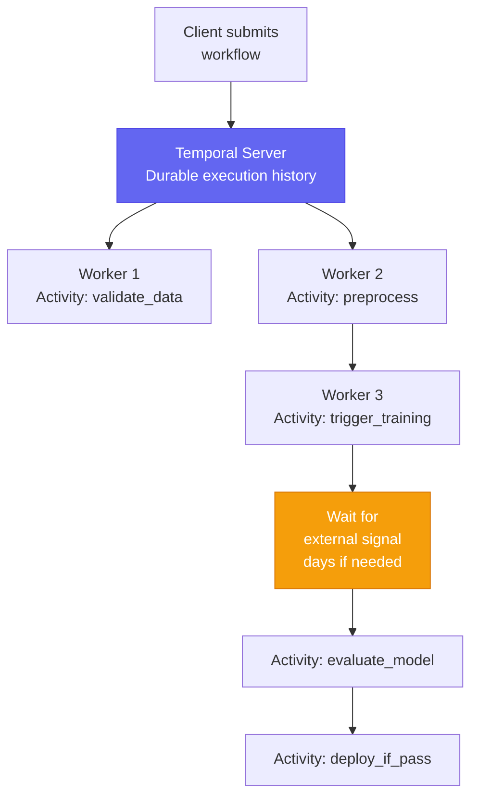
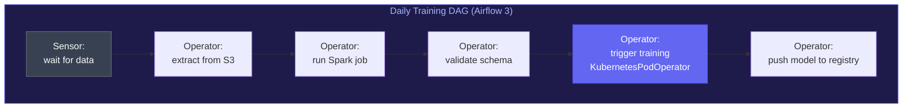
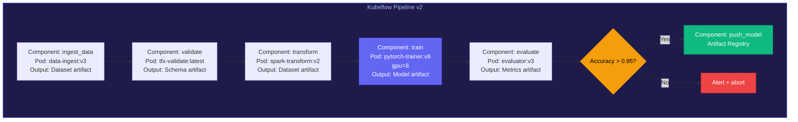
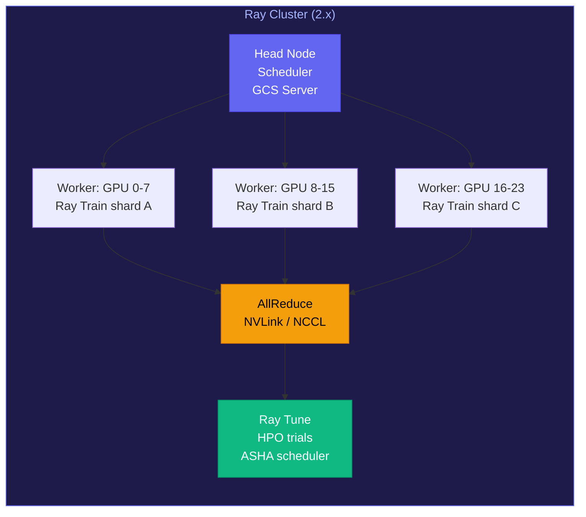
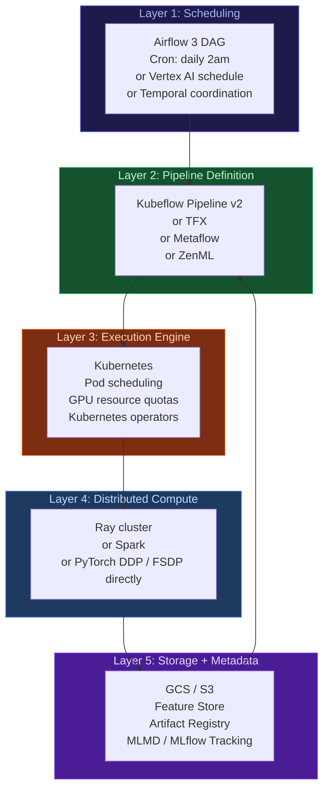
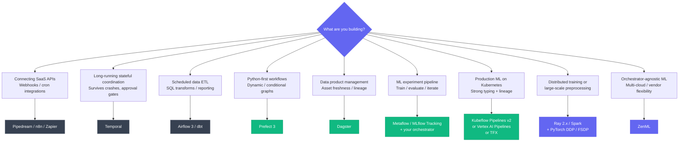

*By Gopi Krishna Tummala*

---

<div class="series-nav" style="background: linear-gradient(135deg, #059669 0%, #0d9488 100%); color: white; padding: 1.5rem; border-radius: 12px; margin-bottom: 2rem; box-shadow: 0 4px 6px rgba(0,0,0,0.1);">
  <div style="font-size: 0.875rem; opacity: 0.9; margin-bottom: 0.5rem; text-transform: uppercase; letter-spacing: 0.05em;">Infrastructure-First MLOps — Building the Engine of AI</div>
  <div style="display: flex; gap: 0.75rem; flex-wrap: wrap; align-items: center;">
    <a href="/posts/mlops/parquet-arrow-quest-for-analytic-speed" style="background: rgba(255,255,255,0.1); padding: 0.5rem 1rem; border-radius: 6px; text-decoration: none; color: white; opacity: 0.9;">Module 1: Data DNA</a>
    <a href="/posts/mlops/datasets-and-dataloaders" style="background: rgba(255,255,255,0.1); padding: 0.5rem 1rem; border-radius: 6px; text-decoration: none; color: white; opacity: 0.9;">Module 2: Dataloaders</a>
    <a href="/posts/mlops/hidden-engine-of-ai" style="background: rgba(255,255,255,0.1); padding: 0.5rem 1rem; border-radius: 6px; text-decoration: none; color: white; opacity: 0.9;">Module 3: Training</a>
    <a href="/posts/mlops/modern-post-training-peft-2026" style="background: rgba(255,255,255,0.1); padding: 0.5rem 1rem; border-radius: 6px; text-decoration: none; color: white; opacity: 0.9;">Module 4: Post-Training</a>
    <a href="/posts/mlops/vllm-trilogy-of-modern-llm-scaling" style="background: rgba(255,255,255,0.1); padding: 0.5rem 1rem; border-radius: 6px; text-decoration: none; color: white; opacity: 0.9;">Module 5: Serving</a>
    <a href="/posts/mlops/custom-kernel-craze" style="background: rgba(255,255,255,0.1); padding: 0.5rem 1rem; border-radius: 6px; text-decoration: none; color: white; opacity: 0.9;">Module 6: Kernels</a>
    <a href="/posts/mlops/beyond-inference-agentic-mlops-mcp" style="background: rgba(255,255,255,0.1); padding: 0.5rem 1rem; border-radius: 6px; text-decoration: none; color: white; opacity: 0.9;">Module 7: Agentic AI</a>
    <a href="/posts/mlops/ml-pipeline-orchestration-layers" style="background: rgba(255,255,255,0.25); padding: 0.5rem 1rem; border-radius: 6px; text-decoration: none; color: white; font-weight: 600; border: 2px solid rgba(255,255,255,0.5);">Module 8: Orchestration</a>
  </div>
  <div style="margin-top: 0.75rem; font-size: 0.875rem; opacity: 0.8;">📖 You are reading <strong>Module 8: ML Pipeline Orchestration</strong> — The Conductor of AI Systems</div>
</div>

---

## TL;DR

- **Pipedream / Zapier / n8n** = event-driven glue for APIs. Not ML tools.
- **Temporal** = durable backend orchestration with exactly-once workflow semantics. Good for long-running ML coordination.
- **Airflow 3** (April 2025) = DAG scheduler for data pipelines with full DAG versioning. The industry standard for ETL. Not designed for distributed compute.
- **Prefect 3** = Python-native Airflow alternative with dynamic workflows and hybrid execution.
- **Dagster** = asset-centric orchestration. You define data products; Dagster figures out what to run.
- **Metaflow 2.19** = ML-native pipeline SDK from Netflix. Decorator-based, AWS-native, great for DS teams.
- **ZenML** = meta-orchestrator. Runs your pipeline on any backend (Airflow, Kubeflow, Vertex AI, etc.).
- **Kubeflow Pipelines v2** = containerized ML DAGs on Kubernetes with compile-time type checking via IR YAML.
- **TFX** = opinionated, full-lifecycle ML framework. Pipeline-as-code with typed component contracts.
- **Ray 2.x** = distributed Python execution engine. OpenAI uses it for ChatGPT training. The scaling layer beneath pipelines.
- **Vertex AI Pipelines** = managed Kubeflow on GCP at $0.03/run. Eliminates K8s ops overhead.
- **MLflow Recipes** = removed entirely in MLflow 3 (June 2025). Do not use.
- Real FAANG ML systems layer these: scheduler → pipeline definition → execution layer → distributed compute → storage.

---

### Act 0: The Confusion That Costs You Interviews

Here is a question that trips up a surprising number of ML engineers:

> "Is Pipedream similar to Airflow or Kubeflow? They all string steps together, right?"

The answer is: not really. They sit at completely different layers of the stack and solve different problems. Confusing them in a system design interview signals shallow infrastructure intuition.

The confusion is understandable. All of these tools draw boxes and connect them with arrows. But so does Figma, and nobody thinks Figma runs GPU training jobs.

The way to cut through this is to ask three questions for any orchestration tool:
1. **What triggers execution?** (Events, cron, upstream task completion, manual)
2. **What is the unit of work?** (Function call, Docker container, distributed task graph)
3. **What compute does it target?** (One server, a cluster, a GPU farm)

Let's map every major tool against these axes.

---

### Act I: Layer 1 — Event-Driven Glue

These tools connect APIs. They are explicitly not designed for ML workloads.



**Pipedream** is best described as "Zapier for engineers." It handles:
- API webhooks → transform → send
- Cron-triggered integrations
- SaaS-to-SaaS glue (Stripe → Salesforce, GitHub → Slack)

The unit of work is a small serverless function. The compute target is a single managed server. There is no concept of distributed execution, data locality, GPU scheduling, or checkpoint-resume for multi-hour jobs.

**Other tools in this category:** Zapier, Make (Integromat), n8n

**When you'd actually use these in an ML context:** sending a Slack alert when a training run finishes, or triggering a data pull from an API when a webhook fires. Not for the training run itself.

---

### Act II: Layer 2 — Durable Backend Orchestration

**Temporal** is a step up in seriousness. It is code-first workflow orchestration designed for backend services where correctness and crash-recovery matter more than schedule management.



**The key idea in Temporal**: workflows are durable. If your server crashes mid-execution, Temporal replays the event history and picks up exactly where it left off. It provides **exactly-once semantics for workflow logic** and at-least-once guarantees for activities (side-effect operations like API calls).

This is categorically different from Airflow: in Airflow, a failed task restarts from scratch. In Temporal, the workflow function resumes from the exact last activity checkpoint—even if that checkpoint happened three days ago and multiple servers have since restarted.

**How companies use it for ML:**
- Orchestrating AI-driven pipelines that analyze billions of signals where individual LLM API calls can time out
- Long-running data workflows that span hours or days
- Multi-agent AI systems where each step involves external service calls that need reliable retry/resume
- Human-approval gates in ML deployment pipelines

Temporal is not a data pipeline tool—it has no native operator ecosystem, no built-in data lineage, no concept of datasets or assets. You'd still need Airflow for ETL scheduling and Ray for distributed training. Temporal fills the coordination layer between them.

---

### Act III: Layer 3 — Data Pipeline Schedulers

This is where **Airflow** lives, and it is the most widely deployed orchestration tool in the data industry.



**Airflow 3.0** (released April 2025, with Airflow 2.x entering security-only support April 2026) brought a major architectural shift. The headline feature that took a decade to ship: **full DAG versioning**. In Airflow 2.x, any DAG code change was immediately applied to historical runs, making past execution records unreliable. In Airflow 3, each DAG run is pinned to the exact DAG version that created it.

Other significant Airflow 3 changes:
- **Task Execution API + Task SDK**: task code is now decoupled from the Airflow runtime. Tasks can run in remote containers or edge environments without needing the Airflow metadata DB installed. This enables true edge ML workflows.
- **Flask replaced with FastAPI**: async support, Pydantic validation, better performance
- **New React UI**: dark mode, 17 language support, redesigned from scratch
- **Edge Executor (GA)**: distributed/edge-compute workflows are now first-class
- **Airflow 3.1** (September 2025): Human-in-the-Loop task support and Deadline Alerts

**The migration cost is real.** Airflow 3 breaks operators that directly access the Airflow metadata database (they now need to go through the Task Execution API). Core operators migrated to `apache-airflow-providers-standard`. For large DAG libraries, this migration takes weeks.

**What Airflow is not good at:**
- Defining ML pipelines at a high level (no concept of model artifacts, feature stores, or experiment tracking)
- Distributed training directly (you'd use `KubernetesPodOperator` to submit a job elsewhere)
- Data-science-friendly API (writing Airflow DAGs requires infrastructure knowledge)
- Dynamic workflows where the graph structure is not known at parse time

#### Prefect 3: The Python-Native Alternative

**Prefect 3.0** (released September 3, 2024) makes a compelling architectural bet: the Prefect server handles only orchestration metadata—scheduling, state tracking, UI. Actual compute runs on **workers** in your own infrastructure, which poll a work pool for scheduled runs. No compute ever touches Prefect's servers.

The developer experience is fundamentally different from Airflow:

```python
# Prefect: decorate your existing Python
from prefect import flow, task

@task
def extract_features(dataset_path: str):
    return load_features(dataset_path)

@task(retries=3, retry_delay_seconds=60)
def train_model(features, lr: float = 1e-4):
    return run_training(features, lr=lr)

@flow
def ml_pipeline(dataset_path: str):
    features = extract_features(dataset_path)
    model = train_model(features)
    return model
```

No DAG class, no Operator inheritance, no XCom for passing data between tasks. Just Python.

**Prefect vs Airflow comparison:**

| Dimension | Prefect 3 | Airflow 3 |
|---|---|---|
| Code style | Decorate existing Python | Restructure into DAG + Operators |
| Dynamic workflows | Native — conditionals, loops | `DynamicTaskMapping` (awkward) |
| Infrastructure | Hybrid — your compute, Prefect orchestration | Dedicated scheduler + webserver + workers |
| Operator ecosystem | Smaller, write more Python glue | Massive (10+ years, every service) |
| Asset-awareness | None | "Data Assets" added in Airflow 3 (early) |

**When to choose Prefect**: Python-first teams, dynamic conditional workflows, teams wanting Airflow's scheduling power without Airflow's infrastructure complexity.

**When to choose Airflow**: You need the operator ecosystem (Snowflake, BigQuery, Databricks, EMR). You're at a company with existing Airflow infrastructure. Your pipelines are fundamentally schedule-driven.

#### Dagster: Asset-Centric Orchestration

Dagster's core abstraction is the **Software-Defined Asset (SDA)** — you define what data products should exist, and Dagster figures out what needs to run to materialize them. Airflow asks "did the task succeed?" Dagster asks "is this dataset fresh and correct?"

This sounds subtle but it changes everything about how you think about pipelines:

```python
# Dagster: define what should exist, not what to run
@asset
def raw_features(context):
    return load_from_warehouse()

@asset
def trained_model(raw_features):
    return train(raw_features)

@asset(freshness_policy=FreshnessPolicy(maximum_lag_minutes=60))
def production_predictions(trained_model, raw_features):
    return trained_model.predict(raw_features)
```

**Airflow 3's response**: Airflow 3.0 introduced "Data Assets" — a direct response to Dagster's SDA model. It's early and less mature, but signals the industry moving toward asset-awareness.

**When to choose Dagster**: Your team thinks in data products. You need partition-aware backfills (GDPR reprocessing, late-arriving data). You want built-in data quality checks without bolting on Great Expectations.

---

### Act IV: Layer 4 — ML-Native Pipeline Frameworks

This is where the tools were actually designed with ML workflows in mind.

#### Metaflow (Netflix)

Metaflow 2.19 is the current version. Netflix open-sourced it in 2019 and continues active development alongside **Maestro** (their internal workflow orchestrator). Recent additions (2025):

- `@checkpoint` decorator: save and resume long training runs mid-step
- `@spin` command: create flows interactively, useful for agentic workflows
- Native `uv` support for dependency management
- Recursive and conditional steps for agentic patterns
- **Cards**: interactive visual outputs built directly into pipeline steps—custom observability dashboards as a first-class feature

```python
from metaflow import FlowSpec, step, batch, Parameter, checkpoint

class TrainingFlow(FlowSpec):
    lr = Parameter("lr", default=1e-4)

    @step
    def start(self):
        self.next(self.preprocess)

    @batch(cpu=8, memory=32000)
    @step
    def preprocess(self):
        # Runs on AWS Batch, auto-scaled
        self.dataset = load_and_preprocess()
        self.next(self.train)

    @batch(gpu=8, memory=320000)
    @checkpoint  # Added in 2025: resume from last checkpoint on failure
    @step
    def train(self):
        # Runs on a GPU instance
        self.model = train_model(self.dataset, lr=self.lr)
        self.next(self.evaluate)

    @step
    def evaluate(self):
        self.metrics = evaluate(self.model)
        self.next(self.end)

    @step
    def end(self):
        print(f"Accuracy: {self.metrics['accuracy']}")
```

**AWS Step Functions integration**: Metaflow can compile any flow directly into an AWS Step Functions state machine. All decorators (`@batch`, `@retry`, `@catch`, `@timeout`) work within Step Functions. The `@schedule` decorator triggers via AWS EventBridge.

**Metaflow vs ZenML**: Metaflow has better UX for iterative research and is deeply AWS-native. ZenML has a stronger production MLOps governance story and is cloud-agnostic.

#### Kubeflow Pipelines v2

KFP v2 brought a fundamental architectural change: the compilation output is now a **serialized PipelineSpec protobuf message in YAML form** (called IR YAML — Intermediate Representation). Both individual components and full pipelines compile to this same format, eliminating the v1 confusion of two separate YAML schemas.

Type checking now happens **at compile time** across component boundaries:

```python
from kfp import dsl
from kfp.dsl import Dataset, Model, Metrics

@dsl.component(base_image="pytorch/pytorch:2.3.0-cuda12.1-cudnn8-runtime")
def train_model(
    train_data: Input[Dataset],
    learning_rate: float,
    model: Output[Model],
    metrics: Output[Metrics],
):
    # Type violations are caught at compile time, not runtime
    import torch
    result = run_training(train_data.path, lr=learning_rate)
    model.metadata["framework"] = "pytorch"
    metrics.log_metric("accuracy", result.accuracy)

@dsl.pipeline(name="training-pipeline")
def training_pipeline(lr: float = 1e-4):
    data_op = ingest_data()
    train_op = train_model(
        train_data=data_op.outputs["dataset"],
        learning_rate=lr,
    )
    evaluate_op = evaluate(model=train_op.outputs["model"])

# Compiles to portable IR YAML — runs on Kubeflow or Vertex AI
from kfp import compiler
compiler.Compiler().compile(training_pipeline, "pipeline.yaml")
```



**Why containerization matters**: each step is reproducible, independently versioned, and can run on any pod in the cluster. The training step requests 8 GPUs; the data validation step requests 64 CPU cores and 512GB RAM. The pipeline definition is separate from the resource requirements.

**The local development problem**: KFP's biggest pain point is that testing a pipeline locally requires either mocking or a local K8s cluster. This makes iteration slow compared to Metaflow or Prefect, which run locally without infrastructure.

#### TFX (TensorFlow Extended)

TFX is Google's internal ML production framework, open-sourced. It is the most opinionated option—it defines a strict contract for each component:

| TFX Component | Input type | Output type |
|---|---|---|
| `ExampleGen` | Raw data path | `Examples` |
| `StatisticsGen` | `Examples` | `ExampleStatistics` |
| `SchemaGen` | `ExampleStatistics` | `Schema` |
| `ExampleValidator` | `Examples` + `Schema` | `ExampleAnomalies` |
| `Transform` | `Examples` + `Schema` | `TransformGraph` + `Examples` |
| `Trainer` | `Examples` + `Schema` + `TransformGraph` | `Model` |
| `Evaluator` | `Examples` + `Model` | `ModelEvaluation` |
| `Pusher` | `Model` + `ModelEvaluation` | Deployed model |

The value of TFX: if your schema changes, the validation fails before it reaches training—not after you've wasted 8 hours of GPU time. The type contracts between components act as compile-time checks for your data pipeline.

The cost: you need to write TensorFlow. If you're a PyTorch shop, TFX is largely inaccessible.

#### ZenML: The Meta-Orchestrator

ZenML takes a different approach: it is not a pipeline executor—it is a **meta-orchestrator**. When you run a ZenML pipeline, ZenML translates it and submits it to whatever underlying orchestrator you've configured:

```python
# The same ZenML pipeline code runs on any backend
@step
def train_model(dataset: pd.DataFrame) -> ClassifierMixin:
    model = RandomForestClassifier()
    model.fit(dataset.drop("label", axis=1), dataset["label"])
    return model

@pipeline
def training_pipeline():
    data = load_data()
    model = train_model(data)
    evaluate(model, data)
```

Change one line in your stack configuration to switch from local execution to Kubeflow to Vertex AI to SageMaker Pipelines. ZenML handles containerization automatically—no Dockerfiles or YAML required.

**What ZenML adds on top of the underlying orchestrator:**
- Artifact versioning and lineage tracking (Model Control Plane)
- Rollback capability: ZenML snapshots exact code, Pydantic versions, and container state per step
- Stack abstraction: swap orchestrator, artifact store, model registry, experiment tracker independently
- Native LangGraph and LlamaIndex integration for AI agent pipelines (2025)

**ZenML's core value proposition**: avoid orchestrator lock-in. The same pipeline code runs everywhere. This is especially valuable if you're not sure whether you'll standardize on Kubeflow, Vertex AI, or SageMaker.

---

### Act V: Layer 5 — Distributed Compute Engines

The tools above orchestrate *which* steps to run and *when*. This layer is about *how* to execute a single step across many machines.



**Ray 2.x** is the dominant distributed ML execution engine. OpenAI uses Ray to train ChatGPT—Greg Brockman stated directly: *"We are using Ray to train our largest models."* At Uber, switching to a heterogeneous Ray cluster (8 GPU + 9 CPU nodes) versus 16 homogeneous GPU nodes achieved **50% higher throughput at lower capital cost** by mixing workloads. Benchmark studies have demonstrated **1,657% speedups** for distributed LLM batch inference with Ray versus single-node.

Ray's ecosystem is now mature across the full ML lifecycle:

```python
from ray import train
from ray.train.torch import TorchTrainer
from ray.train import ScalingConfig, CheckpointConfig

# Ray Train handles DDP/FSDP setup automatically
trainer = TorchTrainer(
    train_loop_per_worker=train_fn,
    scaling_config=ScalingConfig(
        num_workers=32,
        use_gpu=True,
        resources_per_worker={"GPU": 1},
    ),
    checkpoint_config=CheckpointConfig(
        num_to_keep=3,
        checkpoint_score_attribute="eval_loss",
    ),
    dataset_config={"train": train.DataConfig(datasets_to_split=["train"])},
)
result = trainer.fit()
```

**Ray's key components:**
- **Ray Train**: distributed training for PyTorch, TF, HuggingFace, XGBoost with automatic DDP/FSDP
- **Ray Data**: streaming pipeline for CPU preprocessing + GPU training. Anyscale benchmarks (October 2025) show Ray Data outperforming alternatives on multimodal AI workloads (text + image + video) due to heterogeneous CPU/GPU pipelining
- **Ray Tune**: HPO at scale. Uber reported **4× speedup** using Ray Tune's distributed search versus sequential approaches. Supports ASHA, HyperBand, Optuna, Ax.
- **Ray Serve**: production model serving with autoscaling and batching

**Ray is not a workflow scheduler**: it does not handle scheduling, retries, or complex dependency graphs between pipeline stages. That's Airflow's or Kubeflow's job. Ray does the compute; the pipeline orchestrator controls the flow.

**Spark** plays a similar role for data processing at scale—when your preprocessing step involves terabytes of tabular data, you submit a Spark job. Airflow has a `SparkSubmitOperator` for exactly this pattern.

---

### Act VI: Vertex AI Pipelines — The Managed Path

Vertex AI Pipelines is Google's managed Kubeflow service. It uses the same KFP SDK v2 IR YAML format as self-hosted Kubeflow—pipeline code is portable between the two.

**Pricing reality**: Vertex AI Pipelines charges **$0.03 per pipeline run** for orchestration (separate from compute costs). A team running 200 pipeline runs/day pays ~$180/month just for orchestration before any GPU charges. Custom training nodes start at **$21.25/hour**.

**vs. Self-hosted Kubeflow:**

| Dimension | Vertex AI Pipelines | Self-hosted Kubeflow |
|---|---|---|
| Orchestration cost | $0.03/run | Free (K8s cluster costs instead) |
| Kubernetes expertise needed | None | Significant |
| GCP integration | Deep (Feature Store, BigQuery ML, Model Registry) | Manual |
| Portability | GCP-only | Any K8s cluster |
| UI | Polished, managed | Functional, self-maintained |
| DevOps burden | Minimal | Cluster admin, upgrades, monitoring |

**Sweet spot**: GCP-native teams where DevOps bandwidth is the constraint. Startups where the $0.03/run fee is cheaper than DevOps time spent operating Kubernetes. At very high pipeline run volumes, self-hosted Kubeflow becomes more cost-effective.

---

### Act VII: The Full Production Stack

Real ML systems at companies like Google, Meta, and Waymo are not using a single tool. They layer these systems:



**A concrete example — daily model retraining at scale:**

1. **Airflow 3** triggers daily at 2am. The `DataAsset` sensor waits until yesterday's feature store data has landed (new in Airflow 3 — native asset-awareness).
2. **Kubeflow Pipeline v2** is triggered via `KubernetesPodOperator`. Steps: validate new data (type-checked against the stored schema) → run feature transforms → launch training job → evaluate → compare to production model.
3. **Kubernetes** schedules each pipeline step as a pod. The training step requests 64 A100s via a `RayCluster` custom resource.
4. **Ray Train** runs the distributed training job with automatic FSDP setup across those 64 GPUs, writing checkpoints to GCS every 10 minutes via `ray.train.CheckpointConfig`.
5. **MLMD** records the lineage: which data version, which pipeline version, which model artifact. MLflow tracking logs metrics per run.
6. If the new model passes evaluation thresholds, Kubeflow triggers a deployment component. Otherwise, it fires a PagerDuty alert.

---

### Act VIII: Tool Selection Decision Tree



---

### Act IX: The Comparison Table

| Tool | Trigger | Unit of Work | Compute Target | ML-Native? | 2025-26 Status |
|---|---|---|---|---|---|
| Pipedream | Webhook / cron | Serverless function | Single server | No | Stable |
| Temporal | Code-defined | Activity (any process) | Worker fleet | No | Active, growing |
| Airflow | Cron / upstream | Operator | Any (via operators) | No | v3.0 April 2025 |
| Prefect | Any | Task (Python function) | Hybrid workers | No | v3.0 Sept 2024 |
| Dagster | Any / asset trigger | Op / Asset | Any | Partial | Active |
| Metaflow | Manual / schedule | Step (Python function) | Cloud instances | Yes | v2.19.x |
| ZenML | Any (via backend) | Step (Python function) | Any (meta-orchestrator) | Yes | Active |
| Kubeflow | Pipeline trigger | Component (Docker) | Kubernetes cluster | Yes | v2 / KFP SDK 2.15 |
| TFX | Airflow / Kubeflow | TFX Component | K8s / local | Yes (TF-only) | Stable |
| Vertex AI Pipelines | Schedule / trigger | Component (container) | GCP managed | Yes | $0.03/run |
| Ray | Code | Remote task / actor | Ray cluster | Yes | v2.x, OpenAI-backed |
| Spark | Code / Airflow | Stage | Spark cluster | Partial | Stable |
| MLflow Recipes | — | — | — | — | **Removed in MLflow 3** |

> **MLflow Recipes removal note**: MLflow Recipes (previously MLflow Pipelines) was removed entirely in MLflow 3.0 (June 2025). It was too rigid—real ML workflows don't fit the six-step template (ingest → split → transform → train → evaluate → register). The caching was unreliable in practice. MLflow 3 refocused on tracking and model registry; for orchestration, they recommend using MLflow tracking inside whichever orchestrator you prefer.

---

### Act X: What to Say in Interviews

**Q: "Design an ML pipeline that retrains a recommendation model daily."**

The wrong answer: "I'd use Airflow." (Too vague—Airflow is just the scheduler, not the whole stack.)

The right answer:

> "I'd layer this. Airflow 3 handles the daily schedule and dependency checks—it uses Data Assets to verify yesterday's interaction logs have landed before triggering the pipeline. The pipeline definition itself would be in Kubeflow Pipelines v2 if we need strict containerization and artifact lineage, or Metaflow if the team is data-scientist-heavy and AWS-native. Each pipeline step runs as a Kubernetes pod so we can right-size compute per step—feature computation on Spark, distributed training on a Ray cluster using FSDP for the two-tower model. Artifacts and lineage go into MLMD or an artifact registry. The final step compares new model metrics to production baseline using shadow traffic—if it passes thresholds, it promotes. If not, it pages on-call and logs the failure with the artifact lineage so we can diff what changed."

**Q: "Is Pipedream similar to Airflow?"**

> "They both string steps together, but they sit at completely different layers. Pipedream is event-driven integration glue—connecting APIs and SaaS services, great for webhooks and lightweight automation. Airflow 3 is a DAG scheduler designed for data pipelines at scale—with full DAG versioning, backfill, dependency tracking, and operators for Spark, Kubernetes, BigQuery. For ML workloads specifically, you'd use Airflow for scheduling but hand off the actual ML steps to Kubeflow or Metaflow pipelines, which understand ML artifacts, experiment tracking, and model evaluation natively."

**Q: "When would you use Ray vs Kubeflow?"**

> "They solve different problems and appear together in production. Ray is a distributed execution engine—use it when a single Python process isn't enough, because your training job needs 64 GPUs or your preprocessing needs 10TB processed in parallel. OpenAI uses Ray for training ChatGPT. Kubeflow is a pipeline orchestrator—it defines the DAG of steps, manages typed artifacts between them, and handles conditionals like 'only deploy if accuracy exceeds threshold.' A Kubeflow pipeline step would submit a Ray training job. Ray does the compute; Kubeflow tracks the lineage and controls the flow."

**Q: "What's the difference between Airflow and Dagster?"**

> "The core abstraction is different. Airflow asks 'did the task succeed?' Dagster asks 'is this data asset fresh and correct?' Dagster's Software-Defined Assets let you declare what data products should exist and their freshness requirements—Dagster figures out what runs to materialize them. Airflow 3 added Data Assets as a response to this, but Dagster's asset model is more mature. For schedule-driven ETL with a large operator ecosystem, Airflow wins. For teams that think in data products and need partition-aware backfills or built-in data quality checks, Dagster is a better fit."

**Q: "What is ZenML and when would you use it?"**

> "ZenML is a meta-orchestrator—it's not a pipeline executor itself, it's a layer that translates your pipeline definition and submits it to whatever backend you've configured: Airflow, Kubeflow, Vertex AI, SageMaker Pipelines. The value is avoiding orchestrator lock-in. You write your pipeline once in Python with ZenML decorators, and you can switch the backend by changing a stack configuration. It also adds artifact versioning, model lineage, and rollback capabilities on top of whatever backend you choose. I'd reach for it when a team doesn't know yet which orchestrator they'll standardize on, or when they need to run the same pipeline across multiple cloud providers."

---

### Act XI: Your Context (AV / Zoox Background)

If you've worked on autonomous vehicle ML infrastructure, you're already close to the serious end of this stack. AV companies typically run:

- **Internal schedulers** built on Airflow or similar, with AV-specific sensors for data readiness (was yesterday's lidar annotation batch complete? did the sync from the fleet land?)
- **Custom pipeline DSLs** with Kubeflow/TFX-style typed component contracts (Waymo's internal framework shares these concepts)
- **Large-scale distributed training** with PyTorch FSDP across hundreds of GPUs for perception models—this is exactly the Ray use case
- **Metaflow or similar** for research experiments, with promotion paths to production pipelines

In interviews, anchor your answers to this scale: "at Zoox, retraining a perception model meant coordinating 512 GPUs, validating against thousands of sensor-annotated scenarios across scenario categories—fog, night, construction zones—before any deployment. A tool like Pipedream isn't even in the conversation for that. You're looking at Kubernetes, distributed training via Ray Train or DDP, and a pipeline system with artifact contracts that prevents you from accidentally deploying a model trained on stale annotation data."

That specificity signals you understand production ML infrastructure, not just the tooling vocabulary.

---

### Quick Reference: Intuition Shortcuts

| Tool | One-Line Mental Model |
|---|---|
| **Pipedream** | Zapier for engineers |
| **Temporal** | Crash-proof backend workflows with exactly-once semantics |
| **Airflow 3** | Cron + DAGs + DAG versioning for data pipelines at scale |
| **Prefect 3** | Airflow ergonomics, Python-native, dynamic workflows |
| **Dagster** | Define what data should exist, not what code to run |
| **Metaflow 2.19** | Python decorators that move steps to cloud compute |
| **ZenML** | Write once, run on any orchestrator backend |
| **Kubeflow v2** | ML DAGs on Kubernetes with compile-time type checking |
| **TFX** | Kubeflow + strict typed component contracts (TF ecosystem) |
| **Vertex AI Pipelines** | Managed Kubeflow on GCP, $0.03/run |
| **Ray 2.x** | Make this Python code run on 1000 GPU cores |
| **Spark** | Process 10TB of tabular data in parallel |
| **MLflow Recipes** | Removed in MLflow 3 — do not use |

---

*The orchestration layer is where ML systems show their seams. Getting the abstraction boundaries right—scheduler vs pipeline vs compute engine—is the difference between a system that scales and one that becomes a maintenance nightmare at 10× load. The right answer is almost never "pick one tool." It's "understand which layer each tool owns and compose them correctly."*
