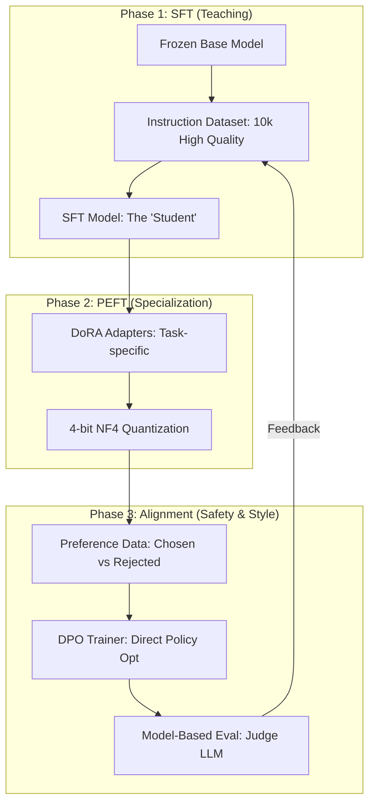

*By Gopi Krishna Tummala*

---

  
Infrastructure-First MLOps — Building the Engine of AI

  

    <a href="/posts/mlops/parquet-arrow-quest-for-analytic-speed" style="background: rgba(255,255,255,0.1); padding: 0.5rem 1rem; border-radius: 6px; text-decoration: none; color: white; opacity: 0.9;">Module 1: Data DNA</a>
    <a href="/posts/mlops/datasets-and-dataloaders" style="background: rgba(255,255,255,0.1); padding: 0.5rem 1rem; border-radius: 6px; text-decoration: none; color: white; opacity: 0.9;">Module 2: Dataloaders</a>
    <a href="/posts/mlops/hidden-engine-of-ai" style="background: rgba(255,255,255,0.1); padding: 0.5rem 1rem; border-radius: 6px; text-decoration: none; color: white; opacity: 0.9;">Module 3: Training</a>
    <a href="/posts/mlops/modern-post-training-peft-2026" style="background: rgba(255,255,255,0.25); padding: 0.5rem 1rem; border-radius: 6px; text-decoration: none; color: white; font-weight: 600; border: 2px solid rgba(255,255,255,0.5);">Module 4: Post-Training</a>
    <a href="/posts/mlops/vllm-trilogy-of-modern-llm-scaling" style="background: rgba(255,255,255,0.1); padding: 0.5rem 1rem; border-radius: 6px; text-decoration: none; color: white; opacity: 0.9;">Module 5: Serving</a>
    <a href="/posts/mlops/custom-kernel-craze" style="background: rgba(255,255,255,0.1); padding: 0.5rem 1rem; border-radius: 6px; text-decoration: none; color: white; opacity: 0.9;">Module 6: Kernels</a>
    <a href="/posts/mlops/beyond-inference-agentic-mlops-mcp" style="background: rgba(255,255,255,0.1); padding: 0.5rem 1rem; border-radius: 6px; text-decoration: none; color: white; opacity: 0.9;">Module 7: Agentic AI</a>
  

  
📖 You are reading <strong>Module 4: Post-Training</strong> — Sculpting Intelligence

---

### Act 0: Post-Training in Plain English

Imagine a model is a **Block of Marble**.
*   **Pre-training:** This is the massive quarrying operation. You use 10,000 GPUs to find a raw, high-quality block. The block has "all the data in the world" inside it, but it's just a giant cube. You can't put it in a museum yet.
*   **Post-training:** This is the **Sculptor**. You use a chisel (LoRA) and a fine-grade sandpaper (Alignment) to turn that cube into a statue of David.

**PEFT (LoRA):** Instead of re-carving the whole statue, you just add a small "clay patch" (Adapter) to the face to change its expression. It's 1000x faster and cheaper.

**Alignment (DPO):** This is the "Critic" who watches the sculptor and says, "This hand looks better than that one. Keep the good parts, throw away the bad ones."

---

### Act I: The PEFT Revolution (Adapters)

In 2026, nobody does "Full Fine-Tuning" anymore. It's too slow. We use **PEFT (Parameter-Efficient Fine-Tuning)**.

#### 1. LoRA: Low-Rank Adaptation
We freeze the 70B model weights and only train two tiny matrices ($A$ and $B$) that sit alongside the main ones. 
*   **The Math:** $\Delta W = B \times A$. We approximate a 4096x4096 matrix using two 4096x8 matrices.
*   **The Benefit:** You only train 0.1% of the model.

#### 2. DoRA: The 2025 Evolution
**DoRA (Weight-Decomposed LoRA)** splits weights into **Magnitude** and **Direction**. 
*   **Why it's better:** It allows the model to learn complex new behaviors (Direction) without exploding the signal (Magnitude). It closes the gap between LoRA and Full Fine-tuning completely.

---

#### Act I.V: Mature Architecture — The Post-Training Pipeline

A production-grade post-training stack doesn't just run a script. It's a multi-tier **Alignment Factory**.

**The Post-Training Pipeline (Mature Architecture):**

##### 1. DPO: Direct Preference Optimization
In the past, we needed a "Reward Model" (RLHF). **DPO** simplified this. It uses pure math to say: *"Make the model output more like response A and less like response B."* It's stable, fast, and doesn't crash like RL.

##### 2. Trade-offs & Reasoning
*   **LoRA vs. Full Fine-Tuning:** Full tuning causes "Catastrophic Forgetting"—the model forgets how to do math while learning to speak French. *Trade-off:* LoRA preserves the "General Knowledge" by freezing the base, but it can be too "weak" for completely new domains.
*   **Alignment Tax:** Highly aligned models (safe) often become "dumber" at reasoning. Mature stacks use **Replay Buffers** (mixing pre-training data) to prevent this tax.
*   **Citations:** *Direct Preference Optimization: Your Language Model is Secretly a Reward Model (NeurIPS 2023)* and *DoRA: Weight-Decomposed Low-Rank Adaptation (ICML 2024)*.

---

### Act II: System Design & Interview Scenarios

#### Scenario 1: Catastrophic Forgetting
*   **Question:** "You fine-tuned your model on medical data, but now it can't write simple Python code anymore. What happened?"
*   **Answer:** This is **Knowledge Drift**. You over-fitted the adapters. **The Fix:** Reduce the LoRA **Rank ($r$)**, add a "Replay Buffer" of general coding data to the fine-tuning set, or use **Weight Merging** (merging the new model with the old one at a 50/50 ratio).

#### Scenario 2: Fine-tuning at Scale (QLoRA)
*   **Question:** "You only have one 24GB GPU, but you need to fine-tune a 70B model. How?"
*   **Answer:** Use **QLoRA (Quantized LoRA)**. You load the 70B base in **4-bit NF4** (NormalFloat4) which uses only ~35GB, then offload parts to system RAM. You only store 16-bit gradients for the tiny $A$ and $B$ matrices.

#### Scenario 3: The "Alignment" Bottleneck
*   **Question:** "Your model is polite but refuses to answer harmless questions because it's 'too safe'. How do you fix the alignment?"
*   **Answer:** Use **KTO (Kahneman-Tversky Optimization)** or adjust the **DPO Beta** parameter. A lower Beta makes the model less "scared" of the reference (safe) model, allowing it to be more creative.

---

### Graduate Assignment: The Adapter Optimizer

**Task:**
You are training a LoRA adapter for a model with 32 layers.
1.  **Rank Selection:** Why would you give **Layer 1** a rank of $r=4$ but **Layer 32** a rank of $r=64$? (Hint: Look up **AdaLoRA**).
2.  **The Merge:** If you have 10 different LoRA adapters (one for each language), explain how **TIES-Merging** allows you to combine them into one single "Polyglot" model without them interfering with each other.
3.  **The Cost:** Calculate the storage saving of 10 LoRA adapters vs. 10 Full Fine-tuned models for a 70B parameter model.

---

**Further Reading:**
*   *Unsloth: The library making PEFT 2x faster.*
*   *Axolotl: The gold-standard config-based trainer.*
*   *DPO Research: Why RLHF is being replaced.*

---

**Previous:** [Module 3 — Training Frameworks](/posts/mlops/hidden-engine-of-ai)

**Next:** [Module 5 — LLM Serving (vLLM)](/posts/mlops/vllm-trilogy-of-modern-llm-scaling)
