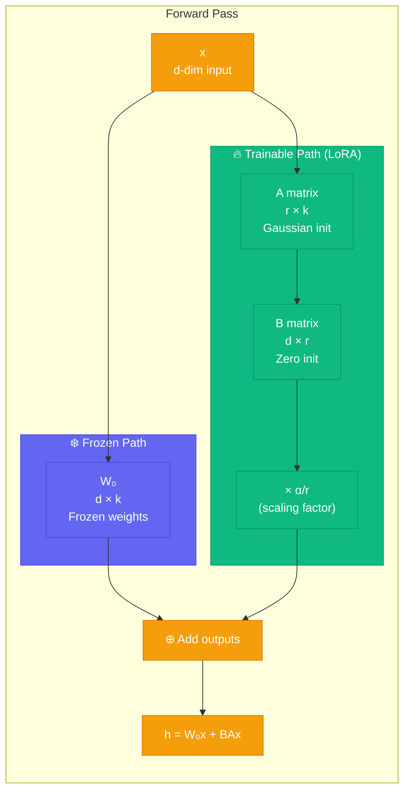
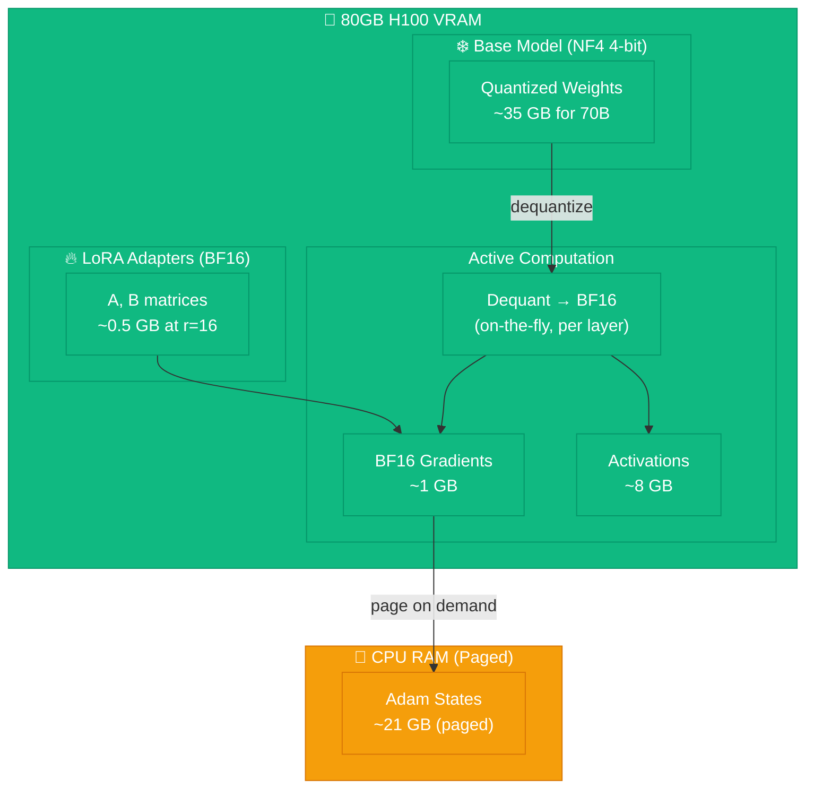
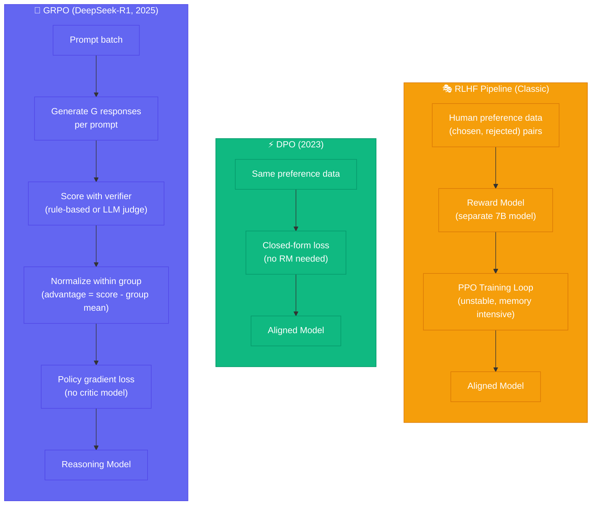
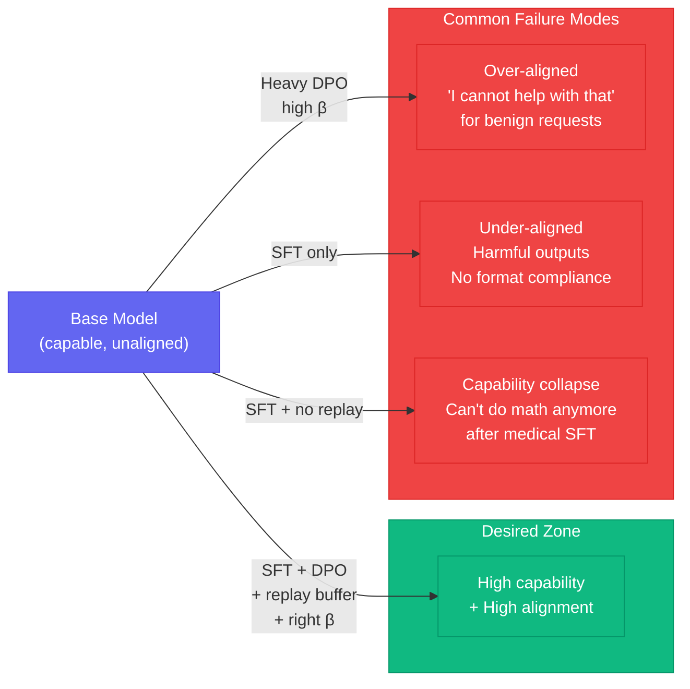

*By Gopi Krishna Tummala*

---

<div class="series-nav" style="background: linear-gradient(135deg, #059669 0%, #0d9488 100%); color: white; padding: 1.5rem; border-radius: 12px; margin-bottom: 2rem; box-shadow: 0 4px 6px rgba(0,0,0,0.1);">
  <div style="font-size: 0.875rem; opacity: 0.9; margin-bottom: 0.5rem; text-transform: uppercase; letter-spacing: 0.05em;">Infrastructure-First MLOps — Building the Engine of AI</div>
  <div style="display: flex; gap: 0.75rem; flex-wrap: wrap; align-items: center;">
    <a href="/posts/mlops/parquet-arrow-quest-for-analytic-speed" style="background: rgba(255,255,255,0.1); padding: 0.5rem 1rem; border-radius: 6px; text-decoration: none; color: white; opacity: 0.9;">Module 1: Data DNA</a>
    <a href="/posts/mlops/datasets-and-dataloaders" style="background: rgba(255,255,255,0.1); padding: 0.5rem 1rem; border-radius: 6px; text-decoration: none; color: white; opacity: 0.9;">Module 2: Dataloaders</a>
    <a href="/posts/mlops/hidden-engine-of-ai" style="background: rgba(255,255,255,0.1); padding: 0.5rem 1rem; border-radius: 6px; text-decoration: none; color: white; opacity: 0.9;">Module 3: Training</a>
    <a href="/posts/mlops/modern-post-training-peft-2026" style="background: rgba(255,255,255,0.25); padding: 0.5rem 1rem; border-radius: 6px; text-decoration: none; color: white; font-weight: 600; border: 2px solid rgba(255,255,255,0.5);">Module 4: Post-Training</a>
    <a href="/posts/mlops/vllm-trilogy-of-modern-llm-scaling" style="background: rgba(255,255,255,0.1); padding: 0.5rem 1rem; border-radius: 6px; text-decoration: none; color: white; opacity: 0.9;">Module 5: Serving</a>
    <a href="/posts/mlops/custom-kernel-craze" style="background: rgba(255,255,255,0.1); padding: 0.5rem 1rem; border-radius: 6px; text-decoration: none; color: white; opacity: 0.9;">Module 6: Kernels</a>
    <a href="/posts/mlops/beyond-inference-agentic-mlops-mcp" style="background: rgba(255,255,255,0.1); padding: 0.5rem 1rem; border-radius: 6px; text-decoration: none; color: white; opacity: 0.9;">Module 7: Agentic AI</a>
    <a href="/posts/mlops/ml-pipeline-orchestration-layers" style="background: rgba(255,255,255,0.1); padding: 0.5rem 1rem; border-radius: 6px; text-decoration: none; color: white; opacity: 0.9;">Module 8: Orchestration</a>
  </div>
  <div style="margin-top: 0.75rem; font-size: 0.875rem; opacity: 0.8;">📖 You are reading <strong>Module 4: Post-Training</strong> — Sculpting Intelligence</div>
</div>

---

## TL;DR

- **Post-training stack in 2026**: SFT (10k–100k examples) → LoRA/DoRA fine-tuning → DPO or GRPO alignment → model merging.
- **LoRA rank r means**: you're approximating a $d \times k$ update matrix with two matrices of shapes $d \times r$ and $r \times k$. At r=16, a 4096×4096 layer goes from 16M trainable params to 2×4096×16 = 131k. That's 122× reduction.
- **QLoRA**: 4-bit NF4 quantized base + BF16 LoRA adapters. A 70B model fits in ~35GB VRAM and fine-tuning needs ~48GB — one 80GB H100.
- **DPO vs. RLHF**: DPO eliminates the reward model and the RL training loop. Convergence is stable, memory usage is 2× SFT (policy + reference model).
- **GRPO** (used in DeepSeek-R1) replaces the critic with group-relative scoring — powerful for reasoning tasks with verifiable answers.
- **Alignment tax**: aligned models often lose 10–20% on reasoning benchmarks. Replay buffers and careful data mixing are the mitigation.

---

### Act 0: What Post-Training Actually Is

Pre-training creates a model that is staggeringly capable and completely useless. It predicts the next token from internet text. Ask it a question and it will continue the question, not answer it.

Post-training is the sequence of steps that turns "internet text prediction" into "helpful, accurate assistant behavior." It has four distinct phases:


```mermaid
graph LR
    subgraph PT["🏗️ Pre-Training\n(Done by labs)"]
        Base["Base Model\nLlama/Mistral/Qwen\nRaw next-token prediction"]
    end

    subgraph SFT["📚 Phase 1: SFT\nSupervised Fine-Tuning"]
        SFT_Data["10k–1M\nInstruction pairs\n(prompt, ideal response)"]
        SFT_Model["Chat Model\nFollows instructions\nstill unaligned"]
    end

    subgraph PEFT["🔧 Phase 2: PEFT\nParameter-Efficient FT"]
        LoRA["LoRA/DoRA Adapters\nTask specialization\n0.1–1% params trained"]
    end

    subgraph Align["⚖️ Phase 3: Alignment"]
        DPO["DPO / GRPO\nPreference optimization\nSafety + style + reasoning"]
    end

    subgraph Merge["🔀 Phase 4: Model Merging"]
        Merged["TIES / DARE Merge\nCombine specialists\ninto one model"]
    end

    PT --> SFT
    SFT_Data --> SFT_Model
    SFT_Model --> LoRA
    LoRA --> DPO
    DPO --> Merged

    classDef phase fill:#6366f1,color:#fff,stroke:#4f46e5
    classDef data fill:#f59e0b,color:#fff,stroke:#d97706
    classDef output fill:#10b981,color:#fff,stroke:#059669
    class SFT,PEFT,Align,Merge phase
    class Base,SFT_Data output
    class SFT_Model,LoRA,DPO,Merged output
```

*Figure 1: The post-training pipeline. Each phase builds on the previous one. You rarely need all four — the right depth depends on your task.*

---

### Act I: SFT — Getting the Format Right

Supervised fine-tuning is simpler than it sounds: it's just next-token prediction on (prompt, completion) pairs, with loss masked on the prompt tokens. The magic is in the data.

**The data quality trap**: 10,000 high-quality, diverse, correctly-formatted examples beats 1,000,000 mediocre ones. This was the central lesson from LIMA (2023) — 1,000 carefully curated examples matched GPT-4 on many benchmarks.

The format matters as much as the content. Every major model family has a chat template:

```
# Llama-3 / ChatML format
<|begin_of_text|>
<|start_header_id|>system<|end_header_id|>
You are a helpful assistant.<|eot_id|>
<|start_header_id|>user<|end_header_id|>
What is the capital of France?<|eot_id|>
<|start_header_id|>assistant<|end_header_id|>
Paris.<|eot_id|>
```

Training with wrong chat template → the model learns to emit random special tokens mid-response. This is one of the most common production bugs in fine-tuning pipelines.

**SFT loss**: standard cross-entropy on the completion tokens only:
$$\mathcal{L}_{SFT} = -\sum_{t \in \text{completion}} \log p_\theta(y_t \mid x, y_{<t})$$

---

### Act II: LoRA — The Math Behind the Parameter Reduction

A pre-trained model's weight matrix $W_0 \in \mathbb{R}^{d \times k}$ is frozen. LoRA adds a learned update:

$$W = W_0 + \Delta W = W_0 + BA$$

where $B \in \mathbb{R}^{d \times r}$ and $A \in \mathbb{R}^{r \times k}$, with $r \ll \min(d, k)$.


```mermaid
graph LR
    subgraph Forward["Forward Pass"]
        Input["x\nd-dim input"]
        
        subgraph Frozen["❄️ Frozen Path"]
            W0["W₀\nd × k\nFrozen weights"]
        end
        
        subgraph Trainable["🔥 Trainable Path (LoRA)"]
            A["A matrix\nr × k\nGaussian init"]
            B["B matrix\nd × r\nZero init"]
            Scale["× α/r\n(scaling factor)"]
        end
        
        Add["⊕ Add outputs"]
        Output["h = W₀x + BAx"]
    end

    Input --> W0 & A
    A --> B
    B --> Scale
    W0 --> Add
    Scale --> Add
    Add --> Output

    classDef frozen fill:#6366f1,color:#fff,stroke:#4f46e5
    classDef train fill:#10b981,color:#fff,stroke:#059669
    classDef io fill:#f59e0b,color:#fff,stroke:#d97706
    class Frozen,W0 frozen
    class Trainable,A,B,Scale train
    class Input,Output,Add io
```

*Figure 2: LoRA weight decomposition. B is initialized to zero so $\Delta W = 0$ at initialization — the model starts identical to the base. A is random Gaussian. During training, only A and B are updated.*

#### Why B=0 initialization matters

At the start of fine-tuning, $\Delta W = BA = B \cdot 0 = 0$. The model's initial output is identical to the base model. This prevents an abrupt gradient shock at step 0 and makes training more stable. As training proceeds, B gradually learns a non-zero value.

#### The hyperparameters that actually matter

**Rank r**: The bottleneck dimension. Higher r = more capacity but more trainable params and risk of overfitting.

| Task | Typical r |
|---|---|
| Style / format adaptation | 4–8 |
| Domain specialization (medical, legal) | 8–16 |
| Complex reasoning / code | 16–64 |
| Approach full fine-tuning quality | 128–256 |

**Alpha (α)**: The scaling factor applied to ΔW: `α/r`. Setting `α = 2r` is a common default. Think of it as a learning rate multiplier — higher alpha means the LoRA update has more influence. If the model forgets too fast, lower alpha; if it doesn't learn, raise it.

**Target modules**: Which weight matrices get LoRA adapters. Always include the attention Q, K, V projections. Usually include the output projection (`o_proj`) and optionally the FFN (`gate_proj`, `up_proj`, `down_proj`).

```python
from peft import LoraConfig, get_peft_model

config = LoraConfig(
    r=16,
    lora_alpha=32,           # α = 2r is a good default
    target_modules=[
        "q_proj", "k_proj", "v_proj", "o_proj",
        "gate_proj", "up_proj", "down_proj"
    ],
    lora_dropout=0.05,
    bias="none",             # don't train biases (usually)
    task_type="CAUSAL_LM",
)
model = get_peft_model(model, config)
model.print_trainable_parameters()
# trainable params: 41,943,040 || all params: 6,738,415,616 || 0.62%
```

#### QLoRA: Fine-Tuning 70B on One GPU

QLoRA (Dettmers et al., 2023) combines:
1. **NF4 quantization**: Base model weights stored in 4-bit NormalFloat format (optimal for normally distributed weights). Each parameter uses 4 bits instead of 16 — a 4× compression.
2. **Double quantization**: Quantize the quantization constants themselves (saves ~0.5 GB on a 70B model).
3. **Paged optimizers**: Offload optimizer states to CPU RAM when VRAM is full, page them back when needed.
4. **BF16 LoRA adapters**: The trainable A and B matrices stay in full BF16 precision.


```mermaid
graph TD
    subgraph VRAM["🚀 80GB H100 VRAM"]
        subgraph Base["❄️ Base Model (NF4 4-bit)"]
            Q_W["Quantized Weights\n~35 GB for 70B"]
        end
        subgraph Adapter["🔥 LoRA Adapters (BF16)"]
            A_B["A, B matrices\n~0.5 GB at r=16"]
        end
        subgraph Active["Active Computation"]
            BF16_Cast["Dequant → BF16\n(on-the-fly, per layer)"]
            Grads["BF16 Gradients\n~1 GB"]
            Acts["Activations\n~8 GB"]
        end
    end

    subgraph RAM["💾 CPU RAM (Paged)"]
        Opt["Adam States\n~21 GB (paged)"]
    end

    Q_W -->|"dequantize"| BF16_Cast
    BF16_Cast --> Grads & Acts
    A_B --> Grads
    Grads -->|"page on demand"| Opt

    classDef gpu fill:#10b981,color:#fff,stroke:#059669
    classDef cpu fill:#f59e0b,color:#fff,stroke:#d97706
    class VRAM,Base,Adapter,Active,Q_W,A_B,BF16_Cast,Grads,Acts gpu
    class RAM,Opt cpu
```

*Figure 3: QLoRA memory layout for a 70B model on a single 80GB H100. The base model is quantized to ~35GB; LoRA adapters and active computation fit in remaining VRAM; optimizer states are paged to CPU RAM.*

**Total VRAM for QLoRA on 70B**: ~35 (4-bit base) + 0.5 (adapters) + 8 (activations) + 1 (gradients) = ~44.5 GB. Fits on an 80GB H100 with gradient checkpointing.

#### DoRA: The 2024 Evolution

**DoRA (Weight-Decomposed LoRA)** decomposes the weight update into magnitude and direction:

$$W = m \cdot \frac{V + \Delta V}{\|V + \Delta V\|_c}$$

where $m$ is a learned magnitude vector, $V$ is the direction (frozen base), and $\Delta V$ is the LoRA direction update.

Why it works better: LoRA updates tend to compress all learning into the magnitude of the update (easy to train). DoRA separates these concerns, letting the adapter learn more nuanced directional changes without blowing up norms. It closes ~90% of the gap between LoRA and full fine-tuning at the same parameter count.

---

### Act III: Alignment — DPO vs. RLHF vs. GRPO

This is the section that actually differentiates senior candidates.


```mermaid
graph TD
    subgraph RLHF["🎭 RLHF Pipeline (Classic)"]
        direction TB
        RM_Data["Human preference data\n(chosen, rejected) pairs"]
        RM["Reward Model\n(separate 7B model)"]
        PPO["PPO Training Loop\n(unstable, memory intensive)"]
        RLHF_Out["Aligned Model"]
        
        RM_Data --> RM --> PPO --> RLHF_Out
    end

    subgraph DPO["⚡ DPO (2023)"]
        direction TB
        DPO_Data["Same preference data"]
        DPO_Loss["Closed-form loss\n(no RM needed)"]
        DPO_Out["Aligned Model"]
        
        DPO_Data --> DPO_Loss --> DPO_Out
    end

    subgraph GRPO["🧠 GRPO (DeepSeek-R1, 2025)"]
        direction TB
        GRPO_Q["Prompt batch"]
        GRPO_Rollout["Generate G responses\nper prompt"]
        GRPO_Score["Score with verifier\n(rule-based or LLM judge)"]
        GRPO_Normalize["Normalize within group\n(advantage = score - group mean)"]
        GRPO_Loss["Policy gradient loss\n(no critic model)"]
        GRPO_Out["Reasoning Model"]
        
        GRPO_Q --> GRPO_Rollout --> GRPO_Score --> GRPO_Normalize --> GRPO_Loss --> GRPO_Out
    end

    classDef classic fill:#f59e0b,color:#fff,stroke:#d97706
    classDef modern fill:#10b981,color:#fff,stroke:#059669
    classDef cutting fill:#6366f1,color:#fff,stroke:#4f46e5
    class RLHF,RM_Data,RM,PPO,RLHF_Out classic
    class DPO,DPO_Data,DPO_Loss,DPO_Out modern
    class GRPO,GRPO_Q,GRPO_Rollout,GRPO_Score,GRPO_Normalize,GRPO_Loss,GRPO_Out cutting
```

*Figure 4: Three alignment approaches. RLHF is the classic but requires a separate reward model and unstable PPO training. DPO eliminates both. GRPO replaces the critic with group-relative scoring — the key innovation in DeepSeek-R1.*

#### DPO: What the Loss Actually Does

Given a preference pair (chosen response $y_c$, rejected response $y_r$) for prompt $x$, the DPO loss is:

$$\mathcal{L}_{DPO} = -\mathbb{E}\left[\log \sigma\left(\beta \log \frac{\pi_\theta(y_c|x)}{\pi_{ref}(y_c|x)} - \beta \log \frac{\pi_\theta(y_r|x)}{\pi_{ref}(y_r|x)}\right)\right]$$

In plain English: maximize the log-ratio difference between chosen and rejected responses, relative to a frozen reference model ($\pi_{ref}$). The $\beta$ parameter controls how far the trained policy can deviate from the reference.

**Key insight**: DPO implicitly trains a reward model — the reward is recovered from the optimal policy ratios. You get RLHF's objective without RLHF's training instability.

**Memory**: DPO requires keeping both the trained model and the reference model in VRAM simultaneously. For a 7B model: 2 × 14GB (BF16) + gradients + optimizer states ≈ 80GB. On 80GB H100, use LoRA for the policy (to reduce memory) and keep reference model frozen + quantized.

**β parameter guide**:
- β = 0.1–0.3: aggressive alignment, model diverges more from reference
- β = 0.5–1.0: conservative, stays close to reference behavior
- β too high: model barely changes from SFT checkpoint
- β too low: model optimizes for format/style at the expense of factuality

#### GRPO: The Reasoning Unlock (DeepSeek-R1)

GRPO (Group Relative Policy Optimization) was the key training algorithm in DeepSeek-R1. It works for tasks with **verifiable correctness** (math, code, logic puzzles).

For each prompt, generate $G=8$ responses. Score each with a verifier (e.g., check if the math answer is correct). Normalize scores within the group:

$$\hat{A}_i = \frac{r_i - \text{mean}(r_1, \ldots, r_G)}{\text{std}(r_1, \ldots, r_G)}$$

The advantage $\hat{A}_i$ tells the model: "this response was better/worse than average for this prompt." Then apply a policy gradient loss:

$$\mathcal{L}_{GRPO} = -\mathbb{E}\left[\hat{A}_i \cdot \log \pi_\theta(y_i|x)\right] - \text{KL penalty}$$

**Why it works for reasoning**: Math problems have ground-truth answers. You don't need human preference annotations — the verifier is the calculator. The group-relative advantage automatically calibrates for prompt difficulty (hard prompts where all G responses fail give zero gradient signal — correct behavior).

**Why it doesn't always work**: For tasks without verifiable answers (creative writing, summarization), you need a learned reward model. GRPO degenerates to PPO in that case.

---

### Act IV: Catastrophic Forgetting and the Alignment Tax

These are the production problems that don't show up in papers.

#### Catastrophic Forgetting

When you fine-tune on medical data, the model's MMLU-Math score drops. When you align for safety, the model starts refusing coding questions. This is the "alignment tax" — a fundamental tension in multi-objective training.

**The mechanism**: LoRA adapters are low-rank perturbations. For highly domain-specific data, the adapter learns to redirect the model's representations — and those redirections can collide with the base model's general capabilities.

**Mitigation strategies**:

1. **Replay buffer**: Mix 5–10% of general pretraining data into your SFT or DPO dataset. This gives the model a constant signal to preserve general capability. Used in Anthropic's Constitutional AI and Meta's instruction tuning.

2. **Reduce LoRA rank**: Lower r means smaller perturbation, less forgetting. Start at r=8, increase only if task-specific performance is insufficient.

3. **Weight merging** (post-training): Interpolate between the fine-tuned model and the base model:
   $$W_{merged} = (1-\lambda) W_{base} + \lambda W_{finetuned}$$
   λ = 0.7 gives 70% fine-tuned character, 30% base knowledge. Simple and surprisingly effective.

4. **Layer-specific LoRA**: Apply larger rank to later layers (which encode task-specific behavior) and smaller rank to early layers (which encode general language understanding). AdaLoRA automates this.

#### The Alignment-Capability Tradeoff


```mermaid
graph LR
    subgraph Good["Desired Zone"]
        Target["High capability\n+ High alignment"]
    end

    subgraph Problems["Common Failure Modes"]
        Overtrain["Over-aligned\n'I cannot help with that'\nfor benign requests"]
        Undertrain["Under-aligned\nHarmful outputs\nNo format compliance"]
        Forget["Capability collapse\nCan't do math anymore\nafter medical SFT"]
    end

    Base["Base Model\n(capable, unaligned)"] -->|"SFT only"| Undertrain
    Base -->|"Heavy DPO\nhigh β"| Overtrain
    Base -->|"SFT + no replay"| Forget
    Base -->|"SFT + DPO\n+ replay buffer\n+ right β"| Target

    classDef good fill:#10b981,color:#fff,stroke:#059669
    classDef bad fill:#ef4444,color:#fff,stroke:#dc2626
    classDef neutral fill:#6366f1,color:#fff,stroke:#4f46e5
    class Good,Target good
    class Problems,Overtrain,Undertrain,Forget bad
    class Base neutral
```

*Figure 5: The alignment-capability tradeoff. The goal is the top-right quadrant — all failure modes are instructive for troubleshooting.*

---

### Act V: Model Merging

You've trained 5 specialized LoRA adapters: one for Python, one for SQL, one for medical Q&A, one for creative writing, one for math. You want one model that does all five. This is **model merging**.

#### TIES-Merging

TIES (Trim, Elect, Disjoint Merge) handles parameter conflicts:

1. **Trim**: For each adapter, zero out the lowest-magnitude parameter deltas (prune noise).
2. **Elect**: For each parameter position, a majority vote determines the sign of the final update.
3. **Merge**: Only parameters where a majority agrees in sign contribute to the merged result.

Without TIES, simply averaging adapter weights causes destructive interference — parameters where adapters disagree cancel out, erasing task-specific learning.

#### DARE (Drop and Rescale)

A simpler alternative: randomly drop 80–90% of each adapter's parameters to zero, then rescale the remainder by 1/(1-dropout_rate). The sparsity reduces interference between adapters while rescaling preserves the expected update magnitude.

```python
# Conceptual DARE merge
import torch

def dare_merge(adapters, drop_rate=0.9):
    merged = {}
    for key in adapters[0].keys():
        stacked = torch.stack([a[key] for a in adapters])
        # Random drop
        mask = torch.rand_like(stacked) > drop_rate
        dropped = stacked * mask / (1 - drop_rate)
        merged[key] = dropped.mean(dim=0)
    return merged
```

---

### Act VI: Interview Scenarios

#### "You have one 80GB H100. Fine-tune Llama-3 70B for SQL generation. How?"

**Step 1: Memory audit.**
- 70B in NF4 4-bit: ~35 GB
- LoRA adapters (r=16, all attention + FFN): ~500 MB BF16
- Active computation (dequantized layers + activations): ~12 GB
- Gradient checkpointing enabled: activations reduced 8×
- Adam paged to CPU RAM: ~21 GB in RAM, 0 on GPU
- **Total GPU**: ~48 GB. Fits on 80GB H100.

**Step 2: Configuration.**
```python
model = AutoModelForCausalLM.from_pretrained(
    "meta-llama/Meta-Llama-3-70B",
    load_in_4bit=True,
    bnb_4bit_compute_dtype=torch.bfloat16,
    bnb_4bit_quant_type="nf4",
    bnb_4bit_use_double_quant=True,
)
model.gradient_checkpointing_enable()
model = get_peft_model(model, LoraConfig(r=16, lora_alpha=32, ...))

trainer = SFTTrainer(
    model=model,
    args=TrainingArguments(
        per_device_train_batch_size=1,
        gradient_accumulation_steps=16,   # effective batch = 16
        optim="paged_adamw_32bit",        # pages to CPU RAM
        bf16=True,
        ...
    ),
)
```

**Step 3: Data.** 10k high-quality (question, SQL) pairs. Mix in 5% general instruction data to prevent forgetting Python/English.

---

#### "Walk me through why DPO is more memory-efficient than RLHF."

**RLHF memory footprint:**
- Policy model (being trained): 14 GB BF16 (7B)
- Reference model (frozen): 14 GB BF16
- Reward model (7B separate): 14 GB BF16
- Value/critic model (same size as policy): 14 GB
- PPO rollouts (G=4 responses per prompt): +8 GB activations
- **Total: ~64 GB+** for a 7B model

**DPO memory footprint:**
- Policy model (being trained): 14 GB
- Reference model (frozen, can be quantized to 4-bit): 3.5 GB
- No reward model needed
- No critic model needed
- **Total: ~25 GB** for a 7B model

DPO eliminates the reward model and critic entirely. The reference model can be quantized since it's only used for inference (computing log-probs). This is why DPO became the default for resource-constrained alignment.

---

#### "Your DPO-trained model refuses harmless coding questions. What happened and how do you fix it?"

**What happened**: Over-alignment. The $\beta$ parameter was too high, causing the policy to diverge too far from the reference model toward the "rejected" outputs. Some coding patterns that appeared in both chosen and rejected responses got penalized.

**Diagnosis**: Compute the per-sample DPO reward margins: $r_c - r_r$. If most samples have very large positive margins, β is too high. Plot the distribution.

**Fix options** (in order of preference):
1. Reduce β from (e.g.) 0.5 → 0.1 and retrain DPO
2. Curate rejection data more carefully — avoid cases where "rejected" and "chosen" differ only in minor style
3. Add coding examples to the DPO dataset where the "chosen" response is a good code answer (prevents coding being penalized by association)
4. Apply weight merging: interpolate the DPO model with the SFT checkpoint at λ=0.7 to recover some capability

---

### Key Takeaways

1. **LoRA rank math**: rank r on a d×k layer = 2rk parameters. At r=16, d=4096, k=4096: 131k trainable params vs. 16M frozen. This is why LoRA is so memory-efficient.
2. **QLoRA = 4-bit base + BF16 adapters + paged optimizer.** A 70B model fine-tunes on a single 80GB H100. This is the production fine-tuning stack for resource-constrained scenarios.
3. **DPO eliminated the reward model and PPO loop.** If you can construct preference pairs, DPO is the default. If your task has verifiable answers, try GRPO.
4. **β controls the alignment-capability tradeoff.** Low β = more creative/capable but potentially misaligned. High β = very safe but over-refuses.
5. **Always include a replay buffer** (5–10% general data) in your SFT and DPO dataset. The alignment tax is real and preventable.
6. **Model merging (TIES, DARE)** lets you combine specialist adapters post-hoc. It's underused and highly practical for deploying multiple task-specific capabilities from a single base model.

---

**Previous:** [Module 3 — Training Frameworks](/posts/mlops/hidden-engine-of-ai)

**Next:** [Module 5 — LLM Serving (vLLM)](/posts/mlops/vllm-trilogy-of-modern-llm-scaling)
