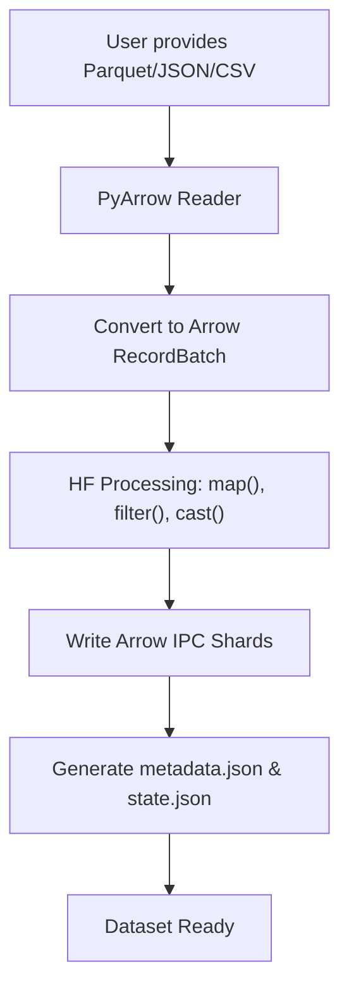
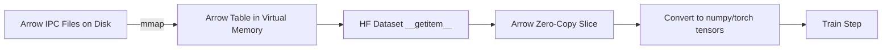
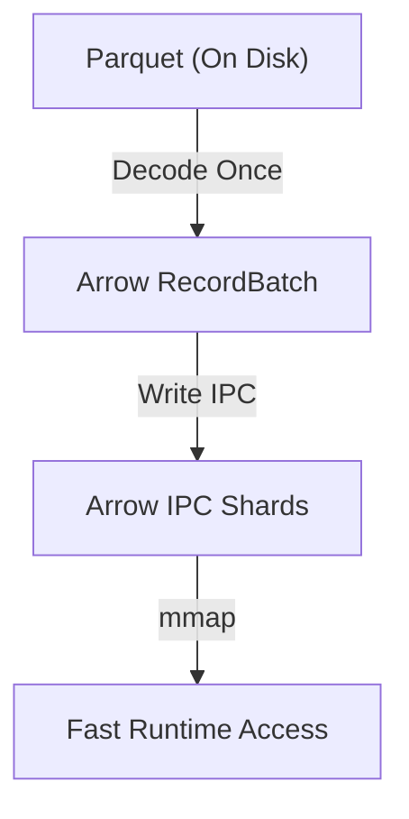
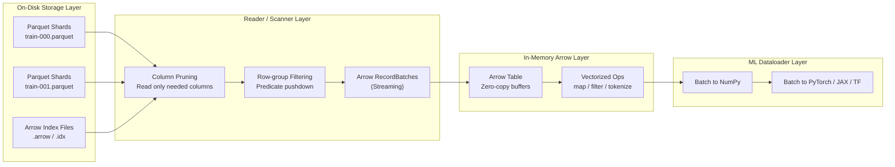

*By Gopi Krishna Tummala*

---

## TL;DR: The Golden Rule

**Store in Parquet, compute in Arrow, convert to tensors only when needed.**

This simple principle is the foundation of modern high-performance data pipelines. Parquet excels at storage efficiency and I/O optimization, while Arrow excels at in-memory computation and zero-copy operations. Together, they form the backbone of systems that can handle petabytes of data efficiently.

**Key Takeaways:**
- **Parquet** = Optimized for disk storage (best compression, column pruning, data skipping)
- **Arrow** = Optimized for in-memory compute (zero-copy, SIMD-ready, language-agnostic)
- **The Pattern**: Store data in Parquet → Convert to Arrow once → Use Arrow for all operations → Convert to tensors only at the final step
- **Real-World Impact**: This approach enables systems like HuggingFace Datasets to handle hundreds of GB on a laptop and scales to petabyte-scale training pipelines

---

## Introduction: The Library Analogy

Welcome to the cutting edge of data systems. While algorithms and hardware often take center stage, the unsung hero—or villain—of modern data processing is the way we structure data itself.

Imagine you have a massive library (your dataset). If the books are organized randomly, finding a single sentence takes forever. If they are perfectly shelved by topic (**columnar storage**), but the pages are written in a foreign language (unoptimized format), you still hit a wall.

This is the problem that formats like **Apache Parquet** and **Apache Arrow** solve. They are complementary standards for organizing the "pages" and "shelves" of our massive data libraries to maximize analytic performance.

**The Golden Rule:** Store in Parquet, compute in Arrow, convert to tensors only when needed. This principle guides every high-performance data pipeline in production today.

---

## 1. The Core Duo: Disk vs. Memory 💾/🧠

The fundamental trade-off in modern analytics is the split between **data at rest** (on disk) and **data in motion** (in memory).

### A. Apache Parquet: The Master of the Disk 🏆 (Data at Rest)

Parquet is a columnar storage format optimized for space efficiency and minimizing I/O operations. Think of Parquet as an **archivist** meticulously compressing and indexing data on permanent storage (like S3 or HDFS).

**How it works (The Columnar Advantage):**

Instead of storing a full row (e.g., all details for a single customer) together, Parquet stores all values for a single column (e.g., all customer names) together.

**Benefit:** Queries often only read a few columns. Parquet allows the system to skip reading irrelevant columns entirely (**column pruning**).

**Key Feature: Smart Encoding & Skipping:**

Parquet employs highly effective encoding techniques like:

- **Dictionary Encoding (DICT)**: Replaces repeated values with dictionary indices
- **Run-Length Encoding (RLE)**: Compresses sequences of identical values
- **Bit-Packed Encoding (BP)**: Efficiently stores small integer values

Crucially, it stores statistics like min/max values (**zone maps**) in its metadata for each **row group** (Parquet's fundamental unit for parallelism and filtering), allowing the engine to skip entire row groups (**data skipping**) when filtering.

**Trade-off:** Parquet is space-efficient, achieving the **best overall compression ratio**. A compression ratio of **0.13** means the file size is only **13% of the original uncompressed data size**—excellent for storage. However, getting the data ready for processing requires CPU-intensive **decoding** and **decompression** of these row groups.

**Example:**
```
Row-oriented (CSV-like):
Row 1: [Name: "Alice", Age: 30, City: "NYC", Salary: 100000]
Row 2: [Name: "Bob", Age: 25, City: "SF", Salary: 120000]

Columnar (Parquet):
Column Name: ["Alice", "Bob"]
Column Age: [30, 25]
Column City: ["NYC", "SF"]
Column Salary: [100000, 120000]
```

When querying for "average salary", Parquet only reads the Salary column, skipping Name, Age, and City entirely.

### B. Apache Arrow: The Speed Demon of RAM ⚡ (Data in Motion)

Arrow is a **language-agnostic, in-memory columnar data format** optimized for blazing-fast computation. If Parquet is the archivist, Arrow is the **zero-overhead desk organizer** for the CPU.

**How it works (Zero-Copy):**

Arrow defines a standardized memory layout that is ready for modern CPU architectures (like SIMD, or vectorization) and GPUs. Since all components of a query engine can understand this *exact* memory layout, data can be passed between different systems (Python/Pandas, Spark, C++, R) without costly **serialization** and **deserialization** (the **zero-copy** concept).

**The Arrow vs. Database Dilemma (Querying):**

Arrow is designed for high-speed interoperability. It supports logical encodings like **Dictionary Encoding**, but by default, it uses unencoded, native memory types for numeric data (no RLE/BP physical encoding). This means the data is largely unencoded, which is why it has a **poor compression ratio** (typically around 1.07 compression ratio by default, meaning the file is 107% of the original size—essentially no compression). The perceived difficulty in "querying" Arrow stems from this unencoded, **plain-memory** nature; traditional database systems prefer to query data that is already **encoded** to save space and enable *direct querying* in the encoded domain.

**Trade-off:** Arrow offers the **best decompression/transcoding throughput** (speed) but has the **worst compression ratio** without explicit encoding (size).

**Zero-Copy Example:**
```python
# Traditional approach (expensive):
pandas_df → serialize to JSON → network transfer → deserialize → numpy array
# Cost: Serialization + Network + Deserialization

# Arrow approach (zero-copy):
pandas_df → Arrow format → network transfer → Arrow format → numpy array
# Cost: Only network transfer (same memory layout everywhere)
```

---

## 2. The Trade-Offs: Performance vs. Storage Depth ⚖️

The core tension: you cannot have maximum compression *and* maximum speed simultaneously. This fundamental trade-off has been systematically evaluated in recent research [[1]](https://www.vldb.org/pvldb/vol16/p3044-liu.pdf), which provides the empirical foundation for understanding these format characteristics.

| Dimension | Parquet (On-Disk Optimized) | Arrow (In-Memory Optimized) | Key Learning |
| :--- | :--- | :--- | :--- |
| **Primary Goal** | Minimize disk size and I/O | Maximize in-memory compute speed | Different formats for different stages |
| **Compression Ratio** | **Best** (0.13 CR = 13% of original size) | **Worst** (1.07 CR = 107% of original size) | Compression is essential for I/O efficiency [[1]](https://www.vldb.org/pvldb/vol16/p3044-liu.pdf) |
| **Transcoding Speed** | Slower due to intensive decoding | **Fastest** (Zero-copy read capability) | Worse than Parquet (especially for Zstd/zlib) | Zero-copy is faster than decoding |
| **Data Skipping** | **Fine-Grained (Row Group-level)** | Only Chunk-level, requiring full chunk reading | Skipping only necessary data is critical for low-selectivity queries |
| **"Point Query" Access** | **Best** for very low selectivity (finding a few records) because it decodes only needed row groups | Worst by default, as it needs to load entire row batches | Format choice depends on query pattern |

### The Opportunity: A Unified Co-Design

Recent research by Liu et al. [[1]](https://www.vldb.org/pvldb/vol16/p3044-liu.pdf) demonstrates that the systems of the future will need to **co-design a unified in-memory and on-disk representation**. This means:

**Parquet needs an in-memory companion:**

Leveraging Parquet's encoded data *directly* in memory, avoiding the expensive conversion to Arrow when possible. An augmented Parquet variant showed up to **100x speedup** over the streaming baseline by adding an in-memory representation, direct query, and SIMD.

**Key Innovation:**
- Keep data in encoded format in memory
- Enable direct querying on encoded dictionaries
- Use SIMD operations for vectorized processing
- Avoid decompression until absolutely necessary

**Arrow needs more encoding:**

Implementing optimizations like **Direct Querying** (running predicates on the encoded dictionary) on Arrow files, which can lead to significant speedups (2x to 4x) by skipping the data decoding step.

**Key Innovation:**
- Add dictionary encoding support to Arrow
- Enable predicate pushdown on encoded data
- Maintain zero-copy benefits while gaining compression
- Bridge the gap between storage and compute efficiency

---

## 3. Large-Scale Data Loading and Inference Pipelines 🤖

The true value of this design lies in distributed systems and machine learning (ML) where **data movement** is the primary bottleneck.

### A. The Parquet ➡️ Arrow Pipeline (Loading)

In large-scale data loaders (like **Apache Spark**, **Dask**, or **dlt**), the combined format strategy is key:

**1. Storage (Parquet):**

The dataset is stored as **Parquet files** in a data lake for its compression and efficient columnar pruning capabilities. This minimizes cloud storage costs and I/O time.

**Benefits:**
- Reduced storage costs (10x compression typical)
- Faster data transfer from object storage
- Column pruning reduces I/O by 90%+ for selective queries
- Zone maps enable data skipping at file level

**2. Ingestion/Transformation (Arrow):**

When a data loader (e.g., PySpark) needs the data, it reads the Parquet file and converts it into an **Arrow Table** in memory.

**The Conversion Process:**
```
Parquet File (Disk)
  ↓ (Read + Decompress + Decode)
Arrow Table (Memory)
  ↓ (Zero-Copy Operations)
Pandas DataFrame / NumPy Array / Spark DataFrame
```

**3. Zero-Copy Execution:**

The data remains in the Arrow format while moving between Python (Pandas/NumPy) and the underlying C++/Java execution engines (like Spark or Ray). This **zero-copy interoperability** eliminates the serialization/deserialization bottleneck at every step of ETL/feature engineering.

**Real-World Example:**

Tools like **dlt** serialize data directly into Parquet from Arrow and deserialize directly back to Arrow, avoiding Python row-by-row processing and leveraging fast C++ libraries like `pyarrow`.

```python
# Traditional ETL (slow):
for row in csv_reader:
    process_row(row)  # Python loop, row-by-row
    write_to_parquet(row)

# Arrow-based ETL (fast):
arrow_table = pyarrow.read_csv(file)  # Bulk read
arrow_table = transform(arrow_table)  # Vectorized operations
pyarrow.write_table(arrow_table, "output.parquet")  # Bulk write
```

**Performance Gains:**
- 10-100x faster than row-by-row processing
- Memory efficient (no intermediate copies)
- Leverages SIMD for vectorized operations

### B. Arrow and Distributed Inference (Inference)

For large-scale ML inference pipelines, Arrow provides two crucial advantages for distributed computing:

**1. Distributed Data Transfer (Arrow Flight):**

In a cluster (like **Ray** or **Spark**) where models run across many nodes, data must be transferred quickly. **Arrow Flight** is an RPC framework specifically designed to stream large amounts of Arrow data across the network with **minimal overhead**. This is essential for low-latency, real-time analytics and distributed ML.

**How Arrow Flight Works:**

```
Client                    Server
  |                         |
  |-- Arrow Flight Request->|
  |                         |
  |<-- Arrow Batch Stream --|
  |<-- Arrow Batch Stream --|
  |<-- Arrow Batch Stream --|
```

**Key Features:**
- **Streaming**: Data flows as it's processed, not all at once
- **Zero-Copy**: Network protocol uses Arrow's memory layout directly
- **Parallel**: Multiple streams can run concurrently
- **Low Latency**: Optimized for real-time scenarios

**Use Cases:**
- Real-time feature serving
- Distributed model inference
- Stream processing pipelines
- Federated learning data transfer

**2. GPU Acceleration (RAPIDS):**

Arrow's standardized columnar memory format is optimized for **SIMD** and is the core format for GPU-accelerated libraries like **RAPIDS cuDF**. This allows data to be moved directly to the GPU for feature engineering and inference without expensive conversions, maximizing hardware utilization.

**The GPU Pipeline:**

```
CPU Memory (Arrow)
  ↓ (Direct Memory Transfer)
GPU Memory (cuDF)
  ↓ (GPU Processing)
GPU Results (cuDF)
  ↓ (Direct Memory Transfer)
CPU Memory (Arrow)
```

**Benefits:**
- **No CPU-GPU Conversion**: Arrow format is GPU-ready
- **SIMD Optimization**: Vectorized operations on GPU
- **Memory Efficiency**: Direct memory mapping
- **High Throughput**: Process billions of rows per second

**ML Framework Integration:**

ML frameworks like **TensorFlow I/O** and **PyTorch** also leverage Arrow for faster data ingestion into the training/inference loops.

**Example: TensorFlow with Arrow**
```python
import tensorflow_io as tfio

# Read Parquet directly into TensorFlow
dataset = tfio.IODataset.from_parquet("data.parquet")
# Arrow format is used internally for zero-copy transfer
```

**Example: PyTorch with Arrow**
```python
import pyarrow.parquet as pq

# Read Parquet to Arrow
table = pq.read_table("data.parquet")
# Convert to PyTorch tensor with minimal overhead
tensor = torch.from_numpy(table.column("features").to_numpy())
```

---

## 4. How Parquet and Arrow Coexist in Modern ML Dataloaders 🚀

Modern ML pipelines rarely choose **Parquet *or* Arrow** — they usually use **both**, because each solves a different problem.

A high-performance data stack typically looks like this:

* **Parquet** → efficient *storage*
* **Arrow** → efficient *in-memory compute*
* **DuckDB / HF Datasets / Ray / Spark** → engines that convert between them on the fly

This "storage vs memory" layering is exactly what gives today's ML workloads their speed.

### 🧱 Why Parquet + Arrow is the Winning Combination

**Parquet = Optimized Storage Format:**

* Columnar on disk
* Compressed (Snappy, ZSTD)
* Row-group layout enables scanning only required portions
* Ideal for data lakes, S3, long-term storage
* Cheap to store, cheap to transfer

**Arrow = Optimized In-Memory Compute:**

* Zero-copy buffers
* SIMD/vectorized execution
* Shared memory between languages (Python/C++/Rust)
* No decoding overhead
* Acts like NumPy for tabular data

**🔑 Together:**

> Store as Parquet → load only what you need → operate in Arrow → pass to the model/dataloader with zero-copy.

This is the core of fast ML data systems like **DuckDB**, **HuggingFace Datasets**, **Ray Data**, **Polars**, etc.

### 📘 Real-World Case Study: HuggingFace Datasets (HF)

HuggingFace Datasets is the most widely used ML dataloader today that combines **Parquet + Arrow** cleanly. Understanding how HF works internally reveals the true power of the Parquet → Arrow pipeline.

**🔹 The Core Idea: Parquet vs Arrow**

**Apache Parquet:**
* Optimized *on-disk* storage format
* Columnar, compressed, encoded
* Very cheap to store, scan, filter
* Not memory-mapped directly — must be decoded first
* Think: **cold format** (disk → CPU decoding → memory)

**Apache Arrow:**
* In-memory columnar format
* Zero-copy slicing
* Random access is near-instant
* Interoperates with GPUs, Pandas, DuckDB, Polars
* Think: **hot format** (RAM or memmap)

**🔹 How HF Stores Data Internally**

HF stores datasets as:

```
dataset/
  - data-00000-of-00001.arrow
  - data-00001-of-00001.arrow
  - state.json
  - metadata.json
```

**Even if the original source was Parquet.**

**Why Arrow IPC files instead of Parquet?**

* Arrow IPC (Feather) supports **memory-mapping**
* Parquet does not (requires decoding)
* Arrow supports **zero-copy slicing**, enabling random access by index
* HF needs fast `__getitem__(i)` for training

**🔹 The Two-Phase Lifecycle: Prepare Time vs Load Time**

#### 🧠 Prepare Time (Dataset Creation / Preprocessing Step)

This happens **once** when creating or preprocessing the dataset:

1. **Read Parquet** using pyarrow / fsspec / dataset streaming
2. Decode Parquet pages → Arrow record batches
3. Apply transformations (casting, tokenization if batched)
4. Write Arrow IPC shards: `data-xxxxx.arrow`
5. Build Arrow index metadata

⏳ **Cost**: Expensive  
🔧 **Why**: Parquet decoding + Arrow reshaping + writing shards

After this, dataset is *cached* and extremely fast to reload.

**The internal pipeline (simplified):**

```
User loads Parquet → HF reads batches → Converts to Arrow record batches 
→ Saves arrow file → mmap on read → zero-copy column access
```

#### ⚡ Load Time (During Training / Dataloader Epochs)

This happens **repeatedly** during training:

1. **Memory-map Arrow files**: `mmap("data-00000.arrow")`
2. Dataloader calls `dataset[i]`
3. HF slices the needed columns with **zero-copy Arrow slicing**
4. Converts to Python dict of numpy/pytensor for your framework
5. Yields the training batch

⏳ **Cost**: Extremely cheap  
🔧 **Why**: No decoding, no I/O except page faults

**🔹 The Correct Mental Model**

### ❌ Wrong (common misunderstanding)

> Dataloader loads Parquet directly at training time.

### ✔ Correct

> Dataloader loads **Arrow**, but Arrow was originally generated FROM Parquet.

**Key Insight:**

* **Parquet → Arrow conversion happens only once** (during prepare time)
* **Arrow → Training happens repeatedly** (during load time)

**Example:**
```python
from datasets import load_dataset

# Prepare time: Converts Parquet → Arrow IPC (happens once, cached)
dataset = load_dataset("squad")  # If source is Parquet, converts to Arrow

# Load time: Memory-maps Arrow files (happens every epoch, fast)
train_data = dataset["train"]
# Memory-mapped Arrow tables, not full RAM load

# Transformations happen in Arrow (zero-copy)
tokenized = train_data.map(tokenize_function, batched=True)
# Arrow buffers → Arrow buffers, no Python loops

# Only final batch converted to PyTorch
dataloader = DataLoader(tokenized, batch_size=32)
# Arrow → NumPy → PyTorch tensor (minimal overhead)
```

**🔹 End-to-End HF Dataset Flow**

The following diagrams illustrate the complete lifecycle:

**A. Dataset Creation Pipeline (Prepare Time):**



**B. Training-Time Random Access (Load Time):**



**C. Parquet vs Arrow Roles:**



**🔹 Case Study: Large Dataset Performance**

**Example: C4 Dataset**

* Source: web text in gzipped JSON
* HF preprocess step: JSON → Arrow → shard
* Runtime: Arrow shards → memory-mapped
* Training efficiency: **8–20x faster** vs json/parquet loading directly

**Example: BigCode / Stack-Dedup**

* Stored *directly* in Arrow shards
* Indexed efficiently
* Splits handled by slicing metadata
* Scales to **terabytes** on a single machine

This is why HF Datasets scale to **hundreds of GB** on a laptop—the memory-mapped Arrow files enable efficient random access without loading everything into RAM.

### 📦 What Dataloaders Use Parquet/Arrow?

The following table shows how different dataloaders handle Parquet and Arrow:

| Loader Type | Uses Parquet at Load Time? | Uses Arrow at Load Time? | Notes |
|------------|---------------------------|-------------------------|-------|
| **HF Datasets** | ❌ (only during initial prepare) | ✔ (runtime) | Most optimized for index-based access. Converts Parquet → Arrow IPC once, then memory-maps Arrow files. |
| **PyTorch `DataLoader` + manual Parquet** | ✔ (slow) | ❌ | Requires manual decoding every batch. Not recommended for large datasets. |
| **tf.data.experimental.make_csv_dataset** | ✔ | ❌ | Reads CSV/TFRecord from disk. No Arrow integration. |
| **Petastorm** | ✔ | Partial | Built for distributed training on Parquet — heavy decoding overhead. |
| **Ray Dataset** | ✔ | ✔ | Uses Arrow internally, reads Parquet into Arrow batches. Good for distributed training. |
| **Polars DataLoader** | ✔ | ✔ | Same pattern as Ray. Lazy evaluation with Arrow compute. |
| **DuckDB** | ✔ | ✔ | Queries Parquet directly, returns Arrow results. Excellent for feature stores. |

**Key Insight:** HF Datasets is the only mainstream loader that:
* Converts Parquet → Arrow IPC during prepare time
* Stores Arrow IPC shards on disk
* Memory-maps them for random access at load time

**✔ HuggingFace Datasets:**

* Internal storage: Arrow IPC files (memory-mapped)
* External storage: Parquet/sharded Parquet (converted once)
* Supports memory-mapped Arrow tables → zero-copy
* **Unique**: Only loader that pre-converts Parquet to Arrow IPC

**✔ Ray Data:**

* Reads/writes Parquet
* Converts partitions to Arrow for transformations
* Feeds Arrow batches to Ray Train/Torch DDP
* **Difference from HF**: Converts Parquet → Arrow on-the-fly, not pre-converted

**Example:**
```python
import ray.data as rd

# Read Parquet (converts to Arrow on-the-fly)
dataset = rd.read_parquet("s3://bucket/data/")

# Transform in Arrow
transformed = dataset.map_batches(
    preprocess_fn,
    batch_format="arrow"  # Uses Arrow format
)

# Feed to training
for batch in transformed.iter_torch_batches():
    # Arrow → PyTorch with minimal overhead
    train_step(batch)
```

**✔ DuckDB Dataloaders:**

* Parquet → Arrow Scanner → Arrow RecordBatch
* Used in ML feature stores (Feast, Tecton)
* **Difference from HF**: Queries Parquet directly, doesn't pre-convert

**Example:**
```python
import duckdb

# Query Parquet, get Arrow result
result = duckdb.sql("""
    SELECT * FROM 'data.parquet' 
    WHERE age > 30
""").arrow()

# Zero-copy Arrow table
# Can convert to Pandas/NumPy/PyTorch
```

**✔ PyTorch DataPipes:**

Some Torch DataPipes now support:

* Parquet datapipe
* Arrow datapipe
* Less common but growing
* **Note**: Still requires manual setup, not as optimized as HF

**✔ Polars LazyFrame + Torch Integration:**

* Polars performs compute in Arrow
* Scans Parquet lazily
* Can convert batches → NumPy → Torch tensors
* **Difference from HF**: Lazy evaluation, doesn't pre-convert to Arrow IPC

**Example:**
```python
import polars as pl
import torch

# Lazy scan Parquet
df = pl.scan_parquet("data/*.parquet")

# Compute in Arrow
result = df.filter(pl.col("age") > 30).collect()

# Convert to PyTorch
tensor = torch.from_numpy(result.to_numpy())
```

**✔ Spark / Glue / Databricks:**

* Uses Parquet for storage
* Arrow for Pandas UDFs and fast data interchange
* **Note**: Primarily batch processing, not optimized for random access like HF

### 🧭 Simple Mental Model

Here's a simple mental model for understanding the relationship:

**Parquet is like a compressed warehouse.  
Arrow is like unpacked items on the workbench.  
ML training is easier when items are on the workbench.**

**The Chef Analogy (for HF Datasets specifically):**

> Parquet is the "warehouse": efficient, compressed, long-term storage.  
> Arrow is the "kitchen line": fast, open containers ready to serve every item instantly.  
> HF Datasets is the "chef": it converts warehouse supplies (Parquet) to prep tables (Arrow), and during training, it just slices and serves without cooking again.

**The Classic Flow:**

* You store long-term data in Parquet (cheap, compressed).
* **Prepare time**: Convert Parquet → Arrow IPC once (the "prep work").
* **Load time**: Your ML engine memory-maps Arrow files (fast, zero-copy).
* Your dataloader feeds Arrow batches into the model.
* Nothing is wasted: no full reads, no full decompress, no repeated conversion.

This is why every modern ML infra stack uses this pattern. The key insight is that **the expensive conversion happens once**, and **the fast access happens repeatedly**.

### 🗺️ How Parquet & Arrow Coexist: The Data Flow

The following diagram illustrates how Parquet and Arrow work together in modern ML dataloaders:



**Key Flow Steps:**

1. **Storage Layer**: Data stored as sharded Parquet files with Arrow index files for fast random access
2. **Scanner Layer**: Column pruning and row-group filtering reduce I/O by reading only necessary data
3. **Arrow Layer**: Zero-copy buffers enable vectorized operations without Python loops
4. **Dataloader Layer**: Final conversion to framework-specific tensors (PyTorch, JAX, TensorFlow)

### 📊 Practical Benchmark: Parquet vs Arrow Query Performance

The performance difference illustrates the trade-off clearly:

**Pattern 1: Direct Parquet Query** (with column pruning and row group skipping)
- Reads only needed columns from disk
- Skips entire row groups based on zone maps
- Requires decoding/decompression

**Pattern 2: Arrow In-Memory Query** (after one-time conversion)
- Data already in memory (memory-mapped)
- Zero-copy operations
- No I/O overhead

**Typical Results:**
- **Parquet**: 0.5-2.0s (depends on selectivity, benefits from column pruning and row group skipping)
- **Arrow**: 0.1-0.5s (faster for repeated queries, no I/O overhead)

**Takeaway**: Parquet wins for one-time queries with high selectivity. Arrow wins for repeated queries or when data fits in memory. This is why the hybrid approach (store in Parquet, convert to Arrow once, then use Arrow) is optimal.

### ⚠️ Common Pitfalls in ML Dataloaders

**1. Arrow Table ≠ Arrow Dataset:**

```python
# ❌ Wrong: Loading entire dataset into memory
table = pq.read_table("large_dataset.parquet")  # OOM risk!

# ✅ Correct: Use streaming or memory-mapped access
dataset = pq.ParquetDataset("large_dataset/")  # Lazy loading
for batch in dataset.iter_batches():
    process(batch)
```

**2. Parquet ≠ Fast for Small Batch Random Access:**

```python
# ❌ Wrong: Random access on Parquet
for idx in random_indices:
    row = read_parquet_row("data.parquet", idx)  # Very slow!

# ✅ Correct: Use Arrow index or convert to Arrow first
arrow_table = pq.read_table("data.parquet")
for idx in random_indices:
    row = arrow_table.slice(idx, 1)  # Fast random access
```

**3. Arrow ≠ Good for Storage:**

```python
# ❌ Wrong: Storing Arrow files long-term
arrow_table.write_feather("data.arrow")  # Poor compression

# ✅ Correct: Store as Parquet, convert to Arrow when needed
arrow_table = pq.read_table("data.parquet")  # Better compression
```

### 💡 Rule of Thumb: When to Use What

| Use Case | Format | Reason |
|----------|--------|--------|
| Long-term storage | Parquet | Best compression, efficient I/O |
| Data lake / S3 | Parquet | Industry standard, cost-effective |
| In-memory analytics | Arrow | Zero-copy, SIMD optimization |
| ML training batches | Arrow | Fast conversion to tensors |
| Random access | Arrow (with index) | Fast lookups, memory-mapped |
| One-time queries | Parquet | Column pruning, data skipping |
| Repeated queries | Arrow | No repeated I/O overhead |
| Distributed transfer | Arrow Flight | Network-optimized streaming |

**The Golden Rule**: Store in Parquet, compute in Arrow, convert to tensors only when needed.

---

## 5. Encoding Techniques: The Compression Arsenal 🗜️

Understanding the encoding techniques is crucial for optimizing data pipelines.

### Dictionary Encoding (DICT)

**How it works:**
- Build a dictionary of unique values
- Replace values with dictionary indices
- Store dictionary separately

**Example:**
```
Original: ["NYC", "SF", "NYC", "LA", "SF", "NYC"]
Dictionary: {0: "NYC", 1: "SF", 2: "LA"}
Encoded: [0, 1, 0, 2, 1, 0]
```

**Benefits:**
- Excellent compression for low-cardinality columns
- Enables direct querying on encoded values
- Fast lookups via dictionary

**Trade-offs:**
- Dictionary must fit in memory
- Less effective for high-cardinality columns

### Run-Length Encoding (RLE)

**How it works:**
- Compress sequences of identical values
- Store as (value, count) pairs

**Example:**
```
Original: [1, 1, 1, 1, 2, 2, 3, 3, 3]
Encoded: [(1, 4), (2, 2), (3, 3)]
```

**Benefits:**
- Excellent for sorted or nearly-sorted data
- Very fast encoding/decoding
- Minimal CPU overhead

**Use Cases:**
- Time-series data
- Sorted columns
- Boolean columns

### Bit-Packed Encoding (BP)

**How it works:**
- Store small integers using minimal bits
- Pack multiple values into single bytes

**Example:**
```
Values: [3, 5, 2, 7] (all < 8, need 3 bits each)
Packed: 011 101 010 111 (12 bits = 1.5 bytes vs 16 bytes original)
```

**Benefits:**
- Maximum compression for small integers
- Direct bit manipulation
- SIMD-friendly operations

**Use Cases:**
- Integer IDs
- Enumerated types
- Small numeric ranges

### Delta Encoding

**How it works:**
- Store differences between consecutive values
- Often combined with RLE for sorted data

**Example:**
```
Original: [100, 102, 105, 109, 114]
Deltas: [100, +2, +3, +4, +5]
```

**Benefits:**
- Excellent for sorted sequences
- Smaller values compress better
- Works well with RLE

---

## 6. Zone Maps and Data Skipping: The Query Optimizer's Best Friend 🗺️

**Zone Maps** are metadata structures that store min/max values for data chunks, enabling powerful query optimizations.

### How Zone Maps Work

For each column chunk, Parquet stores:
- Minimum value
- Maximum value
- Null count
- Distinct count (optional)

**Example:**
```
Query: WHERE age > 50

Zone Map for age column:
Chunk 1: min=18, max=35  → Skip (all values < 50)
Chunk 2: min=25, max=45  → Skip (all values < 50)
Chunk 3: min=40, max=60  → Read (may contain values > 50)
Chunk 4: min=55, max=75  → Read (all values > 50)
```

**Result:** Only 2 out of 4 chunks need to be read, reducing I/O by 50%.

### Fine-Grained vs. Chunk-Level Skipping

**Parquet (Fine-Grained):**
- Row group-level statistics (zone maps)
- Can skip individual row groups based on min/max values
- Most granular skipping capability

**Arrow (Chunk-Level):**
- Only chunk-level statistics
- Must read entire chunk if any value matches
- Less efficient for selective queries

**ORC (Balanced):**
- Stripe-level statistics
- Smaller stripes than Arrow chunks
- Better than Arrow, worse than Parquet

### Real-World Impact

For a query selecting 1% of rows:
- **Parquet**: Reads ~1-5% of data (excellent skipping)
- **Arrow**: Reads ~10-20% of data (chunk-level only)

---

## 7. The Future: Unified Co-Design 🚀

The next generation of data systems will bridge the gap between Parquet and Arrow.

### Augmented Parquet: In-Memory Representation

**Key Innovations:**

1. **Direct Query on Encoded Data:**
   - Keep data in dictionary-encoded format in memory
   - Run predicates directly on dictionary indices
   - Avoid decompression until final output

2. **SIMD-Optimized Operations:**
   - Vectorized operations on encoded data
   - Leverage CPU SIMD instructions
   - Process multiple values in parallel

3. **Hybrid Format:**
   - Parquet on disk (compressed)
   - Augmented Parquet in memory (encoded but queryable)
   - Arrow for inter-system transfer (when needed)

**Performance Gains:**
- Up to **100x speedup** over streaming baseline [[1]](https://www.vldb.org/pvldb/vol16/p3044-liu.pdf)
- Maintains Parquet's compression benefits
- Gains Arrow's zero-copy advantages

### Enhanced Arrow: Encoding Support

**Key Innovations:**

1. **Dictionary Encoding in Arrow:**
   - Add dictionary type support
   - Enable direct querying on dictionaries
   - Maintain zero-copy semantics

2. **Predicate Pushdown:**
   - Run filters on encoded data
   - Skip decoding for filtered-out rows
   - 2x to 4x speedup demonstrated [[1]](https://www.vldb.org/pvldb/vol16/p3044-liu.pdf)

3. **Compression Options:**
   - Optional compression for Arrow files
   - Trade speed for storage when needed
   - Flexible compression levels

---

## 8. Practical Recommendations and Tools Integration 💡

### When to Use Parquet

✅ **Best for:**
- Long-term storage (data lakes, archives)
- High compression requirements
- Selective queries (low selectivity)
- Cost-sensitive storage (cloud object storage)
- Batch processing pipelines

**Example Use Cases:**
- Data warehouse storage
- ML training data archives
- Log file storage
- Historical data retention

### When to Use Arrow

✅ **Best for:**
- In-memory analytics
- Real-time processing
- Inter-system data transfer
- GPU acceleration
- Low-latency queries

**Example Use Cases:**
- Feature engineering pipelines
- Real-time dashboards
- Distributed ML inference
- Stream processing
- Interactive analytics

### Hybrid Approach: The Best of Both Worlds

**Recommended Pattern (The Golden Rule):**

```
Storage Layer:     Parquet (compressed, efficient)
  ↓
Ingestion Layer:   Parquet → Arrow (one-time conversion)
  ↓
Processing Layer:  Arrow (zero-copy, fast)
  ↓
Output Layer:      Arrow → Parquet (for persistence)
```

### Tools That Support This Pattern

**Apache Spark:**
- Native Parquet/Arrow support
- Reads Parquet with column pruning and row group skipping
- Converts to Arrow for zero-copy operations with Pandas

**Dask:**
- Seamless Parquet/Arrow integration
- Lazy loading from Parquet
- Automatic Arrow conversion for in-memory operations

**Polars:**
- Built on Arrow, writes Parquet
- All operations use Arrow format internally
- Zero-copy operations throughout

**DuckDB:**
- Optimized for both formats
- Queries Parquet directly with row group skipping
- Returns Arrow results for zero-copy access

**HuggingFace Datasets:**
- Converts Parquet → Arrow IPC once (prepare time)
- Memory-maps Arrow files for fast random access (load time)
- Enables handling massive datasets on consumer hardware

---

## 9. Performance Benchmarks and Real-World Impact 📊

### Compression Ratios

**Typical Compression Ratios (lower is better):**

| Format | Compression Ratio | Use Case |
|--------|------------------|----------|
| Parquet (Snappy) | 0.13-0.20 (13-20% of original) | Balanced compression/speed |
| Parquet (Zstd) | 0.10-0.15 (10-15% of original) | Maximum compression |
| Arrow (uncompressed) | 1.00-1.10 (100-110% of original) | Maximum speed |
| Arrow (compressed) | 0.20-0.30 (20-30% of original) | Balanced option |

### Query Performance

**Selective Query (1% selectivity):**

- **Parquet**: 10-50x faster than row-oriented (benefits from row group skipping)
- **Arrow**: 5-20x faster (if data fits in memory)

**Full Table Scan:**

- **Parquet**: 2-5x faster than row-oriented
- **Arrow**: 10-100x faster (zero-copy, SIMD)

### Storage Cost Impact

**Example: 1TB dataset**

| Format | Storage Size | Monthly Cost (S3) | Savings |
|--------|-------------|-------------------|---------|
| CSV | 1 TB | $23 | Baseline |
| Parquet | 130 GB (0.13 CR) | $3 | 87% savings |
| Arrow | 1.07 TB (1.07 CR) | $24.61 | No savings |

**Annual Savings with Parquet: $240 per TB**

---

## 10. Common Pitfalls and Best Practices ⚠️

### Common Mistakes

**1. Over-Partitioning Parquet Files:**
```python
# Bad: Too many small files
df.write.partitionBy("year", "month", "day", "hour", "minute").parquet("data/")
# Result: Millions of tiny files, poor performance

# Good: Balanced partitioning
df.write.partitionBy("year", "month").parquet("data/")
# Result: Reasonable file sizes, good performance
```

**2. Ignoring Column Order:**
```python
# Bad: Frequently queried columns last
schema = ["id", "metadata1", "metadata2", "name", "age"]  # name, age queried often

# Good: Frequently queried columns first
schema = ["name", "age", "id", "metadata1", "metadata2"]
# Enables better column pruning
```

**3. Wrong Compression Codec:**
```python
# Bad: Gzip (slow) for frequently accessed data
df.write.parquet("data/", compression="gzip")

# Good: Snappy (fast) for hot data, Zstd for cold data
df.write.parquet("data/", compression="snappy")  # Hot data
df.write.parquet("archive/", compression="zstd")  # Cold data
```

### Best Practices

**1. Optimal Row Group Size:**
- **Parquet**: 128MB - 1GB row groups
- Balance between skipping granularity and read efficiency
- Larger row groups = better compression, less skipping

**2. Column Ordering:**
- Put frequently queried columns first
- Put high-cardinality columns early
- Put filtering columns early

**3. Compression Selection:**
- **Snappy**: Fast, moderate compression (hot data)
- **Zstd**: Slower, excellent compression (cold data)
- **LZ4**: Very fast, good compression (real-time)

**4. Arrow Chunk Sizes:**
- **Small chunks**: Better for streaming, more overhead
- **Large chunks**: Better for batch processing, less overhead
- Typical: 64KB - 1MB per chunk

---

## Conclusion: The Path Forward

The core lesson for data engineers and ML practitioners is: **Parquet** wins the battle of **storage efficiency and I/O**, while **Arrow** is the **high-speed rail system** for data in motion, making both indispensable in modern large-scale pipelines.

Returning to our analogy: **Parquet is the archivist**—meticulously compressing and indexing data on permanent storage, enabling efficient retrieval through column pruning and row group skipping. **Arrow is the zero-overhead desk organizer**—ready for immediate use, optimized for the CPU, enabling zero-copy operations and blazing-fast computation.

**The Golden Rule (Revisited):**

> **Store in Parquet, compute in Arrow, convert to tensors only when needed.**

This principle encapsulates everything we've discussed:
- **Parquet** for the warehouse (storage efficiency, compression, I/O optimization)
- **Arrow** for the workbench (in-memory compute, zero-copy, SIMD-ready)
- **Tensors** only at the final step (when feeding the model)

**Key Takeaways:**

1. **Use Parquet for Storage**: Best compression (0.13 CR = 13% of original), excellent I/O efficiency, fine-grained row group skipping
2. **Use Arrow for Processing**: Zero-copy operations, SIMD optimization, language interoperability
3. **Hybrid Approach**: Store in Parquet, process in Arrow, write back to Parquet
4. **Future is Unified**: Next-gen systems will combine Parquet's encoding with Arrow's speed
5. **Choose Wisely**: Format selection depends on your query patterns and access patterns

**The Future:**

The next generation of data systems will bridge the gap, creating formats that offer:
- Parquet-level compression
- Arrow-level speed
- Unified in-memory and on-disk representation
- Direct querying on encoded data
- SIMD-optimized operations

As we build the data systems of tomorrow, understanding these fundamental trade-offs and design principles will be crucial for creating efficient, scalable, and cost-effective pipelines.

---

**Further Reading:**

- **Primary Research Paper**: Liu, Chunwei, et al. ["A Deep Dive into Common Open Formats for Analytical DBMSs"](https://www.vldb.org/pvldb/vol16/p3044-liu.pdf). Proceedings of the VLDB Endowment 16.11 (2023): 3044-3056. *This comprehensive evaluation of Parquet, Arrow, and ORC provides the empirical foundation for understanding format trade-offs and performance characteristics.*

- ["Apache Arrow and the Future of Data Frames" with Wes McKinney](https://www.youtube.com/watch?v=fyj4FyH3XdU)
- [Apache Parquet Documentation](https://parquet.apache.org/)
- [Apache Arrow Documentation](https://arrow.apache.org/)
- [Columnar Storage and Vectorization](https://www.cidrdb.org/cidr2023/papers/p69-li.pdf)

---

*Understanding data formats is fundamental to building efficient ML systems. In production, the choice between Parquet and Arrow can mean the difference between a pipeline that costs thousands per month versus one that costs hundreds.*

