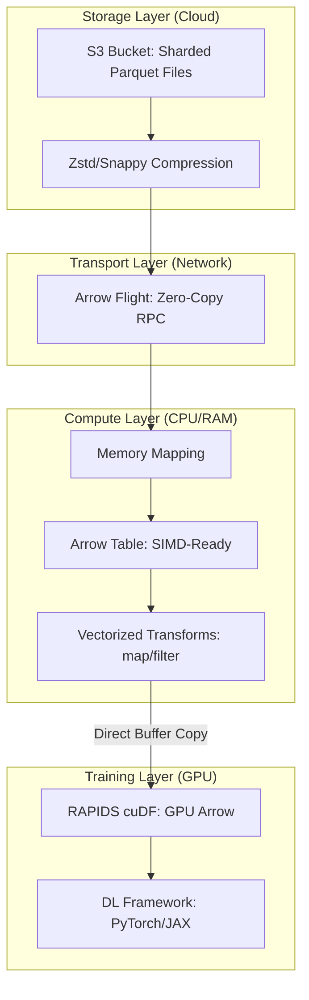

*By Gopi Krishna Tummala*

---

  
Infrastructure-First MLOps — Building the Engine of AI

  

    <a href="/posts/mlops/parquet-arrow-quest-for-analytic-speed" style="background: rgba(255,255,255,0.25); padding: 0.5rem 1rem; border-radius: 6px; text-decoration: none; color: white; font-weight: 600; border: 2px solid rgba(255,255,255,0.5);">Module 1: Data DNA</a>
    <a href="/posts/mlops/datasets-and-dataloaders" style="background: rgba(255,255,255,0.1); padding: 0.5rem 1rem; border-radius: 6px; text-decoration: none; color: white; opacity: 0.9;">Module 2: Dataloaders</a>
    <a href="/posts/mlops/hidden-engine-of-ai" style="background: rgba(255,255,255,0.1); padding: 0.5rem 1rem; border-radius: 6px; text-decoration: none; color: white; opacity: 0.9;">Module 3: Training</a>
    <a href="/posts/mlops/modern-post-training-peft-2026" style="background: rgba(255,255,255,0.1); padding: 0.5rem 1rem; border-radius: 6px; text-decoration: none; color: white; opacity: 0.9;">Module 4: Post-Training</a>
    <a href="/posts/mlops/vllm-trilogy-of-modern-llm-scaling" style="background: rgba(255,255,255,0.1); padding: 0.5rem 1rem; border-radius: 6px; text-decoration: none; color: white; opacity: 0.9;">Module 5: Serving</a>
    <a href="/posts/mlops/custom-kernel-craze" style="background: rgba(255,255,255,0.1); padding: 0.5rem 1rem; border-radius: 6px; text-decoration: none; color: white; opacity: 0.9;">Module 6: Kernels</a>
    <a href="/posts/mlops/beyond-inference-agentic-mlops-mcp" style="background: rgba(255,255,255,0.1); padding: 0.5rem 1rem; border-radius: 6px; text-decoration: none; color: white; opacity: 0.9;">Module 7: Agentic AI</a>
  

  
📖 You are reading <strong>Module 1: Data DNA</strong> — Parquet, Arrow, and Speed

---

### Act 0: Data DNA in Plain English

Imagine you are moving houses. You have two ways to pack your stuff:

1.  **Row-Based Packing (CSV):** You pack one room into one giant box. Bed, clothes, toiletries, and snacks are all mixed together. If you just want a snack, you have to open the "Bedroom" box and dig through the mattress and socks. This is slow and messy.
2.  **Columnar Packing (Parquet):** You pack all "Clothes" in one box, all "Snacks" in another, and all "Mattresses" in another. If you want a snack, you grab the snack box and you're done.

**Parquet** is the king of **Long-Term Storage (The Warehouse)**. It squeezes data down to 10% of its original size and organizes it into these "Topic Boxes" (Columns).

**Arrow** is the king of **The Workbench (In-Memory)**. Once you open the Parquet boxes, Arrow lays everything out on a conveyor belt so the CPU can process it 100x faster than a human could.

The Golden Rule of MLOps: **Store in Parquet, Compute in Arrow.**

---

### Act I: The Core Duo — Disk vs. Memory

#### 1. Apache Parquet: The Archivist (Data at Rest)
Parquet is optimized for **Disk I/O** and **Cost**. It uses "Columnar Pruning"—if your model only needs the "Temperature" and "Timestamp" columns, it skips the other 50 columns in the file entirely.

*   **Key Trick: Zone Maps.** Parquet stores the Min and Max values for every chunk of data. If you query `WHERE temperature > 100`, and a chunk says `Min: 20, Max: 40`, Parquet doesn't even open that chunk. It just skips it.

#### 2. Apache Arrow: The High-Speed Rail (Data in Motion)
Arrow is optimized for **CPU Throughput**. Traditional data formats force you to "Serialize" (convert to text like JSON) and "Deserialize" (convert back to math) every time you move data between Python and C++.

*   **Key Trick: Zero-Copy.** Arrow uses the *exact same* memory layout for every programming language. Python, C++, and Rust can all look at the same piece of RAM without moving or converting a single bit.

---

#### Act I.V: Mature Architecture — The "Gold Standard" Pipeline

In a 2025 production ML environment, we avoid Python row-loops like the plague. We use a "Storage-to-Silicon" pipeline where data is never fully "unpacked" until it hits the GPU.

**The Data DNA Pipeline:**

##### 1. Arrow Flight: The Protocol
Traditionally, moving data from a database to a worker node used ODBC/JDBC (Slow). **Arrow Flight** is an RPC framework that sends Arrow buffers directly over the wire. It is parallel by design, allowing 10 servers to stream data to 10 workers simultaneously.

##### 2. Trade-offs & Reasoning
*   **Parquet vs. Arrow for Storage:** Why not store everything in Arrow? *Trade-off:* Arrow has **zero compression** by default (to stay fast). A 1TB dataset in Parquet might be 10TB in Arrow. We trade CPU cycles (decoding Parquet) for storage savings.
*   **Row-Group Size:** If your row-groups are too small, Parquet's metadata becomes a bottleneck. If they are too large, "Zone Maps" can't skip data effectively. The mature sweet spot is **128MB to 512MB** per row-group.
*   **Citations:** *A Deep Dive into Common Open Formats for Analytical DBMSs (VLDB 2023)* and *Apache Arrow: A Cross-Language Development Platform for In-Memory Data (2022)*.

---

### Act II: System Design & Interview Scenarios

#### Scenario 1: The "Small File" Problem
*   **Question:** "Your data pipeline produces 1,000,000 small 1KB Parquet files. Training is extremely slow. What do you do?"
*   **Answer:** Discuss **File Compaction**. S3 and HDFS hate small files. You should implement a "Compactor" service that merges these tiny shards into larger 256MB Parquet files. Mention that this also improves the effectiveness of **Zone Map skipping**.

#### Scenario 2: Python GIL Bottlenecks
*   **Question:** "Your CPU is at 100% and your GPU is at 5%, waiting for data. Your preprocessing is in Pandas. How do you fix it?"
*   **Answer:** Discuss **Polars** or **PyArrow**. Standard Pandas uses a single CPU core and triggers the Python GIL. PyArrow/Polars are written in C++/Rust; they release the GIL and use all CPU cores to decompress Parquet into Arrow buffers in parallel.

#### Scenario 3: Memory-Mapping vs. Full Load
*   **Question:** "You have a 500GB dataset but only 64GB of RAM. How do you train a model?"
*   **Answer:** Use **Arrow Memory-Mapping (mmap)**. Instead of loading the data into RAM, the OS "points" to the file on disk. As the model requests data, the OS swaps only the needed pages into RAM. This is how HuggingFace Datasets handles massive data.

---

### Graduate Assignment: The I/O Calculator

**Task:**
You have a 10TB uncompressed dataset.
1.  **Storage:** If Parquet (Zstd) achieves a 0.15 compression ratio, how much space do you need on S3?
2.  **Throughput:** Your network is 10Gbps. How long does it take to move the *uncompressed* data vs. the *compressed* Parquet data to your worker node?
3.  **The Optimization:** If you only need 3 columns out of 100, and those 3 columns represent 5% of the data, what is your theoretical maximum speedup using **Columnar Pruning**?

---

**Further Reading:**
*   *VLDB 2023: A Deep Dive into Common Open Formats.*
*   *HuggingFace Blog: How we handle datasets with 100B+ tokens.*
*   *Apache Arrow Documentation: The memory layout specification.*

---

**Previous:** [MLOps Roadmap](/posts/mlops/infrastructure-first-mlops-roadmap)

**Next:** [Module 2 — Dataloaders: The Pump of AI](/posts/mlops/datasets-and-dataloaders)
