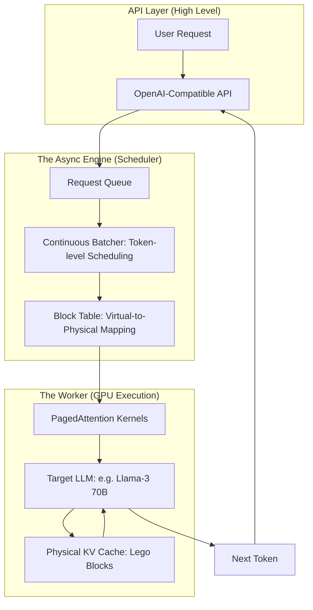

*By Gopi Krishna Tummala*

---

  
Infrastructure-First MLOps — Building the Engine of AI

  

    <a href="/posts/mlops/parquet-arrow-quest-for-analytic-speed" style="background: rgba(255,255,255,0.1); padding: 0.5rem 1rem; border-radius: 6px; text-decoration: none; color: white; opacity: 0.9;">Module 1: Data DNA</a>
    <a href="/posts/mlops/datasets-and-dataloaders" style="background: rgba(255,255,255,0.1); padding: 0.5rem 1rem; border-radius: 6px; text-decoration: none; color: white; opacity: 0.9;">Module 2: Dataloaders</a>
    <a href="/posts/mlops/hidden-engine-of-ai" style="background: rgba(255,255,255,0.1); padding: 0.5rem 1rem; border-radius: 6px; text-decoration: none; color: white; opacity: 0.9;">Module 3: Training</a>
    <a href="/posts/mlops/modern-post-training-peft-2026" style="background: rgba(255,255,255,0.1); padding: 0.5rem 1rem; border-radius: 6px; text-decoration: none; color: white; opacity: 0.9;">Module 4: Post-Training</a>
    <a href="/posts/mlops/vllm-trilogy-of-modern-llm-scaling" style="background: rgba(255,255,255,0.25); padding: 0.5rem 1rem; border-radius: 6px; text-decoration: none; color: white; font-weight: 600; border: 2px solid rgba(255,255,255,0.5);">Module 5: Serving</a>
    <a href="/posts/mlops/custom-kernel-craze" style="background: rgba(255,255,255,0.1); padding: 0.5rem 1rem; border-radius: 6px; text-decoration: none; color: white; opacity: 0.9;">Module 6: Kernels</a>
    <a href="/posts/mlops/beyond-inference-agentic-mlops-mcp" style="background: rgba(255,255,255,0.1); padding: 0.5rem 1rem; border-radius: 6px; text-decoration: none; color: white; opacity: 0.9;">Module 7: Agentic AI</a>
  

  
📖 You are reading <strong>Module 5: LLM Serving</strong> — vLLM and the Trilogy of Speed

---

### Act 0: LLM Serving in Plain English

Imagine you are running a very busy hotel (The GPU). Every guest (User Request) needs a room to stay in. In a traditional hotel, you have to give every guest a giant "Penthouse Suite" (Fixed memory block) even if they only have one small suitcase. 

If 10 guests arrive, you're full, even if 90% of the rooms are empty space! This is called **Memory Fragmentation**.

**vLLM** is like a magic hotel where:
1.  **PagedAttention:** Guests don't get suites. They get "Lego Bricks" of space. If they buy more souvenirs (generate more tokens), you just snap another Lego brick onto their pile, wherever it fits in the building. No space is ever wasted.
2.  **Continuous Batching:** You don't wait for a busload of guests to arrive before checking them in. As soon as someone walks through the door, they get a room and a key instantly, even if other guests are already sleeping.

The result? You can fit **10x more guests** in the same building, and nobody has to wait in the lobby.

---

### Act I: The Hidden Cost of Conversation (The KV Cache)

Before we can appreciate vLLM's genius, we must understand the core problem in LLM inference.

When an AI generates a response, it operates one token at a time. To stay coherent, it must look back at everything that came before. This history is stored in the **KV Cache** (Key-Value Cache).

| Component | Function |
| :--- | :--- |
| **Key ($K$)** | The "Passport" of the token (its identity). |
| **Value ($V$)** | The "Luggage" of the token (its meaning). |

**The Bottleneck:** The KV Cache grows linearly. A 10,000-token document requires a massive amount of high-speed GPU memory. In traditional systems, when the "desk" (GPU memory) overflows, you get **OOM (Out-of-Memory)** errors.

---

#### Act I.V: Mature Architecture — The vLLM Inference Stack

In 2025, production LLM serving has moved beyond simple wrappers. The "Mature Architecture" is a high-performance **Async Engine** that decouples the API from the GPU execution.

**The vLLM Pipeline (Mature Architecture):**

##### 1. Continuous Batching: The Scheduler
Traditional batching (Static) waits for 16 requests, processes them, and returns them all at once. If Request 1 finishes in 5 tokens and Request 2 needs 500, Request 1's GPU resources sit idle for 495 cycles. 
*   **vLLM's Way:** It schedules at the **token level**. Every iteration, it packs the batch with as many active tokens as possible, regardless of when the request started.

##### 2. PagedAttention: The Memory Manager
Inspired by Operating Systems (Paging), vLLM treats GPU memory as a pool of blocks. 
*   **Logical Blocks:** The user's conversation (tokens 0-15, 16-31).
*   **Physical Blocks:** Scattered slots in GPU memory.
*   **Sharing:** If 100 users are chatting about the same PDF, vLLM stores the PDF's KV cache **once** and points all 100 users to the same physical blocks.

---

### Act II: The Math of Scaling

Stories are fun, but the math determines your profit margins. Two axes pin every serving stack: **memory footprint** and **throughput**.

#### 1. The Effective Throughput
Naive serving throughput is limited by the maximum batch size that fits in contiguous memory. vLLM increases this by near-zero fragmentation ($<1\%$ waste).

$$\text{Throughput} \approx \frac{\text{VRAM}_{\text{total}} - \text{VRAM}_{\text{weights}}}{\text{KV Cache per Token} \times \text{Avg Sequence Length}}$$

#### 2. Time-to-First-Token (TTFT) vs. Inter-Token Latency (ITL)
*   **TTFT:** Speed of the "Prefill" phase (processing your prompt).
*   **ITL:** Speed of the "Decode" phase (generating each word).
vLLM's **Chunked Prefill** (2024 trend) allows the engine to process new prompts without "stalling" the generation of existing responses.

---

### Act III: 2025 Trends — Speculative & Quantized

#### 1. Speculative Decoding (The "Fast Sketch")
We use a 1B "Drafter" model to guess 5 tokens. The 70B "Target" model verifies them in one millisecond. If the guess was right, we generated 5 tokens for the cost of 1.
*   **Interview Question:** "Is Speculative Decoding always faster?"
    *   *Answer:* No. If the drafter is "dumb" and the target rejects every guess, you pay the drafter's latency for nothing. It only works if the models are "aligned."

#### 2. FP8 & FP4 Quantization
Weights are moving from 16-bit to 8-bit (lossless) or 4-bit (minimal loss). 
*   **Benefit:** A 70B model that needed 140GB of VRAM now fits in 40GB, running on a single A100 instead of a massive cluster.

---

### Act IV: System Design & Interview Scenarios

#### Scenario 1: The "Spiky" Traffic
*   **Question:** "Your chatbot is viral on Twitter. Throughput is high, but users complain that individual responses are taking 30 seconds to finish. What is happening?"
*   **Answer:** This is **Queue Saturation**. Your GPU is 100% utilized, but the batch is full. You need to implement **Request Prioritization** or **Dynamic Load Balancing** across multiple vLLM instances.

#### Scenario 2: RAG & Prefix Caching
*   **Question:** "You are building a Legal AI that answers questions about a 500-page contract. Every user asks about the same document. How do you optimize this?"
*   **Answer:** Mention **Automatic Prefix Caching (APC)**. vLLM can detect that the first 5,000 tokens (the contract) are identical across requests and "lock" those KV blocks in memory so they are never recomputed.

---

### Graduate Assignment: The Memory Wall

**Task:**
Calculate the KV cache size for a Llama-3 70B model with:
*   Context Length: 4096 tokens
*   Precision: 16-bit (2 bytes)
*   Layers: 80
*   Heads: 64
*   Head Dim: 128

1.  **The Calc:** How many GB of VRAM does *one* user's history consume?
2.  **The Profit:** If you have an 80GB H100 GPU and the weights take up 140GB (unquantized), how many GPUs do you need just to serve **one** user? Now, quantize to 4-bit and recalculate.

---

**Further Reading (State-of-the-Art):**
*   *Efficient Memory Management for Large Language Model Serving with PagedAttention (SOSP 2023)* - The original vLLM paper.
*   *Fast Inference from Transformers via Speculative Decoding (ICML 2023)*.
*   *AWQ: Activation-aware Weight Quantization for LLM Compression (MLSys 2024)*.
*   *FlashAttention-3: Fast and Accurate Attention with Sparsity (2024)*.

---

**Previous:** [Module 4 — Post-Training (PEFT & Alignment)](/posts/mlops/modern-post-training-peft-2026)

**Next:** [Module 6 — Custom Kernels](/posts/mlops/custom-kernel-craze)
