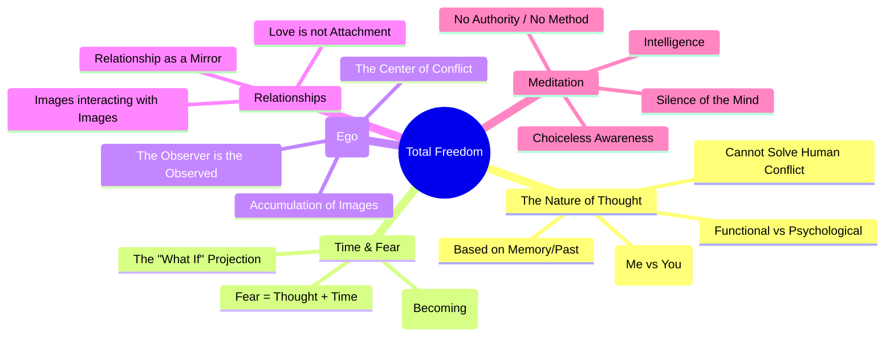

*By Gopi Krishna Tummala*

---

Jiddu Krishnamurti spent his life exploring one simple, yet terrifying question: **Can a human mind be completely free?**

I don't mean free politically or financially. I mean free inwardly. Free from the constant hum of anxiety, the pressure of comparison, the weight of past regrets, and the relentless psychological noise that follows us from the office to the dinner table.

Though he spoke to millions for over 60 years, his message was anti-authority. He famously stated:

> "Truth is a pathless land."

He believed that no guru, book, or technique can hand you peace. It must be **seen directly**, through your own radical attention.

## Why This Matters Now (More Than Ever)

In an age of endless notifications, productivity guilt, and social-media-driven identity, Krishnamurti's teachings feel surprisingly urgent. We are more connected than ever, yet we feel increasingly fragmented.

He invites us to look at the glitches in our own operating systems:

* Why do we react with anger before we even understand the trigger?
* How does **fear** silently dictate our career choices?
* Why does comparing ourselves to others kill our creativity?
* Why is it so difficult to just *sit quietly* with ourselves?

His approach isn't just philosophy—it is **practical psychology**. It starts with learning how to look.

## The Core Concept: Choiceless Awareness

Most self-improvement advice tells you to *do* something: meditate for 20 minutes, recite affirmations, or force positive thinking.

Krishnamurti suggests the opposite. He introduces the concept of **"Choiceless Awareness."**

This is the act of observing your thoughts and emotions without naming, judging, or trying to change them. It is different from concentration (which is narrowing your focus); awareness is an open, panoramic view.

Think of it like sitting on a riverbank watching the water flow:

1. **The Thought Arises:** "I am worried about that meeting."

2. **The Reaction:** Usually, we say, "Stop worrying, be positive." (This is conflict).

3. **The Awareness:** Instead, you simply observe the worry. You watch it come, you feel the physical sensation of it, and you watch it go.

When you observe without interference, a strange alchemy happens. Fear begins to dissolve not because you fought it, but because you *understood* it.

## Why I'm Starting This Series

As I revisited Krishnamurti's talks, I realized they deserve a structured, modern reinterpretation. His language can sometimes be abstract, but the utility of his message is profound for developers, leaders, parents, and creators.

This series is not about worshipping a teacher; it is about investigating ourselves. We will break down his ideas into:

* **Practical Insights:** Translating "J-Krish" speak into modern concepts.
* **Daily Experiments:** Small acts of observation you can try during your workday.
* **Real-life Scenarios:** Handling conflict, stress, and ambition.

If you are tired of "fixing" yourself and ready to start "understanding" yourself, join me.

## The Core Pillars of Krishnamurti's Teachings

To organize Jiddu Krishnamurti's vast philosophy into a structured format is a challenge because he always emphasized that truth is "pathless" and cannot be systemized. However, for the sake of study and clarity, we can categorize his insights into core pillars.

This table breaks down his philosophy into themes, the specific insight, and the practical implication for daily life:

| Theme | Key Insight | Practical Application |
| :--- | :--- | :--- |
| **Truth & Authority** | "Truth is a pathless land." No guru, book, or religion can lead you to it. You must be your own light. | Stop looking for external validation or "how-to" guides for happiness. Observe your own mind directly. |
| **The Nature of Thought** | Thought is a material process based on memory (the past). It is limited and cannot solve human psychological problems. | Distinguish between *functional thought* (planning, coding) and *psychological thought* (worry, identity). Don't use thought to fix the self. |
| **Time (Psychological)** | There is chronological time (clock) and psychological time ("I will become better"). Psychological time is the root of fear. | Stop saying "I will change tomorrow." Transformation must happen **now** or not at all. The future is a projection of the past. |
| **The Observer & Observed** | "The observer is the observed." The "I" analyzing the anger *is* the anger. There is no separate self controlling the mind. | When angry, don't say "I am angry" (separation). Realize you *are* that anger. Stay with the sensation without splitting into a judge. |
| **Fear & Pleasure** | Fear and pleasure are two sides of the same coin. Both are sustained by thought projecting images of the past or future. | Instead of suppressing fear or chasing pleasure, observe the *craving* behind them. Watch the mind's movement away from "what is." |
| **Choiceless Awareness** | Observation without judgment, choice, or condemnation. Pure seeing without the interference of the "Me." | Practice watching your thoughts like a river. Don't block them, don't hold them. Just watch. This silence brings clarity. |
| **Relationship** | Relationship is a mirror. We usually relate to an *image* we have of others, not the person. Conflict arises when images clash. | Look at your partner/friend without the accumulated memories of past insults or pleasures. Look at them afresh, as if for the first time. |
| **Love & Compassion** | Love is not attachment, jealousy, or possession. Love can only exist when the "Self" (ego) is not there. | If you are attached, you are not loving; you are needing. True compassion arises when the division between "you" and "me" ends. |
| **Meditation** | Meditation is not a practice, posture, or system. It is a state of mind where the brain is quiet and extremely alert. | Don't force concentration. Be aware of your environment, your thoughts, and your feelings simultaneously. Silence is a result, not a goal. |

## The Structure of Freedom: A Mind Map

Below is a conceptual mind map of how these teachings connect. The central node is **"Total Freedom"** (The Human Condition), and everything branches from the nature of the Mind.

## Series Roadmap

Based on this framework, here is the logical progression of this series:

* **Part 2: Understanding Thought** — The distinction between functional and psychological thought
* **Part 3: Fear & Time** — Why time is the root of fear
* **Part 4: The Trap of "Becoming"** — Why self-improvement obsession prevents actual change
* **Part 5: Relationship and Images** — Looking at others without the screen of past judgments
* **Part 6: The Screen of Images** — How labels and memories block direct perception
* **Part 7: What is True Meditation?** — The silence in which the self is not

---

  
Krishnamurti Learning Series

  <h3 style="margin: 0 0 1rem 0; font-size: 1.5rem; color: white;">Ready to begin?</h3>
  

    <a href="/posts/krishnamurti-part-2-thought" style="background: white; padding: 0.75rem 1.5rem; border-radius: 50px; text-decoration: none; color: #667eea; font-weight: 700; transition: all 0.2s ease; box-shadow: 0 2px 4px rgba(0,0,0,0.1);">Read Part 2: Understanding Thought &rarr;</a>
  

  

    Next, we explore why thought is an excellent servant but a terrible master, and how to tell the difference.
  

