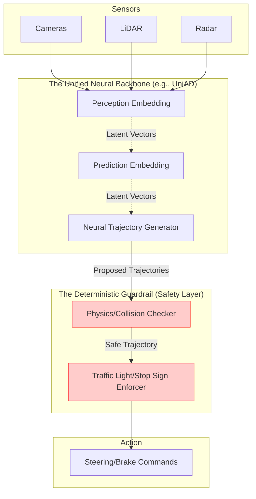

*By Gopi Krishna Tummala*

---

  
The Ghost in the Machine — Building an Autonomous Stack

  

    <a href="/posts/robotics/autonomous-stack-module-1-architecture" style="background: rgba(255,255,255,0.25); padding: 0.5rem 1rem; border-radius: 6px; text-decoration: none; color: white; font-weight: 600; border: 2px solid rgba(255,255,255,0.5);">Module 1: Architecture</a>
    <a href="/posts/robotics/autonomous-stack-module-2-sensors" style="background: rgba(255,255,255,0.1); padding: 0.5rem 1rem; border-radius: 6px; text-decoration: none; color: white; opacity: 0.9;">Module 2: Sensors</a>
    <a href="/posts/robotics/autonomous-stack-module-3-calibration" style="background: rgba(255,255,255,0.1); padding: 0.5rem 1rem; border-radius: 6px; text-decoration: none; color: white; opacity: 0.9;">Module 3: Calibration</a>
    <a href="/posts/robotics/autonomous-stack-module-4-localization" style="background: rgba(255,255,255,0.1); padding: 0.5rem 1rem; border-radius: 6px; text-decoration: none; color: white; opacity: 0.9;">Module 4: Localization</a>
    <a href="/posts/robotics/autonomous-stack-module-5-mapping" style="background: rgba(255,255,255,0.1); padding: 0.5rem 1rem; border-radius: 6px; text-decoration: none; color: white; opacity: 0.9;">Module 5: Mapping</a>
    <a href="/posts/robotics/autonomous-stack-module-6-perception" style="background: rgba(255,255,255,0.1); padding: 0.5rem 1rem; border-radius: 6px; text-decoration: none; color: white; opacity: 0.9;">Module 6: Perception</a>
    <a href="/posts/robotics/autonomous-stack-module-7-prediction" style="background: rgba(255,255,255,0.1); padding: 0.5rem 1rem; border-radius: 6px; text-decoration: none; color: white; opacity: 0.9;">Module 7: Prediction</a>
    <a href="/posts/robotics/autonomous-stack-module-8-planning" style="background: rgba(255,255,255,0.1); padding: 0.5rem 1rem; border-radius: 6px; text-decoration: none; color: white; opacity: 0.9;">Module 8: Planning</a>
    <a href="/posts/robotics/autonomous-stack-module-9-foundation-models" style="background: rgba(255,255,255,0.1); padding: 0.5rem 1rem; border-radius: 6px; text-decoration: none; color: white; opacity: 0.9;">Module 9: Foundation Models</a>
  

  
📖 You are reading <strong>Module 1: The "Why" and The Architecture</strong> — Act I: The Body and The Senses

---

### Act 0: Architecture in Plain English

Building a self-driving car is like trying to build a robot that can play professional soccer in the middle of a busy highway, during a rainstorm, without ever making a single mistake.

Most software we use (like Instagram or Gmail) can crash once in a while, and it's fine. But in Autonomous Vehicles (AVs), a "crash" in the software can mean a real crash on the road.

**The "Stack"** is just the order in which the car's brain works:
1.  **Sensors:** "I feel something." (Eyes, Ears, Touch)
2.  **Perception:** "I see a pedestrian." (Understanding)
3.  **Localization:** "I am at the corner of 5th and Main." (Map)
4.  **Prediction:** "That pedestrian is going to step into the road." (Fortune Telling)
5.  **Planning:** "I should brake now to stay safe." (Decision Making)
6.  **Control:** "Applying 20% brake pressure." (Action)

If any one of these steps is too slow or makes a mistake, the whole system fails.

---

### Act I: Why L5 is Harder Than a Moon Landing

Imagine you're driving through San Francisco. All of this happens in the span of 2 seconds: A pedestrian steps off the curb. A cyclist swerves. A light turns yellow. A human driver handles this in under 200 milliseconds.

Landings on the moon are **deterministic**: physics is predictable, and you have one shot. Driving is **probabilistic**: it's a messy nightmare of human irrationality, and you have to get it right **every single time** over billions of miles.

---

### Act II: Operational Design Domain (ODD)

**ODD** is the "Contract" of the car. It defines where and when the car is allowed to drive.
*   **Dimensions:** Geography (SF vs. Phoenix), Weather (Sun vs. Snow), Time (Day vs. Night).
*   **The Math of Failure:** The more cities you add, the more "Edge Cases" you hit. 

> **Interview Pro-Tip:** If asked "How do you scale an AV business?", talk about **ODD Expansion**. You don't just "turn it on" everywhere. You start in a simple city (Phoenix - flat, sunny) and slowly add "complexity" (SF - hills, fog, cable cars) only after the system is proven.

---

### Act III: The Latency Loop (100ms to React)

If a car is moving at 30mph, it travels **4.4 feet** every 100 milliseconds. If your software takes 500ms to "think," you've traveled 22 feet before you even start braking.

**The Latency Budget:**
*   Sensors: 10ms
*   Perception: 30ms
*   Planning: 20ms
*   Actuators: 40ms
*   **Total: ~100ms**

If your new AI model makes Perception 20ms slower, you've just made the car significantly less safe. Every millisecond is a "currency" you have to spend wisely.

---

### Act IV: Compute Constraints (Power vs. Heat)

A self-driving car is basically a **Server Room on Wheels**. 
*   **Power:** Huge computers eat battery life. 
*   **Heat:** These chips get hot. You need fans and cooling, which eat *more* battery life.
*   **The Trade-off:** You want the smartest AI (highest accuracy), but you need it to run on a chip that doesn't melt the car.

---

### Act V: The 99.9999% Problem

Human drivers are actually very good—we have 1 fatality per 100 million miles. To be "better" than a human, an AV must have **99.9999% reliability**. 

In software, getting to 90% is easy. Getting that last 0.0001% (the "Long Tail") is where companies go bankrupt.

---

#### Act V.V: Mature Architecture — The Hybrid Stack

Historically, AV architectures fell into two extremes:
1.  **Pure Modular (2015-2022):** Separate C++ programs for Perception, Prediction, and Planning. Very safe and interpretable, but brittle. If Perception misses a pedestrian by 1 pixel, Planning never sees them.
2.  **Pure End-to-End (E2E):** One giant Neural Network (Pixels in $\to$ Steering out). Very smooth, but a "Black Box." If it crashes, you don't know why.

**The 2025 SOTA: The Hybrid "Modular End-to-End" Stack**
Modern systems (like Waymo's latest iterations or UniAD) use a single unified Neural Network that passes *latent embeddings* (not hard bounding boxes) between internal blocks, but still maintains safety guardrails.

**The Hybrid Pipeline:**

##### Trade-offs & Reasoning
*   **Why pass Latents instead of Boxes?** If you pass a bounding box, you lose uncertainty. By passing latent vectors, the Prediction module can "look back" at the blurry pixels of a pedestrian and say, "I'm not sure what this is, but it's moving fast, I will plan around it." (Information preservation).
*   **Why keep the Guardrails?** Neural networks hallucinate. The **Deterministic Guardrail** is a hard-coded C++ layer that simply says: *"If the NN trajectory intersects with a known solid object (from raw LiDAR), slam the brakes."* This ensures Mathematical Safety while allowing Neural smoothness.

---

### Act VI: System Design & Interview Scenarios

#### Scenario 1: Scaling to a New City
*   **Question:** "We are moving our Robotaxi fleet from Phoenix to Seattle. What changes in the architecture?"
*   **Answer:** Discuss **ODD shift**. Seattle has rain (Sensor degradation), hills (Localization challenges), and different traffic patterns. You need a "Perception Retrain" with rain data and "Control Tuning" for slippery roads.

#### Scenario 2: Choosing a Sensor Suite
*   **Question:** "Why not just use cameras like Tesla?"
*   **Answer:** Discuss **Redundancy**. Cameras fail in direct glare or heavy fog. Lidar and Radar provide a "Safety Net" by measuring distance directly using different physics. In a System Design interview, always emphasize **Safety through Diversity**.

#### Scenario 3: Latency vs. Accuracy
*   **Question:** "Your Perception team has a new model that is 5% more accurate but 15ms slower. Do you deploy it?"
*   **Answer:** This is a **Trade-off Analysis**. 15ms at 65mph is 1.4 feet of extra travel. Does the 5% accuracy gain prevent more accidents than the 1.4 feet of delay causes? Usually, you'd look for "Model Distillation" to get that accuracy without the latency hit.

---

**Further Reading (State-of-the-Art):**
*   *UniAD: Planning-oriented Autonomous Driving (CVPR 2023 Best Paper)* - The blueprint for Modular End-to-End architectures.
*   *SAE Levels of Autonomy (J3016)*
*   *Waymo Safety Report: ODD and System Safety*

---

**Next:** [Module 2 — How Cars Learn to See (Sensors)](/posts/robotics/autonomous-stack-module-2-sensors)
