*By Gopi Krishna Tummala*

---

  
The Ghost in the Machine — Building an Autonomous Stack

  

    <a href="/posts/robotics/autonomous-stack-module-1-architecture" style="background: rgba(255,255,255,0.1); padding: 0.5rem 1rem; border-radius: 6px; text-decoration: none; color: white; opacity: 0.9;">Module 1: Architecture</a>
    <a href="/posts/robotics/autonomous-stack-module-2-sensors" style="background: rgba(255,255,255,0.25); padding: 0.5rem 1rem; border-radius: 6px; text-decoration: none; color: white; font-weight: 600; border: 2px solid rgba(255,255,255,0.5);">Module 2: Sensors</a>
    <a href="/posts/robotics/autonomous-stack-module-3-calibration" style="background: rgba(255,255,255,0.1); padding: 0.5rem 1rem; border-radius: 6px; text-decoration: none; color: white; opacity: 0.9;">Module 3: Calibration</a>
    <a href="/posts/robotics/autonomous-stack-module-4-localization" style="background: rgba(255,255,255,0.1); padding: 0.5rem 1rem; border-radius: 6px; text-decoration: none; color: white; opacity: 0.9;">Module 4: Localization</a>
    <a href="/posts/robotics/autonomous-stack-module-5-mapping" style="background: rgba(255,255,255,0.1); padding: 0.5rem 1rem; border-radius: 6px; text-decoration: none; color: white; opacity: 0.9;">Module 5: Mapping</a>
    <a href="/posts/robotics/autonomous-stack-module-6-perception" style="background: rgba(255,255,255,0.1); padding: 0.5rem 1rem; border-radius: 6px; text-decoration: none; color: white; opacity: 0.9;">Module 6: Perception</a>
    <a href="/posts/robotics/autonomous-stack-module-7-prediction" style="background: rgba(255,255,255,0.1); padding: 0.5rem 1rem; border-radius: 6px; text-decoration: none; color: white; opacity: 0.9;">Module 7: Prediction</a>
    <a href="/posts/robotics/autonomous-stack-module-8-planning" style="background: rgba(255,255,255,0.1); padding: 0.5rem 1rem; border-radius: 6px; text-decoration: none; color: white; opacity: 0.9;">Module 8: Planning</a>
    <a href="/posts/robotics/autonomous-stack-module-9-foundation-models" style="background: rgba(255,255,255,0.1); padding: 0.5rem 1rem; border-radius: 6px; text-decoration: none; color: white; opacity: 0.9;">Module 9: Foundation Models</a>
  

  
📖 You are reading <strong>Module 2: The Senses of an AV</strong> — The Raw Data

---

### Act 0: Sensors in Plain English

If an autonomous vehicle is a "Robot," then the sensors are its **Eyes, Ears, and Skin**. 

Human drivers only have eyes and ears. We are actually quite limited! Computers can have "Super-Human" senses:
*   **Cameras:** Like human eyes. They see color and shapes, but they struggle to tell exactly how many meters away something is.
*   **Radar:** Like a bat's sonar. It can "see" through heavy rain and fog, and it knows exactly how fast another car is moving instantly.
*   **LiDAR:** Like a high-tech flashlight. It shoots millions of tiny lasers to draw a perfect 3D map of the world. It knows distance to the millimeter.
*   **Ultrasonics:** Like parking sensors. They "feel" things very close to the bumper.
*   **Microphones:** They listen for sirens that are around the corner and invisible to the cameras.

The car's "Brain" takes all these different "senses" and mixes them together to get the **Truth**.

```mermaid
graph TB
    subgraph Sensors["🔧 Sensor Suite"]
        CAM[📷 Cameras<br/>8-12 per vehicle]
        LID[🔦 LiDAR<br/>1-5 units]
        RAD[📡 Radar<br/>4-6 units]
        USS[🔊 Ultrasonics<br/>8-12 units]
        MIC[🎤 Microphones<br/>4+ units]
    end

    subgraph Output["📊 Raw Data Streams"]
        IMG[2D Images<br/>+ Semantics]
        PC[3D Point Cloud<br/>+ Geometry]
        VEL[Velocity Map<br/>+ Range]
        PROX[Proximity<br/>0-5m]
        AUDIO[Audio Events<br/>Sirens, Horns]
    end

    CAM --> IMG
    LID --> PC
    RAD --> VEL
    USS --> PROX
    MIC --> AUDIO

    IMG --> FUSION[🧠 Perception<br/>Module 6]
    PC --> FUSION
    VEL --> FUSION
    PROX --> FUSION
    AUDIO --> FUSION
```

---

### Act I: The Camera (The Semantic King)

We use cameras because the world was built for them. Signs, traffic lights, and lane lines are all visual. 

| Spec | Typical Value (2025) |
|------|---------------------|
| Resolution | 8–12 MP (HDR) |
| Frame Rate | 30–60 Hz |
| FOV | 60°–120° (per camera) |
| Range | 10m–500m (depends on resolution) |

**The Strength:** High resolution. A camera can tell the difference between a "Stop" sign and a "Yield" sign.

**The Weakness:** Depth. A camera sees the world in 2D. It can't tell if a car is small because it's far away, or small because it's a toy. No native velocity—must be computed across frames.

---

### Act II: LiDAR (The Geometric Queen)

LiDAR (Light Detection and Ranging) is the "Truth." It fires lasers and measures how long they take to bounce back.

| Spec | Typical Value (2025) |
|------|---------------------|
| Range | 150–300m |
| Points/sec | 1–3 million |
| Accuracy | ±2–3 cm |
| FOV | 360° (spinning) or 120° (solid-state) |

**The Physics:** $d = \frac{c \cdot \Delta t}{2}$ where $c$ is speed of light, $\Delta t$ is round-trip time.

*   **Result:** A "Point Cloud"—a 3D ghost-map of the world.
*   **Strength:** Centimeter precision. It knows exactly where the curb is, even in darkness.
*   **Weakness:** Weather. Lasers bounce off raindrops and snowflakes. Cost is also high (~$500–$10,000 per unit).

---

### Act III: Radar (The Speed Specialist)

Radar uses radio waves. Unlike lasers, radio waves go *through* rain and fog.

| Spec | Traditional | 4D Imaging (2025) |
|------|-------------|-------------------|
| Range | 150–250m | 200–300m |
| Azimuth Resolution | ~5° | ~1° |
| Elevation | None | Yes |
| Points | ~50 | ~1000+ |

**The Physics (Doppler):** $v = \frac{f_{\text{shift}} \cdot c}{2 \cdot f_0}$ — velocity from frequency shift.

*   **The Superpower:** Instant velocity without multi-frame computation. All-weather operation.
*   **Weakness:** Low spatial resolution. Struggles to distinguish small objects. "Ghost" returns from guardrails and signs.

---

### Act IV: The Supporting Cast (USS & Audio)

#### Ultrasonic Sensors (USS)
*   **Range:** 0.2–5m (parking zones only)
*   **Physics:** Sound wave time-of-flight at ~40kHz
*   **Use:** Parking assist, bumper proximity, low-speed collision avoidance
*   **Note:** Tesla removed USS in 2023 for pure vision; most L4 stacks retain them for redundancy

#### Microphones (Acoustic Sensing)
*   **Range:** Up to 600m for sirens
*   **Use:** Emergency vehicle detection (non-line-of-sight), horn recognition
*   **Example:** Waymo's External Audio Receivers (EARs), Cerence EVD (BMW)

---

#### Act IV.V: Mature Architecture — Redundancy vs. Vision-Only

There are currently two competing sensor suite architectures in the automotive industry.

**1. The Redundant Suite (Waymo Gen 6, Zoox)**
*   **Design:** 13 Cameras, 6 Radars, 4 LiDARs, and Audio receivers.
*   **Reasoning:** "Redundancy by Physics." If the sun blinds a camera, the LiDAR provides depth. If fog blinds the LiDAR, Radar tracks velocity. 
*   **Trade-off:** High cost (thousands of dollars per car), massive data processing requirements, and complex calibration. However, it is the only architecture currently approved for driverless L4 operation.

**2. The Vision-Only Suite (Tesla HW4)**
*   **Design:** 8 Cameras (high-resolution), 0 LiDAR, 0 Radar.
*   **Reasoning:** "The Human Model." Humans drive using only two optical sensors (eyes) and a neural net (brain). Therefore, cameras and a massive compute cluster should be sufficient.
*   **Trade-off:** Drastically lower cost and power consumption, allowing for mass-market deployment. However, estimating depth from 2D images relies heavily on machine learning inferences rather than physical measurements, making it susceptible to "hallucinations" in rare, untrained environments (e.g., mistaking the side of a white truck for the sky).

---

### Act V: Sensor Fusion (The Best of All Worlds)

No sensor is perfect. The principle: **Complementary Failures**.

```mermaid
graph LR
    subgraph Conditions["⚡ Operating Conditions"]
        DARK[🌙 Darkness]
        RAIN[🌧️ Heavy Rain]
        STAT[🚗 Stationary Obj]
        SPEED[💨 Velocity]
        TEXT[📝 Semantics]
    end

    subgraph Winners["✅ Best Sensor"]
        W1[LiDAR + Radar]
        W2[Radar]
        W3[Camera + LiDAR]
        W4[Radar]
        W5[Camera]
    end

    DARK --> W1
    RAIN --> W2
    STAT --> W3
    SPEED --> W4
    TEXT --> W5
```

| Condition | Camera | LiDAR | Radar |
|-----------|--------|-------|-------|
| **Darkness** | ❌ | ✅ | ✅ |
| **Heavy Rain** | ⚠️ | ❌ | ✅ |
| **Stationary Objects** | ✅ | ✅ | ⚠️ |
| **Velocity** | ⚠️ (computed) | ⚠️ (computed) | ✅ (direct) |
| **Semantics** | ✅ | ⚠️ | ❌ |

*   In the **Rain**: Trust the Radar (cameras are blurry, lasers scatter).
*   In the **Dark**: Trust the LiDAR (it brings its own light).
*   For **Signs**: Trust the Camera (radar can't read).

---

### Act V.VII: The Scorecard — Sensor Metrics

Before we fuse data, we must understand the quality of each "Sense." Engineers evaluate sensors using these physical KPIs:

#### 1. The Metrics (Hardware Benchmarks)
*   **Range Accuracy (cm):** How close is the measured distance to the real distance? LiDAR is typically **< 3cm**, while Radar is **~10-20cm**.
*   **Angular Resolution (deg):** The ability to distinguish two objects close together. A camera has high resolution (**< 0.1°**), while traditional Radar is low (**~5°**).
*   **Dynamic Range (dB):** Crucial for cameras. Can the sensor see a person in a dark tunnel while the exit is blindingly bright?
*   **Latency (ms):** The time from the "photon hitting the lens" to the "data hitting the computer." Every millisecond counts toward the 100ms safety budget.

---

> **Deep Dive:** How these raw streams are fused into detections and tracks is covered in [Module 6: Perception](/posts/robotics/autonomous-stack-module-6-perception).

---

### Act VI: System Design & Interview Scenarios

#### Scenario 1: The "Tesla vs. Waymo" Debate
*   **Question:** "Tesla uses only cameras. Waymo uses Lidar, Radar, and Cameras. Which is better?"
*   **Answer:** This is a **Cost vs. Safety** trade-off. Cameras are cheap and abundant, but they require massive AI to "guess" depth. Lidar is expensive but provides "Ground Truth" depth. For a high-speed Robotaxi (L4), the industry consensus is that you need **Redundancy by Physics** (multiple sensor types).

#### Scenario 2: Adverse Weather
*   **Question:** "Your car is in a heavy snowstorm. The cameras are covered in snow, and the Lidar is seeing 'noise' from snowflakes. How do you drive?"
*   **Answer:** This is where **Radar-Centric Navigation** comes in. Radar can see through the snow to find the car ahead. You might also use **Acoustic Sensing** (Microphones) to hear other cars if you can't see them.

#### Scenario 3: Phantom Braking
*   **Question:** "The Radar detects a metal bridge over the highway and thinks it's a stopped car, causing the car to brake. How do you fix this?"
*   **Answer:** This is a **False Positive** problem. You use **Sensor Cross-Checking**. You ask the Camera and Lidar: "Do you see a car there?" If they see a clear road and the bridge is high up, you "filter" the radar return.

---

**Further Reading:**
*   [Waymo 6th-Gen Driver Hardware Overview](https://waymo.com/blog)
*   *4D Imaging Radar for Autonomous Driving* (NXP Whitepaper, 2024)
*   *Velodyne VLP-16 Datasheet* — Classic spinning LiDAR specs
*   *Cerence EVD: Emergency Vehicle Detection* — Acoustic sensing in production

---

**Next:** [Module 3 — Calibration & Transforms](/posts/robotics/autonomous-stack-module-3-calibration)
