*By Gopi Krishna Tummala*

---

<div class="series-nav" style="background: linear-gradient(135deg, #4f46e5 0%, #7c3aed 100%); color: white; padding: 1.5rem; border-radius: 12px; margin-bottom: 2rem; box-shadow: 0 4px 6px rgba(0,0,0,0.1);">
  <div style="font-size: 0.875rem; opacity: 0.9; margin-bottom: 0.5rem; text-transform: uppercase; letter-spacing: 0.05em;">The Ghost in the Machine — Building an Autonomous Stack</div>
  <div style="display: flex; gap: 0.75rem; flex-wrap: wrap; align-items: center;">
    <a href="/posts/robotics/autonomous-stack-module-1-architecture" style="background: rgba(255,255,255,0.1); padding: 0.5rem 1rem; border-radius: 6px; text-decoration: none; color: white; opacity: 0.9;">Module 1: Architecture</a>
    <a href="/posts/robotics/autonomous-stack-module-2-sensors" style="background: rgba(255,255,255,0.1); padding: 0.5rem 1rem; border-radius: 6px; text-decoration: none; color: white; opacity: 0.9;">Module 2: Sensors</a>
    <a href="/posts/robotics/autonomous-stack-module-3-calibration" style="background: rgba(255,255,255,0.25); padding: 0.5rem 1rem; border-radius: 6px; text-decoration: none; color: white; font-weight: 600; border: 2px solid rgba(255,255,255,0.5);">Module 3: Calibration</a>
    <a href="/posts/robotics/autonomous-stack-module-4-localization" style="background: rgba(255,255,255,0.1); padding: 0.5rem 1rem; border-radius: 6px; text-decoration: none; color: white; opacity: 0.9;">Module 4: Localization</a>
    <a href="/posts/robotics/autonomous-stack-module-5-mapping" style="background: rgba(255,255,255,0.1); padding: 0.5rem 1rem; border-radius: 6px; text-decoration: none; color: white; opacity: 0.9;">Module 5: Mapping</a>
    <a href="/posts/robotics/autonomous-stack-module-6-perception" style="background: rgba(255,255,255,0.1); padding: 0.5rem 1rem; border-radius: 6px; text-decoration: none; color: white; opacity: 0.9;">Module 6: Perception</a>
    <a href="/posts/robotics/autonomous-stack-module-7-prediction" style="background: rgba(255,255,255,0.1); padding: 0.5rem 1rem; border-radius: 6px; text-decoration: none; color: white; opacity: 0.9;">Module 7: Prediction</a>
    <a href="/posts/robotics/autonomous-stack-module-8-planning" style="background: rgba(255,255,255,0.1); padding: 0.5rem 1rem; border-radius: 6px; text-decoration: none; color: white; opacity: 0.9;">Module 8: Planning</a>
    <a href="/posts/robotics/autonomous-stack-module-9-foundation-models" style="background: rgba(255,255,255,0.1); padding: 0.5rem 1rem; border-radius: 6px; text-decoration: none; color: white; opacity: 0.9;">Module 9: Foundation Models</a>
  </div>
  <div style="margin-top: 0.75rem; font-size: 0.875rem; opacity: 0.8;">📖 You are reading <strong>Module 3: The Bedrock</strong> — Act I: The Body and The Senses</div>
</div>

---

<div id="article-toc" class="article-toc">
  <div class="toc-header">
    <h3>Table of Contents</h3>
    <button id="toc-toggle" class="toc-toggle" aria-label="Toggle table of contents"><span>▼</span></button>
  </div>
  <div class="toc-search-wrapper">
    <input type="text" id="toc-search" class="toc-search" placeholder="Search sections..." autocomplete="off">
  </div>
  <nav class="toc-nav" id="toc-nav">
    <ul>
      <li><a href="#the-story">The Story: The Most Under-Appreciated Part</a></li>
      <li><a href="#the-oh-shit-scenario">The "Oh S**t" Scenario</a></li>
      <li><a href="#intrinsics">Intrinsics: Lens Distortion</a></li>
      <li><a href="#extrinsics">Extrinsics: Rigid Body Transforms</a></li>
      <li><a href="#homogeneous-coordinates">Homogeneous Coordinates</a></li>
      <li><a href="#se3">SE(3): Lie Groups and Lie Algebras</a></li>
      <li><a href="#calibration-rooms">Calibration Rooms: Factory-Grade Precision</a></li>
      <li><a href="#calibration-tree">Calibration Tree: Hierarchical Dependencies</a></li>
      <li><a href="#calibration-methods">Calibration Methods: Online vs. Offline</a></li>
      <li><a href="#time-synchronization">Time Synchronization: PTP and Timestamps</a></li>
      <li><a href="#the-intuition">The Intuition: Laser Pointer on a Unicycle</a></li>
    </ul>
  </nav>
</div>

---

<a id="the-story"></a>
## The Story: The Most Under-Appreciated Part

**The Analogy:** If you don't know where your eyes are relative to your feet, you trip. If you don't know where your cameras are relative to your LiDAR, your perception fails.

**Calibration** is the most under-appreciated part of the autonomous stack. It's invisible when it works, catastrophic when it fails. A 1-degree error in camera-LiDAR calibration can cause a 10cm error at 10m distance. At 30 mph, that's the difference between hitting a pedestrian and missing them.

---

<a id="the-oh-shit-scenario"></a>
## The "Oh S**t" Scenario: The Misaligned Sensor

**The Failure Mode:** Your vehicle has been driving for 6 months. A camera-LiDAR calibration drifts by 0.5 degrees (thermal expansion, vibration, or a minor impact). You don't notice it — the error is small.

Then you encounter a scenario: a pedestrian is 20m ahead. Your camera sees them. Your LiDAR sees them. But because of the calibration error, when you project the LiDAR point onto the camera image, it's **offset by 10cm**.

Your fusion algorithm thinks: "The camera sees a person here, but the LiDAR sees something 10cm away. These don't match. Must be a false positive."

**Result:** The pedestrian is ignored. Near-miss collision.

**Why This Happens:**

1. **Calibration drift:** Sensors move relative to each other over time
2. **No detection:** Small errors are hard to detect without explicit monitoring
3. **Cascading failure:** Small calibration errors cause large perception errors

**The Solution:** **Online calibration** — continuously monitor and correct calibration errors in real-time.

---

<a id="intrinsics"></a>
## Intrinsics: Lens Distortion

**Intrinsics** describe the **internal properties** of a camera — how it maps 3D rays to 2D pixels.

### The Pinhole Model (Ideal)

**The Math:**

$$
\begin{bmatrix} u \\ v \\ 1 \end{bmatrix} = K \begin{bmatrix} X/Z \\ Y/Z \\ 1 \end{bmatrix}
$$

Where $K$ is the intrinsic matrix:

$$
K = \begin{bmatrix}
f_x & 0 & c_x \\
0 & f_y & c_y \\
0 & 0 & 1
\end{bmatrix}
$$

**Parameters:**
* $f_x, f_y$ = focal lengths (in pixels)
* $c_x, c_y$ = principal point (image center, in pixels)

### Lens Distortion (Real-World)

**The Problem:** Real lenses have **distortion** — straight lines in the world appear curved in the image.

**Types of Distortion:**

1. **Radial Distortion:** Caused by lens shape (barrel or pincushion)
2. **Tangential Distortion:** Caused by lens misalignment

**The Math:**

**Radial Distortion:**
$$
\begin{bmatrix} x' \\ y' \end{bmatrix} = (1 + k_1 r^2 + k_2 r^4 + k_3 r^6) \begin{bmatrix} x \\ y \end{bmatrix}
$$

Where:
* $r^2 = x^2 + y^2$ (distance from image center)
* $k_1, k_2, k_3$ = radial distortion coefficients

**Tangential Distortion:**
$$
\begin{bmatrix} x' \\ y' \end{bmatrix} = \begin{bmatrix} x \\ y \end{bmatrix} + \begin{bmatrix} 2p_1 xy + p_2(r^2 + 2x^2) \\ p_1(r^2 + 2y^2) + 2p_2 xy \end{bmatrix}
$$

Where $p_1, p_2$ = tangential distortion coefficients

**The Calibration Problem:** Estimate $K$ and distortion coefficients $(k_1, k_2, k_3, p_1, p_2)$ from images of a known pattern (e.g., checkerboard).

---

<a id="extrinsics"></a>
## Extrinsics: Rigid Body Transforms

**Extrinsics** describe the **position and orientation** of one sensor relative to another (or relative to the vehicle frame).

### The Transform

**The Math:**

$$
X_{\text{target}} = R \cdot X_{\text{source}} + t
$$

Where:
* $X_{\text{source}}$ = point in source frame
* $X_{\text{target}}$ = point in target frame
* $R$ = rotation matrix (3×3)
* $t$ = translation vector (3×1)

**Example:** Transform a LiDAR point to the camera frame:

$$
X_{\text{camera}} = R_{\text{LiDAR→Camera}} \cdot X_{\text{LiDAR}} + t_{\text{LiDAR→Camera}}
$$

### Why This Matters

**The Fusion Problem:** To fuse camera and LiDAR data, you need to know:
* Where is the LiDAR relative to the camera? (extrinsics)
* How does the camera project 3D to 2D? (intrinsics)

**The Error Propagation:**

If calibration is off by angle $\theta$ and distance $d$:

**At range $r$:**
* **Angular error:** $\Delta x = r \cdot \sin(\theta) \approx r \cdot \theta$ (for small $\theta$)
* **Distance error:** $\Delta x = d$

**Example:** At $r = 20$m, if $\theta = 0.5°$:
$$
\Delta x = 20 \times \sin(0.5°) \approx 20 \times 0.0087 \approx 0.17 \text{ m} = 17 \text{ cm}
$$

That's the width of a person. A calibration error can cause you to miss a pedestrian.

---

<a id="homogeneous-coordinates"></a>
## Homogeneous Coordinates

**The Problem:** Rotation and translation are separate operations. This makes composition of transforms awkward.

**The Solution:** **Homogeneous coordinates** — represent rotation and translation as a single matrix operation.

### The Math

**Homogeneous Representation:**

$$
\begin{bmatrix} X' \\ Y' \\ Z' \\ 1 \end{bmatrix} = \begin{bmatrix} R & t \\ 0 & 1 \end{bmatrix} \begin{bmatrix} X \\ Y \\ Z \\ 1 \end{bmatrix}
$$

Where the **4×4 transformation matrix** is:

$$
T = \begin{bmatrix} R & t \\ 0 & 1 \end{bmatrix} = \begin{bmatrix}
r_{11} & r_{12} & r_{13} & t_x \\
r_{21} & r_{22} & r_{23} & t_y \\
r_{31} & r_{32} & r_{33} & t_z \\
0 & 0 & 0 & 1
\end{bmatrix}
$$

**Composition of Transforms:**

If you have two transforms $T_1$ and $T_2$:

$$
T_{\text{combined}} = T_2 \cdot T_1
$$

**The Intuition:** Transform from frame A → B → C is the same as transforming A → C directly.

**Example:** Transform from LiDAR → Vehicle → Camera:

$$
T_{\text{LiDAR→Camera}} = T_{\text{Vehicle→Camera}} \cdot T_{\text{LiDAR→Vehicle}}
$$

---

<a id="se3"></a>
## SE(3): Lie Groups and Lie Algebras

**SE(3)** is the **Special Euclidean Group** — the set of all rigid body transforms (rotations + translations).

### Why SE(3) Matters

**The Problem:** How do you optimize over rotations? Rotation matrices have constraints:
* $R^T R = I$ (orthonormal)
* $\det(R) = 1$ (no reflection)

These constraints make optimization difficult.

**The Solution:** **Lie Groups and Lie Algebras**

### Lie Algebra: $\mathfrak{se}(3)$

**The Math:**

A transform $T \in SE(3)$ can be represented by its **Lie algebra** $\xi \in \mathfrak{se}(3)$:

$$
\xi = \begin{bmatrix} \rho \\ \phi \end{bmatrix}
$$

Where:
* $\rho \in \mathbb{R}^3$ = translation component
* $\phi \in \mathbb{R}^3$ = rotation component (axis-angle representation)

**The Exponential Map:**

$$
T = \exp(\xi^\wedge)
$$

Where $\xi^\wedge$ is the "hat" operator that converts $\xi$ to a 4×4 matrix.

**The Logarithm Map:**

$$
\xi = \log(T)
$$

### Why This Helps

**Optimization:** Instead of optimizing over constrained rotation matrices, you optimize over unconstrained Lie algebra elements $\xi \in \mathbb{R}^6$.

**The Calibration Problem:**

Minimize reprojection error:

$$
\min_{\xi} \sum_i \| x_i - \pi(T(\xi) \cdot X_i) \|^2
$$

Where:
* $X_i$ = 3D point (from LiDAR)
* $x_i$ = 2D observation (from camera)
* $\pi$ = projection function
* $T(\xi)$ = transform parameterized by Lie algebra

**Gradient-based optimization** (e.g., Levenberg-Marquardt) can now optimize over $\xi$ directly.

---

<a id="calibration-rooms"></a>
## Calibration Rooms: Factory-Grade Precision

Before a vehicle ever leaves the factory, it undergoes calibration in a **dedicated, controlled physical environment** — often called a calibration bay, calibration garage, or calibration hall.

### Purpose

Achieve **sub-centimeter / sub-degree accuracy** for:
- **Intrinsics:** Camera lens distortion, focal length
- **Extrinsics:** Relative poses between cameras, LiDARs, radars, and IMU

This is critical before the vehicle ships or after major sensor replacements.

### Typical Setup

```mermaid
graph TB
    subgraph Room["🏭 Calibration Room"]
        WALLS[Walls with Fiducial Markers<br/>ArUco, AprilTags, Checkerboards]
        TARGETS[3D Target Arrays<br/>Known Geometry]
        LIGHTING[Controlled Lighting<br/>No Reflections/Glare]
    end

    subgraph Vehicle["🚗 Vehicle Position"]
        JIG[Fixed Position Jig/Lift]
        TURNTABLE[Optional Turntable<br/>Multi-Angle Capture]
    end

    subgraph Output["📊 Calibration Output"]
        INTRINSICS[Camera Intrinsics<br/>K, distortion coeffs]
        EXTRINSICS[Sensor Extrinsics<br/>T_camera_lidar, etc.]
    end

    WALLS --> INTRINSICS
    TARGETS --> EXTRINSICS
    JIG --> EXTRINSICS
```



| Component | Purpose |
|-----------|---------|
| **Fiducial Markers** | Precisely placed targets (ArUco, AprilTags, coded targets) on walls/floors/ceilings |
| **Known 3D Layouts** | Multi-view geometry with ground-truth positions |
| **Controlled Lighting** | Eliminate reflections and glare that corrupt camera calibration |
| **Fixed Vehicle Position** | Jig, lift, or turntable for repeatable data capture |

### Why Calibration Rooms Are Necessary

**Online/targetless methods** (discussed later) are great for **drift correction** during driving, but they often can't match the **absolute accuracy** of a factory calibration room.

**The Error Budget:**

A small extrinsic error (e.g., 0.5° rotation) can cause:

$$\Delta x = r \cdot \sin(\theta) \approx 20m \times 0.0087 \approx 17cm$$

At 20–30m range, that's **10–20cm projection error** — catastrophic for perception.

### Modern Trend

Production lines increasingly use **automated calibration rooms** with:
- Robotic arms for precise target placement
- Fixed multi-target arrays with sub-mm accuracy
- Automated capture and verification pipelines
- Tools like **OpenCalib** support this scenario explicitly

> **Key Insight:** Calibration rooms = offline, high-accuracy, factory-style calibration environments. They provide the initial "ground truth" that online methods later maintain.

---

<a id="calibration-tree"></a>
## Calibration Tree: Hierarchical Dependencies

When you have 8 cameras, 5 LiDARs, 6 radars, and an IMU, you can't calibrate everything at once. The **Calibration Tree** is a hierarchical structure that defines the **order and dependencies** for calibrating multiple sensors.

### The Problem: Cyclic Dependencies

If you try to calibrate Camera A using LiDAR, and LiDAR using Camera B, and Camera B using Camera A... you have a cycle. The optimization is under-constrained.

### The Solution: A Spanning Tree

Build transforms step-by-step from a **root frame** (usually vehicle/base/IMU) outward.

```mermaid
graph TD
    ROOT[🚗 base_link<br/>Vehicle Frame] --> IMU[📡 imu_link]
    ROOT --> LIDAR_TOP[🔦 lidar_top]
    LIDAR_TOP --> CAM_FRONT[📷 camera_front]
    LIDAR_TOP --> CAM_LEFT[📷 camera_left]
    LIDAR_TOP --> CAM_RIGHT[📷 camera_right]
    ROOT --> RADAR_FRONT[📡 radar_front]
    ROOT --> RADAR_REAR[📡 radar_rear]
    
    style ROOT fill:#4f46e5,color:#fff
    style LIDAR_TOP fill:#10b981,color:#fff
```



### How It Works

| Step | What's Calibrated | Reference Frame |
|------|-------------------|-----------------|
| 1 | Camera intrinsics (each camera independently) | Self |
| 2 | IMU → Vehicle | IMU measurements + odometry |
| 3 | LiDAR → Vehicle | Point cloud registration |
| 4 | Camera → LiDAR | Reprojection error (LiDAR as reference) |
| 5 | Radar → Vehicle | Known reflector targets |

**The tree determines calibration sequence:** First calibrate intrinsics independently, then IMU-to-base, then LiDAR-to-base, then camera-to-LiDAR (using the already-calibrated LiDAR as reference).

### Visualization: The TF Tree

In ROS-based systems, the calibration tree is visualized as the **TF (Transform) Tree**:

```
base_link
├── imu_link
├── lidar_top
│   ├── camera_front
│   ├── camera_left
│   └── camera_right
├── lidar_rear
├── radar_front
└── radar_rear
```

Tools like **Autoware/Tier4 CalibrationTools** provide widgets to visualize and edit this hierarchy.

### Multi-Robot Calibration Trees

In **fleet** or **multi-robot cooperative** scenarios, the calibration tree extends across robots:

- Robot A → Robot B → Robot C → Robot D
- Calibrate robot-to-robot transforms efficiently
- Propagate poses through the spanning tree

### Connection to Factor Graphs

The factor graph diagram (in the next section) is a **graph-based representation** of calibration dependencies. A **tree** is often a simplified, acyclic subset of such a graph — chosen to avoid under-constrained or cyclic optimization.

> **Interview Tip:** When asked about multi-sensor calibration, mention the calibration tree. It shows you understand the practical challenges of ordering calibration steps in a complex sensor suite.

---

<a id="calibration-methods"></a>
## Act V: Mature Architecture — Targetless Graph Optimization

In 2025, no production autonomous vehicle pulls into a garage every morning to look at checkerboards. The industry standard has shifted from **Offline Target-Based Calibration** to **Online Targetless Graph Optimization**.

**The Calibration Pipeline (Mature Architecture):**


### The SOTA Method: Continuous-Time Factor Graphs
Instead of treating calibration as a one-time setup, we treat the $x, y, z$ and pitch, yaw, roll of the sensors as **variables** in the same Factor Graph used for localization (Module 4).
*   **Targetless:** The car uses the natural environment (lane lines, buildings, traffic poles) as its "checkerboards."
*   **Continuous-Time:** Because the car is moving while scanning, we use Continuous-Time Trajectories (often represented as B-Splines). This allows the solver to know the exact state of the car at the *microsecond* a specific laser fired.

### Trade-offs & Reasoning
*   **Offline Target-Based (The Old Way):** Extremely accurate (sub-millimeter). *Trade-off:* Brittle. A thermal expansion from a hot Arizona day or a pot-hole bump will permanently shift the extrinsics.
*   **Online Targetless (The New Way):** Highly resilient. If a sensor gets bumped, the factor graph detects the rising "tension" (error) between the camera and LiDAR, and seamlessly re-optimizes the extrinsic matrix while driving at 65mph. *Trade-off:* Computationally heavy. Requires solving massive sparse matrices in the background.

---

### Act V.VII: The Scorecard — Calibration Metrics & Optimization

Calibration is a game of sub-millimeter precision. We measure the "Health" of our sensors by looking at how well their data overlaps.

#### 1. The Metrics (The Precision KPI)
*   **Reprojection Error (px):** The most common camera metric. We project a 3D LiDAR point onto the 2D image. The distance (in pixels) between that projection and the actual object in the image is the reprojection error. A healthy system has an error of **< 1.5 pixels**.
*   **Mean Translation/Rotation Error:** Measures the absolute distance ($cm$) and angle ($deg$) between where we *think* the sensor is and where it *actually* is. 
*   **Consistency Score:** In multi-sensor setups, we check if Sensor A $\to$ B $\to$ C $\to$ A results in a perfect loop. Any "closure error" indicates a calibration problem in the tree.

#### 2. The Loss Functions (The Solver's Goal)
*   **Reprojection Loss (Huber):** We minimize the pixel distance between projected 3D points and 2D features. We use **Huber Loss** instead of MSE because it is robust to "outliers" (noisy points).
*   **Point-to-Plane Residual:** Used for LiDAR-to-LiDAR or LiDAR-to-Vehicle calibration. We minimize the distance between a laser point and the surface it hit (like a wall or the floor).
*   **Joint Graph Residual:** In the 2026 Factor Graph, the total loss is the sum of all sensor inconsistencies. The solver (G2O or GTSAM) finds the set of extrinsic matrices that minimizes this total "Global Tension."

---

<a id="time-synchronization"></a>
## Time Synchronization: PTP and Timestamps

**The Problem:** Different sensors capture data at different times. If you fuse camera and LiDAR data, but the camera image is from time $t$ and the LiDAR scan is from time $t + 50$ms, you're fusing data from different moments.

**The Real-World Twist:** At 30 mph, in 50ms you travel **2.2 feet**. If you fuse a camera image with a LiDAR scan that's 50ms later, objects will be misaligned by 2.2 feet.

### PTP (Precision Time Protocol)

**The Setup:** All sensors synchronize to a master clock using PTP (IEEE 1588).

**The Math:**

**Clock Synchronization:**

$$
t_{\text{sensor}} = t_{\text{master}} + \text{offset} + \text{delay}
$$

Where:
* $\text{offset}$ = clock offset (measured via PTP)
* $\text{delay}$ = network delay (measured via PTP)

**PTP achieves microsecond-level synchronization** — good enough for sensor fusion.

### Timestamping

**The Process:**

1. **Hardware timestamping:** Each sensor timestamps data at capture time (not processing time)
2. **PTP synchronization:** All timestamps are in the same time reference
3. **Temporal alignment:** When fusing, align data by timestamp (not by arrival time)

**The Challenge:** Different sensors have different latencies:
* **Camera:** 10-20ms (readout + processing)
* **LiDAR:** 50-100ms (scan time)
* **Radar:** 5-10ms (processing)

**The Solution:** **Predict forward** or **interpolate backward** to align timestamps.

**Example:** If camera image is at $t$ and LiDAR scan is at $t + 50$ms:
* **Option 1:** Predict LiDAR points forward to time $t$ (using motion model)
* **Option 2:** Interpolate camera image backward to time $t + 50$ms (not possible, so use closest frame)

---

<a id="the-intuition"></a>
## The Intuition: Laser Pointer on a Unicycle

**The Analogy:** You're holding a laser pointer while riding a unicycle. The laser pointer jitters. Is the jitter because:
1. Your hand is shaking? (sensor noise)
2. The unicycle is wobbling? (vehicle motion)
3. Both? (combined effect)

**The Calibration Problem:** Similarly, if a LiDAR point appears to move, is it because:
1. The LiDAR measurement is noisy? (sensor noise)
2. The vehicle is moving? (ego motion)
3. The calibration is wrong? (extrinsic error)
4. All of the above? (combined effect)

**The Solution:** **Motion compensation** — account for vehicle motion, then analyze residual error to detect calibration drift.

**The Math:**

**Motion Compensation:**

$$
X_{\text{world}}(t) = T_{\text{vehicle}}(t) \cdot X_{\text{LiDAR}}(t)
$$

Where $T_{\text{vehicle}}(t)$ accounts for vehicle motion between timesteps.

**Calibration Monitoring:**

If calibration is correct, after motion compensation, corresponding points from camera and LiDAR should align. If they don't, calibration has drifted.

---

## Summary: The Bedrock of Perception

Calibration is the foundation of sensor fusion:

1. **Intrinsics:** Know how each sensor maps the world to measurements
2. **Extrinsics:** Know where sensors are relative to each other
3. **Calibration Rooms:** Factory-grade precision for initial setup
4. **Calibration Tree:** Hierarchical ordering of multi-sensor calibration
5. **Time sync:** Know when each sensor captured its data
6. **Online Monitoring:** Continuously verify calibration hasn't drifted

**The Complete Pipeline:**
- **Factory:** Calibration rooms provide sub-cm initial accuracy
- **Ordering:** Calibration tree ensures dependencies are satisfied
- **Runtime:** Online graph optimization maintains accuracy over time

**The Path Forward:**

With calibrated sensors, we can now:
* **Fuse** sensor data (Module 6)
* **Localize** the vehicle (Module 4)
* **Detect** objects (Module 5)
* **Track** them over time (Module 6)

---

## Graduate Assignment: Camera-LiDAR Calibration

**Task:** Implement offline calibration between a camera and LiDAR.

**Setup:**
* Calibration target: Checkerboard (known 3D positions)
* Data: Camera images + LiDAR point clouds of the checkerboard

**Deliverables:**
1. Extract checkerboard corners from camera images
2. Extract checkerboard points from LiDAR scans
3. Implement optimization to estimate $R, t$ (extrinsics) and $K$ (intrinsics)
4. Visualize: Project LiDAR points onto camera image — do they align?

**Extension:** Implement online calibration using natural scene correspondences.

---

## Further Reading

* **Module 1**: [The "Why" and The Architecture](/posts/robotics/autonomous-stack-module-1-architecture)
* **Module 2**: [How Cars Learn to See (Sensors)](/posts/robotics/autonomous-stack-module-2-sensors)
* **Module 4**: [Localization — The Art of Not Getting Lost](/posts/robotics/autonomous-stack-module-4-localization)
* **Module 5**: [Mapping — The Memory of the Road](/posts/robotics/autonomous-stack-module-5-mapping)
* **Module 6**: [Perception — Seeing the World](/posts/robotics/autonomous-stack-module-6-perception)
* **Module 7**: [The Fortune Teller (Prediction)](/posts/robotics/autonomous-stack-module-7-prediction)
* **Module 8**: [The Chess Master (Planning)](/posts/robotics/autonomous-stack-module-8-planning)
* **Module 9**: [The Unified Brain (Foundation Models)](/posts/robotics/autonomous-stack-module-9-foundation-models)
* **AutoCalib Research**: [Automatic Camera Calibration at Scale](/posts/robotics/autocalib-automatic-camera-calibration)

---

*This is Module 3 of "The Ghost in the Machine" series. Module 4 will explore localization — knowing where you are in the world with centimeter-level accuracy.*

