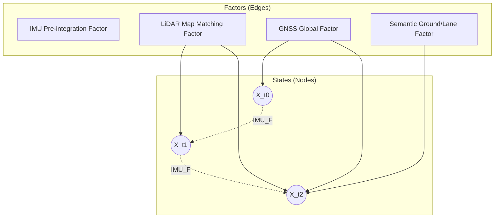

*By Gopi Krishna Tummala*

---

  
The Ghost in the Machine — Building an Autonomous Stack

  

    <a href="/posts/robotics/autonomous-stack-module-1-architecture" style="background: rgba(255,255,255,0.1); padding: 0.5rem 1rem; border-radius: 6px; text-decoration: none; color: white; opacity: 0.9;">Module 1: Architecture</a>
    <a href="/posts/robotics/autonomous-stack-module-2-sensors" style="background: rgba(255,255,255,0.1); padding: 0.5rem 1rem; border-radius: 6px; text-decoration: none; color: white; opacity: 0.9;">Module 2: Sensors</a>
    <a href="/posts/robotics/autonomous-stack-module-3-calibration" style="background: rgba(255,255,255,0.1); padding: 0.5rem 1rem; border-radius: 6px; text-decoration: none; color: white; opacity: 0.9;">Module 3: Calibration</a>
    <a href="/posts/robotics/autonomous-stack-module-4-localization" style="background: rgba(255,255,255,0.25); padding: 0.5rem 1rem; border-radius: 6px; text-decoration: none; color: white; font-weight: 600; border: 2px solid rgba(255,255,255,0.5);">Module 4: Localization</a>
    <a href="/posts/robotics/autonomous-stack-module-5-mapping" style="background: rgba(255,255,255,0.1); padding: 0.5rem 1rem; border-radius: 6px; text-decoration: none; color: white; opacity: 0.9;">Module 5: Mapping</a>
    <a href="/posts/robotics/autonomous-stack-module-6-perception" style="background: rgba(255,255,255,0.1); padding: 0.5rem 1rem; border-radius: 6px; text-decoration: none; color: white; opacity: 0.9;">Module 6: Perception</a>
    <a href="/posts/robotics/autonomous-stack-module-7-prediction" style="background: rgba(255,255,255,0.1); padding: 0.5rem 1rem; border-radius: 6px; text-decoration: none; color: white; opacity: 0.9;">Module 7: Prediction</a>
    <a href="/posts/robotics/autonomous-stack-module-8-planning" style="background: rgba(255,255,255,0.1); padding: 0.5rem 1rem; border-radius: 6px; text-decoration: none; color: white; opacity: 0.9;">Module 8: Planning</a>
    <a href="/posts/robotics/autonomous-stack-module-9-foundation-models" style="background: rgba(255,255,255,0.1); padding: 0.5rem 1rem; border-radius: 6px; text-decoration: none; color: white; opacity: 0.9;">Module 9: Foundation Models</a>
  

  
📖 You are reading <strong>Module 4: Localization</strong> — The Art of Not Getting Lost

---

### Act 0: Localization in Plain English

You wake up in a dark room. You don't know where you are. You take a step forward and feel a wall. You take a step right and feel a table. Suddenly, you know exactly where you are in your house.

You didn't use a GPS. You used a **Map** (your memory of the room) and **Observation** (touching the wall).

This is exactly how a self-driving car localizes itself.

Most people think cars use GPS to drive. **They do not.**

GPS is accurate to about **3–5 meters**. A highway lane is **3.7 meters** wide. If a car drove using only GPS, it would spend half its time in the neighbor's lane.

To survive, a robot needs to know its location to the **centimeter**. It needs to lock onto the world so tightly that it feels like it is on rails. We call this **The Blue Line**.

---

## Act I: The Three Liars

To find the truth, the car listens to three different sensors. The problem is that all of them are lying to it.

### 1. GNSS (Global Navigation Satellite System)

* **The Promise:** "You are at Lat: 37.42, Long: -122.08."
* **The Lie:** Clouds, trees, and tall buildings bounce the satellite signals (Multipath error).
* **The Result:** The GPS dot jumps around like a caffeinated squirrel.

### 2. The IMU (Inertial Measurement Unit)

* **The Promise:** "You just moved forward 1.2 meters and turned 2 degrees left."
* **The Lie:** The IMU is the car's "inner ear" (accelerometers and gyroscopes). It is fast (1000 Hz) but it drifts.
* **The Result:** After 60 seconds of driving on IMU alone, the car thinks it has drifted into the next town.

### 3. Wheel Odometry

* **The Promise:** "The wheel turned 4 times, so we moved 8 meters."
* **The Lie:** Tires slip. Roads are slippery.
* **The Result:** If you spin your tires on ice, the car thinks it moved 100 meters, but it hasn't moved an inch.

**Conclusion:** We have three sensors, and they are all unreliable. To fix this, we need a **Map**.

---

## Act II: The Map Match (Scan Matching)

This is the "aha!" moment.

Imagine you have a puzzle piece in your hand (what the LiDAR sees right now). You have the box cover with the full picture (the HD Map).

**Localization is simply sliding the puzzle piece over the box cover until it clicks.**

### The Algorithm: NDT (Normal Distributions Transform)

We don't match every single dot—that's too slow. Instead, we match probabilities.

1.  **The Map** is stored as a grid of "probability clouds" (where is a pole likely to be?).
2.  **The LiDAR** takes a snapshot of the world (poles, curbs, walls).
3.  **The Match:** The car slides its LiDAR snapshot over the map. It wiggles it left, right, and rotates it slightly until the snapshot lines up perfectly with the probability clouds.

**"Click."**

The car snaps into place. It ignores the noisy GPS and the drifting IMU. It *knows* it is exactly 14.2 centimeters from the curb.

---

## Act III: The Kalman Filter (The Truth Machine)

We have a problem.
* **LiDAR Matching** is accurate but slow (10 Hz).
* **IMU** is fast (1000 Hz) but drifts.

How do we get a smooth, high-speed position? We fuse them using the **Kalman Filter**.

Think of the Kalman Filter as a strict editor.
1.  **Prediction (IMU):** "Based on your speed, you should be *here*."
2.  **Update (LiDAR):** "Actually, I see a stop sign, so we are *here*."
3.  **Correction:** The filter blends them. "I trust the LiDAR more for position, but I trust the IMU more for sudden acceleration."

---

#### Act III.V: Mature Architecture — Tightly-Coupled Factor Graphs

While the Kalman Filter was the industry standard for a decade, modern production stacks (2024–2025) have transitioned to **Tightly-Coupled Factor Graphs**, specifically **LIO** (LiDAR-Inertial Odometry) and **VIO** (Visual-Inertial Odometry).

**The Factor Graph Pipeline:**

##### Why Move to Factor Graphs?
A Kalman Filter only remembers the *current* state. It is a "Markov" process. If it makes a mistake, it cannot go back and fix it. 

A **Factor Graph** remembers a "Sliding Window" of past states. 
*   **The Mechanism:** It models localization as an optimization problem (a spring-mass system). The states (poses) are connected by "springs" (sensor factors). If the GPS factor says you are at coordinates $(X,Y)$, but the IMU factor says you didn't move, the solver finds the state that has the lowest "tension" (error).
*   **Tightly-Coupled vs. Loosely-Coupled:** In a tightly-coupled system, raw LiDAR points are directly fused with raw IMU data *before* they are processed into a full map match. This allows the IMU to "de-skew" the LiDAR scan in real-time, preventing blur when the car is turning fast.

##### Handling Degeneracy (The 2025 Challenge)
*   **The Tunnel Problem:** In a perfectly straight, featureless tunnel, LiDAR scan-matching fails because sliding the "puzzle piece" forward looks exactly the same as leaving it still.
*   **The SOTA Solution:** Modern algorithms (like GenZ-ICP or GF-LIO) calculate a "Degeneracy Direction." If the geometry is ambiguous along the Z-axis, the factor graph dynamically lowers the weight of the LiDAR factor and relies almost entirely on the IMU and wheel odometry for that specific axis.

---

### Act III.VII: The Scorecard — Localization Metrics & Optimization

In localization, "close enough" isn't good enough. We measure success by the stability of the pose estimate over time.

#### 1. The Metrics (The Centimeter Chase)
*   **ATE (Absolute Trajectory Error):** The global consistency of the estimated path. We compare the entire history of the car's estimated positions against a "Ground Truth" (usually high-end RTK-GPS).
*   **RPE (Relative Pose Error):** The local drift. How much error do we accumulate every 10 meters? This is critical for smooth planning.
*   **RMSE (Root Mean Square Error):** The standard statistical measure of distance between predicted and actual coordinates.

#### 2. The Loss Functions (Optimizing the Graph)
*   **Pose Error Loss:** We minimize the distance between the estimated pose $T_{est}$ and the sensor observations in **SE(3)** space using the geodesic distance (log-map).
*   **Residual Error:** In Factor Graphs, the "Loss" is the total energy in the springs (residuals). We use **Levenberg-Marquardt** optimization to minimize:
    $$\mathcal{L} = \sum \| f(\mathbf{x}_i, \mathbf{x}_j) - \mathbf{z}_{ij} \|^2_{\Sigma}$$
*   **Mahalanobis Distance:** Used as a "Switching Loss." If a new sensor reading (like a spoofed GPS) has a Mahalanobis distance that is too high, the loss function effectively "ignores" that factor to protect the system.

---

## Act IV: The "Blue Line"

When you look at the dashboard of a Tesla or Waymo, you see a stable, glowing path stretching out in front of the car.

That isn't just a drawing. That is the **Localized Trajectory**.

* It is the car saying: *"I know where I am (Localization), I know where the lanes are (Map), and I know where I want to go (Planning)."*

* If Localization fails (e.g., inside a featureless tunnel), the Blue Line starts to jitter. The car gets nervous. It may ask you to take over.

**The Blue Line is the heartbeat of the autonomous stack.** As long as it is steady, the car is alive.

---

### System Design & Interview Scenarios

#### Scenario 1: The GPS Spoofing Attack
*   **Question:** "Your car is driving in a city, and suddenly the GPS reports that you are in the middle of the Pacific Ocean. How does the system react?"
*   **Answer:** Discuss **Outlier Rejection** (Mahalanobis distance) in the Factor Graph. The system compares the incoming GNSS factor to the IMU/LiDAR prediction. Because the error (residual) is massive, the GNSS factor is dropped entirely, and the car degrades to local LiDAR/IMU odometry.

#### Scenario 2: The Snow-Covered Road
*   **Question:** "It snows heavily, obscuring the lane lines and covering the LiDAR's view of the road surface. How do you maintain localization?"
*   **Answer:** Discuss **Semantic Features** vs. **Structural Features**. While lane lines are lost, structural features (traffic lights, building facades, poles) are usually above the snowline. A robust NDT or Factor Graph algorithm relies heavily on these vertical structures in winter ODDs.

---

### Graduate Assignment: The Sensor Fusion Problem

**Task:**

Design a simple 1D localization system using two sensors.

1. **Scenario:** A car is driving on a straight road. You have:
   * **GPS:** Reports position with ±3m error (noisy, but no drift)
   * **IMU:** Reports velocity perfectly, but position drifts at 0.1 m/s

2. **Experiment:**
   * Drive for 10 seconds at 10 m/s.
   * GPS says you're at 100m ± 3m.
   * IMU says you've moved 100m (perfect velocity), but has accumulated 1m of drift.

3. **Fusion:**
   * Use a weighted average: $x_{fused} = w_1 \cdot x_{GPS} + w_2 \cdot x_{IMU}$
   * Try $w_1 = 0.9, w_2 = 0.1$ (trust GPS more)
   * Try $w_1 = 0.1, w_2 = 0.9$ (trust IMU more)

4. **Analysis:** Which weighting works better? Why? What happens if GPS fails completely?

---

**Further Reading (State-of-the-Art):**
*   *LIO-SAM: Tightly-coupled Lidar Inertial Odometry via Smoothing and Mapping (IROS 2020)* - The modern baseline for factor graph LIO.
*   *FAST-LIO2: Fast Direct LiDAR-inertial Odometry (IEEE T-RO 2022)* - Utilizing iKD-trees for extreme efficiency.
*   *GenZ-ICP: Generalizable and Degeneracy-Robust LiDAR Odometry (IEEE RA-L 2025)* - SOTA handling of featureless environments.

---

**Previous:** [Module 3 — Calibration](/posts/robotics/autonomous-stack-module-3-calibration)

**Next:** [Module 5 — Mapping](/posts/robotics/autonomous-stack-module-5-mapping)

