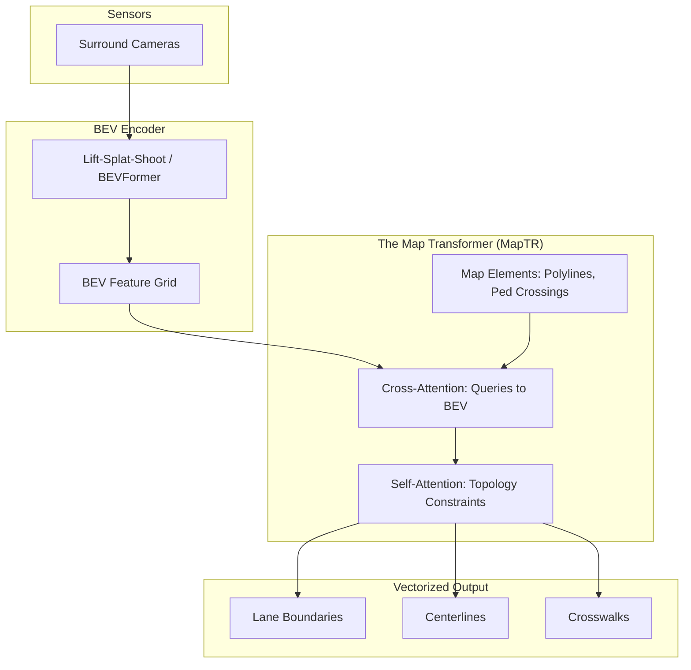

*By Gopi Krishna Tummala*

---

  
The Ghost in the Machine — Building an Autonomous Stack

  

    <a href="/posts/robotics/autonomous-stack-module-1-architecture" style="background: rgba(255,255,255,0.1); padding: 0.5rem 1rem; border-radius: 6px; text-decoration: none; color: white; opacity: 0.9;">Module 1: Architecture</a>
    <a href="/posts/robotics/autonomous-stack-module-2-sensors" style="background: rgba(255,255,255,0.1); padding: 0.5rem 1rem; border-radius: 6px; text-decoration: none; color: white; opacity: 0.9;">Module 2: Sensors</a>
    <a href="/posts/robotics/autonomous-stack-module-3-calibration" style="background: rgba(255,255,255,0.1); padding: 0.5rem 1rem; border-radius: 6px; text-decoration: none; color: white; opacity: 0.9;">Module 3: Calibration</a>
    <a href="/posts/robotics/autonomous-stack-module-4-localization" style="background: rgba(255,255,255,0.1); padding: 0.5rem 1rem; border-radius: 6px; text-decoration: none; color: white; opacity: 0.9;">Module 4: Localization</a>
    <a href="/posts/robotics/autonomous-stack-module-5-mapping" style="background: rgba(255,255,255,0.25); padding: 0.5rem 1rem; border-radius: 6px; text-decoration: none; color: white; font-weight: 600; border: 2px solid rgba(255,255,255,0.5);">Module 5: Mapping</a>
    <a href="/posts/robotics/autonomous-stack-module-6-perception" style="background: rgba(255,255,255,0.1); padding: 0.5rem 1rem; border-radius: 6px; text-decoration: none; color: white; opacity: 0.9;">Module 6: Perception</a>
    <a href="/posts/robotics/autonomous-stack-module-7-prediction" style="background: rgba(255,255,255,0.1); padding: 0.5rem 1rem; border-radius: 6px; text-decoration: none; color: white; opacity: 0.9;">Module 7: Prediction</a>
    <a href="/posts/robotics/autonomous-stack-module-8-planning" style="background: rgba(255,255,255,0.1); padding: 0.5rem 1rem; border-radius: 6px; text-decoration: none; color: white; opacity: 0.9;">Module 8: Planning</a>
    <a href="/posts/robotics/autonomous-stack-module-9-foundation-models" style="background: rgba(255,255,255,0.1); padding: 0.5rem 1rem; border-radius: 6px; text-decoration: none; color: white; opacity: 0.9;">Module 9: Foundation Models</a>
  

  
📖 You are reading <strong>Module 5: Mapping</strong> — The Memory of the Road

---

### Act 0: Mapping in Plain English

Imagine you are walking through your house in pitch darkness. You don't need a flashlight because you have a **Map** in your head. You know the coffee table is 5 steps ahead, and the doorway is to the left. 

For a self-driving car, driving using *only* sensors (cameras and radar) is like walking with a flashlight. You can see what's directly in front of you, but if a truck blocks your view, you are blind to the road behind it.

An **HD Map** gives the car "X-Ray Vision." It tells the car: *"Even though that truck is blocking your camera, I promise there is a stop sign exactly 50 meters ahead, and the lane curves to the right."*

Maps are not just navigation (like Google Maps). They are **a priori knowledge**—the rules of the game encoded before the game begins.

---

### Act I: What HD Maps Contain

A standard navigation map tells you: "Turn left in 300 meters onto Main Street."

An **HD Map** tells you:
*   The exact curvature of the turn (spline coefficients).
*   The number of lanes and their widths (to 10cm precision).
*   Where the stop line is painted.
*   Which lanes you're legally allowed to drive in.

#### The Three Layers
| Layer | Contents | Resolution | Update Frequency |
|-------|----------|------------|------------------|
| **Geometric** | 3D point clouds, ground surface mesh | ~10cm | Months |
| **Semantic** | Lane boundaries, traffic signs, crosswalks | ~10cm | Weeks |
| **Topological** | Lane graph (connectivity), allowed maneuvers | Logical | Days |

---

### Act II: The Lane Graph (The Road's Skeleton)

The most critical structure in an HD map is the **Lane Graph**.

Think of it as the road's skeleton: a directed graph where:
* **Nodes** represent decision points (intersections, splits/merges).
* **Edges** represent lane segments.

Lanes are stored as **Splines** (smooth mathematical curves). Instead of storing 1,000 tiny GPS points for a curve, the map stores 4 "Control Points" that a computer can perfectly draw a curve through.

---

### Act III: SLAM — Building Maps Without Maps

What happens when you drive somewhere that hasn't been mapped?
This is the domain of **SLAM: Simultaneous Localization and Mapping**.

#### The Loop Closure Problem
Imagine exploring a dark cave, drawing a map as you go. After 10 minutes, you arrive back where you started, but your drawing doesn't line up. 
*   **The Solution:** You recognize a landmark ("That's the same rock!"). This is a **Loop Closure**. The computer uses this to "snap" the whole map together, correcting all the tiny errors it made along the way using a **Factor Graph**.

---

#### Act IV: Mature Architecture — Online Vectorized Mapping

Historically, HD Maps were built "Offline"—meaning fleets of cars drove around, uploaded data to servers, and humans manually drew the lanes. 

The **2025 State-of-the-Art** is **Online Vectorized Mapping** (e.g., MapTR, StreamMapNet). Instead of relying on a pre-downloaded map, the car's neural networks *draw the HD map in real-time* as it drives.

**The Online Mapping Pipeline:**

##### How It Works (MapTR)
1.  **Map Queries:** The model doesn't output an "image" of a map. It outputs mathematically perfect **Polylines** (vectors). 
2.  **Cross-Attention:** The model uses Transformer attention to look at the BEV (Bird's Eye View) features and dynamically stretch and bend its "Queries" to match the actual lane lines on the road.
3.  **Topology:** It understands rules. It knows a left lane line and a right lane line should roughly be parallel, enforcing structural constraints on the fly.

##### Why the Shift? (Trade-offs)
*   **Offline HD Maps:** Extremely accurate (cm-level), very safe. *Trade-off:* Astronomically expensive to maintain. If a construction crew moves a cone, the map is instantly wrong (Stale Map Problem).
*   **Online Vector Maps:** Cheap, infinitely scalable, handles construction zones perfectly. *Trade-off:* Computationally heavy to run on the car; can hallucinate lines in heavy rain or missing paint.

---

### Act V: The Map Freshness Problem

The world changes. Roads get repaved. New construction appears. 

**The Challenge:** Your map was accurate last month. Is it still accurate today?

#### Detection: Is My Map Wrong?
The vehicle constantly runs a **Hypothesis Test**.
*   **Expected:** Map says lane is at $y = 3.5m$
*   **Observed:** Online MapTR model sees lane at $y = 4.2m$
*   **Discrepancy:** If the error is large, the car "flags" the map as stale, degrades to "Perception-Only" mode, and sends an OTA (Over-The-Air) ping to the cloud to update the fleet's map.

---

### Act VI: System Design & Interview Scenarios

#### Scenario 1: The Stale Map Problem
*   **Question:** "Your HD map says the speed limit is 45mph, but your cameras just read a temporary construction sign saying 25mph. What does the planner do?"
*   **Answer:** Discuss **Hierarchy of Trust**. Transient, live observations (Cameras) *always* override static priors (Maps) for safety-critical constraints. The map is a "prior," not ground truth.

#### Scenario 2: Map-Heavy vs. Map-Light
*   **Question:** "Should we use HD Maps or go Vision-Only like Tesla?"
*   **Answer:** Discuss the **Scalability vs. Safety trade-off**. Map-heavy (Waymo) guarantees safety in a Geofence (ODD) because the car knows the geometry before it arrives. Map-light scales globally but struggles in complex intersections where lane lines are completely missing. The 2025 consensus is a **Hybrid**: Light maps for global scale, augmented by real-time MapTR networks.

---

### Graduate Assignment: Map Discrepancy Detection

**Task:**

Design a simple map discrepancy detector.

1. **Setup:** You have an HD map with a lane boundary at $y = 3.5m$ (in vehicle frame). Your camera detects a lane boundary at $y = 4.1m$ with standard deviation $\sigma = 0.2m$.

2. **Question 1:** Calculate the Mahalanobis distance between expected and observed positions.

3. **Question 2:** Using a chi-squared test with $\alpha = 0.05$ (one degree of freedom, threshold = 3.84), should you flag this as a map discrepancy?

4. **Question 3:** If you detect a discrepancy, what should the vehicle do? List three possible responses in order of conservatism.

5. **Analysis:** Why is it dangerous to immediately trust perception over the map? When might you be wrong?

---

**Further Reading (State-of-the-Art):**
*   *MapTR: Structured Modeling and Learning for Online Vectorized HD Map Construction (ICLR 2023)* - The SOTA standard for online mapping.
*   *LaneGraph2Seq: Lane Topology Extraction from LiDAR Point Clouds (CVPR 2023)*
*   *Tesla AI Day: Occupancy Networks and Online Mapping*

---

**Previous:** [Module 4 — Localization](/posts/robotics/autonomous-stack-module-4-localization)

**Next:** [Module 6 — Perception: Seeing the World](/posts/robotics/autonomous-stack-module-6-perception)
