*By Gopi Krishna Tummala*

---

  
The Ghost in the Machine — Building an Autonomous Stack

  

    <a href="/posts/robotics/autonomous-stack-module-1-architecture" style="background: rgba(255,255,255,0.1); padding: 0.5rem 1rem; border-radius: 6px; text-decoration: none; color: white; opacity: 0.9;">Module 1: Architecture</a>
    <a href="/posts/robotics/autonomous-stack-module-2-sensors" style="background: rgba(255,255,255,0.1); padding: 0.5rem 1rem; border-radius: 6px; text-decoration: none; color: white; opacity: 0.9;">Module 2: Sensors</a>
    <a href="/posts/robotics/autonomous-stack-module-3-calibration" style="background: rgba(255,255,255,0.1); padding: 0.5rem 1rem; border-radius: 6px; text-decoration: none; color: white; opacity: 0.9;">Module 3: Calibration</a>
    <a href="/posts/robotics/autonomous-stack-module-4-localization" style="background: rgba(255,255,255,0.1); padding: 0.5rem 1rem; border-radius: 6px; text-decoration: none; color: white; opacity: 0.9;">Module 4: Localization</a>
    <a href="/posts/robotics/autonomous-stack-module-5-mapping" style="background: rgba(255,255,255,0.1); padding: 0.5rem 1rem; border-radius: 6px; text-decoration: none; color: white; opacity: 0.9;">Module 5: Mapping</a>
    <a href="/posts/robotics/autonomous-stack-module-6-perception" style="background: rgba(255,255,255,0.25); padding: 0.5rem 1rem; border-radius: 6px; text-decoration: none; color: white; font-weight: 600; border: 2px solid rgba(255,255,255,0.5);">Module 6: Perception</a>
    <a href="/posts/robotics/autonomous-stack-module-7-prediction" style="background: rgba(255,255,255,0.1); padding: 0.5rem 1rem; border-radius: 6px; text-decoration: none; color: white; opacity: 0.9;">Module 7: Prediction</a>
    <a href="/posts/robotics/autonomous-stack-module-8-planning" style="background: rgba(255,255,255,0.1); padding: 0.5rem 1rem; border-radius: 6px; text-decoration: none; color: white; opacity: 0.9;">Module 8: Planning</a>
    <a href="/posts/robotics/autonomous-stack-module-9-foundation-models" style="background: rgba(255,255,255,0.1); padding: 0.5rem 1rem; border-radius: 6px; text-decoration: none; color: white; opacity: 0.9;">Module 9: Foundation Models</a>
  

  
📖 You are reading <strong>Module 6: Perception</strong> — Seeing the World

---

### Act 0: Perception in Plain English

Imagine you are driving at night in a heavy storm. Your eyes struggle with the glare, your ears pick up the distant wail of a siren, and your "gut" tells you exactly how close you are to the car next to you even when you aren't looking directly at it.

**Perception** is the car's brain doing exactly that. It doesn't just "see" pixels; it "understands" reality.

*   **The Eyes (Cameras):** Tell the car what things are. "That's a stop sign."
*   **The Flashlight (LiDAR):** Shoots lasers to draw a perfect 3D map. It knows *exactly* how many meters away that wall is.
*   **The Senses (Radar):** Like a bat, it uses radio waves to measure speed and see through fog.

The goal of Perception is to convert a chaotic flood of raw data into a clean **World Model**: a 4D representation of everything around the car, its Kind, its Position, and its Velocity.

---

### Act I: The Perception Pipeline & Sensor Fusion

A modern perception system answers three questions:
1.  **Detection:** What objects exist?
2.  **Classification:** What kind of object is it?
3.  **State Estimation:** How fast is it moving and in what direction?

#### The 2025 Sensor Suite
The state-of-the-art has shifted from "simple sensors" to "intelligent modalities."

| Modality | Primary Role | 2025 Upgrade | Strength |
| :--- | :--- | :--- | :--- |
| **Camera** | Semantics | 12MP+ HDR, GMSL3 | Color, Detail |
| **LiDAR** | Geometry | Solid-state, 300m range | 3D Truth |
| **4D Radar** | Velocity | Digital Imaging Radar | Speed, Weather |
| **Microphones** | Audio | AI-Siren Detection | Non-Line-of-Sight |

#### Sensor Fusion Levels
*   **Late Fusion:** Each sensor detects objects independently, then we merge the boxes. *Cons:* If the camera is 40% sure and LiDAR is 40% sure, neither detects the object.
*   **Mid Fusion (Feature Level):** Merge the neural network features. This is the industry standard (e.g., BEV Transformers).
*   **Knowledge Distillation:** Using a "Teacher" model (LiDAR) to train a "Student" model (Camera) to "guess" depth and geometry better.

---

### Act II: Object Detection & Occupancy (Finding Things)

#### 1. From Bounding Boxes to Occupancy Networks
Traditionally, we drew 3D boxes around cars. But what if there's a pile of trash, a fallen tree, or a mattress on the highway? These don't fit into a "box."

**4D Panoptic Occupancy (The New Standard)**
Instead of asking "Is this a car?", we ask: **"Is this voxel occupied, what is its label, and what is its ID?"**
*   **Semantic:** It's a "Tree."
*   **Instance:** It's "Tree #452."
*   **Temporal:** It was at $(x,y)$ and is now at $(x', y')$.

#### 2. BEV Transformers (Mature Architecture)
In production stacks (Waymo, Tesla, Zoox), the "gold standard" is the **BEV Transformer**.

```mermaid
graph TD
    subgraph Input["📥 Input Layer"]
        CAM[Multi-View Cameras]
        LID[LiDAR Point Cloud]
        RAD[Radar Tensors]
    end

    subgraph Encoders["🔧 Feature Extraction"]
        C_ENC[CNN/ViT Backbone]
        L_ENC[PointNet/Voxel]
        R_ENC[RadarNet]
    end

    subgraph BEV["🧠 BEV Transformer Neck"]
        QUERIES[BEV Queries: Learnable Grid]
        SELF[Self-Attention: Temporal/Spatial Consistency]
        CROSS[Cross-Attention: 2D → BEV Projection]
    end

    subgraph Heads["📤 Output Heads"]
        DET[3D Detection]
        OCC[Occupancy Flow]
        SEG[Panoptic Segmentation]
    end

    CAM --> C_ENC
    LID --> L_ENC
    RAD --> R_ENC

    C_ENC --> CROSS
    L_ENC --> QUERIES
    R_ENC --> QUERIES

    QUERIES --> SELF
    SELF --> CROSS
    CROSS --> DET & OCC & SEG
```

**Key Mechanism: Cross-Attention**
The BEV Queries "ask" the camera features: *"Which pixels contain information about my 3D location?"* This allows the model to "learn" the projection from 2D to 3D, making it robust to vibration and calibration drift.

---

### Act III: The 4D Reality — Depth, Flow & Splatting

#### 1. Depth Estimation 2.0 (Foundation Models)
We no longer train depth models from scratch. We use **Depth Foundation Models** (like *Depth Anything V2*).
*   **Innovation:** These models have seen millions of diverse images. They understand that a "shiny surface" is a reflection, not a hole in the ground.
*   **LiDAR Prompting:** Using a few sparse LiDAR points to "anchor" the camera's relative depth into **Metric Depth** (meters).

#### 2. Scene Flow (3D Motion)
Instead of just "velocity," we predict **Scene Flow**: a 3D motion vector for every point in the scene.
*   **Why it matters:** It captures "Deformable" motion. If a pedestrian is waving their arms, Scene Flow sees the arm's motion separately from the body's motion.

#### 3. 3D Gaussian Splatting (3DGS)
The newest trend (2026) is moving away from rigid voxel grids to **Gaussian Splatting**.
*   **The Benefit:** It represents the world as millions of tiny, fuzzy "blobs." It is much faster to render and can reconstruct highly complex scenes (like a construction site with wires and dust) with near-photorealistic accuracy.

---

### Act IV: The "Open World" Challenge

#### 1. Open-Vocabulary Perception
Standard models only see what they were trained on (Car, Truck, Pedestrian). If they see a "Giant Inflatable Chicken," they might ignore it.
*   **The Fix:** Using **Vision-Language Models (CLIP)**. The car can identify *anything* you can describe in text. If you can say it, the car can see it.

#### 2. Long Tail & Failure Modes
Perception is easy until it isn't. Common failure modes:
*   **Semantic Ambiguity:** A billboard with a picture of a stop sign.
*   **Ghosting:** Radar reflecting off a metal fence creating a "fake car."
*   **Over-exposure:** Exiting a dark tunnel into blinding sun.

---

### Act V: The Scorecard — Metrics & Losses

#### 1. The Metrics
*   **mAP (Mean Average Precision):** The standard for object detection.
*   **NDS (NuScenes Detection Score):** A metametric combining mAP with translation, scale, and velocity errors.
*   **IoU (Intersection over Union):** Measuring the overlap of 3D boxes.
*   **EPE (End-Point Error):** The standard for Scene Flow and depth.

#### 2. The Loss Functions
*   **Focal Loss:** Forces the model to focus on "hard" pixels (like a pedestrian in the shadows) rather than the "easy" sky pixels.
*   **Chamfer Loss:** Used for point cloud and occupancy matching.
*   **Differentiable Rendering Loss:** Training the model by "rendering" its 3D understanding back into a 2D image and comparing it to the real photo.

---

### Act VI: System Design & Interview Scenarios

#### Scenario 1: The "Muddy" Sensor
*   **Question:** "One of your side cameras is covered in mud. How does your BEV Transformer react?"
*   **Answer:** Discuss **Attention Masking**. The model should output an "Uncertainty Map." Using **Temporal Self-Attention**, the model should "remember" what was in that blind spot from previous frames while up-weighting the LiDAR/Radar inputs.

#### Scenario 2: Compute vs. Resolution
*   **Question:** "You have a 100ms budget. Do you use 12MP cameras at 10Hz or 2MP cameras at 60Hz?"
*   **Answer:** This is a **Latency-Resolution Trade-off**. For high-speed highway driving, 60Hz is safer (shorter reaction time). For dense urban navigation, 12MP is better (seeing small objects like a child's hand around a corner). Modern stacks use **Dynamic Resolution**: high-res for the center, low-res for the periphery.

---

### Graduate Assignment: The Panoptic Challenge

**Task:**
You are given a 4D Occupancy Flow grid and a blurry camera image in heavy rain.
1.  **Fusion Strategy:** Why would "Late Fusion" fail here?
2.  **Flow Logic:** If the Occupancy Flow shows a voxel moving at 5m/s but the Camera sees a "Static Bollard," which one do you trust? Explain the concept of **Modal Confidence**.

---

**Further Reading:**
*   *BEVFormer: Spatiotemporal Transformers (ECCV 2022)*
*   *Depth Anything V2: Foundation Models for Depth (2024)*
*   *Gaussian Splatting for Autonomous Driving (2025)*
*   *UniAD: Unified Autonomous Driving (2023)*

---

**Previous:** [Module 5 — Mapping](/posts/robotics/autonomous-stack-module-5-mapping)

**Next:** [Module 7 — Prediction: The Fortune Teller](/posts/robotics/autonomous-stack-module-7-prediction)
