*By Gopi Krishna Tummala*

---

  
The Ghost in the Machine — Building an Autonomous Stack

  

    <a href="/posts/robotics/autonomous-stack-module-1-architecture" style="background: rgba(255,255,255,0.1); padding: 0.5rem 1rem; border-radius: 6px; text-decoration: none; color: white; opacity: 0.9;">Module 1: Architecture</a>
    <a href="/posts/robotics/autonomous-stack-module-2-sensors" style="background: rgba(255,255,255,0.1); padding: 0.5rem 1rem; border-radius: 6px; text-decoration: none; color: white; opacity: 0.9;">Module 2: Sensors</a>
    <a href="/posts/robotics/autonomous-stack-module-3-calibration" style="background: rgba(255,255,255,0.1); padding: 0.5rem 1rem; border-radius: 6px; text-decoration: none; color: white; opacity: 0.9;">Module 3: Calibration</a>
    <a href="/posts/robotics/autonomous-stack-module-4-localization" style="background: rgba(255,255,255,0.1); padding: 0.5rem 1rem; border-radius: 6px; text-decoration: none; color: white; opacity: 0.9;">Module 4: Localization</a>
    <a href="/posts/robotics/autonomous-stack-module-5-mapping" style="background: rgba(255,255,255,0.1); padding: 0.5rem 1rem; border-radius: 6px; text-decoration: none; color: white; opacity: 0.9;">Module 5: Mapping</a>
    <a href="/posts/robotics/autonomous-stack-module-6-perception" style="background: rgba(255,255,255,0.25); padding: 0.5rem 1rem; border-radius: 6px; text-decoration: none; color: white; font-weight: 600; border: 2px solid rgba(255,255,255,0.5);">Module 6: Perception</a>
    <a href="/posts/robotics/autonomous-stack-module-7-prediction" style="background: rgba(255,255,255,0.1); padding: 0.5rem 1rem; border-radius: 6px; text-decoration: none; color: white; opacity: 0.9;">Module 7: Prediction</a>
    <a href="/posts/robotics/autonomous-stack-module-8-planning" style="background: rgba(255,255,255,0.1); padding: 0.5rem 1rem; border-radius: 6px; text-decoration: none; color: white; opacity: 0.9;">Module 8: Planning</a>
    <a href="/posts/robotics/autonomous-stack-module-9-foundation-models" style="background: rgba(255,255,255,0.1); padding: 0.5rem 1rem; border-radius: 6px; text-decoration: none; color: white; opacity: 0.9;">Module 9: Foundation Models</a>
  

  
📖 You are reading <strong>Module 6: Perception</strong> — Seeing the World

---

### Act 0: Perception in Plain English

Imagine you are driving at night in a heavy storm. Your eyes struggle with the glare, your ears pick up the distant wail of a siren, and your "gut" tells you exactly how close you are to the car next to you even when you aren't looking directly at it.

**Perception** is the car's brain doing exactly that. It doesn't just "see" pixels; it "understands" reality.

*   **The Eyes (Cameras):** Tell the car what things are. "That's a stop sign," "That's a pedestrian."
*   **The Flashlight (LiDAR):** Shoots lasers to draw a perfect 3D map. It knows *exactly* how many meters away that wall is, even in pitch black.
*   **The Sonar (Radar):** Like a bat, it uses radio waves to measure speed. It can "see" through fog and rain to tell if the car ahead just slammed on the brakes.
*   **The Proximity Senses (Ultrasonics):** Those little "beeps" when you park. They make sure you don't tap the bumper.
*   **The Ears (Microphones):** They hear the ambulance two blocks away before the cameras ever see it.

The magic happens when the brain (the computer) combines all these inputs into a single "Source of Truth" called the **World Model**.

---

### Act I: The Perception Pipeline

A modern perception system answers three questions in sequence:

1.  **Detection:** What objects exist? Where are they?
2.  **Classification:** What *kind* of object is each one?
3.  **Tracking:** How do objects move over time?

#### The Sensor Suite (2025 Edition)

The state-of-the-art has shifted from "just detection" to "intelligent interpretation."

| Modality | Primary Role | 2025 Upgrade | Strength | Weakness |
| :--- | :--- | :--- | :--- | :--- |
| **Camera** | *"What is it?"* | 12MP+ HDR, GMSL3 | Semantic richness, color | Weather, lighting |
| **LiDAR** | *"Where exactly?"* | Solid-state, 300m range | Precise geometry | Cost, rain/fog |
| **4D Radar** | *"How fast?"* | Digital Imaging Radar | Instant velocity, all-weather | Ghosting, resolution |
| **USS** | *"How close?"* | High-bandwidth chirps | CM-level near range | Short range (<8m) |
| **Audio** | *"What's coming?"* | AI-Siren Classification | Non-line-of-sight | Noisy environments |
| **V2X** | *"Virtual Vision"* | 5G-Direct | "See" through buildings | Requires infrastructure |

> **Pro-Tip for Job Seekers:** In system design interviews, always mention **data synchronization**. If your camera captures a frame at $t=0$ and your LiDAR at $t=10ms$, the car will "see" two different realities. Modern stacks use **PTP (Precision Time Protocol)** to sync all sensors to the nanosecond.

---

### Act II: Object Detection & Occupancy (Finding Things)

#### From Bounding Boxes to Occupancy Networks

Traditionally, we drew "boxes" around cars. But what if there's a pile of trash, a fallen tree, or a mattress on the highway? These don't fit into a "car" or "pedestrian" box.

**Occupancy Networks (The Tesla Style)**
Instead of asking "Is this a car?", we ask: **"Is this space empty or occupied?"**

1.  **Input:** 360° Camera Video + LiDAR/Radar.
2.  **Process:** Predict a 3D grid (Voxels) where each cell is either 1 (occupied) or 0 (empty).
3.  **Benefit:** It handles the "General Obstacle" problem perfectly. If it's occupied, don't drive there—even if we don't know what it is.

#### 4D Imaging Radar: The LiDAR Challenger
Traditional radar gave you a few points and a velocity. **4D Imaging Radar** gives you a dense point cloud *and* elevation.
*   **Why it's a game-changer:** It can "see" a stalled car under a bridge (which traditional radar often filters out as "static background").
*   **Interview Question:** "Why do we still need LiDAR if 4D Radar is so good?"
    *   *Answer:* Resolution. LiDAR still has ~10x higher spatial resolution, allowing it to distinguish a child from a mailbox at 50 meters.

#### Bird's Eye View (BEV) Projection
We want to move from "Perspective View" (what a camera sees) to "Map View" (how a planner thinks).
*   **LSS (Lift, Splat, Shoot):** The model "lifts" 2D pixels into 3D using predicted depth, then "splats" them onto a ground map.
*   **BEVFormer:** Uses Transformers to "query" the world map. "Hey, Camera 1, do you see a lane line at $(x=5, y=2)$?"

#### The Data Association Problem (Multi-Sensor Fusion)

Before fusing sensors, you must **match observations**. Camera sees a car; radar sees a moving object—are they the same?

| Technique | How It Works |
|-----------|--------------|
| **Frustum Projection** | Project camera box into 3D cone, find radar/LiDAR points inside |
| **Hungarian Matching** | Optimize global assignment minimizing distance cost |
| **Learned Association** | Train a network to predict matches from features |

**Why it's hard:**
- **Timing jitter:** Camera at $t=0$, radar at $t=5ms$ → car moved
- **FOV mismatch:** Radar sees 120°, camera sees 60°
- **Ghost returns:** Radar bounces off guardrails → false positives

#### Act II.V: Mature Architecture — The BEV Transformer

In production stacks (Waymo, Tesla, Zoox), the "gold standard" has shifted from simple CNNs to **Transformer-based BEV Architectures**. This is where **Attention Mechanisms** solve the projection problem.

**The Perception Pipeline (Mature Architecture):**

```mermaid
graph TD
    subgraph Input["📥 Input Layer"]
        CAM[Multi-View Cameras]
        LID[LiDAR Point Cloud]
        RAD[Radar Tensors]
    end

    subgraph Encoders["🔧 Feature Extraction"]
        C_ENC[CNN/ViT Backbone<br/>Image Features]
        L_ENC[PointNet/Voxel<br/>Point Features]
        R_ENC[RadarNet<br/>Velocity Features]
    end

    subgraph BEV["🧠 BEV Transformer Neck"]
        QUERIES[BEV Queries<br/>Learnable Grid]
        SELF[Self-Attention<br/>Temporal + Spatial]
        CROSS[Cross-Attention<br/>2D → BEV Projection]
    end

    subgraph Heads["📤 Output Heads"]
        DET[3D Detection]
        OCC[Occupancy Grid]
        FLOW[Vector Flow<br/>Velocity]
    end

    CAM --> C_ENC
    LID --> L_ENC
    RAD --> R_ENC

    C_ENC --> CROSS
    L_ENC --> QUERIES
    R_ENC --> QUERIES

    QUERIES --> SELF
    SELF --> CROSS

    CROSS --> DET
    CROSS --> OCC
    CROSS --> FLOW
```

##### 1. Cross-Attention: The Projection Key
How do you know which pixel in a camera image corresponds to a point $(x, y)$ on the ground?
*   **The Mechanism:** We define a grid of "BEV Queries" (tokens representing small patches of the world). 
*   **The Math:** Each query "asks" the camera features: *"Which of you pixels contain information about my 3D location?"* 
*   **Cross-Attention:** The query (Q) attends to the camera image features (K, V). By using camera intrinsics/extrinsics as positional encodings, the model "learns" to lift 2D data into 3D without explicit depth math.

##### 2. Self-Attention: Spatial & Temporal Context
*   **Spatial Self-Attention:** Queries for "Patch A" look at "Patch B" to ensure lane lines are continuous across camera boundaries (e.g., stitching the front-left and front-right camera views).
*   **Temporal Self-Attention:** Queries from the *current* frame look at queries from the *previous* frame. This is how the car "remembers" a car that is now occluded or calculates velocity without a radar.

---

### Act III: Multi-Object Tracking (Consistency)

Detection is a snapshot. Tracking is a movie. We need to maintain **identity** across frames.

#### The Association Problem

At each frame, you have:
- **Tracks:** Objects you've been following (with IDs and history)
- **Detections:** New observations (no IDs yet)

**Question:** Which detection corresponds to which track?

#### SORT: The Baseline (2016)

**State Vector:** $(x, y, w, h, \dot{x}, \dot{y}, \dot{w}, \dot{h})$

**Cost Function:** $\text{Cost}(i,j) = 1 - \text{IoU}(\text{Track}_i, \text{Detection}_j)$

**Problem:** Pure SORT uses only position. Two crossing cars can swap IDs.

#### DeepSORT: Adding Appearance (2017)

Adds a **Re-ID network** (CNN) that extracts an appearance embedding per detection.

$$\text{Cost}(i,j) = \lambda \cdot d_{\text{motion}} + (1-\lambda) \cdot d_{\text{appearance}}$$

Now even if positions overlap, different appearances prevent ID swaps.

#### 2025 Trend: ByteTrack & OC-SORT
*   **ByteTrack:** Don't discard low-confidence detections—use them for occluded object recovery
*   **OC-SORT:** "Observation-Centric" updates that handle non-linear motion better
*   **Transformers:** Motion-appearance transformers that learn to track through heavy occlusions

---

### Act IV: The "Long Tail" & Edge Cases

This is the hardest part of AV engineering. The "99% cases" (clear day, highway) are solved. The "1% cases" (The Long Tail) are where the work happens.

**Common Failure Modes:**
1.  **Over-exposure:** Exiting a dark tunnel into blinding sunlight.
2.  **Ghosting:** Radar reflecting off a metal guardrail, creating a "fake car" in the middle of the lane.
3.  **Semantic Ambiguity:** A billboard with a picture of a "Stop" sign.
4.  **Weather:** Snow covering lane lines or LiDAR "seeing" a cloud of its own exhaust in cold weather.

**The Solution: Foundation Models (Module 9)**
We are now using Vision-Language Models (VLMs) that have "world knowledge." If the car sees a person in a dinosaur costume, the VLM says: "That's a person in a costume, they might move unpredictably," whereas a standard model might just crash or output "Unknown."

---

### Act V: System Design & Interview Scenarios

If you are interviewing for a Perception Role, prepare for these scenarios:

#### Scenario 1: The Muddy Camera
*   **Question:** "One of your side cameras is covered in mud. How does your stack react?"
*   **Answer:** Mention **Health Monitoring**. The perception system should output an "Uncertainty Map." If a sensor's confidence drops, the stack should up-weight other sensors (LiDAR/Radar) or trigger a "Graceful Degradation" (pull over safely).

#### Scenario 2: Latency vs. Accuracy
*   **Question:** "You have a 100ms budget for the entire perception stack. Your new 3D detector takes 120ms. What do you do?"
*   **Answer:** Discuss **Model Distillation** (making a smaller version) or **Asynchronous Processing**. Run the "Safety Stack" (low latency) every frame, and the "High-Accuracy Semantic Stack" (high latency) every 3 frames.

#### Scenario 3: The "Phantom Brake"
*   **Question:** "Your car suddenly brakes on a highway with nothing in front. Why?"
*   **Answer:** Likely a **False Positive** from Radar (detecting an overhead sign as a stopped car) or a **Sensor Desync** where the localization thought the car was 2 meters to the left and hitting a guardrail.

---

### Act VI: The Perception → Prediction Interface

Perception doesn't drive the car; it provides the "Object List" to the **Fortune Teller (Prediction)**.

**The Handoff:**
*   **State:** $(x, y, z, \theta)$
*   **Motion:** $(v_x, v_y, a_x, a_y)$
*   **Semantics:** "Emergency Vehicle" + "Siren Active"
*   **Uncertainty:** "I am 70% sure this is a pedestrian."

---

### Graduate Assignment: The 4D Challenge

**Task:**
You are given a 4D Radar point cloud and a blurry camera image in heavy fog.

1.  **Design a Fusion Strategy:** Explain why "Late Fusion" (merging boxes) would fail here.
2.  **Velocity Logic:** How do you use the Doppler velocity from the Radar to filter out the "ghost" reflections from a wet road?
3.  **Emergency Logic:** If the Audio sensor detects a siren at 200Hz (approaching) but no camera sees it, what command do you send to the planner?

---

**Further Reading:**
*   *Tesla AI Day: Occupancy Networks (2022)*
*   *BEVFormer: Learning Bird's-Eye-View (ECCV 2022)*
*   *4D Imaging Radar: The Future of All-Weather Perception (NXP Whitepaper)*
*   *End-to-End Autonomous Driving: UniAD (CVPR 2023)*

---

**Previous:** [Module 5 — Mapping](/posts/robotics/autonomous-stack-module-5-mapping)

**Next:** [Module 7 — Prediction: The Fortune Teller](/posts/robotics/autonomous-stack-module-7-prediction)
