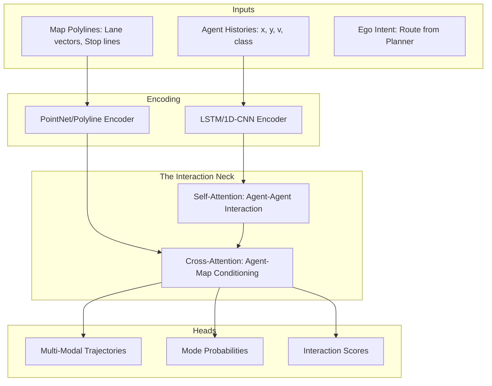

`---
author: Gopi Krishna Tummala
pubDatetime: 2025-01-24T00:00:00Z
modDatetime: 2025-02-28T00:00:00Z
title: 'Module 07: The Fortune Teller — The Evolution of Prediction'
slug: autonomous-stack-module-7-prediction
featured: true
draft: false
tags:
  - autonomous-vehicles
  - robotics
  - prediction
  - machine-learning
  - generative-ai
  - transformers
  - bayesian-networks
description: 'The hardest problem in AV: predicting human irrationality. From physics-based Kalman Filters to Generative Motion Diffusion and LLM-based intent reasoning.'
track: Robotics
difficulty: Advanced
interview_relevance:
  - System Design
  - Theory
  - ML-Infra
  - Behavioral Modeling
estimated_read_time: 45
---

*By Gopi Krishna Tummala*

---

  
The Ghost in the Machine — Building an Autonomous Stack

  

    <a href="/posts/robotics/autonomous-stack-module-1-architecture" style="background: rgba(255,255,255,0.1); padding: 0.5rem 1rem; border-radius: 6px; text-decoration: none; color: white; opacity: 0.9;">Module 1: Architecture</a>
    <a href="/posts/robotics/autonomous-stack-module-2-sensors" style="background: rgba(255,255,255,0.1); padding: 0.5rem 1rem; border-radius: 6px; text-decoration: none; color: white; opacity: 0.9;">Module 2: Sensors</a>
    <a href="/posts/robotics/autonomous-stack-module-3-calibration" style="background: rgba(255,255,255,0.1); padding: 0.5rem 1rem; border-radius: 6px; text-decoration: none; color: white; opacity: 0.9;">Module 3: Calibration</a>
    <a href="/posts/robotics/autonomous-stack-module-4-localization" style="background: rgba(255,255,255,0.1); padding: 0.5rem 1rem; border-radius: 6px; text-decoration: none; color: white; opacity: 0.9;">Module 4: Localization</a>
    <a href="/posts/robotics/autonomous-stack-module-5-mapping" style="background: rgba(255,255,255,0.1); padding: 0.5rem 1rem; border-radius: 6px; text-decoration: none; color: white; opacity: 0.9;">Module 5: Mapping</a>
    <a href="/posts/robotics/autonomous-stack-module-6-perception" style="background: rgba(255,255,255,0.1); padding: 0.5rem 1rem; border-radius: 6px; text-decoration: none; color: white; opacity: 0.9;">Module 6: Perception</a>
    <a href="/posts/robotics/autonomous-stack-module-7-prediction" style="background: rgba(255,255,255,0.25); padding: 0.5rem 1rem; border-radius: 6px; text-decoration: none; color: white; font-weight: 600; border: 2px solid rgba(255,255,255,0.5);">Module 7: Prediction</a>
    <a href="/posts/robotics/autonomous-stack-module-8-planning" style="background: rgba(255,255,255,0.1); padding: 0.5rem 1rem; border-radius: 6px; text-decoration: none; color: white; opacity: 0.9;">Module 8: Planning</a>
    <a href="/posts/robotics/autonomous-stack-module-9-foundation-models" style="background: rgba(255,255,255,0.1); padding: 0.5rem 1rem; border-radius: 6px; text-decoration: none; color: white; opacity: 0.9;">Module 9: Foundation Models</a>
  

  
📖 You are reading <strong>Module 7: The Fortune Teller</strong> — The Evolution of Prediction

---

### Act 0: Prediction in Plain English

Imagine you are standing at a busy crosswalk. You see a teenager looking at their phone, a cyclist pedaling hard toward a yellow light, and an elderly man waiting patiently. 

You don't need a calculator to know that the teenager might step into the street without looking, or that the cyclist is going to try and beat the light. You are **predicting intent**.

In the autonomous vehicle (AV) stack, this is the **Prediction Module**. It is the "Fortune Teller" that looks at the current world and says, "Based on what I see, here are the 3 most likely things that will happen in the next 5 seconds."

*   **Physics Prediction:** Like predicting where a thrown ball will land. Easy.
*   **Behavioral Prediction:** Like predicting where a squirrel will run. Hard.
*   **Interactive Prediction:** Like a high-stakes game of "After you, no after you" at a 4-way stop. The hardest.

---

### Act I: The Age of Innocence (Physics & Kalman Filters)

In the early days (DARPA Grand Challenges), prediction was handled by classical mechanics. The assumption was simple: **Objects in motion stay in motion.**

If we knew a car's position ($p$) and velocity ($v$), we could predict its future position using basic kinematics:

$$p_{t+1} = p_t + v_t \cdot \Delta t + \frac{1}{2} a_t \cdot \Delta t^2$$

#### The Tool: The Kalman Filter
Because sensors are noisy, we used **Kalman Filters** to estimate the "true" state.
1.  **Predict:** Use physics to guess where the car will be.
2.  **Update:** Measure where the car actually is.
3.  **Correct:** Merge the two based on uncertainty.

**Why it failed:** Physics predicts that a pedestrian standing at a curb ($v=0$) will stay there forever. But a human driver knows they might step out. Physics cannot model **intent**.

---

### Act II: The Engineer's Playground (Feature Engineering & XGBoost)

Before deep learning took over, prediction was the domain of the **Feature Engineer**. The philosophy: Highway driving is a **Finite State Machine**. A car is either keeping its lane, changing left, or changing right.

**The "God Features" of 2015:**
*   **TTC (Time-to-Collision):** Seconds until impact.
*   **TLC (Time-to-Lane-Crossing):** Seconds until the tire touches the paint.
*   **Lateral Jerk:** Is the driver twitchy?

#### The Model: XGBoost
We fed these features into **Gradient Boosted Decision Trees**. 
*   *Pros:* Interpretable. You could see exactly why the car predicted a lane change (e.g., "Lateral Velocity > 0.5").
*   *Cons:* Brittle. It required infinite "If-This-Then-That" rules. It failed in construction zones or parking lots where "lanes" don't exist.

---

### Act III: The Deep Learning Explosion (Rasterization)

Around 2018, the industry moved to **Computer Vision** for prediction. We "drew" the road and the cars as an image (Bird's Eye View) and fed it into a CNN.

#### The Architecture: CNN + RNN
1.  **Spatial Backbone (CNN):** Processes the map and positions to understand the *Space*.
2.  **Temporal Head (RNN/LSTM):** Unrolls the future path step-by-step to understand the *Time*.

**Landmark Paper: ChauffeurNet (Waymo 2019)**
Waymo proved that "End-to-End" imitation learning could work by teaching the car to recover from mistakes via "perturbation training"—intentionally shaking the simulated car to see if it could get back on track.

---

### Act IV: The Vector Revolution (VectorNet)

By 2020, we realized that road images are "sparse" (90% empty asphalt). **VectorNet (CVPR 2020)** changed the game by representing the road as a **Graph**.
*   **Lanes:** Polylines (connected vectors).
*   **Agents:** Trajectory history vectors.
*   **Mechanism:** Use **Graph Neural Networks (GNNs)** to reason about topology. "The car is in a left-turn lane, so it *must* turn left."

---

### Act V: The Multi-Modal Reality (Yellow Lights & Intent)

The future is not a single line; it's a fan of possibilities. At a yellow light, a car might stop (30%) or accelerate (70%). An "average" prediction (driving at half speed) is dangerous.

#### Multipath++ (Waymo 2022)
Modern models output a **Gaussian Mixture Model (GMM)**:
$$P(\text{Future} | \text{Past}) = \sum \pi_k \mathcal{N}(\mu_k, \Sigma_k)$$
Where $\pi_k$ is the probability of a specific "mode" (e.g., "Turning Left").

---

#### Act VI.V: Mature Architecture — The Interaction Transformer

In high-complexity urban environments, simple GNNs have been superseded by **Interaction Transformers** (e.g., Waymo's **Waymax** or **Scene Transformer**). These models treat every entity (car, pedestrian, lane, traffic light) as a token in a giant sequence.

**The Prediction Pipeline (Mature Architecture):**

##### 1. Self-Attention: Social Interaction
How does one car's behavior affect another? 
*   **The Mechanism:** Every agent token "looks" at every other agent token. 
*   **Social Reasoning:** Car A's token sees that Car B's token is approaching a merge point at high speed. Self-attention weights this heavily, allowing the model to "predict" that Car A will slow down to yield. This is **Joint Prediction**.

##### 2. Cross-Attention: Map Conditioning
How does the road geometry constrain motion?
*   **The Mechanism:** Agent tokens act as Queries (Q), and Map tokens (lanes, boundaries) act as Keys/Values (K, V).
*   **Geometric Reasoning:** The agent token "asks" the map: *"Which lanes are reachable from my current position?"* Cross-attention allows the model to "snap" predicted trajectories to valid road structures, even when sensors are noisy.

##### 3. Ego-Conditioning
Unlike early models, mature architectures feed the **Ego Vehicle's planned route** into the transformer. This allows the model to predict how *others* will react to *us*. 
*   *"If I nudge into this gap, will the driver behind me brake?"*

---

### Act VII: System Design & Interview Scenarios

If you are interviewing for a Prediction/Behavior role, expect these:

#### Scenario 1: The "Fake" Intent
*   **Question:** "A car has its left blinker on but is driving in a 'Straight Only' lane. What do you predict?"
*   **Answer:** Discuss **Conflict Resolution**. Your model should output two modes: one following the blinker (high risk) and one following the map (high probability). The planner must "hedge" between them.

#### Scenario 2: Occluded Agents
*   **Question:** "A child runs behind a parked van and disappears from sensors. How does prediction handle this?"
*   **Answer:** Mention **Ghost Tracks**. We maintain a "belief" of the agent's position even without visual confirmation. The uncertainty ($\Sigma$) should grow over time until the child is seen again.

#### Scenario 3: Evaluating "Safety"
*   **Question:** "Is mAP (mean Average Precision) a good metric for prediction?"
*   **Answer:** No. mAP is for detection. For prediction, use **ADE (Average Displacement Error)** for accuracy, and **Miss Rate** (how often did the real path fall outside our predicted 'fan'?) for safety.

---

### Graduate Assignment: The Bayesian Turn

**Task:**
A car is approaching an intersection. 
*   $P(\text{Straight}) = 0.8$, $P(\text{Left}) = 0.2$ (Priors based on map).
*   The car starts angling left. Our classifier says $P(\text{Angling} | \text{Left}) = 0.9$ and $P(\text{Angling} | \text{Straight}) = 0.1$.

1.  **Calculate the Posterior:** Use Bayes' Theorem to find $P(\text{Left} | \text{Angling})$.
2.  **The Interaction:** If *your* car speeds up, how does that change the other car's $P(\text{Left})$? Explain the concept of **Joint Prediction**.

---

**Further Reading:**
*   *VectorNet: Encoding HD Maps (CVPR 2020)*
*   *Multipath++: Information Fusion (ICRA 2022)*
*   *Scene Transformer: A Unified Architecture for Prediction (ICLR 2022)*
*   *MotionLM: Multi-Agent Motion Forecasting as Language Modeling (ICCV 2023)*

---

**Previous:** [Module 6 — Perception](/posts/robotics/autonomous-stack-module-6-perception)

**Next:** [Module 8 — The Chess Master (Planning)](/posts/robotics/autonomous-stack-module-8-planning)
