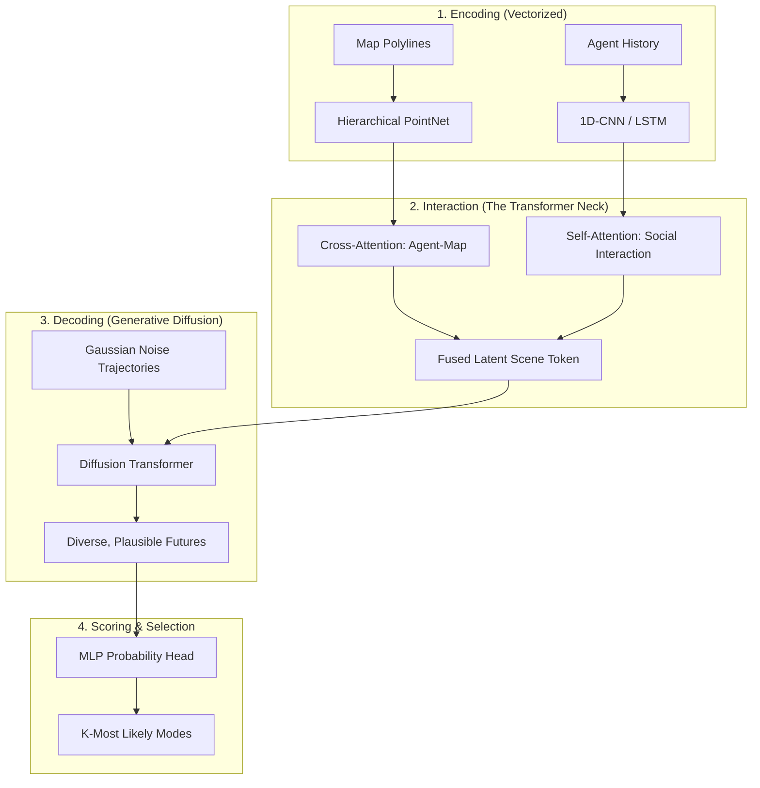

*By Gopi Krishna Tummala*

---

  
The Ghost in the Machine — Building an Autonomous Stack

  

    <a href="/posts/robotics/autonomous-stack-module-1-architecture" style="background: rgba(255,255,255,0.1); padding: 0.5rem 1rem; border-radius: 6px; text-decoration: none; color: white; opacity: 0.9;">Module 1: Architecture</a>
    <a href="/posts/robotics/autonomous-stack-module-2-sensors" style="background: rgba(255,255,255,0.1); padding: 0.5rem 1rem; border-radius: 6px; text-decoration: none; color: white; opacity: 0.9;">Module 2: Sensors</a>
    <a href="/posts/robotics/autonomous-stack-module-3-calibration" style="background: rgba(255,255,255,0.1); padding: 0.5rem 1rem; border-radius: 6px; text-decoration: none; color: white; opacity: 0.9;">Module 3: Calibration</a>
    <a href="/posts/robotics/autonomous-stack-module-4-localization" style="background: rgba(255,255,255,0.1); padding: 0.5rem 1rem; border-radius: 6px; text-decoration: none; color: white; opacity: 0.9;">Module 4: Localization</a>
    <a href="/posts/robotics/autonomous-stack-module-5-mapping" style="background: rgba(255,255,255,0.1); padding: 0.5rem 1rem; border-radius: 6px; text-decoration: none; color: white; opacity: 0.9;">Module 5: Mapping</a>
    <a href="/posts/robotics/autonomous-stack-module-6-perception" style="background: rgba(255,255,255,0.1); padding: 0.5rem 1rem; border-radius: 6px; text-decoration: none; color: white; opacity: 0.9;">Module 6: Perception</a>
    <a href="/posts/robotics/autonomous-stack-module-7-prediction" style="background: rgba(255,255,255,0.25); padding: 0.5rem 1rem; border-radius: 6px; text-decoration: none; color: white; font-weight: 600; border: 2px solid rgba(255,255,255,0.5);">Module 7: Prediction</a>
    <a href="/posts/robotics/autonomous-stack-module-8-planning" style="background: rgba(255,255,255,0.1); padding: 0.5rem 1rem; border-radius: 6px; text-decoration: none; color: white; opacity: 0.9;">Module 8: Planning</a>
    <a href="/posts/robotics/autonomous-stack-module-9-foundation-models" style="background: rgba(255,255,255,0.1); padding: 0.5rem 1rem; border-radius: 6px; text-decoration: none; color: white; opacity: 0.9;">Module 9: Foundation Models</a>
  

  
📖 You are reading <strong>Module 7: The Fortune Teller</strong> — The Evolution of Prediction

---

### Act 0: Prediction in Plain English

Imagine you are standing at a busy crosswalk. You see a teenager looking at their phone, a cyclist pedaling hard toward a yellow light, and an elderly man waiting patiently. 

You don't need a calculator to know that the teenager might step into the street without looking, or that the cyclist is going to try and beat the light. You are **predicting intent**.

In the autonomous vehicle (AV) stack, this is the **Prediction Module**. It is the "Fortune Teller" that looks at the current world and says, "Based on what I see, here are the 3 most likely things that will happen in the next 5 seconds."

*   **Physics Prediction:** Like predicting where a thrown ball will land. Easy.
*   **Behavioral Prediction:** Like predicting where a squirrel will run. Hard.
*   **Interactive Prediction:** Like a high-stakes game of "After you, no after you" at a 4-way stop. The hardest.

---

### Act I: The Age of Innocence (Physics & Kalman Filters)

In the early days, prediction was handled by classical mechanics. The assumption was simple: **Objects in motion stay in motion.**

Using **Kalman Filters**, we estimated state ($p, v$) and predicted the future.
*   **Why it failed:** Physics predicts that a pedestrian standing at a curb ($v=0$) will stay there forever. But a human driver knows they might step out. Physics cannot model **intent**.

---

### Act II: The Vector revolution (QC-Centric Architecture)

By 2023, the industry moved away from "rasterizing" (drawing) the road. Instead, we use **Vectorized Scene Encoding**.

**Landmark Architecture: QCNet (CVPR 2023)**
Instead of a fixed map, the model treats every car as a "Query." 
*   **Translation Invariance:** It doesn't care if you are in SF or London; it only cares about the *relative* distance between you and the lane. This allows one model to drive anywhere in the world.

---

### Act III: Mature Architecture — The Diffusion-Interaction Stack

The "Gold Standard" for 2025 is the **Generative Diffusion Transformer**. This architecture unifies social reasoning with the diversity of generative AI.

**The Prediction Pipeline (2025 SOTA):**

#### Why This Works
1.  **Self-Attention (Social):** Every agent "looks" at every other agent. If Car A speeds up, the model "attends" to that and predicts Car B will brake. This is **Joint Prediction**.
2.  **Cross-Attention (Geometric):** Agents attend to map polylines. The car "queries" the map: *"Which lane can I actually reach from here?"* This snaps predictions to valid roads.
3.  **Diffusion Transformers (DiT):** Instead of one single line, the model generates 100 possible futures and iteratively refines them from noise. This captures the messy, multi-modal nature of human driving (e.g., at a yellow light, will they stop or go?).

#### Trade-offs & Reasoning
*   **Diffusion vs. Gaussian Mixture Models (GMMs):** Earlier models (like Multipath) output a GMM. *Trade-off:* GMMs are fast but suffer from "mode averaging"—if an agent could go left or right, a GMM might average the two and predict "straight" (into a wall). Diffusion is computationally heavier (requires multiple denoising steps) but generates physically plausible, diverse paths without averaging out safe options.
*   **Vector Queries vs. Raster Images:** Rasterizing the scene into an image is simple. *Trade-off:* It wastes massive computation on empty space (asphalt) and is not translation-invariant. Vectorizing elements as Queries is much more efficient and allows the model to generalize to new cities instantly.
*   **Citations:** *Diffusion Planner: Unified Prediction and Planning (ICLR 2025)* and *QCNet: Query-Centric Network for Trajectory Prediction (CVPR 2023)*.

---

### Act IV: System Design & Interview Scenarios

#### Scenario 1: The "Fake" Intent (Conflict Resolution)
*   **Question:** "A car has its left blinker on but is driving in a 'Straight Only' lane. What do you predict?"
*   **Answer:** Discuss **Causal Disentanglement** (CaDeT, CVPR 2024). The model should output two modes: one following the blinker (high risk) and one following the map (high probability). The planner must "hedge" between them.

#### Scenario 2: Evaluation Metrics
*   **Question:** "Is mAP a good metric for prediction?"
*   **Answer:** No. Use **minADE (Minimum Average Displacement Error)** for accuracy and **Miss Rate** for safety. In 2025, we also use **Collision Rate in Simulation** to see if the predicted paths actually cause crashes in a closed loop.

---

### Graduate Assignment: The Multi-Modal Challenge

**Task:**
You are given a scene at a 4-way stop. 
1.  **Social Graph:** Draw the attention weights between three cars waiting at the stop. Which car has the highest "centrality"?
2.  **Generative Logic:** If you run a **Diffusion Decoder**, why is it better than a standard MLP for a car that might either turn left or U-turn?

---

**Further Reading (The "Big Four" Papers):**
*   *QCNet: Query-Centric Network for Trajectory Prediction (CVPR 2023)* - The standard for efficient vectorized interaction.
*   *Diffusion Planner: Unified Prediction and Planning (ICLR 2025)* - Proves that diffusion models outperform regression for motion forecasting.
*   *MotionLM: Motion Forecasting as Language Modeling (ICCV 2023)* - Treats driving as a "token" sequence.
*   *CaDeT: Causal Disentanglement for Robust Prediction (CVPR 2024)* - Solves the generalization problem.

---

**Previous:** [Module 6 — Perception](/posts/robotics/autonomous-stack-module-6-perception)

**Next:** [Module 8 — The Chess Master (Planning)](/posts/robotics/autonomous-stack-module-8-planning)
