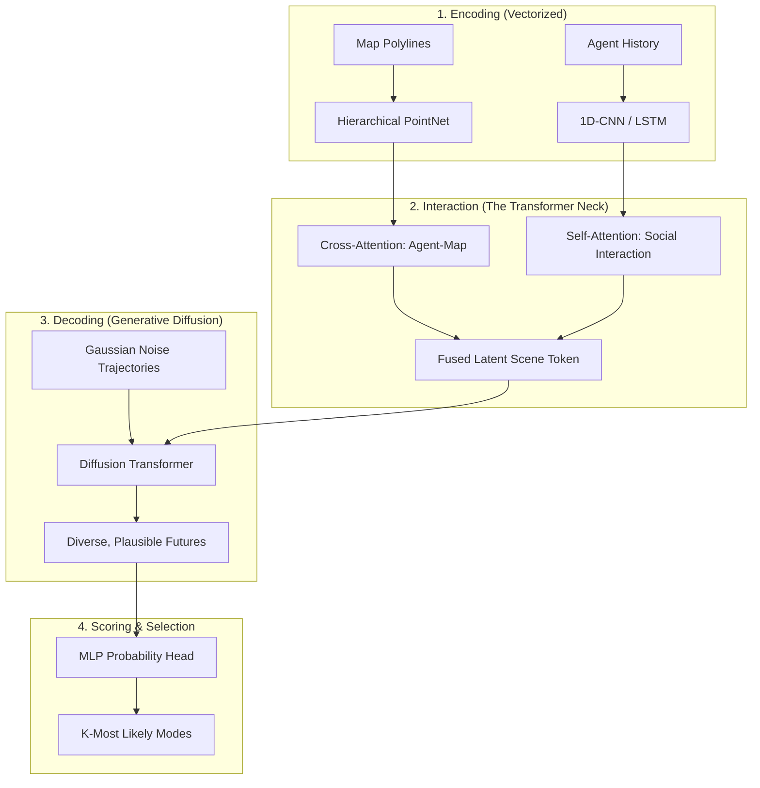
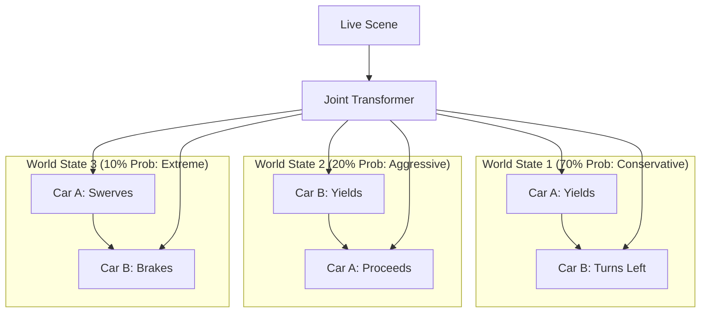

*By Gopi Krishna Tummala*

---

  
The Ghost in the Machine — Building an Autonomous Stack

  

    <a href="/posts/robotics/autonomous-stack-module-1-architecture" style="background: rgba(255,255,255,0.1); padding: 0.5rem 1rem; border-radius: 6px; text-decoration: none; color: white; opacity: 0.9;">Module 1: Architecture</a>
    <a href="/posts/robotics/autonomous-stack-module-2-sensors" style="background: rgba(255,255,255,0.1); padding: 0.5rem 1rem; border-radius: 6px; text-decoration: none; color: white; opacity: 0.9;">Module 2: Sensors</a>
    <a href="/posts/robotics/autonomous-stack-module-3-calibration" style="background: rgba(255,255,255,0.1); padding: 0.5rem 1rem; border-radius: 6px; text-decoration: none; color: white; opacity: 0.9;">Module 3: Calibration</a>
    <a href="/posts/robotics/autonomous-stack-module-4-localization" style="background: rgba(255,255,255,0.1); padding: 0.5rem 1rem; border-radius: 6px; text-decoration: none; color: white; opacity: 0.9;">Module 4: Localization</a>
    <a href="/posts/robotics/autonomous-stack-module-5-mapping" style="background: rgba(255,255,255,0.1); padding: 0.5rem 1rem; border-radius: 6px; text-decoration: none; color: white; opacity: 0.9;">Module 5: Mapping</a>
    <a href="/posts/robotics/autonomous-stack-module-6-perception" style="background: rgba(255,255,255,0.1); padding: 0.5rem 1rem; border-radius: 6px; text-decoration: none; color: white; opacity: 0.9;">Module 6: Perception</a>
    <a href="/posts/robotics/autonomous-stack-module-7-prediction" style="background: rgba(255,255,255,0.25); padding: 0.5rem 1rem; border-radius: 6px; text-decoration: none; color: white; font-weight: 600; border: 2px solid rgba(255,255,255,0.5);">Module 7: Prediction</a>
    <a href="/posts/robotics/autonomous-stack-module-8-planning" style="background: rgba(255,255,255,0.1); padding: 0.5rem 1rem; border-radius: 6px; text-decoration: none; color: white; opacity: 0.9;">Module 8: Planning</a>
    <a href="/posts/robotics/autonomous-stack-module-9-foundation-models" style="background: rgba(255,255,255,0.1); padding: 0.5rem 1rem; border-radius: 6px; text-decoration: none; color: white; opacity: 0.9;">Module 9: Foundation Models</a>
  

  
📖 You are reading <strong>Module 7: The Fortune Teller</strong> — The Evolution of Prediction

---

### Act 0: Prediction in Plain English

Imagine you are standing at a busy crosswalk. You see a teenager looking at their phone, a cyclist pedaling hard toward a yellow light, and an elderly man waiting patiently. 

You don't need a calculator to know that the teenager might step into the street without looking, or that the cyclist is going to try and beat the light. You are **predicting intent**.

In the autonomous vehicle (AV) stack, this is the **Prediction Module**. It is the "Fortune Teller" that looks at the current world and says, "Based on what I see, here are the most likely things that will happen in the next 5 seconds."

*   **Physics Prediction:** Like predicting where a thrown ball will land. Easy.
*   **Behavioral Prediction:** Like predicting where a squirrel will run. Hard.
*   **Interactive Prediction:** Like a high-stakes game of "After you, no after you" at a 4-way stop. The hardest.

---

### Act I: The Age of Innocence (Physics & Kalman Filters)

In the early days, prediction was handled by classical mechanics. The assumption was simple: **Objects in motion stay in motion.**

Using **Kalman Filters**, we estimated state ($p, v$) and predicted the future.
*   **Why it failed:** Physics predicts that a pedestrian standing at a curb ($v=0$) will stay there forever. But a human driver knows they might step out. Physics cannot model **intent**.

---

### Act II: The Vector Revolution (QC-Centric Architecture)

By 2023, the industry moved away from "rasterizing" (drawing) the road. Instead, we use **Vectorized Scene Encoding**.

**Landmark Architecture: QCNet (CVPR 2023)**
Instead of a fixed map, the model treats every car as a "Query." 
*   **Translation Invariance:** It doesn't care if you are in SF or London; it only cares about the *relative* distance between you and the lane. This allows one model to drive anywhere in the world.

---

### Act III: Mature Architecture — The Diffusion-Interaction Stack

The "Gold Standard" for 2025 is the **Generative Diffusion Transformer**. This architecture unifies social reasoning with the diversity of generative AI.

**The Prediction Pipeline (2025 SOTA):**

#### Why This Works
1.  **Self-Attention (Social):** Every agent "looks" at every other agent. If Car A speeds up, the model "attends" to that and predicts Car B will brake. This is **Interaction Modeling**.
2.  **Cross-Attention (Geometric):** Agents attend to map polylines. The car "queries" the map: *"Which lane can I actually reach from here?"* This snaps predictions to valid roads.
3.  **Diffusion Transformers (DiT):** Instead of one single line, the model generates 100 possible futures and iteratively refines them from noise. This captures the messy, multi-modal nature of human driving (e.g., at a yellow light, will they stop or go?).

#### Trade-offs & Reasoning
*   **Diffusion vs. Gaussian Mixture Models (GMMs):** Earlier models output a GMM. *Trade-off:* GMMs are fast but suffer from "mode averaging"—if an agent could go left or right, a GMM might average the two and predict "straight" (into a wall). Diffusion is computationally heavier but generates physically plausible, diverse paths without averaging.
*   **Vector Queries vs. Raster Images:** Rasterizing the scene into an image is simple but wastes computation on empty space. *Trade-off:* Vectorizing elements as Queries is much more efficient and allows the model to generalize to new cities instantly.

---

### Act IV: The Holy Grail — Joint Prediction

In dense urban traffic, agents don't move independently. They **negotiate**. If you predict agents one-by-one, you get "Socially Inconsistent" futures.

#### 1. Marginal vs. Joint Distributions
*   **Marginal Prediction (The Old Way):** $P(Y_A | X)$ and $P(Y_B | X)$. Car A and Car B are predicted in isolation. 
*   **Joint Prediction (The New Way):** $P(Y_A, Y_B, ..., Y_N | X)$. The model predicts the **entire scene** as a single coherent movie.
*   **Why it matters:** In marginal prediction, the model might predict Car A goes straight and Car B turns left, leading to a collision in 2 seconds. A joint model realizes that if Car A goes, Car B *must* yield.

#### 2. Joint Autoregressive Stack (MotionLM Style)
Mature architectures like **MotionLM** treat joint prediction as a language modeling problem.
*   **Tokenization:** Every agent's $t+1$ position is a token. 
*   **Autoregressive Gaussian Decoding:** The model predicts the world state at $t=1$, then feeds that *entire world state* back in to predict $t=2$. This ensures that every agent's next move is conditioned on what everyone else did in the previous millisecond.

#### 3. Multiple World State Propagations
In complex scenes, we "fan out" **entire worlds**.

**Propagations:** The planner sees distinct "Future Movies." This allows the planner to reason: *"In the world where Car B is aggressive, I need to stay 2 meters further back."*

---

### Act V: Advanced Concepts (2025-2026)

#### 1. Intention-Aware Guidance (IMPACT)
Modern models (like **IMPACT**, 2025) jointly predict **high-level intent** (e.g., "yielding," "overtaking") and **low-level trajectories**.
*   This provides a "Semantic Prior." If the model first decides Car A is "yielding," it prunes all trajectories where Car A accelerates into the intersection.

#### 2. Driving Style & Latent Personalities
Recent research integrates "driving style" (aggressive vs. timid) as a latent variable. 
*   **The Mechanism:** The model looks at Car B's past 3 seconds. It sees Car B tailgating. It tags Car B as "Aggressive" and switches to an interaction logic that expects Car B to cut us off.

#### 3. Vectorized Occupancy Flow
Instead of predicting $(x, y)$ lines, we predict **Future Occupancy Flow**.
*   We predict a 3D grid where each cell contains the probability of being occupied AND a 3D velocity vector. This handles "General Obstacles" (like a stroller or a falling ladder) that don't have a defined "heading."

---

### Act VI: 2026 Frontier — Generative World Models

The industry is shifting from "Trajectory Prediction" (lines) to **"World Prediction"** (pixels/voxels). 

**The Concept: Predicting the Future Video**
Models like NVIDIA **Cosmos** or Wayve **GAIA-1** predict the *entire video* of what the world will look like in 5 seconds.

1.  **Implicit Physics:** The model "understands" world physics. If a ball rolls into the street, the predicted "Future Video" includes a child—not because of a rule, but because it has "seen" gravity and human behavior.
2.  **Counterfactual Dreaming:** The AV can "dream" of what happens if it slams the brakes vs. if it swerves. It picks the path that leads to the safest predicted video.

---

### Act VII: The Scorecard — Metrics & Evaluation

Accuracy is measured across **Displacement**, **Diversity**, and **Social Realism** (Waymo/Argoverse 2 standards).

#### 1. The Metrics
*   **minADE / minFDE:** Average/Final distance between ground truth and the **best** of $K$ predictions. 
*   **avgBrierMinFDE:** Displacement error + a penalty $(1-p)^2$ for being overconfident.
*   **Miss Rate (MR):** % of cases where even the best prediction was $>2.0m$ away. 
*   **Soft mAP (Waymo):** Evaluates joint future positions of interacting agents.
*   **Sim Agents Score (Waymax):** Evaluates if trajectories are **kinematically feasible** and **socially realistic**.

#### 2. The Optimizer's Guide — Loss Functions
*   **Variety Loss (Best-of-K):** $\mathcal{L} = \min_{k} \| \mathbf{Y}_{gt} - \hat{\mathbf{Y}}_k \|^2$. Updates only the best head to encourage mode specialization.
*   **Negative Log-Likelihood (NLL):** For GMMs, minimize the probability that truth *couldn't* have come from our distribution.
*   **Interaction Loss:** A penalty term if predicted paths for different agents overlap (social consistency).

---

### Act VIII: System Design & Interview Scenarios

#### Scenario 1: The "Fake" Intent (Conflict Resolution)
*   **Question:** "A car has its left blinker on but is driving in a 'Straight Only' lane. What do you predict?"
*   **Answer:** Discuss **Causal Disentanglement** (CaDeT, 2024). Output two modes: one following the blinker (high risk) and one following the map (high probability). The planner must "hedge" between them.

#### Scenario 2: Latency vs. Horizon
*   **Question:** "You have a 20ms budget. Do you predict 10 agents for 8 seconds, or 100 agents for 2 seconds?"
*   **Answer:** This is an **Interaction Radius** trade-off. For safety, you need a long horizon (8s) for agents in your immediate path. For scene context, you need high density (100 agents) but perhaps at lower resolution. Modern stacks use **Hierarchical Prediction**: High-res for the "Social Circle" (nearest 10 agents), low-res for the rest.

---

### Graduate Assignment: The Bayesian Interaction

**Task:**
A car is at a 4-way stop. 
1.  **Joint Probabilities:** If $P(\text{You Go}) = 0.5$ and $P(\text{He Goes}) = 0.5$, calculate the probability of a "Mutual Yield" (Stall) vs. a "Mutual Go" (Collision) using a Joint Distribution model.
2.  **Social Centrality:** Draw the attention weights between three cars. Which car's behavior "controls" the intersection?

---

**Further Reading (The "Big Four" Papers):**
*   *QCNet: Query-Centric Network for Trajectory Prediction (CVPR 2023)*
*   *Diffusion Planner: Unified Prediction and Planning (ICLR 2025)*
*   *MotionLM: Motion Forecasting as Language Modeling (ICCV 2023)*
*   *IMPACT: Intention-aware Multi-modal Prediction (2025)*

---

**Previous:** [Module 6 — Perception](/posts/robotics/autonomous-stack-module-6-perception)

**Next:** [Module 8 — The Chess Master (Planning)](/posts/robotics/autonomous-stack-module-8-planning)
