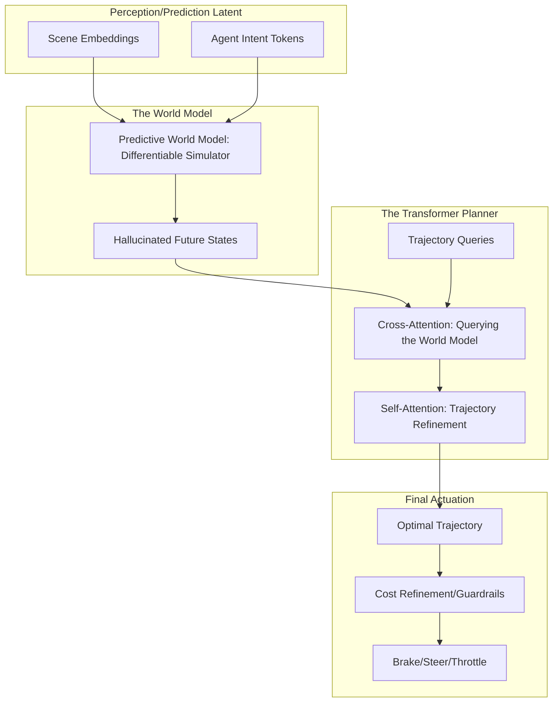

*By Gopi Krishna Tummala*

---

  
The Ghost in the Machine — Building an Autonomous Stack

  

    <a href="/posts/robotics/autonomous-stack-module-1-architecture" style="background: rgba(255,255,255,0.1); padding: 0.5rem 1rem; border-radius: 6px; text-decoration: none; color: white; opacity: 0.9;">Module 1: Architecture</a>
    <a href="/posts/robotics/autonomous-stack-module-2-sensors" style="background: rgba(255,255,255,0.1); padding: 0.5rem 1rem; border-radius: 6px; text-decoration: none; color: white; opacity: 0.9;">Module 2: Sensors</a>
    <a href="/posts/robotics/autonomous-stack-module-3-calibration" style="background: rgba(255,255,255,0.1); padding: 0.5rem 1rem; border-radius: 6px; text-decoration: none; color: white; opacity: 0.9;">Module 3: Calibration</a>
    <a href="/posts/robotics/autonomous-stack-module-4-localization" style="background: rgba(255,255,255,0.1); padding: 0.5rem 1rem; border-radius: 6px; text-decoration: none; color: white; opacity: 0.9;">Module 4: Localization</a>
    <a href="/posts/robotics/autonomous-stack-module-5-mapping" style="background: rgba(255,255,255,0.1); padding: 0.5rem 1rem; border-radius: 6px; text-decoration: none; color: white; opacity: 0.9;">Module 5: Mapping</a>
    <a href="/posts/robotics/autonomous-stack-module-6-perception" style="background: rgba(255,255,255,0.1); padding: 0.5rem 1rem; border-radius: 6px; text-decoration: none; color: white; opacity: 0.9;">Module 6: Perception</a>
    <a href="/posts/robotics/autonomous-stack-module-7-prediction" style="background: rgba(255,255,255,0.1); padding: 0.5rem 1rem; border-radius: 6px; text-decoration: none; color: white; opacity: 0.9;">Module 7: Prediction</a>
    <a href="/posts/robotics/autonomous-stack-module-8-planning" style="background: rgba(255,255,255,0.25); padding: 0.5rem 1rem; border-radius: 6px; text-decoration: none; color: white; font-weight: 600; border: 2px solid rgba(255,255,255,0.5);">Module 8: Planning</a>
    <a href="/posts/robotics/autonomous-stack-module-9-foundation-models" style="background: rgba(255,255,255,0.1); padding: 0.5rem 1rem; border-radius: 6px; text-decoration: none; color: white; opacity: 0.9;">Module 9: Foundation Models</a>
  

  
📖 You are reading <strong>Module 8: The Chess Master</strong> — The Art of Planning

---

### Act 0: Planning in Plain English

Imagine you are playing a high-stakes game of Chess while riding a bicycle through a busy market. 

*   **Perception** tells you where the other people and obstacles are. 
*   **Prediction** tells you where they are *going* to be in 3 seconds. 
*   **Planning** is the "Grandmaster" in your head deciding, "Should I swerve left to avoid the cart, or slow down and wait for the lady with the groceries to pass?"

The Planner has to balance four conflicting goals:
1.  **Safety:** Don't hit anything. (Priority #1)
2.  **Legality:** Follow the rules (Stop at red lights).
3.  **Comfort:** Don't slam the brakes or jerk the wheel.
4.  **Progress:** Actually get to the destination.

If the Planner is too "scared," the car never moves. If it's too "aggressive," it drives like a maniac. The "Art of Planning" is finding the perfect middle ground.

---

### Act I: The Cost Function (How Robots Think)

Humans drive on intuition; robots drive on **Cost Functions**. Imagine the road is covered in "invisible hills" (high cost) and "valleys" (low cost).

*   **High Cost (The Hills):** Hitting a pedestrian (Infinite cost), driving over a curb, jerky steering.
*   **Low Cost (The Valleys):** Staying in the center of the lane, maintaining speed, smooth braking.

The Planner's job is to roll a "marble" (the car) through the deepest valleys.
$$J_{total} = w_1(\text{Safety}) + w_2(\text{Comfort}) + w_3(\text{Progress}) + w_4(\text{Legality})$$

> **Interview Pro-Tip:** If an interviewer asks how to handle a "stalled vehicle on a double-yellow line," talk about **Cost Relaxation**. The cost of crossing a double-yellow is high, but the cost of "infinite wait" (zero progress) eventually becomes higher. The car "decides" to break a small rule to satisfy a larger goal.

---

### Act II: Classical Planning (MPC & Lattice)

#### 1. Model Predictive Control (MPC)
MPC is like a "rolling window" of decisions. 
1.  Look ahead 5 seconds.
2.  Find the best path for those 5 seconds.
3.  Execute only the *first* 100ms.
4.  Repeat.
This allows the car to constantly adjust to new information.

#### 2. Frenet Lattice Planning
Instead of $(x, y)$ coordinates, we use **$s$** (distance along the road) and **$d$** (lateral offset from center). 
*   *Pros:* Simplifies the math. "Stay in lane" just means $d=0$.
*   *Cons:* Fails in intersections or parking lots where there is no "center line."

---

#### Act II.V: Mature Architecture — The Neural Planner

In modern end-to-end and hybrid stacks (Tesla FSD v12, Wayve), planning has evolved from a series of "If-Then" rules to **Learned Differentiable Planners**. These architectures use **World Models** to simulate outcomes before taking action.

**The Planning Pipeline (Mature Architecture):**

##### 1. Querying the Future
How does a neural network "decide" where to go? 
*   **The Mechanism:** The planner generates a set of "Trajectory Queries"—potential paths the car could take. 
*   **Cross-Attention:** These queries attend to the **World Model's** predicted future. Each query "asks": *"If I take this path, how likely am I to collide with the hallucinated pedestrian in 2 seconds?"*
*   **The Selection:** The model weights the trajectories based on safety and progress, selecting the "cleanest" path through the latent space.

##### 2. Differentiable Cost Functions
Unlike old-school planners where we hand-tuned weights, mature architectures use **Learned Cost Functions**. 
*   The model is trained on millions of hours of expert human driving. It "learns" the cost of discomfort or illegality by trying to minimize the difference between its chosen path and the human's path (**Imitation Learning**).

##### 3. Trade-offs & Reasoning
*   **Hand-Tuned Rules vs. Imitation Learning:** A classic C++ planner requires thousands of "If-Else" rules (e.g., *If pedestrian distance < 5m, brake*). *Trade-off:* It is perfectly interpretable and debuggable, but it fails in complex, unscripted situations (like a 4-way stop with aggressive drivers). Neural Planners (Imitation Learning) scale naturally with data and handle complex interactions smoothly. *Trade-off:* They act as "Black Boxes" and can suffer from the "Causal Confusion" problem—learning the wrong correlation (e.g., "always slow down near tall buildings" instead of "slow down because tall buildings hide pedestrians").
*   **Citations:** *ChauffeurNet: Learning to Drive by Imitating the Best and Synthesizing the Worst (Waymo 2019)* and *Planning-oriented Autonomous Driving (UniAD CVPR 2023)*.

---

### Act III: The Great Divergence (Modular vs. End-to-End)

There is a philosophical war in AV right now.

#### Team Modular (Waymo, Aurora)
**Philosophy:** "Explainable AI."
*   *How:* Separate boxes for Perception → Prediction → Planning.
*   *Pros:* If it makes a mistake, you know exactly why. Easy to "fix" a specific rule.

#### Team End-to-End (Tesla FSD v12, Wayve)
**Philosophy:** "Muscle Memory."
*   *How:* One giant Neural Network. Pixels in → Steering out.
*   *Pros:* Feels very human. Can handle weird scenarios (like a man in a chicken suit) that programmers didn't write rules for.
*   *Cons:* "Black Box." If it fails, you can't "patch" it; you have to find more training data.

---

### Act IV: 2025 Trends — LLMs & World Models

#### 1. Chain-of-Thought Planning
Modern planners are using **Large Language Models (LLMs)** to "think out loud" before acting. 
*   *Example:* "I see a ball roll into the street. A ball implies a child. I will slow down now even though I don't see the child yet." 

#### 2. Differentiable World Models
Companies like **Wayve** and **Tesla** are building "simulators inside the car's brain." The planner "hallucinates" 1,000 possible futures and picks the one where it doesn't crash.

---

### Act V: System Design & Interview Scenarios

#### Scenario 1: The "Frozen Robot" Problem
*   **Question:** "Your car is at a 4-way stop. It's your turn, but an aggressive human driver keeps inching forward. Your car is stuck. How do you fix this?"
*   **Answer:** Mention **Nudging & Intent Signaling**. The planner shouldn't just wait; it should slowly "creep" forward to signal its intention to take the right-of-way. This is a "Game Theory" problem.

#### Scenario 2: Ethics vs. Safety (The Trolley Problem)
*   **Question:** "The car must choose between hitting a dog or swerving into a parked car. What do you do?"
*   **Answer:** **Avoid the "Ethics Trap."** In real engineering, we use **Hierarchical Costs**. Collision with a moving object (dog) is high cost, but "unpredictable swerving" into a fixed object is also high risk. We prioritize **Predictability**. The safest move is usually to brake hard in your own lane.

#### Scenario 3: Validation
*   **Question:** "How do you prove an End-to-End planner is safe for public roads?"
*   **Answer:** Discuss **Shadow Mode** (running the model in the background without it controlling the car) and **Formal Verification** (checking if the neural network's outputs ever violate hard safety "guardrails" written in C++).

---

### Graduate Assignment: The Merging Challenge

**Task:**
You are merging onto a 65mph highway from an on-ramp. 
1.  **The Interaction:** If you speed up to match a gap, the car in that gap might speed up too (the "Gap Closer"). How do you model this **Interaction** in your cost function?
2.  **The Logic:** Draw a state machine for "Merging." Include states for "Gap Selection," "Alignment," and "Abort."
3.  **The Edge Case:** What if the on-ramp is too short to reach 65mph? How do you balance the "Comfort" cost vs. the "Safety" cost of merging slowly?

---

**Further Reading:**
*   *Optimal Trajectory Generation for Dynamic Street Scenarios (ICRA 2010)*
*   *Model Predictive Control: Theory and Practice (Tutorial)*
*   *Learning to Drive in a Day (Wayve, 2018)*
*   *Tesla AI Day 2022: Motion Planning*

---

**Previous:** [Module 7 — Prediction](/posts/robotics/autonomous-stack-module-7-prediction)

**Next:** [Module 9 — Foundation Models](/posts/robotics/autonomous-stack-module-9-foundation-models)
