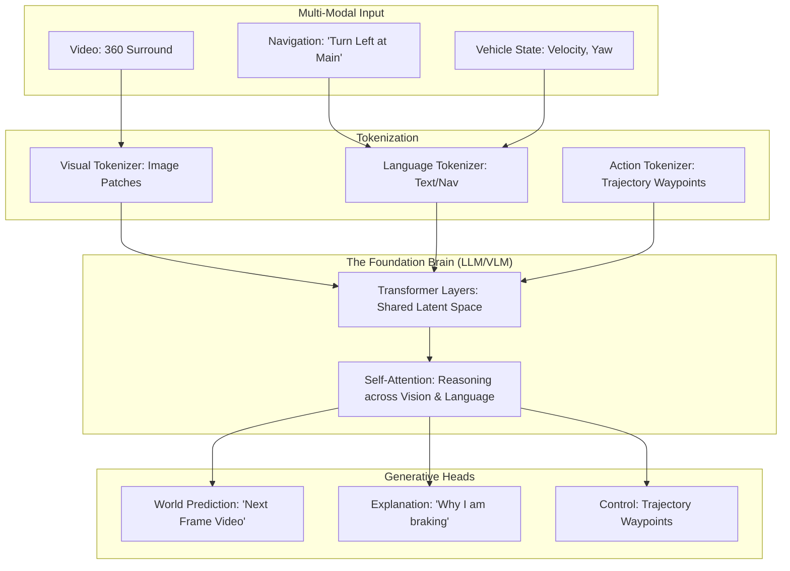

*By Gopi Krishna Tummala*

---

  
The Ghost in the Machine — Building an Autonomous Stack

  

    <a href="/posts/robotics/autonomous-stack-module-1-architecture" style="background: rgba(255,255,255,0.1); padding: 0.5rem 1rem; border-radius: 6px; text-decoration: none; color: white; opacity: 0.9;">Module 1: Architecture</a>
    <a href="/posts/robotics/autonomous-stack-module-2-sensors" style="background: rgba(255,255,255,0.1); padding: 0.5rem 1rem; border-radius: 6px; text-decoration: none; color: white; opacity: 0.9;">Module 2: Sensors</a>
    <a href="/posts/robotics/autonomous-stack-module-3-calibration" style="background: rgba(255,255,255,0.1); padding: 0.5rem 1rem; border-radius: 6px; text-decoration: none; color: white; opacity: 0.9;">Module 3: Calibration</a>
    <a href="/posts/robotics/autonomous-stack-module-4-localization" style="background: rgba(255,255,255,0.1); padding: 0.5rem 1rem; border-radius: 6px; text-decoration: none; color: white; opacity: 0.9;">Module 4: Localization</a>
    <a href="/posts/robotics/autonomous-stack-module-5-mapping" style="background: rgba(255,255,255,0.1); padding: 0.5rem 1rem; border-radius: 6px; text-decoration: none; color: white; opacity: 0.9;">Module 5: Mapping</a>
    <a href="/posts/robotics/autonomous-stack-module-6-perception" style="background: rgba(255,255,255,0.1); padding: 0.5rem 1rem; border-radius: 6px; text-decoration: none; color: white; opacity: 0.9;">Module 6: Perception</a>
    <a href="/posts/robotics/autonomous-stack-module-7-prediction" style="background: rgba(255,255,255,0.1); padding: 0.5rem 1rem; border-radius: 6px; text-decoration: none; color: white; opacity: 0.9;">Module 7: Prediction</a>
    <a href="/posts/robotics/autonomous-stack-module-8-planning" style="background: rgba(255,255,255,0.1); padding: 0.5rem 1rem; border-radius: 6px; text-decoration: none; color: white; opacity: 0.9;">Module 8: Planning</a>
    <a href="/posts/robotics/autonomous-stack-module-9-foundation-models" style="background: rgba(255,255,255,0.25); padding: 0.5rem 1rem; border-radius: 6px; text-decoration: none; color: white; font-weight: 600; border: 2px solid rgba(255,255,255,0.5);">Module 9: Foundation Models</a>
  

  
📖 You are reading <strong>Module 9: The Unified Brain</strong> — The Foundation Model Revolution

---

### Act 0: Foundation Models in Plain English

For 10 years, we built self-driving cars like a team of specialists. One person only looked for cars, another only looked for lanes, and another decided where to turn. They were fast, but they didn't talk to each other very well. 

**Foundation Models** (like GPT-4, but for cars) are like one "Super-Brain" that has read every driving manual, seen every dashcam video, and understands common sense.

*   **Modular Stack:** "I see a red octagon. That is a stop sign. I should brake."
*   **Foundation Model:** "I see a school bus with flashing lights. It's 3 PM. There are probably children nearby. I should stop and be extra careful, even if I don't see a child yet."

It moves the car from "following rules" to "understanding the world."

---

### Act I: The Hybrid Architecture (Think Fast / Think Slow)

Modern AVs don't use just one model. They use a dual-process system inspired by human psychology (Daniel Kahneman):

1.  **System 1 (Think Fast):** The **Sensor Fusion Encoder**. It's the car's "reflexes." It handles the 99% of easy driving (lane keeping, speed control) at 30+ frames per second.
2.  **System 2 (Think Slow):** The **Driving VLM (Vision-Language Model)**. It's the car's "deliberation." It handles the 1% of hard cases (a police officer waving you through a red light) by "thinking" about the scene.

#### The Magic Decoder
The **World Decoder** takes the fast reflexes and the slow reasoning and merges them into one safe trajectory. It ensures that the "Slow Brain" doesn't hallucinate a path through a brick wall.

---

#### Act I.V: Mature Architecture — The Vision-Language-Action (VLA) Model

The cutting edge of research (Waymo's **EMMA**, Tesla's **World Model**) is moving toward a unified **Vision-Language-Action (VLA)** architecture. In this setup, every sensor reading and every action is turned into a common language: **Tokens**.

**The VLA Pipeline (Mature Architecture):**

##### 1. Everything is a Token
How do foundation models bridge the gap between "pixels" and "steering"?
*   **Visual Tokens:** Instead of high-res images, the model sees "patches" of pixels turned into numbers (embeddings).
*   **Action Tokens:** Trajectories are discretized. Just as an LLM predicts the next "word," a driving foundation model predicts the next "waypoint token." 
*   **EMMA (Waymo):** Proved that you can actually represent $(x, y)$ coordinates as plain text digits (e.g., `"0.83, 0.01"`) and the LLM will "learn" to drive just by predicting the next string of numbers.

##### 2. The Power of Self-Attention
*   **Reasoning:** Self-attention allows the visual tokens (the pixels showing a ball in the road) to "attend" to the language tokens (the world knowledge that balls are followed by children). 
*   **Emergent Behavior:** The model doesn't need a specific "Ball Rule." It has seen enough data to "know" that this specific pattern of pixels implies a future risk.

---

### Act II: The Sensor Fusion Encoder (Mid-Level Fusion)

In the past, we merged sensor data at the end (**Late Fusion**). Now, we merge it in the middle (**Mid-Fusion**) using Transformers.
*   **How:** We turn Lidar points, Radar waves, and Camera pixels into "tokens" (like words in a sentence) and let a Transformer find the relationships between them.
*   **Pros:** Much more accurate. Lidar's 3D shape helps the Camera's color understanding.
*   **Cons:** Hard to debug. If the car sees a "ghost," which sensor caused it? (This is the **Traceability** problem).

---

### Act III: EMMA — Everything as Language

Waymo's **EMMA** (2024) is a radical experiment: What if we treat driving as a text problem?
*   **Input:** Video.
*   **Output:** Text string like `"0.83, 0.01, 2.67 ..."` (the path waypoints).
*   **Why?** Because Large Language Models (LLMs) already know a lot about the world. By putting driving into "token space," the car inherits all that "common sense" pre-training.

---

### Act IV: The Data Engine (The Flywheel)

Foundation models are the secret sauce for **Auto-Labeling**. 
1.  A "Teacher" model (giant, offline) labels millions of hours of driving data.
2.  A "Student" model (small, fast) learns from the Teacher.
3.  The car gets smarter every day without humans manually drawing boxes around cars. This is the **Data Flywheel**.

---

### Act V: System Design & Interview Scenarios

#### Scenario 1: LLM Latency
*   **Question:** "LLMs are slow (tokens take seconds). How do you use them in a car moving at 70mph?"
*   **Answer:** Discuss **Speculative Decoding** or the **Asynchronous Hybrid** approach. The "Fast Path" (C++) always runs at 10ms. The LLM runs in the background at 500ms and "nudges" the costs/rules for the Fast Path. It doesn't control the steering directly.

#### Scenario 2: Hallucinations
*   **Question:** "What if your VLM hallucinates a green light that isn't there?"
*   **Answer:** Mention **Safety Guardrails**. We never let the VLM have the final say. Its output is passed through a **Geometric Checker** (using Lidar/Radar) that says, "Wait, the VLM says 'Go,' but the Radar sees a truck in the way. Reverting to Safe Stop."

#### Scenario 3: The Data Flywheel
*   **Question:** "How do you find 'interesting' data to improve your Foundation Model?"
*   **Answer:** **Active Learning.** Use the "Disagreement" method: Run two different models. Where they disagree most is where you need more data. Label those frames and retrain.

---

### Act VI: World Models (Sora for Cars)
The newest trend (2025-2026) is **Generative World Models**. 
*   **What:** The car predicts not just a path, but the *entire video* of the future. 
*   **Why:** It allows the car to "dream" of accidents and learn how to avoid them in simulation without ever crashing in real life. 

---

### Graduate Assignment: The Teacher-Student Pipeline

**Task:**
You are building an auto-labeling pipeline.
1.  **The Teacher:** You have a 100-Billion parameter VLM that is too slow to run on a car.
2.  **The Student:** You have a 1-Billion parameter model that runs on the car.
3.  **The Pipeline:** Describe how you use the Teacher to find "Long Tail" edge cases (e.g., a person on a unicycle) and teach the Student to recognize them.
4.  **The Validation:** How do you prove the Student is "smarter" after the training without just checking mAP?

---

**Further Reading:**
*   *EMMA: End-to-End Multimodal Model (arXiv 2024)*
*   *Wayve: GAIA-1 A Generative World Model for Autonomous Driving*
*   *Tesla AI Day 2022/2023: Occupancy & Foundation Models*
*   *UniAD: Planning-oriented Autonomous Driving (CVPR 2024)*

---

**Previous:** [Module 8 — Planning](/posts/robotics/autonomous-stack-module-8-planning)

*This concludes "The Ghost in the Machine" series. The future of AV is no longer about better sensors, but about better brains.*
