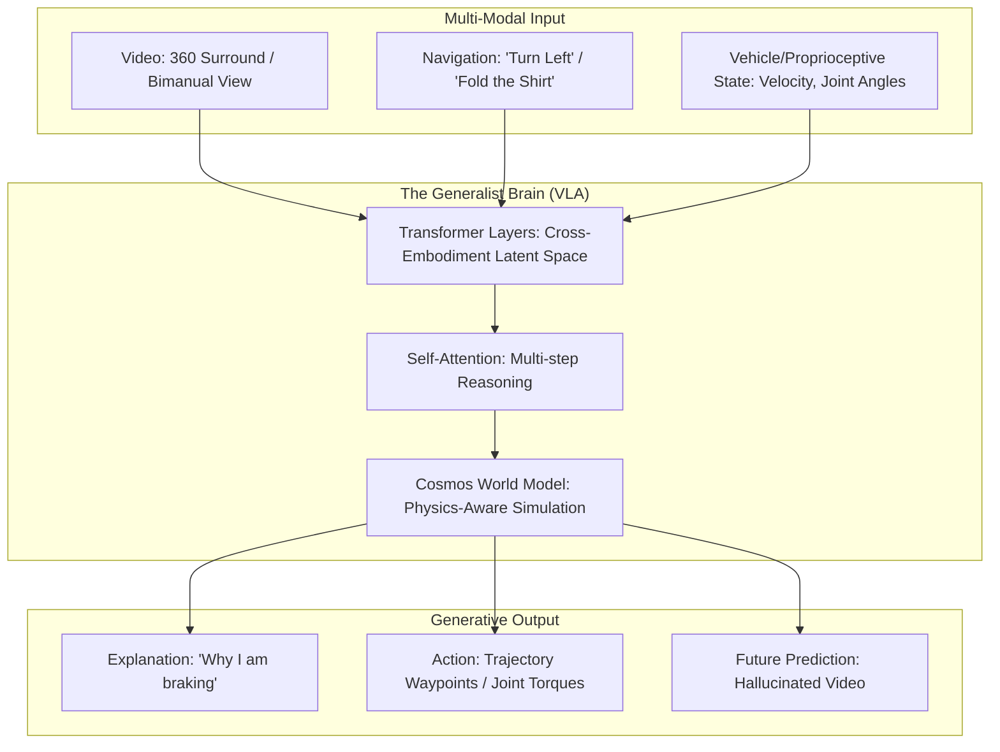

*By Gopi Krishna Tummala*

---

  
The Ghost in the Machine — Building an Autonomous Stack

  

    <a href="/posts/robotics/autonomous-stack-module-1-architecture" style="background: rgba(255,255,255,0.1); padding: 0.5rem 1rem; border-radius: 6px; text-decoration: none; color: white; opacity: 0.9;">Module 1: Architecture</a>
    <a href="/posts/robotics/autonomous-stack-module-2-sensors" style="background: rgba(255,255,255,0.1); padding: 0.5rem 1rem; border-radius: 6px; text-decoration: none; color: white; opacity: 0.9;">Module 2: Sensors</a>
    <a href="/posts/robotics/autonomous-stack-module-3-calibration" style="background: rgba(255,255,255,0.1); padding: 0.5rem 1rem; border-radius: 6px; text-decoration: none; color: white; opacity: 0.9;">Module 3: Calibration</a>
    <a href="/posts/robotics/autonomous-stack-module-4-localization" style="background: rgba(255,255,255,0.1); padding: 0.5rem 1rem; border-radius: 6px; text-decoration: none; color: white; opacity: 0.9;">Module 4: Localization</a>
    <a href="/posts/robotics/autonomous-stack-module-5-mapping" style="background: rgba(255,255,255,0.1); padding: 0.5rem 1rem; border-radius: 6px; text-decoration: none; color: white; opacity: 0.9;">Module 5: Mapping</a>
    <a href="/posts/robotics/autonomous-stack-module-6-perception" style="background: rgba(255,255,255,0.1); padding: 0.5rem 1rem; border-radius: 6px; text-decoration: none; color: white; opacity: 0.9;">Module 6: Perception</a>
    <a href="/posts/robotics/autonomous-stack-module-7-prediction" style="background: rgba(255,255,255,0.1); padding: 0.5rem 1rem; border-radius: 6px; text-decoration: none; color: white; opacity: 0.9;">Module 7: Prediction</a>
    <a href="/posts/robotics/autonomous-stack-module-8-planning" style="background: rgba(255,255,255,0.1); padding: 0.5rem 1rem; border-radius: 6px; text-decoration: none; color: white; opacity: 0.9;">Module 8: Planning</a>
    <a href="/posts/robotics/autonomous-stack-module-9-foundation-models" style="background: rgba(255,255,255,0.25); padding: 0.5rem 1rem; border-radius: 6px; text-decoration: none; color: white; font-weight: 600; border: 2px solid rgba(255,255,255,0.5);">Module 9: Foundation Models</a>
  

  
📖 You are reading <strong>Module 9: The Unified Brain</strong> — The 2026 Embodied Revolution

---

### Act 0: Foundation Models in Plain English

For 10 years, we built self-driving cars like a team of specialists. One person only looked for cars, another only looked for lanes, and another decided where to turn. They were fast, but they didn't talk to each other very well. 

**Foundation Models** (like GPT-4, but for robots) are like one "Super-Brain" that has read every driving manual, seen every dashcam video, and understands common sense.

*   **Modular Stack:** "I see a red octagon. That is a stop sign. I should brake."
*   **Foundation Model:** "I see a school bus with flashing lights. It's 3 PM. There are probably children nearby. I should stop and be extra careful, even if I don't see a child yet."

In 2026, this concept has expanded beyond cars. We are now building **Generalist Robot Brains** that can drive a car, fold laundry, and walk on two legs using the same underlying architecture.

---

### Act I: The Hybrid Architecture (Think Fast / Think Slow)

Modern AVs don't use just one model. They use a dual-process system inspired by human psychology (Daniel Kahneman):

1.  **System 1 (Think Fast):** The **Sensor Fusion Encoder**. It's the car's "reflexes." It handles the 99% of easy driving (lane keeping, speed control) at 30+ frames per second.
2.  **System 2 (Think Slow):** The **Driving VLM (Vision-Language Model)**. It's the car's "deliberation." It handles the 1% of hard cases (a police officer waving you through a red light) by "thinking" about the scene.

#### The Magic Decoder
The **World Decoder** takes the fast reflexes and the slow reasoning and merges them into one safe trajectory. It ensures that the "Slow Brain" doesn't hallucinate a path through a brick wall.

---

#### Act I.V: Mature Architecture — The Vision-Language-Action (VLA) Model

The cutting edge of 2026 (NVIDIA **GR00T N1**, Physical Intelligence **Pi0**) has moved toward a unified **Vision-Language-Action (VLA)** architecture. In this setup, every sensor reading and every action is turned into a common language: **Tokens**.

**The VLA Pipeline (2026 Generalist Design):**

##### 1. Everything is a Token
How do foundation models bridge the gap between "pixels" and "steering"?
*   **Action Tokens:** Instead of just predicting words, models like **GR00T** and **Pi0** predict "Action Tokens"—discretized motor commands or trajectory waypoints.
*   **Cross-Embodiment Training:** Models are now trained on data from cars, humanoid robots, and robotic arms simultaneously. The "Brain" learns the general physics of the world, making it much more robust to "Long Tail" edge cases.

##### 2. The Power of World Models (Cosmos & GAIA)
In 2026, we don't just predict a path; we predict the **Future Video**. 
*   **The Mechanism:** Using models like NVIDIA **Cosmos**, the robot "dreams" of what will happen if it takes a certain action. If the "dream" ends in a crash, it picks a different action. This is **Generative Simulation**.

---

### Act II: Physical AI & Field Foundation Models

The shift in 2026 is from "Internet AI" to **Physical AI**. 

#### 1. Field Foundation Models (FieldAI)
Companies like **FieldAI** have introduced models that drive in "Open World" environments without GPS or pre-computed HD maps. 
*   **Innovation:** These models use **Depth-Specific Foundations (DeFM)** to understand 3D geometry directly from blurry camera feeds, making them "risk-aware" in rugged, off-road, or snowy conditions.

#### 2. Self-Improving Embodied Models
We are now moving beyond **Behavioral Cloning** (imitating humans). Modern stacks use **Reinforcement Fine-Tuning (RFT)** where the robot tries actions in simulation, sees what works, and updates its own weights.

---

### Act III: The 2026 Industry Survey

Recent surveys (July 2025, *arXiv* and April 2025, *IJRR*) categorize the explosion of foundation models into four pillars:

| Pillar | Key Tech (2026) | Goal |
| :--- | :--- | :--- |
| **Perception** | DeFM / 3D Open-Vocab | Zero-shot detection of *anything* (e.g., a person in a chicken suit). |
| **Reasoning** | Chain-of-Thought (EMMA) | Explaining *why* the robot is stopping. |
| **Control** | VLA (RT-3 / GR00T) | Mapping high-level goals to millisecond-level motor torques. |
| **Simulation** | Generative World Models | Dreaming of rare edge cases to train the model without crashing real cars. |

---

### Act III.V: The Scorecard — Foundation Metrics & Training

Foundation models (VLM/VLA) aren't evaluated like standard detectors. We measure their **Reasoning Depth** and their **Execution Success**.

#### 1. The Metrics (The Generalist's KPI)
*   **VQA Accuracy (Vision-Question Answering):** We ask the model: *"Is that pedestrian looking at their phone?"* Success is measured by how accurately the model's text reasoning matches the ground truth labels.
*   **SR (Task Success Rate):** In embodied AI, the only metric that matters is: *"Did the robot complete the command?"* (e.g., "Park behind the blue van").
*   **Token Perplexity:** Measures how "surprised" the model is by new driving data. Low perplexity means the model has a strong internal "World Model."
*   **Human Preference Score:** Used in 2026 to evaluate VLA models. Human experts rank two different "dreams" (predicted future videos) to see which one looks more like realistic physics.

#### 2. The Loss Functions (How the Brain is Sculpted)
*   **Next-Token Prediction (Cross-Entropy):** The bread and butter of foundation models. We minimize the error in predicting the next "Word" or "Action Token."
    $$\mathcal{L}_{LLM} = -\sum \log P(\text{token}_{t} | \text{token}_{<t})$$
*   **Action Regression Loss:** For continuous actions (like steering angle or joint torques), we use **L1 or L2 Loss** to match the expert's motor commands.
*   **DPO (Direct Preference Optimization):** Used to align the model with safety. We show the model two scenarios (one safe, one risky) and use DPO to "steer" the neural weights toward the safe preference without needing a complex reward function.
*   **Video Diffusion Loss:** For world models (like Cosmos), the loss is the difference between the **Hallucinated Video** and the **Real Video**, usually measured in a "Latent Space" to ensure visual realism and physical consistency.

---

### Act IV: System Design & Interview Scenarios

#### Scenario 1: Humanoid-AV Convergence
*   **Question:** "Why would you train an autonomous driving model on data from a 2-legged humanoid robot?"
*   **Answer:** Discuss **Shared World Physics**. Both need to understand gravity, momentum, and collision avoidance. Humanoid data provides rich examples of **Dexterous Interaction** and **Dynamic Balance** that can help an AV handle extreme emergency swerves or interaction with pedestrians.

#### Scenario 2: The Trustworthiness Debate
*   **Question:** "A Foundation Model is a 'Black Box'. How do you ensure a 2026 VLA model is safe for public roads?"
*   **Answer:** Mention **Probabilistic Guardrails**. We use a **Deterministic Safety Layer** (C++) that runs in parallel. If the VLA model's output violates a physics constraint (e.g., "don't drive into that solid wall"), the C++ layer overrides it. Safety is non-negotiable.

#### Scenario 3: Real-Time VLA Latency
*   **Question:** "Generalist VLAs like GR00T are huge. How do you run them at 50Hz?"
*   **Answer:** **Model Distillation.** We use a giant "Teacher" model to label data and train a tiny, hyper-optimized "Student" model (e.g., using **NVIDIA TensorRT-LLM**) that fits on the car's onboard chip.

---

### Graduate Assignment: The Generalist Challenge

**Task:**
You are building a generalist VLA model for a fleet of delivery drones and sidewalk robots.
1.  **Shared Latent Space:** Explain why using a "Universal Tokenizer" for both air and ground actions is better than having two separate models.
2.  **Zero-Shot Adaptation:** Your robot sees a "Snow-Covered Bollard" for the first time. How does the **World Knowledge** from its pre-training on YouTube videos help it identify this as an obstacle?
3.  **Self-Correction:** Describe a **Closed-Loop Reasoning** path where the robot tries to pick up a package, fails, and uses its VLM to "reason" about why the grip slipped.

---

**Further Reading (2025-2026 Landmarks):**
*   *Foundation Model Driven Robotics: A Comprehensive Review (arXiv July 2025)*
*   *NVIDIA Cosmos: The Next Generation of World Models (2026)*
*   *Pi0: Next-Generation Generalist Robot Learning (Physical Intelligence 2025)*
*   *Field Foundation Models: Risk-Aware Autonomy in the Wild (FieldAI 2025)*
*   *The Future of Research in Cognitive Robotics (IJRR Dec 2025)*

---

**Previous:** [Module 8 — Planning](/posts/robotics/autonomous-stack-module-8-planning)

*This concludes "The Ghost in the Machine" series. We have moved from simple sensors to unified brains—the embodied intelligence revolution has only just begun.*
